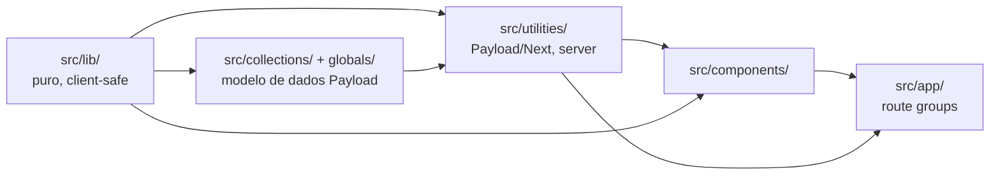
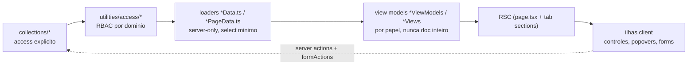

# Arquitetura do Teqo

O mapa conceitual do repositório: como o sistema se divide, em que direção o código depende, por onde os dados fluem e quais decisões estruturais estão travadas. O guia OPERACIONAL (setup, seeds, deploy, convenções de segurança do Payload) continua em [`AGENTS.md`](../AGENTS.md); o "porquê" de produto vive em [`PRODUCT.md`](../PRODUCT.md), [`docs/CUSTOMER.md`](CUSTOMER.md) e [`docs/research/`](research/). Última reengenharia: **Pass 2** (2026-07-25, tracker em [`IMPROVE-CODE-QUALITY-PLAN.md`](IMPROVE-CODE-QUALITY-PLAN.md)).

## Contexto de sistema

Um único app Next.js (App Router) + Payload CMS sobre um Postgres (Neon em produção, Docker local), hospedado na Vercel. Três produtos em três route groups, com **duas barreiras de autenticação independentes** que podem coexistir no mesmo navegador:

| Route group  | Produto                                     | Auth                                                                                                         |
| ------------ | ------------------------------------------- | ------------------------------------------------------------------------------------------------------------ |
| `(frontend)` | Site público (notícias, petições, WhatsApp) | anônimo; ISR + tag caching                                                                                   |
| `(payload)`  | Admin editorial `/admin`                    | collection `users`, cookie `payload-token`                                                                   |
| `(campaign)` | Ferramenta interna `/campanha`              | collection `campaignUser`, cookie próprio `campaign-token` (path `/campanha`); barreira no layout de `(app)` |

Donations ficam FORA do app (QueroApoiar). Dados eleitorais TSE são importados por seeds locais e servidos por artefato commitado + collections cacheadas — o build da Vercel **nunca** depende de conteúdo do banco além de rodar `payload migrate`.

## Camadas e a regra de dependência

- **`src/lib/`** — lógica pura e dados estáticos, importável de client e server: catálogos (`municipalityCatalog`, `bahiaTerritories`, geometrias TopoJSON), schemas zod (`lib/schemas/*`), helpers puros (`phone`, `slug`, `wordStartFilter`, `voteEstimate`, `electionFormat`, `voteTrend`), constantes client-safe (`campaignConsentKeys`, `campaignRoles`), artefato TSE (`electionAggregates/` + `bahiaElectionAggregates.ts`). `lib/` **nunca importa de `utilities/`** (as 9 inversões históricas foram zeradas no Pass 2 W2).
- **`src/utilities/`** — código acoplado a Payload/Next. Loaders que tocam banco ou `unstable_cache` são marcados **`import 'server-only'`** na primeira linha (21 marcados no Pass 2). Módulos de UI-helper client-safe (ex.: `municipalityListUrl`, `supporterUi`) ficam aqui sem a marca por importarem apenas TIPOS do Payload.
- **`src/collections/` + `src/globals/`** — o modelo de domínio É o Payload. Toda collection declara `access` explicitamente; hooks passam `req` (transação) — ver `AGENTS.md` e `.cursor/rules/security-critical.mdc`.
- **`src/components/campaign/`** — subpastas por domínio (Pass 2 W2): `municipality/ activity/ supporter/ leadership/ advisor/ demand/ organization/ stateDeputy/ votePledge/ invite/ map/ dashboard/ auth/ shell/ shared/`. `shared/` é o sistema transversal (listas, tabela, comboboxes); `shell/` é o chrome do app (sidebar, nav, PWA).
- **Atravessando a fronteira client:** um client component nunca importa um módulo de dados de servidor por VALOR. Tipos/constantes compartilhados vivem num módulo de contrato client-safe — precedentes: `municipalityMapContract.ts` (mapa), `votePledgeViews.ts` (matemática de pledges; loaders em `votePledgeData.ts` são `server-only`), `lib/campaignRoles.ts` (predicados de role para a sidebar — a fonte da qual `utilities/access/shared.ts` deriva). `import type` é sempre seguro.

## Fluxo de dados de uma página `/campanha`

- **Leituras** passam `user` + `overrideAccess: false` (bypass admin só documentado, ex. resolução de nomes sobre linhas já checadas).
- **Escritas** saem de server actions em `src/app/(campaign)/campanha/actions/*`; multi-collection = transação Payload com `req: { transactionID }`. As `formActions.ts` por rota são cascas finas sobre os wrappers compartilhados: `runCampaignFormAction` (fica na página, estado de sucesso/erro) e `runCampaignRedirectFormAction` (cria e redireciona) em `campaignFormActionError.ts` — exceções documentadas nos próprios arquivos (planos, apoiadores/[id], convite login).
- **Listas** usam o sistema do Pass 2 W1: parse/canonicalização de URL em `campaignListUrl.ts` (+ módulo por domínio, ex. `municipalityListUrl.ts`), colunas como dado em `CampaignTable` (`shared/CampaignTable.tsx`, seams `mandatory`/`defaultVisible` para B17), shells `CampaignSearchForm`/`CampaignFilterChips`/`CampaignListFooter`/`CampaignListEmptyState`/`CampaignListPagination`, pending compartilhado via `CampaignListPendingBoundary` (dima o RESULTADO, não o controle — princípio "Feel the action"). Contrato de URL congelado (B18 depende).
- **Páginas de detalhe** roteiam tabs por querystring (`detailTabUi.ts` → `municipalityDetailTabUi`/`activityDetailTabUi`); cada tab é uma section RSC própria colocada na rota (`MunicipalityDetailTabs.tsx`, `ActionPlanOverviewTab.tsx`), streamando atrás de `Suspense` quando a leitura é pesada.

## Escada de caching (decidir nesta ordem)

1. **React `cache()`** — dedup por request de leituras repetidas na mesma árvore RSC (`loadMunicipalityScope`, `getCampaignUser`, `loadMunicipalityGoalAccount`).
2. **`unstable_cache` + tag** — dados imutáveis/lentos entre requests (abas de eleições sob a tag `election-tse`; busta via `POST /api/revalidate?tag=…`, allowlist em `revalidateRequest.ts`). Auth SEMPRE fora do core cacheado.
3. **Artefato commitado por script re-rodável** — dados derivados imutáveis (`pnpm build:election-aggregates` → `src/lib/electionAggregates/`, `pnpm build:geometries`). Nunca computar artefato durante `pnpm build`.
4. **Nunca** cachear longo dado vivo de campanha 2026 (pledges, expectedVotes) sem invalidação no caminho de escrita. `/campanha` é dinâmico com auth — o site público é quem usa ISR (`posts` tag etc.).

## RBAC da campanha

Papéis em `campaignUser.role` — predicados client-safe em `lib/campaignRoles.ts`, checks de ator em `utilities/access/shared.ts`, regras por domínio em `utilities/access/*` (re-exportadas por `campaignAccess.ts`):

| Papel         | Escopo                                                                                                                       |
| ------------- | ---------------------------------------------------------------------------------------------------------------------------- |
| `coordinator` | tudo (staff irrestrito); único que importa CSV de apoiadores e gerencia assessores (com `candidate`)                         |
| `candidate`   | visibilidade irrestrita (staff); elegível como assessor responsável                                                          |
| `advisor`     | staff restrito aos municípios em `municipality.advisors`                                                                     |
| `leader`      | **lockdown**: home = ferramenta de contatos; lê só apoiadores que criou; sem municípios/pledges/demandas/atividades/eleições |

Assimetria estrutural de pledge: staff registra `declaredVotes` + `estimatedVotes` (3 cenários); a liderança **nunca** vê estimativas (view models por papel; agregados usam `estimated[S] ?? declared`, default `central`).

## Bounded contexts e linguagem ubíqua

Dois contexts principais + um de suporte, espelhados nos prefixos de módulo e nas subpastas de componentes:

**Campanha (`/campanha`)** — núcleo do produto:

- **Município** — a unidade operacional PREDEFINIDA (435 no catálogo: 416 municípios; Salvador em 19 zonas; Camaçari inteiro). ≠ município IBGE genérico; geografia é read-only, estratégia é editável. Sinônimos históricos mortos: Núcleo, Praça (copy varrida no Pass 2 W4f; só migrations congeladas e textos provisórios de consent do Onda 0 ainda dizem "Praça").
- **Liderança** — ficha única por pessoa (`contact` UNIQUE), atua em N municípios/organizações; pode ter conta `leader`.
- **Pledge (compromisso de votos)** — por liderança×município; `declaredVotes` (staff-entered, visível à liderança) vs `estimatedVotes` (staff-only, 3 cenários: `pessimistic|central|optimistic`).
- **Conta da cadeira (E8)** — vocabulário staff-only: _válidos projetados_, _teto do campo_, _captura_, _share intracampo_, _roll-off_, _meta_ (`expectedVotes[cenário] ?? meta sugerida`), _cobertura da meta_ (`comprometido ÷ meta`, comprometido = SÓ pledges). Glossário do usuário em `/campanha/conceitos` (`lib/campaignIntelligenceConcepts.ts`).
- **Demanda** — pedido de material/serviço, staff-only, escalada decidida por coordinator/candidate. **Atividade** — evento/agenda ancorado em UM município (renomeada de "Plano de Ação" pelo C13 em 2026-07-25). **Apoiador** — join `Contact`↔campanha (consent LGPD fail-closed por chave estável). **Dobradinha** — deputado estadual parceiro (`stateDeputy`). **Assessor responsável** — carteira em `municipality.advisors`.
- **Contact** é o registro normalizado de PESSOA compartilhado com o site público — features novas criam JOINS para `contact`, nunca uma segunda tabela de pessoa.

**Site público (`(frontend)`)** — `post`/`tag` (taxonomia com `hidden` fail-closed para o período eleitoral), `petition`/`signature`, `subscription`, `consent` (versionado, resolvido por `key` estável). Cache ISR sob a tag `posts`.

**Dados eleitorais (TSE)** — `electionTally`/`electionCandidateVote`/`electionCandidate` (2014/2018/2022), lidos pelas abas de eleições e pelo artefato de agregados; nunca persiste CPF/título.

## Log de decisões estruturais

| Data       | Decisão                                                                                                                                                                                                                                                                                                                       |
| ---------- | ----------------------------------------------------------------------------------------------------------------------------------------------------------------------------------------------------------------------------------------------------------------------------------------------------------------------------- |
| 2026-07-16 | Auth da campanha isolada do admin: collection `campaignUser` + cookie `campaign-token` com path próprio                                                                                                                                                                                                                       |
| 2026-07-23 | Toda collection declara `access` explícito; default do Payload tratado como bug (JWT de campanha alcança `/api/*`)                                                                                                                                                                                                            |
| 2026-07-23 | Município como unidade operacional predefinida (remodel destrutivo aplicado em produção)                                                                                                                                                                                                                                      |
| 2026-07-23 | Agregados TSE imutáveis viram artefato commitado; build da Vercel não depende de conteúdo do banco                                                                                                                                                                                                                            |
| 2026-07-25 | **Pass 2 D1:** NO-GO em `src/domains/` e ports-and-adapters; GO em convenções + correções de fronteira + subpastas por domínio DENTRO de `components/campaign/`; subpastas em `utilities/` adiadas (gatilho: 3º módulo novo de um domínio num mês) — [decisao-arquitetura-dominios.md](plans/decisao-arquitetura-dominios.md) |
| 2026-07-25 | **Pass 2 D2:** matemática de insights da era núcleos DELETADA (`electionInsights.ts`); E10 nasce em módulo novo com classificação relativa                                                                                                                                                                                    |
| 2026-07-25 | **Pass 2 W1/D5:** listas de tabela no sistema compartilhado (colunas como dado); exceções documentadas: atividades (cards), `TerritoryOverviewTable` (sort client, ≤27 linhas), comparação de candidatos, LeaderContacts, preview de import                                                                                   |
| 2026-07-25 | **Pass 2 W2:** dedup por POLÍTICA continua valendo (wrappers nomeados como `runCampaignFormAction`), nunca plumbing genérico de dados; aliases de access `canUpdateX = canReadX` são declarações de política deliberadas                                                                                                      |
| 2026-07-25 | **Pass 2 W4b:** knip `exports`/`types`/`enumMembers` em ERROR no CI; tests fazem parte do grafo; kit `ui/` sem peças mortas (shadcn re-adiciona sob demanda)                                                                                                                                                                  |
| 2026-07-25 | **C13:** vocabulário do produto é lei no código — "Plano de Ação" → **Atividade** (`activity`), rename completo (entidade, banco, rota, copy) por migration data-preserving escrita à mão; termo velho banido pelo guard de convenções em `src`+`tests`+`scripts`                                                             |

## Manutenção deste documento

Atualize na mesma entrega que mover camadas, criar um context novo ou tomar uma decisão estrutural — junto com o mapa compacto do agente em `.cursor/rules/codebase-map.mdc` (convenção: os dois andam no MESMO PR).
