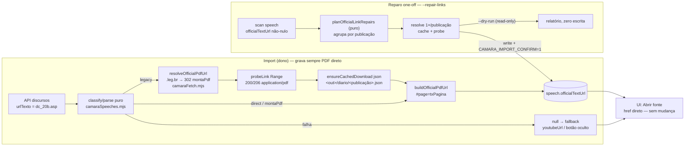

# Impl: Acervo de falas: "Abrir fonte" abre o PDF oficial do Diário (fim do visualizador legado)

Status: aprovado
Atualizado em: 2026-09-14
Issue: #988
Intenção: docs/plans/acervo-abrir-fonte-pdf-oficial.md
Appetite restante: herdado (~1 dia eng + uma passada de máquina de resolução; sem migration)

## Leitura da intenção

- **Outcome:** toda fala do acervo entrega "Abrir fonte" apontando para o PDF oficial do Diário em `https://imagem.camara.leg.br/Imagem/d/pdf/<narquivo>` (`#page=<página>` quando a URL legada tinha `txPagina`); reimport/backfill não reintroduz `dc_20b.asp`/`dc_20.asp`/`montaPdf.asp`; o reparo dos discursos já importados roda com guard de escrita, é idempotente e reporta cobertura (falas/datas atualizadas, falhas). A página do acervo nunca depende da Câmara para renderizar.
- **O que NÃO negociar:**
  - Destino é o **PDF direto** (não o visualizador legado, não o `montaPdf` intermediário, não YouTube como padrão); resolver **offline/cacheado**, uma resolução por publicação compartilhada pelas falas daquela data.
  - Falha de resolução **não entrega link morto**: cai no fallback existente (`youtubeUrl`; sem ele, botão oculto) e o relatório lista a data como pendência.
  - Reparo com **guard de escrita** (`CAMARA_IMPORT_CONFIRM=1` via `requiresWriteConfirm`), read-only isento (`--coverage`/`--verify-links`; `--dry-run` novo), reexecutável; cache/report em `data/camara/` (gitignored desde C152).
  - Sem reimportar ASR/LLM, sem tocar VOD (`vodPlaybackUrl`/`vodDownloadUrl`), sem novo campo/segundo link, sem mudar crédito CC BY nem URL pública do acervo.
- **O que reavaliar (hipóteses da "Direção no codebase"):**
  - _Consumidores do link_ (`SpeechResultCard.tsx:125-130`, detalhe `[id]/page.tsx:63,121-128`): **nenhuma mudança de UI** — o href é direto (`sourceUrl = officialTextUrl ?? youtubeUrl` em `speechViewModels.ts:221`/`:249`). Os arquivos são referência de leitura, não de escrita.
  - _Estender `--verify-links`/`--coverage`_: reavaliado para um corte menor — o **`--repair-links --dry-run` é o verificador read-only** (scan + classificação + plano, sem rede quando tudo é direto); a resolução do reparo já verifica cada PDF com Range antes de gravar (D3/D5).
  - _Quando rodar o reparo_ (intenção recomendou após o merge, assumido): reavaliado para **pré-merge no SHA do branch**, precedente C155/OPS79 — a reparação é script-only (não depende do deploy) e assim o PR carrega a prova viva; o runbook §C160 executa igual se o operador preferir pós-merge (D8).
  - _Falha → `null`_: vale para o **write path do import**; no reparo, escrever `null` destruiria a única pista da pendência e tiraria a linha do scanner — o reparo deixa a linha intocada e sai vermelho (D4).

**Fatos de código e medição (2026-09-14):**

| Verificação                  | Resultado                                                                                                                                                                                                                                         |
| ---------------------------- | ------------------------------------------------------------------------------------------------------------------------------------------------------------------------------------------------------------------------------------------------- |
| Gravação atual               | `scripts/import-camara-speeches.mjs:468` — `officialTextUrl: speech.urlTexto ?? null` (bundle :458-484; upsert :487). Nenhum outro writer; único ponto do link                                                                                    |
| Consumers                    | `speechViewModels.ts:39/78/221/249`; `SpeechResultCard.tsx:125-130`; `[id]/page.tsx:63,121-128`                                                                                                                                                   |
| Legado no repo               | nenhuma referência a `dc_20`/`montaPdf`/`narquivo` em `src/` ou `tests/`; `camaraSpeeches.mjs` não tem nada de URL oficial                                                                                                                        |
| Infra reusável               | `ensureCachedDownload` (`cli.mjs:190-228`; `ext` json devolve parseado); `probeVodLink` (`camaraFetch.mjs:129`); guard `assertWriteAllowed` (:870-878) + `assertLocalDatabase` (:894); `writeReport` (:614); precedente `recover-media.mjs:79-85` |
| e2e                          | `tests/e2e/campaignSpeechAcervo.e2e.spec.ts:44` usa URL fictícia e asserta "Abrir fonte" — **não muda** (manifest cobre `src/utilities/speech`, `scripts/lib/e2e-affected-manifest.mjs:279-285`)                                                  |
| URL legada real              | `https://imagem.camara.gov.br/dc_20b.asp?largura=&altura=&tipoForm=diarios&selCodColecaoCsv=D&Datain=8%2F2%2F2023&txPagina=73&txSuplemento=&enviar=Pesquisar`                                                                                     |
| Hop 1 `.gov.br` → `.leg.br`  | 302 com a mesma query; ~135s no teste frio (intenção mediu 25–85s)                                                                                                                                                                                |
| Hop 2 `.leg.br` → `montaPdf` | 302 `montaPdf.asp?narquivo=DCD0020230208000210000.PDF&npagina=73`; ~5,4s; `set-cookie` ASP                                                                                                                                                        |
| PDF direto                   | `https://imagem.camara.leg.br/Imagem/d/pdf/DCD0020230208000210000.PDF` → 206 `application/pdf` em 0,4s com Range `0-1023` (~43,6 MB)                                                                                                              |
| Fragmento                    | `#page=73` = `txPagina` legado / `npagina` do redirect                                                                                                                                                                                            |
| Exemplos resolvidos          | 25/06/2020 → `DCD0020200625001020000.PDF#page=129`; 28/09/2011 → `DCD28SET2011.pdf` (ano antigo, nome curto); 10/03/2026 → `DCD0020260310000250000.PDF`                                                                                           |
| `narquivo`                   | **não derivável da data** (número do Diário fora da URL); só seguindo o redirect — por isso a resolução é cacheada por publicação                                                                                                                 |

## Abordagem recomendada

Evoluir o **dono** do acervo (C153/C155) com (1) normalização do link no write path do import e (2) um modo de reparo one-off no mesmo CLI, com resolução cacheada por publicação e verificação do PDF antes de gravar.

**Opções consideradas:** A) estender o dono (`import-camara-speeches.mjs` + `camaraSpeeches.mjs`/`camaraFetch.mjs`) com normalização no `processSpeech` e modo `--repair-links [--dry-run]`; B) script separado `repair-camara-links.mjs` + normalização só no import; C) re-importar tudo com `--all` para corrigir o campo; D) resolver no render/clique.
**Recomendação:** A — um CLI, um cache, um guard, um relatório; o reparo reusa bootstrap/`loadCliEnv`/`writeReport`/`ensureCachedDownload` e o import reusa a mesma resolução.
**Rejeitadas:** B — twin que duplica bootstrap, guard, cache e a sabedoria da Câmara (dois lugares para o mesmo bug); C — custo de ASR/LLM e risco de regressão em dados bons (o escopo é só o link); D — latência de 5–135s ou pendura no request do usuário e acopla o render à Câmara.

### Decisões de engenharia

#### D1 — Dono único: normalização no import + modo de reparo no mesmo CLI (barato; a decisão que importa é não criar twin)

- **Opções:** A) `--repair-links` no `import-camara-speeches.mjs` + normalização em `processSpeech`; B) script novo de reparo; C) reparo via `--all` re-importando tudo; D) SQL manual no runbook.
- **Recomendação:** A — o import é o dono do campo desde a C153; o reparo é "o mesmo pipeline sem ASR/LLM": varre `speech` com `officialTextUrl` não-nulo (`overrideAccess: true`, `pagination: false`, `select` mínimo), agrupa por publicação, resolve uma vez por grupo, atualiza só quem muda. Nenhuma escrita fora de `speech.officialTextUrl`.
- **Rejeitadas:** B — segundo CLI para o mesmo conhecimento (flags, guard, cache, host rewrite) = drift; C — reexecuta página de evento/VOD/ASR (custo e risco) para corrigir um campo; D — sem idempotência, sem relatório e sem guard.

#### D2 — Resolução pela cadeia de redirect, com host reescrito (caro: é a única fonte do `narquivo`)

- **Opções:** A) seguir o redirect HTTP com `fetch` (`redirect: 'follow'`; `response.url` final = `montaPdf.asp?narquivo=…&npagina=…`) e parsear `narquivo`/`npagina`; reescrever `.gov.br` → `.leg.br` antes do lookup (fallback para a URL original); B) derivar o nome do PDF da data; C) raspar o HTML/meta-refresh do `montaPdf`; D) pedir a URL pronta à API.
- **Recomendação:** A — medido: o `narquivo` só aparece depois do 302, e `response.url` entrega o `montaPdf` sem parsear HTML; o rewrite pula o hop de ~135s (medido) e o fallback cobre a exceção. Validação de host na URL final (`imagem.camara.leg.br`) para não seguir redirect fora da Câmara (fail-closed, precedente de origem restrita do `recover-media`).
- **Rejeitadas:** B — provado impossível (o número do Diário não está na URL); C — frágil (meta-refresh muda) e desnecessário com `response.url`; D — não existe endpoint para isso na API open-data.

#### D3 — Resolução cacheada e verificada (barato, semântica de cache importa)

- **Opções:** A) `ensureCachedDownload` (ext `json`) com `cacheDir: <out>/diario`, chave por publicação (`date + collection + supplement`), `download` injetado que segue o redirect **e** prova o PDF com Range (`200/206 application/pdf`) antes de devolver o buffer — falha lança, então **nada é cacheado**; cache só guarda sucesso; B) cache próprio em memória; C) sem cache (uma resolução por fala); D) cachear também falhas.
- **Recomendação:** A — padrão explícito do dono (`ensureCachedDownload` em `cli.mjs:190`), uma chamada de rede por publicação/ever, sobrevive a reexecuções e o `--dry-run` aquece o cache do write. Generalizar `probeVodLink` → `probeLink(url, …)` com `contentType` no retorno (um helper HTTP de probe para VOD e PDF; o único call site existente é o `--verify-links`).
- **Rejeitadas:** B — re-resolve a cada run (a reparação seria repetida ~700×); C — uma chamada por fala (997×) e o import de um dia pagaria o mesmo hop de novo; D — veneno de cache: uma falha transitória bloquearia o reparo para sempre.
- **Forma do JSON cacheado:** `{ archiveFileName, page, finalUrl, checkedAt }` (auditoria; identifiers em inglês, o `narquivo` da Câmara vira `archiveFileName`); o fragmento `#page` é montado por fala, nunca cacheado.

#### D4 — Semântica de falha nos dois write paths (caro: dado real)

- **Opções:** A) import: falha → `officialTextUrl = null` (fallback existente), **preservando** `existing.officialTextUrl` se já for direto; reparo: falha → **não escreve** a linha, reporta a publicação e o run termina vermelho, reexecutável; B) `null` nos dois; C) manter o legado nos dois; D) falha silenciosa.
- **Recomendação:** A — no import (execução autônoma) o aceite manda nada de link morto → fallback (`youtubeUrl`; sem ele, botão oculto), com falha `stage: 'official-link'` no relatório; no reparo (sessão de operador) escrever `null` destruiria a única pista da pendência e removeria a linha do scanner — a linha fica intocada, o run sai 1 e a próxima passada é idempotente. Preservar o direto anterior em falha evita que um reimport com rede ruim apague um reparo bom.
- **Rejeitadas:** B no reparo — perde a pista e a capacidade de retry; C — viola o aceite "reimport não reintroduz o legado"; D — inaceitável (o relatório é o produto da operação).

#### D5 — Verificação read-only pós-reparo: o menor corte (barato)

- **Opções:** A) `--repair-links --dry-run` como aceite (conta `diretas`/`legadas`/`desconhecidas`, lista datas pendentes; sem rede quando tudo é direto) + a verificação de PDF embutida na resolução (D3); B) estender `--verify-links` para probe-ar `officialTextUrl`; C) modo novo `--verify-official <n>`; D) coluna `legacyTextUrl` no `--coverage`.
- **Recomendação:** A — determinístico, sem rede, sem guard, e já é o veículo do relatório; a reachability do PDF é provada na própria resolução (`probeLink` antes de cachear/gravar), então um probe de amostra não adiciona garantia nova (o PDF é estático; o VOD, que é regenerável, continua coberto pelo `--verify-links`).
- **Rejeitadas:** B — muda a semântica da amostra de VOD (rows sem VOD e com oficial ficariam de fora) e duplica o que a resolução já prova; C — cerimônia; D — redundante com o dry-run (revisitar se um dia houver série histórica de saúde do link).

#### D6 — Guard do modo de reparo (caro: fail-closed)

- **Opções:** A) `--repair-links --dry-run` = read-only (exige só `DATABASE_URL`); `--repair-links` = write, passa por `assertWriteAllowed` (`CAMARA_IMPORT_CONFIRM=1` quando `NODE_ENV=production`/host não-local/`ALLOW_REMOTE_DB`) e por `assertLocalDatabase`; B) read-only por padrão + `--apply` para escrever; C) escrever sempre que `--repair-links` for passado.
- **Recomendação:** A — vocabulário existente do CLI (o modo é a ação; a flag de ambiente é a intenção), precedente literal de `recover-media` e do próprio import; `--dry-run` sem `--repair-links` morre no parse; `--repair-links` não combina com `--all/--date/--legislature/--coverage/--verify-links` nem com `--limit`/`--skip-transcribe`/`--reclassify`.
- **Rejeitadas:** B — diverge do CLI atual (`--all` já escreve com guard) sem ganho de segurança; C — perde o dry-run barato e o planejamento.

#### D7 — Testes proporcionais (barato)

- **Opções:** A) unit dos puros novos com as URLs reais medidas + int do estado do import; B) e2e/CLI com rede; C) nenhum teste novo; D) extrair `parseArgs` para teste.
- **Recomendação:** A — os puros (`classifyOfficialTextUrl`, `parseLegacyOfficialUrl`, `parseMontaPdfUrl`, `buildOfficialPdfUrl`, `publicationCacheKey`, `planOfficialLinkRepairs`) são exatamente onde a regra frágil mora e falham em silêncio sem teste; o int do `speechImport` ganha a asserção do `officialTextUrl` no `findSpeechImportState`; o e2e `campaignSpeechAcervo` existente **não muda** (a URL fictícia e o assert "Abrir fonte" continuam) e roda selecionado pelo manifest (`src/utilities/speech`).
- **Rejeitadas:** B — flaky, depende da Câmara e não prova a regra; C — o classifier/grouper são a parte que erra; D — desproporcional (fill-in futuro se a CLI crescer).

#### D8 — Onde e quando o reparo roda (caro: dado real; ordem documentada)

- **Opções:** A) pré-merge no homeserver, checkout `~/teqo-backfill` no SHA do branch, dry-run → write → dry-run (precedente C155/OPS79), com o resultado no PR; B) pós-merge/deploy no SHA de main (recomendação assumida da intenção); C) junto do próximo import.
- **Recomendação:** A — o reparo **não depende do deploy** (script-only; nenhuma migration), então rodar antes do merge entrega a prova viva no PR e fecha a Issue com produção já reparada; o guard é o mesmo e a passada é idempotente. O runbook §C160 documenta a mesma sequência para reexecução pós-merge, se preferirem.
- **Rejeitadas:** B — deixa a janela "mergeado e Issue fechada com o legado no ar" dependente de um operador não agendado, sem prova viva no PR; C — acopla um defeito de UI à janela do próximo import.

### Componentes / mudanças

| Arquivo                                     | Mudança                                                                                                                                                                                                                                                                                                                                                                                                                                                                                                                                                                                                                                          |
| ------------------------------------------- | ------------------------------------------------------------------------------------------------------------------------------------------------------------------------------------------------------------------------------------------------------------------------------------------------------------------------------------------------------------------------------------------------------------------------------------------------------------------------------------------------------------------------------------------------------------------------------------------------------------------------------------------------ |
| `scripts/lib/camaraSpeeches.mjs` (puro)     | `classifyOfficialTextUrl(raw)` → `none\|direct\|legacy\|montaPdf\|unknown`; `isLegacyDiarioUrl(raw)` (shape legado mesmo malformado); `parseLegacyOfficialUrl(raw)` → `{ lookupUrl (.gov.br→.leg.br), publication {date ISO, collection, supplement}, page }`; `parseMontaPdfUrl(raw)` → `{ archiveFileName, page }`; `buildOfficialPdfUrl(archiveFileName, page)` → `/Imagem/d/pdf/<archiveFileName>[#page=]`; `officialTextUrlFallback(existingUrl)` (preserva só PDF direto); `publicationCacheKey(publication)` (filesystem-safe); `planOfficialLinkRepairs(rows)` → `{ groups, directUpdates, alreadyDirect, unknown, unresolvable, none }` |
| `scripts/lib/camaraFetch.mjs` (HTTP)        | `resolveOfficialPdfUrl(legacyUrl, { timeoutMs: 180_000, attempts: 2 })` — parse estrito (fail-closed se não for link legado), rewrite do host, `redirect: 'follow'`, lê `response.url`, valida host Câmara, parseia `montaPdf`/PDF direto, retorna `{ archiveFileName, page, pdfUrl, finalUrl }`, lança em falha; renomear `probeVodLink` → `probeLink` (mesmo comportamento + campo `contentType`; único call site em `--verify-links`)                                                                                                                                                                                                         |
| `scripts/import-camara-speeches.mjs` (dono) | `--repair-links` + `--dry-run` no `parseArgs`/`HELP`/`modeLabel`; normalização em `processSpeech` (classifica/parseia/resolve com `ensureCachedDownload` em `<out>/diario`; falha → `null` preservando direto anterior; `report.officialLink`; falha `stage:'official-link'`); `runRepairLinks` (scan/plan/resolve/update/relatório `repair-links-<runAt>.json`); hint do guard aponta §C155/§C160                                                                                                                                                                                                                                               |
| `src/utilities/speech/speechImport.ts`      | `SpeechImportState.officialTextUrl` (select + retorno) para a preservação em falha; nenhuma outra semântica muda                                                                                                                                                                                                                                                                                                                                                                                                                                                                                                                                 |
| `tests/unit/camaraSpeeches.unit.spec.ts`    | Unit dos 6 puros com as URLs reais (legada `.gov.br`, `.leg.br`, `montaPdf`, PDF direto, ano curto, `null`/desconhecida; datas `2023-02-08`/`2020-06-25`; páginas 73/129)                                                                                                                                                                                                                                                                                                                                                                                                                                                                        |
| `tests/int/speechImport.int.spec.ts`        | Asserção de `officialTextUrl` no `findSpeechImportState` (bundle com URL direta)                                                                                                                                                                                                                                                                                                                                                                                                                                                                                                                                                                 |
| `docs/ops/teqo-1313-deploy.md`              | Nova `## C160 — reparo do link oficial do acervo (PDF direto do Diário)`: pré-requisitos, dry-run → write → dry-run, esperado, rollback, comportamento medido da Câmara                                                                                                                                                                                                                                                                                                                                                                                                                                                                          |
| `docs/changelog/2026-09-14-c160.md` (novo)  | Entrada curta com os números medidos na passada de produção                                                                                                                                                                                                                                                                                                                                                                                                                                                                                                                                                                                      |

Sem migration, sem schema, sem access, sem UI, sem package.json (`pnpm camara:import` existe), sem Consent. `data/camara/` já é gitignored (`.gitignore:77`); o cache novo é `data/camara/diario/`.

### Dados → forma (relatórios)

- **Import (delta no relatório C153/C155):** por fala, `officialLink: 'none'|'direct'|'resolved'|'failed'|'unknown'` (fill-in de nome); falha entra em `failures[]` com `stage: 'official-link'` e mensagem. O `speechLine`/stdout pode mostrar `link oficial resolvido`/`link oficial falhou` — sem contadores novos obrigatórios.
- **Reparo (`repair-links-<runAt>.json`, `<out>/reports/`):**
  - `scanned` (falas com `officialTextUrl` não-nulo), `withoutLink` (total `speech` − scanned), `alreadyDirect`, `unknown[]` (id + url, intocados);
  - `publications[]`: `{ key, lookupUrl, archiveFileName, state: 'resolved'|'failed', rows, pages[], error? }`;
  - `unresolvable[]`: legados malformados (ficam intocados e o write sai 1 — nenhum link legado pode permanecer);
  - `updates[]`: `{ id, speechAt, legislature, previousUrl, nextUrl }` (planejado no dry-run; aplicado no write);
  - `totals`: `{ legacy, updated, failedPublications, failedRows, remainingLegacy }`; `dryRun`, `runAt`, `elapsedMs`, `options`.
- **Stdout:** `falas: N com link (D diretas, L legadas em P publicações, U desconhecidas); M sem link` → `publicações: R resolvidas, F falhas` → `dry-run: L seriam atualizadas` / `atualizadas: L; legadas restantes: 0`. Falhas listadas com `key`/data/erro.
- **Destino:** JSONs no homeserver (`/srv/hdd/backups/teqo-camara/reports/`), nada commitado; resumo no corpo do PR, no changelog e no runbook.

## Fases verificáveis

1. **Puros + unit (≈0,25 dia).** Implementar os 6 helpers em `camaraSpeeches.mjs` e os unit com as URLs reais medidas. _Prova:_ `pnpm test:unit` verde (casos novos), `pnpm lint`, `pnpm typecheck`. _Quota:_ ~150 linhas no lib + ~120 no spec.
2. **Rede + import (≈0,25 dia).** `resolveOfficialPdfUrl` + `probeLink`; normalização em `processSpeech`; `SpeechImportState.officialTextUrl`. _Prova local (`teqo_wt160`):_ `pnpm camara:import --date <dia real> --limit 1` → linha com PDF direto (`#page`), sem falha `official-link`; reexecução = `cache hit` e mesmo valor. Se a rede workstation→Câmara estiver instável, o smoke real vira a Fase 4 (homeserver). _Quota:_ ~60 linhas em `camaraFetch` + ~60 no import + ~4 no `speechImport`.
3. **Reparo (≈0,25 dia).** Modo `--repair-links`/`--dry-run`, `planOfficialLinkRepairs` no caminho, relatório e guards. _Prova local:_ fixture com a URL legada real → dry-run não escreve (valores intactos); write → linha vira PDF direto; 2ª passada = 0 updates/`remainingLegacy: 0`; URL desconhecida vira `unknown` sem escrita; falha de publicação força exit 1 no write (e 0 no dry-run). _Quota:_ ~120 linhas + ~40 no int.
4. **Ops em produção (pré-merge; ≈1h preparo + ~1h de resolução + ~10min).** Após push do branch: `~/teqo-backfill` no SHA do branch, `pnpm install`, envs de `~/stack/.env` + `~/stack/teqo-1313.env`, `DATABASE_URL` reescrito para o proxy `127.0.0.1:5433`, `--out /srv/hdd/backups/teqo-camara`. Passos: `--repair-links --dry-run` (mede falas/legadas/publicações; 0 falhas esperadas; aquece o cache) → `CAMARA_IMPORT_CONFIRM=1 pnpm camara:import --repair-links` → `--repair-links --dry-run` (**0 legadas**) → `pnpm camara:import --coverage` (acervo íntegro). _Prova:_ JSONs + números no PR.
5. **Fechamento (≈0,5h).** Runbook §C160 + changelog com os números medidos; `pnpm gate:fast`, `pnpm test:int`, e2e `campaignSpeechAcervo` (selecionado pelo manifest de `src/utilities/speech` — preservado, sem mudanças); `pnpm push`; PR `Closes #988` + auto-merge. _Quota:_ 1 PR; prova: check `checks` verde.

## Rabbit holes / Não escopo (engenharia)

- Espelhar PDFs no Garage, baixar o Diário, gerar clipes — **não** (intenção corta).
- Resolver no `render`/clique ou cache HTTP na página — **não**; resolução offline por publicação.
- Nova migration/campo/segundo link, UI, Consent, access — **não**; o `officialTextUrl` é o mesmo campo.
- Estender `--verify-links`/`--coverage` para link oficial, modo `--verify-official`, probe periódico — **não** (D5).
- Fórmula para o `narquivo`, crawler do Diário, fallback de meta-refresh — **não**; o redirect é a fonte.
- Generalizar o resolver para o Senado/comissões/outras publicações — **não**.
- Parallelizar resoluções, otimizar wall clock — **não**; uma por publicação, com cache e pausa educada.
- Refatorar `parseArgs` inteiro ou promover o resolver a utility `src/` — **não**; dono é `scripts/`.
- Commitar cache/relatórios — **não** (`data/camara/` gitignored).

## Riscos e mitigação

| Risco                                                    | Mitigação                                                                                                                                            |
| -------------------------------------------------------- | ---------------------------------------------------------------------------------------------------------------------------------------------------- |
| Fonte lenta/instável (`.gov.br` 135s frio; hangs)        | Rewrite `.leg.br` no lookup; timeout 180s + 2 tentativas; fallback para a URL original; cache por publicação; falha vira pendência, nunca link morto |
| Shape do redirect mudar (`montaPdf` renomeado/host novo) | Resolver valida host e formato e falha fechado; unit pina os shapes com URL real; report lista as datas; gatilho de revisitação no runbook           |
| Reimport regride um link já reparado                     | Normalização no write path; preservar `existing` direto em falha; aceite pós-passada = `--repair-links --dry-run` com 0 legadas                      |
| Cache envenenado por falha transitória                   | `download` lança em falha ⇒ `ensureCachedDownload` não grava; cache só de sucesso; próxima passada tenta de novo                                     |
| Falha parcial no reparo                                  | Linhas falhas ficam intocadas, run sai 1, relatório lista as datas; reexecução idempotente (só o que falta é re-resolvido)                           |
| ~700 publicações × ~5s = wall clock alto                 | Cache por publicação; dry-run aquece o cache do write (write ≈ só updates no DB); pausa de 250ms; medir no dry-run                                   |
| `narquivo` errado/PDF 404 ou HTML anti-bot               | `probeLink` com Range antes de cachear/gravar: exige 200/206 `application/pdf`; sem probe ok, não escreve                                            |
| Escrita concorrente com o app em produção                | Update de um único campo em `speech`, sequencial, sem locks de outras tabelas; janela de baixa atividade                                             |
| Rollback                                                 | Não há schema a desfazer; `previousUrl` de cada linha no JSON do run; reexecução do import/reparo sempre reconstrói o valor direto                   |

## Aceite de engenharia

- [ ] Aceite de produto da intenção coberto: nenhuma fala entrega `dc_20b.asp`/`dc_20.asp`/`montaPdf.asp`; clique abre o PDF direto (com `#page` quando havia `txPagina`); render do acervo não depende da Câmara.
- [ ] Import grava sempre PDF direto (ou `null` no fallback); reimport não reintroduz legado; falha reportada com `stage: 'official-link'`.
- [ ] `--repair-links --dry-run` read-only (sem guard, sem escrita); `--repair-links` com `CAMARA_IMPORT_CONFIRM=1` + `assertLocalDatabase`; não combina com outros modos; `--dry-run` exige `--repair-links`.
- [ ] Reparo idempotente e com cobertura: 2ª passada = 0 updates/0 legadas; report com falas/datas atualizadas, falhas e `remainingLegacy`; produção com 0 legadas após a passada.
- [ ] Sem migration/schema/UI/Consent; VOD e transcrições intocados; crédito "Fonte: Câmara dos Deputados · CC BY 4.0" mantido; `data/camara/` fora do git.
- [ ] Invariantes AGENTS/engineering-standards: copy pt-BR/identificadores em inglês; `overrideAccess: true` com comentário de bypass (CLI sem sessão); escrita em uma única collection (sem transação multi-collection); sem `Contact`/collection paralela.
- [ ] Testes: unit novos verdes (puros com URLs reais); int do `speechImport` atualizado; e2e `campaignSpeechAcervo` preservado e verde (selecionado via manifest); `pnpm gate:fast` + CI verdes.
- [ ] Runbook `§C160` e `docs/changelog/2026-09-14-c160.md` com os números medidos; PR `Closes #988` com auto-merge.

## Self-score decision-quality

| Critério                            | Nota | Justificativa                                                                                                                                                                                                                                                                                                                         |
| ----------------------------------- | ---- | ------------------------------------------------------------------------------------------------------------------------------------------------------------------------------------------------------------------------------------------------------------------------------------------------------------------------------------- |
| 1. Decisões caras têm rejeitadas    | 5    | D1 (dono único vs twin/script novo), D2 (redirect vs fórmula/raspagem), D4 (falha nos dois write paths), D6 (guard), D8 (timing em produção) com opções, recomendação e rejeitadas justificadas; o barato (nomes de campos, `n` de probe, formato do stdout) ficou como fill-in.                                                      |
| 2. Abordagem cabe no appetite       | 5    | ~1 dia eng; sem migration/schema/UI; reusa `ensureCachedDownload`, `probeLink`, guards, `writeReport` e os puros do dono; a passada de máquina é cacheada por publicação (não 997 resoluções).                                                                                                                                        |
| 3. Rabbit holes nomeados            | 5    | Espelhar PDFs, resolver no render, schema/segundo link, extensão de `--verify-links`/`--coverage`, generalização para outras casas, paralelização e commit de artefatos explicitamente cortados.                                                                                                                                      |
| 4. Depth check (reusa donos/shells) | 5    | Nenhum módulo/collection/rota nova: o dono (`import-camara-speeches.mjs`), os puros (`camaraSpeeches.mjs`), o HTTP (`camaraFetch.mjs`), o cache (`ensureCachedDownload`), o guard (`requiresWriteConfirm`/`assertLocalDatabase`), o relatório (`writeReport`) e o estado (`findSpeechImportState`) são estendidos no lugar; sem twin. |
| 5. Intenção (aceite) preservada     | 4    | Todo o aceite mapeado; dois desvios conscientes documentados — timing do reparo (pré-merge com precedente C155/OPS79, em vez do "após o merge" assumido) e falha no reparo deixar a linha intocada + exit 1 (em vez de `null`), ambos com rejeitadas e alternativa no runbook.                                                        |

Média: **4,8** (≥4).
