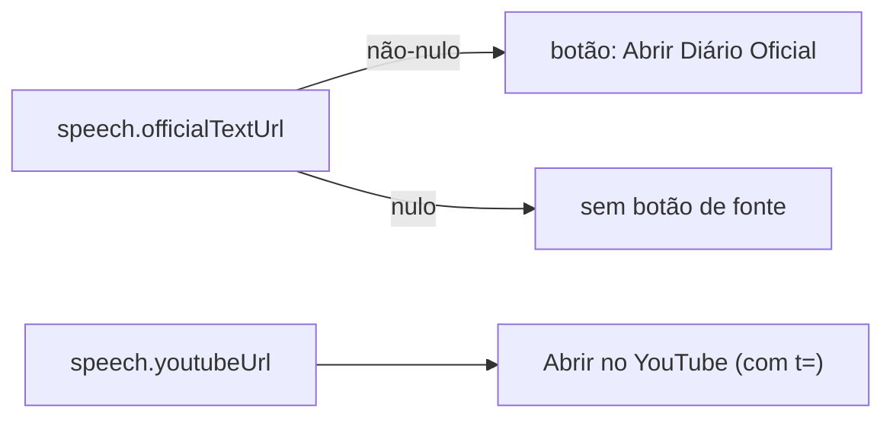

# Impl: Acervo: "Abrir fonte" só quando existe a fonte oficial (fim do atalho duplicado)

Status: aprovado
Atualizado em: 2026-09-16
Issue: #1087
Intenção: docs/plans/acervo-abrir-fonte-so-com-fonte-oficial.md
Appetite restante: herdado (~0,25–0,5 dia eng; dois sítios de render)

## Leitura da intenção

- **Outcome:** o botão de fonte do acervo passa a significar uma coisa só — a fonte oficial. Ele só renderiza quando `officialTextUrl` é não-nulo; sem Diário, some. Nenhum botão rotulado como fonte aponta para vídeo sem timestamp, na lista e no detalhe.
- **O que NÃO negociar:** remover o fallback `?? youtubeUrl` nos dois pontos; "Abrir no YouTube" (com `t=` no ponto) intocado; C160 preservado (PDF oficial continua destino quando existe); sem schema/Consent/migration; sem tocar em VOD/MP4/import/CC BY; URL pública do acervo intocada; lista e detalhe com o mesmo critério e o mesmo rótulo.
- **O que reavaliar:** só o nome do símbolo derivado (`sourceUrl` deixa de dizer a verdade) e a cópia do aviso de "sem YouTube" (`SpeechDetailPlayer.tsx:528-531`), que promete "abrir a fonte oficial" mesmo quando ela não existe. Nada de produto muda; é honestidade de tipo e de texto.

## Abordagem recomendada

**Opções consideradas:** A) manter `sourceUrl` só mudando a derivação; B) renomear o derivado para `officialTextUrl` e alinhar a prop do player, removendo o fallback; C) remover o botão de vez (pedido literal do usuário).

**Recomendação:** B — endurece a condição, preserva o acesso ao PDF oficial (C160) e faz o tipo dizer a verdade. Uma regra só, compartilhada por lista e detalhe.

**Rejeitadas:** A — o nome `sourceUrl` continua prometendo "fonte ou vídeo" e mantém o conceito ambíguo; a limpeza de tipo é o ponto. C — decisão de gate já tomada contra: perderia o atalho de um clique ao Diário e esvaziaria o C160 (registrado na intenção, 2026-09-16).

### Componentes / mudanças

- **`toSpeechListItemViewModel`** (`src/utilities/speech/speechViewModels.ts:67,242`): renomear `SpeechListItemViewModel.sourceUrl` → `officialTextUrl` e derivar `speech.officialTextUrl ?? null` (o `?? youtubeUrl` morre). O loader já traz `officialTextUrl: true` (`speechPageData.ts:44`), então nenhum loader muda.
- **`SpeechResultCard`** (`src/components/campaign/speech/SpeechResultCard.tsx:109-114,221-226`): consumir `speech.officialTextUrl` nos dois renders (quadrante "fala de origem" e card normal); rótulo `Abrir Diário Oficial`.
- **`SpeechDetailPlayer`** (`src/components/campaign/speech/SpeechDetailPlayer.tsx:61,155,498-505`): renomear a prop `sourceUrl` → `officialTextUrl`; rótulo `Abrir Diário Oficial`; ajuste da cópia em `:528-531` (ver D4).
- **`SpeechDetailPage`** (`src/app/(campaign)/campanha/(app)/comunicacao/acervo/[id]/page.tsx:69,121`): apagar `const sourceUrl = view.officialTextUrl ?? view.youtubeUrl` e passar `officialTextUrl={view.officialTextUrl}` direto (o detail VM já expõe `officialTextUrl`).
- **Migration:** sem migration.
- **Access / Consent:** N/A.
- **UI:** sem nova superfície; um rótulo muda e um render some quando o dado falta. Nenhum campo/tela novos.

### Dados → forma (se aplicável)

N/A — a fatia não apresenta dado novo: é um botão existente cuja condição de existência passa a ser "há fonte oficial?".

### Decisões de engenharia (D1–D4)

**D1 — semântica do símbolo.**

- **Opções:** A) renomear `sourceUrl` → `officialTextUrl` no VM da lista e na prop do player; B) manter `sourceUrl` só trocando a derivação para `officialTextUrl ?? null`; C) criar nome neutro novo (`officialSourceUrl`).
- **Recomendação:** A. `SpeechDetailViewModel` já tem `officialTextUrl` e o record Payload também; o nome passa a ser o mesmo conceito nos três lugares e lista/detalhe deixam de divergir. Impactos: `SpeechResultCard` usa `speech.officialTextUrl`; o teste unit do VM vira `row.officialTextUrl`; a prop do player e o `page.tsx` deixam de derivar.
- **Rejeitadas:** B — mantém a mentira semântica (o tipo diz "fonte" e já foi "fonte ou vídeo"); C — diverge do nome do campo do record sem ganho.

**D2 — rótulo.**

- **Opções:** A) `Abrir Diário Oficial`; B) `Ver Diário Oficial`; C) `Abrir PDF oficial`.
- **Recomendação:** A (produto, 2026-09-16). Nomeia o registro oficial e mantém o verbo do botão atual; mesmo rótulo na lista e no detalhe (assumido).
- **Rejeitadas:** B — perde o verbo de ação já estabelecido; C — "PDF" promete formato, e a fonte oficial é o Diário, não necessariamente o PDF.

**D3 — testes.**

- **Opções:** A) unit do VM (rename + caso negativo) + unit do player (rename/label/ausência) + e2e estendido, sem unit novo do `SpeechResultCard`; B) idem A mais um unit novo do `SpeechResultCard`; C) só e2e.
- **Recomendação:** A. O e2e server-renderizado é o dono da superfície da lista (`campaignSpeechAcervo.e2e.spec.ts`), então um unit do card seria redundante; o unit do VM guarda a derivação pura e o unit do player guarda o render do detalhe. Trabalho: `tests/unit/speechViewModels.unit.spec.ts:30-38` renomeia e ganha o caso `youtubeUrl`-only → `officialTextUrl` nulo; `tests/unit/speechDetailPlayer.unit.spec.tsx:61,442,447` renomeia a prop, atualiza o rótulo e adiciona assert negativo com `officialTextUrl={null}`; e2e estende `createSpeech` com `officialTextUrl?: string | null` (default no literal atual `https://camara.leg.br/discurso`, que hoje é fixo e não permite criar fala sem fonte) e adiciona "fala sem fonte oficial não mostra botão de fonte nem na lista nem no detalhe, mesmo com `youtubeUrl`", atualizando os três `toContain('Abrir fonte')` (`:181,:222,:318`) para o rótulo novo e somando um assert positivo na lista do teste de duas fontes.
- **Rejeitadas:** B — teste redundante sobre uma superfície já coberta ponta a ponta; C — sem unit, a derivação pura (o `?? youtubeUrl` removido) fica sem guarda barato.

**D4 — cópia do estado sem YouTube (`SpeechDetailPlayer.tsx:528-531`).**

- **Opções:** A) deixar como está; B) tornar as cláusulas condicionais ao que de fato renderiza (`vodResolvable` → MP4; `officialTextUrl` → Diário); C) remover o aviso.
- **Recomendação:** B, mínimo. Hoje o texto diz "Você ainda pode baixar o MP4 ou abrir a fonte oficial" mesmo quando um dos botões não existe; depois da renomeação o "fonte oficial" passa a ser promessa falsa quando `officialTextUrl` é nulo. Montar a frase só com as saídas presentes (mantendo a nota de que a seleção de trecho continua) elimina a mentira sem redesenho; o caso novo de e2e (sem fonte + sem YouTube) cobre isso.
- **Rejeitadas:** A — mantém texto que promete botão inexistente; C — joga fora a informação de limite do link (C166).

## Fases verificáveis

1. **Semântica/dados:** renomear `sourceUrl` → `officialTextUrl` no `SpeechListItemViewModel` com derivação `speech.officialTextUrl ?? null`; ajustar `SpeechResultCard` (dois renders) e o `page.tsx` (remover a derivação, passar a prop); atualizar `tests/unit/speechViewModels.unit.spec.ts`. Verde: unit de viewModels.
2. **Detalhe/rótulo:** renomear a prop do `SpeechDetailPlayer` para `officialTextUrl`, trocar o rótulo para `Abrir Diário Oficial` nos três sítios, ajustar a cópia de `:528-531` (D4); atualizar `tests/unit/speechDetailPlayer.unit.spec.tsx`. Verde: unit do player.
3. **Ponta a ponta:** estender `createSpeech` com `officialTextUrl?: string | null`; atualizar os três asserts de rótulo e adicionar o caso "sem fonte oficial não mostra botão (lista e detalhe), mesmo com YouTube". Gates — `pnpm gate:fast`; push via `pnpm push`.

## Rabbit holes / Não escopo (engenharia)

- Backfill ou resolução de Diários ausentes (é do C160); aqui não se cria fonte onde não há.
- Tocar em VOD/MP4, trechos, transcrições, import, crédito CC BY ou na URL pública do acervo.
- Novo campo de fonte, wrapper de componente, abstração de "link externo" ou redesenho do card/player.
- Renomear o `sourceUrl` homônimo de `src/utilities/speech/speechCutJob.ts:223` (URL de playback do job) ou os `sourceUrl` do domínio `cityReport*` — não compartilham tipo.
- Mexer no "Abrir no YouTube" (`youtubeWatchUrl`, exit block, facade).

## Riscos e mitigação

- **Lista e detalhe divergirem:** a condição fica idêntica (`officialTextUrl` não-nulo) e o e2e novo cobre as duas superfícies; a prop única `officialTextUrl` elimina a derivação local do `page.tsx`.
- **Asserts de e2e presos ao rótulo antigo:** os três `toContain('Abrir fonte')` são atualizados na mesma fase; o helper `createSpeech` passa a aceitar `officialTextUrl` para o caso negativo sem quebrar os existentes (default preservado).
- **Regressão do C160 (perder o PDF):** o unit do VM com as duas fontes continua assertando o destino do Diário; o e2e de duas fontes segue esperando o rótulo novo, agora só com `officialTextUrl`.
- **Cópia mentirosa remanescente:** o D4 condiciona as cláusulas ao que renderiza; o caso de e2e sem fonte exercita o caminho.
- **Seleção/filtros/segmentos do acervo inalterados:** nenhum loader, `where` ou `select` muda.

## Aceite de engenharia

- [ ] `SpeechListItemViewModel` expõe `officialTextUrl` (sem `?? youtubeUrl`) e o `SpeechDetailPlayer` recebe a prop `officialTextUrl`.
- [ ] O botão de fonte só renderiza com `officialTextUrl` não-nulo, na lista e no detalhe; sem ele, some — `youtubeUrl` nunca é destino.
- [ ] Rótulo `Abrir Diário Oficial` nos dois sítios; "Abrir no YouTube" (com `t=`) intocado e ainda o caminho de vídeo.
- [ ] `page.tsx` deixa de derivar `sourceUrl` e passa `view.officialTextUrl` direto.
- [ ] Cópia de `SpeechDetailPlayer.tsx:528-531` não promete botão inexistente.
- [ ] Unit de viewModels (rename + caso `youtubeUrl`-only → `officialTextUrl` nulo) e unit do player (prop/rótulo/assert de ausência) verdes; e2e cobre a lista e o detalhe sem fonte e não regride os casos existentes.
- [ ] Sem migration, sem Consent/Access, sem tocar em VOD/MP4/import/CC BY/URL pública; `pnpm gate:fast` verde e push via `pnpm push`.

## Já resolvido no simplify/critique (não reabrir)

- **S1 — `SpeechDetailViewModel.youtubeUrl` morto:** só era lido pelo fallback removido no `page.tsx`; campo e atribuição removidos (`speechViewModels.ts`).
- **S2 — termo divergente:** o aviso "sem YouTube" dizia "abrir a fonte oficial" e o botão "Abrir Diário Oficial"; o aviso passou a dizer "abrir o Diário Oficial".
- **S3 — branches do `remainingExits` sem cobertura:** novo unit `promises only the exits it renders in the no-YouTube notice (C177)` cobre os quatro casos (nenhum/só MP4/só Diário/ambos).

## Explicitamente fora

- **S4 — type predicate `(exit): exit is string`:** o predicado é inferível no TS moderno, mas a anotação explícita é escolha válida (nit, score 1) — descartado.
- **S5 — `remainingExits` calculado a cada render:** array de 2 itens lido num branch; memo seria YAGNI (score 1) — descartado.
- **S6 — literal `Abrir Diário Oficial` em 3 sítios:** constante compartilhada/wrapper foi barrada pelo plano; sem drift real. **Gatilho:** um 4º sítio de fonte oficial no acervo justifica a constante.
- **S7 — assert negativo do e2e indireto:** o invariante "nunca o fallback YouTube" já é pinado direto e barato no unit do view model (`officialTextUrl` nulo com `youtubeUrl` presente) — descartado.
- Backfill/VOD/novo campo/wrapper/redesenho seguem fora (ver Rabbit holes).

## Self-score (decision-quality)

5/5 — (1) o outcome é um invariante verificável (nenhum botão de fonte leva a vídeo sem ponto) e o e2e novo o prova nas duas superfícies; (2) a recomendação resolve a ambiguidade de tipo em vez de só remendar a derivação; (3) D1–D4 têm opções, recomendação e rejeitadas explícitas, com o impacto de cada rename listado; (4) o corte de escopo é duro (nada de backfill/VOD/novo campo) e o único ponto fora do botão (D4) é justificado como honestidade da mesma cópia; (5) os testes evitam redundância (sem unit novo do card) e o helper de e2e é estendido de forma compatível.
