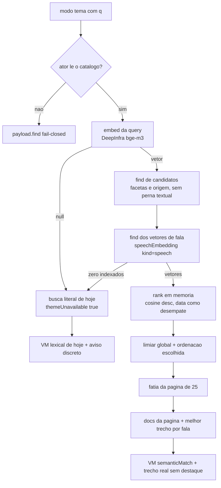

# Impl: C229 — Busca por sentido no acervo de falas

Status: aprovado
Atualizado em: 2026-09-25
Issue: #1360
Intenção: docs/plans/acervo-busca-por-sentido.md
Appetite restante: herdado (~2–3 dias eng)

## Leitura da intenção

- **Outcome:** em `mode=tema`, a busca do acervo de falas (Câmara + internet) passa a ser similaridade por sentido (embeddings), não expansão lexical: lista ordenada por proximidade (data só desempate), cada resultado com o trecho real mais próximo do tema (sem score, sem destaque de termo, sem justificativa gerada); acima do limiar vazio honesto; motor fora → busca literal de hoje com o aviso discreto.
- **O que NÃO negociar:** o gate `canReadSpeech`/`canReadCommunicationCatalog` não alarga nem ganha atalho; toda leitura local com `user` + `overrideAccess: false`; a fala continua a unidade (abrir/assistir/baixar intocado); "Termo exato" continua o default e não regride; nenhum score numérico na UI; gravações enviadas (C199/C219), Central pública (S28) e Sollinha (C158) ficam fora; `expandSpeechSearchTheme` não pode ser deletado (gravações/Central/conteúdo o consomem); `openai/*` intocado (OPS123); Consent/LGPD intocados (o único dado externo é o texto da busca e o texto das falas — sem PII de cidadão).
- **O que reavaliar:** (a) a hipótese de que a expansão sai do caminho principal está certa, mas o mecanismo de degradação **não** mantém a expansão — degrada para a busca literal pura (sem LLM); (b) o índice não cabe no `speech`/`speechSegment` sem inchar o dono e sem um rebuild limpo — vira collection oculta própria; (c) a evidência semântica exige vetores por trecho (não só por fala): o card lê o melhor trecho real da página; (d) o contrato de `sort` hoje é "web-only e `recentes` nunca serializado" e precisa expressar "Mais relevantes" (default do tema) mantendo os bytes do modo exato.

## Abordagem recomendada

**Opções consideradas:** A) embeddings em memória (DeepInfra, índice derivado em collection oculta, ranking no app) | B) expansão lexical/LLM como motor com reforço de recall | C) pgvector/serviço vetorial dedicado com ANN.
**Recomendação:** A — é o pedido literal (similaridade por sentido), reusa a infra de IA já contratada (`DEEPINFRA_API_KEY`), mantém access/`where`/paginação por fala e não exige imagem de Postgres com `vector` nem serviço novo; o índice é derivado, reconstruível e alimentado por CLI manual, como os imports.
**Rejeitadas:** B porque é exatamente o comportamento que o dono rejeitou ("parece busca por termo somada a matches em temas pré-definidos") e a intenção manda a expansão no máximo degradar; C porque pgvector não existe na imagem (`postgres:17-alpine`; troca de imagem é mudança de infra/produção fora do appetite) e um serviço vetorial dedicado reabre o rabbit hole nomeado.

### Componentes / mudanças

- **`src/utilities/ai/deepInfraEmbed.ts` (novo, `server-only`)** — fronteira do provider: `DEEPINFRA_EMBED_URL = 'https://api.deepinfra.com/v1/openai/embeddings'`, `DEEPINFRA_EMBED_MODEL = 'BAAI/bge-m3'`, `DEEPINFRA_EMBED_DIMENSIONS = 1024`, `DEEPINFRA_EMBED_COST_PER_MILLION_TOKENS_USD` (constante única do relatório), `EMBED_TEXT_MAX_CHARS` (2000), `EMBED_BATCH_SIZE` (32), `embedSpeechTexts(texts)` (input em lote, `encoding_format: 'float'`, parsing por `index`, L2-normaliza, `AbortSignal.timeout(30_000)`, nunca lança → `null`) e `embedSpeechQuery(text)` (1 input, timeout curto de 8s para não segurar a página). Tipo `SpeechQueryEmbeddingResolver`. Segue o padrão `fetch` + timeout + nunca lança de `deepInfraTranscribe.ts`; sem `@ai-sdk/*` nem dependência nova.
- **`src/lib/speechSemantic.ts` (novo, puro/client-safe)** — motor: `dotProduct`/`cosineSimilarity` (vetores normalizados na escrita), `normalizeVector`, `poolSpeechVector` (média L2-normalizada dos trechos = vetor da fala), `speechTextWindows` (janelas de 1200 chars com 200 de sobreposição, para fala sem segmento), `speechEmbeddingHash` (FNV-1a incluindo modelo = idempotência do índice), `rankSemanticHits`, `selectSemanticHits` (limiar), `sortSemanticHits` (relevância/recentes/duração), `pickBestSemanticChunk` e `SPEECH_SEMANTIC_MIN_COSINE = 0.4` (valor inicial — D6).
- **`src/utilities/speech/speechSemanticSearch.ts` (novo, `server-only`)** — orquestração do caminho semântico: candidatos = `payload.find('speech', { where: buildSpeechFacetWhere(state), select: { id, speechAt, durationSeconds }, pagination: false, user, overrideAccess: false })`; vetores = `payload.find('speechEmbedding', { where: kind=speech e speech in candidatos, user, overrideAccess: false })`; cosine em memória, limiar, ordenação escolhida, slice de `speechPageSize`; busca dos vetores de trecho **da página** e resolução do melhor trecho (segmento por `order`/`startSeconds`, janela recomputada do texto original quando `kind=window`). Devolve `pageHits`, `totalHits`, `indexedCandidates` e `evidenceBySpeech`.
- **`src/utilities/speech/speechPageData.ts`** — o 4º parâmetro `expandTheme` vira `embedQuery: SpeechQueryEmbeddingResolver = embedSpeechQuery` nas duas loaders (mesmo padrão de injeção de `loadSpeechDetailPageData`); `resolveSpeechThemeTerms` é removido (expansão sai do acervo); com tema+`q`: gate de papel → `embedQuery` → caminho semântico → docs/segmentos/cortes/facetas da página + evidência; `themeUnavailable` quando o embed da query for `null` **ou** `indexedCandidates === 0`; `themeApplied` passa a significar "o motor de sentido rodou nesta request" (não mais "termos expandidos"); C174 (origem de corte) só é consultado no caminho lexical.
- **`src/utilities/speech/speechListFilters.ts`** — remove `themeTerms` de `buildSpeechTextBranches`/`buildSpeechListWhere*` (a perna textual volta a ser só `q`, como no C180) e exporta `buildSpeechFacetWhere` como fronteira única dos candidatos semânticos (sem twinar o where).
- **`src/lib/speechSearch.ts`** — só comentário do espelho C180 atualizado (a perna textual volta a ter `q`); predicados intocados.
- **`src/utilities/speech/speechListUrl.ts` + `src/lib/acervoListSort.ts`** — contrato de `sort` ciente do modo (D5): `relevancia` reconhecido/omitido só no tema; `recentes` serializado só no tema; demais bytes do modo exato intactos. `ACERVO_THEME_SORT_OPTIONS` (Mais relevantes + os três) e o mapeamento puro "valor do select → estado" vivem no vocabulário compartilhado, mas só o caminho de falas os usa — gravações intocadas.
- **`src/utilities/speech/speechViewModels.ts`** — `SpeechListItemViewModel` e `WebSpeechListItemViewModel` ganham `semanticMatch: boolean` e `matchedTextSearch` (o web também), no lugar de `themeMatchTerm` (removido) e de `pickThemeMatch`; no caminho semântico o `excerpt` é o melhor trecho real **sem** destaque (`buildHighlightedExcerpt(source, '')`), `matchKind='theme'` e `watchHref` mira o `t=` do trecho de evidência quando existir.
- **UI (`src/components/campaign/speech/` + rota)** — `SpeechResultCard.tsx`: `isTheme = speech.semanticMatch`, bloco renomeado para **"Trecho mais próximo do tema"** (sem `<mark>`), selo "Tema" + "Termo exato" coexistindo; `WebSpeechResultCard.tsx` ganha os mesmos selos e o bloco de evidência preservando título/plataforma/capa (a cena 01 é a fonte internet); `SpeechThemeFallbackNotice.tsx` com a copy do design; na degradação os cards literais mostram o selo "Termo exato" (cena 04) sem alterar a lista do modo exato; `page.tsx` com heading/subtítulo do design ("Resultados por tema" / "Do mais próximo ao menos próximo do sentido buscado."), vazio honesto da cena 03 ("Nenhuma fala combina bem com esse tema" + Reformular/Usar termo exato/Limpar filtros), aviso/retry e `AcervoSortSelect` com as opções de tema na internet.
- **Migration:** `add_speech_embedding` (Fase 2, **STOP-POINT**): cria a collection oculta `speechEmbedding` e o índice da FK; commit dos três arquivos (`ts`/`json`/`index.ts`).
- **Access / Consent:** nenhuma chave `Consent` nova, nenhum PII; `speechEmbedding.access.read = canReadSpeech`, `create/update/delete = payloadAdminOnly`; o CLI usa `overrideAccess: true` justificado (ator confiável, como os imports); o gate de papel antecede o embed (ator negado nunca dispara chamada externa) e o `find` continua a barreira final.
- **CLI:** `scripts/index-speeches.mjs` + puro `scripts/lib/speechIndex.mjs` + `pnpm acervo:index` (`--dry-run`, `--limit`, `--source camara|web|all`, `--probe "<tema>" [--top N]`), relatório JSON em `data/acervo-index/reports/` (gitignore) com indexadas/puladas/falhas/cobertura/tokens/custo; guardas `assertLocalDatabase` + `assertWriteConfirm({ flag: 'ACERVO_INDEX_CONFIRM' })`; o `--probe` é read-only e usa o mesmo ranking do app.
- **Manifesto/ops:** entry de `src/collections/SpeechEmbedding.ts` na vertical do acervo em `scripts/lib/e2e-affected-manifest.mjs`; `playwright.config.ts` passa a anular `DEEPINFRA_API_KEY`; `docs/ops/teqo-1313-deploy.md` §C155/§C225 ganham o passo de indexação; uma entrada em `docs/changelog/`.

### Dados → forma (N/A justificado)

N/A. O item não apresenta métrica nem agregado: a saída é uma lista de falas com um trecho real; a intenção proíbe score numérico e a forma aprovada no design é "selo + trecho", sem barra/percentual/justificativa gerada.

## Fases verificáveis

> **STOP-POINT obrigatório (Fase 2):** schema só entra com aprovação humana da migration. A execução **para** depois de revisar o SQL gerado; só então `pnpm migrate` local, `pnpm generate:types` e a sequência. Nada de Fase 3+ antes disso.

1. **Fase 1 — tracer offline (sem migration, ~0,5–1 dia):** `lib/speechSemantic.ts`, `utilities/ai/deepInfraEmbed.ts`, contrato de `sort` do tema, VM/cards (`semanticMatch`, "Trecho mais próximo do tema", selos coexistentes) e copy do degradado — tudo com o loader ainda lexical. Testes: `speechSemantic.unit.spec.ts` (cosine, pooling, hash, janelas, limiar, ordenação, melhor trecho), `deepInfraEmbed.unit.spec.ts` (sem chave → `null` e sem fetch; lote por `index`; dimensão errada/HTTP/timeout → `null`; normalização; modelo e `encoding_format` no corpo), `speechListUrl.unit.spec.ts` (relevância canônica no tema; `recentes` serializado só no tema; bytes do modo exato idênticos; `relevancia` fora do tema descartado), `acervoListSort.unit.spec.ts` (opções/mapeamento do tema; gravações intactas), `speechViewModels.unit.spec.ts` e `speechResultCards.unit.spec.tsx` (trecho sem destaque, selos, `watchHref` com `t=`), `speechListFilters.unit.spec.ts` (builder volta ao formato pré-C192).
2. **Fase 2 — schema (STOP-POINT, ~0,5 dia):** `src/collections/SpeechEmbedding.ts` (slug `speechEmbedding`, `kind: speech|segment|window`, `speech`, `order`, `startSeconds`, `model`, `dimensions`, `contentHash`, `vector` json, `admin.hidden`), registro no `payload.config.ts`, cascade em `Speech.beforeDelete` (embeddings antes da mídia, `req` + bypass justificado), `pnpm migrate:create add_speech_embedding`. **Revisar o SQL; parar para aprovação humana.** Depois: `pnpm migrate`, `pnpm generate:types`, `pnpm generate:importmap` (se necessário) e int de cascade (apagar fala apaga embeddings e segmentos).
3. **Fase 3 — loader + indexação (~0,5–1 dia):** `speechSemanticSearch.ts`, loaders das duas fontes com `embedQuery` injetável, CLI + `--probe`, `.gitignore`. Testes int (sem corpus, com embeddings semeados): (a) fala acima do limiar aparece ordenada por proximidade com `semanticMatch` e evidência real; (b) nada acima do limiar → `rows=[]`, `themeApplied=true`, `themeUnavailable=false` (vazio honesto); (c) `embedQuery → null` → literais + `themeUnavailable=true` (aviso); (d) vetor ok e zero indexados → degrada igual; (e) facetas restringem candidatos; (f) `sort=recentes` no tema ordena por data após o limiar e duração filtra/ordena; (g) `order` fora dos limites → fallback para o primeiro segmento; (h) advisor/leader rejeitados sem chamar o embedder; unit da CLI (`speechIndex.unit.spec.ts`: args, plano, hash/skip, relatório).
4. **Fase 4 — UI/gates (~0,5 dia):** port classe-a-classe das cenas 01–04 (heading, sort com "Mais relevantes", vazio, degradado, selo no card degradado), extensão de `tests/e2e/campaignSpeechAcervo.e2e.spec.ts` (degradado com copy nova e sem selo "Tema" fabricado; `source=internet&mode=tema` com "Mais relevantes" e `sort=recentes` canônico sem loop; modo exato inalterado) e entry no manifesto. `pnpm gate:fast`; PR via `pnpm push` (high-risk por `src/migrations` + `src/collections` → curado, que já inclui `campaignSpeechAcervo`).
5. **Fase 5 — pós-deploy (aceite de produto, corpus real):** após o deploy de produção, no homeserver, rodar `pnpm acervo:index` (com `ACERVO_INDEX_CONFIRM=1`) e depois `--probe "combate à oposição"` e `--probe "impeachment"`, além de 3–4 temas de controle fora do domínio; registrar top-N/scores/cobertura/custo na Issue e no changelog; ajustar `SPEECH_SEMANTIC_MIN_COSINE` com a evidência se necessário e repetir.

## Rabbit holes / Não escopo (engenharia)

- pgvector, imagem de Postgres com `vector`, serviço/banco vetorial dedicado e ANN — rejeitado (infra fora do appetite; sem corpus local).
- Reindexação em tempo real/fila/job — imports seguem manuais; a atualização do índice é passo do runbook.
- Expansão lexical/LLM como motor ou como fallback — a degradação é a busca literal pura de hoje.
- Gravações (C199/C219), Central pública (S28), Sollinha (C158), busca global e dossiês — fora do recorte; `expandSpeechSearchTheme` preservado para eles.
- Score/justificativa gerada/por que apareceu numérico — a evidência é trecho real.
- Curadoria de sinônimos, cache de embeddings de query, rerank de segundo passe e quantização — deferidos com gatilho (D2/D6).
- UI nova de ordenação na Câmara — o modo tema da Câmara é sempre relevância, sem controle de sort.

## Riscos e mitigação

- **Limiar mal calibrado (falso-vazio × falso-cheio):** limiar global de 0.40 (D6) calibrado com `--probe` sobre os dois exemplos do aceite e controles; constante única; o vazio é honesto; nenhum resultado abaixo do limiar entra.
- **Latência/memória por request** (carrega vetores de todos os candidatos; ~1000 falas no corpus atual): medir no probe; gatilho — p95 > ~1,5s ou memória do container doer → base64 Float32 (4× menor) e/ou quantização int8 (D2), reavaliando pgvector/artefato materializado.
- **Índice desatualizado/parcial** (fala importada sem indexar some do tema em silêncio): o CLI é idempotente por hash+modelo, `--dry-run` imprime cobertura/pendências e o runbook encadeia `pnpm acervo:index` após os imports; gatilho — se a defasagem doer, o import chama o indexador (mesma função) em vez de duplicar lógica.
- **Evidência desalinhada após reimport** (segmentos trocados sem reindexar): `order` fora dos limites cai no primeiro segmento; o reindex é o conserto; a cobertura do relatório denuncia.
- **Provider/chave ausente em produção** (lição do C192): a ausência degrada com o aviso honesto; o deploy já audita `DEEPINFRA_API_KEY` e o runbook tem o copia-e-cola; o loader nunca lança.
- **Custo/quota:** lotes de 32, teto de chars por texto, `usage` reportado; corpus inteiro estimado em ~20–30k textos, dezenas de minutos e custo baixo no bge-m3 (relatório imprime tokens/custo).
- **Deep-link/contrato de URL:** unit pins dos bytes do modo exato e do round-trip de `relevancia`/`recentes`; e2e do tema+recentes sem loop de redirect.
- **Vazamento de gate:** collection nova lida com `user` + `overrideAccess: false` e `read: canReadSpeech`; papel negado não dispara o embedder; cascade do delete com bypass justificado e coberto por int.
- **e2e determinístico:** `DEEPINFRA_API_KEY` vazio no webServer do Playwright (o caminho semântico real é coberto por int com resolver injetado, não por e2e).
- **Regressão fora do recorte:** gravações/Central/Sollinha não são tocados; `expandSpeechSearchTheme` e seus consumidores ficam; knip garante que nenhum export ficou morto.

## Aceite de engenharia

- [ ] Aceite de produto da intenção coberto: tema sem as palavras exatas devolve por sentido; ordenação por proximidade com data como desempate; trecho real sem score; "Termo exato" intacto e alcançável; vazio honesto com saída; degradação com aviso, sem erro nem fantasma; facetas valendo; fala como unidade; sem UI nova de ordenação na Câmara.
- [ ] **Aceite de produto verificado pós-deploy com corpus real (não há corpus nos bancos locais):** `pnpm acervo:index --probe "combate à oposição"` e `--probe "impeachment"` no homeserver contra `teqo_1313` após o deploy + indexação, com top-N/scores/cobertura/custo registrados na Issue e no changelog; probes de controle fora do domínio validam o limiar; valor final de `SPEECH_SEMANTIC_MIN_COSINE` registrado.
- [ ] Invariantes AGENTS/engineering-standards: `user` + `overrideAccess: false` em toda leitura; `canReadSpeech` reusado sem alargamento; ator negado sem chamada externa (fail-closed); nenhum Consent/PII novo; copy pt-BR e identificadores em inglês; sem score na UI; `openai/*` e `expandSpeechSearchTheme` intocados.
- [ ] Migration isolada na Fase 2, aprovada no stop-point, aplicada localmente e tipos gerados (`pnpm generate:types`); cascade da fala coberto por int.
- [ ] Testes de domínio previstos (unit de motor/provedor/URL/VM/cards/CLI; int de ranking, limiar, degradação, facetas, sort, evidência, guard) e e2e atualizado (degradado + sort do tema) com `campaignSpeechAcervo` selecionado no PR high-risk.
- [ ] Manifesto de e2e com a collection nova; `pnpm gate:fast` verde; PR ready via `pnpm push` (curado, migration = high-risk).
- [ ] Runbook `docs/ops/teqo-1313-deploy.md` (§C155/§C225) com o passo de indexação e a entrada de changelog.

## Decisões de engenharia

### D1 — Motor e provider

**Opções:** A) embeddings multilingual via DeepInfra em memória | B) expansão lexical/LLM como motor | C) pgvector/serviço vetorial dedicado | D) modelo local sem provider.
**Recomendação:** A — reusa `DEEPINFRA_API_KEY` e o padrão `fetch`+timeout+`null` do ASR, sem contrato/secret novo; o motor é cosine em memória no app (a imagem não tem `vector`); a query é 1 chamada e o índice é derivado.
**Rejeitadas:** B porque é o comportamento rejeitado pelo dono; C porque pgvector exige trocar a imagem de produção e ANN não se paga em ~1k falas; D porque exigiria runtime de modelo no container (infra/custo) sem ganho comprovado.

### D2 — Forma do índice: unidade e encoding

**Opções:** A) vetor da fala + vetor por trecho (segmento de ASR; janelas do texto quando não há segmento), JSON de números | B) só chunk, ranking pelo melhor chunk | C) só fala, sem vetor de trecho | D) trechos com texto duplicado no índice.
**Recomendação:** A — o vetor da fala (média L2-normalizada dos trechos, computada na indexação) dá um ranking estável e barato; os vetores de trecho só são carregados para as 25 falas da página e entregam o "Trecho mais próximo do tema" real; JSON v1 é simples e auditável, com gatilho explícito para base64 Float32 (4× menor) e/ou int8 (10×) se o tamanho/latência doerem (o relatório do CLI imprime linhas/bytes estimados).
**Rejeitadas:** B porque supervaloriza uma frase solta e multiplica o payload de rank; C porque sem trecho não há evidência real (e o design exige); D porque duplica transcrição (o texto da janela é recomputado de `officialTranscript`/`summary` pela MESMA função pura do indexador).

### D3 — Onde o índice mora

**Opções:** A) collection oculta nova `speechEmbedding` | B) campos JSON ocultos em `speech` (fala) e `speechSegment` (trechos) | C) storage externo/artefato em arquivo.
**Recomendação:** A — o `speech` fica leve, o índice é reconstruível/apagável sem tocar no acervo, o acesso é um predicado só (`canReadSpeech`) e o cascade do delete é explícito (FK de relationship é `ON DELETE SET NULL` sobre coluna NOT NULL, então filhos antes do pai).
**Rejeitadas:** B porque incha a tabela principal, faz cada leitura do acervo carregar TOAST de vetores e mistura rebuild do índice com escrita das falas; C porque cria artefato volátil fora do banco, sem access control nem cascade (o banco local de dev/test também precisa do índice semeado nos int).

### D4 — Candidatos e ordenação no modo tema

**Opções:** A) candidatos = `where` de facetas/origem apenas; ranking em memória; sem pernas textuais e sem C174 | B) união de resultados semânticos + matches literais do `q` | C) híbrido com boost lexical.
**Recomendação:** A — é a promessa do modo ("ordem por proximidade"); o C174 (corte por título) e o `LIKE` só valem onde já valiam (modo exato/degradado), e os matches literais que importarem aparecem naturalmente se passarem no limiar, com o selo "Termo exato" coexistindo.
**Rejeitadas:** B/C porque reintroduzem a dependência de termo que motivou o item, quebram "data apenas como desempate" (resultado lexical sem score) e transformam o limiar em ficção.

### D5 — Contrato de URL do `sort`

**Opções:** A) `sort` ciente de `mode` no domínio de falas (`relevancia` omitido no tema; `recentes` serializado só no tema; bytes do exato intactos) | B) `relevancia` no vocabulário compartilhado | C) novo parâmetro `order`.
**Recomendação:** A — `relevancia` não vaza para gravações/Central; `sort=recentes` no tema é estado real e canônico; o modo exato continua byte-idêntico (nenhum deep-link muda); o `AcervoSortSelect` recebe o conjunto de opções por prop e o mapeamento "valor do select → estado" fica puro e testado.
**Rejeitadas:** B porque acrescentaria "Mais relevantes" ao seletor das gravações (fora do recorte); C porque duplica o vocabulário e cria duas verdades para ordenar.

### D6 — Limiar e vazio honesto

**Opções:** A) limiar global fixo `SPEECH_SEMANTIC_MIN_COSINE = 0.4`, calibrado por `--probe` | B) sem limiar (mostra sempre top-25) | C) limiar adaptativo por distribuição da consulta | D) expor score/percentual.
**Recomendação:** A — valor inicial 0.40 sobre vetores L2-normalizados (bge-m3); calibrar no pós-deploy com os dois temas do aceite (falso-vazio: se o topo ficar vazio, o limiar está alto) e com 3–4 temas de controle fora do domínio (falso-cheio: se controle entrar no topo, o limiar está baixo); o valor final é uma constante de uma linha, registrada com a evidência.
**Rejeitadas:** B porque viola "nunca resultado 'parecido' só para preencher a tela"; C porque é imprevisível/inexplicável e não testável; D porque é proibido pela intenção (número cru engana o assessor).

### D7 — Mecanismo de degradação

**Opções:** A) busca lexical literal de hoje + aviso discreto | B) degradar mantendo a expansão lexical do C192 | C) esconder o modo tema | D) erro pedindo retry.
**Recomendação:** A — `themeUnavailable` quando o embed da query `null` ou `indexedCandidates === 0`; o caminho é o `buildSpeechListWhere` literal (sem `themeTerms`) + C174, ordenado por data; a expansão lexical sai do acervo de falas (`themeTerms` removido do builder e do VM) mas sobrevive intacta para gravações/Central/conteúdo.
**Rejeitadas:** B porque mantém o motor rejeitado como rede de segurança e mistura proveniências; C porque some com a feature em silêncio; D porque é o "erro na cara" que a intenção proíbe.

### D8 — Evidência e contrato do card

**Opções:** A) melhor trecho real (segmento/janela) por fala da página, sem destaque, `semanticMatch` no VM | B) manter `themeMatchTerm`/destaque lexical no modo tema | C) justificativa gerada por LLM.
**Recomendação:** A — o trecho vem do vetor de trecho (cosine com a query), é texto real do acervo, sem `<mark>` e sem score; o rótulo é "Trecho mais próximo do tema"; "Tema" e "Termo exato" coexistem; `watchHref` leva o `?t=` ao trecho de evidência quando conhecido.
**Rejeitadas:** B porque destaca um termo que não é o motor (mentira de proveniência) e o design o removeu; C por alucinação e imprevisibilidade.

### D9 — Indexação: CLI separado vs acoplado ao import

**Opções:** A) CLI manual `pnpm acervo:index` (idempotente por hash+modelo, `--dry-run`/`--limit`/`--source`/`--probe`), encadeado no runbook após os imports | B) indexar dentro de `import-web-speeches.mjs`/`import-camara` | C) job assíncrono no app.
**Recomendação:** A — um dono só para batching, hash, skip, relatório e probe; os imports seguem manuais e idempotentes; o `--probe` é o instrumento de calibração e de verificação pós-deploy; escrita com `ACERVO_INDEX_CONFIRM=1` e relatório honesto.
**Rejeitadas:** B porque duplicaria a lógica em dois scripts (e o backfill da Câmara está congelado); C porque é o rabbit hole de reindexação em tempo real. Gatilho de revisitação: se a defasagem do índice doer, o import chama a mesma função do CLI (sem segundo dono).

### D10 — Injeção do embedding da query (testes offline)

**Opções:** A) 4º parâmetro `embedQuery` injetável nas duas loaders (precedente `expandTheme`/`SpeechVideoStartResolver`) | B) mock global do módulo | C) testes só com chave real.
**Recomendação:** A — int tests determinísticos semeiam `speechEmbedding` e injetam o vetor da query, exercitando ranking/limiar/degradação sem rede; o default é `embedSpeechQuery`; o e2e apenas cobre o degradado (chave anulada no Playwright).
**Rejeitadas:** B porque acopla o teste ao bundler e esconde o contrato; C porque depende de rede/provedor e não roda no CI.

### D11 — Expansão lexical fora do caminho de falas (sem deletar o dono)

**Opções:** A) remover `themeTerms` do builder/VM de falas e deixar `expandSpeechSearchTheme` intacto para os outros corpus | B) deletar `expandSpeechSearchTheme` | C) manter o parâmetro morto nos filtros.
**Recomendação:** A — o acervo de falas deixa de chamar a expansão; gravações (`recordingPageData`/`expandRecordingSearchTheme`), Central (`expandContentPieceSearchTheme`) e conteúdo continuam usando o mesmo dono; knip garante que nada exportado ficou sem consumidor.
**Rejeitadas:** B porque gravações/Central/conteúdo dependem do módulo (a intenção manda manter a expansão deles); C porque superfície morta mente sobre o mecanismo.

## Self-score decision-quality

1. **Decisões caras com rejeitadas:** 5/5 — motor/provider, forma e moradia do índice, candidatos/ordenação, contrato de URL, limiar, degradação, evidência, CLI e injeção têm opções/recomendação/rejeitadas registradas.
2. **Cabe no appetite:** 4/5 — ~2–3 dias no limite superior: os módulos são pequenos e o UI é port classe-a-classe, mas schema+CLI+rework dos dois loaders concentram o esforço; o stop-point da migration não conta como implementação.
3. **Rabbit holes nomeados:** 5/5 — pgvector/infra vetorial, reindexação em tempo real, expansão como motor, gravações/Central/Sollinha, score/justificativa e quantização deferida com gatilho estão cortados.
4. **Depth check (reusa shells/helpers):** 5/5 — `CampaignListEmptyState`, `AcervoSortSelect`, `CampaignThemeRetryButton`, `SpeechThemeFallbackNotice`, `SpeechResultCard`/`WebSpeechResultCard`, `loadSegmentsForSpeeches`, `speechHighlight`, `campaignListUrl`, `assertLocalDatabase`/`assertWriteConfirm`, o padrão `fetch`+timeout+null do DeepInfra e a injeção de resolver.
5. **Intenção permanece satisfeita:** 5/5 — outcome, anti-goals e guardrails de acesso intactos; a engenharia troca o mecanismo sem reescrever o produto.

**Total: 5/5** (gate ≥4 satisfeito).
