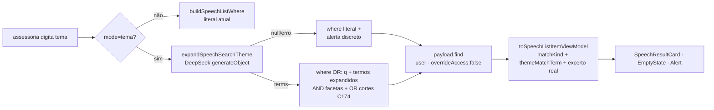

# Impl: C192 — Busca semântica no acervo de falas

Status: aprovado
Atualizado em: 2026-09-18
Issue: #1147
Intenção: docs/plans/acervo-busca-semantica.md
Appetite restante: herdado (~1–2 dias eng)

## Leitura da intenção

- **Outcome:** em `mode=tema`, buscar um tema sem as palavras exatas devolve falas relacionadas pelo sentido, cada resultado com proveniência determinística (termo exato vs tema) e excerto real; sem resultado → vazio honesto; mecanismo indisponível → resultados lexicais de hoje + aviso discreto, nunca erro nem resultado fantasma.
- **O que NÃO negociar:** o gate de leitura (`canReadSpeechCatalog`/`canReadSpeech`) não alarga nem ganha atalho; `payload.find` sempre com `user` + `overrideAccess: false`; a fala continua a unidade; busca exata continua sendo o default e não regride; sem score numérico na UI; nada de pgvector/backfill dos 997; `openai/*` intocado (OPS123).
- **O que reavaliar:** a hipótese da intenção ("áreas prováveis") está correta quanto aos arquivos. O ponto a reavaliar é a assimetria `speechListFilters` (where) × `lib/speechSearch` (espelho C180): a expansão só entra na perna textual do `where`, então o espelho precisa de um predicado por termo em vez de reescrever a semântica literal — caso contrário `matchedTextSearch` quebraria o C174.

## Abordagem recomendada

**Opções consideradas:** A) LLM query expansion + motor lexical existente, sem índice vetorial | B) embeddings query-time (DeepInfra) + artefato em memória | C) pgvector + embeddings + backfill.
**Recomendação:** A — um único `generateObject` determinístico (mesmo contrato de `rerankSpeechExcerpts`) expande o tema em termos lexicais; o `where` do Payload e o access control continuam no caminho, a fala segue unidade, e nada novo precisa ser indexado/backfillado. Cabe no appetite e entrega o outcome no recorte do acervo.
**Rejeitadas:** B porque exige artefato de embeddings (backfill/refresh) e cosine em memória sem ganho claro sobre a expansão lexical para 997 falas, além de introduzir dependência de infra que a intenção mandou evitar; C porque é exatamente o rabbit hole nomeado em "índice vetorial de todo o acervo / infra nova" (custo, storage, sync contínuo, backfill). Detalhe em "Decisões de engenharia".

### Componentes / mudanças

- **`SpeechSearchMode` + `mode` em `SpeechListState`** (`src/utilities/speech/speechListUrl.ts:51`): adiciona `'mode'` a `speechListParamNames:71`, parse de valor único (`tema`; desconhecido → `undefined`), serializa `mode=tema` **somente quando há `q`**. Reusa `firstValue`, `resolveListUrl`, `buildListHref`. Deep links e back/forward passam pelo canonicalizador existente; `mode` desconhecido continua redirecionando porque o nome é suportado e o serializer o omite (raw ≠ canonical).
- **`applySpeechSearchMode`** (`src/utilities/speech/speechOmnibox.ts`): ação pura que devolve `{ kind: 'url', state: { ...state, mode, page: 1 } }` (ou limpa `mode`), preservando facetas. Reusa o padrão de `withPageReset`/`mutateFacet`; não passa por `mutateFacet` (não é facet multi-valor).
- **`normalizeSpeechThemeTerms`** (`src/lib/speechThemeTerms.ts`, novo, puro/client-safe): normaliza (`normalizeForSearch`), remove `%`/`_` e tokens <3 chars, deduplica pela forma normalizada, limita a 8 termos e 60 chars. É a única barreira entre texto de LLM e o `LIKE` — reusa `normalizeForSearch`, `uniqueByNormalizedForm`.
- **`expandSpeechSearchTheme`** (`src/utilities/ai/expandSpeechSearchTheme.ts`, novo, `server-only`): `deepSeek('deepseek-flash')` + `generateObject` + zod `{ terms: z.array(z.string()) }`, `temperature 0.2`, `AbortSignal.timeout(4000)`, `maxOutputTokens` baixo; aplica `normalizeSpeechThemeTerms`. Contrato: sem `DEEPSEEK_API_KEY`, timeout, erro de provider ou saída malformada → `null`; `{ terms: [] }` é resposta legítima (modelo rodou, nada a acrescentar). Espelha `rerankSpeechExcerpts`.
- **`buildSpeechTextBranches` / `buildSpeechListWhereIncludingCutOrigins`** (`src/utilities/speech/speechListFilters.ts:52,77`): passam a aceitar `themeTerms: readonly string[]`; a perna textual vira OR de `{ searchText: like normalize(q) }`, `{ keywords: contains q }` + pares equivalentes por termo expandido + `{ id: { in: originSpeechIds } }` (C174 intocado, ainda só `state.q`); facetas seguem AND. Reusa `buildSpeechFacetWhere`, `collapseListWhereOrBranches`.
- **`speechMatchesSearchTerm` / `speechMatchesSearchQuery`** (`src/lib/speechSearch.ts:31`): extrai o predicado de um termo (espelho exato do `where` per-termo); `speechMatchesSearchQuery` passa a ser `speechMatchesSearchTerm(speech, q)` para o flag literal. Mantém o lockstep C180 e `matchedTextSearch` literal.
- **`toSpeechListItemViewModel`** (`src/utilities/speech/speechViewModels.ts:213`): recebe `themeTerms?: readonly string[]`; `matchKind` ganha `'theme'`; novo `themeMatchTerm: string | null` (primeiro termo expandido que casa em segmento/keyword via espelho); quando não há casamento literal, o excerto é `buildHighlightedExcerpt(segment.text, themeMatchTerm)` — trecho real, sem "porquê" gerado. Reusa `pickMatchingSegment` (generalizado p/ lista de termos), `buildHighlightedExcerpt`, `normalizeForSearch`.
- **`loadSpeechAcervoPageData`** (`src/utilities/speech/speechPageData.ts:160`): ganha 4º parâmetro injetável `expandTheme: SpeechThemeExpansionResolver = expandSpeechSearchTheme` (precedente: `SpeechVideoStartResolver` em `loadSpeechDetailPageData`). Só expande se `state.q && state.mode === 'tema' && canReadSpeechCatalog(user.role)` (fail-closed: ator negado não dispara chamada externa; o `find` continua rejeitando). Retorna `searchMode`, `themeUnavailable` e passa `themeTerms` ao view model. Seleção de `searchText` inalterada (já existe quando `state.q`).
- **UI** (`src/components/campaign/speech/` + rota): `SpeechAcervoFilters.tsx` ganha o seletor segmentado "Buscar por: Termo exato | Por tema" (`role="group"`, `aria-pressed`) que chama `applySpeechSearchMode` via `useCampaignListFilterNavigation`; `SpeechResultCard.tsx:122` ganha o selo "Tema" + bloco "Por que apareceu" com o excerto real e mantém o caminho C174/`originLabel` quando não é tema; novo `SpeechThemeFallbackNotice.tsx` com `Alert variant="pending"` + botão "Tentar por tema novamente" (`router.refresh()`); `page.tsx:29` renderiza o aviso quando `themeUnavailable` e o vazio honesto (cena 03). Reusa `CampaignListOmnibox`, `CampaignListEmptyState`, `Alert`/`AlertTitle`/`AlertDescription`, `useCampaignListFilterNavigation`, `Badge`, `Button`.
- **Migration:** **sem migration**. Nenhum campo/collection/global muda: `searchText`/`keywords` já existem e a expansão é query-time; mudar schema exigiria migration e não é necessário.
- **Access / Consent:** intocado. Nenhuma chave `Consent` nova, nenhum PII de cidadão; o único dado que sai para o DeepSeek é o texto do tema digitado pelo assessor. A leitura continua no `payload.find` com `user` + `overrideAccess: false`; `canReadSpeech`/`canReadSpeechCatalog` não são tocados nem reusados para alargar nada.
- **UI (Impeccable B):** shell existente do acervo, sem rota nova. Cenas do gate a portar: 01 (desktop, selo "Tema" + "Por que apareceu" + "Termo exato" quando ambos), 02 (mobile, toggle tocável, `min-h-11`), 03 (vazio honesto: "Reformular busca" / "Usar termo exato" / "Limpar filtros"), 04 (degradado: seletor visualmente em "Termo exato", aviso `bg-estimate-pending` preservando "Por tema foi pedido", "Tentar por tema novamente"), 05 (loading: aproveitar pending existente; skeleton fica fora do v1). Craft/critique/polish no mesmo gate B antes do PR.

### Dados → forma (N/A justificado)

N/A. O item não apresenta métrica, agregado ou score: o resultado é uma lista de falas com uma explicação qualitativa (selo + trecho). A intenção proíbe explicitamente score numérico de confiança; a forma escolhida é "selo + excerto real", sem barra/percentual.

## Fases verificáveis

1. **Tracer / server** (~1 dia): `mode` no contrato de URL + `normalizeSpeechThemeTerms` + `expandSpeechSearchTheme` + `themeTerms` no `where` + injeção em `loadSpeechAcervoPageData` + `themeMatchTerm` no view model. Testes:
   - `tests/unit/speechThemeTerms.unit.spec.ts` (novo): sanitiza wildcards/curtos/duplicados/limites.
   - `tests/unit/expandSpeechSearchTheme.unit.spec.ts` (novo, mockando `ai`/`@ai-sdk/deepseek` como `rerankSpeechExcerpts.unit.spec.ts`): sem chave → `null` e sem chamada; erro do provider → `null`; `{terms:[]}` → legítimo; termos válidos; prompt contém o tema e `abortSignal` é `AbortSignal`.
   - `tests/unit/speechListUrl.unit.spec.ts` (estender): `mode=tema` parse/serialize; desconhecido canonicaliza; `mode=tema` sem `q` redireciona; deep-link atual (`?q=SUS`) não muda.
   - `tests/unit/speechListFilters.unit.spec.ts` (estender): OR `q` + expandidos + OR de cortes, facetas AND; sem `themeTerms` idêntico ao de hoje.
   - `tests/unit/speechSearch.unit.spec.ts` (estender): `speechMatchesSearchTerm` (texto normalizado + keyword case-insensitive).
   - `tests/unit/speechViewModels.unit.spec.ts` (estender): `themeMatchTerm`, `matchKind='theme'`, excerto highlightando o termo expandido.
2. **UI** (~0,5–1 dia): seletor de modo em `SpeechAcervoFilters`, selo/proveniência no `SpeechResultCard`, aviso de degradação (`Alert pending` + retry), vazio honesto com saídas; `applySpeechSearchMode` em `tests/unit/speechOmnibox.unit.spec.ts`. Testes:
   - Estender `tests/int/speechAcervo.int.spec.ts` com expansor injetado: (a) fala que **não** contém o `q` literal mas contém a expansão é devolvida com `themeMatchTerm` e excerto real; (b) expansor `null` → `themeUnavailable: true` e linhas literais; (c) advisor/leader não disparam o expansor (guard fail-closed).
   - Estender `tests/e2e/campaignSpeechAcervo.e2e.spec.ts` (browserless, sem `DEEPSEEK_API_KEY` no app e2e): `?q=<marker>&mode=tema` → 200, seletor "Buscar por", aviso "A busca por tema está indisponível agora." e resultado exato do marker; `?q=<marker>` (default) inalterado.
3. **Gates:** `pnpm gate:fast`; PR via `pnpm push`. `src/utilities/ai` é prefixo de risco (OPS86) → o PR roda o conjunto curado de e2e; os prefixos `src/utilities/speech`/`src/components/campaign/speech`/`src/app/(campaign)/.../comunicacao`/`src/lib/speech*` já mapeiam `campaignSpeechAcervo`, então `scripts/lib/e2e-affected-manifest.mjs` **não muda**.

## Rabbit holes / Não escopo (engenharia)

- pgvector, embeddings, artefato/backfill dos 997 e sync contínuo — rejeitado nomeadamente na intenção.
- Mandar o catálogo inteiro dos 997 ao LLM para "escolher" a fala — prompt/latência/custo e caixa-preta; a seleção fica no `where` lexical.
- LLM a gerar o "por que apareceu" — alucinação; a proveniência é sempre trecho determinístico e o selo é o modo.
- Segundo passe de rerank por LLM no v1 (gatilho de revisitação: se recall/precisão do lexical+expansão não bastar, avaliar rerank sobre candidatos, como no C158).
- Curadoria de sinônimos/ontologia, busca global, Sollinha, exposição pública do acervo, analytics de busca — fora de escopo por intenção.
- Cache do resultado da expansão: v1 paga uma chamada por request (fatiar página re-expande). Gatilho: se latência/custo doer, cache in-process limitado por `normalizeForSearch(q)`.
- Skeletons da cena 05: aproveitar só o pending/dimming existente; skeleton fica para polish futuro.

## Riscos e mitigação

- **Latência de 1 chamada LLM por busca em página** (e por flip de página): timeout 4s + `generateObject`; a UI usa o pending existente (`aria-busy`); degradação honesta se estourar. Trigger de cache acima.
- **`LIKE` com curinga injetado**: `normalizeSpeechThemeTerms` remove `%`/`_` e limita tamanho/quantidade; o `where` continua parametrizado pelo Payload.
- **Divergência where ↔ espelho C180**: o predicado por termo é único (`speechMatchesSearchTerm`) e testado; qualquer mudança na perna textual tem que passar por ele no mesmo commit.
- **Regressão da busca exata**: default `termo` não emite parâmetro; `buildSpeechListWhere` sem `themeTerms` é byte-idêntico ao atual (teste dedicado).
- **Proveniência enganosa**: quando o casamento é literal, `matchedTextSearch`/`matchKind` continuam mandando; o selo "Tema" só aparece com `themeMatchTerm` real; `[]` do modelo não vira resultado.
- **Chamada externa para ator sem leitura**: guard `canReadSpeechCatalog(user.role)` antes de expandir; o `find` com access continua sendo a barreira final (fail-closed).
- **Custo/quota DeepSeek**: `deepseek-flash`, `maxOutputTokens` baixo, sem rerank; os 997 não são enviados.
- **Confusão do usuário ao degradar**: aviso preserva "Por tema foi pedido" e o seletor volta visualmente a "Termo exato", com retry explícito (cena 04) — nunca erro na cara.
- **e2e de risco**: o diff toca `src/utilities/ai`, então o PR roda o curado; `campaignSpeechAcervo` também é selecionado pelas prefixos de speech e cobre o modo degradado sem rede.

## Aceite de engenharia

- [ ] Aceite de produto da intenção ainda coberto: tema sem palavras exatas devolve falas relacionadas; cada resultado explica termo exato vs tema com trecho; exata inalterada; vazio honesto; degradação com aviso, sem erro nem fantasma; facetas continuam valendo; fala é a unidade.
- [ ] Invariantes AGENTS/engineering-standards: `user` + `overrideAccess: false` em toda leitura; gate `canReadSpeech`/`canReadSpeechCatalog` não alargado; sem pgvector/embeddings; sem `openai/*`; copy pt-BR e identificadores em inglês; sem score numérico.
- [ ] Sem migration (justificado) — nenhum schema/collection/global alterado.
- [ ] Testes de domínio: unit do sanitizador, do módulo de expansão (mock de provider), do contrato de URL, do `where`, do espelho C180 e do view model; int com expansor injetado (tema, fallback, guard de acesso); e2e browserless do modo degradado.
- [ ] `pnpm gate:fast` verde; `pnpm push` com PR ready.
- [ ] Manifesto de e2e mantém cobertura de risco sem edição (`src/utilities/ai` e prefixos de speech já mapeados).

## Decisões de engenharia

### D1 — Mecanismo da busca por tema

**Opções:** A) LLM query expansion + motor lexical existente | B) embeddings query-time (DeepInfra) + cosine em memória sobre artefato | C) pgvector + embeddings + backfill.
**Recomendação:** A — resolve o job ("sem as palavras exatas") sem infra nova nem reindexação, mantém access/`where`/paginação por fala e a proveniência é lexical e determinística.
**Rejeitadas:** C porque é o rabbit hole textual da intenção (pipeline, backfill dos 997, storage, sync); B porque exige manter um artefato de embeddings (gerar/atualizar/servir) e introduz similaridade contínua — mais superfície e sem ganho comprovado no recorte de 997 falas; D) lexical puro sem expandir não atende o outcome ("defesa do SUS" continua sem achar outras palavras); E) mandar o acervo inteiro ao LLM estoura prompt/latência/custo e vira caixa-preta.

### D2 — Contrato de falha da expansão

**Opções:** A) `null` para indisponível **e** vazio | B) `null` só para indisponível; `{terms: []}` quando o modelo roda e não acrescenta nada | C) lançar erro e tratar na página.
**Recomendação:** B — distingue "mecanismo fora" (mostra o aviso da cena 04) de "mecanismo rodou, sem termos" (cai na busca literal sem aviso de indisponibilidade); é mais honesto que colapsar os dois.
**Rejeitadas:** A porque exibir "indisponível" quando o serviço respondeu vazio mente para o usuário; C porque quebra o contrato "nunca lança" do precedente `rerankSpeechExcerpts` e arrisca erro na cara.

### D3 — Parâmetro de URL do modo

**Opções:** A) `mode=tema` (default `termo`, omitido) | B) `mode=semantic`/`mode=exact` | C) `semantic=1` booleano.
**Recomendação:** A — nome English (`mode`, consistente com `q`/`year`/`topic`/…), valor slug pt-BR (`tema`/`termo`) consistente com a convenção de VALORES já fixada nos facets (`curta`/`media`/`sem_duracao`); default omitido mantém deep-links e a URL da busca exata idênticas (zero regressão). Registrado em `speechListParamNames` para o canonicalizador redirecionar valor desconhecido.
**Rejeitadas:** B porque inventa vocabulário em inglês para valores que o usuário vê em pt-BR; C porque um booleano não escala para um terceiro modo e foge do padrão de enum de facet.

### D4 — Proveniência do resultado

**Opções:** A) selo por item + trecho real determinístico | B) "porquê" gerado pelo LLM | C) aviso único no topo.
**Recomendação:** A — `themeMatchTerm` + `buildHighlightedExcerpt` sobre o texto do segmento/keyword; trecho existe no dado, sem alucinação; o selo "Tema"/"Termo exato" marca cada fala (cena 01).
**Rejeitadas:** B por risco de alucinação e min/max imprevisível; C porque não sustenta a confiança em cada fala e some ao rolar.

### D5 — Unidade do resultado e escopo do casamento

**Opções:** A) fala, com o `where` casando texto/keywords e (C174) origem de corte | B) fala + trechos | C) trechos.
**Recomendação:** A — o job é "qual fala serve"; a expansão só entra na perna textual da fala/keyword; o casamento por corte (C174) permanece ancorado só no `q` original (não expandimos títulos de corte) para não inflar superfície/custo.
**Rejeitadas:** B/C porque recorte fino de trecho é o job do C158 no Sollinha e mudaria a unidade/paginação atual.

### D6 — Cache/segundo passe

**Opções:** A) v1 sem cache e sem rerank | B) cache in-process da expansão já no v1 | C) rerank LLM dos candidatos no v1.
**Recomendação:** A — menos superfície, cabe no appetite; o `deepseek-flash` com timeout e `maxOutputTokens` baixo mantém o custo aceitável no interno.
**Rejeitadas:** B adiada (barata de reverter; gatilho: latência/custo por flip de página); C adiada (gatilho: precisão/recall insuficientes) — espelha a decisão do C158 de rerank como segunda etapa, não no caminho crítico.

## Self-score decision-quality

1. **Decisões caras com rejeitadas:** 5/5 — mecanismo, contrato de falha, contrato de URL e proveniência têm opções/recomendação/rejeitadas registradas; custo/rerank deferidos com gatilho.
2. **Cabe no appetite:** 5/5 — query-time, sem migration, sem infra; ~1–2 dias (server+tracer num dia, UI/gates no restante).
3. **Rabbit holes nomeados:** 5/5 — embeddings/pgvector/backfill, catálogo inteiro no LLM, "porquê" gerado, rerank/cache/curadoria explicitamente cortados.
4. **Depth check (reusa shells/helpers):** 5/5 — `buildSpeechListWhere*`, canonicalizador (`resolveListUrl`/`buildListHref`), `CampaignListOmnibox`, `CampaignListEmptyState`, `useCampaignListFilterNavigation`, `Alert`, `buildHighlightedExcerpt`/`speechSearchTerms`, e o contrato de injeção de `loadSpeechDetailPageData`.
5. **Intenção permanece satisfeita:** 5/5 — outcome, anti-goals e guardrails de acesso intactos; a engenharia não reescreveu o produto.

**Total: 5/5** (gate ≥4 satisfeito).

## Triage do /simplify (C192)

Aplicados no PR: gate `speechMatchesSearchTerm` no `pickThemeMatch` (não reivindicar tema que o `where` não usou), evidência por keyword em vez de trecho alheio, copy do vazio no caminho degradado, `aria-disabled` com no-op real, `temperature: 0` na expansão, `SPEECH_OMNIBOX_ID` compartilhado, `SpeechWatchButton` extraído, frase contínua no destaque + testes diretos, prompt interpolando as constantes.

Deferidos com gatilho:

- **Cache da expansão por `q` normalizado** (custo/latência por página e coerência de paginação). Gatilho: latência/custo doer ou paginação incoerente observada. Já previsto em D6.
- **Helper único para o boilerplate DeepSeek** (`generateObject` + guard de chave + timeout + catch→null), hoje repetido em `rerankSpeechExcerpts`, `campaignDemandTitle`, `speechCutMetadata` e `expandSpeechSearchTheme`. Gatilho: tocar qualquer um deles.
- **`collectOccurrences` em `speechHighlight`** (loop duplicado entre `findHighlightRanges`/`findPhraseRanges`). Gatilho: terceira variante de busca de ranges.
- **Sanitizar `themeTerms` na fronteira do `buildSpeechListWhere`** (defense-in-depth para futuros callers; produção já segura pelo provider). Gatilho: novo caller do builder.
- **`CampaignListEmptyState` com 3 props de classe para um caller** — reavaliar se surgir um segundo consumidor (variante nomeada). Gatilho: segundo call site.
