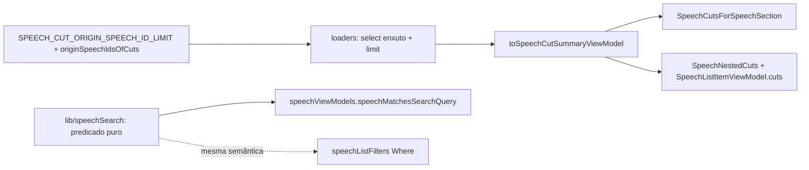

# Impl: Acervo cortes — dívida pós-C174: select enxuto dos loaders, teto do `id in` da origem e paridade busca↔VM

Status: aprovado
Atualizado em: 2026-09-16
Issue: #1097
Intenção: docs/plans/acervo-cortes-divida-pos-c174.md
Appetite restante: herdado (~0,5–1 dia)

## Leitura da intenção

- **Outcome:** cortar o custo de query dos três loaders de corte e o risco de drift entre a busca (SQL) e o VM, sem mudar comportamento visível.
- **O que NÃO negociar:** nenhuma superfície visual nova; `lib/` nunca importa `utilities/`; sem módulo gêmeo; sem migration; `loadSpeechCutAcervoPageData` (depth 1), `loadSpeechCutDetailPageData`/`findSpeechCutForActor` e `/corte/<id>` intocados.
- **O que reavaliar (surpresas do explorer):**
  - `SpeechNestedCuts` com `showDescription` renderiza `description` (`SpeechNestedCuts.tsx:62-64`) → o DTO estreito PRECISA de `description`.
  - As superfícies usam `durationSeconds` + `formatSpeechClock`, não `durationLabel` (`formatSpeechSpan`) → manter `durationSeconds`; NÃO incluir `durationLabel`.
  - `failureMessage`/`error`/`step` não são lidos por nenhuma das duas superfícies → saem do DTO; mas a normalização `status` desconhecido → `'failed'` fica (senão `SpeechCutStatusBadge` quebra).
  - `tests/int/speechCut.int.spec.ts:860-870` asserta `mediaUrl`/`publicPath` no retorno desse loader → muda com o novo shape.

## Abordagem recomendada

**Opções consideradas:** A — DTO estreito + predicado puro compartilhado + cap do `id in` (as três fases) | B — só adicionar `select` mantendo `toSpeechCutViewModel` completo | C — F3 via subquery/raw e F2 via comparar por id já resolvido.
**Recomendação:** A — remove o payload não usado no shape (não só no tráfego), unifica a semântica num só lugar puro e fecha o `in` com degradação honesta; menor caminho que cobre as três fases.
**Rejeitadas:** B — `select` enxuto com VM completo ainda mapeia `mediaUrl`/`youtubeVideoId`/`failureMessage` que ninguém lê e exigiria `error` no select; C — subquery exige SQL cru fora do repositório Payload (quebra depth) e comparar por id erra quando a fala casa por texto E é origem de um corte.

### Componentes / mudanças

- **`SpeechCutSummaryViewModel` + `toSpeechCutSummaryViewModel` + `cutDurationSeconds`** (`src/lib/speechCut.ts`): mapper puro que emite `{ id, status, title, description, durationSeconds }`, reusando o fallback `durationSeconds ?? end − start` (extraído de `toSpeechCutViewModel`) e a normalização de status. `toSpeechCutViewModel` passa a usar o helper extraído.
- **`speechMatchesSearchQuery`** (`src/lib/speechSearch.ts`): predicado puro do ramo textual; `speechViewModels` deixa de ter `speechMatchesText` local e chama este.
- **`SPEECH_CUT_ORIGIN_SPEECH_ID_LIMIT` + `originSpeechIdsOfCuts`** (`src/lib/speechCut.ts`): dedupe + cap puro dos ids de fala de origem.
- **`speechCutPageData.ts`**: `speechCutSummarySelect` (status/title/description/durationSeconds/startSeconds/endSeconds) nos dois loaders de corte; `speechCutOriginSelect` (`speech`) + `limit` na origem; retornos passam a `SpeechCutSummaryViewModel`; origem usa `originSpeechIdsOfCuts`.
- **`speechViewModels.ts` / `SpeechCutsForSpeechSection.tsx` / `SpeechNestedCuts.tsx`**: tipos de prop passam a `SpeechCutSummaryViewModel` (render inalterado).
- **Migration:** sem migration — nenhuma collection/global/field muda; só `select`, `limit` e DTO de leitura.
- **Access / Consent:** n/a — os loaders seguem `user` + `overrideAccess:false`; nenhum write path.
- **UI:** Impeccable A; nenhuma superfície visual nova nem copy nova → nenhum trigger do `designer` (a/b/c/d) é acionado.

### Dados → forma

- Não se aplica (sem KPI/série/mapa; o dado já é lista).

## Fases verificáveis

1. **F1 — DTO estreito + `select`** (`lib/speechCut.ts`, `speechCutPageData.ts`, 3 componentes). Prova: `tests/unit/speechCut.unit.spec.ts` novo `describe('toSpeechCutSummaryViewModel')` (chaves exatas sem `mediaUrl`/`failureMessage`; fallback `end − start`; status desconhecido → `failed`); int `speechCut.int.spec.ts:860-870` atualizado para as chaves do summary.
2. **F2 — predicado único** (`lib/speechSearch.ts`, `speechViewModels.ts`). Prova: `tests/unit/speechSearch.unit.spec.ts` `describe('speechMatchesSearchQuery')` (searchText acento/caixa; keyword case-insensitive; query vazia/`undefined` → true) + int novo em `speechCut.int.spec.ts` com `keywords` em caixa diferente do `q` (o falso "Fala de origem" de hoje vira `matchedTextSearch: true`).
3. **F3 — cap do `id in`** (`lib/speechCut.ts`, `speechCutPageData.ts`). Prova: unit de `originSpeechIdsOfCuts` (dedupe, relação não resolvida, corta no `limit`); int existente `speechCut.int.spec.ts:883-915` mantém a fiação ponta-a-ponta.
4. **Gates:** `pnpm gate:fast` na iteração; entrega com `pnpm push`. E2E local discricionário; o manifest dispara o conjunto curado `campaignSpeechAcervo` + `campaignSpeechCut` (`scripts/lib/e2e-affected-manifest.mjs:300-314`) e o CI/PR cobre o blast radius.

## Rabbit holes / Não escopo (engenharia)

- Não estreitar `loadSpeechCutAcervoPageData` (`speechCutPageData.ts:42-70`, depth 1 precisa de origem/media) nem `loadSpeechCutDetailPageData`/`findSpeechCutForActor`.
- Não tocar `toSpeechCutViewModel` além de extrair o helper de duração; dialog/player/result card seguem com o VM completo.
- Não mexer no índice/`searchText` de `speechCut` (gatilho de volume do C168) nem no rename `matchedTextSearch`.
- Não introduzir `durationLabel`/`formatSpeechSpan` nas duas superfícies (mudaria a saída).
- Lista fixa de "Explicitamente fora" da intenção permanece fechada.

## Riscos e mitigação

- **Select enxuto quebrar o VM:** o summary não lê `media`/`error`/`step`; risco morre por construção — unit do mapper + int de chaves.
- **Predicado divergir do SQL:** documentar a semântica (`searchText` normalizado dos dois lados; `keywords` case-insensitive mas acento-significante, como o ILIKE `%q%`) e fixar com unit + int.
- **Cap degradar a busca:** o cap só corta a superfície "fala de origem" (menos falas origin-only), nunca torna resultado errado — o flag vem do predicado, não dos ids. Volume-gatilho ~5–10 mil cortes.

## Aceite de engenharia

- [ ] Aceite de produto da intenção ainda coberto (nenhuma saída visual muda)
- [ ] Invariantes AGENTS/engineering-standards (depth `lib/`→`utilities/`, sem top-level novo, sem migration, pt-BR/identificadores EN)
- [ ] Testes de domínio previstos (unit dos mappers/predicado/cap + int de loader) — sem write path novo

## Decisões de engenharia

- **D1 — DTO:** novo `SpeechCutSummaryViewModel` + `toSpeechCutSummaryViewModel` em `lib/speechCut.ts`. Inclui `description` (exigido pelo `showDescription` do `SpeechNestedCuts`), mantém `durationSeconds` (a superfície usa `formatSpeechClock`) e a normalização `status` desconhecido → `'failed'` (senão o badge quebra). Rejeitados: manter `toSpeechCutViewModel` completo (mapeia campos não lidos) e um DTO sem `description` (perde a evidência da CENA 05). Saem `failureMessage`/`step`/`media*`/`publicPath`/`youtubeVideoId`/`publishedAt`.
- **D2 — predicado único:** `speechMatchesSearchQuery` puro em `src/lib/speechSearch.ts` (lib não importa utilities; ambos os consumidores já importam `normalizeForSearch`), consumido pelo VM; o `where` segue única fonte do SQL. `searchText` casa normalizado/acento-insensível dos dois lados; `keywords` passa a `toLowerCase().includes()` para casar o ILIKE (case-insensitive) mantendo acento significante — corrige o falso "Fala de origem" de hoje. Rejeitados: comparar por id já resolvido (erra quando a fala casa por texto E é origem) e duplicar o predicado.
- **D3 — teto:** `SPEECH_CUT_ORIGIN_SPEECH_ID_LIMIT = 200` como `limit` da query de origem + cap no `originSpeechIdsOfCuts`; degradação honesta = menos resultados "só por corte", nunca resultado errado. Rejeitadas: subquery/raw (fora do Payload, quebra depth) e deixar sem teto (o `id in` cresce sem limite com termo comum; gatilho ~5–10 mil cortes/C168).

## Explicitamente fora / Adiado com gatilho (triage do /simplify)

- **Select ↔ mapper ligados por convenção (S1):** `speechCutSummarySelect` e `SpeechCutSummaryRecord` são mantidos em passo por comentário cruzado + o int exact-keys; um campo novo sem select key faz o int/unit falharem (não é `undefined` silencioso). Link compile-time (chave tipada derivando os dois) fica adiado — gatilho: o mapper ganhar um 2º consumidor ou o int deixar de cobrir o shape.
- **Paridade predicado ↔ `where` só por teste de branch (S6):** `speechListFilters.unit.spec.ts` prende o conjunto exato de branches (`toEqual`), então adicionar/remover branch falha e força revisitar o predicado (doc aponta o par). Teste de paridade automático adiado — gatilho: uma 3ª dimensão textual entrar na busca de falas.
- **`originSpeechIdsOfCuts` com 1 call site (S3):** mantido como dono puro do cap/dedupe (testável sem DB); o `limit` default duplica o da query de propósito (invariante). Gatilho para reavaliar: 3º call site ou 2º loader precisar dos ids de origem.
- **Int exact-keys (S10):** mantido de propósito — é o único guard do contrato loader-select↔mapper (S1); reavaliar só se S1 ganhar link compile-time.
- **Já resolvido no simplify (não reabrir):** `SpeechCutSummaryRecord` via `Pick` (S2); doc do `speechSearch` (S4); JSDoc do `originSpeechIdsOfCuts` (S5); export morto do record (S7); off-by-one de `limit: 0` (S8); tipo `CutDurationRecord & Pick` (S9); nome/fronteira do teste (S11).

## Self-score (decision-quality ≥4)

1. **Decisões caras com rejeitadas — 4/5:** D1–D3 nomeiam opção, porquê e rejeitadas, com shape de DTO, semântica de ILIKE e teto resolvidos.
2. **Cabe no appetite — 5/5:** 5 arquivos de produção + 5 de teste; reusa mappers/loaders/int existentes.
3. **Rabbit holes nomeados — 5/5:** lista fixa herdada + os loaders que NÃO podem ser estreitados.
4. **Depth check — 5/5:** `utilities/speech/` segue dono; predicado e mappers puros em `lib/`; nenhum gêmeo.
5. **Intenção de produto — 5/5:** zero mudança visível; só custo de query, paridade e teto.

**Score: 5/5 (mínimo 4).**
