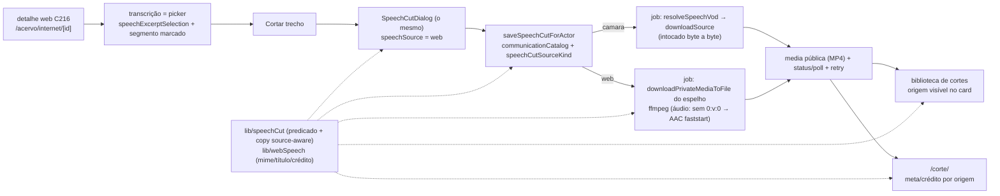

# Impl: C217 — Cortes e links compartilháveis na fonte "Falas na internet"

Status: aprovado
Atualizado em: 2026-09-24
Issue: #1293
Intenção: docs/plans/acervo-cortes-fonte-web.md
Appetite restante: herdado (~2–3 dias eng; um outcome verificável — a assessoria corta um trecho de uma fala da internet, o corte aparece na biblioteca com a origem visível e o link `/corte/<id>` abre no ponto certo, com download e crédito da origem real)

## Leitura da intenção

- **Outcome:** no detalhe da fala web (C216), "Cortar trecho" abre a janela de corte existente e gera o corte a partir do arquivo espelhado (sem resolver VOD); o corte entra na mesma biblioteca de cortes com a origem visível (YouTube/Rádio/Instagram/…), com a paridade C168/C183 (editar, apagar, "Tentar novamente", kill switch) e o mesmo contrato `/corte/<id>` (unlisted, `noindex`) com player, download, "Copiar link" e "Compartilhar no WhatsApp"; o crédito da página acompanha a origem real — nunca o crédito da Câmara para fala de terceiro.
- **O que NÃO negociar:**
  - **Contrato da Câmara congelado em bytes**: o gate de `createSpeechCut` (`speechVodCoordinates`, `actions/speech.ts:150-152`), os args de vídeo (`buildSpeechCutFfmpegArgs`, `lib/speechCut.ts:157-195`), os labels/fallback/mensagens default (`lib/speechCut.ts:35-40,73-94,124-141`), o `originOf` Câmara (`lib/speechCut.ts:397-404`), o crédito `Fonte: Câmara dos Deputados · CC BY 4.0` (`corte/[id]/page.tsx:20`, e2e pinado em `tests/e2e/campaignSpeechCut.e2e.spec.ts:152`) e o `/corte/<id>` como contrato — só conteúdo/crédito mudam, por origem.
  - **Fala web sem arquivo espelhado não oferece o corte** (questão 3 do gate): sem `mirroredMedia`, sem gesto.
  - **Gate fail-closed**: `requireCampaignPageActor({ gate: 'communicationCatalog' })` na página, `canReadCommunicationCatalog` nas ações, `user` + `overrideAccess: false` em toda leitura. `advisor`/`leader` negados; a rota de mídia/página já fecha em 404/redirect.
  - **Mídia privada nunca pública**: o espelho (`internetSpeechMedia`) só é lido pelo job e pelas rotas autenticadas; o que vira público é o MP4 derivado na `media`, como na Câmara.
  - **Mesma janela, mesmo diálogo, mesma biblioteca, mesmo link**: mínimo 5 s, sem teto (C170); `/corte/<id>` continua não listado e `noindex`; sem segundo mecanismo de mídia, corte ou compartilhamento; sem galeria pública; sem item de nav novo.
  - **Sem `Consent` novo, sem PII, sem segundo cadastro.**
- **O que reavaliar (hipóteses da intenção × código):**
  - A intenção cita o gate como `speechCatalog`; o nome real é `communicationCatalog` (renomeado no C194, `campaignPageActor.ts:41-42`) com o mesmo predicado `canReadCommunicationCatalog` — nada muda na prática.
  - A intenção fala "mesmo diálogo" sem dizer que o detalhe web hoje **não tem picker**: `WebSpeechDetailPlayer` só tem "Baixar"/"Abrir na origem" + transcrição click-to-seek (`WebSpeechDetailPlayer.tsx:124-141,165-190`). Esta entrega põe o picker na transcrição (D4) — sem toggle e sem `SpeechExcerptControls`/preview no v1 web.
  - `buildSpeechCutFfmpegArgs` mapeia `0:v:0` fixo (`lib/speechCut.ts:176`) — falha para fonte só-áudio (radio/Áudio), que a taxonomia do C215 exige cortar (D2).
  - `SpeechCut.speech` é relationship genérica (`SpeechCut.ts:71-81`) e nenhum campo novo é necessário ⇒ **sem migration** (D9).
  - `originOf`/`CutSpeechRecord` só conhecem o vocabulário da Câmara (`lib/speechCut.ts:219-226,397-404`) ⇒ fala web degrada para "Fala · data" e link errado na biblioteca (D5).
  - Os fallbacks/copy citam a Câmara em pontos que a fala web alcança: `buildSpeechCutFallbackMetadata` (`lib/speechCut.ts:137`), `speechCutStepLabels.resolving` (`:36`), `speechCutFailureMessage` (`:51-66,84-88`), fallback do diálogo (`SpeechCutDialog.tsx:385-388`), prompt do sistema (`speechCutMetadata.ts:40-46`) (D3/D6).
  - O job lê o espelho privado pelo dono de I/O já existente (`downloadPrivateMediaToFile`/`resolvePrivateMediaStaticDir`, `privateMediaResponse.ts:43-51,219-249`; precedente `recordingJob.ts:112-166`) e o VM web já tem `mediaKind` derivado do mime (`speechViewModels.ts:516-519`) — a regra só precisa ser extraída para o dono (D2).

## Abordagem recomendada

**Opções consideradas:** A) **estender o dono**: predicado puro de fonte em `lib/speechCut.ts`, branch `web` no job existente, copy source-aware com default Câmara e o picker reusando a máquina C166 no detalhe web | B) um pipeline de corte web gêmeo (`webSpeechCutJob`, `WebSpeechCutDialog`, `WebSpeechCutLibraryCard…`) | C) um resolvedor genérico de "fonte de corte" (interface `CutSource`) com adaptadores Câmara/espelho.

**Recomendação:** A — o corte já é a mesma unidade (`speechCut`, mesma biblioteca, mesmo `/corte/<id>`, mesmo job/retry/reaper); o que muda é só **como obter o arquivo de entrada** e **como nomear a origem**. O predicado puro no dono (`lib/speechCut.ts`) mantém a decisão em um único ponto; o branch do job é a variante mínima (baixar o espelho em vez do VOD) e os nomes de mime/crédito vão para `lib/webSpeech.ts` (dono da fonte web). `SpeechCut.speech` genérico (relação) evita migration.

**Rejeitadas:** B porque duplica transação, retry, reaper, poll, biblioteca, kill switch e página pública — a doutrina "edit the owner, don't twin" e a paridade pedida pela intenção não justificam um segundo pipeline; C porque abstrai para um 2º caso que é uma **variante de aquisição de arquivo** (baixar de outro lugar com mime diferente), não um domínio novo — a interface só adicionaria cerimônia sem volatilidade real.

### Decisões de engenharia

**D1 — A fonte do corte é um predicado no dono; o job ganha o branch `web` sem tocar no caminho Câmara.**
`Opções:` A — `speechCutSourceKind(speech): 'camara' | 'web' | null` em `lib/speechCut.ts` (`origin === 'web'` + `mirroredMedia` presente → `'web'`; `web` sem espelho → `null` (fail-closed, nunca cai no VOD da Câmara); senão `speechVodCoordinates` → `'camara'`; senão `null`) + `speechCutOriginKind(speech): 'camara' | 'web'` — o vocabulário de copy/prompt vem da fala, nunca do gate de aquisição, usado pelo gate da ação e pelo job | B — job web próprio | C — resolvedor genérico com adaptadores.
`Recomendação:` A — um predicado puro, unit-testável, que os dois lados (ação e job) consultam; o job reusa a transação, o retry, o reaper, os steps e o poll existentes.
`Rejeitadas:` B (twin de pipeline; duplicaria `withPayloadTransaction`/media pública/steps); C (interface sem 2º domínio real; a diferença é "de onde o input vem", não um serviço novo).

- `loadSpeechForCut` (`actions/speech.ts:92-102`) ganha `origin` e `mirroredMedia` no select; `createSpeechCut` troca o gate `speechVodCoordinates(speech)` (`:152`) por `speechCutSourceKind(speech)`; o dedupe in-flight e o schema do request ficam intocados.
- Recusa honesta por fonte: `origin === 'web'` sem espelho → **novo literal** `SPEECH_CUT_MIRROR_MISSING_MESSAGE = 'Esta fala não tem arquivo espelhado para cortar.'` (em `lib/schemas/speechCut.ts`, junto das outras mensagens de ação); Câmara sem VOD continua `SPEECH_VOD_INELIGIBLE_MESSAGE` (e2e pina "não tem trecho de vídeo", `campaignSpeechCut.e2e.spec.ts:240-242`).
- `speechCutJob.runSpeechCutJob` (`:116-198`): após carregar a fala, `const sourceKind = speechCutSourceKind(speech)`; `null` → falha com o literal por origem (`SPEECH_CUT_FAILURE_MIRROR_MISSING` na web, `SPEECH_VOD_INELIGIBLE_MESSAGE` na Câmara); `'web'` → **não chama** `resolveSpeechVod`/`downloadSource` (`:132-159`): carrega a linha privada por id (`payload.findByID({ collection: INTERNET_SPEECH_MEDIA_SLUG, id, depth: 0, overrideAccess: true })`, bypass documentado como os demais do job — o espelho é uma relação a 2 níveis, o depth 1 do corte só dá o id), baixa com `downloadPrivateMediaToFile({ media, staticDir: resolvePrivateMediaStaticDir(payload, INTERNET_SPEECH_MEDIA_SLUG), destinationPath })` e escolhe os args pelo mime (D2). Steps/transação/media pública/erros Câmara ficam idênticos.
- Espelho sumido no meio do job (arquivo/objeto ausente ou linha privada deletada) → falha fechado com `SPEECH_CUT_FAILURE_MIRROR_MISSING = 'O arquivo espelhado desta fala não está mais disponível.'` (novo literal em `lib/speechCut.ts`, sem citar Câmara).
- `retrySpeechCut`/reaper/poll não mudam: o retry reusa a mesma linha e o job redescobre a fonte pelo registro.
- **Câmara intocada byte a byte:** o branch `web` é novo; o fluxo `'camara'` continua exatamente o de hoje (`resolveSpeechVod`, `cachedUrls`, `downloadSource`, args de vídeo).

**D2 — ffmpeg para fonte só-áudio: variante de args + a regra de mime no dono web.**
`Opções:` A — `buildSpeechCutAudioFfmpegArgs` irmão puro em `lib/speechCut.ts` (sem `-map 0:v:0`; `-map 0:a:0` + AAC + `+faststart`; mesmo `-ss` antes do `-i` e `-t` de duração) e `webSpeechMediaKind(mimeType): 'video' | 'audio'` em `lib/webSpeech.ts`, reusada por `speechViewModels.mediaKindOf` e pelo job | B — parâmetro `mediaKind` na função de vídeo | C — transcode o áudio para um vídeo com capa gerada.
`Recomendação:` A — cada comando tem uma forma só, os pins de vídeo (`tests/unit/speechCut.unit.spec.ts:25-70`) ficam intocados e a regra "mime `audio/*` → áudio" passa a ter um dono único (hoje privada em `speechViewModels.ts:516-519`).
`Rejeitadas:` B (mistura dois comandos na mesma função e arrisca os pins); C (encode extra + capa inexistente; o produto quer o áudio como está).

- Corte de áudio continua **MP4** (`corte-<id>-<start>-<end>.mp4`, AAC, `+faststart`): é o contrato do card da biblioteca e da página `/corte/<id>` (D6) — nada de `.m4a`/segundo formato.
- `mediaKindOf` (`speechViewModels.ts:516-519`) passa a delegar: extrai o `mimeType` e chama `webSpeechMediaKind`; o resultado do detalhe web não muda (`media/` → `audio`, resto → `video`).
- O job escolhe os args por `webSpeechMediaKind(media.mimeType)`: `video` → `buildSpeechCutFfmpegArgs` (hoje), `audio` → `buildSpeechCutAudioFfmpegArgs` (novo).

**D3 — Copy source-aware, com default Câmara e bytes preservados.**
`Opções:` A — `source?: SpeechCutSourceKind` (default `'camara'`) nos builders puros + variante web dos literais, mantendo os literais da Câmara como default | B — dois conjuntos gêmeos de literais (`webSpeechCutCopy`) | C — não mexer na copy (hardcoded Câmara).
`Recomendação:` A — o parâmetro opcional preserva o comportamento atual (Câmara continua lendo exatamente os mesmos literais) e a web ganha copy honesta; a variante vive no mesmo dono, testada por unit.
`Rejeitadas:` B (twin de conhecimento que divergiria em silêncio); C (desonesto: fala de terceiro não pode dizer "na Câmara").

- `buildSpeechCutFallbackMetadata({ speechType, dateLabel, summary, source? })` (`lib/speechCut.ts:124-141`): Câmara inalterada; web → descrição `Trecho de ${type} de ${dateLabel}, publicado na internet.` (sem "na Câmara dos Deputados"); título igual (`Trecho de fala — <data>`), pois o tipo da linha web é nulo.
- `speechCutStepLabels` continua o record default (o select do admin em `SpeechCut.ts:33-36` não muda); novo `speechCutStepLabel(step, source)` com a variante web `resolving: 'Localizando o arquivo da fala'`; `speechCutStepStates(current, source = 'camara')` usa o helper (chamadas existentes seguem válidas).
- `speechCutFailureMessage({ error, step, source? })` (`:73-94`): mapeia `SPEECH_CUT_FAILURE_MIRROR_MISSING` para o próprio literal; com `source === 'web'`, o fallback do passo `resolving` vira `Não foi possível localizar o arquivo da fala.`; os demais fallbacks já são neutros; os causes nomeados da Câmara continuam no mapa. `toSpeechCutViewModel` deriva a fonte do próprio registro (`record.speech.origin === 'web' → 'web'`) para que o `failureMessage` de um corte web já saia honesto no poll/card.
- `SpeechCutDialog` ganha `speechSource?: SpeechCutSourceKind` (default `'camara'`; renomeado de `source` para não colidir com o estado da sugestão de IA): usa no fallback, nos labels dos steps e no texto do estado falhou; web → `Não foi possível preparar o corte desta fala agora. Tente novamente em alguns minutos.` (sem Câmara). `SpeechDetailPlayer` (Câmara) continua sem passar nada.
- `speechCutMetadata.suggestSpeechCutMetadata` ganha `source?`, `speechTitle?`, `platformLabel?`: Câmara mantém system prompt/prompt atuais; web troca a primeira frase do system prompt para "falas do deputado federal Jorge Solla publicadas na internet", compõe o restante do prompt com o MESMO tail (parâmetro só no vocabulário do âncora) e acrescenta as linhas `Título:`/`Plataforma:` ao prompt — sem inventar fatos, o fallback determinístico segue cobrindo key/timeout/saída vazia. `suggestSpeechCutMetadataForActor` passa os dados da fala (`origin`/`platform`/`title` entram no select).
- Copy administrativa: `SpeechCut.admin.description` e o comentário do topo da collection passam a citar as duas origens ("Câmara (CC BY 4.0) e falas espelhadas da internet") — descrição de admin não é schema (sem migration).

**D4 — Seleção/markup no detalhe web: a transcrição é o picker, fiel ao artefato.**
`Opções:` A — transcrição clicável acumulando o que o C216 já faz (seek) + a máquina pura C166 (`initialExcerptRange`/`extendRangeToSegment`, `speechExcerptSelection.ts:99-148`) marcando o trecho, e "Cortar trecho" abrindo o `SpeechCutDialog` existente | B — os dois botões da Câmara ("Selecionar trecho" + controles de início/fim + preview) no detalhe web | C — "Cortar trecho" abrindo o diálogo com um range default sem picker.
`Recomendação:` A — o artefato (`acervo-cortes-fonte-web-ui-design.html` cenas 01/02/06) mostra **um** botão primário e a transcrição já marcada; a geometria pura já existe e é testada; o clique duplo (seek + marca) mantém o comportamento C216.
`Rejeitadas:` B (o artefato não pede; `SpeechExcerptControls`/preview é maquinário da Câmara, mais superfície e mais risco de colisão); C (não escolhe o trecho — o job precisaria de um range arbitrário).

- `WebSpeechDetailPlayer`: estado `selection: ExcerptRange | null` começa **nulo** (nada marcado ao abrir a página); o picker é oferecido quando há espelho e `isExcerptSelectionAvailable(speech.durationSeconds, speech.segments)` (Q3: sem espelho não há gesto). Clique no segmento: `seekTo(segment.startSeconds)` (comportamento C216) **e** `setSelection((current) => current ? extendRangeToSegment(current, segments, index, duration) : selectSegmentRange(segments, index, duration))` — o primeiro clique marca a frase sozinha, os seguintes estendem como na Câmara. "Cortar trecho" abre com `selection ?? initialExcerptRange(segments, duration)`.
- Segmento marcado: `selected={segment.endSeconds > selection.startSeconds && segment.startSeconds < selection.endSeconds}` (mesmo overlap do player da Câmara, `SpeechDetailPlayer.tsx:871-874`); `CampaignTranscriptSegmentButton` ganha `selected?: boolean` (+ `data-selected` para o e2e) que **OR**a nas classes atuais de `active` (`CampaignTranscriptSegmentButton.tsx:40-44`) — dono único; Câmara e gravações não passam a prop e ficam intactas.
- "Cortar trecho" (`Button` default, primeiro da linha de ações, só com picker disponível) abre o `SpeechCutDialog` existente com `speechId={speech.id}`, `speechType={null}`, `dateLabel={speech.dateLabel}`, `summary={null}`, `range={selection}` e `speechSource="web"`; `onPublished` guarda o corte e o `SpeechCutResultCard` in-session renderiza como hoje (thumb YouTube é condicional e some na web).
- Hint sob os botões: `Selecione na transcrição as frases do trecho.` — o `ou ajuste início e fim na janela de corte` do artefato promete um ajuste que o web v1 não tem (o diálogo mostra o intervalo, não o edita); a copy fiel ao que existe fica sujeita à crítica do `designer` no fechamento; a linha da transcrição vira `Transcrição · clique nas frases` (desktop) / `Transcrição · toque para selecionar` (mobile, cena 06) — só no detalhe web.
- Ações do detalhe web ficam na ordem/ênfase do artefato: "Cortar trecho" (primário), "Baixar" (`outline`), "Abrir na origem" (ghost). Sem "Selecionar trecho"/toggle e sem preview nesta fase — **decisão barata com gatilho** (revisitar se a assessoria pedir preview do trecho ou na paridade C219).
- Sem segmentos: o picker não aparece (nada clicável); sem ASR mas com duração ≥ 5 s, o botão abre o diálogo com `0..5` (`initialExcerptRange` sem segmentos).

**D5 — Origem visível na biblioteca e no detalhe do corte, no dono atual.**
`Opções:` A — `CutSpeechRecord`/`SpeechCutOriginViewModel` ganham os campos da origem e `originOf` (`lib/speechCut.ts:397-404`) ramifica (Câmara = bytes; web = título/plataforma/href do detalhe web) | B — um módulo/VM gêmeo só para cortes web | C — resolver o título da fala no componente (fetch no RSC).
`Recomendação:` A — a biblioteca continua uma lista só; o ramo é do próprio `originOf`, com o href correto (`campaignInternetSpeechHref`) e o rótulo de plataforma do dono (`webSpeechPlatformLabel`).
`Rejeitadas:` B (twin do mesmo view model/lista); C (I/O no componente, sem camada testável e repetido por card).

- `CutSpeechRecord` (`lib/speechCut.ts:219-226`) ganha `origin?: 'camara' | 'web' | null`, `platform?: WebSpeechPlatform | null`, `title?: string | null`; `SpeechCutOriginViewModel` ganha `source: 'camara' | 'web'`, `platform: WebSpeechPlatform | null` (o pill deriva o rótulo do dono); `originOf` Câmara mantém `label`/`href` byte a byte e a web produz `href = campaignInternetSpeechHref(id)`, `platform = platform`, `label` = título de exibição da fala.
- Título de exibição da fala web: extrair `webSpeechTitle` (hoje privado em `speechViewModels.ts:460-461`, fallback `Fala da internet #<id>`) para `webSpeechDisplayTitle({ id, title })` em `lib/webSpeech.ts` e reusar nos dois lados — sem mudar bytes do VM atual.
- `SpeechCutLibraryCard` (cena 04/06): quando `origin.source === 'web'`, badge `Origem: <plataforma>` na linha do status (o mesmo prefixo em todos os breakpoints; o pill reusa `WebSpeechPlatformPill`) e a linha da origem vira link para o **detalhe web** com o título da fala + duração do corte (como hoje); Câmara sem badge e com o link de sempre.
- `SpeechCutOriginCard` (detalhe do corte): heading/link source-aware — Câmara `Discurso de origem`/`Ver fala no acervo` (bytes); web `Fala de origem`/`Ver fala na internet` com a plataforma visível.
- Sem alteração de loader: `loadSpeechCutAcervoPageData`/`findSpeechCutForActor` já leem depth 1 sem select (`speechCutPageData.ts:72-81`, `speechCutData.ts:19-27`) — os campos de origem já vêm no objeto; só o tipo e o mapper mudam.

**D6 — Página pública `/corte/<id>`: meta e crédito por origem (cenas 04/05).**
`Opções:` A — a mesma página ramifica pela origem da fala (`speech.origin === 'web'`), com meta `Fala na internet · <data> · <duração> · <plataforma>` e crédito `Fonte: <plataforma> · <canal>` (canal ausente → só a plataforma); fala de origem ausente (FK null) → omitir a linha de crédito | B — página pública separada para cortes web | C — manter o crédito da Câmara.
`Recomendação:` A — o link compartilhado é o mesmo contrato (a intenção confirmou a paridade); o que muda é conteúdo/crédito, derivado da fala — nunca afirmar a Câmara para terceiro nem para origem desconhecida.
`Rejeitadas:` B (quebraria o link `/corte/<id>` — STOP condition); C (desonesto).

- `corte/[id]/page.tsx`: a meta da linha (`:152-168`) passa a escolher por `speech?.origin === 'web'`; o link "Ver sessão no YouTube" continua condicionado a `youtubeUrl` (null na web); o rodapé (`:216-221`) usa o crédito do ramo. Câmara → bytes atuais (e2e pina).
- Crédito web por helper puro em `lib/webSpeech.ts`: `webSpeechCreditLabel({ platform, channel }): string | null` → `null` sem plataforma; senão `<label>` ou `<label> · <channel>`; a página renderiza `Fonte: <label>` e **omite a linha** quando o helper é null (fala de origem deletada / sem plataforma) — registrar como decisão barata + gatilho.
- Poster/OG: `youtubeCoverUrl` (`:34-37`) só existe para Câmara; a web cai no fallback global de OG (`resolveOgImage(null)`) — nada a mudar.
- O corte de áudio continua servido no `<video>` (`:136-145`): um MP4 AAC toca normalmente; a página não muda de estrutura.

**D7 — O VM do detalhe web expõe `durationSeconds` (o loader já o seleciona).**
`Opções:` A — `WebSpeechDetailViewModel` ganha `durationSeconds: number | null` (o `select` já traz `durationSeconds`, `speechPageData.ts:291-300`; o builder só não o copiava) | B — derivar do último segmento no client | C — endpoint/loader novo.
`Recomendação:` A — é o valor armazenado que o picker/o diálogo usam (`excerptSelectionDuration` já tem o fallback para o fim do último segmento); sem I/O novo.
`Rejeitadas:` B (regra duplicada no client; pode divergir do armazenado); C (cerimônia).

**D8 — Prova por camada: unit + int (fake ffmpeg) + CI com ffmpeg real; o e2e não dirige o job.**
`Opções:` A — unit para os puros (predicado, args de áudio, copy, origin VM, crédito, VM), int para o job com espelho em disco + fake ffmpeg (byte a byte, sem tocar na Câmara) e o bloco CI com ffmpeg real, e2e HTTP para markup/rota/crédito/badge sem rodar o job | B — e2e dirigindo o corte real | C — só unit.
`Recomendação:` A — segue o precedente do C167 (`tests/int/speechCut.int.spec.ts:432-450` fake; `:560-622` real no CI) e o e2e continua barato/estável (o C167 já deliberou não dirigir o job por HTTP).
`Rejeitadas:` B (flaky, depende de ffmpeg/bytes válidos no servidor e de timing do `after`); C (não prova branch/transação/proveniência).

- **Trigger do C216 vencido:** o simplify do C216 deixou D2 "bytes MP4/MP3 de fixture copiados entre os int specs de fala web" com gatilho "3º spec de fala web precisar dos bytes" — este é o 3º (`speechCut.int`). Extrair para `tests/helpers/webSpeechMediaFixture.ts` os bytes mágicos (MP4/MP3/JPEG) e um `createInternetSpeechMedia(payload, bytes, filename)` (o padrão de `webSpeechAcervo.int.spec.ts:48-65`), atualizando os imports dos 2 specs existentes (mecânico, sem mudança de comportamento).

**D9 — Sem migration, sem Consent, sem escrita multi-coleção nova; invariantes mantidas.**
`Opções:` A — nenhuma collection/campo novo (a relação `speechCut.speech` já é genérica; a origem se lê da fala) | B — persistir a origem (`origin`) no `SpeechCut` | C — collection/join nova.
`Recomendação:` A — nada do outcome exige schema novo; o job mantém a única transação existente (media pública + update do corte) e o retry segue por linha.
`Rejeitadas:` B (só teria valor se o crédito precisasse sobreviver à exclusão da fala — gatilho da decisão barata do crédito); C (twin).

- Access: gate `communicationCatalog` na página e nas ações; `user` + `overrideAccess: false` em toda leitura/escrita de ator; o job usa os bypasses **intencionais** já documentados (leitura do corte/fala/espelho e escrita de estado); a collection `SpeechCut` e `Speech.access` não mudam.
- Sem `Consent`/PII/segundo cadastro; identificadores em inglês, copy pt-BR.

### Decisões baratas (com gatilho de revisitação)

- **Sem toggle "Selecionar trecho" nem `SpeechExcerptControls`/preview no web v1:** o picker é a transcrição; revisitar se a assessoria pedir ajuste fino/preview no web ou na paridade C219.
- **Crédito omitido quando a fala de origem sumiu (FK `SET NULL`):** não afirmar a Câmara; se um dia o crédito precisar sobreviver à exclusão da fala, persistir a origem no próprio corte.
- **Corte de áudio continua MP4 no `<video>` da página pública:** sem capa/poster de áudio; revisitar se algum player tratar mal (o `preload="metadata"` já cobre).
- **Rótulo do passo `resolving` no admin segue "Localizando o trecho na Câmara":** admin-only e default do record; revisitar se um operador estranhar.
- **Heading/link do `SpeechCutOriginCard` web** ("Fala de origem"/"Ver fala na internet") é craft sujeito à crítica do `designer` no fechamento.
- **`webSpeechDisplayTitle` extraído para `lib/webSpeech`:** sem mudança de bytes; se a extração incomodar o diff, manter o fallback local ao `originOf` (mesmo texto).

### Componentes / mudanças

- **`src/lib/speechCut.ts`** (editar): `SpeechCutSourceKind`, `speechCutSourceKind`, `SPEECH_CUT_FAILURE_MIRROR_MISSING`, `buildSpeechCutAudioFfmpegArgs`, `speechCutStepLabel`/`speechCutStepStates(current, source?)`, `buildSpeechCutFallbackMetadata({…, source?})`, `speechCutFailureMessage({…, source?})`, `CutSpeechRecord`/`SpeechCutOriginViewModel` com os campos de origem, `originOf` ramificado e `toSpeechCutViewModel` derivando a fonte do registro. `buildSpeechCutFfmpegArgs` e o ramo Câmara intocados.
- **`src/lib/webSpeech.ts`** (editar): `webSpeechMediaKind`, `webSpeechDisplayTitle`, `webSpeechCreditLabel` (puros; o módulo segue sem importar `@/utilities`).
- **`src/lib/schemas/speechCut.ts`** (editar): `SPEECH_CUT_MIRROR_MISSING_MESSAGE`.
- **`src/utilities/speech/speechViewModels.ts`** (editar): `mediaKindOf` delega a `webSpeechMediaKind`; `webSpeechTitle` delega a `webSpeechDisplayTitle`; `WebSpeechDetailViewModel.durationSeconds`.
- **`src/utilities/speech/speechCutMetadata.ts`** (editar): prompt/prompt line source-aware (Câmara default).
- **`src/utilities/speech/speechCutJob.ts`** (editar): branch `'mirrored'` (fonte privada via `findByID` + `downloadPrivateMediaToFile` + args de áudio), falha honesta do espelho; Câmara intocado.
- **`src/app/(campaign)/campanha/actions/speech.ts`** (editar): select com `origin`/`platform`/`title`/`mirroredMedia`; gate por `speechCutSourceKind`; mensagem de recusa por origem; sugestão com os dados da fala.
- **`src/components/campaign/shared/CampaignTranscriptSegmentButton.tsx`** (editar): `selected?: boolean` + `data-selected` (OR nas classes de `active`).
- **`src/components/campaign/speech/WebSpeechDetailPlayer.tsx`** (editar): picker (estado + clique seek/marca), botão "Cortar trecho", hint do artefato, `SpeechCutDialog` com `source`, `SpeechCutResultCard` in-session, transcrição com `selected`.
- **`src/components/campaign/speech/SpeechCutDialog.tsx`** (editar): prop `speechSource?` (default Câmara) nos labels/fallback/erro.
- **`src/components/campaign/speech/SpeechCutLibraryCard.tsx`** / **`SpeechCutOriginCard.tsx`** (editar): badge de origem e heading/link source-aware.
- **`src/app/(frontend)/corte/[id]/page.tsx`** (editar): meta e crédito por origem; linha de crédito omitida sem origem.
- **`src/collections/SpeechCut.ts`** (editar): só `admin.description`/comentário (sem schema).
- **Testes** (editar/novos): `tests/unit/speechCut.unit.spec.ts`, `tests/unit/webSpeech.unit.spec.ts`, `tests/unit/speechViewModels.unit.spec.ts`, `tests/unit/speechCutDialog.unit.spec.tsx`, `tests/unit/speechExcerptSelection.unit.spec.ts` (se algum caso novo de integração com o picker surgir), `tests/int/speechCut.int.spec.ts`, `tests/e2e/campaignSpeechCut.e2e.spec.ts`, `tests/e2e/campaignSpeechAcervo.e2e.spec.ts`, `tests/helpers/webSpeechMediaFixture.ts` (trigger do C216 D2).
- **Migration:** nenhuma (D9) — se qualquer etapa concluir que precisa de schema, **parar** e registrar (STOP condition).
- **Access / Consent:** nada muda; o gate e os bypasses intencionais do job são os já existentes.
- **UI:** Impeccable C — port classe-a-classe do artefato (`acervo-cortes-fonte-web-ui-design.html`, cenas 01–06, já aprovado no gate); sem trigger (a) novo (o artefato cobre web video/áudio, seleção, diálogo, biblioteca e pública); a crítica final do `designer` (trigger c) fecha a entrega com `Design tier` no PR.

### Dados → forma (se aplicável)

- **N/A por decisão da intenção** (`acervo-cortes-fonte-web.md:53-55`): superfície de ação sobre a lista paginada existente; sem métricas de vaidade nem contadores. Nada a apresentar.

## Fases verificáveis

1. **Tracer / contrato + servidor + job (~1 dia).**
   - `lib/speechCut.ts` (predicado, args de áudio, copy/step/failure source-aware, origin VM), `lib/webSpeech.ts` (mime/título/crédito), `lib/schemas/speechCut.ts` (recusa web), `speechViewModels` (delegações + `durationSeconds`), `speechCutMetadata`, `speechCutJob` (branch), `actions/speech.ts` (select/gate/sugestão).
   - Prova: extensões de `tests/unit/speechCut.unit.spec.ts` (predicado, args áudio, fallback web sem Câmara, failure/step web, origin VM Câmara×web), `tests/unit/webSpeech.unit.spec.ts` (mime/título/crédito), `tests/unit/speechViewModels.unit.spec.ts` (`durationSeconds` + mediaKind), `tests/unit/speechCutDialog.unit.spec.tsx` (source nos labels/fallback); `tests/int/speechCut.int.spec.ts`: corte web com espelho em disco + fake ffmpeg publica e **não toca no fetch da Câmara** (`fetch` stub que lança), web sem espelho falha fechado (ação e job), áudio escolhe args sem `0:v:0` (via `FAKE_FFMPEG_LOG`), biblioteca com proveniência web×Câmara, pins da Câmara verdes; extração do `tests/helpers/webSpeechMediaFixture.ts` (C216 D2).
2. **UI port (~1–1,5 dia).**
   - `WebSpeechDetailPlayer` com picker e "Cortar trecho"; `SpeechCutDialog` com `source`; `CampaignTranscriptSegmentButton` com `selected`; `SpeechCutLibraryCard` com badge; `SpeechCutOriginCard` source-aware; `corte/[id]/page.tsx` com meta/crédito por origem.
   - Prova: e2e estendido — `campaignSpeechAcervo`: detalhe web com "Cortar trecho", transcrição marcada (`data-selected`, hint do artefato) e sem "Selecionar trecho"; `campaignSpeechCut`: corte web publicado (seed REST) com "Fala na internet", crédito `Fonte: <plataforma> · <canal>`, sem "Ver sessão no YouTube"/crédito da Câmara, card da biblioteca com a origem, e recusa honesta de fala web sem espelho; pins da Câmara (crédito `/corte`, "Selecionar trecho" no detalhe Câmara) intactos; `pnpm dev` manual contra as cenas 01–06.
3. **Gates / fechamento (~0,5 dia).**
   - `pnpm gate:fast`; cascata cheia (`pnpm lint`, `pnpm format:check`, `tsc --noEmit`, `pnpm exec knip`, `pnpm check:cycles`, `pnpm test`, `pnpm build`); `pnpm test:e2e:affected`; conferir o manifest (`src/lib/speech*`, `src/components/campaign/speech`, `comunicacao`, `/corte` já cobrem; `src/lib/schemas` é risk prefix curado — sem entry nova); crítica do `designer` (trigger c) com `Design tier` no PR; entrada `docs/changelog/2026-09-24-c217.md`; `pnpm push` + PR.

Quota: ~2–3 dias eng, dentro do appetite herdado. Se apertar, os cortes são o badge mobile curto e o heading source-aware do `SpeechCutOriginCard` (craft; o título/link com href correto permanece) — **nunca** os pins/bytes da Câmara, o gate, o crédito honesto ou o picker.

## Rabbit holes / Não escopo (engenharia)

- Editor de corte/timeline/legendas/re-render; preview do trecho e ajuste fino no web (decisão barata com gatilho).
- Segundo player, segundo diálogo, segunda biblioteca ou segunda página de compartilhamento — tudo reusa os donos.
- Filtro por origem na biblioteca (questão 2 do produto: só o rótulo no card nesta fase) e resolução/download sob demanda de fala sem espelho (questão 3).
- Campo/collection novos no `SpeechCut` ou em `Speech` (migration desnecessária).
- Ingestão/espelhamento (C215), fonte/lista/detalhe além do gesto de corte (C216), skill (C218), paridade de filtros (C219).
- Publicação em rede social, galeria pública, embed/SDK; contadores de views/downloads.
- Mexer no VOD/player/cortes/cobertura/Sollinha da Câmara; abrir a web no player da Câmara ou vice-versa.
- Consent/PII/segundo cadastro; item de nav novo.
- Rodar o job real no e2e; tocar no `/api/media/file` (público por contrato só para o corte derivado, como na Câmara).

## Riscos e mitigação

- **Regressão da Câmara por estender donos compartilhados.** Defaults explicitamente Câmara (`source = 'camara'`, `speechCutStepLabels` intacto, `buildSpeechCutFfmpegArgs` intocado, `originOf` Câmara byte a byte); unit pins (`speechCut.unit.spec.ts:25-70,243-290`) e e2e pin do crédito (`campaignSpeechCut.e2e.spec.ts:152`) verdes sem adaptação; qualquer diferença de bytes no caminho Câmara é bug de PR.
- **Colisão seek × seleção no player web.** Um handler só (seek + máquina pura), estado único de `selection`, overlap na marcação igual ao da Câmara e nenhum toggle; `speechExcerptSelection` já é unit-testada (mínimo 5 s, sem teto, extensão por frase).
- **MP4 só-áudio em players/página pública.** AAC em MP4 com `+faststart`; o `<video>`/`<audio>` e o card continuam com o mesmo contrato `.mp4`; unit pina a variante de args e o bloco CI com ffmpeg real pode provar a reprodução do contêiner.
- **Crédito quando a fala de origem some (FK `SET NULL`).** A linha é omitida (nunca afirmar Câmara); teste unit do helper + e2e futuro se um dia o crédito persistir no corte (gatilho registrado).
- **Job lendo mídia privada a 2 níveis.** Leitura explícita `findByID` no `internetSpeechMedia` com bypass documentado (precedente `recordingJob.ts:112-166`); a transação existente não muda.
- **Fixture de mídia real no e2e/int.** Bytes mágicos válidos (padrão C215/C216) e fake ffmpeg no int; o e2e não dirige o job (só HTTP/markup), evitando flakiness de encode.
- **Concorrência de seed no e2e (OPS72).** Se rodar em paralelo, `--workers=1`; os fixtures de fala já namespaced por `marker`/UUID.
- **Fala web sem duração/segmentos.** O picker só aparece quando `isExcerptSelectionAvailable` e há espelho; sem segmentos não há clique (o diálogo abre com o default 0..5); a ação continua recusando range inválido (`resolveExcerptRange`) — fail-closed.
- **Prompt de IA para fala web.** Variação só na primeira frase + linha de origem/título; sem fatos novos; o fallback determinístico cobre key/timeout/saída vazia (int do fallback).

## Aceite de engenharia

- [ ] Aceite de produto da intenção coberto: "Cortar trecho" no detalhe web gera o corte do arquivo espelhado (sem VOD/plataforma); paridade de biblioteca (editar/apagar/retry/kill switch) e `/corte/<id>` unlisted com player/download/copiar/WhatsApp; janela de 5 s sem teto; crédito por origem (nunca Câmara para terceiro, omitido quando a origem sumiu).
- [ ] Guardrails: gate `communicationCatalog` em página/rotas/ações; `advisor`/`leader` fail-closed; fala web sem espelho sem gesto; sem segundo mecanismo de mídia/corte/compartilhamento; `/corte/<id>` continua não listado/`noindex`.
- [ ] Câmara congelada: args de vídeo, labels/fallback default, `originOf` Câmara, crédito `Fonte: Câmara dos Deputados · CC BY 4.0` e pins unit/int/e2e verdes sem adaptação.
- [ ] Sem migration (nenhuma collection/campo; `SpeechCut` só com descrição de admin) — se alguma surgir, o fluxo para e registra.
- [ ] Invariantes AGENTS/engineering-standards: `user` + `overrideAccess: false` nas leituras/ações; bypasses do job intencionais e documentados; mídia privada nunca pública (só o MP4 derivado); sem `Consent`/PII; copy pt-BR/identificadores em inglês; sem `openai/*` fora do `designer` (OPS123).
- [ ] Testes previstos: unit (predicado/args áudio/copy/failure/origin VM/crédito/`durationSeconds`), int (job espelho publica sem tocar na Câmara, web sem espelho falha fechado, variante áudio, proveniência na lista), e2e (detalhe com o gesto e a transcrição marcada, corte web na biblioteca e na página pública com crédito, recusa sem espelho) com o pin da Câmara intacto; trigger do C216 D2 extraído.
- [ ] Gates: `pnpm gate:fast` e a cascata cheia; `pnpm test:e2e:affected`; manifest conferido (sem entry nova); crítica do `designer` (trigger c) registrada como `Design tier`; `docs/changelog/2026-09-24-c217.md`; `pnpm push`/PR.

## Self-score de decision-quality

**4,5/5.**

1. **Decisões caras com rejeitadas:** as 9 decisões (predicado/job, ffmpeg áudio, copy, picker, biblioteca, página pública, VM, prova por camada, sem migration) têm opções, recomendação e rejeitadas ancoradas no código (`actions/speech.ts:150-152`, `lib/speechCut.ts:157-195,397-404`, `speechViewModels.ts:516-519`, `SpeechCut.ts:71-81`, `privateMediaResponse.ts:219-249`, precedente `recordingJob.ts:112-166`, deliberação do C167 sobre não dirigir o job no e2e).
2. **Cabe no appetite:** ~2–3 dias herdados; tracer no contrato+job antes do port de UI; sem infra/migration/segundo pipeline; reusa diálogo, biblioteca, página, transação, retry/reaper, máquina C166, dono de I/O privado e shells. Cortes de contenção nomeados.
3. **Rabbit holes nomeados:** preview/timeline no web, twin de pipeline/VM, filtro por origem, resolução sob demanda, campo novo no schema, publicação/galeria, mexer na Câmara.
4. **Depth check:** reusa `speechCutSourceKind` no dono, `downloadPrivateMediaToFile`/`resolvePrivateMediaStaticDir`, `speechExcerptSelection`, `CampaignTranscriptSegmentButton`, `SpeechCutDialog`, `originOf`, e extrai para lib pura só as regras de mídia/título/crédito da fonte web (e o fixture do trigger vencido do C216), sem gêmeos.
5. **Intenção preservada:** a engenharia não reescreveu o produto — mesmo diálogo, mesma biblioteca, mesmo link, mínimo 5 s sem teto, crédito honesto por origem; o que ficou de fora é exatamente o que a intenção cortou.

Perde 0,5 porque duas superfícies de copy (recusa/job do espelho e o heading/link do `SpeechCutOriginCard` web) são literais de engenharia propostos — honestos e sem Câmara, mas sujeitos ao ajuste da crítica do `designer` no fechamento; e o visual "ativo × selecionado" (mesmo tratamento no segmento) é uma simplificação deliberada com gatilho, não um desenho novo do artefato.

## Simplify — triage dos revisores (2026-09-24)

Dois revisores paralelos (estrutural + qualidade) sobre o diff. Aplicados na sessão (não reabrir): `speechCutOriginKind` para separar o vocabulário de copy/prompt do gate de aquisição (a sugestão de fala web sem espelho não cai mais no prompt da Câmara); `disableErrors` na leitura do espelho + catch da cópia do arquivo → o literal `SPEECH_CUT_FAILURE_MIRROR_MISSING` cobre linha e objeto sumidos (guard antes morto); prefixo de janela compartilhado entre os dois comandos ffmpeg (pins de vídeo verdes); prompt de IA composto por um tail único (Câmara byte a byte); `mediaIdOf` privado removido em favor de `relationshipId`; `segmentInExcerpt` no dono da geometria (os dois players não podem divergir); picker gateado por espelho + `durationSeconds` (o servidor recusa o que o client oferecia com fallback de segmento); hint só com segmentos; plataforma visível no `SpeechCutOriginCard`; `aria-pressed` no segmento marcado; unit novo `webSpeechDetailPlayer.unit.spec.tsx` provando o gesto (`data-selected`, extensão por frase, diálogo com a janela). Descartados: unificar os dois `createWebSpeech` dos e2e (atores diferentes: REST × Local API), dedup do JPEG do e2e C216 (o trigger do C216 D2 é dos int specs; o runner e2e não resolve o alias), guards defensivos do `openCutDialog`/`if (sourceUrl)` e um helper para o ternário da página pública (churn > ganho).

## Crítica final do designer (trigger c, 2026-09-24)

`certificado (tier primário — openai/gpt-5.6-sol)`, após três rodadas. A primeira crítica encontrou 8 bloqueantes; aplicados os de escopo (hierarquia do CTA — "Cortar trecho" primário, "Baixar" outline, "Abrir na origem" ghost; ativo × selecionado separados no segmento, com o trecho em reprodução neutro; anatomia da janela com trilho, alças e campos Início/Fim; kit produtivo no card da biblioteca com "Copiar link" primário e rótulos compactos "Baixar"/"WhatsApp" no mobile; copy honesta do estado sem espelho) e recapturada a evidência de "Processando" com a progressão real de passos (o label web do passo 1 não cita a Câmara). Dois bloqueantes foram devolvidos como desvios pré-existentes fora do diff proprietário, aceitos pelo designer: o **header público global** (`SiteHeader` compartilhado, não tocado) e o **FAB/nav inferior do shell** (chrome de todas as páginas `/campanha`). Registro no PR: `Design tier: openai/gpt-5.6-sol` + os desvios aceitos.

## Adiado com gatilho

- **Fixtures de fala web nos e2e** (triage do simplify, P1+P2): os dois `createWebSpeech` dos e2e divergem por ator (REST para o espelho × Local API para a fala) e o `JPEG_BYTES` do spec C216 segue copiado apesar de `WEB_SPEECH_JPEG_BYTES` (o runner e2e importa `src/` por caminho relativo). Gatilho: **3º spec e2e de fala web** precisar criar espelho/fala ou reusar os bytes — extrair o helper compartilhado então.
