# Impl: Acervo: encontrar cortes — na navegação, na fala e na busca

Status: aprovado
Atualizado em: 2026-09-16
Issue: #1084
Intenção: docs/plans/acervo-encontrar-cortes.md
Appetite restante: herdado (~1,5–2 dias eng)

## Leitura da intenção

- **Outcome:** a assessoria **reencontra um corte existente e o reaproveita** pelos três caminhos — subitem de nav (biblioteca a um clique), seção "Cortes desta fala" no detalhe da fala, e cortes aninhados sob a fala na busca do acervo — sem recortar de novo. É descoberta e reuso; **nenhum modelo de dados novo**.
- **O que NÃO negociar:** gate `speechCatalog` (`communicator`/`coordinator`/`candidate` passam; `advisor`/`leader` fail-closed); corte sempre pertence a uma fala (FK `SET NULL`, UI degrada); corte **não** vira grupo/lista separada na busca; nenhum internals de corte (media/status cru/`error`) vaza; `/corte/<id>` público **intocado**; sem `Consent`, sem collection, sem migration.
- **O que reavaliar:** (a) o C168 **não** deixou item de nav nem breadcrumb — o dono não achou a edição (D9 do C168: só CTA na lista + chrome); a árvore `CampaignNavItem` é **plana** e não tem subitens; (b) não existe seção de cortes no detalhe da fala nem query cortes-por-fala; (c) a busca só cobre `speech.searchText`/`keywords` — corte não casa; (d) o "Selecionar trecho" é **interno** ao player (`SpeechDetailPlayer.tsx:449-461`), sem trigger externo.

## Abordagem recomendada

```mermaid
flowchart TD
  subgraph nav["D1/D5/D7 — descoberta pela navegação"]
    NAV[nav.ts: CampaignNavItem.subItems em Comunicação] --> SIDEBAR[CampaignSidebar: SidebarMenuSub]
    NAV --> OVERFLOW[CampaignBottomNav: drawer mobile flatten]
  end

  subgraph speech["D2/D4 — descoberta pela fala de origem"]
    SPEECH[acervo/id/page.tsx] --> GATE[requireCampaignPageActor gate speechCatalog]
    GATE --> LOADSPEECHCUTS[loadSpeechCutsForSpeech: speechCut where speech=id depth 0 sort -createdAt]
    LOADSPEECHCUTS --> VM[toSpeechCutViewModel]
    VM --> SECTION["Cortes desta fala" populado/empty]
    SECTION -->|empty CTA| CTA[SpeechExcerptCta → evento → SpeechDetailPlayer.requestSelection]
  end

  subgraph search["D3 — descoberta pela busca"]
    ACERVO[acervo/page.tsx] --> LOADACERVO[loadSpeechAcervoPageData]
    LOADACERVO --> BATCH[loadSpeechCutsForSpeeches: where speech in ids]
    BATCH --> NESTED[SpeechResultList/SpeechResultCard: cutsBySpeech aninhado]
    LOADACERVO -->|opção B, GATE| CUTQUERY[speechCut title/description like q depth 1]
    CUTQUERY --> MERGE[merge dedupe por speech id → card de origem mínimo]
  end
```

**Opções consideradas:**

- **A — Estender a árvore de nav com subitens estáticos + aninhar cortes na fala/busca (dono único de cada concern).**
- **B — Tipo dedicado `CommunicationNavItem` para a vertical + renderer paralelo.**
- **C — Abas Falas|Cortes na home da Comunicação + grupo "Cortes" separado na busca.**

**Recomendação: A** — a navegação vira dado aditivo (`subItems`), então o **mesmo** `nav.ts` alimenta os dois consumidores (sidebar desktop/sheet e drawer mobile) sem duplicar verdade; a seção da fala e a busca reusam os loaders/VM do C168/C167 (`toSpeechCutViewModel`, `SpeechCutStatusBadge`, `loadSpeechCutsForSpeeches` sobre `speech` index). A árvore plana de hoje não expressa hierarquia e o pin `getCampaignNav('communicator')` é sobre os **hrefs de topo** (`campaignNav.unit.spec.ts:68`), preservado por uma extensão aditiva.

**Rejeitadas:** **B** porque um tipo/renderer dedicado à vertical fura a fonte única do `nav.ts` e obriga a manter dois caminhos de render (o vazamento que queremos evitar); **C** já rejeitada em produto — o acervo é facetado (`speechListFilters.ts:34-57`) e a biblioteca é só `q`+paginação (`speechCutListUrl.ts`), e o grupo "Cortes" recria a lista paralela que motivou o pedido.

### Decisões de engenharia (caras de reverter)

**D1 — Forma da árvore de nav (subitens estáticos).**

Opções: A) adicionar `subItems?: readonly CampaignNavSubItem[]` a `CampaignNavItem`, com `CampaignNavSubItem = { title; href }` (sem ícone), e renderizar em `CampaignSidebar` (via `SidebarMenuSub*`) + `CampaignBottomNav` (drawer) | B) tipo dedicado `CommunicationNavItem` + renderer próprio | C) "grupo" separado, como `staffSecondaryNav` (Conceitos).

**Recomendação: A** — a extensão é **aditiva e rasa**: `icon` continua obrigatório no item de topo (nenhum `<item.icon />` precisou de narrowing), e o sub-item segue sem ícone como no design (CENA 01: dois links indentados, só texto). Nomear o campo `subItems` (não `children`) evita colidir com a prop JSX `children` que o `CampaignSidebarLink` já usa para os saved-filters (`CampaignSidebar.tsx:45-66`). O pin `expect(getCampaignNav('communicator').map(i => i.href)).toEqual([CAMPAIGN_COMMUNICATION_HOME])` (`campaignNav.unit.spec.ts:65-72`) **permanece verde** — ele só lê o nível de topo. Os dois consumidores leem a mesma estrutura: a sidebar renderiza `SidebarMenuSub/SidebarMenuSubItem/SidebarMenuSubButton` (`Sidebar.tsx:450-514`) sob o item; o drawer mobile "achata" o pai + `subItems` indentados. **Sem estado de expansão** (os dois sub-links são sempre visíveis nas cenas 1–4; o caret é decorativo): não há disclosure controlado, sem client state novo.

**Alternativas rejeitadas:** B porque duplica o render da nav e fura a fonte única; C porque o design pede filhos **abaixo do pai** com caret, não um grupo no pé (esse é o padrão do Conceitos) — e "grupo" não dá o ativo por prefixo do pai.

**Ativo do pai:** `isCampaignNavActive` já cobre `/campanha/comunicacao/*` por prefixo (`nav.ts:126`); o filho ativo usa o mesmo predicado no `href` do sub-item. Nada muda no helper.

**D2 — Loader cortes-por-fala + VM.**

Opções: A) `loadSpeechCutsForSpeech(payload, user, speechId)` em `speechCutPageData.ts`, `where: { speech: { equals: speechId } }`, `depth: 0`, `sort: '-createdAt'`, `user`+`overrideAccess: false`, mapeando por `toSpeechCutViewModel` | B) query direto no componente da página | C) novo domínio `utilities/speechCut/`.

**Recomendação: A** — o `relationship speech` é `index` (`SpeechCut.ts:71-81`), então o filtro é barato; `depth: 0` basta porque na página da fala a **origem é a própria página** (não precisamos do `speech` expandido) e as ações só precisam de `id`/`title`/`status`/`durationLabel`. Por isso o VM é o `toSpeechCutViewModel` (`speechCut.ts:277-304`) e **não** o `toSpeechCutLibraryItemViewModel` (`:342`), que assume `speech` expandida e cairia em `origin: null` — usar o library VM aqui seria carregar um contrato que a seção não renderiza. **Limite:** `limit: 0, pagination: false` (todos os cortes daquela fala, mais recentes primeiro) — o número de cortes por fala é limitado pelo esforço humano; **sem teto/paginação no v1**, com gatilho de revisão se uma fala passar de ~50 cortes. `select` enxuto (sem `media`/`error`/`createdBy`).

**Alternativas rejeitadas:** B porque query no componente sem `user`+`overrideAccess:false` fura o access e é intestável; C porque o C167/C168 já são donos (`utilities/speech/`) — módulo gêmeo é exatamente o anti-padrão "edite o dono, não gema um irmão".

**D3 — Busca: aninhamento sem grupo separado + a questão B (corte casa, fala não casa).**

Opções: **A (núcleo, obrigatório)** — cortes aninhados sob a fala **que já casou** na busca de falas: batch loader `loadSpeechCutsForSpeeches(payload, user, ids)` com `where: { speech: { in: ids } }` (precedente `loadSegmentsForSpeeches`, `speechPageData.ts:110-141`), agrupado num `Map<number, SpeechCutViewModel[]>` consumido por `SpeechResultList/SpeechResultCard` | **B (aberta, design CENA 05)** — 2ª query `speechCut` casando `title`/`description` `like q`, `depth: 1` para trazer a fala de origem, fundida na **mesma lista** | **C** grupo "Cortes" separado. **Recomendação:** **A entra com certeza** (é o aceite literal da intenção). **B fica como decisão de produto a confirmar no GATE** — a intenção e o design (CENA 05) recomendam incluir; o plano deixa B isolado numa etapa própria que pode ser dropada sem tocar o núcleo. **Se confirmada, B implementa-se assim:** `loadSpeechCutsMatchingQuery(payload, user, q)` (`where: { or: [{ title: { like: q } }, { description: { like: q } }] }`, `depth: 1`, `overrideAccess: false`) → agrupa por `speech.id` → **dedupe por id**: se a fala já está na página de resultados, **não** adiciona card novo e apenas mescla o corte no `cutsBySpeech`; se não está, acrescenta um **card de origem mínimo** (CENA 05: "Fala de origem · data · tipo", a nota honesta "A fala não contém o termo exato; ela aparece porque um corte vinculado corresponde à busca.", "Ver fala" e o corte aninhado). O card mínimo é um VM próprio (`SpeechCutOriginResultViewModel`) e **não** um `SpeechListItemViewModel` fabricado — o `speech` a `depth 1` no corte não traz `searchText`/segmentos/`excerpt` para montar o card padrão honestamente. O rodapé "N falas encontradas" continua contando as falas do resultado canônico; quando B adiciona origens, o rótulo acompanha (a confirmar com produto junto com B).

**Alternativas rejeitadas:** C porque recria a lista paralela (anti-goal explícito); em B, reusar `SpeechResultCard` para a origem porque exigiria inventar `excerpt`/segmentos a partir de dados parciais — dado fabricado é pior que um card mínimo honesto.

**D4 — CTA "Selecionar trecho" do vazio.**

Opções: A) `SpeechExcerptCta` (client) que **emite uma intenção** (evento) e rola o player para a vista; o `SpeechDetailPlayer` (dono do estado `selection`) escuta e chama `requestSelection()` (liga a seleção, idempotente) | B) anchor `href="#speech-player"` que só rola; a pessoa ainda clica no botão do player | C) mover o estado de seleção para o servidor / renderizar o toggle no lado server.

**Recomendação: A** — o estado de seleção mora no player (`SpeechDetailPlayer.tsx:137`, `toggleSelection` em `:255`); a ponte não duplica lógica, só **dispara a ação que o player já tem**. Contrato nomeado (`SPEECH_EXCERPT_REQUEST_EVENT`, junto de `src/lib/speechExcerptSelection.ts`), `useEffect` no player adiciona/remove o listener e chama um `requestSelection()` que liga a seleção quando `null` (distinto do toggle, que alterna); o CTA renderiza o `Button` com a copy literal e faz `scrollIntoView` do `[data-slot="speech-player"]`. É testável por unit (o contrato/reducer do CTA) sem browser.

**Alternativas rejeitadas:** B porque entrega só metade do design (o botão grande do vazio seria só um scroll, exigindo dois cliques); C porque sobe estado de um player autônomo para a página sem necessidade e acopla RSC a uma interação local.

**D5 — Chrome/breadcrumb e o "não encontrei a edição".**

Opções: A) nav com subitens (D1) + confirmar o chrome existente + manter o "Voltar aos cortes" do detalhe | B) redesenhar breadcrumbs na vertical | C) criar rota nova de biblioteca.

**Recomendação: A** — a causa do "não encontrei" era **ausência de item de nav** (D9 do C168) e nenhuma pista na fala; o chrome da biblioteca **já está correto** desde o C168: a regra exata `pathname === CAMPAIGN_COMMUNICATION_CORTES` (`campaignPageChrome.ts:293`) vem **antes** da regex genérica do detalhe do acervo (`:297`), e a regex `^/campanha/comunicacao/acervo/[^/]+$` não captura `cortes/[id]` (dois segmentos), então o detalhe do corte resolve `null` e seta o próprio título via `SetCampaignPageChrome` (`cortes/[id]/page.tsx:65`) — igual ao detalhe da fala. O detalhe do corte já tem "Voltar aos cortes" (`:68-73`). O que entra é a **subárvore de nav** (e o subitem "Biblioteca de cortes" ativo). Ordem das regras **inalterada**.

**Alternativas rejeitadas:** B porque o produto não pediu breadcrumb completo e a vertical não tem trilha hoje; C porque a rota já existe e o problema é descobribilidade, não a rota.

**D6 — Testes e manifest.**

Opções: A) unit de nav/chrome + int do loader cortes-por-fala/nested + e2e do gate e da seção | B) só int | C) e2e de browser para o CTA e o aninhamento.

**Recomendação: A** — unit: `campaignNav.unit.spec.ts` (communicator tem `subItems` com os dois caminhos; pai ativo quando o filho `/acervo/cortes` está ativo; overflow de staff inclui os subitens de Comunicação) e `campaignPageChrome.unit.spec.ts` (lista `cortes` resolve título "Cortes"; `/acervo/cortes/42` resolve `null`). int: `speechCut.int.spec.ts` ganha `loadSpeechCutsForSpeech` (todos os cortes da fala, `-createdAt`, VM depth-0 sem vazar `error`; vazio quando não há corte; fail-closed para advisor/leader) e o nested da busca (mapa por fala; em B, merge/dedupe por id). e2e HTTP (`campaignSpeechCut.e2e.spec.ts`): a página da fala renderiza "Cortes desta fala" com o título do corte aninhado; a biblioteca segue 200 para communicator e fail-closed para advisor/leader (já coberto hoje — o manifesto dispara pelo mesmo prefixo). **O manifest NÃO muda**: nav → `src/components/campaign/shell` já mapeia para `campaignPermissionProfileHttp` (`e2e-affected-manifest.mjs:290`); seção/lista/busca ficam em `(campaign)/.../comunicacao`, `src/components/campaign/speech`, `src/utilities/speech`, `src/lib/speech` (`:305-313`).

**Alternativas rejeitadas:** B porque nav/chrome são contratos puros baratos e a regressão do "não achei" é exatamente de navegação; C porque o CTA é um evento testável em unit e o e2e de browser exigiria player real sem ganho sobre o HTTP+unit.

**D7 — Mobile.**

Opções: A) subitens no sheet da sidebar para communicator + subitens no drawer "Mais" para staff, sem tocar nos 5 slots | B) novo slot no bottom nav | C) esconder a biblioteca no mobile.

**Recomendação: A** — o bottom nav é fixo em 5 itens (`nav.ts:138-146`; pin `campaignNav.unit.spec.ts:97-112`) e não muda. `communicator` **não é staff**, então `CampaignSidebar` monta no mobile (`CampaignSidebar.tsx:77`) e o sheet offcanvas mostra "Comunicação" com os `subItems` (D1). `coordinator`/`candidate` são staff: no mobile a sidebar não monta e `getCampaignOverflowNav` inclui "Comunicação" no drawer (`nav.ts:156-160`) → o drawer passa a renderizar o pai **e** os `subItems` indentados a partir da mesma estrutura. A seção da fala e o resultado aninhado já são responsivos (CENA 06 empilha; classes existentes).

**Alternativas rejeitadas:** B porque fura o pin dos 5 slots e o bottom nav é navegação primária, não atalho de vertical; C porque o pedido é justamente o contrário (tornar achável).

### Componentes / mudanças

**Constantes, nav e chrome:**

- `src/lib/campaignPaths.ts` — sem constante nova de rota; adicionar `campaignSpeechCutDetailHref(id)` (`${CAMPAIGN_COMMUNICATION_CORTES}/${id}`) e usá-lo em `SpeechCutLibraryCard.tsx:47` e no bloco aninhado — hoje o path do detalhe é hardcoded e passaria a ter 2+ call sites.
- `src/components/campaign/shell/nav.ts` — `CampaignNavSubItem = { title; href }`; `CampaignNavItem.subItems?`; `subItems` no item Comunicação de `staffNav:70` e `communicatorNav:98` → `[{ 'Acervo de falas', CAMPAIGN_COMMUNICATION_ACERVO }, { 'Biblioteca de cortes', CAMPAIGN_COMMUNICATION_CORTES }]`. Nenhum outro item ganha subitem.
- `src/components/campaign/shell/CampaignSidebar.tsx` — renderizar `item.subItems` com `SidebarMenuSub/SidebarMenuSubItem/SidebarMenuSubButton` (filho ativo com fundo branco + ring como no design), preservando os `children` de saved-filters (`:109-114`).
- `src/components/campaign/shell/CampaignBottomNav.tsx` — no drawer de overflow, renderizar pai + `subItems` indentados (mesma estrutura de `nav.ts`), fechando o drawer ao navegar.
- `src/lib/campaignPageChrome.ts` — **sem mudança** (catálogo `cortes:124-127` e regra `:293` corretos; ordem inalterada).
- `src/app/(campaign)/campanha/(app)/comunicacao/acervo/page.tsx` — mantém o CTA "Biblioteca de cortes" (produto recomendou manter como atalho redundante); a busca passa a renderizar cortes aninhados (D3).

**Domínio (utilities/server) — dono único, sem twinning:**

- `src/utilities/speech/speechCutPageData.ts` — `loadSpeechCutsForSpeech(payload, user, speechId): Promise<SpeechCutViewModel[]>` (D2); `loadSpeechCutsForSpeeches(payload, user, ids): Promise<Map<number, SpeechCutViewModel[]>>` (D3-A, precedente `loadSegmentsForSpeeches`); em B, `loadSpeechCutsMatchingQuery(payload, user, q)` com os cortes + `speech` a `depth: 1`.
- `src/utilities/speech/speechPageData.ts` — `loadSpeechAcervoPageData` pré-carrega o mapa de cortes dos ids da página e devolve `cutsBySpeech`; em B, funde as origens dos cortes que casaram (dedupe por `speech.id`).

**Componentes de UI (em `src/components/campaign/speech/`):**

- `SpeechCutsForSpeechSection.tsx` — cabeçalho "Cortes desta fala"; populado = lista (Título · Status · Duração · ação "Abrir corte") reusando `SpeechCutStatusBadge`; vazio = título "Nenhum corte desta fala ainda", descrição "Selecione um trecho no player para criar o primeiro corte." e CTA "Selecionar trecho".
- `SpeechExcerptCta.tsx` (client) — dispara `SPEECH_EXCERPT_REQUEST_EVENT` (contrato em `src/lib/speechExcerptSelection.ts`) e rola até o player (D4).
- `SpeechDetailPlayer.tsx` — `useEffect` de listener → `requestSelection()` (liga a seleção quando `null`); o `toggleSelection` interno e o `data-slot="speech-excerpt-toggle"` permanecem.
- Bloco compacto do corte aninhado (status + duração + título + "Abrir corte →"), reusado na seção da fala e no resultado da busca; a **fala** só lista e linka (edição segue no C168).
- `SpeechResultList.tsx`/`SpeechResultCard.tsx` — nova prop `cutsBySpeech: ReadonlyMap<number, readonly SpeechCutViewModel[]>`; o card renderiza "N corte(s) desta fala" + o bloco aninhado quando a fala tem ≥1 corte. Em B, card de origem mínimo (`SpeechCutOriginResultCard.tsx`) para a origem que aparece só por corte.
- `src/app/(campaign)/campanha/(app)/comunicacao/acervo/[id]/page.tsx` — nova seção `<SpeechCutsForSpeechSection>` **full-width após o grid** (`:208`), recebendo os cortes de `loadSpeechCutsForSpeech`.

**Migration / Access / Consent:**

- **Sem migration**, **sem collection**, **sem `Consent`** — nenhum schema muda.
- **Access:** inalterado. Gate `requireCampaignPageActor({ gate: 'speechCatalog' })` (`campaignPageActor.ts:74`) na página da fala e na busca (já existente); toda leitura nova roda `payload.find` com `user` + `overrideAccess: false` (a matriz do `canReadSpeechCut`, `access/speeches.ts:40-44`, é a fronteira).
- **UI:** Impeccable C (shape→craft→critique→polish) sobre as cenas novas/alteradas (nav + seção da fala + resultado aninhado); shells existentes (`CampaignPageShell`, `CampaignList*`) reusados, sem shell novo.

### Mapeamento das cenas do design

| Cena                                             | Conteúdo                                                                                               | Componente                                                                            |
| ------------------------------------------------ | ------------------------------------------------------------------------------------------------------ | ------------------------------------------------------------------------------------- |
| CENA 01 — nav subitems desktop                   | Comunicação com caret; "Acervo de falas" e "Biblioteca de cortes"; filho ativo com fundo branco + ring | `nav.ts` (`subItems`) + `CampaignSidebar` (`SidebarMenuSub*`)                         |
| CENA 02 — fala, "Cortes desta fala" populado     | Título · Status · Duração · "Abrir corte" (4 estados)                                                  | `SpeechCutsForSpeechSection` + `SpeechCutStatusBadge` + `campaignSpeechCutDetailHref` |
| CENA 03 — fala, vazio                            | título + descrição + CTA "Selecionar trecho"                                                           | `SpeechCutsForSpeechSection` (empty) + `SpeechExcerptCta`                             |
| CENA 04 — busca, fala com corte aninhado         | card da fala + "1 corte desta fala" + bloco do corte com "Abrir corte →"                               | `SpeechResultList`/`SpeechResultCard` (`cutsBySpeech`) + bloco aninhado               |
| CENA 05 — busca, corte casa e fala não (opção B) | card de origem mínimo + nota honesta + corte correspondente                                            | `SpeechCutOriginResultCard` + `loadSpeechCutsMatchingQuery` (**produto no GATE**)     |
| CENA 06 — mobile                                 | resultado aninhado + seção da fala empilhados                                                          | mesmos componentes (classes responsivas) + subitens no sheet/drawer (D7)              |
| CENA 07 — biblioteca (destino)                   | glimpse do destino já existente (C168)                                                                 | sem mudança de tela; alcançável pela nav (D1/D5)                                      |

### Dados → forma

- **Fonte:** collection `speechCut` filtrada por `speech` (index); `depth: 0` na seção da fala (a origem é a página) e no aninhamento da busca (a origem é o card da fala); `depth: 1` **apenas** na query da opção B (para o card de origem mínimo). Sem agregação, sem KPI, sem gráfico.
- **DTO da seção:** `SpeechCutViewModel` (id, title, status + label, durationLabel, start/end) — `mediaUrl`/`youtubeVideoId` podem vir nulos a `depth: 0` e não são renderizados aqui.
- **DTO do aninhamento:** o mesmo `SpeechCutViewModel`, agrupado por `speech.id` no `Map` — o card da fala passa os cortes daquela fala.
- **Contagem honesta:** "N cortes" na seção; "N corte(s) desta fala" no aninhamento; sem percentual/taxa.

## Fases verificáveis

1. **Árvore de nav + subitens (D1/D5/D7):** `subItems` em `nav.ts`; render em `CampaignSidebar` e no drawer de `CampaignBottomNav`; helper `campaignSpeechCutDetailHref`. Prova: `pnpm test:unit` (pins de nav/chrome) + `pnpm gate:fast`.
2. **Seção da fala (D2/D4):** `loadSpeechCutsForSpeech` + `SpeechCutsForSpeechSection` (populado/vazio/CTA) + `SpeechExcerptCta`/bridge no player + a seção na página `acervo/[id]`. Prova: int novo em `speechCut.int.spec.ts` (loader depth-0 sem vazar `error`, ordenação, vazio, fail-closed) + `pnpm gate:fast`.
3. **Busca com aninhamento (D3-A):** `loadSpeechCutsForSpeeches` + `cutsBySpeech` em `speechPageData`/`loadSpeechAcervoPageData` + `SpeechResultList`/`Card` aninhando. Prova: int do mapa por fala + `pnpm gate:fast`.
4. **Opção B (D3, condicionada ao GATE):** `loadSpeechCutsMatchingQuery` + dedupe/merge + card de origem mínimo. Prova: int de dedupe (fala que já casou não duplica) e da origem que aparece só por corte; se produto deferir, a fase vira no-op e o núcleo permanece verde.
5. **E2E + polimento:** `campaignSpeechCut.e2e.spec.ts` (página da fala mostra "Cortes desta fala" com o corte; rotas internas fail-closed por papel — hoje já cobertas); Impeccable C sobre as cenas; changelog `docs/changelog/2026-09-16-c174.md`; `pnpm push`. Prova: `pnpm gate:fast` + e2e selecionado.

## Rabbit holes / Não escopo (engenharia)

- **Reusar `SpeechCutResultCard.tsx:33`** — hardcoda "Corte publicado" e é session-only; a seção/busca têm card próprio por status (`SpeechCutStatusBadge`). Não tocar.
- **`searchText`/índice/migração em `speechCut`** — fora; vira item próprio no gatilho de volume do C168 (~5–10 mil cortes).
- **Query no componente / novo domínio `utilities/speechCut/`** — fora; o dono é `utilities/speech/`.
- **Segunda lista de cortes na busca (grupo "Cortes")** — fora; só aninhamento sob a fala (opção C rejeitada).
- **Editar título/descrição dentro da fala ou da busca** — fora; a fala/busca só listam e linkam para o detalhe (C168).
- **`CampaignNavItem` com `icon` opcional / renderer paralelo da nav** — fora; a extensão é `subItems` aditivo e sem estado de expansão.
- **Rotas novas sob `/acervo/cortes` que mexam na ordem das regras de chrome** — fora; nenhuma regra muda.
- **Mudar o contrato público `/corte/<id>`** — intocável.
- **Reposicionar/editar os saved-filters (B18) na nav** — fora; só os `subItems` de Comunicação entram, os `children` atuais ficam iguais.

## Débitos triados (simplify 2026-09-16)

- **Já resolvido no simplify (não reabrir):** dois subitens de nav ativos ao mesmo tempo (o `/acervo` é prefixo do `/acervo/cortes`) → helper puro `activeCampaignSubItemHref` (mais específico vence) + unit; `buildSpeechTextWhere`/`CampaignNavSubItem` com export não usado (knip) → un-exportados; ramo morto `branches.length === 1` removido; `bg-white`/`hover:bg-white` fora dos tokens do tema → `bg-card`; CTA "Selecionar trecho" exibido quando o picker não existe (fala < 5 s) → prop `excerptSelectionAvailable` + helpers `excerptSelectionDuration`/`isExcerptSelectionAvailable` compartilhados com o player; `campaignSpeechCutDetailHref` migrado para o `SpeechCutLibraryCard`; guard/`initialExcerptRange` duplicados no player → `requestSelection` (`useCallback`); stub de `scrollIntoView` restaurado no teste; `searchText` selecionado condicionalmente (só com `q`); `aria-label` nos "Abrir corte" repetidos; `behavior:'smooth'` explícito ignorando reduced-motion removido (o CSS decide).
- **Registrado (Issue nova):** **C180/#1097** (depende de #1084) — `select` enxuto + DTO estreito nos loaders de corte, predicado único busca↔VM e teto/estratégia do `id in` da origem. Plano curto: `docs/plans/acervo-cortes-divida-pos-c174.md`.
- **Defer com gatilho:**
  - **Sub-lista de subitens duplicada** (`CampaignSidebar` × `CampaignBottomNav`) — gatilho: um 3º consumidor real de `subItems` (hoje os dois consomem primitivos distintos: `SidebarMenuSub*` × `div`/`Link`).
  - **`[data-slot="speech-player"]` literal entre o CTA e o player** — gatilho: um 2º scroller externo do player ou rename do slot (a falha só degrada o scroll).
- **Descartado:** rename `matchedTextSearch` (score 1); `OpenCutButton`/`countLabel`/`campaignSpeechCutDetailHref` com <3 call sites; seletor de teste `button[data-start-seconds="43"]` (pré-existente do player, C166/C167).

## Riscos e mitigação

- **Regressão de nav/chrome (o "não achei")**: unit pinando os `subItems` do communicator e o ativo do pai/filho; chrome da lista/detalhe pinado (a regra exata permanece antes da regex genérica).
- **Pin exato do `campaignNav.unit.spec.ts`**: a extensão é aditiva no nível de topo; se o pin exigir ajuste, é para **acrescentar** asserções de `subItems`, nunca afrouxar o `toEqual` dos hrefs de topo.
- **Duplicar fala na busca (opção B)**: dedupe por `speech.id` antes de adicionar card; teste int cobre a fala que já casou e recebe o corte sem virar card duplicado.
- **Card de origem fabricado (opção B)**: VM mínimo honesto, sem inventar `excerpt`/segmentos; se o dado não basta, mostra menos.
- **CTA não aciona o player**: contrato de evento nomeado + unit; o listener vive no dono do estado (`SpeechDetailPlayer`), sem duplicar a seleção.
- **Mobile sem a vertical**: communicator vê no sheet (não é staff); coordinator/candidate veem no drawer "Mais" — pinado no unit de overflow.
- **`toSpeechCutLibraryItemViewModel` a `depth: 0`**: não usar nessa superfície; `origin: null` ali seria dado faltante, não degradação — usar `toSpeechCutViewModel`.
- **Manifest/e2e**: manter arquivos nos prefixos já mapeados; nenhum prefixo novo → manifest inalterado.

## Aceite de engenharia

| Aceite (intenção)                                                                         | Evidência                                                                           |
| ----------------------------------------------------------------------------------------- | ----------------------------------------------------------------------------------- |
| "Comunicação" tem subitens visíveis "Acervo de falas" e "Biblioteca de cortes"            | `nav.ts` (`subItems`) + `CampaignSidebar`/drawer; unit de nav                       |
| Biblioteca/edição a um clique de qualquer lugar da vertical                               | subitem de nav + CTA mantido no acervo; chrome "Cortes"; unit do chrome             |
| Detalhe da fala mostra os cortes **daquela** fala (título, status, duração, link)         | `loadSpeechCutsForSpeech` + `SpeechCutsForSpeechSection`; int do loader; smoke/e2e  |
| Vazio honesto "Nenhum corte desta fala ainda" + descrição + CTA "Selecionar trecho"       | empty state + `SpeechExcerptCta`; unit do bridge                                    |
| Busca mostra cortes como subitens da fala, sem lista paralela                             | `loadSpeechCutsForSpeeches` + `cutsBySpeech`; int do aninhamento; e2e/rota          |
| Corte casa e fala não casa aparece como origem (opção B) — **decisão de produto no GATE** | `loadSpeechCutsMatchingQuery` + card de origem; int de dedupe (fase 4 isolada)      |
| Gate `speechCatalog`; `advisor`/`leader` fail-closed, sem regressão no C168               | página/loader com `user`+`overrideAccess:false`; int/e2e da matriz (existentes)     |
| FK `SET NULL` degrada sem quebrar                                                         | seção usa só o corte; `origin` indisponível não é renderizado aqui                  |
| Nenhum internals de corte vaza; `/corte/<id>` intocado                                    | `toSpeechCutViewModel` (sem `error`/`createdBy`); nenhuma mudança em rota pública   |
| Sem collection/`Consent`/migration                                                        | nenhum schema alterado; aceite de escopo                                            |
| Qualidade                                                                                 | `pnpm gate:fast` verde + `pnpm push`; changelog `docs/changelog/2026-09-16-c174.md` |

Invariantes respeitadas: Local API sempre com `user` + `overrideAccess: false`; leituras novas são single-collection (sem transação); pessoa/corte seguem seus donos (`Contact`/`speechCut`), sem cadastro paralelo; sem `Consent` novo; `leader`/`advisor` lockdown intocado; copy pt-BR e identificadores em inglês; **nenhuma migration**; dependências `lib → utilities → components → app`.

## Self-score (decision-quality ≥4)

1. **Decisões caras com rejeitadas — 5/5:** D1–D7 têm `Opções/Recomendação/Alternativas rejeitadas`; o que é caro de reverter (forma da árvore de nav, contrato do loader, merge da busca, ponte CTA↔player, chrome) está explicitado com o que não fazer.
2. **Cabe no appetite — 4/5:** reuso integral dos shells, `SpeechCutStatusBadge`, `toSpeechCutViewModel` e dos helpers existentes; o custo real é a UI Impeccable C (nav + seção + aninhamento) e a opção B, que fica isolada numa fase. Pode apertar cortando a fase 4 se o produto deferir B.
3. **Rabbit holes nomeados — 5/5:** `SpeechCutResultCard`, `searchText`/índice, query no componente, grupo "Cortes", edição inline na fala/busca, renderer paralelo de nav, rotas/ordem de chrome e contrato público estão fora, com gatilho onde aplicável.
4. **Depth check reusa donos — 5/5:** `nav.ts` é a fonte única dos dois consumidores (sem twinning); `utilities/speech/` é o dono do C167/C168; `requireCampaignPageActor`/`campaignPageChrome`/`SpeechCutStatusBadge`/`toSpeechCutViewModel` reusados; nenhum wrapper pass-through novo.
5. **Intenção de produto satisfeita — 5/5:** cada aceite literal (subitens, seção da fala, aninhamento na busca, vazio/CTA, gate) tem evidência; a única decisão aberta (opção B) fica marcada como **produto a confirmar no GATE**, sem inventar comportamento.
