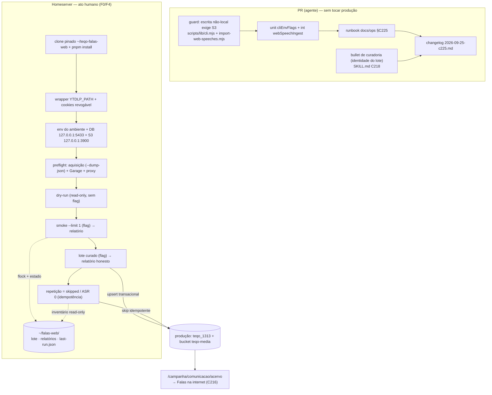

# Impl: Falas na internet no acervo de produção (operação de ingestão)

Status: aprovado
Atualizado em: 2026-09-25
Issue: #1339
Intenção: docs/plans/acervo-falas-internet-producao.md
Appetite restante: herdado (~1 dia de operação + providências no homeserver). A engenharia desta entrega é ~1/3 do dia: **um guard fail-closed pequeno + o runbook + o changelog**. O resto do dia é operação humana no homeserver (F0/F4), que não é trabalho de agente.

> **Modo `--auto`.** Este plano nasce `aprovado` (Passo 3c vira apresentação). As quatro recomendações A da intenção (§Questões em aberto) são **assumidas** e estão registradas abaixo com a avaliação de divergência material. **Nenhuma fase deste plano escreve em produção a partir do agente** — o agente não recebe `DATABASE_URL`/credencial do `teqo_1313`, e a operação (F0/F4) é ato humano, com a flag de intenção exportada por mão.

## Leitura da intenção

**Outcome.** Em produção, `/campanha/comunicacao/acervo` → "Falas na internet" mostra as falas da rodada com player, transcrição, data e origem, com a mídia no bucket privado de produção; a segunda rodada não duplica nem reprocessa o que já está completo; e `docs/ops/teqo-1313-deploy.md` traz o suficiente (onde roda, pré-requisitos, guardas, como provar idempotência, como reverter) para outra pessoa repetir sem memória de sessão.

**O que NÃO negociar.**

- **Fronteira fail-closed do C218:** a skill `catalogo-falas-web` continua sem poder de produção — nunca exporta `FALAS_WEB_IMPORT_CONFIRM`, nunca contorna `assertLocalDatabase`, nunca escreve no `teqo_1313`. A promoção da skill é item próprio, fora daqui.
- **Bandeira de intenção humana:** `FALAS_WEB_IMPORT_CONFIRM=1` só existe na linha de comando de quem opera. Nenhum arquivo do repo, script, `.env`, workflow ou skill define essa flag.
- **`sourceKey` é a identidade:** `web:<plataforma>:<externalId|url canônica>`; o acervo da Câmara (`origin = camara`, chaves da API) fica intocado; dedupe semântico cross-URL continua fora de escopo.
- **Mídia só no bucket privado** (`internetSpeechMedia` → Garage `teqo-media`), servida pelo acervo autenticado; nada de disco local e nada de URL pública.
- **Estado durável fora do banco** e fora do diretório gitignored da workstation; relatório honesto (sucesso parcial ≠ sucesso), falhas em `pending` retentável.
- **Sem automação:** nada de cron, fila, watcher, agendador, collection de estado, migration, UI nova nem tela de rodada.
- **Agente não executa escrita em produção** (política de `AGENTS.md` + §Modo autônomo do `work-issue`).

**O que reavaliar (da "Direção no codebase" da intenção).**

- _"Rodar no homeserver"_ — confirmado como **recomendação da intenção (assumida)**, mas a hipótese "lá dá para baixar do YouTube/Instagram" **não é verificável daqui** e há evidência contrária parcial: a rota do homeserver é intermitente para a API de IA (medido 2026-09-25, 1/3 de connect), o CDN do Instagram em IPv4 é instável nessa rede (post-mortem `2026-09-25-instagram-cdn-ipv4-instavel.md`) e `objects.githubusercontent.com` expira (nota do `pnpm-workspace.yaml`). Isso vira **gate de preflight da operação** (F0.4), não feature.
- _"Prefiro `data/falas-web/` (gitignored) no clone"_ — **errado para produção**: o clone é descartável por definição e o watermark morre com ele. O estado durável é um diretório dedicado fora do repo (D5).
- _"`~/stack/teqo-1313.env` é o ponto de configuração"_ — os hosts do env file (`postgres`, `host.docker.internal`) **só resolvem na rede do compose**; do host eles precisam de reescrita para loopback, e essa reescrita é **de sessão**, não persistida (D5/F2).
- _"Rollback no mesmo formato do C155 (SQL direto)"_ — **inseguro aqui**: o C155 não tinha mídia no S3. Fala da web tem `internet_speech_media` e o cascade `Speech → speechSegment → internetSpeechMedia` só roda pelo Payload (D4).
- _"Cookies: opção do yt-dlp já existente"_ — o C215 **não passa `--cookies`** em nenhum dos dois comandos (`readYtDlpMetadata`, `downloadWithYtDlp`). Não existe caminho hoje sem wrapper ou sem código (D2).

## Recomendações A da intenção: como ficam

| Questão (intenção)             | Recomendação assumida                                                      | Como esta entrega implementa                                                                                                                                  | Divergência material?                                                                                                                        |
| ------------------------------ | -------------------------------------------------------------------------- | ------------------------------------------------------------------------------------------------------------------------------------------------------------- | -------------------------------------------------------------------------------------------------------------------------------------------- |
| Onde a rodada roda             | A — no homeserver, `yt-dlp` provisionado + um arquivo de cookies revogável | F0 cria um clone pinado dedicado no host; F2 documenta o procedimento com as reescritas de DB/S3 e o preflight de aquisição; a rodada para se o egress falhar | **Não.** É a própria recomendação da intenção, registrada como assumida. O _ato_ continua humano (F4)                                        |
| Onde vive o estado incremental | A — diretório durável no homeserver, dono único                            | F0.5 cria `~/falas-web/` (lote, descoberta, relatórios, `last-run.json`); `--out` aponta para lá; lock por `flock`                                            | **Não.** Mover o estado do clone gitignored para o host é o que o aceite exige ("o acervo de produção não depende de estado na workstation") |
| Quem conduz a rodada           | A — procedimento manual documentado, skill C218 fail-closed                | F2 escreve o procedimento; nenhuma linha de código toca a skill além de **um bullet de curadoria** (D3) que reforça a fronteira; a flag continua humana       | **Não.** O bullet na skill é documentação de curadoria, não capacidade nova                                                                  |
| O que entra na primeira rodada | A — lote curado com `--limit`, depois o volume                             | F4.3 smoke `--limit 1` → F4.4 lote curado → F4.5 repetição idempotente                                                                                        | **Não.** É a redução de blast radius que a própria intenção pede                                                                             |

**Conclusão de divergência:** nenhuma material. O plano pode seguir em `--auto`. As duas incertezas técnicas reais (egress do host e runtime JS do yt-dlp) são **gates de preflight com parada documentada**, não decisões de produto — se o F0.4 falhar, a operação para para correção do host, nunca o agente.

## Abordagem recomendada

**A menor entrega que fecha o aceite:** (1) **um guard fail-closed** no dono dos guards de escrita, para que "escrita em produção espelha no bucket" deixe de depender de o operador ter as 4 envs `S3_*` na sessão; (2) **o runbook** `## C225` no `docs/ops/teqo-1313-deploy.md`, com pré-requisitos, provisionamento de `yt-dlp`/cookies/`ffmpeg`, reescritas de host, preflight, dry-run, smoke, idempotência, estado, inventário e rollback; (3) **um bullet** na curadoria do C218 sobre a identidade do lote; (4) o changelog. Sem migration, sem collection, sem UI, sem automação, sem segunda esteira — a fase de escrita continua sendo exatamente `pnpm falas-web:import` do C215.

**Opções consideradas:** A) guard de mídia + runbook + changelog, com provisionamento no host | B) só runbook, sem código | C) comando novo de rollback em massa + collection de estado da rodada.

**Recomendação: A** — porque o aceite tem duas partes que documentação sozinha não entrega: (i) _"a mídia está no bucket e nunca em disco local"_ é hoje uma promessa silenciosa: sem as 4 envs `S3_*`, `resolveS3StorageEnv` devolve `{ enabled: false }` e o Payload grava em disco local **com exit 0 e relatório verde** — exatamente a falha que o anti-goal "não deixa mídia em disco local" proíbe; (ii) _"é repetível e segura"_ precisa da pré-condição de ambiente verificada antes da escrita, não de memória do operador. Um guard de ~6 linhas no dono (`scripts/lib/cli.mjs`) fecha (i); o runbook fecha (ii).

**Rejeitadas:**

- **B (só runbook):** deixa o descumprimento do anti-goal de mídia depender de disciplina; o relatório de uma rodada com S3 ausente é indistinguível de uma rodada bem-sucedida — o oposto de "falha não é mascarada" e de "honesta". Custo: um bug de ambiente vira lixo silencioso no disco efêmero do clone.
- **C (rollback em massa + collection de estado):** fora de escopo explícito da intenção ("schema/migration/collection nova: o estado operacional não vai para o banco"; "não invente uma segunda esteira"). O rollback documentado pelo caminho do Payload (D4) cobre o caso real; um comando destrutivo novo exigiria guard, teste e runbook próprios — item de Issue própria, com gatilho declarado em §Gatilhos de revisitação.

### Decisões de engenharia

**D1 — Onde a rodada executa: clone pinado no host do homeserver.**

Opções: A) host do homeserver, clone dedicado `~/teqo-falas-web` no SHA, `pnpm install`, env do ambiente na sessão | B) workstation com alvo explícito (`ALLOW_REMOTE_DB=true` + flag) | C) container de manutenção do compose (`docker compose --profile maintenance run … teqo-1313-migrate`), como o C160.

Recomendação: **A** — porque o dado de produção não sai de onde vive, o único material sensível transportado é um arquivo de cookies revogável, e o precedente é literal: o C155 e o C160 rodaram exatamente assim (`~/teqo-backfill` + `source ~/stack/teqo-1313.env` + `DATABASE_URL` reescrita para `127.0.0.1:5433` + flag). Também mantém o estado durável ao lado do dado.

Rejeitadas: **B** porque a fronteira que o C215 impõe (`assertLocalDatabase` recusa host não-local) afrouxa no momento em que `ALLOW_REMOTE_DB=true` é aceito, e o precedente mostra o resultado: rodadas de ingestão que não deixaram registro em produção. **C** porque a imagem do migrator é `node:24-alpine` sem Python/yt-dlp e sem `ffmpeg` (`apk add ffmpeg` só existe no estágio `runner`), e o estado durável + cookies exigiriam volume no compose: trocaria uma dependência externa (`yt-dlp` do host, revisável e revogável) por uma mudança no build da imagem de produção.

**D2 — Como o yt-dlp recebe cookies e runtime JS sem tocar a esteira.**

Opções: A) wrapper em `~/falas-web/bin/yt-dlp` com `exec` do binário real mais `--cookies` e `--js-runtimes node`, apontado por `YTDLP_PATH` só na rodada | B) config global do yt-dlp (`~/.config/yt-dlp/config`) | C) código da aplicação: flag de cookies/ambiente no dono `src/utilities/media/ytdlp.ts`.

Recomendação: **A** — porque `ytDlpBinary()` já resolve `YTDLP_PATH → PATH` e `defaultRunner` usa `execFile(bin, args)`: um wrapper executável funciona hoje, sem diff no C215, e é _escopado à rodada_, _reversível em um `rm`_ e _não versiona credencial_. E porque duas opções do yt-dlp são requisito de ambiente, não de domínio: `--cookies FILE` (formato Netscape) porque a sessão do operador (YouTube/Instagram) é o que o C215 pressupõe e nunca teve, e `--js-runtimes node` porque a documentação do yt-dlp diz que **só `deno` vem habilitado por padrão** (`deno, node, quickjs, bun` por prioridade) — sem essa flag o host depende de um runtime que não está instalado, e o `yt-dlp-ejs` (necessário para suporte pleno ao YouTube) precisa vir empacotado na instalação, nunca buscado remotamente (`--remote-components` é negado por default, e buscar do GitHub é rota que expira nesse host).

Rejeitadas: **B** porque a config global vaza a sessão do operador para _todo_ yt-dlp daquele usuário no host (inclusive o pipeline de reels/C219), e revogação/auditoria ficam implícitas. **C** porque adiciona ao owner da esteira uma variável de ambiente de operador sem dono no domínio, e porque o C215 já fixa o contrato de aquisição (720p/mp4, sem cookies) — mexer nisso é decisão de domínio, não providência de ambiente.

**D3 — A divergência de identidade (`externalId` presente × ausente muda a `sourceKey`).**

Opções: A) regra procedural no runbook + conferência obrigatória no dry-run + um bullet na curadoria do C218 | B) normalizar a identidade no código (`webSpeechSourceKey` passa a extrair sempre o id da URL em `youtube`/`instagram`) | C) `findSpeechImportState` passando a aceitar uma segunda chave candidata (lookup por URL canônica).

Recomendação: **A** — porque o contrato do C215 é explícito (`web:<plataforma>:<externalId|url canônica>`) e a C223/C224 não o mexeram; a correção é de _uso_ (a curadoria sempre leva `externalId` em `youtube`/`instagram`, que é trivial de extrair da própria URL) e o dry-run já expõe a `sourceKey` planejada de cada entrada — o operador vê `create` para uma URL que reconhece de outra rodada. Mudar identidade de uma chave já persistida é "caro de reverter" e merece item próprio.

Rejeitadas: **B** porque troca a semântica de identidade do dono (contrato citado por skills e testes pinados em `tests/unit/webSpeech.unit.spec.ts`) para tapar um desvio de curadoria, e porque `externalId` também é campo gravado na fala — a mudança mexe em identidade _e_ em metadado. **C** porque é pass-through que deixa o problema no momento errado (o `sourceKey` já foi gravado em `pending`/relatório) e nasce de um índice novo.

**D4 — Rollback: remoção pelo Payload, nunca SQL cru.**

Opções: A) apagar o discurso no admin (ou por um `payload.delete` pontual): o hook `deleteSpeechAssets` remove `speechSegment` e `internet_speech_media`, e o plugin S3 apaga o objeto do bucket | B) `DELETE FROM speech_segment; DELETE FROM speech;` no formato do C155 | C) novo comando `--rollback` scoped por `sourceKey`, com flag própria.

Recomendação: **A** — porque o cascade é do Payload por construção ("Payload relationships do not cascade" → hook), e o B deixa exatamente o que o runbook proíbe: linhas de mídia órfãs no bucket e rels inconsistentes. Documento também um **inventário read-only** (`SELECT` das falas `web:%`) para saber exatamente o que existe antes de decidir.

Rejeitadas: **B** por copiar o rollback do C155 sem adaptar a diferença real (lá não havia mídia no S3; o próprio runbook do C155 diz "nenhum objeto de mídia vai para o S3"). **C** por ser um caminho destrutivo novo: guard + teste + runbook próprios, e não exigido pelo aceite (a operação é aditiva e idempotente; remoção é caso raro e manual, pelo admin, com confirmação humana).

**D5 — Workspace, estado durável e isolamento.**

Opções: A) `~/teqo-falas-web` (clone pinado, descartável) + `~/falas-web/` (diretório durável, dono único, `chmod 700`), com `--out "$FALAS_WEB_DIR"` e `flock` no diretório | B) `data/falas-web/` do próprio clone (gitignored) | C) `~/teqo-deploy` (workspace do runner).

Recomendação: **A** — porque o accept exige que o acervo de produção não dependa de estado na workstation, e o inverso também vale: o estado operacional não pode morrer com um `git checkout`/`git clean` de um clone descartável; `~/teqo-deploy` é reescrito pelo deploy (imagem, tag, revisão), e nenhum dado operacional pode morar ali. `--out` aceita caminho absoluto (a validação recusa `..`), e o `flock` é o single-flight que o C218 declara não existir ("uma rodada por vez: o estado não tem lock"), com o precedente do próprio repo (`/tmp/teqo-deploy.lock`, `/tmp/teqo-unblock.lock`).

Rejeitadas: **B** porque o `data/falas-web/` é gitignored _e_ destruído junto com o clone — watermark perdido significa varredura inicial de novo, que é exatamente o que a rodada incremental evita. **C** porque mistura dado operacional com workspace de CI, o que já produziu desvios de revisão no passado ("prod regride para um SHA antigo" na §Falhas conhecidas).

**Armadilha registrada (barata, mas custa a rodada se o operador errar):** `--out ~/falas-web` **não** expande o til no Node — o relatório cairia em `./~/falas-web/reports/…` dentro do clone. O runbook usa sempre `"$FALAS_WEB_DIR"` expandido pela shell.

**D6 — O único guard de código: escrita não-local exige mídia espelhada.**

Opções: A) predicado puro no dono dos guards (`scripts/lib/cli.mjs`) + `die` no CLI, reusando `requiresWriteConfirm()` e `resolveS3StorageEnv()` | B) checagem ad-hoc dentro do script | C) novo script de preflight à parte.

Recomendação: **A** — porque `requiresWriteConfirm()` já define "escrita não provadamente local" (é a mesma condição que exige a flag, incluindo o `NODE_ENV=production` do host, que é o "sinal honesto" do C155) e `resolveS3StorageEnv` já é o dono da decisão S3. O predicado fica testável como unidade, o `die` fica no CLI (a semântica de erro pertence ao CLI, como o resto), e o guard é **fail-closed**: sem `S3_*`, escrita não-local não roda. O alvo exato de produção (`teqo_1313`/`teqo-media`) é uma precondição do procedimento C225, não uma política global do CLI, para não bloquear usos legítimos de staging. Alvo local (dev/test/worktree, e portanto toda a skill C218) continua com disco local — a fronteira do C218 fica idêntica.

Rejeitadas: **B** porque lógica de decisão sem dono fica órfã e não há como testá-la sem subir o CLI inteiro. **C** porque um "preflight" separado é mais um comando para lembrar — fail-closed no caminho da escrita não depende de o operador lembrar de rodar o passo anterior.

### Componentes / mudanças

- **`scripts/lib/cli.mjs`** (dono dos guards de escrita): +1 predicado puro `mirroredMediaRequired({ nodeEnv, databaseUrl, allowRemoteDb, s3Enabled })` delegando a `requiresWriteConfirm` (sem reescrever a semântica de "não-local") + testes em `tests/unit/cliEnvFlags.unit.spec.ts` e `tests/unit/importWebSpeechesCli.unit.spec.ts` (incluindo valor S3 não booleano e recusa antes da leitura do lote).
- **`scripts/import-web-speeches.mjs`** (`src` do comando): no ramo de **escrita** (o ramo `--dry-run` é read-only e fica intacto), após `assertWriteConfirm` + `assertLocalDatabase`, um `die` quando o predicado for verdadeiro — mensagem nomeando as 4 envs e o motivo ("sem elas o Payload gravaria em disco local"). `pnpm falas-web:import` (o `cross-env` de `package.json:92`) **não** é tocado: não passa a exportar `NODE_ENV=production` e a fronteira da skill C218 fica igual.
- **`docs/ops/teqo-1313-deploy.md`**: nova seção `## C225 — rodada de falas da internet no acervo de produção` (§Fases/F2 especifica o conteúdo exigido) + uma linha na tabela "Onde roda cada coisa" para o clone operacional (ao lado de `~/teqo-deploy`, explicitando que **não** é o workspace do runner).
- **`.agents/skills/catalogo-falas-web/SKILL.md`**: **um** bullet em §Curadoria — identidade do lote: `youtube`/`instagram` sempre com `externalId`; sem ele a chave vira a URL canônica e a mesma fala pode abrir duas linhas; e a conferência no dry-run antes de ingerir. Nenhuma capacidade nova, nenhuma flag, nenhum caminho de produção.
- **`docs/changelog/2026-09-25-c225.md`**: entrada curta no padrão do repo. **Declara o guard, o runbook e o status da operação** — se a rodada ainda não rodou, o changelog diz isso; o resultado medido é acrescentado depois pela pessoa, sem reescrever o que o agente afirmou.
- **Migration:** sem migration. **Collection/global/campo:** nenhum. **Access/Consent:** intocado — `internetSpeechMedia` segue `canReadSpeech`/`payloadAdminOnly`, o acervo da Câmara segue com `origin = camara` e suas chaves. **UI:** Impeccable A — N/A (sem UI; nenhuma superfície visual muda).
- **Fora do repo (ato humano, não no PR):** `~/falas-web/`, `~/teqo-falas-web`, `~/falas-web/bin/yt-dlp`, `~/falas-web/cookies.txt`, `yt-dlp` instalado no host, e as reescritas de sessão de `DATABASE_URL`/`S3_ENDPOINT` — **`~/stack/teqo-1313.env` não é editado** (o container precisa dos hosts da rede do compose; o host precisa do loopback; as duas coisas convivem por reescrita de sessão).

## Fases verificáveis

**F0 — Providências de ambiente no homeserver (ato humano, ~2h; bloqueia a operação, não o PR).**

- F0.1 `~/teqo-falas-web`: `git clone`/`fetch` + `checkout <SHA>` + `pnpm install` (molde do `~/teqo-backfill` do C155). Verificação: `git -C ~/teqo-falas-web rev-parse HEAD` = SHA do merge; `pnpm falas-web:import --help` roda.
- F0.2 `yt-dlp` com `yt-dlp-ejs` empacotado e um runtime JS no PATH (`source ~/.nvm/nvm.sh` já entrega o node 24 que o C155 usa). Verificação: `yt-dlp --version` e `yt-dlp --verbose --simulate <url> 2>&1 | grep -i runtime` sem tentativa de download remoto.
- F0.3 `~/falas-web/` (`chmod 700`) + wrapper `~/falas-web/bin/yt-dlp` (chmod 700) que faz `exec` do binário real com `--cookies "$FALAS_WEB_DIR/cookies.txt" --no-js-runtimes --js-runtimes node`; `cookies.txt` (Netscape, `chmod 600`, fora do repo, **nunca versionado**). Verificação: `"$YTDLP_PATH" --dump-json --no-playlist --no-warnings --skip-download <url-do-lote>` responde JSON. Revogação: apagar `~/falas-web/bin` e `~/falas-web/cookies.txt`.
- F0.4 Preflight de rede/acquisição: o mesmo `--dump-json` de F0.3; `psql` confirma `current_database() = teqo_1313`; `HeadBucket` confirma `S3_BUCKET = teqo-media` no endpoint loopback; o proxy socat de produção responde em `127.0.0.1:5433`. Qualquer falha interrompe a rodada; não há troca automática de alvo.
- F0.5 `flock` disponível e `~/falas-web/.lock` criado na primeira rodada.

**F1 — Guard de mídia espelhada (código, ~1h; quota máxima do plano).**

1. Predicado em `scripts/lib/cli.mjs` delegando a `requiresWriteConfirm`, sem reimplementar "não-local".
2. `die` no ramo de escrita de `scripts/import-web-speeches.mjs`; `--dry-run` intocado.
3. Unit em `tests/unit/cliEnvFlags.unit.spec.ts` (5 casos, incluindo `NODE_ENV=production` com host local e entrada S3 não booleana) + teste de processo em `tests/unit/importWebSpeechesCli.unit.spec.ts` que prova a recusa antes da leitura do lote. RED antes do fix.
4. `pnpm vitest run tests/unit/cliEnvFlags.unit.spec.ts tests/unit/importWebSpeechesCli.unit.spec.ts` verde + `tests/int/webSpeechIngest.int.spec.ts` e `tests/int/webSpeechImport.int.spec.ts` verdes (o caminho de ingestão não muda; a cobertura existente continua sendo a dele).

**F2 — Runbook (docs, ~2h).** Escrever `## C225` com o conteúdo exigido em §Runbook exigido abaixo, mais a linha em "Onde roda cada coisa". Verificação: seguir o runbook de ponta a ponta **a seco** numa sessão limpa (sem escrever) — todo comando listado existe, toda variável está definida antes do uso, nenhum passo depende de memória de sessão.

**F3 — Gates e fechamento (agente).** `pnpm gate:fast`; `pnpm format:check`; `pnpm knip`; `pnpm check:cycles`; `pnpm push` (changelog + branch `C225-…`); PR com `Closes #1339`. Sem e2e novo: a mudança é docs + um predicado testado, e nenhuma superfície renderizada muda.

**F4 — A operação (ato humano no homeserver, depois do merge; ~2–4h de máquina na primeira rodada).**

- F4.1 Sessão: `ssh homeserver` → `source ~/.nvm/nvm.sh` → `cd ~/teqo-falas-web` → `set -a; source ~/stack/.env; set +a` (`DEEPINFRA_API_KEY` **e** `DEEPSEEK_API_KEY` — a ausência do segundo é a falha que o C224 registrou na workstation) → `set -a; source ~/stack/teqo-1313.env; set +a` (`DATABASE_URL`, `NODE_ENV=production`, `PAYLOAD_SECRET`, `S3_*`) → reescritas de host (`DATABASE_URL` → `127.0.0.1:5433`; `S3_ENDPOINT` → `http://127.0.0.1:3900`) → `export YTDLP_PATH="$HOME/falas-web/bin/yt-dlp"`.
- F4.2 Planejar (read-only, **sem** flag): `pnpm falas-web:import --findings "$FALAS_WEB_DIR/batch-<stamp>.json" --out "$FALAS_WEB_DIR" --dry-run`. Conferir: `invalid = 0`, `duplicates = 0`, e **nenhum `create` para uma URL já ingerida** (D3).
- F4.3 Smoke: adquirir uma vez o lock externo `~/falas-web/.lock` e mantê-lo até F4.8; `FALAS_WEB_IMPORT_CONFIRM=1 pnpm falas-web:import --findings … --limit 1 --out "$FALAS_WEB_DIR" 2>&1 | tee -a ~/falas-web/runs/<stamp>.log`, em `tmux`. Conferir no relatório JSON: `created = 1`, estágio por campo, e o objeto no bucket.
- F4.4 Lote curado: repetir o comando com a flag explícita e **sem** `--limit`, ainda sob o mesmo lock; a cauda do `--limit` do F4.3 não é `pending` — ela fica no `batch-<stamp>.json` e entra nesta passada. Registrar o código de saída: exit 0 = sucesso total/parcial (falhas no relatório), exit 1 = nenhum achado entrou.
- F4.5 Idempotência: repetir F4.4 com o mesmo lote e a mesma flag explícita, ainda sob o lock → relatório com `skipped`, `asrSeconds = 0` e nenhum objeto novo no bucket. É a prova de aceite do "não duplica/não reprocessa".
- F4.6 Inventário e verificação (read-only): `SELECT` das falas `web:%` (contagem, `sourceKey`, `speechAt`, plataforma) e conferência do bucket; abrir `/campanha/comunicacao/acervo` → "Falas na internet" como confirmação (usuária de campanha) e confirmar que a fonte da Câmara segue com os **997** discursos.
- F4.7 Estado: ainda com o lock, gravar `~/falas-web/last-run.json` no contrato do C218 (escrita atômica `tmp` + `mv`), com `lastRunAt` advanced **só** com exit 0, falhas → `pending` com `attempts`, revisão → `review`. Acrescentar o resultado medido ao changelog.
- F4.8 Rollback ensaiado uma vez antes de liberar o lock (a prova de que o caminho é reversível): apagar **um** discurso da rodada no admin e conferir que segmento, linha de mídia e objeto no bucket foram junto; remover o `sourceKey` de qualquer `pending`/`review` que ainda o referencie.

### Runbook exigido (F2 — o conteúdo, não o texto)

`## C225 — rodada de falas da internet no acervo de produção`, na voz do documento (comando, motivo, medido). Seções:

1. **O que é** — a fonte C216 abre vazia porque nenhuma rodada web rodou contra o `teqo_1313`; esta seção é o procedimento para encher, repetir e reverter. Operação, não feature; a esteira é o C215 e a descoberta é o C218.
2. **Pré-requisitos** — deploy com o C216/C217/C223/C224 em produção; `~/teqo-falas-web` pinado no SHA + `pnpm install`; `~/stack/.env` com as duas chaves; `~/stack/teqo-1313.env`; `~/falas-web/` (durable, `chmod 700`); `yt-dlp` com `yt-dlp-ejs` + runtime JS; `ffmpeg` (o CLI resolve `FFMPEG_PATH` → `PATH` → binário empacotado do `pnpm install`, e imprime a origem).
3. **Estado durável e isolamento** — `~/falas-web/{batch,discovery,reports}` + `last-run.json`; contrato do C218 copiado com o link; `--out "$FALAS_WEB_DIR"` (nunca `~/…` literal); lock externo mantido do início da rodada até a gravação de `last-run.json`; por que **não** `~/teqo-deploy` nem `data/falas-web/` do clone.
4. **Cookies** — um arquivo Netscape revogável, o wrapper, `YTDLP_PATH` só na rodada, refresh documentado, revogação = apagar os dois arquivos. Fronteira: a skill C218 continua sem produção e sem flag.
5. **Hosts na sessão** — as duas reescritas e **por que** (`postgres`/`host.docker.internal` só resolvem na rede do compose); o env file não é editado; o proxy socat de produção (`teqo-1313-build-proxy`, `127.0.0.1:5433`) e o endpoint do Garage no host.
6. **Guardas** — `FALAS_WEB_IMPORT_CONFIRM=1` exigida sempre que a escrita não é provadamente local (`NODE_ENV=production`, host remoto ou `ALLOW_REMOTE_DB`); `--dry-run` é read-only; e o guard novo: escrita em produção/override/alvo não-local **recusa** sem as 4 `S3_*` (mídia em disco local é proibida). O runbook também exige banco `teqo_1313` e bucket `teqo-media` antes da operação. `ALLOW_REMOTE_DB` não faz parte do caminho normal.
7. **Rodada** — o bloco de comandos numerado (F4.1→F4.5) com `tmux` + `tee`, exit codes, `--limit` e a cauda, e onde está o relatório JSON.
8. **Provar idempotência** — repetir o lote e esperar `skipped`/`asrSeconds 0`/nenhum objeto novo.
9. **Inventário** — os `SELECT` read-only (falas `web:%`, contagem por plataforma) para responder "o que já entrou".
10. **Rollback** — apagar no admin (cascade `Speech → speechSegment → internetSpeechMedia` + objeto no bucket) com a **ressalva explícita** de que o SQL direto do C155 é inseguro aqui; remoção em massa é item próprio (gatilho declarado).
11. **Falhas conhecidas da operação** — egress intermitente do host (IA 1/3 em 2026-09-25; CDN do Instagram IPv4 instável, com IPv6 do compose como histórico), `yt-dlp` sem runtime JS, cookies expirados, `S3_ENDPOINT` errado, `~/falas-web` em disco cheio (o temp é por achado e sai no `finally`, mas o clone precisa de espaço para `node_modules`), e a decisão de segurança: se o preflight de aquisição falhar no host, corrigir o host tem precedência; não existe troca automática para um banco remoto da workstation.
12. **Decisão de segurança** — se o preflight falhar, a rodada para para correção do host; não abrir uma segunda esteira nem trocar o alvo de produção.
13. **Resultado medido** — a ser preenchido por quem rodar (data, lote, criados/pulados/falhas, ASR/LLM, onde ficaram os artefatos), com o mesmo espírito do "Resultado registrado" do C155.

## Rabbit holes / Não escopo (engenharia)

- **Não** criar collection/tabela de estado, migration, campo de rodada, ou "última execução" no banco. O estado é o arquivo, como o C218 define.
- **Não** dar à skill C218 modo de produção, flag, lock próprio ou escrita fora do CLI.
- **Não** mexer em `sourceKey`, no contrato do lote, no relatório, nos estágios ou nos exit codes do C215.
- **Não** tocar a ingestão da Câmara (`origin = camara`, 997 discursos), as URLs do acervo, o C216/C217 nem o C219.
- **Não** agendar, pôr cron, bot, watcher ou monitoring; a rodada é manual.
- **Não** versionar cookies, config de navegador ou qualquer credencial; **não** replicar o perfil do navegador.
- **Não** deixar mídia em disco local como "destino intermediário para subir depois" (o mirror é direto no bucket; o temp é por achado e sai no `finally`).
- **Não** espelhar a sessão do navegador inteiro; no máximo o arquivo de cookies.
- **Não** fazer uma "sweep" inicial em bloco na primeira rodada.
- **Não** tocar Dockerfile/compose/env files para instalar `yt-dlp` na imagem (D1C).
- **Não** "limpar" o runbook do C155 ao reescrever o rollback — a diferença (mídia no S3) fica explícita nas duas seções.

## Riscos e mitigação

| Risco                                                                                          | Evidência                                                                                                       | Mitigação                                                                                                                                                                                                          |
| ---------------------------------------------------------------------------------------------- | --------------------------------------------------------------------------------------------------------------- | ------------------------------------------------------------------------------------------------------------------------------------------------------------------------------------------------------------------ |
| O host não baixa do YouTube/Instagram (egress intermitente; CDN do Instagram instável em IPv4) | runbook §Egress (1/3 de connect em 2026-09-25); post-mortem `2026-09-25-instagram-cdn-ipv4-instavel.md`         | F0.4 é **gate**: se o `--dump-json` falha, a operação não começa; o relatório honesto transforma a falha em `pending` e o contorno está declarado no runbook. Instagram entra depois do YouTube na primeira rodada |
| `yt-dlp` sem runtime JS habilitada (só `deno` vem por default) e sem `yt-dlp-ejs` empacotado   | docs do yt-dlp (`--js-runtimes`, `--remote-components`)                                                         | Wrapper com `--js-runtimes node` + instalação com o ejs empacotado; verificado no F0.2 antes de qualquer escrita                                                                                                   |
| Sessão de cookies expirada/revogada                                                            | C215 pressupõe sessão que ele nunca teve                                                                        | Falha vira `pending` com estágio `acquisition`; refresh documentado; revogação = apagar `bin/` + `cookies.txt`                                                                                                     |
| Mídia caindo em disco local sem ninguém perceber (S3 ausente)                                  | `resolveS3StorageEnv` degrada para `{ enabled: false }` em silêncio                                             | **Guard D6** (fail-closed na escrita não-local) + preflight F0.4 + mensagem de erro nomeando as 4 envs                                                                                                             |
| Estado durável perdido (clone limpo, `~/teqo-deploy` reescrito)                                | `data/falas-web/` é gitignored; deploy reescreve o workspace do runner                                          | Diretório dedicado fora do repo (D5) + `flock`; o runbook diz onde está a fonte da verdade                                                                                                                         |
| Duplicata silenciosa por `externalId` presente × ausente                                       | `webSpeechSourceKey` (`src/lib/webSpeech.ts:163-174`) não tem lookup alternativo; sem teste para o caso cruzado | Regra de curadoria + conferência no dry-run (D3) + `sourceKey` unique como rede de segurança; **gatilho**: se a F4.2 apontar `create` para URL já ingerida, item próprio de normalização                           |
| Rollback por SQL deixa mídia órfã no bucket                                                    | cascade só pelo Payload (`src/collections/Speech.ts:65-98`)                                                     | Rollback documentado pelo admin (D4) + inventário read-only antes de decidir                                                                                                                                       |
| Custo de ASR/LLM maior do que o esperado em fala longa                                         | C223 liberou transcrição completa; C155 mediu ~US$1,23/997 discursos (~45h)                                     | Rodada com `--limit` primeiro, relatório com `asrCostUsd`/`llmCostUsd`/`durationMs` lido **antes** de ampliar; nada de varredura inicial em bloco                                                                  |
| `S3_ENDPOINT` reescrito errado grava em outro bucket/nada                                      | hosts do env file só resolvem no compose                                                                        | Preflight F0.4 (Garage responde) + conferência do objeto no bucket em F4.3 antes de seguir                                                                                                                         |

## Gatilhos de revisitação

- **Normalizar a identidade (`sourceKey`)** — quando um dry-run apontar `create` para uma URL já ingerida, ou quando a curadoria virar rotina automática. Item próprio (mudança de contrato do C215).
- **Comando de rollback em massa** — quando uma rodada precisar ser removida em bloco. Exige flag, teste e runbook próprios.
- **Promover a skill C218 a modo de produção** — quando a operação manual se provar repetível e o custo de coordenação pesar. Item de produto, com a flag ainda sob ato humano.
- **Rodar a ingestão dentro do container de manutenção** — se o host deixar de ter `yt-dlp` viável (o que muda o D1 para a opção C e toca o build da imagem).
- **`--out` com state dir relativo/expansão de `~`** — hoje só `..` é recusado; se alguém pedir `--out` com validação mais estrita, é item pequeno e isolado.

## Aceite de engenharia

- [x] Aceite de produto da intenção ainda coberto — a fonte abre com falas, player, transcrição, data e origem; a segunda rodada não duplica nem reprocessa; a mídia está no bucket privado e servida só ao acervo; o runbook permite repetir sem memória de sessão; as falas da Câmara ficam intactas.
- [x] Invariantes `AGENTS.md`/engineering-standards — nada de migration/collection nova; nenhuma escrita em produção pelo agente; o estado operacional fora do banco; a fronteira fail-closed do C218 intacta (a skill não ganha flag, lock nem caminho de escrita); `sourceKey` preservado; identificadores em inglês, textos de operação em pt-BR; o rollback documentado passa pelo dono (Payload), não por SQL cru.
- [x] `FALAS_WEB_IMPORT_CONFIRM` permanece exportada só por mão, na linha de comando de quem opera; nenhum arquivo do repo a define.
- [x] Testes de domínio previstos — unit novo para o predicado do guard (5 casos, RED antes do fix) em `tests/unit/cliEnvFlags.unit.spec.ts`; teste de processo do CLI em `tests/unit/importWebSpeechesCli.unit.spec.ts` prova a recusa antes da leitura do lote; `tests/int/webSpeechIngest.int.spec.ts` e `tests/int/webSpeechImport.int.spec.ts` continuam cobrindo a ingestão; unit de `webSpeech`/`webSpeeches`/`ytdlp`/`catalogoFalasWebSkill` intocados (nenhum contrato mudou). Sem teste de CLI contra Garage/cookies/proxy/rollback — limitação declarada, verificada pelo preflight e pelo smoke humano.
- [x] Gates — `pnpm gate:fast`, `pnpm format:check`, `pnpm knip`, `pnpm check:cycles`; changelog curto e honesto (declara o que é guard e runbook, e o status real da operação).
- [x] Verificável sem a memória da sessão — o runbook lista workspace, envs, reescritas, cookies, guardas, comandos, prova de idempotência, inventário e rollback; cada fase tem um comando de conferência.

## Triage da revisão

### Já resolvido no simplify/critique (não reabrir)

- O guard de mídia espelhada, o teste do predicado, o teste de processo do CLI e o smoke de recusa antes da leitura do lote estão neste diff.
- O runbook agora é fail-closed no alvo, nas chaves, no bucket, no clone, no symlink, no lock e no estado; o branch foi rebased em `origin/main`.
- A curadoria C218 agora fixa `externalId` para YouTube/Instagram; a identidade `sourceKey` não foi alterada.

### Explicitamente fora

- Não registrar um hardcode global de `teqo_1313`/`teqo-media` no CLI: o guard de alvo exato pertence ao procedimento C225 para preservar usos legítimos de staging; gatilho: se a CLI ganhar um modo de produção próprio.
- Não criar segunda esteira, cron, collection de estado, migration, modo de produção para C218 ou dedupe cross-URL; esses itens permanecem nos gatilhos de revisitação acima.
- Não registrar a query de duplicatas: `sourceKey` já é único; o inventário agora conta mídia e lista `id` para rollback.

## Self-score (decision-quality, gate ≥4)

1. **Decisões caras têm rejeitadas?** — **5/5.** D1 (onde executa), D2 (cookies/runtime sem código), D3 (identidade), D4 (rollback), D5 (workspace/estado) e D6 (guard) trazem Opções/Recomendação/Rejeitadas com o motivo de cada rejeição.
2. **Cabe no appetite?** — **5/5.** Um predicado + um `die` + um bullet de skill + um runbook + changelog; sem migration, sem collection, sem UI, sem cron. Fases F0/F4 são operação, como a intenção compte (~1 dia).
3. **Rabbit holes nomeados?** — **5/5.** Doze bullets de não escopo (collection de estado, skill em produção, mexer em `sourceKey`, varrer em bloco, cookies versionados, replicar perfil, mirror em disco, tocar Dockerfile, "limpar" o C155) + cinco gatilhos de revisitação.
4. **Depth check (reuso, sem módulo raso)?** — **5/5.** Reusa `requiresWriteConfirm`/`assertWriteConfirm`/`dieWithLabel` (o próprio dono declara que reescrever essas formas quebra o build), `resolveS3StorageEnv`, `resolveFfmpeg`, `assertLocalDatabase`, o `flock` já usado pelo repo, o clone pinado do C155 e o formato de seção do runbook existente. Nenhum arquivo/utility/componente novo — o único código novo é um predicado no módulo que já é o dono do conhecimento.
5. **Intenção permanece satisfeita?** — **5/5.** O outcome de produto é o mesmo da intenção; a engenharia só torna explícitos o binário de aquisição, o bucket e o rollback. As quatro recomendações A ficam registradas como assumidas, e nenhuma foi convertida em feature ou automação.

**Total: 25/25.**

**Status: aprovado** (auto-aprovado no modo `--auto`: abordagem técnica, corte de escopo previsto na skill e literais de dados que o próprio plano recomenda, todos registrados como assumidos). **Continua parando, sem exceção:** qualquer execução de escrita em produção, aprovação humana, migration, `DEGRADED` visual, e divergência material de produto → o orquestrador para, comenta na Issue e flipa para `blocked`.
