# Impl: C215 — Ingestão de falas da internet no acervo (descoberta, espelho e catálogo)

Status: executado
Atualizado em: 2026-09-24
Issue: #1291
Intenção: docs/plans/acervo-falas-web-ingestao.md
Appetite restante: herdado (~3–4 dias de engenharia + tempo de máquina; um outcome verificável — um lote de falas encontradas na web entra no catálogo com transcrição, facetas e mídia espelhada, reexecutável sem duplicar e com relatório honesto)

## Leitura da intenção

- **Outcome:** dado um lote de achados da web (plataforma + URL + metadados que a descoberta — C218 — já trouxe), cada fala vira registro no acervo com data, duração, transcrição com timestamps, temas/alcance/menções (mesmas facetas do "Falas da Câmara"), proveniência da classificação, origem (plataforma + URL) e canal/autor; a mídia é espelhada privada e preservada. Reexecutar não duplica nem sobrescreve curadoria manual e cada execução imprime relatório honesto (achados, novos, atualizados, ignorados, falhas, tempo e custo de ASR).
- **O que NÃO negociar (lockdowns):**
  - Mídia espelhada é privada e preservada: nunca URL pública, nunca `/api/media/file`; leitura só pelo gate do acervo (`canReadSpeech`/`canReadCommunicationCatalog`, fail-closed; `advisor`/`leader` negados).
  - Nenhum segundo pipeline de ASR/classificação/upsert e nenhum segundo cadastro de pessoa (menções continuam texto; sem `Contact`, sem `Consent` novo — não há PII nova).
  - `sourceKey` da Câmara é identidade por contrato: a fala web nasce em namespace próprio (`web:*`) e não toca os registros existentes.
  - Guardas de execução: `assertLocalDatabase` + `FALAS_WEB_IMPORT_CONFIRM=1` para alvo não-local/override; `--dry-run` sem flag.
  - Não tocar feed do site público, Central de Conteúdos (C211 é dona da peça), publicação externa nem score de vaidade.
  - Curadoria manual nunca sobrescrita (hook `preserveManualFacets` existente é o pino).
- **O que reavaliar (hipóteses da intenção vs. exploração):**
  - A intenção deixou "ferramenta de download e destino do espelho" para a implementação: ficam **yt-dlp** (YouTube/Instagram) + download HTTP direto (rádio/áudio) e uma collection privada nova `internetSpeechMedia` — decisões D2/D4.
  - "Modelo de dados" também estava em aberto: a exploração confirma que `Speech` não tem origem/plataforma/URL/canal/título/thumb/mídia espelhada e que **quatro superfícies leem `speech` sem discriminador** (`speechPageData`, `speechListFilters`, `speechCoverage`, `findSpeechExcerpts`) — sem blindagem a fala web vazaria para "Falas da Câmara" com crédito errado (D10).
  - `speechPosterJob`/`speechCutJob` são by-id (VOD Câmara) e degradam sozinhos — não entram nesta fatia.

## Abordagem recomendada

```mermaid
flowchart LR
  L["lote de achados (JSON)<br/>generatedAt + findings[]"] --> CLI["scripts/import-web-speeches.mjs<br/>zod + dedupe por sourceKey"]
  CLI --> PLAN["plano do lote<br/>novo · atualizar · ignorar"]
  PLAN -->|youtube/instagram| YTDLP["yt-dlp --dump-json<br/>YTDLP_PATH fail-closed"]
  PLAN -->|radio/audio| HTTP["download HTTP do mediaUrl"]
  YTDLP --> MEDIA[("internetSpeechMedia<br/>upload privado S3/disco")]
  HTTP --> MEDIA
  MEDIA --> FFMPEG["ffmpeg: mp3 mono 16k + chunks<br/>buildRecordingAudioFfmpegArgs"]
  FFMPEG --> ASR["deepInfraTranscribeSegments<br/>merge de offsets"]
  ASR --> CLS["classifySpeech<br/>gazetteer + LLM"]
  CLS --> UPSERT["upsertSpeechBundle estendido<br/>tx: speech + speechSegment + searchText"]
  UPSERT --> DB[("speech origin=web<br/>sourceKey web:...")]
  CLI --> REPORT["relatório stdout + JSON<br/>data/falas-web/reports"]
  DB -.->|"origin: camara nas consultas"| CAM["superfícies Câmara<br/>lista · opções · cobertura · Sollinha"]
  DB -.-> C216["C216: lista/detalhe/player<br/>buildPrivateMediaResponse"]
  DB -.-> C217["C217: cortes<br/>downloadPrivateMediaToFile"]
```

**Opções consideradas:** A) estender `speech` com discriminador de origem + collection privada própria de mídia + aquisição yt-dlp/HTTP + pipeline com dependências injetadas | B) collection nova `internetSpeech` (gêmea) | C) reusar `recordingMedia` e/ou servir a mídia no próprio C215.
**Recomendação:** A — porque preserva o contrato prod da Câmara (`sourceKey`, facetas, segmentos, busca) sem criar uma segunda cópia de todo o conhecimento (classificador, ASR, upsert, busca) e sem forçar relação polimórfica no `SpeechCut` que o C217 vai estender.
**Rejeitadas:**

- **B (collection nova)** porque duplica facets/segmentos/classificador/import/busca e obriga `SpeechCut.speech` (relação fixa a `speech`) a virar polimorfismo, acoplando o C217 sem ganho.
- **C (reusar `recordingMedia` / servir no C215)** porque `recordingMedia` é o artefato da gravação enviada (domínio e access próprios), e o serving pertence ao C216 (detalhe/player/baixar) e ao C217 (corte), que já consomem `privateMediaResponse.ts`; rota nova aqui seria trabalho jogado fora.

### Decisões de engenharia

**D1 — Modelo de dados: estender `speech` com discriminador de origem; NÃO criar collection de fala nova.**
`Decisão: A — novos campos nullable em Speech (só origin obrigatório) + sourceKey namespaced web:*; Câmara intacta.`
`Por quê: reusa facetas, segmentos, classificador, upsert, busca trigram e access já existentes; a fala web é a mesma unidade de catálogo ("mesmas facetas, mesmos filtros" — intenção).`
`Rejeitadas: B) collection nova internetSpeech porque é gêmea de facets/segmentos/classificador/import/busca e força relação polimórfica no SpeechCut (C217); C) sem migration — impossível: mídia espelhada + origem/canal exigem schema.`

- Campos novos: `origin` (select `camara` default | `web`, required, index — backfill dos existentes pelo default da migration); `platform` (select `youtube|instagram|radio|audio`, index, web-only); `externalId`; `sourceUrl`; `title`; `channel`; `mirroredMedia` (upload → `internetSpeechMedia`); `thumbnail` (upload → mesma collection).
- Reusados sem mudança: `speechAt` (data de publicação no caso web; `deriveSpeechYear` continua), `durationSeconds`, `searchText`, facets, `classifiedBy`, `speechSegment`. `legislature`/`type`/`phase`/VOD ficam nulos na origem web (já são nullable).
- `sourceKey` namespaced: `web:<platform>:<externalId>` quando houver id externo; senão `web:<platform>:<url canônica normalizada>`. Câmara permanece exatamente como está (o índice unique já existe e o namespace elimina colisão).

**D2 — Mídia privada: collection de upload nova `internetSpeechMedia`.**
`Decisão: A — collection privada própria; read = canReadSpeech; create/update/delete = payloadAdminOnly (o CLI usa overrideAccess justificado); registro explícito no plugin S3; cascade no beforeDelete do Speech.`
`Por quê: a mídia da fala web tem gate do acervo, não o gate da gravação; e o dono do ciclo de vida é o próprio Speech (a mídia não existe sem a fala).`
`Rejeitadas: reusar recordingMedia (domínio/labels/access da gravação enviada — faria o modelo mentir); usar media pública (read anônimo por contrato — vazaria mídia de terceiro).`

- Sem registro no plugin S3 (`internetSpeechMedia: true`), produção cai no disco efêmero do container — mesmo modo de falha documentado no C199.
- Cascade: estender o `beforeDelete` do `Speech` (hoje apaga `speechSegment`) para apagar `mirroredMedia`/`thumbnail` quando existirem, com o mesmo bypass justificado (cascade é do dono; roda dentro do delete autorizado do Speech).

**D3 — Servir o arquivo é do C216/C217, não daqui.**
`Decisão: A — C215 entrega só o artefato armazenado + a collection; C216 usa buildPrivateMediaResponse (detalhe/player/baixar) e C217 usa downloadPrivateMediaToFile (corte).`
`Por quê: o dono único de I/O privado já existe (privateMediaResponse.ts, C193/C199) e a superfície de leitura nasce no C216; rota nova aqui não tem consumidor.`
`Rejeitadas: rota de arquivo no C215 (sem UI/consumidor, morreria no C216); signed URLs do S3 (já rejeitado no C193: endpoint interno inalcançável do browser).`

**D4 — Aquisição: yt-dlp (YouTube/Instagram) + download HTTP direto (rádio/áudio).**
`Decisão: A — yt-dlp via YTDLP_PATH → PATH, fail-closed com hint de instalação; radio/audio exigem mediaUrl no lote; qualidade suficiente (≤720p, H.264/AAC, merge mp4) e áudio direto preservado; metadados do --dump-json preenchem lacunas; resolver de ffmpeg extraído de reelFfmpeg.mjs para módulo neutro.`
`Por quê: yt-dlp é a ferramenta que cobre as duas plataformas confirmadas no gate; o lote do C218 já traz URL e (quando houver) mídia direta; o probe/resolução de binário já existe e testado nos reels — extrair o dono é melhor que um segundo resolver.`
`Rejeitadas: gallery-dl/TikTok/Facebook/X (fora das plataformas v1); baixar em qualidade máxima/master (disco e tempo sem necessidade); transcode forçado (o ASR extrai o áudio e o player/corte consomem o arquivo como veio); segunda cópia do resolver de ffmpeg (twin).`

- `YTDLP_PATH` é o seam de teste (padrão do `FFMPEG_PATH`): os testes injetam um fake pelo env. Sem binário e sem caminho → falha fechada com hint (ex.: `pipx install yt-dlp`), nunca "segue sem baixar".
- Achado `radio`/`audio` sem `mediaUrl` → falha honesta no relatório (estágio `validation`/`download`), o lote continua.
- ffmpeg: extrair `runProcess`/`probeFfmpeg`/`resolveFfmpeg` de `scripts/lib/reelFfmpeg.mjs` para `scripts/lib/mediaBinaries.mjs`; `reelFfmpeg.mjs` re-exporta (API dos reels intacta e unit tests dos reels verdes). O script novo resolve o binário e seta `FFMPEG_PATH` resolvido quando o env não veio explícito, para que `src/utilities/media/ffmpeg.ts` (dono de execução) use o mesmo binário.

**D5 — Donos únicos reusados (proibido gêmeo).**
`Decisão: A — ASR deepInfraTranscribeSegments + chunking/merge puros de recordingTranscription.ts; classificação classifySpeech; upsertSpeechBundle ESTENDIDO com campos web opcionais; privateMediaResponse.ts; withPayloadTransaction.`
`Por quê: são os donos já testados e usados pelo Câmara/C199; a fala web tem o mesmo problema (áudio longo → chunks → segmentos com timestamps) e a mesma curadoria.`
`Rejeitadas: chamar deepInfraTranscribe sem timestamps (não entrega o aceite); portar o normalizador do CLI da Câmara para um módulo novo (já é dono em recordingTranscription.ts); escrever o upsert da web à parte (dois escritores da mesma tabela = facetas divergindo).`

- `upsertSpeechBundle` ganha os campos web **opcionais** no bundle (origin/platform/externalId/sourceUrl/title/channel/mirroredMedia/thumbnail) e `findSpeechImportState` passa a devolver o estado web (origin, platform, externalId, sourceUrl, mirroredMedia, thumbnail) para as decisões de skip/reprocess. O caminho Câmara (bundle sem os campos web) continua idêntico; o `metadataData` da Câmara não muda.
- Escrita multi-collection: a ingestão cria o upload `internetSpeechMedia` e roda o upsert **na mesma transação** (`withPayloadTransaction`), passando o `req` ao upsert; sem `req`, o upsert abre a própria transação (Câmara segue igual). Objeto S3 órfão em rollback é aceito e registrado (best-effort de limpeza no catch).
- O artefato espelhado é o input do ffmpeg: a ingestão baixa o objeto para temp com `downloadPrivateMediaToFile` (mesmo dono do job de gravação), extrai/dividi com `buildRecordingAudioFfmpegArgs` e mescla com `mergeChunkTranscriptions`/`recordingSearchText`.

**D6 — Contrato do lote (interface do C218).**
`Decisão: A — JSON { generatedAt, findings: [...] }, schema zod puro em src/lib/webSpeech.ts; finding com platform/url/mediaUrl?/externalId?/title?/channel?/publishedAt (obrigatório)/durationSeconds?/thumbnailUrl?; mediaUrl obrigatória para radio|audio; dedupe por sourceKey dentro do lote.`
`Por quê: o C218 descobre e cura; a ingestão valida — o contrato é a fronteira entre os dois e precisa ser puro (client-safe, unit-testável) e explícito sobre a obrigatoriedade de mediaUrl nas plataformas sem extrator.`
`Rejeitadas: aceitar qualquer JSON sem validação (falha silenciosa vira lixo no catálogo); exigir todos os metadados (a descoberta não garante tudo — o yt-dlp completa as lacunas).`

- O envelope é validado uma vez; cada finding é validado individualmente (`safeParse`) para que um achado inválido vire falha do achado no relatório, sem derrubar o lote (espírito do aceite do C218: falha de um não derruba o lote).
- Duplicado dentro do lote (mesmo sourceKey) = ignorado, contado no relatório.

**D7 — Idempotência.**
`Decisão: A — reexecução pula item completo (segmentos + mídia espelhada) atualizando metadados; --reprocess força re-download/re-ASR; curadoria manual nunca sobrescrita; --dry-run planeja sem rede e sem escrita (lê estado do banco); --limit.`
`Por quê: o aceite exige reexecutar sem duplicar; o padrão já é o do import da Câmara (skip por estado) e do C199 (retry reusa o que existe).`
`Rejeitadas: re-baixar/re-transcrever sempre (tempo e custo de ASR sem ganho); apagar-e-recriar o registro (perderia curadoria manual e quebraria a identidade sourceKey).`

**D8 — Relatório por execução.**
`Decisão: A — stdout + JSON em <out>/reports/<timestamp>.json (out default data/falas-web/, gitignored, padrão data/camara/): achados, novos, atualizados, ignorados (duplicados/já completos), falhas (com estágio e motivo), tempo total, segundos de ASR, custo ASR (constante DeepInfra existente) e custo LLM quando houver.`
`Por quê: falha não é maquiada e o operador precisa decidir o que reprocessar; o formato segue o CLI da Câmara (mesma família de relatórios gitignored).`
`Rejeitadas: só stdout (não auditável); gravar falha como estado do item no catálogo (a intenção cortou: item que falhou fica fora da lista e aparece no relatório).`

**D9 — Guardas de execução.**
`Decisão: A — assertLocalDatabase + FALAS_WEB_IMPORT_CONFIRM=1 para alvo não-local/override (mesmo padrão de CAMARA_IMPORT_CONFIRM); --dry-run é modo read-only e não exige a flag.`
`Por quê: a ingestão escreve no acervo real e baixa mídia de terceiro; o guard de intenção explícita é o mesmo contrato já auditado no C155/C160.`
`Rejeitadas: confiar só no host (o proxy do homeserver reescreve para 127.0.0.1 e NODE_ENV=production é o sinal honesto — o guard compartilhado já cobre); --dry-run exigindo a flag (travaria o planejamento inofensivo).`

**D10 — Blindagem das superfícies Câmara (obrigatória).**
`Decisão: A — adicionar origin: camara ao where da lista/opções (speechListFilters.ts/speechPageData.ts), ao speechCoverage.ts (SQL) e ao findSpeechExcerpts.ts; testes pinam.`
`Por quê: a fala web nasce invisível às superfícies existentes; sem isso a ingestão vaza para "Falas da Câmara" com crédito errado e o Sollinha sugeriria trechos com link de player da Câmara que não toca o arquivo. C216 abre a fonte própria e C219 cuida da paridade.`
`Rejeitadas: filtrar no client/view-model (não protege paginação/contagem/cobertura/SQL); abrir a fonte web nessas superfícies agora (é o C216, com contrato de URL próprio).`

**D11 — Nomes/arquivos.**
`Decisão: A — src/lib/webSpeech.ts (puro: plataformas+labels, schema zod do lote, webSpeechSourceKey, normalização de URL canônica, INTERNET_SPEECH_MEDIA_SLUG); src/utilities/media/ytdlp.ts (dono do binário/execução/metadados); src/utilities/speech/webSpeechIngest.ts (pipeline por achado com deps injetadas — testável); scripts/import-web-speeches.mjs + scripts/lib/webSpeeches.mjs (helpers puros do CLI); src/collections/InternetSpeechMedia.ts; script pnpm falas-web:import.`
`Por quê: cada concern cai no dono existente (lib puro, utilities/media, utilities/speech) sem módulo top-level novo em utilities/ (regra do codebase-map); o CLI mantém o padrão scripts/<verbo>-<objeto>.mjs + lib pura.`
`Rejeitadas: um único módulo gigante (não testável por camada); pipeline dentro do CLI (não reaproveitável e sem injeção de deps); nome em português para identificadores (convenção: copy pt-BR, identificadores em inglês).`

**D12 — Migration.**
`Decisão: A — pnpm migrate:create add_web_speech_origin (campos + collection + índices); nunca editar migrations existentes; HARD-STOP humano antes de criar/aplicar, mesmo no modo --auto.`
`Por quê: schema muda só por migration committed; o build aplica pendentes em produção, então a migration é o ponto de não-retorno e exige confirmação explícita.`
`Rejeitadas: push automático (push: false é invariante); editar a migration inicial/prod (história congelada); SQL manual no banco (não sobrevive a deploy).`

**D13 — Testes.**
`Decisão: A — unit de src/lib/webSpeech.ts (schema/sourceKey/URL canônica) + unit dos helpers puros do script (plano/relatório); int do upsert estendido (round-trip dos campos web, idempotência, manual preservado, mídia privada) e do pipeline com fakes (YTDLP_PATH fake, transcriber/classificador injetados, FFMPEG_PATH fake do repo); unit dos reels continua verde após a extração do resolver. Sem e2e novo (sem UI); rodar pnpm test:e2e:affected se o classifier selecionar specs do acervo.`
`Por quê: não há superfície nova; as camadas inferiores cobrem o risco real (schema, idempotência, blindagem, download).`
`Rejeitadas: e2e de script (não há harness para scripts — o padrão é unit da lib pura + int do upsert); e2e de UI (não há UI no C215).`

- Atualizar `scripts/lib/e2e-affected-manifest.mjs` (entry do acervo, ~linha 434) com `src/lib/webSpeech`, `src/collections/Speech.ts` e `src/collections/InternetSpeechMedia.ts` para não cair no smoke fallback. (`src/utilities/speech`, `src/utilities/media` e `src/lib/speech*` já estão mapeados; `src/lib/webSpeech` e as collections não casam prefixo nenhum hoje.)

### Componentes / mudanças

- **`Speech`** (`src/collections/Speech.ts`, editar): campos de origem/mídia (D1); `beforeDelete` estendido para apagar `mirroredMedia`/`thumbnail` (D2); `admin.description`/`defaultColumns` passam a citar as duas origens. Nenhum campo da Câmara muda.
- **`InternetSpeechMedia`** (`src/collections/InternetSpeechMedia.ts`, novo): upload privado; `alt` obrigatório (preenchido pelo pipeline); access D2; `admin.group: 'Comunicação'` com descrição de privacidade (forma de `RecordingMedia.ts`).
- **`src/lib/webSpeech.ts`** (novo, puro): `WEB_SPEECH_PLATFORMS` + labels pt-BR ("YouTube", "Instagram", "Rádio", "Áudio"), schema zod do envelope/finding, `webSpeechSourceKey`, `canonicalWebSpeechUrl`, `INTERNET_SPEECH_MEDIA_SLUG`.
- **`src/utilities/media/ytdlp.ts`** (novo): resolução fail-closed do binário (`YTDLP_PATH` → PATH), execução e parse do `--dump-json` (título/canal/data/duração/id externo/thumb), args de qualidade ≤720p H.264/AAC `--merge-output-format mp4`.
- **`src/utilities/speech/webSpeechIngest.ts`** (novo): pipeline por achado com deps injetadas (downloader, transcriber, classifier, runner de ffmpeg) — reusa os donos do D5 e devolve o resultado por achado (novo/atualizado/ignorado/falha com estágio).
- **`src/utilities/speech/speechImport.ts`** (editar): bundle + state com os campos web opcionais; `upsertSpeechBundle` aceita `req` de transação aberta (Câmara sem `req` segue abrindo a própria).
- **`scripts/lib/mediaBinaries.mjs`** (novo): extração de `runProcess`/`probeFfmpeg`/`resolveFfmpeg`; `scripts/lib/reelFfmpeg.mjs` re-exporta sem mudar a API.
- **`scripts/lib/webSpeeches.mjs`** (novo, puro): plano do lote (dedupe/ordem/skip por estado), agregação e linhas do relatório.
- **`scripts/import-web-speeches.mjs`** (novo): CLI (`--findings <arquivo>` — interface do C218 —, `--out`, `--limit`, `--dry-run`, `--reprocess`), guardas D9, caches de download no padrão `ensureCachedDownload`, relatório D8.
- **`package.json`** (editar): script `falas-web:import` (padrão do `camara:import`).
- **`.gitignore`** (editar): `data/falas-web/`.
- **`payload.config.ts`** (editar): registrar `InternetSpeechMedia` na lista de collections e `internetSpeechMedia: true` no plugin S3.
- **`scripts/lib/e2e-affected-manifest.mjs`** (editar): prefixos do D13.
- **Migration:** `pnpm migrate:create add_web_speech_origin` — enum `origin`/`platform`, colunas em `speech` (`origin` NOT NULL DEFAULT `'camara'`, demais nullable), tabela `internet_speech_media` + FKs + índices (`origin`, `platform`) e as rels de locked documents. Revisar o SQL gerado; **não** criar índice trigram novo (o `speech_search_text_trgm_idx` da C154 cobre as duas origens). **HARD-STOP humano (mesmo em `--auto`), local-only** antes de criar/aplicar; nunca editar migrations antigas.
- **Access / Consent:** `read = canReadSpeech`; `create/update/delete = payloadAdminOnly`; o CLI/pipeline usam `overrideAccess: true` com comentário justificado (ator confiável sem sessão, padrão do import da Câmara). Sem `Consent` novo (sem PII/opt-in; menções continuam texto).
- **UI:** N/A — sem UI (C216 é dono da tela; Impeccable A no plano de intenção).

### Dados → forma (se aplicável)

- **N/A por decisão da intenção** (`acervo-falas-web-ingestao.md:35`): aqui nenhum agregado é apresentado; o relatório de execução é insumo operacional de quem roda o CLI, não superfície de usuário — sem dashboard de vaidade nem score. Nada a apresentar; nenhuma forma nova.

## Fases verificáveis

1. **Tracer / schema + server** (~1 dia).
   - `src/lib/webSpeech.ts`; `InternetSpeechMedia`; campos/`beforeDelete` no `Speech`; registro em `payload.config.ts`; `pnpm generate:types`; `upsertSpeechBundle`/`findSpeechImportState` estendidos.
   - Unit: schema do lote (envelope/finding, `mediaUrl` obrigatória em radio|audio), `webSpeechSourceKey`, URL canônica, labels.
   - Int: round-trip dos campos web (create/update), idempotência do upsert, `manual` preservado, cascade da mídia no delete do Speech.
   - **Migration `add_web_speech_origin` — HARD-STOP humano, local-only** (confirmação explícita antes de criar/aplicar).
2. **Aquisição + pipeline** (~1 dia).
   - `scripts/lib/mediaBinaries.mjs` (extração; unit dos reels verde); `src/utilities/media/ytdlp.ts`; `src/utilities/speech/webSpeechIngest.ts`.
   - Unit: resolução fail-closed do yt-dlp + parse do metadata (fake via `YTDLP_PATH`); args de qualidade; plano do pipeline.
   - Int: pipeline com fakes (`YTDLP_PATH` fake, transcriber/classificador injetados, `FFMPEG_PATH` fake) — happy path com espelho + segmentos + searchText; falha de download/ASR → falha no relatório sem row fantasma; `--reprocess` re-baixa/re-transcreve; segunda execução não re-baixa nem re-transcreve.
3. **CLI + relatório** (~0,75 dia).
   - `scripts/lib/webSpeeches.mjs` + `scripts/import-web-speeches.mjs`; `package.json`; `.gitignore`.
   - Unit: dedupe por sourceKey, plano (novo/atualizar/ignorar), agregação do relatório, falhas por estágio.
   - Int/manual: `--dry-run` sem rede e sem escrita (lê estado do banco); guardas (`FALAS_WEB_IMPORT_CONFIRM`/`assertLocalDatabase`); JSON em `<out>/reports/<timestamp>.json`.
4. **Blindagem Câmara** (~0,25 dia).
   - `origin: camara` em `buildSpeechFacetWhere` (cobre `buildSpeechListWhere` e `buildSpeechListWhereIncludingCutOrigins`), `loadSpeechFilterOptions`, `speechCoverage.ts` (SQL) e `findSpeechExcerpts.ts`.
   - Unit: where/coverage com o discriminador; int: fala web não aparece na lista, nas opções, na cobertura nem no Sollinha; cobertura da Câmara inalterada.
5. **Testes + gates** (~0,5 dia).
   - Manifest e2e; `pnpm gate:fast`; `pnpm test` (unit + int); `pnpm test:e2e:affected` (se o classifier selecionar specs do acervo); `pnpm push`.

Quota: ~3,5 dias eng + tempo de máquina (download/ASR), dentro do appetite herdado. Se apertar, o corte é o enriquecimento de metadados pelo `--dump-json` (o lote já traz os campos) — nunca as garantias: idempotência, guardas, relatório e blindagem.

## Rabbit holes / Não escopo (engenharia)

- Descoberta/crawler/monitoramento e agendamento (C218); varredura de perfis.
- TikTok/Facebook/X, gallery-dl, login/cookies para conteúdo privado.
- Segundo pipeline de ASR/classificação/upsert; segundo serving de mídia (C216/C217); segundo resolver de ffmpeg.
- Publicar mídia/URL pública; reusar `media` pública; reusar `recordingMedia`; signed URLs.
- Transcode/qualidade máxima/masters; geração de thumbnail (só armazena a da origem quando o lote/yt-dlp trouxer; C216 mostra placeholder sem ela); ffprobe.
- UI (C216), cortes (C217), paridade de filtros (C219), diarização, edição de transcrição, publicação.
- Merge multi-fonte/busca global; item de nav novo; tocar o feed do site ou a Central de Conteúdos (C211).
- Dedupe entre plataformas (mesma fala no YouTube e no Instagram) — identidade é por origem; cross-platform é item próprio.
- Limpeza de mídia órfã fora do cascade do Speech; retenção/expurgo.
- Alterar `sourceKey`/dados da Câmara; editar migrations antigas; `push` de schema.

## Riscos e mitigação

- **yt-dlp ausente ou quebrado por mudança de plataforma.** Fail-closed com hint de instalação; falha por achado no relatório com estágio; rerodar após atualizar; testes injetam fake por `YTDLP_PATH`.
- **Instagram bloqueia/expira sem login.** Falha honesta no relatório; fluxo de cookies/login fora da v1 (declarado); o lote pode trazer `mediaUrl` quando a descoberta tiver o arquivo direto.
- **Custo/tempo de ASR em horas de vídeo.** `--limit` e `--dry-run`; relatório com segundos e custo; o cap de qualidade evita baixar master (o ASR extrai áudio, não precisa de 4K).
- **Disco efêmero em produção (`internetSpeechMedia: true` esquecido).** Registro no plugin no mesmo PR + checklist de aceite; `resolveS3StorageEnv` falha fechado em config S3 parcial; dev/test em disco local.
- **Vazamento da fala web para as superfícies Câmara (crédito errado).** D10 + pins unit/int; a fala web nasce invisível à lista/opções/cobertura/Sollinha.
- **Duplicata por URL não canônica (tracking params, host, barra final).** `canonicalWebSpeechUrl` unit-pinada + dedupe no lote + `sourceKey` namespaced (índice unique já existente).
- **Migração em prod (coluna NOT NULL).** `origin` nasce com default `'camara'` na migration — linhas existentes cobertas; HARD-STOP humano; nunca editar migrations antigas; o deploy aplica pendentes.
- **Regressão da Câmara pelo upsert estendido.** Campos web opcionais; `metadataData` da Câmara intocado; os int existentes (`speechImport.int.spec.ts`) são o pino.
- **Curadoria manual sobrescrita em `--reprocess`.** Hook `preserveManualFacets` é o pino; int cobre o re-run sobre registro `manual`.
- **PR high-risk (migration) roda só o conjunto curado de e2e**, que não inclui `campaignSpeechAcervo` — a blindagem e o pipeline ficam pinados por unit/int; incluir o spec no curado é mudança deliberada de pin, a decidir se a cobertura e2e for exigida.
- **Objeto S3 órfão em rollback da transação de upload+upsert.** Best-effort de limpeza no catch; órfão é inofensivo (bucket privado) e reexecutar reusa/sobrescreve.

## Aceite de engenharia

- [ ] Aceite de produto da intenção ainda coberto: cada fala com data/duração/transcrição com timestamps/facetas/menções/proveniência/origem/canal; mídia espelhada privada e preservada; reexecução não duplica nem sobrescreve curadoria; relatório honesto (achados/novos/atualizados/ignorados/falhas/tempo/custo ASR); sem espelho público, sem segundo cadastro, sem publicação.
- [ ] Invariantes AGENTS/engineering-standards: `overrideAccess: false` + `user` onde há ator (leitura C216/C217 nasce no C216; aqui o CLI é ator confiável com bypass justificado); escrita multi-collection em transação (`withPayloadTransaction` + `req`); sem `Consent`/PII novos; `sourceKey` da Câmara intacto; sem rota/URL pública nova; migração nova sem editar antigas; copy pt-BR / identificadores em inglês; `pnpm gate:fast` e `pnpm push`.
- [ ] Testes de domínio previstos (unit/int) onde access/write paths mudam: schema/sourceKey/URL canônica; upsert estendido (round-trip, idempotência, `manual`, mídia privada); pipeline com fakes; cascade da mídia; blindagem Câmara (lista/opções/cobertura/Sollinha); reels unit verde após a extração do resolver.
- [ ] Migration `add_web_speech_origin` com HARD-STOP humano (mesmo em `--auto`), local-only, revisada antes de aplicar.
- [ ] `internetSpeechMedia: true` no plugin S3 (sem isso, produção cai no disco efêmero).
- [ ] Manifest e2e atualizado (`src/lib/webSpeech`, `src/collections/Speech.ts`, `src/collections/InternetSpeechMedia.ts`) para não cair no smoke fallback.

## Execução — desvios do plano (2026-09-24)

- **Thumbnail fora da transação principal (D5 refinado).** O upload da capa roda em best-effort **antes** da transação (media + upsert) e é limpo se a transação falhar: uma imagem quebrada (o sharp do Payload reprocessa imagens) nunca derruba a fala — o teste int cobre o caminho com um JPEG real. No `--reprocess`, se a capa nova falhar, a antiga é preservada (só é apagada quando há substituta).
- **`publishedAt` é obrigatório no schema** (o aceite exige data por fala) e um valor com fuso explícito é convertido para `America/Bahia` antes de virar `speechAt`; data impossível falha o achado em vez de virar mentira no card.
- **Pós-simplify:** o `defaultRun` do `reelFfmpeg` (referência órfã após a extração) foi reconectado; `downloadUrlToFile` ganhou teto de bytes (4 GiB); `databaseTarget`/`assertWriteConfirm` viraram helpers do `scripts/lib/cli.mjs` usados pelos dois CLIs; o predicado de completude foi para `src/lib/webSpeech.ts`; a constante de custo do ASR passou a ter dono único (o CLI da Câmara re-exporta a do app).
- **`ytDlpBinary` não usa o resolver de `mediaBinaries.mjs`.** Não existe binário empacotado de yt-dlp; o dono `src/utilities/media/ytdlp.ts` resolve `YTDLP_PATH` → PATH com probe `--version` fail-closed. O resolver extraído de `reelFfmpeg.mjs` continua sendo usado só para o ffmpeg (o script resolve com fallback empacotado e seta `FFMPEG_PATH`).
- **`upsertSpeechBundle` ganhou `options.req`** e `origin` no bundle (default `'camara'` no create) em vez de um writer novo — o caminho Câmara não mudou.
- **Testes existentes pinados:** `speechListFilters.unit.spec.ts` e `speechExcerptsTool.unit.spec.ts` passam a esperar `origin: camara`; os creates de `speech` em int/e2e ganharam `origin: 'camara'` (o campo é required no tipo gerado).
- **`scripts/lib/mediaBinaries.mjs` e `scripts/lib/webSpeeches.mjs` entraram no `SCRIPTS_SPEC_PINNED`** (invariante OPS119++ de blast radius).
- **Smoke local:** `pnpm falas-web:import --findings … --dry-run` (plano com inválido/duplicado) e a execução real com yt-dlp ausente (falha honesta no relatório + exit 1) rodados contra o banco local do worktree. O run real com mídia é do operador (C218) — a esteira não é executada em produção por este PR.

## Self-score de decision-quality

**4,5/5.**

- **Decisões caras com rejeitadas (1):** as 13 decisões registradas têm opções e rejeições ancoradas em file:line/contrato (`sourceKey` unique da Câmara, relação fixa `SpeechCut.speech`, `preserveManualFacets`, `reelFfmpeg` já testado, `resolveS3StorageEnv` fail-closed, `push: false`, ausência de yt-dlp no repo).
- **Cabe no appetite (2):** schema+server → aquisição/pipeline → CLI/relatório → blindagem → testes/gates ≈3,5 dias eng + tempo de máquina, dentro dos ~3–4 dias herdados; tracer cedo no schema/upsert antes do pipeline.
- **Rabbit holes nomeados (3):** descoberta/crawler, plataformas fora da v1, segundo pipeline/serving, transcode/master, merge multi-fonte, dedupe cross-platform, limpeza de órfãos.
- **Depth check (4):** reusa `upsertSpeechBundle`, `deepInfraTranscribeSegments`, `classifySpeech`, `recordingTranscription`, `privateMediaResponse`, `withPayloadTransaction`, `ensureCachedDownload`, `assertLocalDatabase`; extrai o resolver de binário para um dono neutro em vez de criar um segundo; nada de módulo top-level novo em `src/utilities/`.
- **Outcome preservado (5):** a engenharia não reescreveu o produto — a fala web entra no catálogo com as mesmas facetas, privada, idempotente e com relatório honesto; o que ficou de fora (tela, cortes, descoberta) é exatamente o que a intenção cortou.

Perde 0,5 porque duas pontas ficam condicionadas a confirmação humana/execução fora do código: o HARD-STOP da migration (deliberado) e a cobertura e2e do PR high-risk (conjunto curado não inclui `campaignSpeechAcervo`; a blindagem fica pinada por unit/int) — o plano declara isso em vez de fingir que está coberto.
