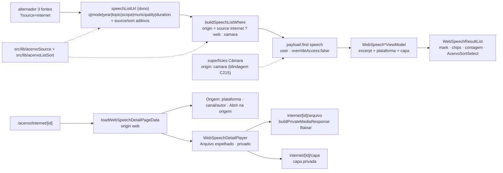

# Impl: C216 — Terceira fonte do acervo: "Falas na internet"

Status: aprovado
Atualizado em: 2026-09-24
Issue: #1292
Intenção: docs/plans/acervo-fonte-falas-web.md
Appetite restante: herdado (~3–4 dias eng; um outcome verificável — a assessoria alterna para "Falas na internet" no mesmo acervo, busca/filtra com a paridade da Câmara e assiste/baixa a fala encontrada, sabendo de onde ela veio)

## Leitura da intenção

- **Outcome:** a terceira fonte do acervo existe e é navegável: alternador de três fontes no `/campanha/comunicacao/acervo`; "Falas na internet" com busca textual com destaque, `mode=termo|tema`, ano, tema, alcance, duração e municípios citados (paridade no que a fonte tem), contagem e paginação; o detalhe da fala abre a mídia espelhada privada com player, transcrição clicável por segmento, "Baixar", "Abrir na origem" e atribuição (plataforma + canal/autor + data); chip de plataforma na lista e capa da origem (ou placeholder). Gate fail-closed do acervo; mídia nunca pública; mobile utilizável.
- **O que NÃO negociar:**
  - Gate do acervo fail-closed (`requireCampaignPageActor({ gate: 'communicationCatalog' })` na página + `canReadCommunicationCatalog` na rota de mídia); `advisor`/`leader` negados com `404` silencioso, nunca `403` que confirma existência.
  - **Contrato da Câmara congelado em bytes**: `q|mode|year|topic|scope|phase|municipality|duration|page` continua parseando/serializando exatamente como hoje; nenhum comportamento da Câmara muda (lista, barra, vazio, detalhe, cortes, Sollinha, cobertura).
  - Mídia espelhada jamais pública: nunca `/api/media/file`; serving só pela rota autenticada sob `/campanha`.
  - Sem segundo cadastro de pessoa, sem `Consent` novo, sem escrita (a fonte é read-only), sem item de nav novo.
  - `mode=tema` mantém a degradação honesta (aviso + busca literal) e a expansão só roda depois do gate.
- **O que reavaliar (hipóteses do plano de intenção vs. código):**
  - `parseAcervoSource`/`AcervoSource` hoje vivem no contrato das **gravações** (`recordingListUrl.ts:44,107`), mas a fonte nova é do domínio `speech`. Importar o vocabulário de fonte de `recordings` dentro de `speech*` criaria **ciclo** (`recordings` já importa `speechListUrl`/`speechListFilters`). O vocabulário compartilhado do acervo sai para `src/lib/acervoSource.ts` (D1).
  - `RecordingSortSelect`/`RECORDING_SORT_OPTIONS` (C219) são o 3º consumidor antecipado no próprio C219 ("extrair quando C216 chegar — 3º consumidor"): a ordenação vira vocabulário puro compartilhado (D2).
  - `loadSpeechDetailPageData` não filtra `origin` hoje (`speechPageData.ts:266-275`): um id web em `/acervo/[id]` renderizaria o player da Câmara quebrado — fechar é parte desta entrega (D3).
  - `clearSpeechOmnibox` descarta tudo (`speechOmnibox.ts:274-276`), inclusive um futuro `source`: sem o ajuste, "limpar" uma busca web cairia na Câmara (D6).
  - O defer S4 do C215 ("nome do arquivo espelhado genérico (`source.mp4`) — gatilho: C216 define o nome de download") vence agora (D4).
  - A variante visual de player para **áudio** e as cores dos chips das plataformas **Instagram/Áudio** não existem no artefato aprovado (que cobre vídeo + YouTube/Rádio): trigger (a) do `designer` antes do markup (D6/§Design).
  - O artefato não mostra `/acervo/internet` como rota de lista: a fonte web é `?source=internet` no mesmo alternador (gate confirmou), e só o detalhe ganha segmento próprio (`internet`) — como o C199 fez com `gravacoes` (D3).

## Abordagem recomendada

**Opções consideradas:** A) a fonte web como **dimensão do contrato da fala** (estender `speechListUrl`/`speechListFilters`/`speechOmnibox`/`speechPageData`/`speechViewModels` com `source`), detalhe em rota própria e mídia privada por fala reusando `buildPrivateMediaResponse` | B) um contrato gêmeo da fonte web (`webSpeechListUrl`, `webSpeechOmnibox`, `webSpeechPageData`, `webSpeechViewModels`, `webSpeechListFilters`) | C) uma rota de lista separada por fonte (e um detalhe despachado dentro de `/acervo/[id]`).
**Recomendação:** A — o material é a **mesma unidade de catálogo** (`speech`, as mesmas facetas, os mesmos segmentos, a mesma busca trigram, o mesmo `SpeechAcervoFilters` pode ser reusado porque o estado é o mesmo tipo) e a intenção cortou explicitamente a lista separada; a "fonte" já é dimensão do contrato em `recordingListUrl` (`?source=enviadas`) desde o C199. O que é genuinamente novo (rota do detalhe, mídia privada por fala, card com capa/plataforma, ordenação) entra no dono do concern, sem twin.
**Rejeitadas:** B porque duplica parse/serialização do MESMO par `collection`×facetas, e forçaria gêmeos de omnibox, filtros e loaders — a doutrina "edit the owner, don't twin" e o critério real da intenção ("sem renomear/quebrar params existentes") não pedem um segundo contrato, pedem params aditivos; C porque fragmenta o acervo (anti-goal confirmado no gate) e misturar os dois details acoplados em `/acervo/[id]` arriscaria o player/VOD/cortes da Câmara.

### Decisões de engenharia

**D1 — A fonte web é dimensão do contrato da fala; o vocabulário de fonte sai para `src/lib/acervoSource.ts`.**
`Decisão: A — speechListUrl ganha source?: 'internet' (só serializa quando web) e sort?; os params source|sort entram no paramNameSet de forma aditiva; parse de source fail-closed (desconhecido→Câmara); valor ?source=internet; vocabulário compartilhado em lib pura.`
`Por quê: os bytes canônicos da Câmara ficam intocados (pins existentes verdes); a web é um recorte da mesma tabela/facetas, e um único ponto traduz source internet → origin web na where.`
`Rejeitadas: B (webSpeechListUrl gêmeo) porque duplica o parse/serialize das MESMAS facetas e força gêmeos de omnibox/loaders; C (rota de lista separada) porque a intenção confirmou alternador único.`

- **Ajuste ao código (registrado):** `parseAcervoSource`/`AcervoSource`/`buildAcervoSourceHref` **movem** de `src/utilities/recordings/recordingListUrl.ts` para `src/lib/acervoSource.ts` (`AcervoSource = 'camara' | 'enviadas' | 'internet'`, `ACERVO_SOURCE_PARAM`, `parseAcervoSource` com o mesmo fail-closed, `buildAcervoSourceHref`). Motivo: `speechListUrl` precisa do vocabulário e não pode importar de `recordings` (ciclo: `recordings → speechListUrl/speechListFilters`); o lib já é a casa dos contratos puros/client-safe e não importa `@/utilities` (verificado). Os call sites atualizam o import (`AcervoSourceToggle`, `acervo/page.tsx`, `gravacoes/page.tsx`, `gravacoes/[id]/page.tsx`, unit das gravações); sem re-export falso.
- `SpeechListState` ganha `source?: 'internet'` (ausente = Câmara; o tipo não vira obrigatório para não quebrar as construções existentes). `parseSpeechListParams` deriva `isWeb = parseAcervoSource(params) === 'internet'`; `source: 'internet'` só entra no estado quando o valor é exatamente esse.
- Serialização canônica: `source=internet` **sempre** serializado quando o estado é web (é o que seleciona a fonte); a Câmara segue sem o param. `sort` só serializa quando web e ≠ `recentes`.
- **Fase é só da Câmara:** com `source=internet`, `parseSpeechListParams` ignora `phase` → o canônico não o carrega → `?source=internet&phase=X` redireciona para o canônico (fail-closed). Sem web, tudo como hoje.
- **Fail-closed de valor desconhecido:** `source=xyz` → Câmara no dispatch e no parse; o canônico omite o param → redirect (mesmo desfecho de hoje, quando o param era "unsupported").
- Página: `parseAcervoSource(params)` vira despacho de 3 vias em `acervo/page.tsx:200`; `enviadas` segue o branch C199; `internet` entra no branch novo; o resto é Câmara.

**D2 — Ordenação compartilhada (extrair o dono, não copiar).**
`Decisão: A — vocabulário em src/lib/acervoListSort.ts (ACERVO_SORT_OPTIONS/labels + AcervoSortKey + parseAcervoSort fail-closed + acervoSortIsDuration) e componente shared/AcervoSortSelect parametrizado por toHref + hint.`
`Por quê: é o 3º consumidor prometido no defer do C219; o mapeamento para o sort do Payload fica por domínio (recentes → -createdAt nas gravações, → -speechAt na web; duração → ±durationSeconds com gate durationSeconds exists); assim os buckets/ordenação nunca divergem entre fontes.`
`Rejeitadas: copiar a vocab para o módulo de speech (gêmea de conhecimento idêntico — mudança de rótulo/valor divergiria as fontes em silêncio); não implementar sort (quebraria classe-a-classe a cena 01 do artefato, que tem o select).`

- `recordingListUrl.ts` passa a importar de `@/lib/acervoListSort` (as gravações mantêm o contrato em bytes: `RECORDING_SORT_OPTIONS`/`RecordingSortKey` deixam de ser exportados porque não há outro consumidor; `recordingSortOrder` fica no domínio e `recordingSortIsDuration` delega a `acervoSortIsDuration(state.sort)`). `speechListUrl.ts` ganha `webSpeechSortOrder(state)` (`recentes`→`-speechAt`, `duracao_maior`→`-durationSeconds`, `duracao_menor`→`durationSeconds`).
- `AcervoSortSelect` (`components/campaign/shared/AcervoSortSelect.tsx`, client) recebe `state` genérico (`{ page: number; sort?: AcervoSortKey }`) + `toHref` + `hint`; mostra o hint quando o sort ativo é de duração. `RecordingSortSelect.tsx` é removido (o ramo das gravações passa o hint atual; a web passa "Falas sem duração aparecem apenas em Mais recentes.").
- Gate do sort de duração no `where`: `{ durationSeconds: { exists: true } }` — sem ele o Postgres abriria "Duração (maior)" com as linhas sem duração (NULLS FIRST); na Câmara é inerte (não parseia sort).

**D3 — Detalhe da fala web em rota própria; detalhe da Câmara blindado.**
`Decisão: A — /campanha/comunicacao/acervo/internet/[id] (+ /arquivo e /capa), precedente gravacoes/[id]; loadSpeechDetailPageData ganha origin: camara no where (id web em /acervo/[id] vira 404).`
`Por quê: o detalhe da Câmara é acoplado (VOD, SpeechDetailPlayer, cortes C174, taquigrafia) e o da web é outro produto (mídia espelhada, atribuição, download) — separá-los mantém cada um com seus donos e fecha o risco de id web renderizar o player da Câmara.`
`Rejeitadas: despachar os dois detalhes no /acervo/[id] existente (mistura dois fluxos acoplados no mesmo arquivo, risco de regressão no player/VOD/cortes da Câmara; o parâmetro oculto de source no detalhe não existe hoje).`

- Segmento `internet` (decidido): `CAMPAIGN_COMMUNICATION_ACERVO_INTERNET = '/campanha/comunicacao/acervo/internet'` em `campaignPaths.ts`, com `campaignInternetSpeechHref(id)` (a URL que o card/detalhe usam), e o detalhe Câmara segue `/acervo/<id>`. Sem rota de lista `/acervo/internet` (o alternador aponta `?source=internet`); um `/acervo/internet` digitado cai em `[id]` com id não-numérico → `notFound`.
- `loadSpeechDetailPageData` (Câmara) passa a consultar `{ id: { equals: speechId }, origin: { equals: 'camara' } }` → `SpeechNotFoundError` para id web (o int pina).
- O chrome não precisa de rule nova: o regex genérico `/^\/campanha\/comunicacao\/acervo\/[^/]+$/` (`campaignPageChrome.ts:330`) não casa `/acervo/internet/<id>` (dois segmentos); o detalhe seta o próprio chrome via `SetCampaignPageChrome` (precedente `gravacoes/[id]`).

**D4 — Mídia privada por fala (arquivo + capa) com nome de download derivado do título.**
`Decisão: A — internet/[id]/arquivo (player + ?download=1) e internet/[id]/capa, ambos com o gate do acervo (getCampaignUser + canReadCommunicationCatalog, findByID overrideAccess:false, 404 quando origin !== 'web'), via buildPrivateMediaResponse; dispositionFilename puro derivado do título — fecha o S4 do C215.`
`Por quê: o dono do I/O privado já existe e serve range/416/404/download/Cache-Control; a rota por fala conhece o título para nomear o arquivo e é o único lugar que cruza fala × mídia com o gate do catálogo.`
`Rejeitadas: rota única por media id (não conhece a fala → não tem nome de download nem o gate do acervo); /api/media/file (contrato público anônimo por definição — vazaria a collection privada).`

- `arquivo/route.ts`: `findByID` `depth: 1` selecionando `{ origin, title, mirroredMedia }`, `404` se `origin !== 'web'` ou sem mídia; `staticDir = resolvePrivateMediaStaticDir(payload, INTERNET_SPEECH_MEDIA_SLUG)` (helper exportado do dono); `download = searchParams.get('download') === '1'`; `dispositionFilename = webSpeechDownloadFilename({ title, storedFilename: media.filename })`.
- `capa/route.ts`: mesma forma, servindo `thumbnail` inline (`download: false`; 404 quando ausente — o placeholder do card decide antes, pela presença do id).
- `webSpeechDownloadFilename({ title, storedFilename })` em `src/lib/webSpeech.ts` (puro, unit-testado): preserva a extensão do arquivo armazenado, remove control chars/aspas/CRLF, colapsa separadores, limita o tamanho e cai no próprio `storedFilename` quando o título é vazio.
- `privateMedia.ts` já considera áudio/vídeo/imagem inline — nada a mudar; o `Content-Disposition` continua sendo o do dono (`filename` + `filename*`).
- Cascata/limpeza: nada novo — o `beforeDelete` do `Speech` (C215) já apaga mídia e capa.

**D5 — Loaders e view models nos donos (`speechPageData`/`speechViewModels`).**
`Decisão: A — generalizar loadSpeechFilterOptions(payload, user, origin) (fase só Câmara) e adicionar loadWebSpeechAcervoPageData/loadWebSpeechDetailPageData no mesmo módulo; adicionar a família WebSpeech*ViewModel + builders puros no mesmo speechViewModels, reusando os helpers privados.`
`Por quê: collection, facetas, segmentos, labels e o gate de tema são o mesmo conhecimento; um módulo gêmeo duplicaria (e divergiria) os helpers privados formatSpeechAt/formatSpeechDuration/municipalityViewModels/topicViewModels/pickThemeMatch.`
`Rejeitadas: webSpeechPageData.ts/webSpeechViewModels.ts gêmeos (twin de conhecimento com helpers privados duplicados); loader web dentro do componente/página (não testável por camada).`

- `loadSpeechFilterOptions(payload, user, origin)`: `where { origin: { equals: origin } }`; `phases` só é preenchido para `'camara'`; anos/municípios saem do conjunto da fonte (para a web, `phases: []` — a faceta Fase não aparece e o omnibox não semeia fases).
- `loadWebSpeechAcervoPageData(payload, user, searchParams, expandTheme = expandSpeechSearchTheme)`: `resolveSpeechListUrl` (que já lê `source=internet`); gate de tema (`mode=tema && q && canReadCommunicationCatalog` antes de qualquer chamada externa); `payload.find speech` com `where: buildSpeechListWhere(state, themeTerms)`, `sort: webSpeechSortOrder(state)`, `select` web (+`searchText` só quando `q`, para `matchedTextSearch`/evidência de tema) e `user`/`overrideAccess:false`; paginação `speechPageSize`; `loadSegmentsForSpeeches` (dono), `loadMunicipalityLabelsByIds`+`municipalityNameMap` (donos); **sem** cortes/VOD/poster (C217 e admin são outros donos). Retorno `WebSpeechAcervoPageData` espelhando `SpeechAcervoPageData` (rows/state/redirectHref/totalDocs/totalPages/filterOptions/themeUnavailable/themeApplied).
- `loadWebSpeechDetailPageData(payload, user, speechId, query?)`: `find` com `{ id, origin: 'web' }` e `depth: 1` (`mirroredMedia`/`thumbnail` com `mimeType`/`filename`); segmentos via `speechSegment` (mesmo select/sort `order`); monta `WebSpeechDetailViewModel`. `loadWebSpeechTitleForActor` para `generateMetadata` (leitura só de título, precedente das gravações).
- `speechViewModels.ts`: `WebSpeechListRecord`/`WebSpeechDetailRecord` + `toWebSpeechListItemViewModel`/`toWebSpeechDetailViewModel`, reusando `formatSpeechAt`/`formatSpeechDuration`/`municipalityViewModels`/`topicViewModels` (mesmo módulo), `pickThemeMatch`/`pickMatchingSegment`/`buildHighlightedExcerpt`/`splitHighlightedParts` (`speechHighlight`/`speechSearch` — `keywords` ausente na web é tratado pelo próprio helper) e um `withSeekQuery(href, segment, query)` interno extraído para os dois hrefs de detalhe (o atual `buildWatchHref` da Câmara mantém assinatura e bytes; o web é `buildWebSpeechWatchHref`).
- `thumbnailUrl` do VM web = `campaignInternetSpeechCoverHref(id)` quando `thumbnail` existe; senão `null` (o card renderiza o placeholder "SEM CAPA"). `platform` vira `{ value, label }` via `webSpeechPlatformLabel`.

**D6 — UI: portar o artefato; estender a barra da Câmara por copy condicional (sem twin).**
`Decisão: A — SpeechAcervoFilters ganha props de copy com default = Câmara (label/placeholder/aria/label da faceta Município citado/showPhase) e speechOmnibox ganha municipalityLabel opcional; componentes novos só os da fonte web (card/lista/player).`
`Por quê: o estado e o omnibox são o MESMO contrato (SpeechListState) — diferente do C219, que rejeitou estender a barra da Câmara para as gravações porque o contrato era outro; aqui estender por copy é reuso do dono, e o default preserva os bytes/comportamento da Câmara.`
`Rejeitadas: WebSpeechAcervoFilters próprio (twin de ~150 linhas sobre o mesmo estado/omnibox — a mecânica é a dos shells compartilhados); mover/reescrever a barra da Câmara (anti-goal: a Câmara é a referência intocada).`

- **Design gate (Passo 3d — trigger (a)):** o artefato cobre vídeo + chips YouTube/Rádio. Antes do markup, despachar o `designer` para estender o artefato com (1) a variante de player para mídia de **áudio** (`<audio controls>` no mesmo box escuro com o badge "Arquivo espelhado · privado") e (2) as cores dos chips de plataforma **Instagram** e **Áudio** (e a regra de fallback para plataforma sem cor). O implementador não inventa esses visuais; se o designer não responder, para no ponto (nunca "segue sem").
- `AcervoSourceToggle` (mover de `components/campaign/recording/` para `components/campaign/shared/` — o alternador agora é do acervo, não das gravações): 3 abas com `aria-current`, `grid w-full grid-cols-3` no mobile com rótulos curtos (Câmara | Enviadas | Internet) e `md:inline-flex` com os longos (Falas da Câmara | Gravações enviadas | Falas na internet), conforme cenas 01/03.
- `SpeechAcervoFilters` estendido (defaults Câmara): `omniboxLabel`, `omniboxPlaceholder`, `municipalityFacetLabel` ('Município citado' na web), `showPhase` (false na web), `filtersAriaLabel` e o `municipalityLabel` repassado aos builders do omnibox (`buildSpeechOmniboxChips`/`buildSpeechOmniboxSuggestionSeeds`) para o chip/sugestão lerem "Município citado". O restante (modo tema, chips, popovers, pending) é o mesmo.
- **Ajuste no dono do omnibox:** `clearSpeechOmnibox` passa a preservar `source: 'internet'` (hoje descarta tudo — "limpar" na web cairia na Câmara); o default da Câmara continua `{ page: 1 }` (pin existente verde).
- `WebSpeechResultCard`/`WebSpeechResultList` (`components/campaign/speech/`): grid do artefato (thumb/placeholder, chip de plataforma, data · duração, título, trecho com `SpeechHighlightParts`, chips de tema, "Ver fala"); a capa reusa `SpeechResultThumbnail` (skeleton/lazy) apontando para `/capa`; sem capa, placeholder no mesmo slot com o rótulo "SEM CAPA" (o artefato manda o slot fixo; nada de `` quebrada).
- `WebSpeechDetailPlayer` (client, `speech/`): box escuro com o badge "Arquivo espelhado · privado"; `<video controls>` para mídia de vídeo e `<audio controls>` para áudio (mesma busca/estado ativo no `onTimeUpdate`); "Baixar" (`downloadHref`) e "Abrir na origem" (`sourceUrl`, `rel="noreferrer"`, oculto quando nulo); box "Origem" (plataforma · canal/autor · "Publicado em <data>"); barra/lista de transcrição clicável com o segmento ativo.
- **Transcrição clicável sem gêmeo:** mover `RecordingTranscriptSegmentButton` → `components/campaign/shared/CampaignTranscriptSegmentButton.tsx` e afinar o tipo do segmento para o contrato estrutural (`{ startSeconds, startLabel, parts }`), atualizando os 2 imports das gravações (`RecordingDetailPlayer`, `RecordingSpeakerTranscript`) — o valor do `variant` e os bytes são os mesmos (precedente C219 movendo `CampaignThemeRetryButton` para `shared/`).
- Página/branches: `AcervoHeader` (subtitle com a terceira fonte) + branch web local (`WebSpeechSource`, como `RecordingsSource`) com `CampaignListPendingBoundary`, barra estendida com `key={buildSpeechFiltersKey(state)}`, aviso de tema degradado (`SpeechThemeFallbackNotice` + `CampaignThemeRetryButton`), `AcervoSortSelect` (hint "Falas sem duração aparecem apenas em Mais recentes."), `CampaignListResults`, `WebSpeechResultList`, `CampaignListEmptyState` (vazio honesto com "Limpar busca e filtros" → `buildAcervoSourceHref('internet')`) e `CampaignListFooter` ("falas na internet encontradas"). O ramo da Câmara (e o das gravações) não muda de bytes.
- Copy do chrome: `campaignPageChromeCatalog.acervo.subtitle` e o `
` do header passam a citar as três fontes ("Busque nas falas da Câmara, nas gravações da equipe ou nas falas encontradas na internet.").
- Detalhe web (`internet/[id]/page.tsx`): "← Voltar para Falas na internet" (artefato) → `buildAcervoSourceHref('internet')`; `SetCampaignPageChrome` com título próprio; estados do artefato (o "sem permissão" é o redirect fail-closed do gate, como no C219; o "carregando" é o `loading.tsx` do acervo, que cobre as rotas aninhadas).

**D7 — Sem migration, sem Consent, sem escrita.**
`Decisão: A — read-only: nenhuma collection/campo/action/transação nova; internetSpeechMedia já existe com access próprio (read: canReadSpeech) e os campos web já existem no Speech.`
`Por quê: a ingestão (C215) é a dona da escrita; esta entrega só lê e serve o que já está catalogado.`
`Rejeitadas: qualquer migration (nada de schema muda); Consent novo (sem PII nova); rota de escrita/upsert no app (o CLI do C215 é o dono).`

**Decisões baratas (com gatilho de revisitação):**

- **Capa sem rota de download dedicada:** a rota `capa` serve inline (imagem não vira download); se um dia a assessoria pedir "baixar a capa", é o mesmo `buildPrivateMediaResponse` com `download`.
- **Poster da capa no player de vídeo:** não especificado no artefato — não fazer; revisitar se o designer estender.
- **Extração do ramo da Câmara em componente local** (`CamaraSource`) quando o arquivo `acervo/page.tsx` passar de ~3 branches — extração local, sem módulo novo (gatilho do S5 do C219).
- **`municipalityLabel` no omnibox** por parâmetro opcional, não por cópia do adaptador; se um 3º label aparecer, virar config.
- **Sem alias `/acervo/internet`:** o alternador aponta `?source=internet`; um alias só teria custo de redirect e chrome.
- **Sem estado de processamento por item** (decisão de produto da intenção): a lista web só mostra o que o C215 considera completo; falhas ficam no relatório da ingestão.

### Componentes / mudanças

- **`src/lib/acervoSource.ts`** (novo, puro/client-safe): `AcervoSource` 3-way, `ACERVO_SOURCE_PARAM`, `parseAcervoSource` (fail-closed), `buildAcervoSourceHref`. Sem import de `@/utilities` (evita ciclo e mantém lib limpa).
- **`src/lib/acervoListSort.ts`** (novo, puro): `ACERVO_SORT_OPTIONS` + labels, `AcervoSortKey`, `parseAcervoSort`, `acervoSortIsDuration`.
- **`src/lib/webSpeech.ts`** (editar): `webSpeechDownloadFilename({ title, storedFilename })`.
- **`src/lib/campaignPaths.ts`** (editar): `CAMPAIGN_COMMUNICATION_ACERVO_INTERNET`, `campaignInternetSpeechHref`, `campaignInternetSpeechFileHref` (com `?download=1`), `campaignInternetSpeechCoverHref`.
- **`src/lib/campaignPageChrome.ts`** (editar): subtitle do `acervo` com a terceira fonte (copy).
- **`src/utilities/speech/speechListUrl.ts`** (editar): `source?: 'internet'` + `sort?: AcervoSortKey` no estado; params aditivos; parse fail-closed e por fonte (fase só Câmara); serialização canônica; `webSpeechSortOrder`.
- **`src/utilities/speech/speechListFilters.ts`** (editar): `buildSpeechFacetWhere` deriva `origin` de `state.source` (web/camara); fase só Câmara; gate `durationSeconds exists` quando sort de duração. `buildSpeechListWhereIncludingCutOrigins` continua Câmara-only.
- **`src/utilities/speech/speechPageData.ts`** (editar): `loadSpeechFilterOptions(payload, user, origin)`; `loadWebSpeechAcervoPageData`, `loadWebSpeechDetailPageData`, `loadWebSpeechTitleForActor`; `loadSpeechDetailPageData` ganha `origin: camara`.
- **`src/utilities/speech/speechViewModels.ts`** (editar): família `WebSpeech*` (records, list/detail VMs e builders) + `buildWebSpeechWatchHref` (com `withSeekQuery` interno).
- **`src/utilities/speech/speechOmnibox.ts`** (editar): `municipalityLabel` opcional nos builders; `clearSpeechOmnibox` preserva `source`.
- **`src/utilities/recordings/recordingListUrl.ts`** (editar): importa source/sort dos libs; mantém o contrato em bytes e os toggles; remove os exports sem consumidor.
- **`src/components/campaign/shared/`** (novos/movidos): `AcervoSourceToggle.tsx` (movido), `AcervoSortSelect.tsx` (novo), `CampaignTranscriptSegmentButton.tsx` (movido e com tipo estrutural).
- **`src/components/campaign/speech/`** (novos): `WebSpeechResultCard.tsx`, `WebSpeechResultList.tsx`, `WebSpeechDetailPlayer.tsx`; (editar) `SpeechAcervoFilters.tsx` com as props de copy.
- **Rotas** (novas): `acervo/internet/[id]/page.tsx`, `acervo/internet/[id]/arquivo/route.ts`, `acervo/internet/[id]/capa/route.ts`; (editar) `acervo/page.tsx` (dispatch 3 vias + branch web + header/subtitle).
- **Removidos:** `RecordingSortSelect.tsx`, `RecordingTranscriptSegmentButton.tsx` (movido), `AcervoSourceToggle.tsx` (movido).
- **Migration:** nenhuma (D7).
- **Access / Consent:** nada muda: gate da página `communicationCatalog` e das rotas `canReadCommunicationCatalog`; `findByID`/`find` com `user` + `overrideAccess:false`; sem `Consent`/PII novos; sem rota pública.
- **UI:** Impeccable C — port classe-a-classe de `docs/plans/acervo-fonte-falas-web-ui-design.html` (cenas 01–04) com o `designer` nos triggers (a) (áudio + chips Instagram/Áudio) e (c) (crítica final no fechamento). Shells reusados: `CampaignListOmnibox`/`CampaignSearchModeControl`/`CampaignHeaderFilterPopover`/`CampaignListPending*`/`CampaignListEmptyState`/`CampaignListFooter`/`CampaignListPagination`.

### Dados → forma (se aplicável)

- **N/A por decisão da intenção** (`acervo-fonte-falas-web.md:50`): resultados de busca e facetas são recorte editorial, não métrica; nenhum score de relevância/similaridade é exposto (e a contagem é paginação, não vaidade). Nada a apresentar; nenhuma forma nova.

## Fases verificáveis

1. **Tracer / contrato + server** (~1–1,5 dia).
   - `src/lib/acervoSource.ts`, `src/lib/acervoListSort.ts`; `speechListUrl` (source/sort); `speechListFilters` (origin/gates); `recordingListUrl` migrando para os libs; `speechPageData` (opções por origem + loaders web + blindagem do detalhe Câmara); `speechViewModels` (VMs web); `campaignPaths`; `webSpeechDownloadFilename`.
   - Prova: `tests/unit/acervoSource.unit.spec.ts` (novo: 3-way fail-closed + hrefs), `tests/unit/acervoListSort.unit.spec.ts` (novo), extensões de `speechListUrl.unit.spec.ts` (source/sort web + pins da Câmara intocados + fase ignorada na web), `speechListFilters.unit.spec.ts` (origin por estado, gate de duração), `speechOmnibox.unit.spec.ts` (clear preservando source, label), `speechViewModels.unit.spec.ts` (VMs web), `webSpeech.unit.spec.ts` (nome de download), ajuste de imports de `recordingListUrl.unit.spec.ts`; `tests/int/webSpeechAcervo.int.spec.ts` (novo: lista só web/facetas/tema injetado/paginação/opções; detalhe web; id web 404 no detalhe Câmara; id Câmara 404 no detalhe web; capa ausente; filename do download).
2. **UI port** (~1–1,5 dia).
   - **Primeiro:** dispatch do `designer` (Passo 3d, trigger (a)) para a variante de áudio + cores de chip Instagram/Áudio; só depois do retorno, o markup dessas peças.
   - `AcervoSourceToggle` 3 fontes; `SpeechAcervoFilters` com copy; `AcervoSortSelect`; `CampaignTranscriptSegmentButton` shared; `WebSpeechResultCard`/`WebSpeechResultList`/`WebSpeechDetailPlayer`; rotas `internet/[id]` (+ `arquivo`/`capa`); página com dispatch e estados.
   - Prova: `tests/e2e/campaignSpeechAcervo.e2e.spec.ts` estendido (describes novos: switcher de 3 fontes; lista web com chip de plataforma/mark/contagem; faceta estreitando + vazio honesto; detalhe com player/transcrição/Baixar/Abrir na origem/atribuição; `arquivo`/`capa` só para papéis do acervo, com range, download nomeado e 404 para `advisor`; fala web invisível na Câmara e 404 em `/acervo/<id>`); fixtures de mídia real (bytes válidos, padrão de `tests/int/webSpeechIngest.int.spec.ts`); `pnpm dev` manual contra as cenas 01–04.
3. **Gates / fechamento** (~0,5 dia).
   - `scripts/lib/e2e-affected-manifest.mjs` (entry do acervo ganha `src/lib/acervoSource` e `src/lib/acervoListSort` — hoje um diff nesses arquivos cairia no smoke da home); `pnpm gate:fast`; depois a cascata cheia (`pnpm lint`, `pnpm format:check`, `tsc --noEmit`, `pnpm exec knip`, `pnpm check:cycles` — ciclo `recordings ↔ speech` é o risco nomeado, `pnpm test`, `pnpm build`); `pnpm test:e2e:affected`; crítica do `designer` (trigger (c)) com `Design tier` no PR; `pnpm push`; entrada em `docs/changelog/<data>-c216.md`.

Quota: ~3–4 dias eng, dentro do appetite herdado. Se apertar, os cortes são o `municipalityLabel` (chip da web lê "Município" como a Câmara — divergência de copy) e o placeholder "SEM CAPA" (card sem thumb) — nunca a blindagem do detalhe Câmara, o gate das rotas de mídia nem os pins de bytes da Câmara.

## Rabbit holes / Não escopo (engenharia)

- Ingestão/descoberta/download/transcrição/classificação (C215/C218); skill de atualização (C218).
- Cortes e links compartilháveis a partir da fala web (C217); `SpeechCut`/origens de corte para web.
- Diarização, edição de transcrição, publicação externa; geração de thumbnail (só a da origem); transcode/masters; signed URLs.
- Merge multi-fonte/busca global única; item de nav novo; mexer no feed do site ou na Central de Conteúdos (C211).
- Abrir a web em `speechCoverage`/`findSpeechExcerpts`/Sollinha (a blindagem C215 mantém `origin: camara` lá; C216 é só a fonte do acervo).
- Segundo cadastro de pessoa (canal/autor é texto de origem); tornar `channel` um `Contact`.
- Qualquer mudança de contrato/comportamento da Câmara (lista, barra, fase, detalhe, cortes, poster, VOD) — o teste de bytes é o pino.
- `loadSpeechFilterOptions` com cache/prefetch; SSR de áudio/vídeo playback (browser é território do browser; o e2e só assere o contrato HTML).
- Alias de rota `/acervo/internet` (lista) — não existe por design.

## Riscos e mitigação

- **Regressão da Câmara por estender componentes/contratos compartilhados.** Os params são aditivos e a serialização da Câmara não muda (pins de `speechListUrl.unit.spec.ts` intocados); as props novas da barra têm default = Câmara e o call site da Câmara não passa nada; os ints/e2e da Câmara continuam verdes. Qualquer diferença de bytes no `?q=`/`?t=`/detalhe é bug de PR, não débito.
- **Ciclo `recordings ↔ speech` ao mover o vocabulário de fonte.** Mitigado por colocar fonte/sort em `src/lib/*` (lib não importa `@/utilities` hoje; verificado); `pnpm check:cycles` no gate e no CI.
- **Rota nova engolindo/colidindo com o `[id]` da Câmara ou com o chrome.** Segmento estático `internet` vence o dinâmico em `/acervo/internet/<id>`; o regex do chrome não casa o detalhe (2 segmentos) e o detalhe seta o próprio chrome — como `gravacoes/[id]`.
- **Vazamento de mídia privada.** Só rotas sob `/campanha` com o gate do catálogo; `origin !== 'web'` → 404; sem `media` pública; toda negação é 404 silencioso (não confirma existência).
- **Nome de download hostil (título com aspas/CRLF/tamanho).** Helper puro sanitiza, preserva a extensão e cai no nome armazenado; `privateMediaContentDisposition` já emite `filename*` (RFC 5987) — teste unitário e e2e do header.
- **Sort de duração com linhas sem duração.** Gate `durationSeconds exists` no `where` (o Postgres ordena NULLS FIRST) + hint no controle, como no C219; int cobre.
- **Barra web com rótulo errado/`source` perdido ao limpar.** `clearSpeechOmnibox` preserva `source` (unit pina); `municipalityLabel` default mantém a Câmara.
- **Mídia de áudio no artefato (variante nova) sem desenho.** Trigger (a) do `designer` antes do markup; sem resposta, o trabalho para — não se inventa player/chip.
- **Fixture e2e com mídia real.** Seguir o padrão do int do C215 (MP4/MP3/JPEG mínimos válidos) para o range/download exercitarem bytes de verdade.
- **Manifest e2e desatualizado.** `src/lib/acervoSource`/`src/lib/acervoListSort` entram no entry da vertical; `campaignSpeechAcervo` já é o spec mapeado e já está no curado (OPS86), então o PR nunca roda zero e2e.
- **`payload-types`/migration:** nada muda (sem schema) — nenhum HARD-STOP de migration nesta entrega.

## Aceite de engenharia

- [ ] Aceite de produto da intenção ainda coberto: alternador de 3 fontes com `aria-current`; busca/destaque e `mode=termo|tema`; facetas ano/tema/alcance/duração/municípios citados; contagem e paginação; chip de plataforma; capa ou placeholder; detalhe com player privado, transcrição clicável (clique posiciona), "Baixar", "Abrir na origem" e atribuição (plataforma + canal/autor + data); estados vazio/carregando/sem permissão; mobile.
- [ ] Invariantes AGENTS/engineering-standards: `user` + `overrideAccess: false` em toda leitura; mídia nunca pública; `advisor`/`leader` fail-closed (404); sem `Consent`/PII/segundo cadastro; sem item de nav; sem escrita/transação nova; copy pt-BR / identificadores em inglês; sem `openai/*` fora do `designer` (OPS123).
- [ ] Contrato da Câmara congelado: pins de `speechListUrl`/`speechListFilters`/`speechOmnibox`/`speechViewModels`/`speechAcervo.int`/e2e da Câmara verdes sem adaptação de bytes.
- [ ] Blindagem do detalhe Câmara (`origin: camara`) com int provando 404 para id web; fala web invisível na lista/opções/Câmara.
- [ ] Testes de domínio previstos: unit (source/sort/URL/filtros/omnibox/VMs/filename), int (`webSpeechAcervo`), e2e (switcher/lista/detalhe/rotas de mídia/gates).
- [ ] S4 do C215 fechado: `dispositionFilename` derivado do título no download da fala web.
- [ ] Manifest e2e atualizado (`src/lib/acervoSource`, `src/lib/acervoListSort` na vertical).
- [ ] Design: artefato estendido pelo `designer` (áudio + chips Instagram/Áudio) antes do markup e crítica final (trigger c) registrada como `Design tier` no PR; `DEGRADED` ⇒ para antes do push (em `--auto`: sem PR, Issue `blocked`).
- [ ] Gates: `tsc --noEmit`, `pnpm lint` (0 warnings), `pnpm format:check`, `pnpm exec knip`, `pnpm check:cycles`, `pnpm test`, `pnpm build`, `pnpm test:e2e:affected`; `pnpm push`; entrada em `docs/changelog/`.

## Self-score de decision-quality

**4,5/5.**

1. **Decisões caras com rejeitadas:** as 7 decisões (contrato/fonte, ordenação, rota do detalhe + blindagem, mídia privada + nome de download, loaders/VMs, UI/barra, sem migration) têm opções, recomendação e rejeitadas ancoradas em contrato/código (`recordingListUrl.ts:44,107`, ciclo `recordings → speech`, `speechPageData.ts:266-275` sem origin, `speechOmnibox.ts:274-276` descartando source, defer S4 do C215, C219 rejeitando generalização precoce do contrato). As baratas ficam com gatilho explícito.
2. **Cabe no appetite:** ~3–4 dias herdados; tracer no contrato+server antes do port de UI; sem infra/provedor/migration novos; reusa classificador de tema, segmentos, labels, shells e o dono de I/O privado. Os dois cortes de contenção estão nomeados.
3. **Rabbit holes nomeados:** cortes/C217, descoberta/C218, merge multi-fonte, segundo cadastro, transcode/masters, thumbnails, signed URLs, abrir a web em cobertura/Sollinha, alias de lista.
4. **Depth check:** reusa `buildPrivateMediaResponse`/`resolvePrivateMediaStaticDir`, `loadSegmentsForSpeeches`, `loadMunicipalityLabelsByIds`, `SpeechHighlightParts`/`speechHighlight`, `CampaignList*`, `CampaignSearchModeControl`, `useCampaignListFilterNavigation`; extrai os dois vocabulários para lib pura (3º consumidor prometido no C219) e move para `shared/` só o que ganhou 3º consumidor, em vez de criar gêmeos.
5. **Intenção preservada:** a engenharia não reescreveu o produto — a terceira fonte entra no mesmo acervo, com a mesma busca/filtros, detalhe com player/download/origem e mídia privada; o que ficou de fora (cortes, descoberta, merge, edição) é exatamente o que a intenção cortou.

Perde 0,5 porque uma superfície visual (player de áudio + chips Instagram/Áudio) **depende de extensão do artefato pelo `designer`** antes do markup: o plano declara o gate e a parada em vez de inventar o visual — e a execução em `--auto` fica condicionada a esse retorno.
