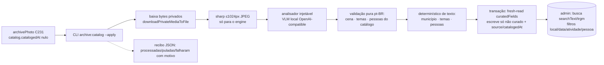

# Impl: C232 — Catalogação com IA do acervo de fotos

Status: aprovado
Atualizado em: 2026-09-26
Issue: #1367
Intenção: docs/plans/acervo-fotos-catalogacao-ia.md
Appetite restante: herdado — ~2 dias eng + tempo de processamento do lote (6,5k fotos)

## Leitura da intenção

- **Outcome:** cada foto do acervo C231 ganha ficha pré-catalogada revisável (legenda/descrição pt-BR, atividade/cena, local, pessoas do catálogo curado, texto visível, temas, descrição semântica); a busca interna acha por local/data/atividade/pessoa/termo; a curadoria humana vence a IA; o passe é em lote não interativo com recibo honesto e reexecução idempotente; nada é público e nenhum nome é inferido de rosto.
- **O que NÃO negociar:** PII/rostos de cidadãos não vão a terceiro sem decisão explícita e contrato; provider reservado aos agentes de design (`openai/*`, OPS123) não entra no app; pessoas só do catálogo curado e com confirmação humana; rosto é presença/tag de cena (biometria é C234); sem segundo engine de catalogação, sem segundo cadastro de pessoa, sem edição de imagem; leitura do acervo pelo mesmo gate da Comunicação (`src/utilities/access/archivePhotos.ts:18-23`).
- **O que reavaliar:** a hipótese da intenção aponta `src/utilities/content/` e `src/utilities/ai/` como áreas prováveis; a engenharia reavalia e escolhe `src/utilities/flickr/` (dono do archivePhoto server-side, C231) + `src/lib` puro + `scripts/lib` para o client HTTP, **sem** reusar o job de peças (input é imagem, não transcrição). A hipótese "embedding para busca futura" fica adiada com gatilho (só a descrição textual agora).

## Abordagem recomendada

**Opções consideradas:** A) pipeline local/self-hosted em CLI de manutenção (recomendada) | B) API de visão de terceiro | C) job in-app com fila.
**Recomendação:** A — o lote não é interativo e roda em casa; o engine é um endpoint OpenAI-compatible configurado por env (Ollama/llama.cpp/vLLM na workstation com GPU, padrão de serviço via tailnet já usado pelo ML do Immich), então nenhuma foto sai da rede privada e nenhum fornecedor fica pinado no código.
**Rejeitadas:** B porque manda foto de cidadão para terceiro sem decisão explícita e contrato (guardrail de produto); C porque ainda exterioriza a imagem e cria dois caminhos para o mesmo risco.

### Componentes / mudanças

**Novos — contrato puro (sem I/O, sem `server-only`; mesmo molde de `src/lib/archivePhoto.ts:1-11`)**

- **`ARCHIVE_PHOTO_SCENES` / `isArchivePhotoScene` / `archivePhotoSceneLabel`** (`src/lib/archivePhotoCatalog.ts`): vocabulário fechado de atividade/cena com labels pt-BR — `plenaria` (Plenária), `audiencia` (Audiência), `reuniao` (Reunião), `evento` (Evento), `mobilizacao` (Mobilização), `visita` (Visita), `entrevista` (Entrevista), `discurso` (Discurso), `retrato` (Retrato), `gabinete` (Gabinete), `outro` (Outro).
- **`ARCHIVE_PHOTO_CURATED_FIELDS` + labels** (`src/lib/archivePhotoCatalog.ts`): `alt`, `caption`, `description`, `scene`, `visibleText`, `hasPeople`, `themes`, `people`, `municipality` — espelha `CONTENT_PIECE_CURATED_FIELDS` (`src/lib/contentPiece.ts:111-137`), um literal por nome de campo persistido.
- **`ARCHIVE_PHOTO_CATALOG_SOURCES`** (`ai | metadata | none`) + labels pt-BR.
- **`archivePhotoThemesFrom`** (`src/lib/archivePhotoCatalog.ts`): resolve tokens contra `resolveSpeechTopic` fail-closed (`src/lib/speechFacets.ts:83-88`), deduplica e capa; nunca inventa slug.
- **`archivePhotoPeopleFromCatalog`** (`src/lib/archivePhotoCatalog.ts`): só nomes que resolvem em `resolvePublicFigureName` (`src/lib/publicFigureCatalog.ts:77-85`); valor não resolvido é descartado, nunca vira nome.
- **`matchPublicFigureMentions`** (`src/lib/archivePhotoCatalog.ts`): menção exata de nome do catálogo no texto (molde `resolveContentPieceInstitution`, `src/utilities/content/contentPieceCataloging.ts:189-201`) para o caminho determinístico `metadata`.
- **`archivePhotoSearchText`** (`src/lib/archivePhotoCatalog.ts`): haystack normalizado com `normalizeForSearch` (`src/lib/speechSearch.ts:11-17`; molde `contentPieceSearchText`, `src/lib/contentPiece.ts:337-352`) — alt, título, legenda, descrição (Flickr + catálogo), cena, texto visível, temas, pessoas, município, álbuns e tags.
- **`archivePhotoTakenOn`** (`src/lib/archivePhotoCatalog.ts`): `YYYY-MM-DD` do wall clock do Flickr (`archivePhotoTakenAt`, `src/lib/archivePhoto.ts:123-127`), fixado ao meio-dia UTC para o admin não exibir o dia anterior.
- **`changedArchivePhotoCuratedFields`** (`src/lib/archivePhotoCatalog.ts`): diff do hook do admin (arrays normalizados; esvaziar conta como decisão).
- **`buildArchivePhotoCatalogWrite`** (`src/lib/archivePhotoCatalog.ts`): merge determinístico que só preenche campo fora de `curatedFields`; `alt` refina a partir da caption só quando não curado (C231 delegou "C232 refina", `src/lib/archivePhoto.ts:118-120`); devolve `{ data, source }`.
- **`parseArchiveVisionOutput` / `buildArchiveVisionPrompt` / `ARCHIVE_VISION_SYSTEM_PROMPT`** (`src/lib/archivePhotoCatalog.ts`): parser zod fail-closed → `ArchivePhotoSuggestion | null`; prompt pt-BR com o vocabulário fechado (cenas, `SPEECH_TOPICS` `src/lib/speechFacets.ts:14-33`, nomes do `publicFigureCatalog` `src/lib/publicFigureCatalog.ts:40-51`) e a regra "nunca inferir nome de rosto; só nomes do catálogo; responder só JSON".

**Novos — server-side Payload**

- **`resolveMentionedMunicipalityId`** (`src/utilities/municipality/municipalityMentionResolver.ts`): extração do lookup de `resolveContentPieceMunicipalityId` (`src/utilities/content/contentPieceCataloging.ts:159-182`) para owner compartilhado na subpasta de domínio já existente; mantém a regra conservadora (só cidade com exatamente 1 entrada; Salvador ambíguo → `null`).
- **`ArchivePhotoAnalyzer` / `listArchivePhotoCatalogQueue` / `catalogArchivePhoto`** (`src/utilities/flickr/archivePhotoCatalog.ts`, `import 'server-only'`; o laço por foto e o recibo ficam no CLI): pipeline por foto com analisador injetável; baixa os bytes privados com `downloadPrivateMediaToFile` + `resolvePrivateMediaStaticDir` (`src/utilities/privateMedia/privateMediaResponse.ts:219-249,43-51`); prepara o JPEG ≤1024px com `sharp` (`package.json:150`); roda o gazetteer determinístico (`matchMunicipalityMentions` `src/lib/speechGazetteer.ts:396-431`, `classifySpeechByGazetteer` `:449-476`); dentro de `withPayloadTransaction` (`src/utilities/payloadTransaction.ts:86-113`) relê `curatedFields`/`catalog.catalogedAt` e escreve só campo não curado + `catalog.source`/`catalog.catalogedAt` (molde `contentPieceJob.ts:285-323`); `context: { archivePhotoCatalog: true }` e `overrideAccess: true` com comentário de bypass.

**Novos — scripts/CLI**

- **`createArchiveVisionClient` / `analyzeImage` / `ArchiveVisionError`** (`scripts/lib/archiveVisionApi.mjs`): client HTTP OpenAI-compatible (`POST {base}/chat/completions`, imagem em `data:` URL base64), `fetchImpl` injetável, timeout ~90s, retry/backoff só em transitório (429/5xx/rede) e erros nomeados — molde `scripts/lib/flickrApi.mjs:27-46,60-124`; nunca loga a chave; entra em `SCRIPTS_SPEC_PINNED` (`scripts/lib/test-affected-core.mjs:31-110`).
- **`parseArchiveCatalogCliArgs` / summaries / `formatArchiveCatalogReport`** (`scripts/lib/archiveCatalogPlan.mjs`): parser dos modos e recibo (molde `scripts/lib/flickrPlan.mjs:48-90,337-373`); também pinado.
- **`scripts/catalog-archive-photos.mjs`** (+ script `pnpm archive:catalog`, molde `package.json:37`): plan default / `--apply` / `--verify`, `--limit` canário, `--out`, `--help`; guardas reusados de `scripts/lib/cli.mjs` (`assertWriteConfirm` com `ARCHIVE_CATALOG_CONFIRM`, `assertEnvironmentDatabaseTarget`, `mirroredMediaRequired` `:312-320,238-301,197-202`) + `assertLocalVisionEndpoint` novo; loop com falha isolada e estágio nomeado (molde `scripts/ingest-flickr-archive.mjs:154-231`); recibo JSON datado em `data/archive/reports/`; `--verify` sai 1 com fotos pendentes.

**Novos — migration/testes/ops**

- **Migration `add_archive_photo_catalog`** (`src/migrations/20260926_HHMMSS_add_archive_photo_catalog.ts` + `.json` + registro em `src/migrations/index.ts`, hoje último em `:89`): grupo `catalog`, `curated_fields`, `taken_on`, `search_text`, índices e GIN trgm (molde `20260923_032714_add_content_piece.ts:5,100`).
- **Testes:** `tests/unit/archivePhotoCatalog.unit.spec.ts`, `tests/unit/archiveVisionApi.unit.spec.ts`, `tests/unit/archiveCatalogPlan.unit.spec.ts`, `tests/unit/visionEndpoint.unit.spec.ts`, `tests/unit/archiveCatalogCli.unit.spec.ts` (guardas por subprocesso); `tests/int/archivePhotoCatalog.int.spec.ts` sobre a fixture JPEG `tests/helpers/archivePhotoFixture.ts`.
- **Ops:** seção C232 em `docs/ops/teqo-1313-deploy.md` (após `:1299-1339`), `ARCHIVE_VISION_*` em `.env.example` (`:102-107` é o bloco C231), `/data/archive/` em `.gitignore` (`:86` é o `/data/flickr/`), `docs/changelog/2026-09-26-c232.md`.

**Edits**

- **`markArchivePhotoCuratedFields` / `deriveArchivePhotoCatalogIndex`** (`src/collections/ArchivePhoto.ts`, hooks inline como manda a convenção): marca campo alterado quando `req.user` existe e `req.context.archivePhotoCatalog` está ausente (precedente de contexto: `src/utilities/googleCalendarSync.ts:508`; leitura do contexto de hook: `src/collections/Activity.ts:79`); deriva `takenOn` e `searchText` em `beforeValidate` mesclando `data` com `originalDoc` como `ContentPiece.ts:164-240`. Access intocado (`:32-37`).
- **Campos novos em `ArchivePhoto.ts`:** grupo `catalog` (`caption` text, `description` textarea, `scene` select index, `visibleText` textarea, `hasPeople` checkbox, `themes` select hasMany index com `SPEECH_TOPICS`, `people` text hasMany, `municipality` relationship, `source` select, `catalogedAt` date index); top-level `curatedFields` (select hasMany readOnly, mesmo trio C230) e `takenOn` (date readOnly index); `searchText` (textarea readOnly).
- **Admin do `ArchivePhoto.ts`:** `useAsTitle: 'alt'`, `defaultColumns: ['alt', 'takenOn', 'catalog.scene', 'catalog.municipality', 'catalog.source']`, `listSearchableFields: ['searchText']` (opção suportada no Payload 3.82, `node_modules/payload/dist/collections/config/types.d.ts:405`, implementada com `like`).
- **`resolveContentPieceMunicipalityId`** (`src/utilities/content/contentPieceCataloging.ts:159-182`): passa a delegar ao resolver compartilhado, mesma assinatura e comportamento (spec atual `tests/unit/contentPieceCataloging.unit.spec.ts:56-83` continua verde).
- **`assertLocalVisionEndpoint`** (`scripts/lib/cli.mjs`): host privado (loopback/RFC1918/CGNAT `100.64/10`/`.local`/`.internal`/host sem ponto) com escape explícito `ARCHIVE_VISION_ALLOW_REMOTE=1` via `isTruthyEnv`; erro nomeado cita o escape.

### Dados → forma (se aplicável)

Não aplicável — a intenção declara que catalogação não é métrica. Não há score/confiança numérico na ficha; o recibo do lote é operacional (processadas/puladas/falharam por motivo e contagem por `source`), nunca um agregado de leitura.

## Decisões de engenharia

### D1 — Engine de visão

- **Opções:** A) VLM local/self-hosted atrás de um endpoint OpenAI-compatible configurado por env | B) API de terceiro (DeepInfra, já contratada para ASR/chat) | C) híbrido local+terceiro | D) modelo ONNX in-process (transformers.js).
- **Recomendação:** A — `ARCHIVE_VISION_BASE_URL` + `ARCHIVE_VISION_MODEL` obrigatórios no `--apply` e `ARCHIVE_VISION_API_KEY` opcional (servidores locais normalmente não têm chave); exemplo operacional: Ollama/llama.cpp/vLLM na workstation com GPU, alcançável pelo tailnet no mesmo padrão do ML do Immich (`IMMICH_MACHINE_LEARNING_URL=http://100.94.122.26:3003`). Sem vendor pin: o contrato é o protocolo, não o fornecedor.
- **Rejeitadas:** B porque manda PII/rostos de cidadãos a terceiro sem decisão explícita e contrato (guardrail de produto); C porque ainda exterioriza a foto sensível e paga a complexidade de dois caminhos sem ganho de v1; D porque a qualidade para 6,5k fotos e a dependência pesada não se pagam, e o repo não tem esse runtime.
- **Gatilho de revisita:** se a qualidade local não fechar o aceite no canário, reabre B/C com decisão explícita de PII — é o que a intenção manda.

### D2 — Guardrail de localidade do engine

- **Opções:** A) `assertLocalVisionEndpoint` em `scripts/lib/cli.mjs` + unit da função pura | B) só documentar a env no runbook | C) checar apenas dentro do parser de argv.
- **Recomendação:** A — host privado (loopback, RFC1918, CGNAT `100.64/10` — o tailnet da workstation, sufixos `.local`/`.internal`, host sem ponto como `host.docker.internal`) com escape explícito `ARCHIVE_VISION_ALLOW_REMOTE=1`; o `--apply` soma engine configurado + `ARCHIVE_CATALOG_CONFIRM=1` fora de dev local + `TEQO_ENV`/S3 (guardas C231, `scripts/ingest-flickr-archive.mjs:245-259`). `cli.mjs` é o dono dos guardas de CLI (C155/C231).
- **Rejeitadas:** B porque um typo na base URL mandaria foto de cidadão para um endpoint público em silêncio; C porque a guarda não ficaria unit-pinada nem reutilizável pelo runbook.
- **Recibo:** o recibo registra `engineScope: local|remote` (host e modelo, nunca a chave) para o escape nunca ser invisível.

### D3 — Fronteira de módulos

- **Opções:** A) contrato puro em `src/lib/archivePhotoCatalog.ts` + pipeline Payload em `src/utilities/flickr/archivePhotoCatalog.ts` + client HTTP em `scripts/lib/archiveVisionApi.mjs` + CLI `scripts/catalog-archive-photos.mjs` | B) tudo no pipeline `src/utilities/flickr/` (client embutido) | C) job in-app disparado por `after()`/fila.
- **Recomendação:** A — a subpasta `src/utilities/flickr/` já é o dono do archivePhoto server-side (C231, `archivePhotoIngest.ts`), e o client de rede com retry/backoff mora em `scripts/lib/` como o `flickrApi.mjs`; isso mantém o contrato puro testável sem Payload e o pipeline testável com analisador stub. O analisador é **injetado** pela CLI (nada em `src/` importa `scripts/`).
- **Rejeitadas:** B porque esconde o transporte na camada errada e perde o pin de CI dos módulos de script; C porque não existe fila Payload no repo e 6,5k fotos em lote pertencem ao container de manutenção (precedente C231), não ao `after()` de um upload.
- **Depth check:** não há módulo profundo de VLM a reusar; o pipeline reusa `downloadPrivateMediaToFile`, `withPayloadTransaction`, o gazetteer/catálogos existentes e o esqueleto de CLI — nenhum pass-through novo é criado.

### D4 — Schema e curadoria que vence a IA

- **Opções:** A) grupo `catalog` dentro do próprio `archivePhoto` + `curatedFields` espelhando C230 (vocabulário no lib + marcação no hook do admin + fresh-read no writer) | B) reusar o pipeline/job do `contentPiece` com campos novos na peça | C) tratar curadoria por trigger de banco / tabela paralela.
- **Recomendação:** A — a ficha e os campos pertencem à foto (C231 é o dono do shape); o vocabulário fica num literal único no lib (como `CONTENT_PIECE_CURATED_FIELDS`, `src/lib/contentPiece.ts:111-137`), o hook `beforeChange` marca o campo alterado quando `req.user` existe e `!req.context.archivePhotoCatalog`, e o writer re-lê a linha **dentro** da transação e só escreve campo ausente de `curatedFields` (molde `contentPieceJob.ts:285-323`). `alt` entra no vocabulário: o catálogo só o refina quando o humano nunca editou.
- **Rejeitadas:** B porque peça e foto têm inputs e ciclos de vida distintos — seria um segundo engine de catalogação disfarçado; C porque tira a regra do admin e do padrão C230, onde o humano vê o que está curado.
- **Escape de sistema:** a escrita do pipeline usa `context: { archivePhotoCatalog: true }` (precedente `src/utilities/googleCalendarSync.ts:508`) e bypass documentado; a ingestão C231 (sem `req.user`) não marca nada.

### D5 — Semântica de estado e idempotência

- **Opções:** A) `catalog.catalogedAt` (date) como chave de idempotência + `catalog.source = ai | metadata | none` | B) persistir estado `failed` no registro | C) marcar `catalogedAt` só quando `source != none`.
- **Recomendação:** A — `--apply` seleciona só `catalog.catalogedAt` nulo; falha de HTTP/parse **não escreve**, vira falha nomeada no recibo e é retentada na próxima execução; `source=ai` quando o modelo contribuiu com algum campo, `metadata` quando só o determinístico de texto (município/temas/pessoas por menção exata no catálogo) produziu algo, `none` quando nada havia a propor. `none` grava `catalogedAt` porque "nada a propor" é estado final honesto (reprocesso futuro é `--refresh`, adiado). Reexecução reporta "puladas (já catalogadas)" e `--verify` é read-only: total, catalogadas por `source`, pendentes — sai 1 se houver pendente.
- **Rejeitadas:** B porque falha não é estado de catálogo; poluiria a ficha e esconderia que a próxima execução resolve; C porque faria o engine re-chamar a mesma foto para sempre.
- **Concorrência:** o fresh-read na transação também confere `catalogedAt` antes de escrever; nada é duplicado.

### D6 — Busca interna (admin stock) e resolver de município

- **Opções:** A) superfície stock do admin — `useAsTitle`, `defaultColumns`, `listSearchableFields: ['searchText']` e filtros nativos sobre `catalog.municipality`, `catalog.scene`, `catalog.themes`, `catalog.people`, `takenOn`, `catalog.source` + índice GIN trgm | B) list view/fila de revisão própria | C) busca externa.
- **Recomendação:** A — a intenção fixa a superfície existente (Impeccable B, sem tela nova); o índice trgm sobre `searchText` é o mesmo contrato do `ContentPiece` (`20260923_032714_add_content_piece.ts:100`); a leitura continua no gate da Comunicação (`access/archivePhotos.ts` intocado) e nada é exposto ao público.
- **Rejeitadas:** B porque é escopo que só nasce se o gate pedir (o design nasceria no gate); C porque não há caso de uso externo.
- **Sub-decisão registrada — resolver de município:** A) extrair o lookup para `src/utilities/municipality/municipalityMentionResolver.ts` com `contentPieceCataloging.resolveContentPieceMunicipalityId` delegando e o pipeline novo importando o genérico (recomendada) | B) importar `resolveContentPieceMunicipalityId` do módulo de peças no pipeline de fotos | C) duplicar a regra conservadora. **Rejeitadas:** B porque acopla a foto ao módulo de conteúdo e puxa as dependências de IA da peça para um caminho que não as quer; C porque a mesma regra em dois lugares diverge (twin). A preserva a assinatura pública e os testes atuais.

### D7 — Testes e invariantes de CI

- **Opções:** A) unit para todo o puro + client mockado + guardas, e int sobre `teqo_wt232_test` com analisador stub; sem e2e novo (OPS72, superfície admin stock) | B) e2e novo para a curadoria no admin | C) confiar em teste manual do lote.
- **Recomendação:** A — unit de `src/lib/archivePhotoCatalog.ts`, do client (`fetchImpl` mockado: retry em transitório, 4xx terminal, timeout/abort, erro nomeado sem chave), do parser/recibo (`archiveCatalogPlan.mjs`) e da guarda de endpoint; int com fixture JPEG (`tests/helpers/archivePhotoFixture.ts`) e stub: catalogação grava campos, curadoria vence, falha não escreve, `source` ai/metadata/none, `searchText`/`takenOn` derivados, access inalterado (molde `tests/int/archivePhotoIngest.int.spec.ts:69-227`). Os dois novos módulos de `scripts/lib` entram em `SCRIPTS_SPEC_PINNED` (`scripts/lib/test-affected-core.mjs:31-110`) para o invariante `ciSkipInvariants` fechar a closure. Rede de provider real nunca entra na suíte.
- **Rejeitadas:** B porque a superfície é o admin stock e o repo não mantém e2e de admin como cobertura de domínio (OPS72); C porque os guardas e a idempotência são exatamente o que não pode falhar em silêncio no lote.

### D8 — Migração

- **Opções:** A) uma migration aditiva gerada por `pnpm migrate:create add_archive_photo_catalog` (colunas do grupo, join tables de `themes`/`people`/`curatedFields`, índices e GIN trgm) | B) confiar em `push` | C) escrever o SQL à mão.
- **Recomendação:** A — `push: false` em todo lugar (`src/payload.config.ts:173`); com o snapshot reparado pelo C231, o diff gerado deve ser limpo; mesmo assim o diff é **revisado à mão** contra o snapshot antes do commit (nenhum objeto existente recriado), aplicado localmente e nunca reescrito depois de mergeado. `down` derruba colunas/tabelas/índices. O `pnpm build` roda `payload migrate` e o deploy aplica no alvo.
- **Rejeitadas:** B porque é a regra de segurança do repo; C porque o gerador é a fonte do diff e o snapshot agora está confiável.

## Fases verificáveis

1. **Fase 1 — Tracer: contrato puro + schema + curadoria** (quota ~0,5 dia): `src/lib/archivePhotoCatalog.ts`, migration, campos/hooks/admin do `ArchivePhoto.ts`; unit do puro; int de 1 foto com stub (grava, curadoria vence, `source`/`catalogedAt`). Gate: `pnpm gate:fast`.
2. **Fase 2 — Pipeline Payload** (quota ~0,5 dia): `src/utilities/flickr/archivePhotoCatalog.ts` + resolver extraído com delegação; int completo (falha não escreve, ai/metadata/none, searchText/takenOn, access). Gate: `pnpm gate:fast` + int local.
3. **Fase 3 — Client + CLI + guardas + recibo** (quota ~0,5 dia): `archiveVisionApi.mjs`, `archiveCatalogPlan.mjs`, `catalog-archive-photos.mjs`, `assertLocalVisionEndpoint`, `pnpm archive:catalog`, pins de CI; unit do client/parser/guarda; plan/`--verify` contra o banco do worktree. Gate: `pnpm gate:fast`.
4. **Fase 4 — Busca/admin + entrega + lote** (quota ~0,5 dia): colunas/busca do admin, `.env.example`, `.gitignore`, runbook C232, changelog, plano no commit; `pnpm push`; CI high-risk (migration → curated e2e); deploy staging primeiro e canário `--limit` antes do lote completo (processamento ~4–10h de máquina, fora do appetite de código).

## Rabbit holes / Não escopo (engenharia)

- Embedding/vetor para busca semântica: guarda-se a descrição textual agora; a infra de C229 decide depois (gatilho abaixo).
- Reprocessamento por versão de prompt (`--refresh`) e refresh de metadados EXIF→GPS: adiados com gatilho.
- Fila/job in-app, retomada por página no CLI (a seleção por `catalogedAt` já é a retomada), paralelismo no engine.
- OCR dedicado além do VLM, saneamento/recorte de imagem, álbum público (C233) e biometria (C234).
- Fila/galeria de revisão própria: só se o gate pedir, com design nascido no gate.
- Segundo engine de catalogação, segundo cadastro de pessoa, provider `openai/*` no app (OPS123), qualquer superfície pública.

## Riscos e mitigação

1. **Qualidade do VLM local abaixo do aceite** — canário `--limit` no staging com amostra revisada por humano antes do lote; curadoria vence e `--refresh` fica adiado; gatilho de revisita reabre B/C de D1 com decisão explícita de PII.
2. **Engine fora do ar no meio do lote** — falha por foto é isolada e nomeada (HTTP/parse), nada é escrito, o lote não cai e a próxima execução retenta só as pendentes.
3. **Tamanho/tempo do lote** — 6,5k chamadas sequenciais (~2–5s cada) ≈ 4–10h; roda no container de manutenção com volume de recibos, `--limit` para canário e reexecução idempotente; o recibo fecha o tempo real.
4. **CI high-risk** — `src/collections/`, `src/migrations/` e `tests/helpers/` disparam unit/int full + e2e curado (`E2E_CURATED_SPECS`, `scripts/lib/e2e-affected-manifest.mjs:24-54`); `src/utilities/flickr` e o lib novo sem entry caem no fallback home smoke (`:396-404`); `src/utilities/municipality` idem; `src/utilities/access` não é tocado. Manter o PR focado para o orçamento de CI.
5. **Snapshot de migration** — C231 reparou a cadeia; ainda assim o diff gerado é revisado à mão contra o snapshot e aplicado no banco do worktree antes do PR; migrations já entregues nunca são editadas.
6. **Migração de schema não pré-aprovada** — apesar do `Status: aprovado` e do `--auto`, este plano inclui migração: o fluxo para para confirmação humana antes de executá-la; o deploy aplica migrations antes do build do runner (OPS66) e o alvo segue staging-primeiro.
7. **PII/rostos** — engine local + guarda de endpoint fail-closed (D2); o recibo não carrega imagem nem chave, só ids/contagens; nenhum caminho publica ou manda bytes para terceiro.
8. **`alt` sobrescrito** — só quando nunca curado; o alt do C231 é título/placeholder, então o refino é ganho; se a assessoria editar, o campo entra em `curatedFields` e nunca mais é tocado.

## Adiado com gatilho

- **Embedding/vetor** para busca semântica: gatilho = infra de C229 ou busca por termo não bastar.
- **`--refresh` por versão de prompt/engine**: gatilho = iteração de qualidade ou troca de engine.
- **EXIF→GPS para município**: gatilho = cobertura de geotag mostrar ganho material além do texto.
- **OCR dedicado**: gatilho = `visibleText` do VLM insuficiente para faixas/placas.
- **Fila/job in-app e re-catalogação sob demanda**: gatilho = necessidade real de reprocessar da ficha.
- **Álbum público (C233) e biometria (C234); superfície de revisão própria (Impeccable B)**: gatilho = gate.

## Aceite de engenharia

- [ ] Aceite de produto da intenção ainda coberto: ficha pré-catalogada revisável, busca interna por local/data/atividade/pessoa/termo, curadoria vence a IA, recibo honesto e idempotente, nenhum nome inventado, nada público.
- [ ] Invariantes AGENTS/engineering-standards: sem segundo engine/cadastro de pessoa, `openai/*` fora do app, `req` threaded em toda escrita multi-collection, `import 'server-only'` no módulo Payload, bypass com comentário, identificadores em inglês e copy pt-BR.
- [ ] Testes de domínio previstos (unit/int) onde write paths e curadoria mudam; sem e2e novo (OPS72) documentado; pins de CI atualizados (`SCRIPTS_SPEC_PINNED`, manifest).
- [ ] Migration aditiva gerada, revisada à mão, aplicada local e registrada; runbook C232, `.env.example`, `.gitignore` e changelog entregues; impl plan no commit.
- [ ] Guarda de localidade e confirmação de escrita provados por unit; `--apply` exige engine configurado e falha fechado sem `ARCHIVE_CATALOG_CONFIRM` fora de dev local.
- [ ] Gates: `pnpm gate:fast`, suíte int, e2e curado no CI, deploy staging-primeiro com canário antes do lote.

## Self-score (decision-quality)

1. Decisões caras com rejeitadas? **Sim** — D1–D8 têm opções, recomendação e rejeitadas explícitas.
2. Abordagem cabe no appetite? **Sim** — ~2 dias eng divididos em 4 fases de ~0,5 dia; o processamento é máquina, não código.
3. Rabbit holes nomeados? **Sim** — embedding, `--refresh`, GPS, OCR dedicado, fila, C233/C234, superfície própria.
4. Depth check: reusa shells/helpers? **Sim** — `downloadPrivateMediaToFile`, `withPayloadTransaction`, gazetteer/catálogos, `scripts/lib/cli.mjs`, esqueleto de CLI/recibo C231, padrão `curatedFields` C230.
5. Intenção permanece satisfeita? **Sim** — a engenharia escolheu módulos e engine sob os guardrails de produto, sem reescrever outcome.

**Score: 5/5.**
