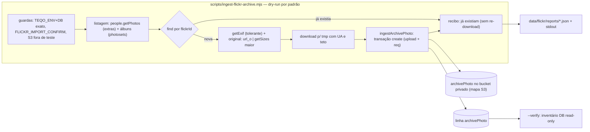

# Impl: C231 — Acervo de fotos do Flickr — ingestão completa

Status: aprovado
Atualizado em: 2026-09-26
Issue: #1366
Intenção: docs/plans/acervo-fotos-flickr-ingestao.md
Appetite restante: herdado (~1 dia eng; o backfill completo é processamento ~2–3 h, não eng) — cortes explícitos: sem UI, sem refresh de metadados, sem paralelismo de download, `--verify` só DB.

## Leitura da intenção

- **Outcome:** as 6.577 fotos originais de `depjorgesolla` + metadados (data, álbuns, título/descrição/tags, geotag, EXIF) vivem no storage privado do Teqo; reexecutar converge sem duplicar e o recibo diz "novas / já existiam / falharam com motivo"; nada é publicado e nada no Flickr é tocado.
- **O que NÃO negociar:** originais (não miniaturas); identidade = id da foto no Flickr; falha nomeada, nunca silenciosa; nenhum arquivo órfão (objeto só sobrevive a rollback com nome determinístico e se autocorrige); dry-run por padrão; escrever no bucket exige confirmação explícita; CLI nunca aponta para DB/bucket de produção fora do runbook; nunca `media` (leitura anônima); sem vídeo, sem segundo cadastro de pessoa, sem curadoria/publicação (C232/C233/C234).
- **O que reavaliar:** (a) "fora do mapa S3 das collections públicas" significa ENTRAR no mapa privado do plugin — collection nova ausente do mapa cai em disco efêmero em prod; (b) o download precisa de `User-Agent` próprio (o `downloadToFile` atual não envia) — extensão aditiva; (c) metadados por foto não exigem `getInfo`/`getAllContexts`: os `extras` do listing cobrem o aceite e `getSizes` vira fallback; (d) a execução de escrita acontece no homeserver (compose/manutenção), não na mesa, porque o guard recusa DB remoto.

## Abordagem recomendada

**Opções consideradas:** A) espelhar a esteira web-speech/reels — client `.mjs` puro + utilitário Payload transacional em `src/utilities/flickr/` + CLI fino com guardas reusados | B) tudo no script `.mjs` | C) tudo em `src/utilities/`, com o fetch dentro do utilitário e o script como casca
**Recomendação:** A — é o único desenho em que a escrita se testa de verdade em int (Payload real, `teqo_test`, disco local) com seams injetáveis, enquanto API/plano/recibo ficam em unit com `fetch` mockado; reusa `withPayloadTransaction`, `resolveS3StorageEnv`, `downloadToFile` e o padrão de collection de upload privado, sem twin.
**Rejeitadas:** B porque a ingestão Payload/S3 ficaria fora do alcance das suítes (só spawn da CLI); C porque o fetch dentro do utilitário misturaria rede com transação e dificultaria a canary (`--limit`) — aqui o volume de 6,5k pede API isolada, pacing e retomada.

### Decisões de engenharia

**1. Collection de destino**

- Opções: A) `archivePhoto`/`ArchivePhoto` (slug em `src/lib/archivePhoto.ts`, utilitários em `src/utilities/flickr/`, grupo admin `Comunicação`, leitura `communicator`+) | B) `flickrPhoto` | C) estender `media` com gate.
- Recomendação: A — é o acervo, e a origem é metadado (`sourceUrl`/`owner`), não identidade; C232 adiciona curadoria na MESMA collection (o plano C232 declara "shape fica no C231") e C233/C234 leem `archivePhoto` sem rename; a subpasta `src/utilities/flickr/` respeita o pin de top-level de `src/utilities/`.
- Rejeitadas: B porque amarra curadoria e publicação ao nome da fonte e um rename futuro custaria migração + todos os consumidores; C porque `media` é leitura anônima por contrato (site público) — acervo bruto ali vazaria tudo.
- Metadados estruturados × json: estruturado para o que C232/C233 filtram (`title`, `description`, `tags`, `takenAt`, `albums`, `geo`); `exif` fica `json` cru (matéria-prima, não consulta). Rejeitado: um `rawFlickr` jsonb único (nada consultável; o que faltar entra por migração do dono C232, e o Flickr segue vivo como fonte).

**2. Fronteira script × utilitário**

- Opções: A) `scripts/lib/flickrApi.mjs` (HTTP) + `scripts/lib/flickrPlan.mjs` (plano/recibo puros) + `src/utilities/flickr/archivePhotoIngest.ts` (Payload/S3 transacional) + `scripts/ingest-flickr-archive.mjs` (orquestração), com mapeamento puro em `src/lib/archivePhoto.ts` | B) tudo em `scripts/` | C) tudo em `src/utilities/flickr/`.
- Recomendação: A — unit testa client (fetch injetado) e mapeamento puro; int testa a escrita contra Payload real com arquivo local; a CLI fica spawn-pinada nos guardas. Os dois `.mjs` novos entram em `SCRIPTS_SPEC_PINNED` (o invariante de `ciSkipInvariants` recomputa o closure e falha se faltar).
- Rejeitadas: B e C porque perdem uma das duas pontas de teste (rede isolada / Payload real) ou misturam as camadas.

**3. Chave de idempotência + nome do arquivo**

- Opções: A) `flickrId` text unique+index; nome determinístico `flickr-<flickrId>.<ext>` + `overwriteExistingFiles: true`; find ANTES de metadados/download | B) create com unique e catch | C) nome/slug derivado do título.
- Recomendação: A — o find-first (dry-run e apply) evita re-download e re-chamada de API para o que já existe ("já existiam" honesto) e é o modo de retomada (reexecutar é o retry dos que falharam); o nome determinístico faz a reexecução sobrescrever a MESMA chave (órfão só em rollback, aceito e autocorrigido) e o unique é a rede de segurança contra corrida.
- Rejeitadas: B porque baixa e chama a API antes de saber que já existe, e usa exceção como fluxo; C porque instabilidade/colisões geram sufixos do Payload e quebram a idempotência do objeto.
- `ext` deriva da URL do original (`url_o`/`getSizes`); sem extensão confiável → `.jpg` documentado. Filename original do Flickr (`<id>_<secret>_o.jpg`) rejeitado (carrega secret e varia entre tamanhos).

**4. Fluxo da API do Flickr**

- Opções: A) `flickr.people.getPhotos` (per_page=500, paginado, extras `description,date_taken,date_upload,license,owner_name,tags,geo,media,url_o,path_alias`) para o acervo por foto; álbuns via `flickr.photosets.getList` + `photosets.getPhotos` (mapa foto→álbuns montado no plano, ANTES de escrever); `flickr.photos.getExif` por foto (tolerante); `flickr.photos.getSizes` só como fallback do original | B) `getInfo` + `getAllContexts` + `getSizes` por foto | C) OAuth do dono / scraping.
- Recomendação: A — o listing com extras cobre todo o aceite de metadados (1 listagem em vez de 3 chamadas por foto); `getExif` é a única chamada por foto e é "quando houver"; vídeos (`media=video`) são pulados e CONTADOS no recibo; falha de álbum aborta o plano antes de qualquer escrita (metadado incompleto não vira linha); `api_key` por query (conta própria, escopo público), `User-Agent` próprio, `AbortSignal.timeout`, retry com backoff só em transitório (erros Flickr `stat=fail` nomeados por código/mensagem), pacing sequencial ~1 req/s (limite documentado 3600/h → backfill de EXIF ~2 h) e `--limit`/`--page` para canary.
- Rejeitadas: B porque triplica chamadas e `getAllContexts` é 1 chamada por foto (~6,5k) só para álbuns; C porque scraping é proibido pelo padrão e OAuth é desnecessário para leitura pública da própria conta (nada se escreve no Flickr).
- Fallback nomeado do original: `url_o` → maior size de `getSizes` → falha `original` no recibo; a escolha (`url_o` | `largest`) viaja no recibo.

**5. Recibo/inventário**

- Opções: A) JSON datado em `data/flickr/reports/flickr-<stamp>.json` (gitignored, padrão `data/falas-web/reports/`) + stdout; `--verify` read-only inventaria o DB | B) `var/reports/` | C) só stdout.
- Recomendação: A — mesmo regime dos imports existentes (relatório datado + linhas humanas): `runAt`, modo, alvo (sem segredo), `apiTotal`, novas/já existiam/falharam com estágio+motivo, bytes, duração, contagem por álbum, lacunas de EXIF e escolhas de original; `--verify` conta linhas, bytes, por álbum e cobertura de metadados sem tocar no Flickr — é o "responde sozinho sem abrir o Flickr" do aceite.
- Rejeitadas: C porque o aceite pede conferência posterior; B porque `data/` é o diretório canônico de cache/relatórios de script (gitignore + hábito).
- HEAD por objeto/listagem do bucket fica fora: falha de upload já falha a transação e vira linha de recibo, e o guard de S3 protege prod; gatilho de revisita: 404 em C233 → `--verify-bucket`.

**6. Guardas**

- Opções: A) `--apply` exige `FLICKR_IMPORT_CONFIRM=1` + alvo exato por `TEQO_ENV` (`teqo_staging`/`teqo_1313`; `ALLOW_REMOTE_DB` recusado; em teste só `teqo*_test`) + S3 completo fora de teste; dry-run é o default | B) `assertWriteConfirm` + `assertLocalDatabase` (host/`NODE_ENV`) | C) os dois.
- Recomendação: A — é o único que separa staging de produção pelo nome do banco (o proxy socat reescreve o host e `NODE_ENV=production` vale para os dois) e recusa escrita remota de mesa, exatamente o "nunca fora do runbook". O guard já existe em `scripts/lib/reel-ingest.mjs`; extrair para o dono do esqueleto CLI (`scripts/lib/cli.mjs`) como `assertEnvironmentDatabaseTarget` + `TEQO_ENV_DATABASE_BY_ENV` e fazer `reel-ingest.mjs` delegar (export e comportamento intactos → o unit pin do C195 continua verde), em vez de um gêmeo para fotos.
- Rejeitadas: B porque não distingue staging/produção e admite `ALLOW_REMOTE_DB`; C porque duplica guardas com cerimônia (dois erros para o mesmo alvo).
- `FLICKR_API_KEY`/`FLICKR_USER_ID` (NSID) lidos direto de `process.env` com erro manual limpo (precedente `camaraFetch.mjs`), documentados no `.env.example`; nunca no repo. Chave ausente falha antes de qualquer chamada. Runbook: o do homeserver (`docs/ops/teqo-1313-deploy.md`, padrão `reels:ingest` no container de manutenção, com o env file do stack).

**7. Migration**

- Opções: A) `pnpm migrate:create add_archive_photo`; campos estruturados; `flickrId` unique+index; sem índices de busca extras | B) jsonb "raw" | C) sem migration (`push`).
- Recomendação: A — `push: false` em todo ambiente; os índices de busca de C232/C233 são decisão do dono delas (migração aditiva barata); o único índice agora é o da identidade.
- Rejeitadas: C viola o contrato do repo (prod aplica só migração commitada); B adiada pela decisão 1.
- A mudança é área de risco alto no CI (`src/collections/`, `src/migrations/`) → o PR roda o conjunto curado de e2e (OPS86); registrar como risco, não como parada.

**8. Testes**

- Opções: A) unit (client com fetch injetado, mapeamento puro, spawn da CLI nos guardas) + int (ingestão real em Payload `teqo_test`, storage em disco, idempotência e access) | B) só int | C) e2e.
- Recomendação: A — a rede real do Flickr NUNCA entra na suíte (unit/CLI usam payloads canônicos e `fetchImpl`); int usa fixture JPEG real e arquivo local, cobrindo `created`/`existing`/falha e as negativas de access (anônimo e leader não leem; comunicação lê com `overrideAccess: false`).
- Rejeitadas: C porque não há UI nesta fatia; B porque guardas e client ficariam sem pin.

**9. Fases e tracer**

- Opções: A) tracer cedo — schema + ingestão de 1 foto (int) antes de qualquer lote; canary de 5 no alvo; backfill completo; `--verify` | B) implementar o CLI inteiro e só provar no lote completo | C) script-prova em disco e schema depois.
- Recomendação: A — o erro barato aparece no primeiro item (migração, mapa S3, nome determinístico); o lote de 6,5k só roda com o caminho já verde, canary primeiro.
- Rejeitadas: B porque o primeiro erro apareceria horas depois, no alvo; C porque adia as decisões caras (collection/mapa S3) para o fim e joga fora a prova.

### Componentes / mudanças

- **`ArchivePhoto`** (`src/collections/ArchivePhoto.ts`): collection de upload privado (`upload: true`), slug `ARCHIVE_PHOTO_SLUG` (`src/lib/archivePhoto.ts`, padrão `ContentMedia`/`InternetSpeechMedia`); labels pt-BR; `admin.group: 'Comunicação'`; campos: `flickrId` (text, required, unique+index, readOnly), `sourceUrl` (text), `owner` (text, NSID), `license` (text, id Flickr), `title` (text), `description` (textarea), `tags` (array `{ name }`), `takenAt` (text wall-clock `YYYY-MM-DD HH:MM:SS`, sem TZ — precedente `speechAt`), `postedAt` (text ISO UTC), `albums` (array `{ albumId, title }`), `geo` (group `latitude`/`longitude` number opcionais), `exif` (json), `alt` (text required; o ingest preenche do título ou de fallback determinístico; C232 refina). Reusa o padrão de mídia privada; NÃO usa `media`.
- **`archivePhoto`** (`src/lib/archivePhoto.ts`): slug, tipos do contrato (`ArchivePhotoImport`, `ArchivePhotoAlbum`), helpers puros `archivePhotoStorageFilename`, `archivePhotoAlt`, `archivePhotoSourceUrl`, `postedAtIso`, mapping do item de listing/álbuns/exif → `ArchivePhotoImport` (unit-pinado).
- **`archivePhotos` access** (`src/utilities/access/archivePhotos.ts` + re-export em `src/utilities/campaignAccess.ts`): `canReadArchivePhoto` (predicado próprio derivado de `canReadCommunicationCatalog` — precedente `reels`/`speeches`) e `payloadAdminOnly` para create/update/delete; fail-closed para anônimo e leader.
- **`archivePhotoIngest`** (`src/utilities/flickr/archivePhotoIngest.ts`): `findArchivePhotoByFlickrId` (depth 0, `overrideAccess: true` documentado — CLI sem sessão) e `ingestArchivePhoto(payload, record, { filePath })` — re-checa existência, `withPayloadTransaction` com `req`, `payload.create({ collection: 'archivePhoto', data, filePath, overwriteExistingFiles: true, overrideAccess: true })`, retorna `{ status: 'created'|'existing'|'failed', stage, error, bytes }`. Subpasta de domínio (top-level de `src/utilities/` é pinado).
- **`flickrApi`** (`scripts/lib/flickrApi.mjs`): `fetch` nativo (`AbortSignal.timeout` + `User-Agent` próprio, `fetchImpl` injetável); `people.getPhotos`, `photosets.getList`, `photosets.getPhotos`, `getExif`, `getSizes`; paginação até `total`; pacing sequencial configurável (default ~1 req/s) e retry com backoff só em transitório; erro Flickr nomeado (`stat != ok` → código/mensagem); vídeos retornados para o plano pular. Entra em `SCRIPTS_SPEC_PINNED`.
- **`flickrPlan`** (`scripts/lib/flickrPlan.mjs`): plano (remoto × `findArchivePhotoByFlickrId` → novo/existente), mapa de álbuns, agregação e formatação do recibo (linhas stdout + JSON), stamp próprio. Entra em `SCRIPTS_SPEC_PINNED`.
- **`ingest-flickr-archive`** (`scripts/ingest-flickr-archive.mjs` + script `pnpm flickr:import` no `package.json`): modos `plan` (default/dry-run), `--apply`, `--verify` (mutuamente exclusivos); `--limit`, `--page`, `--out`; guardas; loop por foto (find → getExif tolerante → original → download com teto → ingest → tmp limpo em `finally`); recibo; exit 1 só quando nada entrou ou falha fatal (falha por foto fica no recibo) e exit 1 em `--verify` com lacuna.
- **`cli.mjs`** (`scripts/lib/cli.mjs`, edição): `assertEnvironmentDatabaseTarget` + `TEQO_ENV_DATABASE_BY_ENV`, extraídos de `reel-ingest.mjs`, que passa a delegar (comportamento e exports atuais intactos; sem extrair o stamp — DRY abaixo de 3 call sites).
- **`downloadToFile`** (`src/utilities/media/downloadToFile.ts`, edição aditiva): opção `headers?: HeadersInit` para o UA do Flickr; default e chamadas atuais intactos.
- **Migration:** `add_archive_photo` (gerar com `pnpm migrate:create add_archive_photo` — DB local corrente antes; revisar o SQL; commitar `.ts`+`.json`+`index.ts`; `pnpm migrate` e `pnpm generate:types` locais).
- **`payload.config.ts`** (edição): `ArchivePhoto` na lista de collections + entrada `[ARCHIVE_PHOTO_SLUG]: true` no mapa S3 do plugin (sem ela, disco efêmero em prod).
- **`.env.example`** (edição): `FLICKR_API_KEY=`/`FLICKR_USER_ID=` (NSID de `depjorgesolla`) com comentário de runbook (só env, nunca repo). **`.gitignore`** (edição): `/archivePhoto` (storage local de dev/test) e `/data/flickr/` (cache/relatórios).
- **Entrega:** entrada em `docs/changelog/2026-09-26-c231.md` + este `docs/plans/acervo-fotos-flickr-ingestao-impl.md` no mesmo PR.
- **Access / Consent:** sem `Consent` novo (não há opt-in nem PII de titular nesta fatia; a remoção a pedido é C233) e sem `Contact`; leitura fail-closed pelo predicado do domínio.
- **UI:** Impeccable A — sem UI; nenhum shell/tabela; a ficha admin é gerada pelo Payload.

### Dados → forma

N/A — operação/ingestão; o recibo é arquivo JSON operacional (conferência), não superfície de apresentação. Nenhum agregado, KPI ou painel.

## Fases verificáveis

1. **Tracer / schema** — `src/lib/archivePhoto.ts` (helpers puros + mapper), `ArchivePhoto`, access, migration `add_archive_photo`, mapa S3, `.gitignore`, tipos; int spec insere 1 foto (fixture JPEG + metadados canônicos) via `ingestArchivePhoto` → linha + objeto; unit dos helpers/mapeamento. Verificação: `pnpm migrate`, `pnpm generate:types`, spec int verde. Quota: ~⅓ do appetite.
2. **Client + guardas + dry-run** — `flickrApi.mjs`, `flickrPlan.mjs`, extração do guard, CLI `plan`/`--help`; unit de client/plano e spawn dos guardas (produção sem confirm/S3/TEQO_ENV → recusa antes da rede); `SCRIPTS_SPEC_PINNED` +2. Canary manual com a chave (Q1): `pnpm flickr:import --limit 5` imprime plano e grava recibo sem escrever. Quota: ~⅓.
3. **Apply + recibo + verify** — `--apply` transacional, recibo, `--verify`; int de idempotência/access; canary `FLICKR_IMPORT_CONFIRM=1 pnpm flickr:import --apply --limit 5` no alvo; reexecução mostra "já existiam" e não duplica; backfill completo no homeserver (runbook) e `--verify` (contagem + bytes + álbuns). Quota: ~⅓.
4. **Gates** — `pnpm gate:fast`; `pnpm exec knip`; `pnpm check:cycles`; e2e da superfície (não há UI nova; o CI curado roda por `src/collections/`); `pnpm push` (gate:push com docs-guards).

## Rabbit holes / Não escopo (engenharia)

- Vídeos do photostream: pulados e CONTADOS no recibo (não ingeridos, não falham o run).
- Backfill de metadados em linhas já existentes (`--refresh-metadata`): fora; lacuna de EXIF vira linha nomeada no recibo; gatilho de revisita: C232 precisar de EXIF/GPS para a ficha.
- Paralelismo de download / pool de workers: fora; se o backfill completo for lento demais na prática, reabrir com pool pequeno (metadata continua sequencial).
- Checkpoint próprio em arquivo: o DB é o checkpoint (idempotência por `flickrId`); nada de estado paralelo.
- `--verify` com HEAD por objeto / listagem do bucket: fora; gatilho: 404 em C233.
- Coleção de álbuns/capítulos e renditions (thumbnails via sharp): C233.
- Campos de curadoria/estado de publicação/tags de IA: C232 (mesma collection, migração aditiva).
- `getInfo`/`getAllContexts` por foto, segunda collection doc+media, reuso da `media`: rejeitados nas decisões 4 e 1.
- UI/lista/filtros do acervo, publicação, sitemap, selfie: C232/C233/C234.
- Escrever/editar/apagar qualquer coisa no Flickr (incl. OAuth write): nunca.

## Riscos e mitigação

- **Collection nova fora do mapa S3 (disco efêmero em prod):** entrada explícita no mapa no mesmo PR + guard de S3 no `--apply` fora de teste; revisão do diff. (O int não cobre S3 — `.env.test` usa disco.)
- **Migração em área de risco alto do CI:** SQL revisado, `pnpm migrate` local antes do push, int verde; o PR roda o e2e curado por tocar `src/collections/`/`src/migrations/`.
- **Rate limit/instabilidade da API (3600/h):** pacing ~1 req/s + backoff + retry transitório; auth/permissão falham nomeado e imediato; `--limit`/`--page` para canary; `apiTotal` do listing × coletado no recibo (foto sumida da listagem não passa em silêncio).
- **Original indisponível (`url_o` ausente ou restrito):** fallback `getSizes` maior; se ambos falharem, falha `original` nomeada (sem linha, sem objeto).
- **Capacidade do bucket (Q3):** estimativa pelo canary (bytes médios × 6,5k) antes do lote; contingência por álbum/lotes do plano de intenção se apertar.
- **Run interrompido no meio:** reexecução converge pelo `flickrId` (existentes pulados sem re-download); recibo por execução.
- **Órfão de objeto em rollback:** aceito (bytes fora da transação); nome determinístico + `overwriteExistingFiles` se autocorrige na reexecução; nenhum órfão de linha.
- **Download sem UA (403 do CDN):** extensão aditiva do `downloadToFile` com UA do Flickr, sem mudar o comportamento atual.
- **Egress do homeserver:** confirmar no runbook a saída do container de manutenção para `api.flickr.com` e `live.staticflickr.com` (allowlist/proxy, se houver).
- **`SCRIPTS_SPEC_PINNED` desatualizado:** os dois `.mjs` novos entram no mesmo PR; o invariante falha se faltar (prevenção, não surpresa).
- **Chave de API ainda não provisionada (Q1):** fases 1–2 e toda a suíte fecham sem ela; canary/backfill ficam bloqueados até a chave chegar ao env do alvo (dependência de produto, sem gambiarra no repo).

## Já resolvido no simplify (não reabrir)

- Geo de meia-coordenada (`archivePhotoGeoFrom`) — `numberOrNull` por eixo + casos unit.
- `planArchiveEntries`: existente checado primeiro (nunca re-baixa), mapper como juiz do `url_o` (sem predicado gêmeo).
- 429 retentável no client; falha de API nomeada por estágio (`withStage`); `getLargestSize` ignora dims inválidas.
- `listArchivePhotos` no owner (`src/utilities/flickr/`), `parseArchiveCliArgs` no lib pinado, guard S3 spawn-pinado.
- `licenseOrNull`, bytes baixados sempre somados, `skippedAlbums` no recibo, `--out` por segmentos, `formatArchiveBytes` único, `ARCHIVE_PHOTO_SLUG` no mapa S3, JSDoc transacional do ingest, `main` com `applyEntries`/`reportBase`.

## Adiado com gatilho

- **`--limit` não corta a varredura de álbuns (S2).** O canary capa o processamento, mas `collectArchiveAlbums` percorre todos os álbuns/páginas antes do limite (documentado no `--help`; a decisão 4 exige o mapa foto→álbuns antes da escrita). Gatilho: canary/backfill lento na prática ou pressão de rate limit — reabrir junto do paralelismo de download já deferido (resolver o mapa só para os `flickrId` listados ou cortar a paginação do álbum cedo). Sem ação agora.

## Explicitamente fora

- **Factory dos predicados de leitura da Central (S1).** `canReadArchivePhoto` segue o padrão intencional de predicado próprio por superfície (o comentário "never an alias" em `contentPieces.ts`; cada vertical pode ampliar seu gate sem conceder escrita alheia). Reabrir só se uma ampliação de read precisar valer para todas as verticais de uma vez.
- **Tipagem do bag do recibo (S3)** e **`--out` absoluto (S4).** Doc-only/paridade com o irmão `import-web-speeches.mjs`; tipar se o formatter for tocado de novo; o recibo é arquivo operacional do operador.
- **Drift pré-existente `activity.tags`.** Coluna sobra no banco (a config não a declara; o snapshot de base também não) e é invisível ao diff — fora do escopo. O reparo do snapshot desta entrega (106 tabelas como novo base) elimina a re-geração de DDL alheia nas próximas `migrate:create`.

## Aceite de engenharia

- [ ] Aceite de produto da intenção coberto: originais + metadados no S3 privado; identidade por `flickrId`; novas/já existiam/falharam com motivo; `--verify` responde sem o Flickr; dry-run default; confirmação explícita; nada publicado; nada tocado no Flickr.
- [ ] Invariantes AGENTS/engineering-standards: toda collection com `access` explícito; escrita multi-objeto em transação com `req`; sem cadastro paralelo a `Contact`; `push: false` + migração commitada (`.ts`+`.json`+`index.ts`); mapa S3 privado; identificadores em inglês/copy pt-BR; sem segredo no repo (chave só no env); importMap não commitado.
- [ ] Testes de domínio: unit (client com fetch mockado, mapeamento puro, guardas por spawn) e int (Payload real em `teqo_test`: create/existing/falha; access negado a anônimo/leader e permitido à comunicação); fixtures limpas; rede real do Flickr ausente da suíte.
- [ ] Entrega inclui `docs/plans/acervo-fotos-flickr-ingestao-impl.md` + entrada de changelog; `SCRIPTS_SPEC_PINNED` atualizado.

## Self-score (decision-quality)

1. Decisões caras têm rejeitadas? **Sim** — collection, fronteira, chave/nome, fluxo da API, recibo, guardas, migração, testes e fases, cada uma com A|B|C.
2. Cabe no appetite (~1 dia)? **Sim** — cortes explícitos (sem UI, sem refresh de metadados, sem paralelismo, verify DB-only); o backfill longo é processamento, não eng.
3. Rabbit holes nomeados? **Sim** — vídeo, refresh de metadados, paralelismo, checkpoint, verify de bucket, álbuns/renditions, curadoria.
4. Depth check: reusa owners existentes? **Sim** — `withPayloadTransaction`, `downloadToFile` (extensão aditiva), guard extraído de `reel-ingest` para `cli.mjs` (delegação), `resolveS3StorageEnv`, padrão de upload privado, find por chave natural, relatório datado; nada de segundo engine/pessoa/mídia.
5. Intenção permanece satisfeita sem reescrever o outcome? **Sim** — a engenharia fecha forma (schema, fronteira, guardas), não o aceite.

**Score: 5/5.**
