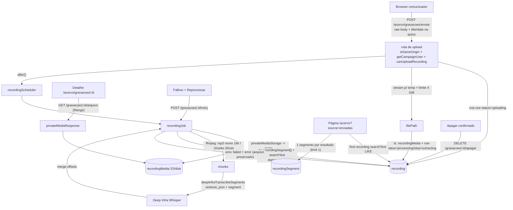

# Impl: Gravações enviadas no acervo de comunicação

Status: aprovado
Atualizado em: 2026-09-18
Issue: #1166
Intenção: docs/plans/acervo-gravacoes-enviadas.md
Appetite restante: herdado (~3–4 dias eng; um outcome verificável — a assessoria sobe uma gravação e ela fica pesquisável com player e transcrição)

## Leitura da intenção

- **Outcome:** a assessoria de comunicação (`communicator`, e `coordinator`/`candidate`) envia um arquivo de vídeo local pelo acervo, acompanha o estado até "Pronto" e passa a achar a fala de **qualquer pessoa** da gravação por busca textual com trecho + timestamps, abrindo o detalhe com player, transcrição clicável e "Baixar"; a gravação é privada (só quem tem o acervo), nunca URL pública, e falha preserva o arquivo com "Reprocessar transcrição".
- **O que NÃO negociar:**
  - `advisor`/`leader` fail-closed em página, collection e rota de mídia (`canReadCommunicationCatalog`, `src/lib/campaignRoles.ts:27-28`).
  - Gravação servida só sob `/campanha` (cookie `campaign-token` path `/campanha`, `src/utilities/campaignAuth.ts:12-13`); `Media.read` público intocado e sem URL pública nova.
  - Nenhum item de nav novo (`src/components/campaign/shell/nav.ts:61-64`; pin em `tests/unit/campaignNav.unit.spec.ts:100-127`) e nenhuma alteração no contrato de URL da lista da Câmara (`q|mode|year|topic|scope|phase|municipality|duration|page`, `src/utilities/speech/speechListUrl.ts:80-90`).
  - Sem segundo cadastro de pessoa, sem `Consent` novo (mídia interna de staff, sem PII), sem diarização (C200), sem corte/clipe, sem publicação, sem score exposto, transcrição somente leitura.
- **O que reavaliar:**
  - "Reusar `Speech`/`SpeechSegment`" é o caminho que a intenção sugere como precedente (C174) — a exploração mostra que o precedente C174 é de **cortes** (OR de ids na mesma busca) e não serve para outra unidade; abaixo a decisão muda para collections próprias.
  - O artefato de UI não cobre apagar, detalhe em estados não-prontos, reprocessar em andamento, erro de limite e paginação — ver §UI.
  - Quem apaga e a data da gravação ficam como decisões assumidas (as recomendações A da intenção) a confirmar no gate.

## Abordagem recomendada

**Opções consideradas:** A | B | C em cada decisão abaixo
**Recomendação:** collections próprias `recording`/`recordingSegment`/`recordingMedia`; serving de mídia privada generalizado para um dono neutro; upload por rota POST com streaming cru; ASR com timestamps por extensão do dono `deepInfraTranscribe` + ffmpeg em chunks; job no padrão `speechCutJob`; alternador por query param `source=enviadas` com contrato da Câmara intocado; busca própria sobre `searchText` trigram + 1 segmento por resultado.

### Decisões de engenharia

**D1 — Modelo de dados.**
`Opções: A) recording + recordingSegment + recordingMedia novas | B) Speech/SpeechSegment com campos novos e discriminador | C) recording nova + SpeechSegment polimórfico (relationTo: ['speech','recording'])`
`Recomendação: A — porque a unidade, o access, os campos e a busca da gravação não são os da Câmara; espelhar a tríade (Speech/SpeechSegment + SpeechCut como precedente de status/job) reaproveita o conhecimento sem acoplar o contrato prod pinado.`

- A: `Recording` com `title`, `recordedAt`, `status/step/error`, `durationSeconds`, `searchText`, `media` (upload), `uploadedBy`; `RecordingSegment` com `recording`, `order`, `startSeconds`, `endSeconds`, `text`, `searchText` (hook derivando, como `SpeechSegment.ts:13-18`); access próprio em `utilities/access/recordings.ts`. Custo: espelha a forma dos segmentos; mitigado reusando os puros (`normalizeForSearch`, `buildHighlightedExcerpt`, `pickMatchingSegment` extraído) e mantendo o loader da Câmara intacto.
- Alternativas rejeitadas:
  - **B** porque `Speech` tem invariantes que a gravação não tem (`sourceKey` único, `speechAt`, `classifiedBy`, `preserveManualFacets` em `Speech.ts:43-57`) e o `upsertSpeechBundle` é declarado o ÚNICO escritor de segmentos/searchText (`speechImport.ts:148-172`); um segundo escritor com outra invariante quebra isso. Pior: toda leitura da Câmara teria de discriminar a fonte — `loadSpeechFilterOptions` (`speechPageData.ts:85-121`), o OR de cortes C174 (`speechListFilters.ts:105-117`), o poster (`speechPosterJob.ts:94`) e a resolução de VOD (`actions/speech.ts:104-116`) — regressão no contrato pinado sem ganho.
  - **C** porque mexe na tabela `speech_segment` (prod, C153) e no seu índice/access pinados, transforma o cascade `deleteSpeechSegments` (`Speech.ts:60-69`) em polimorfismo e não gera nenhuma query compartilhada: as duas buscas nunca se cruzam.

**D2 — Mídia privada (serving e armazenamento).**
`Opções: A) recordingMedia nova + generalizar o módulo de serving para um dono neutro | B) reusar a collection reelMedia | C) renomear/absorver reelMedia numa collection genérica com migração`
`Recomendação: A — o dono do serving é o módulo, não a rota; reelMediaResponse.ts já é genérico no que importa (recebe {filename, filesize, mimeType} + staticDir e monta Response com Range) e só está mal endereçado/nomeado para reels.`

- A: mover a mecânica para `src/utilities/privateMedia/privateMediaResponse.ts` (**um** módulo dono: cliente S3 cacheado via `resolveS3StorageEnv` fail-closed + fallback disco com guard de path + `buildPrivateMediaResponse` 404/206/416 com Range via `getRangeRequestInfo`, extraído de `reelMediaResponse.ts:32-173` + `downloadPrivateMediaToFile` para o job) e `src/lib/privateMedia.ts` (puro; renomeia `lib/reelMedia.ts:8-66`). A rota C193 (`reels/[id]/media/[kind]/route.ts:60-65`) passa a consumir o dono neutro (mudança mecânica; os testes C193 são a rede). O job de transcrição reusa o mesmo módulo para baixar os bytes (nada de segundo cliente S3).
- Alternativas rejeitadas:
  - **B** porque `reelMedia` é o artefato do reel (labels, `admin.description`, relação 1:1 com `Reel`); guardar vídeo de gravação ali faz o modelo mentir e cria acoplamento de domínio.
  - **C** porque renomear tabela em prod (C193 já mergeado/deployável) quebra rota, tipos e testes por zero produto; o compartilhado é só o predicado de acesso.

**D3 — Upload grande.**
`Opções: A) rota POST sob /campanha com streaming cru para temp + payload.create(filePath) | B) criar row via JSON e subir o binário num PUT | C) clientUploads do plugin S3 | D) server action com bodySizeLimit maior`
`Recomendação: A — rota handler não tem o default de 1 MB das server actions nem o buffer obrigatório do FormData; o corpo cru dispensa parser/dep nova (verificado: não há busboy/formidable/multer em package.json) e o XHR dá upload.onprogress real; o plugin S3 consome filePath/tempFilePath com fs.createReadStream + @aws-sdk/lib-storage, então um arquivo de horas nunca vira Buffer JS.`

- A: `POST /campanha/comunicacao/acervo/gravacoes/enviar?title&recordedAt&filename`; ordem fail-closed: `isSameOriginRequest` (rota crua não usa o wrapper; entra na allowlist dos conventions — precedente `ai-transcribe`, `tests/unit/codebaseConventions.unit.spec.ts:217-220`) → `getCampaignUser` + `canUploadRecording` → zod (`src/lib/schemas/recording.ts`) → `Content-Length` ≤ limite → cria row `uploading` → stream com contador de bytes (`RECORDING_MAX_BYTES = 4 GiB`, decisão de implementação do valor que a intenção delegou) → temp em `mkdtemp` → transação `recordingMedia` (`payload.create({ filePath, user, overrideAccess: false })`) + row `processing/extracting` → `startRecordingJobInBackground` → limpa temp no `finally`. Falha de stream/DB: apaga a row `uploading` (não há arquivo preservado; "Enviando" não vira "Falhou" fantasma) e devolve mensagem mapeada (`campaignJsonMutationErrorResponse`). MIME: aceita vazio ou `video/*` (`.mkv` costuma vir sem type); o content-type servido é sanitizado pelo módulo puro.
- Alternativas rejeitadas:
  - **B** porque duas idas ao servidor e um PUT fora das varreduras POST/DELETE dos conventions (`codebaseConventions.unit.spec.ts:227-261`) não compram nada: a validação de metadados é a mesma via zod, e a interrupção precisa do mesmo reaper.
  - **C** já rejeitada no C193: `signedDownloads` aponta para `host.docker.internal:3900`, inalcançável do browser (`docs/plans/reels-reel-privado-impl.md:49`).
  - **D** porque `bodySizeLimit` só levanta o teto do buffer; a action continuaria bufferizando o arquivo inteiro (precedentes que bufferizam: `actions/demand.ts:236-240`, `actions/profile.ts:40-50`).

**D4 — ASR com timestamps para horas.**
`Opções: A) reusar deepInfraTranscribe (sem timestamps) | B) estender o dono com verbose_json + segment e transcrever em chunks de áudio extraído por ffmpeg | C) uma requisição para o arquivo inteiro | D) diarizar por pessoa`
`Recomendação: B — A não entrega o requisito (timestamps por segmento); C não sobrevive a horas de arquivo (limite de tamanho/processamento do provedor); D é C200.`

- B: `src/utilities/ai/deepInfraTranscribe.ts` (dono do provider) ganha `deepInfraTranscribeSegments(file, { timeoutMs })` com `response_format=verbose_json` + `timestamp_granularities[]=segment` e timeout de 600 s — o padrão já validado pelo CLI (`scripts/lib/camaraFetch.mjs:226-250`) — e a normalização da resposta (`segments` OpenAI / `chunks` whisper) portada de `scripts/lib/camaraSpeeches.mjs:311-339`. A rota de voz (`ai-transcribe/route.ts`) fica intocada.
- Job: baixa o objeto privado para temp pelo módulo do D2; extrai e divide numa passada de ffmpeg — `-vn -ac 1 -ar 16000 -c:a libmp3lame -b:a 32k -f segment -segment_time 1200 -reset_timestamps 1` (chunks de 20 min ≈ 4,8 MB, folga sobre o limite ~25 MB do endpoint); posta cada chunk (Buffer sequencial) e mescla com `offset = índice * 1200`, clampando o fim pela duração que a resposta traz; `durationSeconds` = soma das durações dos chunks (o áudio é a evidência; sem `ffprobe` no runtime — só `ffmpeg` na imagem, `Dockerfile:69-72`). Puros em `src/lib/recordingTranscription.ts` (offset/merge/searchText) unit-testados. Falha do provider marca `failed` com o arquivo preservado.
- O `runFfmpeg` sai de `speech/speechMediaPipeline.ts:73-98` para `src/utilities/media/ffmpeg.ts` com um `timeoutMs` opcional (a duração é desconhecida antes da extração e o clamp atual de 300 s em `speechMediaPipeline.ts:79-82` é apertado para um vídeo de horas); os jobs da Câmara mantêm os defaults. `downloadSource` (específico da Câmara) fica onde está.

**D5 — Job e status.**
`Opções: A) padrão speechCutJob (after() + row com status/step/error + reaper preguiçoso + heartbeat) | B) fila/worker | C) processar dentro da requisição de upload`
`Recomendação: A — é o mecanismo já estabelecido e testado na casa; B é o rabbit hole "fila/infra" que a intenção cortou; C estoura o request e apaga o desenho de estados.`

- A: `status: uploading | processing | ready | failed` e `step: extracting | transcribing | saving` vivem na `recording` (forma de `SpeechCut.ts:114-135`); a transição é `route → processing/extracting`, `job: extracting → transcribing → saving → ready`, `catch → failed + error`, `retry: failed → processing`, `reaper: processing estagnado → failed`. Agendador `after()` (`speechCutScheduler.ts:15-19`); o job atualiza o step a cada chunk (o `updatedAt` vira heartbeat) e o reaper usa janela de 60 min (`RECORDING_STALE_MS`; maior que os 15 min do corte, `speechCutJob.ts:37`, porque uma chamada de chunk pode durar minutos), disparado pela rota de status do poll. A UI mostra só os quatro estados do artefato; `step`/`error` são internos/ops.

**D6 — Alternador e URL.**
`Opções: A) mesmo /campanha/comunicacao/acervo com ?source=enviadas, resolvido por um módulo de URL próprio sobre o resolveListUrl compartilhado | B) inserir source no state/serializer de speechListUrl | C) rota de lista separada /acervo/gravacoes`
`Recomendação: A — mantém a superfície que a intenção fixou ("no mesmo /campanha/comunicacao/acervo via alternador", acervo-gravacoes-enviadas.md:61) e deixa o contrato congelado da Câmara intocado: como source não entra em speechListParamNames (speechListUrl.ts:80-90), um source perdido na branch da Câmara continua "não suportado" e canonicaliza para /acervo pelo resolveListUrl (campaignListUrl.ts:134-141) — exatamente o saneamento desejado, sem risco de regressão.`

- Literais: param `source`; valores `camara` (default; nunca serializado) e `enviadas` (serializado) — mesmos `data-source-tab` do artefato; detalhe em `/campanha/comunicacao/acervo/gravacoes/[id]`; arquivo em `.../gravacoes/[id]/arquivo` (`?download=1`), retry `.../gravacoes/[id]/retry`, apagar `.../gravacoes/[id]/apagar`, status `.../gravacoes/status`, envio `.../gravacoes/enviar`. `GET /acervo/gravacoes` (sem id) redireciona para `/acervo?source=enviadas` (alias canônico; evita a ambiguidade do segmento estático sem page sombreando `[id]`).
- Chrome: entrada nova no catálogo (`gravacoes: { title: 'Gravações enviadas' }`) e regra específica para `/campanha/comunicacao/acervo/gravacoes` **antes** da genérica `^/campanha/comunicacao/acervo/[^/]+$` (`campaignPageChrome.ts:297`), com o comentário da lição C194 (precedente `cortes`, `campaignPageChrome.ts:291-295`); o detalhe (`/gravacoes/<id>`) não casa a genérica e a página fixa `SetCampaignPageChrome` ("Gravação enviada" / "Acervo", Cena 3). O subtítulo do catálogo `acervo` passa à frase do artefato ("Busque nas falas da Câmara ou nas gravações da equipe."), atualizando o pin de `tests/unit/campaignPageChrome.unit.spec.ts:65-68`.
- Alternativas rejeitadas: **B** porque alarga um contrato pinado e enfia `source` no `SpeechListState` que o omnibox consome (`speechOmnibox.ts:17-27`) sem ganho; **C** porque contraria a intenção (o alternador vira rota) e parte a URL canônica do acervo.

**D7 — Busca da fonte nova.**
`Opções: A) searchText próprio (trigram) + 1 segmento por resultado para excerpt/timestamp | B) reusar buildSpeechListWhere | C) merge das duas fontes numa lista/consulta`
`Recomendação: A — a unidade do resultado é a gravação e não há facetas/keywords/tema/cortes; B obrigaria a forkar uma função tipada a SpeechListState com branches sem sentido para gravação (speechListFilters.ts:34-86); C é o rabbit hole "merge unificado" que a intenção cortou.`

- A: `where = { searchText: { like: normalizeForSearch(q) } }` (`normalizeForSearch` é o dono, `lib/speechSearch.ts:9-15`); `payload.find` com `select` mínimo + `overrideAccess:false,user`, `sort '-createdAt'`, page size 25; com `q`, **uma** query de segmento por resultado (`{ recording: equals, searchText: like }`, `sort 'order'`, `limit 1`, em paralelo, teto = page size) para excerpt + `startSeconds` — sem carregar todos os segmentos de gravações de horas (o `loadSegmentsForSpeeches` da Câmara carrega a página inteira porque falas duram minutos; aqui não serve). Se o LIKE casar só na concatenação entre segmentos, cai no fallback por termos — `pickMatchingSegment` sai de `speechViewModels.ts:183-196` para `lib/speechHighlight.ts` (puro, já dono de `matchesSearchTerms`) e é reusado. `watchHref = /acervo/gravacoes/<id>?t=<s>&q=<q>` (contrato de `buildWatchHref`, `speechViewModels.ts:233-251`); excerpt renderizado com o `SpeechHighlightParts` existente; nenhum score exposto.

## Componentes / mudanças

- **`Recording`** (`src/collections/Recording.ts`, novo): slug `recording`; labels `Gravação`/`Gravações`; `admin.group: 'Comunicação'`; `useAsTitle: 'title'`; access `create/update = canUploadRecording`, `read = canReadRecording`, `delete = canDeleteRecording`; hook `stampCampaignCreatedBy`; campos `title` (maxLength), `recordedAt` (date, index, opcional — fallback de exibição no upload), `status` (select, index, default `uploading`), `step` (select, readOnly), `media` (upload → `recordingMedia`, readOnly), `durationSeconds`, `searchText` (textarea readOnly), `error` (textarea readOnly), `systemStampedActorField`.
- **`RecordingSegment`** (`src/collections/RecordingSegment.ts`, novo): slug `recordingSegment`; `admin.hidden: () => true`; access create/update/delete admin-only, read `canReadRecording`; campos `recording` (rel index), `order`, `startSeconds`, `endSeconds`, `text`, `searchText` com hook de derivação (espelho de `SpeechSegment.ts:13-18`).
- **`RecordingMedia`** (`src/collections/RecordingMedia.ts`, novo): slug `recordingMedia`; upload privado, `alt` obrigatório, access pelo D1/D2; nunca consumido por `/api/media/file`; `admin.group: 'Comunicação'` com descrição de privacidade (forma de `ReelMedia.ts:15-43`).
- **`src/utilities/access/recordings.ts`** (novo): `canReadRecording`, `canUploadRecording`, `canDeleteRecording` (predicados separados, nunca alias — forma de `access/speeches.ts:19-44`); reexport no barrel `campaignAccess.ts`.
- **`src/lib/recording.ts`** (novo): statuses/steps/labels pt-BR, `RECORDING_MAX_BYTES`, MIME aceito, títulos/mensagens de erro compartilhadas com o cliente (client-safe).
- **`src/lib/schemas/recording.ts`** (novo): zod do metadata do upload, retry, delete e status (padrão `lib/schemas/speechCut.ts`).
- **`src/lib/recordingTranscription.ts`** (novo, puro): `mergeChunkTranscriptions` (offset/clamp/dedupe), `recordingSearchText` (concatenação normalizada).
- **`src/lib/privateMedia.ts`** (novo; move `src/lib/reelMedia.ts:8-66`, nomes genéricos).
- **`src/utilities/privateMedia/privateMediaResponse.ts`** (novo; extraído de `src/utilities/reels/reelMediaResponse.ts:32-173`; a rota C193 passa a importar daqui).
- **`src/utilities/media/ffmpeg.ts`** (novo): `runFfmpeg`/`ffmpegBinary`/`messageOf` movidos de `speech/speechMediaPipeline.ts:17-29,73-98`, com `timeoutMs` opcional; `speechMediaPipeline.ts` mantém a API para os jobs da Câmara.
- **`src/utilities/ai/deepInfraTranscribe.ts`** (editar): adicionar `deepInfraTranscribeSegments` (verbose_json + segment, timeout 600 s) e normalização no dono.
- **`src/utilities/recordings/`** (novo): `recordingListUrl.ts` (state `{source,q,page}` sobre `campaignListUrl.resolveListUrl`), `recordingListFilters.ts` (where do D7), `recordingViewModels.ts` (labels, excerpt, hrefs), `recordingPageData.ts` (lista+detalhe), `recordingUpload.ts` (D3), `recordingJob.ts` + `recordingScheduler.ts` + `recordingTranscriptionJob` (D4/D5, puros extraídos).
- **Rotas** (`src/app/(campaign)/campanha/(app)/comunicacao/acervo/`): `gravacoes/enviar/route.ts` (POST cru, allowlist), `gravacoes/[id]/arquivo/route.ts` (GET Range), `gravacoes/[id]/retry/route.ts` (wrapper), `gravacoes/[id]/apagar/route.ts` (DELETE + `isSameOriginRequest`), `gravacoes/status/route.ts` (wrapper), `gravacoes/page.tsx` (redirect alias), `gravacoes/[id]/page.tsx` (detalhe); `page.tsx` do acervo ganha o branch do `source`.
- **Actions** (`src/app/(campaign)/campanha/actions/recording.ts`, novo): `retryRecordingForActor`, `deleteRecordingForActor` (transação segmentos+row; delete do `recordingMedia` pós-commit via `onPayloadTransactionCommit`, `payloadTransaction.ts:37-48`), `getRecordingStatusesForActor` (reaper preguiçoso entre os ids).
- **`payload.config.ts`** (editar): registrar as três collections e `recordingMedia: true` no `s3Storage` (`payload.config.ts:166-172`) — sem isso, prod cai no disco efêmero.
- **Manifest e2e** (`scripts/lib/e2e-affected-manifest.mjs`): prefixos novos (`src/utilities/recordings`, `src/utilities/privateMedia`, `src/utilities/media`, `src/components/campaign/recording`, `src/lib/recording`) na entrada da vertical (linhas 305-317); na entrada de risco `src/utilities/ai` (linhas 49-55, 261-264) somar `campaignSpeechAcervo` a `campaignAiTranscribe`.
- **Conventions** (`tests/unit/codebaseConventions.unit.spec.ts:202-225`): allowlist do POST cru com a razão (streaming de vídeo, cookie + same-origin explícito).
- **Migration:** ver §Migration abaixo.
- **Access / Consent:** `utilities/access/recordings.ts` (sem `Consent` — mídia interna de staff, sem PII; nenhum opt-in nasce aqui).
- **UI:** Impeccable **C** — port do artefato aprovado + os complementos do designer listados em §UI; shells reusados (`CampaignListFooter`, `CampaignListEmptyState`, `CampaignListResults/PendingBoundary`, `CampaignSearchInput`, `AlertDialog`, `Badge`, `Spinner`). Shape→craft→critique→polish no ciclo de UI.

### Dados → forma (se aplicável)

- **N/A por decisão da intenção** (`acervo-gravacoes-enviadas.md:54-56`): resultados de busca não são métrica nem agregado; nenhum score de relevância é exposto como número. Nada a apresentar; nenhuma forma nova.

## UI e veredito do designer

**Coberto pelo artefato (`docs/plans/acervo-gravacoes-enviadas-ui-design.html`) — port mecânico:** alternador de fonte (Cena 1/Cena 6); lista com card de gravação, estado, data·duração, excerpt e "Abrir" (Cena 1); os quatro estados em card — Enviando (inclui barra de progresso), Processando, Falhou com "Reprocessar transcrição", Pronto (Cena 2); detalhe Pronto com player, transcrição clicável, "Baixar" e chrome "Gravação enviada / Acervo" (Cena 3); diálogo de envio com arquivo/título/data (Cena 4); vazio (Cena 5); mobile lista+detalhe (Cena 6). Semântica que o implementador decide sem mudar estrutura: o `role="tablist"` do artefato vira dois `<Link>`s com `aria-current` e o mesmo estilo de pill (navegação, não tab widget); `<input type="date">` nativo no lugar do campo mascarado.

**Falta superfície visual nova — o `designer` precisa estender ANTES do markup:**

1. **Confirmação de apagar** (exigida pela intenção `:66`, ausente do artefato): `AlertDialog` com título/descrição/CTA destrutivo; definir se o gatilho vive só no detalhe ou também nos cards da lista; a copy deve dizer que remove transcrição e arquivo, irreversível (base: `SpeechCutDeleteDialog.tsx`).
2. **Detalhe em estados não-prontos**: `uploading` (sem arquivo), `processing` (player já disponível? aviso de transcrição pendente), `failed` (copy de erro + "Reprocessar transcrição") — o artefato só desenha o detalhe Pronto.
3. **Reprocessar em andamento**: feedback do clique (botão desabilitado/spinner ou a tela trocar para Processando) e onde o erro do retry aparece.
4. **Erro acima do limite** no diálogo: posição/copy do erro inline e o aviso do limite antes do envio (o artefato promete "O limite será informado antes do envio" mas não o renderiza; o valor é "Vídeos até 4 GB").
5. **Progresso/estado do diálogo durante o envio**: a Cena 4 mostra só o formulário preenchido; se a barra da Cena 2 for portada para o diálogo, registrar como composição aprovada; senão desenhar.
6. **Paginação e vazio-da-busca da fonte nova**: reusar `CampaignListFooter` (shell existente) e definir a copy de "nenhuma gravação encontrada para X" (diferente do vazio Cena 5, que é "nenhuma gravação enviada ainda").

**Não é trigger (não inventa estrutura):** fiação de dados/copy no markup aprovado, reuso dos shells, destaque de trecho com `SpeechHighlightParts` (consistência com a lista da Câmara), rótulos de status do `lib/recording.ts`.

## Migration

- Nome sugerido: `pnpm migrate:create add_recording` → revisar o SQL gerado (`recording`, `recording_segment`, `recording_media`, enums `enum_recording_status`/`enum_recording_step`, FKs para `recording_media`/`campaign_user`, colunas em `payload_locked_documents_rels`, índices) e **editar à mão** os dois índices trigram, no padrão idempotente de `src/migrations/20260913_001200_add_speech_segment_trgm_index.ts:9-14`: `recording_search_text_trgm_idx` e `recording_segment_search_text_trgm_idx` (`pg_trgm` já instalado por migração anterior). Forma de referência: `20260918_201009_add_reel.ts`.
- **HARD-STOP de aprovação humana explícita, mesmo em sessão `--auto`, e local-only** (worktree, `pnpm migrate` no banco local; nunca tocar banco remoto/prod e nunca editar migração antiga). **Aprovada na sessão `--auto` (2026-09-18)** para criar/aplicar `add_recording` só no banco local do worktree.

## Invariantes

- Toda Local API em contexto de usuário com `overrideAccess: false` + `user` (leitura de lista/detalhe, media, retry, delete); bypass admin só onde o pipeline é dono do row/arquivo, com comentário justificando (forma de `speechCutJob.ts:42-83`).
- Escrita multi-collection em transação com `req` (`withPayloadTransaction`): finalizar upload (media+row), salvar transcrição (segmentos+row) e apagar (segmentos+row); o delete físico do `recordingMedia` roda pós-commit (`onPayloadTransactionCommit`) e é best-effort.
- Sem `Consent` novo (mídia interna de staff, sem PII); `Media.read` intocado; sem URL pública; `recordingMedia` fora do proxy `/api/media/file`.
- `leader`/`advisor` fail-closed em página (`gate: 'speechCatalog'`), access das collections e rota `/arquivo` (404 silencioso).
- Sem segundo cadastro de pessoa; transcrição somente leitura; nenhum item de nav novo; nenhum módulo top-level novo em `src/utilities/` (subpastas `recordings/`, `privateMedia/`, `media/`); pin de conventions/manifest atendidos.
- Identificadores em inglês; copy/labels em pt-BR; valores de URL em pt-BR onde o repo já usa (`source=enviadas`, `apagar`, `arquivo`, `enviar`; `retry` como no corte).
- "Edit the owner, don't twin": serving generalizado no módulo, `runFfmpeg` extraído, `pickMatchingSegment` movido ao lib; `Speech`/`SpeechSegment`/`Media`/`ReelMedia` intocados.
- `pnpm gate:fast` durante; `pnpm push` como entrega; e2e da superfície antes do push.

## Fases verificáveis

1. **Puro + schema + migration** (~1 dia).
   - `src/lib/recording.ts`, `recordingTranscription.ts`, `privateMedia.ts`, `schemas/recording.ts`; collections + access + barrel; `payload.config.ts`; `pnpm generate:types`.
   - Unit: statuses/limites/labels; merge de chunks (offset, clamp, dedupe, searchText); URL/parse/canonical do `source`; predicates (forma); headers puros movidos.
   - Int: matriz de access das 3 collections (communicator/coordinator/candidate passam; advisor/leader/anônimo negados) e cascade de segmentos.
   - **Migration `add_recording` — HARD-STOP humano, local-only.**
2. **Serving + upload + job** (~1,5 dia).
   - `privateMedia/*` + troca da rota C193 (testes C193 verdes); rota `/arquivo`; upload (`enviar`) + allowlist; `deepInfraTranscribeSegments`; `media/ffmpeg.ts`; job + scheduler + reaper; retry/delete/status + actions.
   - Unit: validação do metadata/limite; parser de Range (movidos); job puro.
   - Int: upload (streaming para disco de teste, falha de tamanho/mime sem row fantasma, transição), job com `FFMPEG_PATH` fake + transcritor injetado (happy path multi-chunk com offsets; falha do provider → `failed` e arquivo preservado; retry reseta; reaper), `/arquivo` (206/416/404 e papéis), delete (segmentos+row+media), retry/status.
3. **UI** (~1 dia, após os complementos do designer).
   - Toggle, lista+busca+footer+vazio, cards de estado, diálogo de envio (client, XHR + progresso), detalhe (player + transcrição clicável), refresher de status, reprocessar, apagar.
   - Unit: view models (labels, excerpt, `watchHref` com `t`), toggle/aria, validação client-side de tamanho.
4. **E2E + gates** (~0,5 dia).
   - Estender `tests/e2e/campaignSpeechAcervo.e2e.spec.ts` (herda o acervo existente): fixture de `recording` `ready` + segmentos + `recordingMedia` pequeno; toggle/`?source=enviadas`; busca com excerpt e `?t=`; detalhe com player/transcrição/Baixar; `/arquivo` 200 para comunicador e 404 para advisor/anônimo; contrato HTTP do upload (cross-origin/limite). Upload+ASR reais ficam no int (declarado).
   - Manifest/conventions; `pnpm gate:fast`; `pnpm test:e2e:affected`; `pnpm push`.

Quota: ~3,5–4 dias eng, dentro do appetite herdado; se apertar, o corte é a fase 3 (UI) para o essencial do artefato antes do polish.

## Rabbit holes / Não escopo (engenharia)

- Fila/worker/pipeline genérico, tempo real, progresso percentual por chunk (intenção cortou).
- Diarização/rotulagem por pessoa (C200); `Contact` nunca entra.
- Transcode, thumb real, normalização, legendas, mux (o placeholder do artefato serve).
- Upload resumível/chunked no browser, retomada de sessão, URLs assinadas S3, `clientUploads`.
- Merge das fontes, entrada no home-search, busca semântica (C192), cortes (C167/C174).
- Edição de transcrição, dossiês, publicação externa, comissões/outras fontes.
- Renomear `ReelMedia`/`Media`, rota pública nova, `Consent` novo, item de nav novo.
- Limpeza de mídia órfã fora do delete da própria gravação.

## Riscos e mitigação

- **Job morto por deploy/restart no meio de horas de transcrição.** Reaper de 60 min + heartbeat por chunk + retry que reprocessa do zero; estados honestos e arquivo preservado.
- **Disco efêmero do container com arquivo de vários GB.** Limite 4 GiB fail-closed (cliente e servidor), limpeza em `finally`, ENOSPC vira `failed` com mensagem mapeada; ops deve garantir headroom do container (nota de deploy).
- **Custo/limite do Deep Infra.** Chunks de 20 min (~4,8 MB, 32 kbps), timeout de 600 s por chunk, concatenação com offsets; falha isolada não publica transcrição parcial (uma transação só no fim).
- **LIKE casando na fronteira entre segmentos.** Fallback de excerpt por termos (`pickMatchingSegment` movido); nenhum resultado sem excerpt quando o `searchText` casou.
- **Chrome genérico engolindo `gravacoes` (lição C194).** Regra específica antes da genérica (`campaignPageChrome.ts:297`) + pin unit; alias `/acervo/gravacoes` redireciona.
- **Regressão do contrato Câmara.** `speechListUrl`/`speechListFilters`/`Speech` intocados; unit existente de URL/omnibox continua sendo o pino; o branch novo tem param set próprio.
- **Vazamento de mídia.** Access por papel em todas as camadas, rota sob `/campanha` com 404 silencioso, sem proxy público; matriz de papéis no int/e2e.
- **S3 não configurado em produção (`recordingMedia: true` esquecido).** Entra no aceite e no checklist do §Migration/config; `resolveS3StorageEnv` fail-closed no boot parcial.
- **e2e não cobre upload/ASR reais.** Decisão registrada: int cobre streaming e job (ffmpeg fake + transcritor injetado); e2e cobre a superfície HTTP/UI com fixture pronta.

## Débitos do /simplify (triage autônoma)

- **Registrado:** gates de upload/retry/delete por `canReadCommunicationCatalog` em vez dos predicados de escrita do dono → **C202** (#1186), `depends: [C199]`, plano `docs/plans/gates-gravacoes-predicados.md` (score 4, expensive_lock; destrava com `pnpm agent:ready` após este merge).
- **Defer (gatilho):** `withSeek` reimplementa o `?t=&q=` de `buildWatchHref` — extrair só quando houver 3º consumidor do deep-link (C200/corte de gravação) ou edição conjunta dos dois view models.
- **Defer (gatilho):** busca da lista com 1 query de segmento por resultado — revisitar se o p95 da busca passar de ~1,5 s ou o catálogo de gravações passar de ~500 (trocar por query única/lateral ou excerpt pré-computado).
- **Defer (gatilho):** job cria `recordingSegment` um a um — revisitar quando um save de gravação de horas passar de ~1–2 min (bulk insert).
- **Defer (gatilho):** reaper só roda em consulta de status/lista/detalhe — revisitar se existir varredura periódica de mídia/auditoria de bucket (D5 manteve sem fila).
- **Defer (gatilho):** headroom de disco/ENOSPC no container com vídeos de horas — conferir no runbook antes do primeiro upload real de horas (risco já mitigado por cap de 4 GiB + cleanup).
- **Descartado:** `privateMediaResponse.ts` fundir storage+serving+download — consolidação deliberada de um dono único para o mesmo I/O privado; reabrir só com 2º consumidor real de storage.

## Aceite de engenharia

- [ ] Aceite de produto da intenção ainda coberto: enviar e acompanhar até Pronto; fonte nova pesquisável sem facetas; fala de qualquer pessoa com trecho+timestamps; detalhe com player/transcrição clicável/Baixar/Reprocessar em Falhou; estados visíveis; falha preserva o arquivo; só os três papéis; sem URL pública.
- [ ] Invariantes AGENTS/engineering-standards: `overrideAccess: false` + `user`; transação multi-collection; sem `Consent`; `Media.read` intocado; leader/advisor fail-closed; sem nav novo; sem top-level novo em `utilities/`; manifest e allowlist de conventions atualizados; migração nova sem editar antigas; `pnpm push`.
- [ ] Testes de domínio previstos (unit/int) onde access/write paths mudam: merges/offset e searchText; access das 3 collections + rota; upload/limite; job (feliz/falha/retry/reaper); serving com Range; delete em cascata.

## Self-score de decision-quality

**4,5/5.** As sete decisões caras têm alternativas honestas e rejeições ancoradas em file:line (contrato pinado da Câmara, `reelMedia` de domínio, endpoint interno do C193, ausência de parser no `package.json`, precedente do job/reaper). A abordagem cabe no appetite (schema→serving/job→UI→e2e, tracer cedo no upload+schema) e reusa shells/helpers/mecanismos existentes. Perde 0,5 porque duas escolhas ficam condicionadas a confirmação humana fora do código: a migração (HARD-STOP declarado) e os complementos visuais do designer (apagar, estados do detalhe, erro de limite, paginação) — sem eles o markup não fecha e o plano não pode fingir que o artefato cobre tudo.
