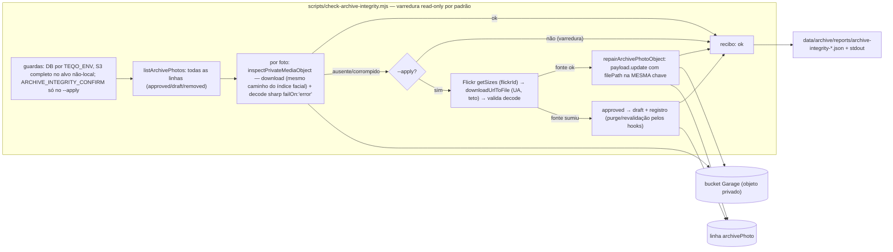

# Impl: C246 — Integridade do acervo no Garage: achar e recuperar as fotos quebradas

Status: aprovado (modo --auto — apresentado no chat sem pausa)
Atualizado em: 2026-10-01
Issue: #1418
Intenção: docs/plans/acervo-integridade-garage.md
Appetite restante: herdado (~0,5–1 dia eng + ops) — cortes explícitos: sem migration, sem UI, sem varredura de `media`/vídeos, sem paralelismo de download do Flickr, varredura com concorrência limitada (`--concurrency`, default 3), reparo só do que a varredura acusar; a execução real em produção é ops (runbook no homeserver), não o agente.

## Leitura da intenção

- **Outcome:** o álbum público nunca serve mídia quebrada — uma varredura read-only de TODAS as fotos acha objeto ausente/corrompido com motivo, a recuperação re-ingere do Flickr pelo `flickrId` sem duplicar linha nem tocar em curadoria, e o recibo diz o que foi varrido, achado, recuperado e falhou (irrecuperável sai do público com registro).
- **O que NÃO negociar:** sem tocar em curadoria (campos curados nunca sobrescritos — régua C231/C232); sem duplicar linha (`flickrId` unique); irrecuperável não pode ficar quebrada no público (D3); fora de escopo `media`/OPS52, vídeos e outras plataformas; read-only por padrão, escrita só com confirm explícito; produção via runbook do homeserver; nada de migration nem de `push`.
- **O que reavaliar:** (a) `sourceUrl` é a **página** do Flickr, não o arquivo (`ArchivePhoto.ts:521-524` "Página no Flickr"; `src/lib/archivePhoto.ts:107-116` monta `/photos/<alias>/<id>/`) — a fonte real de recuperação é `getLargestSize` por `flickrId`, o mesmo fallback documentado da ingestão; (b) "re-ingestão existente" **não cura** linha existente: `ingestArchivePhoto` retorna cedo em `existing` sem tocar no objeto (`archivePhotoIngest.ts:95-103`) — o reparo é função nova no mesmo módulo (D1); (c) "volta ao público pelo fluxo normal" **não exige re-approve**: uma foto `approved` cujo objeto é substituído na MESMA chave volta a servir sozinha, e `draft` segue o `pnpm archive:publish` (D5); (d) o guard de canal de remoção só cobre a entrada em `approved` (`ArchivePhoto.ts:248`) — downgrade `approved → draft` nunca é bloqueado (resolve a dúvida do D3); (e) sem `S3_*` a varredura mede o disco local, não o bucket (D7).

## Abordagem recomendada

**Opções consideradas:** A) CLI nova de varredura + CLI de recuperação com `PutObject` direto (precedente `recover-media.mjs`) | B) estender `ingestArchivePhoto` para "curar" o `existing` | C) uma CLI nova (`archive:integrity`) cuja varredura reusa o caminho de leitura do índice facial e cujo reparo reusa o dono da escrita do upload (`payload.update` com `filePath`), com função nova no módulo de ingestão.
**Recomendação:** C — é o único desenho em que a varredura mede exatamente o que o índice facial e o proxy público medem (download real, com a validação de checksum do SDK e o decode do sharp), o reparo passa pelo dono da escrita de arquivo da collection (hooks de revalidação/purge preservados, metadados coerentes) e nada é duplicado entre `media` e `archivePhoto`; a rede do Flickr fica isolada no client já existente (`flickrApi.mjs`) e a escrita Payload fica testável em int.
**Rejeitadas:** A porque faria a CLI um segundo dono da escrita de objeto do `archivePhoto` (client S3 próprio) e pularia os hooks do ciclo de vida — o `PutObject` direto do `recover-media` existe porque lá o problema é DB-intocável, o que não é o caso; B porque mudaria o contrato de idempotência do `existing` (re-executar nunca re-baixa) e misturaria reparo com ingestão.

### Decisões de engenharia

**D1 — Onde vive a recuperação**

- Opções: A) CLI dedicada com `PutObject` direto (precedente `recover-media.mjs:235`) | B) estender `ingestArchivePhoto` para curar o `existing` | C) `payload.update({ id, filePath, overwriteExistingFiles: true })` orquestrado pela CLI, com `repairArchivePhotoObject` no módulo de ingestão.
- Recomendação: C — o `payload.update` da Local API aceita `filePath` e `overwriteExistingFiles`; com o basename do temp fixado em `row.filename`, o nome/chave não mudam (`generateFileData` só renomeia quando `!overwriteExistingFiles`) e o objeto é sobrescrito na mesma chave; os hooks seguem donos da revalidação (`ArchivePhoto.ts:276`) e do purge de descritores (`:292`); `filesize`/dimensões ficam coerentes com o objeto; nenhum segundo escritor de objeto para `archivePhoto`. A função entra em `src/utilities/flickr/archivePhotoIngest.ts`, irmã de `updateArchivePhotoExif` (precedente de escrita de manutenção no mesmo módulo).
- Rejeitadas: A porque duplicaria o dono da escrita de objeto e pularia os hooks (e `recover-media` é DB-intocável por natureza, caso diferente); B porque `existing` é contrato de idempotência da ingestão ("reexecutar nunca re-baixa") e reparo não é ingestão — a extensão viraria um modo escondido do C231.

**D2 — Varredura read-only**

- Opções: A) baixar cada objeto pelo caminho do índice facial (`downloadPrivateMediaToFile`) e validar a decodificação com sharp `failOn:'error'` | B) `headObject` + comparação de `x-amz-checksum-crc32` sem baixar | C) amostragem.
- Recomendação: A — o GET real é a fonte da verdade: é exatamente o caminho em que as fotos 80/83 falham (o SDK valida o checksum na resposta) e o mesmo decode que a grade pública roda; um HEAD devolve o metadado armazenado (não o conteúdo recalculado) e não vê corrupção; a amostra de 20 já provou que o achado é raro e escapa. Implementar `inspectPrivateMediaObject({ media, staticDir })` no dono `privateMediaResponse.ts`: reusa `downloadPrivateMediaToFile` para um temp (limpo por foto), força o decode (`sharp({ failOn:'error' }).rotate().resize(...)`), mede bytes e classifica `ok | missing | corrupt` com `stage: 'download' | 'decode'` e motivo; reusa o classificador de ausência existente (exportar o atual `isMissingObject` como `isPrivateMediaMissingError`, uso interno intacto). CLI com `--concurrency` (default 3) e `--limit` (canary).
- Rejeitadas: B porque checksum armazenado não detecta corrupção de conteúdo (o mismatch só aparece no GET) e objeto truncado sem checksum passa; C porque o problema é raro e a amostragem falha no único caso que importa.

**D3 — Fotos irrecuperáveis**

- Opções: A) `draft` + registro no recibo | B) `removed` | C) ficar como está e só reportar.
- Recomendação: A — `payload.update({ publicationStatus: 'draft' })` com `overrideAccess: true` (ator confiável sem sessão, precedente C231/C242); o guard `requireRemovalChannelForApproval` só dispara na transição PARA `approved` (`ArchivePhoto.ts:248`), então o downgrade é permitido mesmo sem canal configurado; os afterChange hooks purgam os descritores (`:292-297`) e revalidam a listagem (`:276`), tirando a foto do público e da busca por selfie. O recibo registra id, flickrId, motivo e status anterior/novo. Linhas `removed` nunca são reparadas nem rebaixadas (takedown continua takedown — C242): a varredura reporta e o reparo registra `skippedRemoved`.
- Rejeitadas: B porque `removed` é takedown de pessoa e um arquivo quebrado não é pedido de remoção — além de esconder a causa; C porque viola o aceite ("nunca ficam quebradas").

**D4 — Recuperação da fonte**

- Opções: A) re-`getSizes` (maior size) pelo `flickrId` via API | B) baixar o `sourceUrl` persistido | C) A com fallback B.
- Recomendação: A — `sourceUrl` é a página humana (fato acima), não o arquivo; o `originalUrl` não é persistido; `getLargestSize` (`scripts/lib/flickrApi.mjs:187-200`) é o mesmo fallback documentado da ingestão (inclui "Original" quando disponível; quando o original é restrito, é exatamente o que foi ingerido). Só as fotos acusadas chamam a API (1 req/foto — rate limit irrelevante); `FLICKR_API_KEY` é exigida só no `--apply`, fail-fast antes de qualquer rede; o download usa `downloadUrlToFile` com `User-Agent` do Flickr e teto de 512 MiB/2 min (constantes do C231). O recibo grava a URL-fonte, bytes e sha256 (proveniência).
- Rejeitadas: B porque baixaria HTML (e scraping é anti-goal); C porque o fallback não existe de verdade — sem size usável, a foto é irrecuperável e segue o D3.

**D5 — Reaprovação pós-recuperação**

- Opções: A) a CLI não toca `publicationStatus` no reparo (approved continua approved; draft segue draft) | B) re-aprovar automaticamente se estava approved antes | C) deixar sempre draft.
- Recomendação: A — a linha nunca foi mutada; só o objeto foi substituído na mesma chave. O gate público é metadado (`approved` + `filename` inalterado, `archivePhotoReads.ts:68`) e a rota de mídia lê a linha fresca e faz stream do objeto (`route.ts:33-72`, `force-dynamic` + `no-store`), então a foto aprovada volta a servir sem nenhuma escrita de status; `draft` permanece `draft` e segue o fluxo normal `pnpm archive:publish` (que exige canal de remoção). O recibo lembra de rodar `pnpm faces:index` — foto cujo índice falhou fica stale (o marcador só é gravado no sucesso, `faceDescriptorIndex.ts:180-252`) e é reprocessada sozinha.
- Rejeitadas: B porque reparo não é ato de curadoria e um re-approve re-dispararia o guard de canal (podendo transformar um reparo em falha); C porque despublicaria fotos boas (viola "voltar ao público pelo fluxo normal").

**D6 — Recibo**

- Opções: A) JSON datado em `data/archive/reports/archive-integrity-<stamp>.json` (varredura) e `...-repair.json` (`--apply`) + resumo humano no stdout, via `scripts/lib/archiveIntegrityPlan.mjs` puro (parse/summarize/format) | B) `data/flickr/reports/` | C) só stdout.
- Recomendação: A — segue o regime do C242 (`data/archive/reports/archive-publish-<stamp>.json`) e o padrão plan-lib (`archivePublishPlan.mjs`), com `writeRepoFile` do esqueleto CLI. Campos: `runAt`, `mode` (`verify|repair`), `target` (sem segredo), `scanned`, `ok`, `missing`, `corrupted[]` (id, flickrId, filename, stage, reason), `recovered[]`, `failed[]`, `unrecoverable[]` (status anterior/novo), `skippedRemoved`, `bytes`, `durationMs`; no reparo, `results[]` por foto (status, stage, sourceUrl, sha256, bytes). Exit codes: varredura sai 1 se `missing+corrupted > 0` (espelha `faces:index --verify`), 0 quando limpa — é o critério de convergência; `--apply` sai 1 se restar `failed` que não virou `unrecoverable` tratado.
- Rejeitadas: B porque o domínio é o acervo, não o Flickr; C porque o aceite pede conferência posterior e a Issue pede recibo anexável.
- **Nota de execução (triage pós-simplify, 2026-10-02):** o shape final do recibo difere do previsto acima em três pontos, sem mudar a decisão: (a) `pending` conta **só** as quebradas `approved` — é o exit 1 da varredura, e quebradas `draft`/`removed` (`draftBroken`/`removedBroken`) são registradas sem bloquear a convergência pós-`--apply`; (b) `scan` ganhou `draftBroken`, `removedScanned` e `removedBroken` (em vez do único `skippedRemoved`), e o rebaixamento de uma foto que já era `draft` é registrado sem `previousStatus`/`newStatus`; (c) o JSON é `{ runAt, mode, target, scan, repair?, results[], repairResults?, durationMs }` — os itens por foto ficam nas arrays e o formatador lê sempre `report.scan`.

**D7 — Guardas de escrita**

- Opções: A) `--apply` exige `ARCHIVE_INTEGRITY_CONFIRM=1` + `assertWriteConfirm` + `assertEnvironmentDatabaseTarget` (TEQO_ENV casando o banco exato) + S3 completo (`mirroredMediaRequired`) + `FLICKR_API_KEY`; a varredura é read-only, mas exige S3 completo quando o alvo não é local | B) reusar `ARCHIVE_PUBLISH_CONFIRM` | C) `assertLocalDatabase` + `ALLOW_REMOTE_DB`.
- Recomendação: A — flag própria porque o write path é outro (reparo de objeto + eventual downgrade) e a intenção de operação é diferente da publicação em lote; mesmo stack do C231/C242 (`assertWriteConfirm` + `assertEnvironmentDatabaseTarget`, que distingue staging/produção pelo nome do banco e recusa `ALLOW_REMOTE_DB`); S3 completo obrigatório no alvo não-local via `mirroredMediaRequired` (sem S3 a varredura/reparo mediriam o disco errado); `FLICKR_API_KEY` fail-fast no `--apply`. Runbook no homeserver (compose maintenance, env do stack), como `flickr:import`/`archive:publish`.
- Rejeitadas: B porque publicar e reparar são intenções distintas (o operador pode ter armado só uma); C porque não separa staging de produção e admite o override remoto que o C195/C231 recusa.

**Migration:** sem migration — nenhum campo, índice ou collection novos. Stop-condition do modo autônomo: se aparecer necessidade de campo novo (ex.: marcador de integridade), parar e sinalizar em vez de criar schema.

### Componentes / mudanças

- **`inspectPrivateMediaObject`** (`src/utilities/privateMedia/privateMediaResponse.ts`, edição): novo export que baixa o objeto pelo caminho do índice facial (`downloadPrivateMediaToFile`), valida decode com sharp `failOn:'error'` e classifica `ok | missing | corrupt` (`stage: 'download' | 'decode'`, motivo, bytes); exporta o classificador de ausência atual como `isPrivateMediaMissingError` (renome do `isMissingObject` privado, uso interno intacto); temp limpo por chamada. Reusa o client S3 module-private e o fallback de disco local (dev/test).
- **`repairArchivePhotoObject`** (`src/utilities/flickr/archivePhotoIngest.ts`, edição): `payload.update({ collection: ARCHIVE_PHOTO_SLUG, id, data: {}, filePath, overwriteExistingFiles: true, overrideAccess: true })`; retorna `{ status: 'repaired' | 'failed', filename, error? }`; nunca envia campos curados nem `publicationStatus`; nome do temp = `row.filename ?? archivePhotoStorageFilename(flickrId, originalUrl)` (determinístico C231).
- **`archiveIntegrityPlan`** (`scripts/lib/archiveIntegrityPlan.mjs`, novo): `parseArchiveIntegrityCliArgs` (`--apply`, `--limit`, `--only`, `--out`, `--help`; modos exclusivos), `archiveIntegrityReportStamp`, `summarizeArchiveIntegrity`, `formatArchiveIntegrityReport`; entra em `SCRIPTS_SPEC_PINNED` (`scripts/lib/test-affected-core.mjs`).
- **`check-archive-integrity`** (`scripts/check-archive-integrity.mjs`, novo + script `"archive:integrity"` no `package.json`): varredura default read-only (`--concurrency`, `--limit`, `--out`) e `--apply` (varredura + reparo com guardas D7); por foto acusada: `client.getLargestSize(flickrId)` → `downloadUrlToFile` (UA/teto C231) → validação decode → `repairArchivePhotoObject`; fonte sumiu → downgrade a draft (D3); `removed` intocado; recibo D6; exit codes D6.
- **`docs/ops/teqo-1313-deploy.md`** (edição): seção C246 com canary, varredura completa, reparo e re-varredura, no serviço `teqo-<env>-migrate` com volume de recibos; lembrete do `curl /api/revalidate?tag=archivePhotos` quando houver downgrade (o write do CLI não revalida o servidor Next vivo).
- **`docs/changelog/2026-10-01-c246.md`** + este impl no mesmo PR.
- **Access / Consent:** nenhuma mudança de access; as chamadas são de ator confiável sem sessão (`overrideAccess: true` documentado, precedente `archivePhotoIngest.ts:43-44`); sem `Consent` novo e sem `Contact` (não há opt-in nem PII de titular nesta fatia). Escritas são single-collection (`payload.update`), sem necessidade de transação multi-collection.
- **UI:** Impeccable A — sem UI; nenhum shell/rota nova; a ficha admin é gerada pelo Payload.

### Dados → forma

- Forma escolhida: recibo JSON operacional (`data/archive/reports/`) + linhas humanas no stdout (contagens e falhas nomeadas), consumido por operador — não há superfície pública.
- Rejeitadas: relatório markdown separado (duplicaria o JSON e criaria segunda fonte de verdade); CSV (ninguém consome); painel/admin (não pedido; fora do appetite).

## Fases verificáveis

1. **Tracer / schema+server — varredura read-only (~40% do appetite):** `inspectPrivateMediaObject` no dono + `archiveIntegrityPlan.mjs` (parser/summarize/format) + modo varredura da CLI + recibo + `SCRIPTS_SPEC_PINNED`. Testes: unit do plan-lib (args, summarize, format) e do classificador; int com fixture real (`ARCHIVE_PHOTO_JPEG_BYTES`): objeto íntegro → `ok`; arquivo corrompido no staticDir → `corrupt` (stage decode); arquivo removido → `missing`; checksum error classificado como `corrupt` (unit do predicado, sem S3). Prova local: ingerir fixture, corromper o arquivo, `pnpm archive:integrity --limit 20` acusa com motivo e sai 1; varredura limpa sai 0.
2. **Recuperação (~30%):** `repairArchivePhotoObject` + modo `--apply` (Flickr `getSizes` + download + validação + update) + guardas D7. Testes: int — reparo substitui os bytes na MESMA chave, `filename` inalterado, `curatedFields`/curadoria/status intactos, `filesize` atualizado; unit — `flickrApi.getLargestSize` já pinado, `--only`/canary e guardas da CLI por spawn (espelho de `archiveCatalogCli.unit.spec.ts`: sem confirm, sem TEQO_ENV, banco ≠ ambiente, S3 incompleto).
3. **Irrecuperáveis + `removed` (~15%):** downgrade `approved → draft` com registro; int — descritores purgados no downgrade, canal de remoção ausente NÃO bloqueia o downgrade, `removed` não é tocado pelo reparo (fica no recibo como `skippedRemoved`); convergência — corromper → reparar → `inspect` volta `ok`.
4. **Gates + docs + ops (~15%):** `pnpm gate:fast`; runbook no `teqo-1313-deploy.md`; changelog; push via `pnpm push`. **Ops (fora do merge):** no homeserver, canário nas fotos 80/83 (`--only 80,83`), checar `/fotos/80/midia` e `/fotos/83/midia` 200, varredura completa (read-only) e `--apply`; anexar os recibos à Issue #1418; re-varredura limpa é o aceite final.

## Rabbit holes / Não escopo (engenharia)

- Não varrer `media` (OPS52), vídeos, gravações ou outras plataformas — só `archivePhoto`.
- Não re-ingerir o acervo inteiro (corte de produto): só o que a varredura acusar.
- Não apagar fotos nem objetos (corte de produto): recuperar primeiro; sair do público só quando a fonte não existir.
- Não adicionar campo/marcador de integridade (sem migration): reexecutar converge por varredura completa, que é a checagem honesta.
- Não mexer em curadoria, não re-aprovar, não publicar lote, não tocar em `removed`.
- Não paralelizar download do Flickr (poucas fotos; client C231 sequencial com retry já basta).
- Não editar migrações existentes nem usar `push`; nenhuma UI/admin nova.
- Não criar `Consent`/`Contact`/cadastro paralelo (não se aplica).

## Riscos e mitigação

- **Checksum/ETag multipart:** ETag de multipart não é MD5 — não usar como hash; a validação é o download real (checksum do SDK quando presente) + decode do sharp (cobre objeto truncado sem checksum). Falso negativo residual aceito e registrado no recibo.
- **Flickr auth/rate-limit:** só as fotos acusadas chamam `getSizes` (1 req/foto); `FLICKR_API_KEY` fail-fast; retry/backoff do client C231; falha de fonte → `unrecoverable` → D3.
- **Objeto curado não pode ser sobrescrito:** `repairArchivePhotoObject` só envia `filePath` (+ `overwriteExistingFiles`), nunca campos curados nem status; `deriveArchivePhotoCatalogIndex` não marca curadoria em escrita sem `req.user` (`ArchivePhoto.ts:175`); int pin de `curatedFields`/status.
- **Drift de filename/chave:** temp com basename = `row.filename` + `overwriteExistingFiles: true` (só renomeia quando `false`); int pin do filename inalterado e do objeto na mesma chave; sem filename, nome determinístico C231. Canário de produção confere as fotos 80/83 antes do lote.
- **S3 config parcial / alvo errado:** `resolveS3StorageEnv` lança em config parcial (`mediaStorage.ts:46`); `mirroredMediaRequired` exige as 4 envs no alvo não-local; sem S3 em dev/test a varredura mede o disco local (documentado; nunca é o caso de produção).
- **Fotos já `approved` sem canal de remoção:** não bloqueiam nada — o guard só cobre a entrada em `approved` e o reparo não re-aprova; se o operador quiser publicar um draft de volta, o fluxo normal exige o canal.
- **Custo de baixar todas as fotos:** ~6.492 objetos na rede local + decode; `--concurrency` (default 3) e `--limit` canary; recibo com bytes/tempo; execução no homeserver evita egress externo.
- **Falsos positivos:** a varredura não escreve nada — um falso positivo custa apenas um reparo redundante (idempotente, re-baixar da fonte é seguro) e fica no recibo com motivo.
- **Cache do servidor vivo após downgrade:** o hook de revalidação roda no processo de manutenção e não alcança o Next vivo (mesmo caveat do `archive:publish`); o runbook manda bustar `tag=archivePhotos` após `--apply` com downgrade; fotos reparadas (approved, filename inalterado) voltam a servir sem bust.
- **Janela scan→reparo:** a foto segue 500 até o reparo; curto e aceitável (o scan é o pre-flight do próprio `--apply`).
- **`payload.update` com `filePath` via plugin S3 em produção:** caminho não coberto por int sem credenciais; mitigado pelo canário `--only 80,83` + verificação pública 200 antes do lote completo.

## Aceite de engenharia

- [ ] Aceite de produto da intenção ainda coberto (varredura de todas as fotos, recuperação sem duplicar/curar, irrecuperável fora do público, reexecução converge, recibo honesto)
- [ ] Invariantes AGENTS/engineering-standards (overrideAccess documentado em CLI sem sessão; sem migration; sem `push`; copy pt-BR / identificadores em inglês; produção só com confirm e via runbook)
- [ ] Testes de domínio previstos: unit (plan-lib, classificador, guardas da CLI por spawn) e int (inspect ok/missing/corrupt; repair preserva filename/curadoria/status; downgrade purga descritores sem canal; `removed` intocado; convergência corromper→reparar→ok)
- [ ] Sem migration / sem campo novo (stop-condition respeitada)
- [ ] `inspectPrivateMediaObject` reusa o caminho do índice facial e classifica `ok | missing | corrupt` com motivo
- [ ] `repairArchivePhotoObject` mantém a chave/filename e não toca curadoria nem `publicationStatus`
- [ ] Varredura read-only não escreve e sai 1 com pendência; `--apply` exige `ARCHIVE_INTEGRITY_CONFIRM`, `TEQO_ENV` exato, S3 completo e `FLICKR_API_KEY`
- [ ] Recibos em `data/archive/reports/` + resumo stdout; runbook C246 no `teqo-1313-deploy.md`; changelog no PR
- [ ] `pnpm gate:fast` verde; push via `pnpm push`

## Débitos deferidos (triage pós-simplify, 2026-10-02)

- **S1 — pipeline de decode com donos múltiplos:** `inspectPrivateMediaObject` (`privateMediaResponse.ts:384-387`) e a prova da fonte do reparo (`archiveIntegrityRepair.mjs:105-108`) duplicam hoje o mesmo proof (`failOn:'error'` + `rotate` + `resize width 1024 withoutEnlargement`); o `prepareFaceImage` (`faceDescriptorIndex.ts:55-60`) é transform vizinho (resize com `height`/`fit` e saída `raw()`), não o mesmo contrato. **Gatilho:** um 4º consumidor do proof de decode ou a necessidade de mudar edge/transform/`failOn` — então extrair um `assertImageDecodes` no dono `privateMediaResponse` e consumir de inspect/repair (não forçar o face index no mesmo helper).
- **S3 — `mapWithConcurrency` no plan-lib de domínio** (`archiveIntegrityPlan.mjs:104`), 1 consumidor (a própria CLI). **Gatilho:** um 2º script precisar de mapa com concorrência limitada — mover para o esqueleto `scripts/lib/cli.mjs` e importar nos dois.
- **S4 — contrato do recibo em JSDoc solto em 3 arquivos** (`archiveIntegrityPlan.mjs`, `archiveIntegrityRepair.mjs`, `check-archive-integrity.mjs`). **Gatilho:** o recibo ganhar um 2º consumidor (parsing por script/painel) ou uma 4ª superfície — então typedef único no plan-lib e referência nos demais.
- **S6 — constantes de download do Flickr duplicadas** (`ingest-flickr-archive.mjs:84-85` do C231 × `archiveIntegrityRepair.mjs:25-26`). **Gatilho:** um 3º consumidor de download do Flickr ou mudança do teto/timeout — mover para o dono do client (`scripts/lib/flickrApi.mjs`) e importar nos dois.
- **S5 — registrado como C249 (depende do C246):** `pnpm archive:publish` aprova todo draft sem olhar o objeto e pode devolver ao público uma foto que o C246 rebaixou por estar quebrada; hoje só o aviso do runbook mitiga. Plano: `docs/plans/acervo-publish-preflight-integridade.md`.

### Já resolvido no /simplify (não reabrir)

- `isFlickrSourceGone` só reconhece códigos 1/2 + HTTP 404 (100/105/401/403/429/5xx/network viram `failed` retryável).
- `pending` conta só `approved`; `draftBroken`/`removedScanned`/`removedBroken` registram sem bloquear; runbook alinhado.
- `process.exit()` movido para depois do `finally` (temp `/tmp/archive-integrity-*` não vaza mais).
- `skipped already-draft` não mente mais `draft → draft` (sem previous/newStatus).
- Formatador sempre usa `report.scan` (fim do fallback com NaN).
- `isPrivateMediaMissingError` narrowado antes do cast.
- Docblock de `archivePhotoIngest` alinhado ao reparo/withdraw.
- Typo `jorgessolla` corrigido no int spec.
- Fila de reparo deriva de `scan.missing`/`scan.corrupted` (fim da regra duplicada de `removed`).

### Descartado

- **S2 — `messageOf` local no script de reparo:** one-liner cuja cópia local é a convenção dos scripts (25+ equivalentes inline) e cujo dono (`src/utilities/media/ffmpeg.ts`) é `import 'server-only'`, não importável do script; sem risco real de divergência.

## Self-score decision-quality

**5/5** — (1) todas as decisões caras foram deliberadas agora com opções/recomendação/rejeitadas (D1 write path, D2 método de detecção, D3 saída do público, D4 fonte, D5 status, D7 guardas); (2) depth check feito — reusa o dono de leitura de mídia privada (`privateMediaResponse`), o dono de escrita do upload (`payload.update` via `archivePhotoIngest`) e o esqueleto CLI, sem twin e sem pass-through raso; (3) a hipótese "sourceUrl é arquivo" foi corrigida contra o codebase e a intenção preservada no outcome; (4) rabbit holes de produto (re-ingerir tudo, apagar) e de engenharia (campo novo/migration, UI, varredura de `media`) explicitamente cortados; (5) riscos com mitigação verificável (canário 80/83, int pins, cache bust do downgrade) e aceite com checkboxes.
