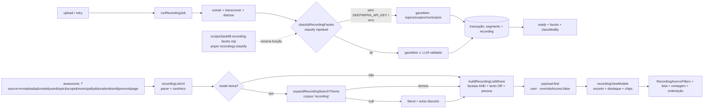

# Impl: C219 — Paridade de busca e filtros entre as fontes do acervo

Status: aprovado
Atualizado em: 2026-09-24
Issue: #1295
Intenção: docs/plans/acervo-paridade-busca-filtros.md
Appetite restante: herdado (~2–3 dias eng)

## Leitura da intenção

- **Outcome:** "Gravações enviadas" passa a oferecer os mesmos gestos de garimpo da Câmara — busca `termo|tema`, filtros por Ano, Tema, Alcance, Município citado, Duração (e Pessoa, que segue exclusiva), chips ativos, contagem, ordenação e vazio honesto — com classificação automática e proveniência auditável sobre a transcrição já existente, sem tocar no player/download nem no contrato da Câmara.
- **O que NÃO negociar:**
  - "Pessoa" continua **exclusiva** das gravações (rótulo derivado, nunca segundo cadastro de pessoa — C200).
  - Gate do acervo **fail-closed** (`requireCampaignPageActor({gate:'communicationCatalog'})` + `canReadRecording`/`canReadCommunicationCatalog`); `advisor`/`leader` negados.
  - Deep-link atual **byte-compatível**: `?source=enviadas&q&person&page` continua canonicalizando para exatamente o mesmo href; `mode=termo` e o sort default nunca serializados.
  - **Sem lista única** entre fontes; **sem redesenho da barra da Câmara** (ela é a referência).
  - Classificação **automática e revisável, nunca inventa** — falha degrada para o que existir e é sinalizada; proveniência é rótulo auditável (`gazetteer|llm|manual`), nunca score.
  - Buckets de duração idênticos à Câmara ("Até 2 min" · "2 a 5 min" · "Mais de 5 min" · "Sem duração"); **Ano derivado de `recordedAt`**, nunca um segundo campo digitado.
- **O que reavaliar (hipóteses da intenção):**
  - "Direção no codebase" aponta `speechClassifier` e `expandSpeechSearchTheme` corretamente, mas o seam real do job é `runRecordingJob` (roda via `after()`, sem request) — a classificação entra ali, **fora** da transação de save, e o backfill das linhas existentes é CLI.
  - `classifySpeech` é reusável como está, mas pede `transcript` **cru** (o `searchText` da gravação é normalizado; o input tem de ser a concatenação dos `text` dos segmentos).
  - `expandSpeechSearchTheme` já tem o parâmetro `corpus` desde S28 — a extensão é **um prompt novo**, não mecanismo novo.
  - Gravações **não têm `keywords`**: a perna textual delas é só `searchText` (a Câmara tem `searchText` OR `keywords`).
  - `Recording` **não tem** os campos de faceta/proveniência de `Speech`: schema novo + migration são inevitáveis (a intenção já previa "facets + proveniência").

## Abordagem recomendada

**Opções consideradas | Recomendação | Rejeitadas (decisões caras):**

| #   | Decisão                       | Opções                                                                                                                                                                                                                                                                                                                           | Recomendação                                                                                                                                                   | Rejeitadas                                                                                                                                                                                                                                            |
| --- | ----------------------------- | -------------------------------------------------------------------------------------------------------------------------------------------------------------------------------------------------------------------------------------------------------------------------------------------------------------------------------- | -------------------------------------------------------------------------------------------------------------------------------------------------------------- | ----------------------------------------------------------------------------------------------------------------------------------------------------------------------------------------------------------------------------------------------------- |
| i   | Onde a classificação roda     | A) seam no `runRecordingJob` (injetável) + CLI backfill · B) hook `afterChange` da collection · C) on-demand no loader da busca · D) hook por `recordingSegment`                                                                                                                                                                 | **A** — o job já tem os segmentos em memória no fim da transcrição; o seam injetável é precedente (`catalogContentPiece`); o CLI cobre as linhas já existentes | B (sem transcrição no momento do hook, roda em caminho quente e re-executa por `step`); C (LLM por request, leitura viraria escrita, faceta inexistente não filtra); D (N chamadas por gravação, unidade errada)                                      |
| ii  | Schema em `Recording`         | A) espelhar `Speech` (`year` derivado + `topics`/`scopes`/`classifiedBy`/`mentionedMunicipalities` + `preserveManualFacets`) com migration `add_recording_facets` · B) facetas por segmento · C) sem schema (derivar na busca) · D) ano sem coluna (range sobre `recordedAt`)                                                    | **A** — mesma forma de `where`/opções/canônico da Câmara e curadoria manual preservada; a migration é aditiva                                                  | B (unidade errada — corte explícito da intenção); C (não filtra/pagina, recalcula a cada busca e morre o "revisável"); D (dois shapes de filtro para o mesmo conceito; a coluna derivada é o que a Câmara tem e o que a intenção chama de "derivado") |
| iii | Contrato de duração + omnibox | A) reusar donos da Câmara (buckets/labels/tipo de `speechListUrl`, `durationBucketWhere` exportado de `speechListFilters`, parsers de ano/município movidos para `campaignListUrl`) + adaptador novo `recordingOmnibox` · B) extrair módulo compartilhado novo do acervo e migrar a Câmara · C) duplicar no domínio de gravações | **A** — a paridade manda que o bucket tenha UM dono; o adaptador por domínio já é padrão (`municipalityOmnibox`, `municipalityUpdateOmnibox`)                  | B (churn na Câmara sem volatilidade; extrair quando C216 chegar — 3º consumidor); C (twin: mudança de bucket divergiria as duas fontes)                                                                                                               |
| iv  | Busca por tema                | A) `ThemeSearchCorpus` ganha `'recording'` + prompt próprio + `expandRecordingSearchTheme` · B) reusar o corpus `'speech'` · C) só busca literal                                                                                                                                                                                 | **A** — o mecanismo é um só (S28); o prompt de discursos da Câmara não descreve plenárias enviadas/debates                                                     | B (prompt errado degrada a expansão); C (rejeitada no gate: a ponte foi confirmada)                                                                                                                                                                   |
| v   | UI                            | A) `RecordingAcervoFilters` novo sobre os shells compartilhados (absorve o `RecordingPersonFilter`) · B) generalizar `SpeechAcervoFilters` configurável · C) estender `SpeechAcervoFilters` com `source`                                                                                                                         | **A** — shells compartilhados são os donos das mecânicas; a Câmara não é tocada                                                                                | B (API genérica rasa e mexe na Câmara — anti-goal); C (acopla os dois contratos num componente)                                                                                                                                                       |
| vi  | Ordenação                     | A) param `sort` com valores pt-BR (`recentes` default omitido, `duracao_maior`, `duracao_menor`); sort de duração só sobre linhas com duração medida · B) par genérico `sort`/`dir` (C117) · C) sort só de UI                                                                                                                    | **A** — contrato fechado e legível no deep link; default preserva `-createdAt` (zero regressão)                                                                | B (o acervo não é tabela; a Câmara não tem esse contrato); C (quebra "paginação preservada no deep link" e back/forward)                                                                                                                              |

**Recomendação (geral):** uma única passada de classificação no job (com o mesmo `classifySpeech`, injetável e com degradação para gazetteer), um CLI idempotente para o acervo já enviado, e a paridade de filtros construída sobre o contrato de URL, o `where`, o adaptador de omnibox e os shells que a Câmara já usa — mudando **só** a fonte de gravações.

**Rejeitadas (geral):** busca global/lista única (anti-goal); pgvector/embeddings (C192 já rejeitou); facetas por trecho/falante (corte da intenção); qualquer alteração na barra/contrato da Câmara.

### Componentes / mudanças

- **`Recording`** (`src/collections/Recording.ts`): novos campos `year` (number, index, readOnly, derivado), `topics` (select hasMany, index, opções `SPEECH_TOPICS`), `scopes` (select hasMany, index, opções `SPEECH_SCOPES`), `classifiedBy` (select, index, **opcional, sem default**, valores `SPEECH_CLASSIFICATION_SOURCES`), `mentionedMunicipalities` (relationship hasMany → `municipality`, index). Hooks: `deriveRecordingYear` (beforeValidate, espelho de `deriveSpeechYear` — `recordedAt` string `slice(0,4)`, com fallback `originalDoc`) e `preserveManualFacets` (beforeChange, espelho de `Speech.ts:43-57`, `FACET_FIELDS = topics|scopes|classifiedBy|mentionedMunicipalities`; escrita sem `req.user` — job/CLI — nunca sobrescreve `manual`). `admin.defaultColumns` ganha `topics` e `classifiedBy` (superfície de revisão da classificação no admin). `admin.description` registra que a classificação é automática sobre o início da transcrição.
- **Migration** (`pnpm migrate:create add_recording_facets` → `src/migrations/20260924_120000_add_recording_facets.ts` + `.json` + `index.ts`): tabelas de join `recording_topics`/`recording_scopes` (enums `enum_recording_topics`/`enum_recording_scopes`/`enum_recording_classified_by`), tabela `recording_rels` (`mentionedMunicipalities`), colunas `year`/`classified_by`. **Hand-edit** (precedente `20260913_150000_backfill_speech_search_text_trgm_index`): backfill determinístico de `year` a partir de `recorded_at` (`WHERE recorded_at IS NOT NULL`). Nada destrutivo; `recording_search_text_trgm_idx` já existe (não mexer).
- **`src/payload-types.ts`**: regenerado (`pnpm generate:types`) — `Recording` ganha os campos.
- **`classifyRecordingFacets`** (`src/utilities/recordings/recordingClassification.ts`, novo, `import 'server-only'`): `({ payload, transcript, classify = classifySpeech })` → `{ topics, scopes, classifiedBy, mentionedMunicipalities } | null`. Reusa `SpeechFacetInput`/`SpeechClassificationResult`, `classifySpeech` (DeepInfra + validação `lib/speechFacets`) e resolve `municipalities[].slug → municipality.id` numa query (bypass justificado — geografia read-only — precedente `speechImport.ts:176-196`). Nunca lança: transcrição vazia ou throw defensivo devolvem `null` e o job segue sem facets.
- **`runRecordingJob`** (`src/utilities/recordings/recordingJob.ts`): ganha `classify` injetável (default `classifySpeech`), chamado **depois** de diarizar e **antes** de `markStep('saving')` (o LLM não entra na transação); transcript = `keyedSegments.map(s => s.text).join(' ')`. O update transacional final (`status:'ready'`, `searchText`, `speakerLabels`) passa a incluir `year` (quando houver `recordedAt`), `topics`, `scopes`, `classifiedBy`, `mentionedMunicipalities`.
- **`scripts/backfill-recording-facets.mjs`** (novo) + `package.json` `"recordings:classify"`: reusa `classifyRecordingFacets`; default = linhas `ready` com `classifiedBy` ausente (`--all` reclassifica não-`manual`), `--dry-run`, `--limit N`; `assertLocalDatabase` + `RECORDING_CLASSIFY_CONFIRM=1` para alvo remoto/produção (precedente `CAMARA_IMPORT_CONFIRM`); relatório (classificadas/puladas-manual/falhas/tokens/custo) e idempotência por `classifiedBy`.
- **URL** (`src/utilities/recordings/recordingListUrl.ts`): `RecordingListState` ganha `mode?` (reusa `SpeechSearchMode`), `years?`, `topics?`, `scopes?`, `municipalities?`, `durations?` (reusa `SpeechDurationBucket`) e `sort?`; `recordingListParamNames` ganha `mode|year|topic|scope|municipality|duration|sort`. Ordem canônica: `source, q, mode, year[], topic[], scope[], municipality[], duration[], sort, person[], page` — os parâmetros novos não perturbam o href dos deep links atuais. Serialização: `mode=tema` só com `q`; `sort` só quando ≠ `recentes`; `page` só > 1. Novos: `RECORDING_SORT_OPTIONS`/`recordingSortLabels` ("Mais recentes" · "Duração (maior)" · "Duração (menor)"), `recordingSortKeys(state)` (`-createdAt` default / `-durationSeconds` / `durationSeconds`) e `buildRecordingFiltersKey(state)` (espelho de `buildSpeechFiltersKey`, usado como `key` do remount da barra).
- **`campaignListUrl.ts`**: recebe `parseYearValues`/`parseMunicipalityValues` (movidos de `speechListUrl.ts`, que passa a importá-los) — um dono para a validação estrutural de ano/município nas duas fontes.
- **`speechListFilters.ts`**: exporta `durationBucketWhere` (sem mudança de comportamento) para o `where` das gravações.
- **Filtros** (`src/utilities/recordings/recordingListFilters.ts`): `buildRecordingListWhere(state, themeTerms = [])` — facetas AND (`year in`, `topics in`, `scopes in`, `mentionedMunicipalities in`, OR de `durationBucketWhere`, OR de `speakerNames contains`), perna textual OR de `{ searchText: { like: normalizeForSearch(term) } }` para `[q, ...themeTerms]` (sem `keywords`), e `{ durationSeconds: { exists: true } }` quando `sort` é de duração (o Postgres ordena NULLS FIRST em DESC; sem isso "Duração (maior)" abriria com as linhas sem duração).
- **Loader** (`src/utilities/recordings/recordingPageData.ts`): `RecordingFilterOptions` ganha `years` e `municipalities` (via `loadMunicipalityLabelsByIds`, precedente `loadSpeechFilterOptions`); `loadRecordingsPageData(payload, user, params, expandTheme = expandRecordingSearchTheme)` com o gate de tema (`mode=tema && q && canReadCommunicationCatalog(role)` antes de qualquer chamada externa) e retorno `themeUnavailable`/`themeApplied`; `sort` aplicado; `loadMatchedSegments` passa a receber os termos (`[q, ...themeTerms]`) e casa `or` de `searchText like`; `select` da lista ganha `topics` (chip do card).
- **View models** (`src/utilities/recordings/recordingViewModels.ts`): `toRecordingListItemViewModel` ganha `themeTerms`; o excerto prefere a evidência de tema (espelho C192: primeiro termo que casa em `searchText`, segmento via `pickMatchingSegment`, `buildHighlightedExcerpt(..., { phrase: true })`) e cai no literal quando não há; `watchHref` mantém `?t=&q=` com o **`q` literal** (byte-compat; espelho de `buildWatchHref`); `RecordingListItemViewModel` ganha `topics: { value, label }[]` (labels de `speechTopicLabels`).
- **Omnibox** (`src/utilities/recordings/recordingOmnibox.ts`, novo, puro/client-safe): chips (`q`, `year`, `topic`, `scope`, `municipality`, `duration`, `person`), seeds (Tema/Alcance/Duração visíveis com query vazia; Ano/Município citado/Pessoa pesquisáveis por palavra-chave), `applyRecordingOmniboxSuggestion`/`removeRecordingOmniboxChip`/`applyRecordingSearchMode`/`clearRecordingOmnibox` (preservando `source: 'enviadas'` no clear) sobre `lib/campaignListOmnibox.ts`; `person` reusa `toggleRecordingPerson`/`removeRecordingPerson` (dedupe case-insensitive já dono) e o prefixo `person:` lê o valor por `slice` (o rótulo pode conter `:`).
- **Tema** (`src/utilities/ai/expandSpeechSearchTheme.ts`): `ThemeSearchCorpus` ganha `'recording'`; novo prompt de corpus (plenárias/debates/material próprio enviados pela equipe), `themeExpansionRules('gravação')`; wrapper `expandRecordingSearchTheme` (mesmo timeout/degradação/`normalizeSpeechThemeTerms`).
- **UI (Impeccable B — port de `docs/plans/acervo-paridade-busca-filtros-ui-design.html`):**
  - `src/components/campaign/recording/RecordingAcervoFilters.tsx` (novo, client) — **cenas 01/02**: form `campaignListOmniboxFormClassName` com label "Buscar nas gravações enviadas", `CampaignListOmnibox` (chips dentro do campo, como na Câmara — B184/B127), seletor segmentado `role="group"` `grid grid-cols-2 rounded-lg bg-muted p-1` + `aria-pressed` + `min-h-11 md:min-h-9` (com o estado degradado `themeUnavailable`), e as seis facetas como `CampaignHeaderFilterPopover triggerVariant="chip"` (`Ano`, `Tema`, `Alcance`, `Município citado`, `Duração`, `Pessoa`) com `selectedTriggerLabel` dobrando a seleção. A linha "Ativos:" do artefato é realizada pelos chips do próprio omnibox (shell compartilhado), sem segunda fileira.
  - `src/components/campaign/recording/RecordingSortSelect.tsx` (novo, client) — **cena 01**: label "Ordenar por" + `select` nativo (`rounded-md border border-input`) via `useCampaignListFilterNavigation`; em sort de duração, hint "Gravações sem duração aparecem apenas em Mais recentes." A contagem fica no `CampaignListFooter` (padrão de todas as listas — sem duplicar a linha).
  - `src/components/campaign/recording/RecordingThemeFallbackNotice.tsx` (novo) — **cena 04/C192**: `Alert variant="pending"` com a copy de gravações + `CampaignThemeRetryButton`; move `SpeechThemeRetryButton` → `src/components/campaign/shared/CampaignThemeRetryButton.tsx` (componente genérico, zero copy própria) e atualiza o import da página da Câmara.
  - `src/components/campaign/recording/RecordingResultCard.tsx` — **cena 01 (card)**: chip de tema (`bg-muted`) ao lado do chip de pessoa; destaque do termo continua via `SpeechHighlightParts`.
  - `src/app/(campaign)/campanha/(app)/comunicacao/acervo/page.tsx` — branch `enviadas`: `key={buildRecordingFiltersKey(data.state)}`, barra nova, aviso de tema, `RecordingSortSelect`, `RecordingStatusRefresher` (intocado), lista/vazio/footer; vazio honesto da **cena 03** (título "Nenhuma gravação encontrada para este tema", descrição do artefato, "Limpar filtros" + "Trocar para termo exato") e `hasFilters` por `buildRecordingFiltersKey`. O `RecordingsSearchForm` inline e o `RecordingPersonFilter` somem (absorvidos).
  - **Cena 04 (sem permissão)** permanece o redirect fail-closed do gate — a cena é ilustrativa, não vira superfície nova. **Cena 05 (carregando)** é o `CampaignListPendingBoundary`/`CampaignListResults` existente (dima o resultado, não o controle).
  - Remover `src/components/campaign/recording/RecordingPersonFilter.tsx`.
- **Manifest e2e** (`scripts/lib/e2e-affected-manifest.mjs`): `src/collections/Recording.ts` entra no entry da vertical C154/C199 (`campaignSpeechAcervo`) — hoje um diff só nesse arquivo cairia no smoke da home; e `campaignSpeechAcervo` entra em `E2E_CURATED_SPECS` (precedente C167/S19: a migration torna todo PR da entrega high-risk), com o pin de congelamento atualizado em `tests/unit/e2eAffectedManifest.unit.spec.ts`.
- **Access / Consent:** **nada muda**. Sem chave `Consent` nova (acervo interno; sem PII nova), sem collection nova, sem rota nova. O classificador fala com a DeepInfra (mesmo provedor/chave que já transcreve a gravação) e o tema com a DeepSeek (só o texto digitado, como na Câmara).

### Dados → forma (se aplicável)

N/A justificado. O item não apresenta métrica, agregado nem score: resultados e facetas são recorte editorial. A proveniência é rótulo auditável (`Gazetteer`/`LLM`/`Manual`) no admin — nunca número na UI; "contagem de resultados" é paginação, não métrica de vaidade.

## Fases verificáveis

1. **Tracer / schema + server** (~1 dia) — `Recording` com os campos/hooks + migration `add_recording_facets` (com backfill de `year`) + `pnpm generate:types` + `recordingClassification` + seam `classify` no `runRecordingJob` + `scripts/backfill-recording-facets.mjs`.
   - Prova: `tests/int/recording.int.spec.ts` — job end-to-end grava `topics`/`scopes`/`classifiedBy`/`mentionedMunicipalities`/`year` (classificador injetado determinístico + caminho gazetteer sem `DEEPINFRA_API_KEY`); curadoria `manual` não é sobrescrita por escrita sem `user`; retry reclassifica; `pnpm migrate` local verde.
2. **URL / filtros / loader** (~0,5 dia) — params e estado novos, `buildRecordingFiltersKey`, `recordingSortKeys`, `where` com facetas + tema + gate de sort, loader com opções (`years`/`municipalities`) e injeção do tema, corpus `'recording'`.
   - Prova: `tests/unit/recordingListUrl.unit.spec.ts` (deep-link byte-compat, canônico, enums exaustivos, `sort` default omitido), `tests/unit/recordingListFilters.unit.spec.ts` (facetas AND, tema OR, duração, `exists` do sort), `tests/unit/recordingOmnibox.unit.spec.ts` (novo), `tests/unit/expandSpeechSearchTheme.unit.spec.ts` (corpus novo), `tests/int/recording.int.spec.ts` (loader filtra/ordena/tema e opções).
3. **UI port** (~0,5–1 dia) — `RecordingAcervoFilters`, `RecordingSortSelect`, `RecordingThemeFallbackNotice`, `CampaignThemeRetryButton` movido, chip de tema no card, página; remoção do `RecordingPersonFilter`.
   - Prova: `tests/e2e/campaignSpeechAcervo.e2e.spec.ts` (describe de gravações estendido: barra com chips, filtro que estreita + vazio honesto, modo tema degradando, sort, contagem; o teste de "Pessoa" passa a exercitar a barra nova); `pnpm dev` manual com a cena 01 do artefato.
4. **Testes/gates** (~0,5 dia) — `pnpm gate:fast`; depois a cascata cheia (`pnpm lint`, `pnpm format:check`, `tsc --noEmit`, `pnpm exec knip`, `pnpm check:cycles`, `pnpm test`, `pnpm build`); `pnpm push`; entrada em `docs/changelog/<data>-c219.md`; PR ready com auto-merge (o check `checks` é o gate; o e2e curado roda `campaignSpeechAcervo`).

## Rabbit holes / Não escopo (engenharia)

- **Generalizar a barra da Câmara** (`SpeechAcervoFilters` configurável / componente `AcervoFilters` genérico) — anti-goal; shells compartilhados já são os donos.
- **Extrair o adaptador de omnibox/helpers de estado para um genérico** — 2 call sites; extrair quando C216 ("Falas na internet") chegar (3º).
- **Módulo compartilhado novo do contrato do acervo** (mover buckets/parsers para um terceiro) — churn na Câmara sem volatilidade; deferido para C216.
- **pgvector/embeddings/índice vetorial** — já rejeitado no C192.
- **Classificar por segmento/falante** ou reclassificar a taxonomia (18 temas fixos) — cortes de produto.
- **Segundo cadastro de pessoa / inferir falantes** — "Pessoa" segue rótulo (C200).
- **Mudar o default de ordenação para `-recordedAt`** — regressão do comportamento atual (`-createdAt`); fora do aceite.
- **Busca global entre fontes / lista única** — anti-goal.
- **UI de curadoria de facetas além do form do admin** — o form da collection é a superfície de revisão; qualquer coisa além disso é outro item.
- **Cache/rerank da expansão de tema** — deferido no C192 (sem cache no v1).

**Adiado com gatilho (triage do /simplify desta entrega):**

- **Extração dos helpers de faceta/estado restantes** (`facetRows`/`clearFacet`/`runAction` e o aviso de fallback por domínio) — gatilho: C216 (3º consumidor do acervo), junto do adaptador de omnibox (S2/S3).
- **N+1 do backfill** (`scripts/backfill-recording-facets.mjs` consulta os segmentos de cada gravação em queries separadas) — gatilho: acervo na casa das centenas de gravações ou `--all` perceptivelmente lento (S4).
- **Ternários aninhados do ramo de gravações** em `acervo/page.tsx` — gatilho: extração do 3º consumidor na C216, quando o ramo for compartilhado (S5).
- **"X" de limpar do omnibox quebra linha no mobile com chip longo** — débito do shell compartilhado, pré-existente e reproduzido na Câmara; registrado como Issue própria (C221, `docs/plans/omnibox-limpar-mobile.md`) — fora deste item (S1).

## Riscos e mitigação

- **Deep-link/redirect:** os nomes novos entram em `recordingListParamNames` (antes seriam "unsupported" e redirecionariam); o serializer precisa reproduzir `?source=enviadas&q=…&person=…&page=…` **byte a byte** (ordem canônica acima; `page` só >1). Mitigação: pins no `recordingListUrl.unit.spec.ts` (incluindo `mode=tema` sem `q` canonicalizando fora e `sort` default omitido).
- **`select` allowlist:** esquecer `topics` no `recordingListSelect` some com o chip do card silenciosamente. Mitigação: o campo é exigido pelo input do view model (typecheck) + int test do loader.
- **Manifest e2e:** `src/collections/Recording.ts` está fora do manifest (um diff só nele cairia no smoke da home); `src/payload-types.ts` é `HIGH_RISK_EXACT` → o PR roda o e2e **curado**, que hoje não inclui `campaignSpeechAcervo`. Mitigação: adicionar o arquivo ao entry da vertical e `campaignSpeechAcervo` ao `E2E_CURATED_SPECS` + pin (precedente C167/S19); a suíte full continua no `verify` do deploy.
- **Ausência de `DEEPINFRA_API_KEY`:** `classifySpeech` degrada para gazetteer (topics/scopes/municípios do léxico) e nunca lança; o CLI reporta `llm: false` e o `mergeFacetClassification` garante que `classifiedBy: 'llm'` só sai com resposta validada.
- **Gravações já existentes:** `classifiedBy` **nulo = "não classificada"** (honesto; nunca inventar `gazetteer` por default); ficam visíveis e sem faceta até o `pnpm recordings:classify` rodar; o CLI é idempotente e não toca `manual`.
- **Transcrição longa:** o prompt do LLM trunca em 12k chars (dono: `classifySpeech`) — classificação pelo início da transcrição, registrada no `admin.description`; a busca (trgm) não é afetada. O custo é 1 chamada por gravação `ready` (mesmo provedor/chave do ASR), nunca por request.
- **Sort × duração nula:** sem o gate `durationSeconds exists`, o Postgres colocaria as linhas sem duração no topo de "Duração (maior)"; o gate + hint no controle mantêm a ordem honesta. Int test cobre.
- **Matriz de papéis:** intocada — gate da página e `canReadRecording` idênticos; a expansão de tema só roda depois de `canReadCommunicationCatalog(role)`; os bypasses do job/CLI são internos e justificados.
- **Migration em produção:** aditiva (colunas nulas + joins), aplicada pelo `pnpm build` do deploy; o backfill de `year` é SQL determinístico; `down` gerado cobre rollback.
- **Ciclos/convenções:** `recordings → speech` não pode criar ciclo (`speech` não importa `recordings`) — `pnpm check:cycles`; `recordingClassification.ts` declara `import 'server-only'` (regra do `codebaseConventions.unit.spec.ts`).

## Aceite de engenharia

- [ ] Aceite de produto da intenção ainda coberto (ano, duração, tema, alcance, município citado, pessoa exclusiva, contagem, chips, ordenação, vazio honesto, tema degradando honestamente).
- [ ] Invariantes AGENTS/engineering-standards: `user` + `overrideAccess: false` em toda leitura; bypass do job/CLI justificado; sem `Consent`/PII nova; `leader`/`advisor` fail-closed; sem top-level novo em `utilities/`; copy pt-BR / identificadores em inglês; sem `openai/*` (OPS123).
- [ ] Migrations: só arquivos novos (nunca editar antigas); `pnpm migrate` local; `pnpm generate:types`; prod aplica no build.
- [ ] Testes de domínio previstos: unit (URL/where/omnibox/corpus), int (job escreve facetas, curadoria manual preservada, loader filtra/ordena/tema), e2e (barra/filtros/ordenação/vazio) — onde os write paths e o contrato de URL mudam.
- [ ] Manifest/e2e atualizado (`src/collections/Recording.ts` na vertical; `campaignSpeechAcervo` no curado + pin).
- [ ] Gates: `tsc --noEmit`, `pnpm lint` (0 warnings), `pnpm format:check`, `pnpm exec knip`, `pnpm check:cycles`, `pnpm test`, `pnpm build`; `pnpm push`; entrada em `docs/changelog/`.

## Decisões de engenharia

**(i) Onde a classificação roda**

- **Opções:** A) seam no `runRecordingJob` (injetável) + CLI backfill | B) hook `afterChange` da collection | C) on-demand no loader da busca | D) hook por `recordingSegment`.
- **Recomendação:** **A** — o job já tem `keyedSegments` em memória ao fim da transcrição, roda fora do request e faz o save transacional; o `classify` injetável (default `classifySpeech`) é o mesmo padrão de `catalogContentPiece` e mantém os testes offline; o CLI cobre as linhas anteriores à entrega com a mesma função.
- **Rejeitadas:** B porque o hook dispara em cada transição de `status`/`step` (sem transcrição no momento útil), prenderia um LLM de 60s dentro do ciclo de escrita e re-executaria a cada passo; C porque pagaria o LLM em toda página, transformaria leitura em escrita e não filtraria pelo que ainda não foi classificado; D porque faria N chamadas por gravação e classificaria por trecho — unidade rejeitada pela intenção.

**(ii) Schema em `Recording`**

- **Opções:** A) espelhar `Speech` (`year` derivado, `topics`/`scopes`/`classifiedBy`/`mentionedMunicipalities`, `preserveManualFacets`) com a migration `add_recording_facets` | B) facetas por segmento | C) sem schema, derivar na busca | D) ano por range sobre `recordedAt` (sem coluna).
- **Recomendação:** **A** — mantém `where`, opções de faceta e canônico idênticos aos da Câmara (a paridade é o objetivo), a curadoria manual preservada (hook espelho) e o "revisável" no admin. `year` derivado no `beforeValidate` com backfill SQL na migration; `classifiedBy` opcional (ver vii).
- **Rejeitadas:** B porque a unidade da Câmara é a fala e o corte da intenção é a gravação; C porque não filtra com `where`/paginação, recalcula a cada busca e perde a revisão; D porque criaria um segundo shape de filtro para o mesmo conceito (e teria de repetir a regra de fuso em cada branch), enquanto a coluna derivada é literalmente o "derivado da data já informada" da intenção.

**(iii) Reuso do contrato de duração e do omnibox**

- **Opções:** A) reusar os donos da Câmara (buckets/labels/tipo em `speechListUrl`, `durationBucketWhere` exportado de `speechListFilters`, parsers de ano/município em `campaignListUrl`) + `recordingOmnibox` novo | B) extrair módulo compartilhado novo do acervo e migrar a Câmara | C) duplicar buckets/where no domínio de gravações.
- **Recomendação:** **A** — um dono para o bucket (mudança na Câmara reflete nas gravações, que é a paridade pedida) e o adaptador por domínio segue o padrão já existente (`municipalityOmnibox`, `municipalityUpdateOmnibox`); o que é genérico (`lib/campaignListOmnibox`) já é compartilhado.
- **Rejeitadas:** B porque mover o contrato de referência para um terceiro neutro gera churn na Câmara sem volatilidade real — gatilho de revisitação: a chegada da C216 (3º consumidor); C porque duplicar o bucket/where faz as duas fontes divergirem em silêncio, exatamente o que o item existe para impedir.

**(iv) Corpus da busca por tema**

- **Opções:** A) `ThemeSearchCorpus` ganha `'recording'` + prompt próprio + wrapper | B) reusar o corpus `'speech'` | C) só busca literal.
- **Recomendação:** **A** — `expandSearchTheme(theme, corpus)` é o mecanismo único desde S28; o que muda é o prompt (plenárias/debates/material próprio enviados pela equipe). Degradação e `normalizeSpeechThemeTerms` são herdados.
- **Rejeitadas:** B porque o prompt descreve discursos da Câmara e degradaria a expansão para gravações; C porque a pergunta de produto foi confirmada no gate (estender a ponte é a paridade pedida).

**(v) UI: componente novo × generalização**

- **Opções:** A) `RecordingAcervoFilters` novo sobre os shells compartilhados | B) generalizar `SpeechAcervoFilters` configurável | C) estender `SpeechAcervoFilters` com `source`.
- **Recomendação:** **A** — os donos das mecânicas são os shells (`CampaignListOmnibox`, `CampaignHeaderFilterPopover`, `useCampaignListFilterNavigation`, `CampaignListPending*`, `CampaignListEmptyState/Footer`); o componente de domínio só monta os facets da fonte, como o da Câmara.
- **Rejeitadas:** B porque uma API genérica configurável é pass-through raso e mexeria na Câmara (anti-goal); C porque acoplaria os dois contratos de URL num único componente e twinaria a Câmara dentro dele.

**(vi) Contrato de ordenação**

- **Opções:** A) `sort` com valores pt-BR (`recentes` default omitido, `duracao_maior`, `duracao_menor`) + exclusão de linhas sem duração nos sorts de duração | B) `sort`/`dir` genérico (C117) | C) sort só de UI.
- **Recomendação:** **A** — contrato fechado (o canonicalizador redireciona valor desconhecido), default preserva `-createdAt` (zero regressão) e o gate `durationSeconds exists` evita NULLS FIRST no Postgres; o controle avisa que gravações sem duração aparecem só em "Mais recentes".
- **Rejeitadas:** B porque o acervo não é tabela e a Câmara não tem esse contrato (a paridade pede o gesto, não o par genérico); C porque quebraria "paginação preservada no deep link" e o back/forward.

**(vii) Proveniência nula nas gravações existentes**

- **Opções:** A) `classifiedBy` opcional, sem default — nulo = "não classificada" | B) `required` com `defaultValue: 'gazetteer'` (espelho exato de `Speech`).
- **Recomendação:** **A** — o default de B afirmaria que o gazetteer classificou linhas que nunca passaram por ele (viola o "nunca inventa"); nulo é o estado honesto até o `pnpm recordings:classify`, e o seletor do CLI fica trivial (`classifiedBy` ausente). Os **valores** persistidos são os mesmos da Câmara (`gazetteer|llm|manual`) — a paridade é do vocabulário, não do `required`.
- **Rejeitadas:** B porque a migration carimbaria proveniência falsa nas linhas antigas e o backfill não teria como distinguir "classificada" de "nunca classificada".

**Decisões baratas (com gatilho de revisitação):**

- **Excerto no modo tema:** evidência de tema vence o excerto (espelho C192) e o `watchHref` mantém o `q` literal no `?t=&q=` (byte-compat; espelho `buildWatchHref`). Revisitar se a Câmara mudar a regra.
- **`CampaignThemeRetryButton` movido para `shared/`** (componente genérico, 1 import atualizado na Câmara) — o aviso em si fica por domínio (copy).
- **Helpers de estado do omnibox (`withPageReset`/`toggleValue`/`removeValue`)** duplicados no adaptador de gravações; extrair na C216 (3º).
- **Contagem no `CampaignListFooter`** (não na linha do sort, como no artefato) — padrão de todas as listas; sem duplicar a linha.
- **Chip de tema no card** usa `bg-muted` (mesma linguagem do chip de pessoa) — sem selo "Tema" (o artefato não pede).

**Self-score (0–5, gate ≥4): 5/5.**

1. **Decisões caras com rejeitadas:** 5/5 — as seis decisões caras (seam, schema, reuso de contrato, corpus, UI, sort) e a de proveniência nula têm opções/recomendação/rejeitadas; as baratas ficam com gatilho.
2. **Appetite:** 5/5 — sem infra/provedor novo, sem collection/rota nova, reusando classificador, ponte de tema, shells e a transação do job; cabe nos ~2–3 dias.
3. **Rabbit holes nomeados:** 5/5 — barra genérica, módulo compartilhado precoce, embeddings, classificação por trecho, segundo cadastro, mudança de default de sort, lista única.
4. **Depth check:** 5/5 — reusa `classifySpeech`/`lib/speechFacets`, `expandSearchTheme`, `campaignListOmnibox`, shells de lista, `loadMunicipalityLabelsByIds`, `SpeechHighlightParts`, `withPayloadTransaction`; nada de camada cerimonial.
5. **Intenção preservada:** 5/5 — Pessoa exclusiva, gate fail-closed, deep-link byte-compatível, sem lista única, sem redesenho da Câmara, classificação auditável e degradando honestamente.
