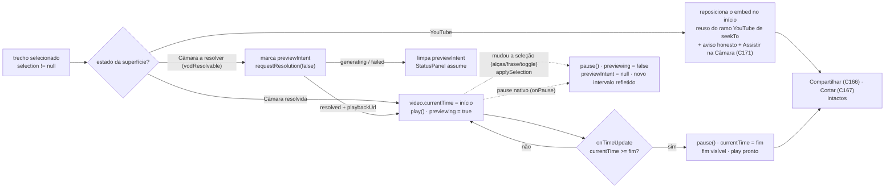

# Impl: Acervo: pré-visualizar no player o trecho selecionado

Status: concluído (as-built abaixo)
Atualizado em: 2026-09-16
Issue: #1083
Intenção: docs/plans/acervo-player-preview-do-trecho.md
Appetite restante: herdado (~1 dia eng; sem corte — sem schema/`Consent`/escrita; uma função pura em `src/lib` + o dono do playback + o card de seleção com um slot + as duas suítes unit)

## Leitura da intenção

- **Outcome:** com um trecho selecionado numa superfície que o app controla (vídeo da Câmara), apertar **"Pré-visualizar trecho"** posiciona no início, reproduz e **para no fim** — o mesmo player, com a janela selecionada; no YouTube a postura é honesta (reposiciona no início, avisa e oferece o caminho da Câmara via C171), nunca prometendo a parada que o embed não garante.
- **O que NÃO negociar:** um único player (sem segundo player/superfície); a parada no fim só existe onde o app para o vídeo (`surface === 'vod'` com o `<video>` montado); mudar a seleção durante/após a pré-visualização **cancela** o preview e reflete o novo intervalo (nunca vaza para fora do trecho); seleção/compartilhamento/corte intactos; clique na transcrição segue posicionando fora do modo de seleção e estendendo dentro dele (C166); sem `Consent`/collection/migration; sem render/export; guardrails do acervo (gate `speechCatalog`, crédito CC BY, `excerptTMs` verbatim, URLs públicas) intocados.
- **O que reavaliar:** (1) a hipótese de que o dono do playback decide onde o botão aparece — o dono é `SpeechDetailPlayer`, mas a **posição visual** é do artefato: o botão mora no card de seleção (`SpeechExcerptControls`), por slot, e o player passa o nó renderizado (decisão 1); (2) a questão em aberto do VOD não resolvido — **resolvida no GATE a favor da intenção (gesto único: resolve e toca)**; o plano original a cortava e foi corrigido, com estado visual novo a cargo do `designer` (trigger a); (3) `SpeechExcerptControls` permanece só-geometria: a lógica de tocar/parar não entra nele (recebe só slot + estado de apresentação).

## Abordagem recomendada

**Opções consideradas:** A) pré-visualização como estado do **dono do playback** (`SpeechDetailPlayer`), com o botão renderizado dentro do **card de seleção** (`SpeechExcerptControls`, por slot) e comportamento ramificado por superfície | B) lógica de mídia dentro de `SpeechExcerptControls` (o bloco de seleção vira dono do play) | C) componente/estado próprio do preview (terceiro irmão no arquivo).
**Recomendação:** A — o `SpeechDetailPlayer` já é o dono de `videoRef`, `seekTo`, `surface`, `playbackUrl` e `onTimeUpdate`; o preview é só um modo de reprodução sobre o que já existe. O botão é renderizado pelo player e injetado no card pelo slot `previewArea` (posição do artefato: dentro do bloco de seleção), reusando `Button` e o `PlayIcon` (:3); o estado novo (`previewing`) é um booleano ao lado de `selection`/`surface`.
**Rejeitadas:** B porque `SpeechExcerptControls` é geometria pura (só traduz ponteiro/tecla; `onChange` sobe a range) e passaria a carregar efeito de mídia — quebra a fronteira que o C166 estabeleceu e o que o explorer 7 confirma; C porque é o rabbit hole "segundo player/segunda superfície" que a intenção corta e duplicaria o dono do `<video>`.

### Decisões de engenharia

1. **Onde o controle ancora.** Opções: A) **dentro do card de seleção** (`SpeechExcerptControls`), no rodapé após a dica, via slot `previewArea?: ReactNode` + estado de apresentação `previewState` | B) na fileira de ações existente do `SpeechDetailPlayer` | C) barra de ações nova. **Recomendação:** A — o artefato de gate é explícito: o botão mora no `selection-card` e "A ação não migra para a fileira de compartilhar, cortar ou baixar" (`docs/plans/acervo-player-preview-do-trecho-ui-design.html:340`; cenas 1/2/3 desenham o botão dentro do card). O player continua **dono do playback** e passa o `Button` já renderizado como `ReactNode`; `SpeechExcerptControls` segue sem saber de mídia (recebe só o slot e um estado de apresentação `'idle' | 'playing' | 'ended'`) — a fronteira do C166 é preservada porque nenhum efeito de mídia entra no controle. **Rejeitadas:** B (contraria o artefato aprovado — a estrutura visual é do `designer`, o implementador porta classe-a-classe, não realoca); C (estrutura nova, anti-goal). _Posição resolvida pelo artefato — não vai ao gate como escolha._
2. **YouTube: o que acontece.** Opções: A) **só** o aviso honesto + "Assistir na Câmara" (C171), sem botão de preview | B) botão com o mesmo rótulo **"Pré-visualizar trecho"** que apenas **reposiciona** o embed no início (reusa o ramo YouTube de `seekTo`, :231-238), nunca vira "Parar pré-visualização", com o aviso honesto sempre visível | C) tentar `end`/IFrame API no embed. **Recomendação:** B — porta a cena 3 (o artefato desenha o botão no card + a legenda "Começa em 01:42. No YouTube, a parada no fim é manual.") e o gesto é honesto porque só reposiciona; a **parada** (toggle "Parar pré-visualização" e pausa no fim) fica estritamente gated a `surface === 'vod'` com o `<video>` montado. **Rejeitadas:** A (o artefato desenha o botão; e reposicionar é útil e custa zero mecanismo novo); C (rabbit hole declarado na intenção — bot-check/sem API).
3. **Pré-visualizar com o VOD ainda não resolvido (produto: gesto único).** Opções: A) **gesto único** — o controle aparece no quadrante "Assistir o trecho" (fala `vodResolvable`, sem `playbackUrl`) e, ao clicar, resolve o VOD e toca assim que o arquivo verificado chega | B) o controle só aparece com o `<video>` já montado (o assessor precisa clicar "Assistir o trecho" antes) | C) pede "Assistir o trecho" explicitamente. **Recomendação:** A — **decidido com o humano no GATE**, seguindo a recomendação da intenção: o resolver é idempotente/verificado (C162/C171) e o gesto é único ("veja o trecho"). **Estado novo:** `previewIntentRef` + effect que, quando `resolution.kind === 'resolved' && playbackUrl` e há intenção pendente, inicia o preview (seek ao início + `play()`) depois de o `<video>` montar; `generating`/`failed` limpam a intenção e o `StatusPanel`/`inlineNotice` assumem; o botão mostra o estado "resolvendo" enquanto a resolução corre. **Rejeitadas:** B (o plano original; contraria a recomendação da intenção e cria dois gestos); C (copy/estado redundante com o painel que já existe). **Design:** é um estado visual que o artefato não cobre → **trigger (a): o `designer` estende o artefato antes de o markup mudar**.
4. **Parada manual vs. fim.** Opções: A) no fim, **pausa e deixa o fim visível** (play pronto); parar manualmente pausa onde está | B) pausa e rebobina ao início da seleção. **Recomendação:** A — replica a questão em aberto da intenção: o fim fica visível para conferência e o replay é o próximo clique; rebobinar automático é gesto de replay não pedido. **Rejeitada:** B.
5. **Onde mora a matemática "chegou ao fim".** Opções: A) função pura em `src/lib/speechExcerptSelection.ts` (`excerptPreviewStopAt(range, currentSeconds): number | null`) consumida pelo `onTimeUpdate` | B) `if (current >= selection.endSeconds)` inline no componente | C) helper novo em `src/utilities/speech`. **Recomendação:** A — mantém o `onTimeUpdate` magro, é testável sem DOM (a suíte pura já existe) e é o dono natural da range; devolve o alvo exato de parada (`endSeconds`) para **clamp do overshoot** do `timeupdate` (~4 Hz). **Rejeitadas:** B (regra espalhada, sem teste puro; o brief pede a lib); C (client component importaria `utilities` por nada — `lib/` é client-safe por definição).
6. **Mudança de seleção durante o preview.** Opções: A) um único `applySelection(next)` no player que **sempre** para o preview e então aplica a nova range; todos os call-sites (`onChange`, `onSegmentActivate`, `toggleSelection`) passam por ele | B) parar o preview em cada call-site separadamente. **Recomendação:** A — um caminho só garante o invariante "nunca vaza"; B esquece um call-site a cada novo modo. **Rejeitada:** B.
7. **Anti-leak em pausa/scrub nativos.** Opções: A) `onPause` fecha o estado de preview (o usuário pausou no controle nativo) + guard-effect limpa `previewing` quando `playbackUrl`/`surface` mudam | B) detectar `seeking`/`onSeeking` para cancelar scrub. **Recomendação:** A — `onPause` cobre pausa manual e o próprio `pause()` do fim; B corre risco de o `seeking` do seek inicial do `startPreview` limpar o estado recém-ligado (ordem de eventos do browser). **Rejeitada:** B nesta fatia (gatilho: relato de preview seguindo quando a pessoa arrasta a barra nativa).

### Componentes / mudanças

- **`src/lib/speechExcerptSelection.ts`** (editar o owner puro, sem React/DOM): exportar `excerptPreviewStopAt(range: ExcerptRange, currentSeconds: number): number | null` — devolve `range.endSeconds` quando `currentSeconds` finito e **≥** o fim (fim inclusivo; `onTimeUpdate` pode passar do fim e o retorno é o alvo para clampar de volta), senão `null`. Sem tipo novo (reusa `ExcerptRange`); sem tocar em `MIN_EXCERPT_SECONDS`/`normalizeExcerptRange`/`moveRangeEdge`/C170.
- **`src/components/campaign/speech/SpeechDetailPlayer.tsx`** (editar o owner do playback, encaixe cirúrgico):
  - imports: `PauseIcon` de `lucide-react` junto de `PlayIcon` (:3); `excerptPreviewStopAt` de `@/lib/speechExcerptSelection` (:17-22).
  - estado: `const [previewing, setPreviewing] = useState(false)` ao lado de `selection` (:137) — `previewing` só é verdadeiro com o `<video>` montado.
  - `stopPreview()`: `videoRef.current?.pause()` + `setPreviewing(false)` (idempotente).
  - `applySelection(next: ExcerptRange | null)`: `stopPreview()` e então `setSelection(next)`. Substitui os três call-sites atuais: `onChange={setSelection}` (:443 → `onChange={applySelection}`), `setSelection(initialExcerptRange(...))` (:261) e `setSelection(extendRangeToSegment(...))` (:273). `toggleSelection` (:255-262) usa `applySelection` nos dois ramos. Esse é o dono único do invariante "mudou a seleção → parou".
  - `startPreview()`: quando há `<video>` montado (`surface === 'vod'` com `playbackUrl`), `video.currentTime = selection.startSeconds; void video.play().catch(() => {}); setPreviewing(true)`. Em `youtubeSurface`, apenas **reposiciona** reusando o ramo YouTube de `seekTo(selection.startSeconds)` (:231-238) — sem `setPreviewing`.
  - **gesto único no quadrante não resolvido (decisão 3):** `previewIntentRef` + `requestPreview()` — em `vodResolvable` sem `playbackUrl` (e sem resolução em voo), marca `previewIntentRef.current = true` e chama `requestResolution(false)`; um effect em `[resolution, playbackUrl, surface]` inicia o preview quando o arquivo fica pronto (`resolved` + `playbackUrl`) e `previewIntentRef.current`, reusando `startPreview()` depois que o `<video>` monta (seek em `loadedmetadata`, como o effect :169-186); em `generating`/`failed`, limpa `previewIntentRef`. `stopPreview`/`applySelection`/guard-effect também limpam `previewIntentRef`.
  - `onTimeUpdate` (:245-253, estendido): antes do mapeamento de segmento ativo, se `selection && previewing`, calcular `const stopAt = excerptPreviewStopAt(selection, current)`; quando não-nulo → `video.pause()`, `video.currentTime = stopAt`, `setPreviewing(false)` (fim visível, play pronto); o mapeamento `activeStart` (:249-252) permanece byte a byte.
  - `<video>` (:291-303): acrescentar `onPause={() => setPreviewing(false)}` (pausa manual/resolução); `controls`, `preload`, `src`, `onTimeUpdate`, `<track>` intocados.
  - guard-effect: `useEffect(() => { if (surface !== 'vod' || !playbackUrl) setPreviewing(false) }, [surface, playbackUrl])` — nada vaza quando a superfície troca ou o arquivo desmonta.
  - controle **dentro do card de seleção** (decisão 1): o player renderiza o `Button` e o passa ao card por slot — `<SpeechExcerptControls ... previewState={previewState} previewArea={<Button …/>} />`. `data-slot="speech-excerpt-preview"`, `aria-pressed={previewing}`, mesmas classes do artefato (`min-h-10 w-full sm:w-auto`, `data-icon="inline-start"`):
    - `surface === 'vod' && playbackUrl` → rótulo **"Pré-visualizar trecho"** (`PlayIcon`); com `previewing`, rótulo **"Parar pré-visualização"** (`PauseIcon`) e `border-primary text-primary` (estado REPRODUZINDO do artefato), clique = `stopPreview()`.
    - `vodResolvable` ainda não resolvido (quadrante "Assistir o trecho") → rótulo **"Pré-visualizar trecho"** (`PlayIcon`), clique = `requestPreview()`; enquanto a resolução corre, o botão mostra o estado "resolvendo" (ícone/spinner, `disabled`/`aria-busy`) — forma exata a cargo da extensão do artefato (trigger a). A `StatusPanel` "Resolvendo o trecho na Câmara…" já cobre o corpo.
    - `youtubeSurface` → rótulo **"Pré-visualizar trecho"** (`PlayIcon`), clique = `seekTo(selection.startSeconds)`, **nunca** "Parar" (o app não para o iframe).
    - Nenhuma das duas superfícies → o player passa a legenda do artefato como `previewArea` ("A seleção permanece ajustável. Pré-visualização não oferecida nesta superfície.") e nenhum botão (cena 4).
  - o card de seleção ganha `previewState` (`'idle' | 'playing' | 'ended'`) para portar os estados do artefato: `playing` → `ring-1 ring-primary/30` no card + chip "REPRODUZINDO" no cabeçalho; `ended` → chip "FIM VISÍVEL · {fim}"; `idle` → sem chip (composição primária da cena 1). Copy pt-BR de apresentação fica no controle (já tem "Trecho selecionado"/"Início do trecho"); nenhuma lógica de mídia.
  - aviso honesto do YouTube (literal da intenção): quando `youtubeSurface && selecting`, o **literal** "No YouTube, a pré-visualização começa no início do trecho — parar no fim exige o vídeo da Câmara." é renderizado no rodapé do card de seleção, abaixo do botão (estrutura da cena 3); o caminho da Câmara é o bloco **já existente** do C171 (`renderYoutubeExit`, :391-430, botão "Assistir na Câmara" → `watchVod`) — nenhum botão novo.
  - linha honesta de "sem superfície" (cena 4): quando `selecting` e não há nem `playbackUrl`/`vodResolvable` nem `youtubeOffsetSeconds`, o `previewArea` é a legenda "A seleção permanece ajustável. Pré-visualização não oferecida nesta superfície." (copy do artefato, sem lógica nova).
  - intocados: download (:482-506), `SpeechExcerptShare` (:472-481), `SpeechCutDialog` (:521-532), `publishedCut`, `inlineNotice` (:371-386), `renderYoutubeExit`, `aria-busy`, `renderMedia`/`StatusPanel`, transcrição (:546-597), a fileira de ações (:447-515).
- **`src/components/campaign/speech/SpeechExcerptControls.tsx`** (dono do card; encaixe cirúrgico, sem lógica de mídia): ganha `previewArea?: ReactNode` (rodapé do card, depois da dica; layout `mt-3 flex flex-wrap items-end justify-between gap-3 border-t border-border pt-3` como a cena 1, com a dica à esquerda) e `previewState?: 'idle' | 'playing' | 'ended'` (default `'idle'`; aplica o `ring` do card e o chip do cabeçalho). A prop `onChange` passa a receber `applySelection` do player. A geometria (track/alças/`role="slider"`/`snap`) fica byte a byte; nada de `videoRef`/`play`/`pause`/`previewing` aqui.
- **Migration:** sem migration — nenhum campo/collection/`payload-types` novo (`push: false` intocado).
- **Access / Consent:** nenhum `Consent` novo; gate `canReadSpeechCatalog` do detalhe intocado; nenhuma escrita nova; `advisor`/`leader` seguem negados; nada persistido no servidor.
- **UI:** Impeccable B — shape → craft → critique → polish; reusa `Button`, `PlayIcon`/`PauseIcon`, `data-icon="inline-start"`, `min-h-10` e o padrão tipográfico `text-xs text-muted-foreground`; portar do artefato os estados **PARADO (sem chip) / REPRODUZINDO (ring + chip + botão primário) / FIM VISÍVEL (chip)** no bloco de seleção, com a barra de seleção intacta; identificadores em inglês, copy pt-BR verbatim do artefato/intenção. A ação **não** migra para a fileira de compartilhar/cortar/baixar (artefato, linha 340).

### Dados → forma

**Não se aplica como dado:** o preview é **feedback de ação** (tocar/parar o intervalo), não dado do acervo — mesma decisão do C162/C166. Formas rejeitadas: telemetria/KPI de pré-visualização (a intenção adia), barra de progresso própria do trecho, contador de reproduções, badge de status de **dado do acervo** no card/lista (o chip `REPRODUZINDO`/`FIM VISÍVEL` é estado de controle do artefato, não métrica).

## Fases verificáveis

1. **Tracer — função pura + modo de playback (~0,3 dia).** `excerptPreviewStopAt` em `speechExcerptSelection.ts`; `previewing`/`stopPreview`/`applySelection`/`startPreview`/`requestPreview`/`onTimeUpdate`/`onPause`/guard-effect no player; slot `previewArea` no card de seleção. Verificação: `pnpm test:unit -- speechExcerptSelection` e `pnpm test:unit -- speechDetailPlayer`; `pnpm typecheck`.
2. **Design + UI + YouTube honesto (~0,4 dia).** **Trigger (a):** o `designer` estende `docs/plans/acervo-player-preview-do-trecho-ui-design.html` com o estado novo (preview no quadrante VOD-a-resolver: botão + estado resolvendo) **antes** de o markup mudar; depois porta classe-a-classe os estados do card/botão (rótulo/realce/ícone/chip), o aviso literal do YouTube no card, a legenda de "sem superfície", mobile ~390 px; casos jsdom restantes. Verificação: `pnpm test:unit`, `pnpm lint`, `pnpm format:check`.
3. **Gates (~0,3 dia).** `pnpm gate:fast` (lint + typecheck + unit); e2e curado do acervo **sem entrada nova** no manifesto (`src/components/campaign/speech` já está mapeado) e sem mudança de HTML SSR; `pnpm push`; changelog `docs/changelog/2026-09-16-c173-preview-do-trecho.md` no fechamento.

## Plano de testes

- **Unit puro** (`tests/unit/speechExcerptSelection.unit.spec.ts`, estender — casa natural da geometria pura): `excerptPreviewStopAt` — antes do fim → `null`; exatamente no fim → `endSeconds`; depois do fim (overshoot do `timeupdate`) → `endSeconds` (clamp de volta); `currentSeconds` não-finito → `null`; fim inclusivo com `currentSeconds > endSeconds`. Sem DOM, sem fake timers.
- **Unit jsdom** (`tests/unit/speechDetailPlayer.unit.spec.tsx`, estender; estender o `beforeAll` de mídia :71-82 com um mock de `pause`/`paused` espelhando o mock de `play`):
  - **toca no início e para no fim:** `vodResolvable` + resolve o arquivo (`pronto(PLAYBACK_URL, DOWNLOAD_URL)`), `toggleSelection()`, clique em "Pré-visualizar trecho" → `video.currentTime === selection.startSeconds` e `play` chamado; `video.currentTime = endSeconds` (ou além) + `fireEvent.timeUpdate(video)` → `pause` chamado e `video.currentTime === endSeconds` (fim visível) e o rótulo volta a "Pré-visualizar trecho".
  - **para quando a seleção muda:** durante o preview, clique em outra frase (`button[data-start-seconds]`) ou arraste uma alça → `pause` chamado, `previewing` desligado (rótulo de preview volta) e a nova range refletida nos `aria-valuenow` (nunca continua tocando o intervalo antigo).
  - **gesto único (VOD a resolver):** `vodResolvable` sem `playbackUrl`, `toggleSelection()`, clique em "Pré-visualizar trecho" → resolução disparada; quando chega `pronto(PLAYBACK_URL, …)`, o `<video>` monta e `play` é chamado com `currentTime` no início do trecho; em `gerando`/falha, nenhum play e a intenção é limpa.
  - **YouTube honesto:** `youtubeVideoId` + offset, `toggleSelection()`, clique em "Pré-visualizar trecho" → `iframe.src` contém `start = offset + selection.start` (reuso de `seekTo`), **sem** `<video>` e rótulo **nunca** "Parar pré-visualização"; o aviso literal "No YouTube, a pré-visualização começa no início do trecho — parar no fim exige o vídeo da Câmara." presente; com `vodResolvable`, "Assistir na Câmara" presente (C171), sem novo botão.
  - **não é oferecida sem superfície parável:** sem YouTube e sem `vodResolvable`/`playbackUrl` → legenda de "não oferecida", seleção ainda compartilhável/cortável quando aplicável.
  - os blocos C162/C166/C167/C171/`no-video` existentes continuam verdes (nenhum pino existente muda).
- **E2E: não agrega valor aqui — declarado.** `tests/e2e/campaignSpeechAcervo.e2e.spec.ts` é asserção de HTML server-rendered e o preview só existe com `selection` (estado client, ausente no SSR); não há interação de playback no harness browserless (que ainda aborta `youtube*`). Nenhuma entrada nova no manifesto curado; nenhum pino de e2e muda.

## Rabbit holes / Não escopo (engenharia)

- IFrame API/`enablejsapi`/`postMessage`/`end` do embed para "parar" no YouTube — a postura honesta cobre (intenção, corte explícito).
- Segundo player/superfície, iframe próprio, render/export/trim, arquivo novo de preview — anti-goals da intenção.
- Loop contínuo, A/B do trecho, waveform, controle de velocidade, scrub próprio, "pular para o fim" — fora.
- Cancelar preview no `seeking`/scrub nativo (decisão 7, risco de race) — gatilho registrado.
- Reescrever a **geometria** de `SpeechExcerptControls` (track/alças/ímã/`snap`/`role="slider"`) ou colocar lógica de mídia nele — o card só ganha o slot `previewArea` + `previewState`; o mínimo 5 s, o compartilhamento/corte (C166/C167/C168) e a biblioteca ficam fora.
- `Consent`/collection/migration/escrita/telemetria; tocar `resolver-vod`/`actions/speech.ts` (C169) — fora.

## Riscos e mitigação

- **Serializa com C172** (mesmo `SpeechDetailPlayer.tsx`): encaixar depois (ou antes, combinado) para não misturar diffs; o toque é cirúrgico no arquivo, sem reescrita de `renderMedia`/quadrantes.
- **Overshoot do `timeupdate` (~4 Hz):** o fim pode ser ultrapassado em ~250 ms — `excerptPreviewStopAt` devolve `endSeconds` e o `onTimeUpdate` faz `video.currentTime = stopAt` antes de pausar; teste puro cobre o clamp.
- **Estado `previewing` preso (pausa nativa/troca de superfície):** `onPause` fecha o estado e o guard-effect em `[surface, playbackUrl]` limpa quando o `<video>` desmonta; teste de seleção mudando cobre o caminho principal.
- **Vazamento do trecho antigo:** um único `applySelection` em todos os call-sites de `setSelection` (:261/:273/:443) — nenhum caminho escreve `selection` sem parar o preview.
- **Falsa promessa no YouTube:** o rótulo "Parar pré-visualização" e a pausa no fim são gated a `surface === 'vod'` com `<video>` montado; no YouTube só reposiciona e o aviso literal aparece; teste jsdom pinna o rótulo.
- **Gesto único (resolve→play) com corrida de estado:** a intenção pendente pode sobreviver a uma troca de seleção/superfície — `applySelection`/`stopPreview`/guard-effect limpam `previewIntentRef`; `generating`/`failed` também; teste cobre o caminho e a limpeza no erro.
- **Porte visual do card (chip/ring/rodapé):** o artefato desenha o botão e o chip de estado dentro do card; o porte é classe-a-classe (decisão 1) e a **crítica final do `designer` (trigger c)** confere a paridade contra o app renderizado (390/1280 + estados PARADO/REPRODUZINDO/FIM VISÍVEL/RESOLVENDO); divergência de detalhe é ajuste no card, sem mover lógica.
- **Regressão C162/C166/C167/C170/C171:** ramos de superfície, transcrição, download, share, cut e clamps intocados; as unidades existentes (745 linhas) rodam a cada fase; `excerptPreviewStopAt` novo é consumido pelo componente (knip sem export morto) e `PauseIcon` é usado.
- **C169 concorrente no domínio:** nenhuma dependência de código; só torna o caminho "Assistir na Câmara" mais confiável.

## Aceite de engenharia

- [ ] Aceite de produto da intenção ainda coberto: com trecho selecionado no vídeo da Câmara, "Pré-visualizar trecho" posiciona no início, toca e **para no fim**; mudar a seleção cancela e reflete o novo intervalo; no YouTube a postura é honesta (reposiciona + aviso + Câmara via C171), sem parada prometida; seleção/share/corte intactos; transcrição C166 intacta.
- [ ] Invariantes AGENTS/engineering-standards: sem migration/`Consent`/escrita/segundo player; `lib/` segue puro e client-safe; um dono do playback (`SpeechDetailPlayer`); copy pt-BR / identificadores em inglês; nenhum comentário supérfluo; nenhum twin (`excerptPreviewStopAt` é a única função nova e é a dona da regra).
- [ ] Testes de domínio previstos onde o contrato do player muda: unit puro (`speechExcerptSelection`) + unit jsdom (`speechDetailPlayer`) verdes; e2e declarado sem valor (SSR-only) e sem entrada nova no manifesto; `pnpm gate:fast` limpo.

## Self-score decision-quality

5/5 — (1) as decisões caras (posição do controle, postura no YouTube, gating por superfície, fim/manual stop, dono da matemática, cancelamento por seleção) têm opções + recomendação + rejeitadas explícitas; (2) cabe no appetite herdado porque corta IFrame API, resolução encadeada, segundo player e arquivo novo — uma função pura + o dono existente + o card de seleção com um slot + as duas suítes unit; (3) rabbit holes nomeados com corte (IFrame API, auto-resolve, loop, scrub nativo, telemetria); (4) depth check: reusa `SpeechDetailPlayer`, o card de seleção existente, `Button`/`PlayIcon`/`PauseIcon`, o `seekTo` do YouTube, o bloco de saída C171 e `speechExcerptSelection` — nenhum shell/twin/componente paralelo; (5) o outcome da intenção permanece intacto — a engenharia não reescreveu o aceite; a posição do botão e a postura no YouTube seguem o artefato de gate (nenhum ponto de produto em aberto).

## As-built (2026-09-16)

Rebase sobre `main` depois de C174 (#1084), C178 (#1081) e **C181 (#1117)** — o embed do YouTube foi removido na implementação do C178 e **restaurado pelo C181** (Câmara como entrada, embed atrás de "Assistir no YouTube"). O plano acima foi reconciliado: as decisões 1/2/3 valem sobre o arquivo pós-C181 (surface `'vod' | 'youtube'`, `seekTo` ramificado, `pendingSeekRef`). Line numbers do corpo do plano referem-se ao arquivo pré-rebase; esta seção é a autoritativa.

Entregue:

- **`excerptPreviewStopAt`** (`src/lib/speechExcerptSelection.ts`) — alvo de parada + clamp do overshoot do `timeupdate`; tipo `ExcerptPreviewPhase` compartilhado.
- **`SpeechExcerptControls`** — recebe `previewArea` (slot) e `previewState` (`idle | playing | ended`): rodapé com `border-t`, `ring-1 ring-primary/30` enquanto toca, chip `REPRODUZINDO` (chip) / `FIM VISÍVEL · {fim}` (texto muted, como o artefato). A geometria (track/alças/`role="slider"`) intocada; nenhuma lógica de mídia no card.
- **`SpeechDetailPlayer`** — `previewPhase` + `previewIntentRef`; `startPreview`/`stopPreview`/`clearPreviewIntent`; **gesto único** resolve→toca (`requestPreviewResolution`, `pendingSeekRef` mira o início do trecho); `onTimeUpdate` para no fim; `onPause`/`onPlay` fecham o preview; guard-effect em `[surface, playbackUrl]`; `applySelection` para todo caminho que muda a seleção; `onChange` do card passa por ele. YouTube só reposiciona (nunca "Parar") e o YouTube-only abre o embed no início; sem superfície → legenda da cena 4.

Simplify (aplicado na sessão): `play()` rejeitado devolve a fase (sem controle mentindo); `requestPreview` morto colapsado no caminho vivo; `pendingSeekRef` limpo quando a intenção cai (não vaza para um retry); `onPlay` limpa `ended` num resume nativo; botão/legenda do YouTube deduplicados; `min-h-10` nos controles; chip de `ended` como texto.

Design (trigger a + c): o `designer` estendeu o artefato com a CENA 5 (VOD a resolver: PARADO → RESOLVENDO → FALHOU) antes do markup; a crítica final contra o app renderizado (screenshots 1280/390: idle, resolvendo, reproduzindo, fim visível, YouTube reposicionado, YouTube-only, sem superfície, CENA 5A/5C) voltou **not certified** em 3 bloqueios (estado no slot direito do cabeçalho + range em segunda linha; coluna de ação de ~300px para o bloco do YouTube; botão ocupado com `border-border bg-muted/50 text-muted-foreground opacity-60`) — corrigidos (mais o `border-t` só no desktop na composição normal) e a re-crítica **certificou** (`Design tier: primary`).

Já resolvido no simplify/critique (não reabrir): os P0–P2 dos dois revisores acima.

Explicitamente fora / adiado com gatilho:

- **Posse do layout do rodapé pelo card** (`previewArea` carrega `sm:items-end`, `max-w-[430px]`): a fronteira que importa (card media-free) está preservada; um render-prop/estado puro só quando houver 2º consumidor do `SpeechExcerptControls`.
- **`excerptPreviewStopAt(range, current)` só lê `endSeconds`**: assinatura mais honesta (`endSeconds: number`) só quando aparecer um 2º consumidor da regra.
- **Helpers de teste** (`selectWindow`/`mountedVideo`): hoist para o módulo quando houver 3ª cópia.
- **`aria-pressed`** no botão de preview: deliberadamente omitido (o botão troca ação e rótulo; pressed state seria falso) — divergência do rascunho do plano, certificada pelo `designer` no fechamento.
