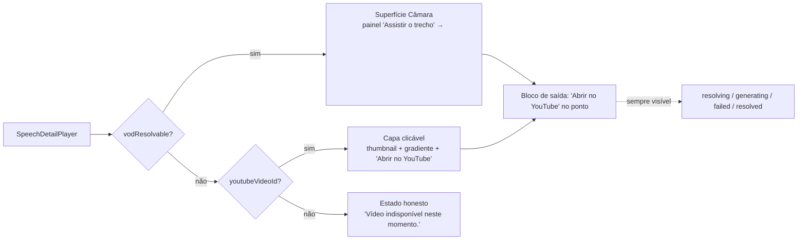

# Impl: Acervo: o player do YouTube deixa de ser uma parede de signin

Status: executado
Atualizado em: 2026-09-16
Issue: #1081
Intenção: docs/plans/acervo-player-youtube-sem-parede-de-signin.md
Appetite restante: herdado — ~0,5–1 dia eng (um outcome verificável; sem schema)

## Leitura da intenção

- **Outcome:** abrir uma fala com vídeo **nunca** termina numa parede de signin do YouTube; a superfície que o app controla (trecho da Câmara) é o caminho padrão quando existe, e o YouTube vira saída externa em um clique, no ponto exato.
- **O que NÃO negociar:** gate do acervo intacto (communicator/coordinator/candidate; advisor/leader negados fail-closed); crédito "Fonte: Câmara dos Deputados · CC BY 4.0"; **sem** `Consent`/collection/migration; URLs públicas intocadas; transcrição/posicionamento (C162) e seleção/corte (C166/C167) intactos; sem baixar/espelhar/transcodificar; nenhuma cena com a parede de signin.
- **O que reavaliar:** a hipótese de "superfície" como estado (`surface` + `watchVod`) — com o embed removido não há duas superfícies tocáveis, só uma derivável do dado; e a premissa de que a transcrição precisa de ramo de seek no YouTube (o embed morre, o ramo morre).
- **Invariante herdado que o plano não pode furar:** renderizar o detalhe **nunca** chama a Câmara (resolução é sempre sob clique); é o pin `fetchMock` do unit.

## Abordagem recomendada

**Opções consideradas:** A) remover o embed e derivar a superfície do dado (Câmara default quando há VOD; capa clicável quando só há YouTube) | B) click-to-load mantendo o iframe atrás de um clique | C) detecção de bloqueio via IFrame API
**Recomendação:** A — porque o iframe não emite `onError` (não há como detectar o bloqueio) e qualquer embed ainda é a parede a um clique; o aceite literal é "nunca apresenta a parede".
**Rejeitadas:** B porque o clique de play é justamente o gesto que cai na parede — o beco continua; C porque exige `enablejsapi` + polling + estados condicionais e o produto **não** depende de detectar (rabbit hole nomeado na intenção).

### Decisões de engenharia

- **D1 — Superfície derivada do dado vs estado `surface`.**
  Opções: A) derivar de `vodResolvable`/`youtubeVideoId` e apagar o estado `surface` | B) manter `surface` com valor inicial ajustado.
  Recomendação: A porque, sem embed, só resta uma superfície tocável (a Câmara) e um fallback de capa; o estado seria máquina de 2 estados com **produtor morto** (`watchVod`).
  Alternativas rejeitadas: B porque mantém `watchVod`, o terceiro estado impossível (`youtube` "superfície") e um `seekTo` ramificado morto.

- **D2 — Semântica da capa.**
  Opções: A) `<a href={youtubeWatchUrl} target="_blank" rel="noreferrer">` (via `Button asChild`) estilizado como facade | B) `<button>` + `window.open`.
  Recomendação: A porque a capa **é** um link externo; `<a>` dá role link, atalhos e menu de contexto, e é o padrão do repo (`SpeechDetailPlayer.tsx:411-421`, `:508-513`).
  Alternativas rejeitadas: B porque perde semântica/atalhos e divergiria do bloco de saída.

- **D3 — Camada da capa (thumbnail real vs gradiente).**
  Opções: A) `background-image` CSS com `https://i.ytimg.com/vi/<id>/hqdefault.jpg` **sobre** gradiente, em `` | B) `` | C) só gradiente, sem asset.
  Recomendação: A porque reusa o precedente de capa YouTube (`SpeechCutPlayer.tsx:16-17`, `SpeechCutResultCard.tsx:68-73`), degrada para o gradiente se o asset faltar **sem ícone quebrado** e não exige estado cliente.
  Alternativas rejeitadas: B porque requer estado de erro que o artefato não pede; C porque a cena B aprovada usa a capa real (o selo "NEEDS ASSET" é anotação do design, não UI).

- **D4 — Bloco de saída sem o botão "Assistir na Câmara".**
  Opções: A) remover o botão; manter copy + link no ponto (variante Câmara) e portar a caixa da cena B (variante capa) | B) manter o botão como "tentar a Câmara de novo".
  Recomendação: A porque a Câmara **já é** a superfície padrão; um botão que não troca superfície é ruído, e sem VOD ele prometeria uma superfície inexistente.
  Alternativas rejeitadas: B porque duplica o próprio estado atual / mente quando `vodResolvable` é falso.

- **D5 — Transcrição/seek sem embed.**
  Opções: A) `seekable = Boolean(playbackUrl)`; clique só age na superfície da Câmara; frases inertes fora do modo de seleção quando não há `<video>` | B) clique na frase abre o YouTube externo no ponto.
  Recomendação: A porque a seleção (C166) já é a forma de marcar trecho e o link externo já existe no bloco de saída; B mudaria o contrato C162/C166 (clique = posicionar).
  Alternativas rejeitadas: B porque navegar a partir de uma frase é surpreendente e fura o modo de seleção. **Não escopo com gatilho:** se produto pedir "clique na frase abre o YouTube", revisitar.
  **`activeStart`/`onTimeUpdate` permanecem** (destaque da frase + ponto do link externo via `youtubeWatchUrl`).

- **D6 — Componente da capa: inline vs arquivo novo.**
  Opções: A) inline no owner `SpeechDetailPlayer.tsx` | B) `SpeechYoutubeFacade.tsx`.
  Recomendação: A (depth check) porque há **1 call site** e nenhuma volatilidade — extrair seria pass-through raso; o owner do player já existe.
  Alternativas rejeitadas: B porque cria artefato sem 3º uso ("edit the owner, don't twin").

- **D7 — Código morto morre no mesmo delivery.**
  Opções: A) remover `buildYoutubeSrc`, `youtubeStart`, `watchVod`, `inlineNotice`, `pendingSeekRef` e o ramo `youtube` de `seekTo` | B) deixar e marcar.
  Recomendação: A porque knip exige **0 exports mortos** e `engineering-standards` manda "dead code dies immediately".
  Alternativas rejeitadas: B porque deixaria o player com dois caminhos de seek, um inalcançável.
  _Nota:_ com o embed removido, `pendingSeekRef` fica sem produtor (clique na frase exige `playbackUrl`, logo o `<video>` já existe); o efeito de seek preserva o deep link via `initialSeconds`.

- **D8 — Serialização de merge com C172/C173.**
  Opções: A) C178 rebasa **depois** de C172/C173 e resolve o conflito preservando o ponto do link externo (C172) e a seleção/playback (C173) | B) C178 entra primeiro e C172/C173 rebasam.
  Recomendação: A porque C178 remove o start do embed que C172 altera; quem entra depois sabe o que morre e preserva `buildSpeechExcerptYoutubeUrl`/`youtubeOffsetSeconds` (que C178 **continua** usando na capa e no bloco de saída).
  Alternativas rejeitadas: B porque C172 passaria a alterar linhas removidas e o rebase encheria de conflito artificial.

### Componentes / mudanças

- **`SpeechDetailPlayer`** (`src/components/campaign/speech/SpeechDetailPlayer.tsx`): owner único da mudança. Deriva a superfície de `vodResolvable`/`youtubeVideoId`; `renderMedia` perde o ramo `iframe` e passa a servir (a) painel/`<video>` da Câmara quando `vodResolvable`, (b) capa quando só YouTube, (c) estado honesto quando nenhum; `seekTo` Câmara-only; `seekable = Boolean(playbackUrl)`; bloco de saída simplificado (sem botão "Assistir na Câmara"; visível em todos os estados). Remoções: `surface`, `youtubeStart`, `buildYoutubeSrc`, `watchVod`, `inlineNotice`, `pendingSeekRef`, ramo `youtube` de `seekTo`. Reusa `SpeechCutPlayer`/`SpeechCutResultCard` como precedente de capa, `YoutubeIcon`, `Button asChild` e `StatusPanel`.
- **Capa (cena B)**: `<a>` estilizado (`aspect-video`, `rounded-lg border bg-stone-900`, gradiente de fallback, thumbnail como camada de fundo, badge "Vídeo no YouTube", play circular, rodapé "Abrir no YouTube"), `data-slot="speech-youtube-facade"`, `aria-label="Abrir este trecho no YouTube"`. **Não portar** os selos de artefato ("NEEDS ASSET", "Caminho removido / aqui ficava a parede de signin").
- **Migration:** sem migration (nenhum campo/collection muda).
- **Access / Consent:** sem mudança — gate do acervo e crédito CC BY 4.0 permanecem no `page.tsx`; sem nova chave `Consent`, sem fail-closed novo.
- **UI:** Impeccable B — encaixe na superfície do player; port direto do artefato aprovado (cenas A/B/loading), sem shell novo e sem redesenho. O `designer` é dono da estrutura visual; a engenharia liga dados/rotas/copy no markup aprovado.
- **Testes:** `tests/unit/speechDetailPlayer.unit.spec.tsx` reescrito nos quadrantes YouTube/C171/C171-F1/C166 (nunca `iframe`; capa + link externo no ponto; Câmara default com ambos; saída visível em loading/falha) e `tests/e2e/campaignSpeechAcervo.e2e.spec.ts` ajustado (both-sources sem `youtube.com/embed`; caso YouTube-only com capa; VOD-only; sem vídeo). Alvo por `data-slot`/role — **não** usar `getByText` com múltiplos "Abrir no YouTube". E2E é browserless (não vê a parede real).

### Dados → forma (se aplicável)

- **Forma escolhida:** a superfície do player é **feedback de ação**, não apresentação de dado de acervo — dois estados honestos derivados da disponibilidade da fonte (Câmara tocável / capa com saída externa). Por isso: sem badge de dado, sem KPI, sem gráfico.
- **Rejeitadas:** card de "status do vídeo" (seria dado novo não pedido); indicador de origem em `%`/métrica (não há dado); tooltip explicativo do bloqueio (o app não detecta o motivo — anti-goal).

## Fases verificáveis

1. **Tracer de superfície (≈40% do appetite, ~0,2–0,4 dia).** Derivar a superfície do dado; remover o embed e o código morto (D1, D5, D7); portar a capa (D2, D3, D6) e simplificar o bloco de saída (D4), sempre visível em `resolving`/`generating`/`failed`/`resolved`. Prova: unit do quadrante VOD-only verde sem mudança e novo unit "nunca iframe / Câmara default com ambos / capa + link no ponto / saída visível em loading e falha / no-video".
2. **Testes de quadro (≈40%, ~0,2–0,4 dia).** Reescrever os quadrantes YouTube do unit e os blocos C171/C171-F1/C166 que dependiam do embed; ajustar o e2e both-sources (sem `youtube.com/embed`, com Câmara + exits, `watch?v=...&t=2677`); adicionar e2e YouTube-only (capa server-rendered, sem `<iframe>`/`<video>`); manter VOD-only e no-video. Alvo por `data-slot`/role.
3. **Gates (≈20%).** `pnpm gate:fast` (lint + typecheck + unit) e `pnpm push` (`gate:ci`). Sem migration a rodar. Evidência final de aceite no **staging** com a fala 997 (responsabilidade do dono).

## Rabbit holes / Não escopo (engenharia)

- **IFrame API / detecção de bloqueio** (`enablejsapi`, eventos, polling, estados condicionais) — o plano não depende de detectar.
- **Click-to-load / facade que ainda monta o iframe** — a parede continua a um clique.
- **Seek do clique na frase para o YouTube externo** — não escopo; gatilho: produto pedir explicitamente "clique na frase abre o YouTube".
- **OAuth/SSO no YouTube, proxy de mídia, re-hospedar/baixar/transcodificar.**
- **Auto-resolve da Câmara no render** — violaria o invariante "render nunca chama a Câmara" (pin do unit).
- **Componente/shell/rota nova** para a capa — owner único, 1 call site.
- **Redesenhar paleta/estrutura/hierarquia** além do port — é do `designer`.
- **Portar anotações do artefato** ("NEEDS ASSET", "Caminho removido") — comentário de design, não UI.

## Riscos e mitigação

- **Regressão dos pins C171/C171-F1/C166 que assumem o embed.** Mitigação: reescrever os testes no mesmo delivery e provar verde antes/depois; o comportamento de seleção/share/corte é preservado (só muda a superfície de origem).
- **Conflito de merge com C172/C173 (mesmo arquivo).** Mitigação: rebase após ambos (D8); preservar `youtubeOffsetSeconds` e `buildSpeechExcerptYoutubeUrl` — o ponto continua sendo o contrato do link externo; a remoção do start do embed torna o trecho de C172 no iframe obsoleto de propósito.
- **Thumbnail indisponível/edge (imagem 404, rede).** Mitigação: gradiente por baixo via CSS; sem `` nem estado de erro.
- **Ambiguidade "Abrir no YouTube" (capa + bloco de saída).** Mitigação: `data-slot` distintos (`speech-youtube-facade` / `speech-youtube-exit-link`) e testes por role+slot, nunca `getByText` solto.
- **E2E browserless não enxerga a parede real.** Mitigação: o e2e cobre o contrato HTML (sem embed, sem `<iframe>`); o aceite de "não acaba em signin" é validado no staging com a fala 997.
- **Perda da transcrição posicionável no quadrante só-YouTube.** Mitigação: label cai para "Transcrição" e frases inertes fora da seleção, exatamente como hoje quando o offset é desconhecido; a seleção (C166) continua ativa.

## Triage pós-simplify + crítica de design (não reabrir)

**Registrado:** C179 (#1093) — helper único da URL do thumbnail `hqdefault` (4 módulos; `depends: C172`); OPS124 (#1094) — knip carrega `payload.config.ts` com erro (`importMap.js` commitado) e roda com análise degradada em CI e local, mas **sai com código 0** (a hipótese inicial de que quebrava o `gate:ci` local foi corrigida na própria Issue; pré-existente, não é regressão desta entrega).

**Defer com gatilho:** duplicação do markup do bloco de saída (`renderYoutubeExit`) — revisitar com uma 3ª variante/superfície de saída ou reuso fora do `SpeechDetailPlayer`; testes unit quase-duplicados (VOD-only vs both-sources) — descartado (legibilidade dos quadrantes).

**Crítica do `designer` (tier `openai/gpt-5.6-sol`) — não certificada, decisão humana registrada:** ajustes de paridade aplicados (exit primário quando a Câmara deixa o ocioso + download em outline; bloco de saída em linha no desktop e empilhado com CTA full-width no mobile; escala/offsets responsivos da capa; `justify-between` da caixa só no desktop). Divergências materiais **aceitas pelo humano em 2026-09-16**: a transcrição permanece no estado só-YouTube (guardrail C162; a cena B do artefato não cobre a seção) e o aviso C166 "Compartilhar por link exige o vídeo no YouTube" permanece no só-VOD (elemento pré-existente pinado por teste; o artefato não cobre o quadrante).

## Aceite de engenharia

- [ ] Aceite de produto da intenção ainda coberto (nunca a parede; Câmara default quando há VOD; capa com saída externa no ponto; fala 997 validada no staging pelo dono)
- [ ] Invariantes AGENTS/engineering-standards respeitados (sem `Consent`/collection/migration; sem URL pública nova; gate do acervo intacto; "edit the owner, don't twin"; knip 0 exports mortos)
- [ ] Testes de domínio previstos onde o contrato muda (unit do player reescrito; e2e ajustado/adicionado; nenhum write path novo)
- [ ] `pnpm gate:fast` e `pnpm push` verdes; evidência do e2e browserless no PR

Self-score (decision-quality): **5/5** — (1) as decisões caras (D1–D3, D8) têm opções e rejeitadas explícitas; (2) a abordagem cabe no appetite de ~0,5–1 dia sem schema; (3) rabbit holes nomeados (iframe/detecção/seek externo/auto-resolve); (4) depth check reusa o owner, o precedente de capa e `Button asChild`, sem extrair abstração; (5) o outcome de produto é preservado — a engenharia só troca a porta de entrada, não o aceite.
