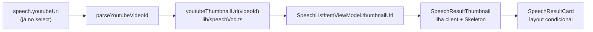

# Impl: Acervo: preview do trecho na listagem de falas

Status: executado
Atualizado em: 2026-09-16
Issue: #1085
Intenção: docs/plans/acervo-preview-do-trecho-na-listagem.md
Design UI: docs/plans/acervo-preview-do-trecho-na-listagem-ui-design.html
Appetite restante: ~0,5–1 dia (herdado, sem corte)

## Leitura da intenção

- **Outcome:** quem varre `/campanha/comunicacao/acervo` reconhece o trecho pela imagem e decide qual fala abrir, sem abrir fala por fala. Um outcome verificável: card com miniatura quando há vídeo, card como hoje quando não há.
- **O que NÃO negociar (guardrails):**
  - Nada de player, autoplay ou hover-play; a miniatura é estática e `SpeechResultCard.tsx:49` continua server component.
  - Nada de extração/render de frame no servidor, ffmpeg ou fila — "meio do trecho" é a melhor miniatura padrão do vídeo, nunca um seek; a UI não promete precisão que o dado não tem.
  - Nada de espelhamento/backfill de capas: hotlink declarado.
  - Nada novo de Consent/LGPD e nenhuma exposição além do que a fala já expõe na lista (`youtubeUrl` já vai no `speechListSelect`, `speechPageData.ts:41`).
  - Não mexer em busca/excerto/highlight (`SpeechHighlightParts`, `matchKind`); sem espaço de mídia reservado quando não há vídeo; `leader`/`advisor` seguem fora do acervo.
- **O que reavaliar:** a variante literal (a intenção recomendou `hqdefault` e o e2e existente já pina `hqdefault` — `campaignSpeechCut.e2e.spec.ts:152`); "meio do trecho" como promessa (resolvido como melhor miniatura disponível); miniatura decorativa vs clicável (o artefato aprovado a envolve em `<a>` → mesmo `watchHref`); mostrar sempre que houver vídeo (não só `matchKind === 'segment'`).

## Abordagem recomendada

**Opções consideradas:** A) derivar no domínio — campo `thumbnailUrl` no `SpeechListItemViewModel` + ilha client de loading + raw `` (recomendada) | B) expor `youtubeVideoId` no VM e montar a URL no componente, sem estado de loading | C) derivar de `speech.sourceUrl` e/ou usar `next/image`.

**Recomendação:** A. O VM é o dono dos links do card (header de `speechViewModels.ts:1-5`); o dado já chega (`speechListSelect` já seleciona `youtubeUrl: true`); o estado de loading do artefato (cena 03) exige uma ilha client pequena; o precedente de miniatura no acervo é raw `` (`SpeechCutResultCard.tsx:67-74`).

**Rejeitadas:** B — espalha o contrato do CDN no componente e perde a cena 03; C — `sourceUrl` prioriza `officialTextUrl` (`speechViewModels.ts:207`), que pode ser a taquigrafia da Câmara, não o YouTube (bug de imagem errada); `next/image` quebra o e2e browserless (o stub só serve `localhost/thumbs/<id>.jpg`; `i.ytimg.com` 404 → console error do guard, `youtube-stub.mjs:6-11`) e não há ganho num asset externo estático de 128×80.

### Decisões de engenharia

1. **Onde a URL nasce** — Opções: (A) função pura `youtubeThumbnailUrl(videoId)` em `src/lib/speechVod.ts` + campo `thumbnailUrl: string | null` montado em `toSpeechListItemViewModel`; (B) expor `youtubeVideoId` no VM e montar a URL no card; (C) derivar de `speech.sourceUrl` no card. **Recomendação:** A — o módulo já é puro/client-safe ("No I/O here", `speechVod.ts:6`) e o VM já importa `parseYoutubeVideoId` (`speechViewModels.ts:19`). **Rejeitadas:** B (contrato `i.ytimg.com` no componente); C (fonte errada quando há `officialTextUrl`).
2. **Variante da imagem** — Opções: `hqdefault` (480×360, sempre existe) | `mqdefault` (320×180, 16:9). **Recomendação:** `hqdefault` — consistente com todo o repo (`SpeechCutResultCard.tsx:70`, `SpeechCutPlayer.tsx:17`, `corte/[id]/page.tsx:40`) e pinada pelo e2e; `object-cover` corta as barras. **Rejeitada:** `mqdefault` (não usada em lugar nenhum; a intenção recomendou A).
3. **Elemento de imagem** — Opções: raw `` com dimensões fixas | `next/image`. **Recomendação:** raw `` com `eslint-disable-next-line @next/next/no-img-element` (precedente `SpeechCutResultCard.tsx:68`). **Rejeitada:** `next/image` (e2e nunca alcança `i.ytimg.com`; sem ganho no asset).
4. **Estado de loading (cena 03)** — Opções: ilha client `SpeechResultThumbnail` com `Skeleton` atrás do `` e revelação no `onLoad` | caixa sem JS com `bg-muted` | pulse permanente via CSS. **Recomendação:** ilha client; `onError` também encerra o pulse e degrada para slot neutro (vídeo removido não vira ícone de imagem quebrada nem pulse eterno). **Rejeitadas:** caixa sem JS (perde a affordance aprovada — divergência silenciosa); pulse permanente por CSS (anima todo card da lista — guardrail de performance).
5. **Miniatura clicável** — Opções: decorativa | mesmo `watchHref`. **Recomendação:** mesmo `watchHref` em `Link` com `aria-label="Assistir no trecho"` e `alt=""` decorativo — alvo maior sem ação nova; o artefato a envolve em `<a>`. **Rejeitada:** decorativa (alvo menor que o aprovado).
6. **Layout** — Opções: linha com `mt-2 flex flex-col items-start gap-3 sm:flex-row sm:gap-4` | `
` de hoje. **Recomendação:** com miniatura usa o flex (mobile empilha — cena 02, desktop em linha — cenas 01/03) com `min-w-0 flex-1` no wrapper do excerto; sem miniatura mantém exatamente o `
` atual (`SpeechResultCard.tsx:83`) — nenhum espaço de mídia reservado. **Rejeitada:** reservar o slot sempre (viola o guardrail do aceite).
7. **Testes** — unit: `youtubeThumbnailUrl` em `tests/unit/speechVod.unit.spec.ts` e novo `tests/unit/speechViewModels.unit.spec.ts` cobrindo `thumbnailUrl` (presente / `null` sem vídeo / URL não-YouTube / `sourceUrl` intocado); int: 1 asserção em `tests/int/speechAcervo.int.spec.ts` de que o loader propaga o campo (o `speechBundleFixture` já aceita `youtubeUrl`, `speechBundleFixture.ts:29`); e2e: asserções no teste de busca existente de `campaignSpeechAcervo.e2e.spec.ts:132-183` (HTML do card contém `i.ytimg.com/vi/<id>/hqdefault.jpg`; fala sem YouTube não contém miniatura). **Rejeitadas:** spec e2e novo (o fluxo já é coberto); snapshot de imagem.
8. **E2E local (OPS72)** — Opções: rodar `pnpm test:e2e:affected` | e2e full. **Recomendação:** affected — o diff toca `src/lib/speechVod.ts`, `src/utilities/speech` e `src/components/campaign/speech`, que o manifesto mapeia para `campaignSpeechAcervo` + `campaignSpeechCut` (`e2e-affected-manifest.mjs:305-314`). **Rejeitada:** e2e full (o `verify` do deploy já o roda).

### Componentes / mudanças

- **`youtubeThumbnailUrl(videoId: string | null | undefined): string | null`** (`src/lib/speechVod.ts`): nova função pura ao lado de `parseYoutubeVideoId` (`speechVod.ts:135`); retorna `https://i.ytimg.com/vi/<id>/hqdefault.jpg` ou `null`. Reusa o contrato de id já testado; não faz I/O.
- **`SpeechListItemViewModel` / `toSpeechListItemViewModel`** (`src/utilities/speech/speechViewModels.ts:44-58`, `:172-209`): novo campo `thumbnailUrl: string | null`, montado como `youtubeThumbnailUrl(parseYoutubeVideoId(speech.youtubeUrl))`; derivado do que `speechListSelect` já traz (`speechPageData.ts:29-42`), sem query nova.
- **`SpeechResultThumbnail`** (`src/components/campaign/speech/SpeechResultThumbnail.tsx`, novo): ilha client com `'use client'`; recebe `href` e `src`; renderiza `Link` (`h-20 w-32 shrink-0`) envolvendo `Skeleton` absoluto (cena 03, `animate-pulse`) + `` raw, encerrando o skeleton em `onLoad`/`onError` (vídeo removido degrada para o slot neutro). Imagem em cache é coberta checando `img.complete` no mount (o `onLoad` não dispara de novo); `prefers-reduced-motion` já zera o pulse.
- **`SpeechResultCard`** (`src/components/campaign/speech/SpeechResultCard.tsx:83-85`): troca o bloco do excerto pelo flex condicional (decisão 6), renderizando `SpeechResultThumbnail` só quando `speech.thumbnailUrl` existe. Nenhuma mudança em CTAs (`:112-125`), chips ou excerto.
- **Migration:** sem migration (nenhum campo de coleção/global novo).
- **Access / Consent:** sem mudança — `youtubeUrl` já é selecionado e já é exposto no detail VM (`speechViewModels.ts:259`) e no fallback de `sourceUrl`.
- **UI:** Impeccable B; port classe-a-classe do artefato aprovado (cenas 01/02/03), sem inventar variante de estilo.

### Dados → forma

Não se aplica. A entrega não cria agregado, contagem, gráfico ou tabela: é uma URL de imagem derivada de um campo existente, para reconhecimento visual. Nenhuma decisão numérica nasce aqui (a intenção já fecha "Vou apresentar dados? Não").

## Fases verificáveis

1. **Domínio/VM (unit-first):** adicionar `youtubeThumbnailUrl` e o campo `thumbnailUrl`; escrever os casos unit em `tests/unit/speechVod.unit.spec.ts` e o novo `tests/unit/speechViewModels.unit.spec.ts` junto. Verificação: `pnpm test:unit -- speechVod speechViewModels` verde.
2. **UI (encaixe no card):** `SpeechResultThumbnail` + layout condicional em `SpeechResultCard`, port do artefato. Verificação: `speechDetailPlayer`/`speechCutDialog` seguem verdes.
3. **Integração e entrega:** `pnpm gate:fast`; e2e local afetado via `pnpm test:e2e:affected` (`campaignSpeechAcervo` + `campaignSpeechCut`); entrega com `pnpm push`.

## Rabbit holes / Não escopo (engenharia)

- **Refatorar as 3 ocorrências existentes** (`SpeechCutResultCard.tsx:70`, `SpeechCutPlayer.tsx:17`, `corte/[id]/page.tsx:40`) para o helper novo: blast radius em `corte/[id]` e no player, e o e2e pina o literal (`campaignSpeechCut.e2e.spec.ts:152`) — vira débito com gatilho (o próximo toque em capa de corte extrai o helper compartilhado e atualiza o pino).
- Backfill/mirroring de thumbnails no S3, extração de poster do MP4 com ffmpeg, frame exato "do meio do trecho", player/hover-play na lista — todos já cortados na intenção; nenhum reabre aqui.
- Miniatura do VOD da Câmara quando não há YouTube: fica para avaliação pós-uso real; sem YouTube → sem mídia.
- Trocar `next/image`, `blurDataURL`, placeholder local ou `next.config.mjs` `remotePatterns` (já contém `i.ytimg.com`, mas o e2e não o alcança — irrelevante aqui).

## Riscos e mitigação

- **CLS / pulo de layout:** dimensões fixas `h-20 w-32` no slot e no Skeleton; `shrink-0` no mobile; o excerto recebe `min-w-0 flex-1`.
- **Imagem externa hotlinkada:** sem mirroring (fora de escopo declarado); `loading="lazy"` + `decoding="async"`; `onError` degrada para slot neutro silencioso.
- **Skeleton preso:** imagem em cache pode não disparar `onLoad` após hidratar — mitigado checando `img.complete` no mount.
- **Duplicação do contrato `i.ytimg.com` (3 lugares):** aceita nesta entrega como débito com gatilho (a próxima ocorrência extrai o helper compartilhado).
- **e2e browserless não busca a imagem:** o teste lê o HTML e assere a URL (`i.ytimg.com/.../hqdefault.jpg`); por isso raw `` é seguro e `next/image` seria instável.
- **Regressão de acessibilidade:** `alt=""` decorativo + `aria-label` no `Link` preservam o nome acessível do CTA já existente.

## Aceite de engenharia

- [x] Aceite de produto da intenção ainda coberto: card mostra miniatura quando há vídeo, sem espaço reservado quando não há; a miniatura reflete a fala do resultado; guardrails de performance e LGPD intactos.
- [x] Invariantes AGENTS/engineering-standards: identificadores em inglês, UI da campanha com `data-theme='campaign'`, sem migration/Consent/access novos, precedente de raw `` respeitado.
- [x] Testes de domínio previstos: unit cobre `youtubeThumbnailUrl`/`thumbnailUrl`, int prova a propagação no loader e e2e cobre o HTML do card.
- [x] `pnpm gate:fast` verde; e2e local afetado verde com `campaignSpeechAcervo` + `campaignSpeechCut`; entrega via `pnpm push`.

## Débitos deferidos (capture-review-debts)

- **Consolidar o contrato `i.ytimg.com`** (4ª ocorrência criada aqui, via `youtubeThumbnailUrl`): migrar `SpeechCutResultCard.tsx:70`, `SpeechCutPlayer.tsx:17` e `corte/[id]/page.tsx:40` para o helper. **Gatilho:** próximo toque em qualquer superfície de capa de corte ou um 4º consumidor de thumbnail; a extração deve manter a URL idêntica (o e2e `campaignSpeechCut.e2e.spec.ts:152` pina o literal).
- **Reavaliar a ilha client `SpeechResultThumbnail`** (uma fronteira de hidratação por linha da lista) se o custo de hidratação de 25 cards aparecer. **Gatilho:** medição/uso real da lista; o fallback é manter o slot fixo `bg-muted` sem o pulse (perde só a cena 03).

### Já resolvido no /simplify (não reabrir)

- `aria-label` da miniatura igual ao label do CTA (não contraditório); `<SpeechExcerpt>` sem duplicação nos dois ramos; parâmetro de `youtubeThumbnailUrl` restrito a `string | null`; `aria-hidden` redundante removido do `Skeleton`; docblock encurtado.

### Descartado

- **Extrair a miniatura de `SpeechCutResultCard` num componente único** (twin apontado pelo revisor): os dois têm contratos distintos (o de cortes não tem skeleton/`Link`); o que é compartilhável — a URL — já tem dono em `youtubeThumbnailUrl`. Fica no débito acima.
- **Inline do helper com 1 call site:** mantido porque nomeia o contrato do CDN (o dono da consolidação do débito) e é unit-testável isolado.

## Self-score (decision-quality)

5/5 — (1) decisões caras com rejeitadas explícitas (as 8 nomeiam alternativas e o motivo do descarte); (2) a abordagem cabe no appetite ~0,5–1 dia (mudança aditiva de VM + um componente); (3) rabbit holes nomeados (as 3 ocorrências existentes, backfill, ffmpeg); (4) depth check: reusa `parseYoutubeVideoId`, o `Skeleton` da casa e o precedente de raw ``, sem query/access novos; (5) a intenção permanece satisfeita — a engenharia não reescreveu o outcome.
