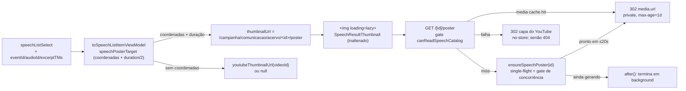

# Impl: Acervo: o preview de cada fala mostra um frame do meio daquela fala

Status: aprovado
Atualizado em: 2026-09-16
Issue: #1104
Intenção: docs/plans/acervo-preview-frame-do-meio-da-fala.md
Design UI: N/A — sem UI nova (o slot `h-20 w-32` e o `Skeleton` são os de C175; só muda a origem da imagem)
Appetite restante: ~1–1,5 dia (herdado, sem corte)

## Leitura da intenção

- **Outcome:** cada resultado da busca/lista do acervo mostra uma imagem da PRÓPRIA fala (um frame do meio, `excerptTMs + durationSeconds/2` extraído do VOD da Câmara), não a capa da sessão; falas da mesma sessão deixam de repetir a mesma imagem. Sem VOD, cai na capa do YouTube (fallback honesto) — nunca imagem quebrada.
- **O que NÃO negociar (guardrails):**
  - Geração sob demanda e cacheada; **nunca bloqueia a listagem** (miniatura pequena, `lazy`, sem CLS, estática — nada de player/hover-play).
  - Nada novo de Consent/LGPD e nenhuma exposição além do que a fala já expõe na lista (o VM não pode carregar a URL crua do VOD).
  - O instante é `excerptTMs + durationSeconds/2`; sem curadoria de frame, sem heurística de “frame feio”.
  - `corte/[id]` público, o helper `hqdefault` (C179/#1093) e a busca/excerto/highlight ficam intactos; `leader`/`advisor` seguem fora do acervo.
- **O que reavaliar (hipóteses do plano):**
  - **Elegibilidade:** `speechVodCoordinates` exige um VOD **armazenado** (é o sinal do _player_, `speechVod.ts:58-65`). Para o poster, o critério honesto é ter as **coordenadas do trecho na Câmara** (`eventId`/`audioId`/`excerptTMs`) — senão a maioria das falas importadas (sem link cacheado) ficaria sem frame, contrariando o aceite. O VOD armazenado vira apenas `cachedUrls` (ajuda, não habilita).
  - **Disparo:** geração síncrona num request de browser (imagem) não serve: o app está atrás do Cloudflare Tunnel (limite de ~100s por request) e o próprio repo trata trabalho longo com job em `after()` + poll (`cortar` + `cortar/status`, `speechCutScheduler.ts:15-19`). O desenho abaixo espera um **teto curto** e deixa a geração terminar em background.
  - **Cache sem migration:** o precedente `speechCut.media` exige campo novo em `Speech` (migration → hard-stop do modo autônomo). O cache vai por **nome de arquivo determinístico na `media`** (zero schema).

## Abordagem recomendada

**Opções consideradas:** A) cache por nome determinístico em `media` + rota interna que gera sob demanda com espera curta e conclui em background (recomendada) | B) campo `poster` (relationship) em `Speech` + job | C) gerar no render do RSC ou job a cada listagem | D) manter `hqdefault` trocando só a variante.

**Recomendação:** A. Entrega o frame real da fala **sem migration** (hard-stop do modo), reusa `Media` + o proxy `/api/media/file/...`, `resolveSpeechVod`, `downloadSource`/`runFfmpeg` (extraídos do corte) e o slot C175 intacto. O `` só dispara para linhas na viewport, e a listagem nunca espera além do teto curto.

**Rejeitadas:** B — campo novo em coleção → migration e Issue `blocked`; C — RSC síncrono baixa/roda ffmpeg no caminho da página ou dispara N jobs por varredura (viola “nunca bloqueia”); D — é exatamente o defeito reaberto.

### Decisões de engenharia

1. **Critério de elegibilidade** — Opções: (A) coordenadas da Câmara (`eventId`+`audioId`+`excerptTMs`) + `durationSeconds > 0`; (B) `speechVodCoordinates` (exige VOD armazenado); (C) só `youtubeUrl`. **Recomendação:** A — é o que o aceite pede (“fala com VOD da Câmara”); B deixa de fora falas resolvíveis mas nunca resolvidas, C é o defeito. **Rejeitadas:** B (sub-entrega silenciosa), C (defeito).
2. **Onde a geração é disparada** — Opções: (A) imagem aponta para uma rota interna que gera-e-cacheia; (B) no render da lista; (C) job a cada listagem. **Recomendação:** A — o RSC só monta a string da URL (puro); o browser pede só o que entra na viewport; uma geração por fala, cacheada. **Rejeitadas:** B (ffmpeg/download no caminho crítico), C (custo por varredura e miniatura neutra transitória).
3. **Latência do request de imagem** — Opções: (A) espera curta (teto literal `SPEECH_POSTER_WAIT_MS = 20_000`) e, se a geração não terminou, responde a capa enquanto ela continua em background via `after()`; (B) espera síncrona até completar; (C) sempre responder capa e só gerar em background. **Recomendação:** A — entrega o frame já na primeira varredura quando a geração é rápida, nunca encosta no teto do Cloudflare (~100s) e se auto-aquece quando é lenta. **Rejeitadas:** B (risco de 524 e request preso por minutos), C (a primeira varredura mostraria só a capa — o defeito).
4. **Instante do meio** — Opções: (A) baixar o MP4 do trecho (coordenadas em `excerptTMs`) e extrair o frame em `durationSeconds/2`; (B) pedir um trecho novo começando no meio e extrair em t=0. **Recomendação:** A — é literalmente `excerptTMs + durationSeconds/2` e reusa o pipeline do corte, cuja premissa (o trecho começa no início da fala) já é a de `speechCutJob`/C166. **Rejeitada:** B (transcodificação extra na Câmara e semântica do clipe menos previsível).
5. **Cache sem migration** — Opções: (A) `media` com nome determinístico `speech-poster-<id>.jpg`; (B) campo `poster` em `Speech`; (C) disco/tmp. **Recomendação:** A — `Media` já existe, `media.url` já é o proxy do bucket privado (ou disco em dev/test), e o nome é a chave de cache/idempotência. **Rejeitadas:** B (migration hard-stop), C (o container é recriado no deploy; prod é S3).
6. **Como o cache é lido** — Opções: (A) a rota procura `media` por `filename` e responde `302` para `media.url`; (B) expor o id da mídia no VM. **Recomendação:** A — zero schema e o proxy existente faz o streaming. **Rejeitada:** B (vazaria o interior do cache no VM da lista e exigiria achar a mídia no loader).
7. **Dedupe/corrida** — Opções: (A) single-flight em memória + gate de concorrência + `withPayloadTransaction` + `acquireTextAdvisoryLocks(['speech-poster:<id>'])` com re-checagem antes do `create`; (B) só pré-checagem; (C) lock advisory cobrindo download/ffmpeg. **Recomendação:** A — o lock + re-checagem garantem **nunca duas linhas `media`**; download/ffmpeg ficam **fora** da transação (o lock não fica preso por minutos). **Rejeitadas:** B (linhas duplicadas sob concorrência), C (transação longa).
8. **Proteção do homeserver (concorrência)** — Opções: (A) gate simples in-process (`MAX_CONCURRENT_GENERATIONS = 2`) + cache negativo curto (`FAILURE_TTL_MS = 5min`, que também memoriza os `null` de "indisponível/gerando") por fala; (B) sem limite; (C) fila persistente. **Recomendação:** A — a varredura pede várias imagens de uma vez e o homeserver (8c/16GB, link compartilhado) não deve baixar 8 trechos em paralelo; o cache negativo evita repetir uma geração que acabou de falhar. **Rejeitadas:** B (rajada de downloads), C (fila nova é rabbit hole de produto).
9. **Reuso do pipeline de mídia** — Opções: (A) extrair `downloadSource`/`runFfmpeg` de `speechCutJob.ts` para `src/utilities/speech/speechMediaPipeline.ts` e importar nos dois; (B) copiar; (C) importar `speechCutJob` no job do poster. **Recomendação:** A — mesma responsabilidade, dois call sites (“edit the owner, don't twin”). **Rejeitadas:** B (twin), C (acopla poster a corte).
10. **Tamanho do still** — Opções: (A) `-vf scale=480:-2 -frames:v 1 -q:v 2`; (B) resolução cheia; (C) `imageSizes` na `Media`. **Recomendação:** A — dezenas de KB, sem tocar em schema/config. **Rejeitadas:** B (peso na listagem), C (migration hard-stop + afeta todos os uploads).
11. **Contrato do VM** — Opções: (A) manter `thumbnailUrl: string | null` e nele escolher frame vs capa; (B) `posterUrl` ao lado de `thumbnailUrl`. **Recomendação:** A — o card tem um slot único; a escolha é do dono do link. **Rejeitada:** B (duas fontes concorrentes sem ganho).
12. **Fallback** — Opções: (A) falha → `302` para a capa do YouTube quando houver, senão `404` (o `onError` de `SpeechResultThumbnail` já assenta no slot neutro); (B) sempre `404`; (C) imagem quebrada. **Recomendação:** A — fallback honesto do aceite. **Rejeitadas:** B (perde reconhecimento parcial), C (proibida).
13. **Testes** — unit: helpers puros + VM; int: geração/cache e a fiação do loader; e2e: atualizar os pinos do acervo (o fixture tem coordenadas → passa a apontar para a rota). **Rejeitadas:** spec e2e novo; e2e buscar a rota (browserless — bateria na Câmara de verdade).

### Componentes / mudanças

- **`src/lib/speechPoster.ts` (novo, puro/client-safe):** `speechPosterOffsetSeconds(durationSeconds)` → `floor(d/2)` ou `null`; `speechPosterTarget(speech)` → `{ eventId, audioId, excerptTms, offsetSeconds } | null` (coordenadas da Câmara + duração num só dono, sem exigir VOD armazenado); `speechPosterFilename(id)` → `speech-poster-<id>.jpg`; `speechPosterHref(id)` → `${CAMPAIGN_COMMUNICATION_ACERVO}/${id}/poster`; `buildSpeechPosterFfmpegArgs({ inputPath, outputPath, atSeconds })` → `['-nostdin','-hide_banner','-y','-ss',<at>,'-i',input,'-frames:v','1','-vf','scale=480:-2','-q:v','2','output]`.
- **`src/lib/speechVod.ts`:** extrai `speechExcerptCoordinates(source)` (as 3 coordenadas) e mantém `speechVodCoordinates = armazenado ? speechExcerptCoordinates : null` — um dono para as duas leituras, sem mudar o contrato do player (`speechVod.ts:58-65`).
- **`src/utilities/speech/speechViewModels.ts`:** `SpeechListRecord` ganha só `eventId?`, `audioId?`, `excerptTMs?` (os links de VOD ficam fora da query da lista); `toSpeechListItemViewModel` monta `thumbnailUrl = speechPosterTarget(speech) ? speechPosterHref(speech.id) : speechCoverUrl(speech.youtubeUrl)`. Nenhuma URL crua do VOD entra no VM. O `speechCoverUrl` (novo em `lib/speechVod.ts`, composição de `parseYoutubeVideoId` + `youtubeThumbnailUrl`) é o mesmo usado pelo fallback da rota.
- **`src/utilities/speech/speechPageData.ts:33-46`:** `speechListSelect` ganha `eventId`, `audioId`, `excerptTMs`, `vodPlaybackUrl`, `vodDownloadUrl` (o loader já entrega a linha ao VM).
- **`src/utilities/speech/speechMediaPipeline.ts` (novo, `server-only`):** `ffmpegBinary`, `downloadSource(url, destination)`, `runFfmpeg(args, durationSeconds)` e os literais de teto/timeout, extraídos de `speechCutJob.ts:39-51,119-176` sem mudança de comportamento.
- **`src/utilities/speech/speechCutJob.ts`:** passa a importar o pipeline extraído; remove as cópias locais.
- **`src/utilities/speech/speechPosterJob.ts` (novo, `server-only`):** `findSpeechPosterMedia(payload, id)`; `ensureSpeechPoster(payload, id)` (single-flight por id + gate de concorrência + cache negativo; carrega a fala por `overrideAccess: true` lendo `eventId/audioId/excerptTMs/vod*/durationSeconds/youtubeUrl/speechAt`; `resolveSpeechVod(coords, { policy: SPEECH_VOD_PLAYER_POLICY, cachedUrls })`; `downloadSource` + `buildSpeechPosterFfmpegArgs` + `runFfmpeg` em `mkdtemp`; `withPayloadTransaction` com `acquireTextAdvisoryLocks(['speech-poster:<id>'])` + re-checagem + `payload.create({ collection:'media', data:{ alt }, filePath, overrideAccess:true, req })`; `finally` remove o temp). O slot de concorrência é adquirido **antes** de `resolveSpeechVod`, então o teto cobre também a rede. Literais: `SPEECH_POSTER_WAIT_MS = 20_000` (exportado), `MAX_CONCURRENT_GENERATIONS = 2`, `FAILURE_TTL_MS = 300_000`.
- **`src/app/(campaign)/campanha/(app)/comunicacao/acervo/[id]/poster/route.ts` (novo):** `export const dynamic = 'force-dynamic'`; GET lê `getCampaignUser()` e exige `canReadSpeechCatalog` (senão `404`); `ensureSpeechPoster` já cobre cache-hit (uma query) e miss; `after()` mantém o processo vivo e `Promise.race` aplica o teto; frame → `302` com `Location` **relativa** (`media.url` ou a capa absoluta) — não resolvida contra `request.url`, que atrás do túnel carrega host interno — e `Cache-Control: private, max-age=86400`; sem frame → `302` capa do YouTube (se houver) ou `404`, com `Cache-Control: no-store`. Rota **interna** — nenhum contrato de URL pública muda.
- **`src/components/campaign/speech/SpeechResultThumbnail.tsx`:** sem mudança funcional; só o comentário do `eslint-disable` deixa de dizer só “YouTube cover”.
- **Migration:** **sem migration.** (Campo `poster` em `Speech` ou `imageSizes` em `Media` seria hard-stop → Issue `blocked`.)
- **Access / Consent:** nenhum novo; a rota reusa `canReadSpeechCatalog`; a escrita em `media` é bypass admin intencional, como o job de corte (a linha nasce atrás do gate do acervo).
- **UI:** Impeccable A — **sem trigger de designer** (a/b/d): nenhuma superfície, layout, estado ou token novo; o slot e o `Skeleton` são os de C175.

### Dados → forma

Não se aplica. Não nasce agregado, contagem, gráfico ou tabela: é a origem de uma imagem derivada de campos existentes (`excerptTMs`, `durationSeconds`, coordenadas da Câmara). A intenção já fecha “Vou apresentar dados? Não”.

## Fases verificáveis

1. **Puro (unit-first):** `lib/speechPoster.ts` + o refactor `speechExcerptCoordinates`; testes `tests/unit/speechPoster.unit.spec.ts` (offset, filename, href, args com `-frames:v 1`/`scale=480:-2`, elegibilidade) e os casos de `thumbnailUrl` em `tests/unit/speechViewModels.unit.spec.ts`. Verificação: `pnpm test:unit -- speechPoster speechVod speechViewModels` verde.
2. **Pipeline + job + VM/select:** extrair `speechMediaPipeline`, ajustar `speechCutJob`, criar `speechPosterJob`, estender `speechListSelect`/VM. Verificação: `pnpm test:int -- speechCut speechAcervo speechPoster` verde (o corte segue idêntico após a extração).
3. **Rota + e2e + entrega:** rota `[id]/poster`, ajuste dos pinos do acervo, `pnpm gate:fast`, `pnpm test:e2e:affected` (`campaignSpeechAcervo` + `campaignSpeechCut`), entrega com `pnpm push`.

## Rabbit holes / Não escopo (engenharia)

- Backfill/mirroring de posters; gerar para falas sem coordenadas da Câmara.
- Curadoria manual do frame ou heurística de “frame ruim → capa” (a intenção adia; reavaliar com uso real).
- Tocar em `corte/[id]` público, no player ou na capa de corte; consolidar o helper `hqdefault` (C179/#1093).
- Player/hover-play, `next/image`, `blurDataURL`, `remotePatterns`.
- Collection/fila/worker novos; qualquer migration de schema.

## Riscos e mitigação

- **Timeout do Cloudflare (~100s):** o request de imagem nunca espera mais que `SPEECH_POSTER_WAIT_MS`; a geração continua em `after()`; nada de 524 preso.
- **Primeira varredura parcial:** falas cuja geração passa do teto mostram a capa **nesta** visita e o frame nas seguintes (o cache já foi gravado). É o custo de “sob demanda e cacheado”; revisitar com o gatilho abaixo se o produto exigir frame na primeira visita (caminho: retry no cliente ou aquecimento no loader).
- **Rajada no homeserver:** gate de concorrência (2) + `lazy` + cache negativo; no pior caso, trabalho duplicado uma vez, nunca linha/arquivo duplicado.
- **Download grande para uma miniatura:** teto de bytes/timeout herdados (`MAX_SOURCE_BYTES`, `SOURCE_DOWNLOAD_TIMEOUT_MS`), seek de entrada (`-ss` antes de `-i`, barato em arquivo local) e uma geração por fala.
- **Órfão no bucket S3:** se a transação falhar após o upload, o objeto pode ficar sem linha (mesmo comportamento aceito do C167); se o adapter renomear por colisão, a rota regenera — custo, não corrupção.
- **Poluição da biblioteca `media`:** cada poster cria uma linha derivada (`speech-poster-*`), visível no admin de mídia. Aceito nesta entrega (marcar `source`/collection própria exige migration); **gatilho:** a lista de mídia do admin ficar ruidosa.
- **Câmara indisponível/`GERANDO`:** fallback para a capa ou `404` (slot neutro); sem cache negativo eterno (TTL curto) e nova tentativa depois.
- **Vazamento do VOD cru no VM:** o job lê `vod*` só para `cachedUrls` (fora da query da lista); o VM de lista nunca os recebe — coberto por asserção no int.
- **Leitura pública do frame derivado:** `Media.read` é `() => true` e o nome é determinístico (`speech-poster-<id>.jpg`), então quem adivinhar o nome alcança o JPEG no proxy de mídia, fora do gate do acervo. Conteúdo = frame de sessão pública da Câmara, sem PII nem VOD cru; aceito nesta entrega e registrado como risco (a alternativa — rota gated streamando bytes — é mais código e não muda a natureza pública do vídeo-fonte).
- **`excerptTMs`/`durationSeconds` ausentes:** coordenadas ou offset `null` → capa/slot neutro.

## Aceite de engenharia

- [x] Aceite de produto da intenção coberto: fala com coordenadas da Câmara mostra frame do meio; falas da mesma sessão divergem; sem coordenadas mantém a capa (ou slot neutro); nunca imagem quebrada; miniatura `lazy`, sem CLS e sem bloquear a listagem.
- [x] Invariantes AGENTS/engineering-standards: identificadores em inglês, sem migration/Consent/access novos, rota interna (URL pública intacta), `overrideAccess:false` nos reads com `user`, bypass admin intencional documentado nos writes do sistema, transação + `req` na escrita.
- [x] Sem migration; se exigida, Issue `blocked` (hard-stop do modo).
- [x] Testes de domínio previstos: unit cobre os helpers puros + VM; int prova geração/cache/single-flight/cache negativo e o corte segue verde após a extração; e2e do acervo atualizado (lista + rota).
- [x] `pnpm gate:fast` verde; `pnpm test:e2e:affected` verde (`campaignSpeechAcervo` + `campaignSpeechCut`); entrega via `pnpm push`.

## Self-score (decision-quality)

4.5/5 — (1) as decisões caras (cache sem migration, elegibilidade, latência do request, dedupe/lock, reuso do pipeline) têm opções e rejeitadas explícitas; (2) cabe no appetite ~1–1,5 dia (um módulo puro, uma extração mecânica, um job e uma rota fina); (3) rabbit holes nomeados (backfill, curadoria de frame, `corte/[id]`, C179, migration) e o hard-stop tratado; (4) depth check: reusa `Media`/proxy, `resolveSpeechVod`, `withPayloadTransaction`/`acquireTextAdvisoryLocks` e o pipeline extraído do corte — sem collection/fila/worker novos; (5) a intenção permanece satisfeita — o frame do meio da fala sem reescrever o outcome nem o fallback honesto.

## Débitos deferidos (capture-review-debts)

- **Registrado — C185** (`docs/plans/escala-dry-pos-c182.md`, `depends: C182`): F1 poster obsoleto quando `durationSeconds`/`excerptTMs` mudam (nome do cache não carrega o offset) + F2 prova automatizada do estouro do teto e do `Cache-Control` do fallback.
- **Defer com gatilho — D1 (primeira varredura parcial):** fala lenta mostra a capa nesta visita e o frame na seguinte. Gatilho: produto exigir frame na 1ª visita (retry no cliente ou aquecimento no loader).
- **Defer com gatilho — D2 (poluição da `media`):** cada fala vista cria uma linha `speech-poster-*`. Gatilho: a lista de mídia do admin ficar ruidosa (marcador de origem exigiria migration).
- **Defer com gatilho — D5 (órfão S3 / rename por colisão):** objeto sem linha ou regeneração por custo. Gatilho: órfãos crescendo no bucket.
- **Defer com gatilho — D7 (gate in-process):** multiplicaria com múltiplas réplicas. Gatilho: scale-out acima de um container.
- **Descartado — D3 (frame derivado publicamente legível):** decisão travada (conteúdo de sessão pública, sem PII/VOD cru); a alternativa gated foi rejeitada no plano.

### Já resolvido no /simplify (não reabrir)

- `vod*` fora da query da lista; cache negativo cobrindo os `null` de indisponível/gerando; slot de concorrência antes de `resolveSpeechVod`; `rm` do temp antes de liberar o slot; `Location` relativa no 302 (host interno atrás do túnel); `speechPosterTarget` e `speechCoverUrl` como donos únicos; `runFfmpeg` com a copy de fallback do dono; poda do mapa de falhas; tipagem via `PayloadTransactionRequest`; testes de single-flight (1 chamada à API da Câmara) e do cache negativo.
