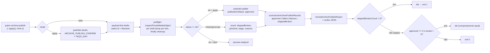

# Impl: C249 — archive:publish: preflight de integridade antes de aprovar drafts

Status: aprovado (modo --auto)
Atualizado em: 2026-10-02
Issue: #1427
Intenção: docs/plans/acervo-publish-preflight-integridade.md
Appetite restante: herdado (~0,5 dia eng; sem migration, sem UI, sem contrato público). Custo distribuído ~70% preflight/CLI, ~20% provas, ~10% runbook.

## Leitura da intenção

- **Outcome:** `pnpm archive:publish` (plan e `--apply`) passa cada draft elegível pelo `inspectPrivateMediaObject` do C246; objeto fora de `ok` **não é aprovado**, entra no recibo como `skippedBroken` (id, stage, reason) e o comando sai 1 se houver puladas — o lote nunca devolve mídia quebrada ao público.
- **O que NÃO negociar (aceite inviolável):** aplicar nunca aprova draft com objeto quebrado; recibo nomeia cada pulada com stage/motivo; exit 1 se houver puladas; int cobre aprovadas e puladas; guardas do publish intactos (`ARCHIVE_PUBLISH_CONFIRM`/`TEQO_ENV`); runbook atualizado. Não reparar objeto (dono é C246), não tocar `removed`, não varrer outras collections/vídeos, sem migration/campo novo, sem cache/revalidação além do publish atual.
- **O que reavaliar (hipóteses da direção):**
  - A composição do sweep (import dinâmico da utility + `resolvePrivateMediaStaticDir` + `inspect` injetado) realmente é reusável no publish sem novo módulo de varredura (D1).
  - O plano também inspeciona (custo O(fila) de download+decode) — confirmado pela intenção, mas registrar o custo (D4).
  - Como o int prova a orquestração sem varrer o banco de teste inteiro — o script precisa de um seam importável (D6).
  - Publish não exige S3 hoje; sem S3 num alvo não-local toda a fila vira `missing` (fail-closed) — decidir se vira guarda nova (D7).

## Abordagem recomendada

**Opções consideradas:** A) compor o preflight dentro do `publish-archive-photos.mjs` reusando o dono da varredura C246 e estender a lib pura só com summarize/format | B) criar um módulo/lib novo de varredura no publish | C) import estático da utility no topo do script.

**Recomendação:** A — o C246 já é o dono do _como_ inspecionar (download pelo caminho de serviço + decode sharp); o publish só precisa do _quando_ (antes de aprovar) e do recibo. Manter `scripts/lib/archivePublishPlan.mjs` puro preserva o padrão unit-testável do repo (fakes dirigem summarize/format) e o import dinâmico da utility evita abrir S3 no boot do CLI.

**Rejeitadas:** B porque duplica o dono da varredura e cria um segundo caminho de inspeção que pode divergir do sweep; C porque a utility puxa `server-only`/S3/sharp no boot — o sweep documenta exatamente essa armadilha com o import dinâmico (`scripts/check-archive-integrity.mjs:195-196`).

### Decisões de engenharia

**D1. Onde vive o preflight.**
Opções: A) função/loop no próprio `scripts/publish-archive-photos.mjs`, com o import dinâmico de `inspectPrivateMediaObject`/`resolvePrivateMediaStaticDir` e `inspect` injetado | B) novo `scripts/lib/archivePublishScan.mjs` | C) import estático da utility.
Recomendação: A — o dono do _probe_ continua sendo `src/utilities/privateMedia/privateMediaResponse.ts:335`; o publish reusa a mesma composição do sweep (`dynamic import` + `resolvePrivateMediaStaticDir(payload, 'archivePhoto')` + injeção de `inspect`), sem varredura própria.
Rejeitadas: B duplica o dono e a composição; C quebra o boot sem S3/local disk path.

**D2. Forma do resultado e do recibo.**
Opções: A) estender `results` com `{photoId, status:'skippedBroken', stage:'missing'|'download'|'decode', reason}` e `summary` com `skippedBroken` (array) + `skippedBrokenCount` | B) campo novo no schema (`publicationStatus: 'broken'` ou similar) | C) só log no console, sem recibo.
Recomendação: A — o `skippedBroken` vive no recibo (JSON + linhas), não no schema; `summarizeArchivePublishResults` passa a ramificar por status (hoje qualquer não-`approved` vira `failed`, `archivePublishPlan.mjs:55-61`) para que pulada nunca seja contada como falha.
Rejeitadas: B exige migration desnecessária e cria estado novo de publicação; C não atende o aceite ("recibo nomeia cada pulada").

**D3. Exit code e interação com o `die` atual.**
Opções: A) após gravar o recibo, `skippedBrokenCount > 0` → `die(...)` com mensagem específica, antes da checagem legada `approved === 0 && results.length > 0` | B) `process.exitCode = 1` silencioso | C) manter exit 0 com puladas.
Recomendação: A — `die` (`dieWithLabel`, `scripts/lib/cli.mjs:18-21`) já é o padrão de falha do CLI, imprime o label e sai 1; como o recibo é gravado antes, nada se perde. `approved > 0` com puladas continua saindo 1 (aceite). A checagem legada permanece como fallback para falhas puras de update. No modo plano, o exit 1 por puladas também vale (o operador/CI precisa do sinal antes do `--apply`), depois de imprimir o recibo.
Rejeitadas: B não explica o motivo no stderr; C viola o aceite.

**D4. Plano também inspeciona.**
Opções: A) sim, com o mesmo preflight no modo plano | B) só no `--apply`, plano lista a fila sem olhar o objeto | C) inspecionar no plano apenas com `--limit` (canário).
Recomendação: A — a intenção pede explicitamente "e no plano, para o operador ver antes"; o plano continua read-only (nenhum `payload.update`), mas paga download+decode de toda a fila. O custo é assumido: o recibo do plano usa o mesmo `summary` da lib pura (o censo `eligible` não conta como falha; `approved`/`failed` ficam 0) e o `--limit` segue como canário. Cortar o preflight do plano contrariaria a intenção — não cortar.
Rejeitadas: B falha o pedido explícito do operador; C faz o caminho default mentir (o operador não vê o que o apply faria).

**D5. Arquivos temporários.**
Opções: A) temp por foto, removido no `finally`, dono do diretório é a própria função de lote (espelho de `inspectRow` do sweep, `scripts/check-archive-integrity.mjs:137-158`) | B) cache de um diretório compartilhado entre plan/apply | C) temp dentro do repo (`data/archive/tmp`).
Recomendação: A — cada foto é baixada para `<tempRoot>/<photoId>` e o diretório é removido no `finally`; o `tempRoot` (`mkdtemp(tmpdir(), 'archive-publish-')`) é criado e removido pela função. Sem cache entre modos: o objeto pode mudar entre o plan e o apply (é exatamente o risco que o preflight cobre).
Rejeitadas: B introduz stale state justamente na janela que importa; C polui o repo e corre risco de sobra em crash.

**D6. Seam de teste do lote (int).**
Opções: A) exportar `runArchivePublishBatch({ payload, queue, inspect, staticDir, apply, log })` do próprio `scripts/publish-archive-photos.mjs` e guardar `main()`/`loadCliEnv()` com `isDirectRun` (`import.meta.url` × `pathToFileURL(process.argv[1])`) | B) spawnar a CLI contra `teqo_test` e ler o recibo | C) duplicar o loop no teste.
Recomendação: A — o int dirige o lote real (Payload real + `inspectPrivateMediaObject` real + `resolvePrivateMediaStaticDir` real) com a **própria fila**, sem tocar drafts de outros specs; o padrão de script importável já existe no repo (`scripts/build-chart-from-data.mjs:301`, `scripts/copy-face-vision-assets.mjs:52-56` e o unit `tests/unit/buildChartFromData.unit.spec.ts:9`).
Rejeitadas: B é frágil — o int roda em forks paralelos (`vitest.config.mts:31-51`) e a CLI aprovaria _todos_ os drafts do banco, interferindo em specs vizinhos (ex.: os estados do `archiveIntegrity.int.spec.ts`); C testa uma cópia, não o caminho de produção.

**D7. Guarda de S3 no publish.**
Opções: A) não adicionar guarda nova; manter as guardas atuais e documentar no runbook que o publish roda no maintenance com o env do stack (como o sweep) | B) exigir as 4 `S3_*` em alvo não-local, espelhando `mirroredMediaRequired` do sweep | C) exigir S3 só no `--apply`.
Recomendação: A — o não escopo da intenção proíbe mexer nas guardas/confirm; sem S3 o fallback é o disco local do container (vazio em produção), então todo draft classifica `missing`, nada é aprovado e o comando sai 1 — ou seja, o fail-closed já existe e é o lado seguro. O runbook fixa o modo de execução correto. A guarda B fica como gatilho de revisitação se houver operador rodando publish fora do maintenance.
Rejeitadas: B amplia contrato de CLI não pedido (e o alvo local de dev/test não tem S3 de propósito); C deixa o plan medir o storage errado silenciosamente.

### Componentes / mudanças

- **`summarizeArchivePublishResults`** (`scripts/lib/archivePublishPlan.mjs:50`): aceita os 3 status; `approved`/`failed`/`failures` como hoje e `skippedBroken` (array de `{photoId, stage, reason}`) + `skippedBrokenCount`; nunca conta pulada como falha. Pura, sem I/O.
- **`formatArchivePublishReport`** (`scripts/lib/archivePublishPlan.mjs:66`): no apply imprime `aprovadas: N | falharam: M | puladas (quebradas): K` e uma linha por pulada com `foto <id> fora do lote (<stage>): <reason>`; no plan imprime `drafts quebrados (fora do lote): K` + as mesmas linhas (sem `approved`/`failed`). Tolerante a summary sem as chaves legadas (`?.`).
- **`runArchivePublishBatch`** (novo export de `scripts/publish-archive-photos.mjs`): recebe `{ payload, queue, inspect, staticDir, apply, log }`; para cada foto cria `<tempRoot>/<photoId>`, injeta `media: { filename: photo.filename ?? null }`, remove o diretório no `finally` e retorna `results` (`approved` via `payload.update` com `overrideAccess` como hoje, `failed` no catch do update, `skippedBroken` vindo do inspect com `stage`/`reason`). `apply:false` classifica sem escrever (usado pelo plan). Progresso a cada `PAGE_SIZE` (200) via `log` injetável.
- **`main`** (`scripts/publish-archive-photos.mjs:94`): fila `payload.find` passa a `select: { id: true, filename: true }` (`:136`); após o boot, import dinâmico de `{ inspectPrivateMediaObject, resolvePrivateMediaStaticDir }` de `src/utilities/privateMedia/privateMediaResponse.ts` e `staticDir = resolvePrivateMediaStaticDir(payload, 'archivePhoto')`; slug via `ARCHIVE_PHOTO_SLUG` (`src/lib/archivePhoto.ts:14`). Plan e apply montam `summary = summarizeArchivePublishResults(results)` (no plano o censo `eligible` é ignorado; `approved`/`failed` ficam 0) e `preview` inalterado (`{photoId}`). Exit: `skippedBrokenCount > 0` → `die` específico (plan e apply); depois a checagem legada `approved === 0 && results.length > 0`; senão `process.exit(0)`.
- **Entrypoint guard** (mesmo script): `loadCliEnv()` e `main().catch(die)` passam para dentro de `if (isDirectRun)` (`pathToFileURL`), tornando o import pelo int livre de efeito colateral. Help atualizado: o texto dos modos declara o preflight ("objetos inspecionados; draft quebrado fica fora do lote e é nomeado no recibo; sai 1 se houver puladas").
- **Migration:** nenhuma (sem schema, sem campo novo).
- **Access / Consent:** nenhum; o lote continua trusted operator (`overrideAccess: true`, `scripts/publish-archive-photos.mjs:137-138`), sem sessão e sem Consent.
- **UI:** nenhuma.
- **Testes:** `tests/unit/archivePublishPlan.unit.spec.ts` (casos novos de summarize/format); novo `tests/int/archivePublish.int.spec.ts` modelado em `tests/int/archiveIntegrity.int.spec.ts` (`vi.mock('next/cache')`, `ARCHIVE_PHOTO_JPEG_BYTES`, `ingestArchivePhoto`, `resolvePrivateMediaStaticDir`, corromper com `writeFile`/remover com `rm`, limpeza em `afterAll`); `tests/unit/faceCli.unit.spec.ts:96-128` permanece como pin dos spawns de guarda (extensão só da asserção de help).
- **Docs:** `docs/ops/teqo-1313-deploy.md` — passo 3 do C242 (`:1531-1543`) e aviso do C246 (`:1735-1743`); changelog `docs/changelog/2026-10-02-c249.md`.
- **CI:** editar `scripts/lib/archivePublishPlan.mjs` (SCRIPTS_SPEC_PINNED, `scripts/lib/test-affected-core.mjs:49`) marca high-risk (`:131-165`) → unit/int full + e2e curado; sem edição de manifest.

### Dados → forma (se aplicável)

- Forma escolhida: o recibo JSON mantém `results` como array na ordem da fila e `summary.skippedBroken` como array de `{photoId, stage, reason}` + contagem explícita `skippedBrokenCount` para a linha humana. Ordem cronológica preserva a leitura do operador e o diff do recibo; a contagem evita `reduce` no formatador.
- Rejeitadas: mapa aninhado por stage (perde a ordem e complica o recibo), `reason` só no log (aceite exige nomeação no recibo), incluir bytes/URL no recibo (PII/superfície desnecessária).

## Fases verificáveis

1. **Preflight + CLI — quota ~70% (~0,35 dia).** `summarizeArchivePublishResults`/`formatArchivePublishReport` com a chave nova; `runArchivePublishBatch` + guard de entrypoint; fila com `filename`; import dinâmico da utility; report/exit do plan e do apply; help. Prova: `pnpm test:unit -- tests/unit/archivePublishPlan.unit.spec.ts` e `pnpm gate:fast` verdes (os spawns de guarda existentes seguem passando sem edição de comportamento).
2. **Provas — quota ~20% (~0,1 dia).** Unit: contar/formatar `skippedBroken` nos dois modos e garantir que pulada não entra em `failures`. Int `tests/int/archivePublish.int.spec.ts`: fixture íntegro → aprovado no banco e em `results`; fixture com objeto sobrescrito por lixo → permanece `draft` com `skippedBroken {stage:'decode', reason não vazio}`; fixture com objeto removido → permanece `draft` com `stage:'missing'`; `summarize`/`format` nomeiam os ids com stage/motivo. Prova: `pnpm test:int -- tests/int/archivePublish.int.spec.ts` verde + `pnpm test:unit -- tests/unit/faceCli.unit.spec.ts` (guardas intactos).
3. **Runbook + gates — quota ~10% (~0,05 dia).** Atualizar o aviso do C246 (o publish agora inspeciona antes de aprovar; draft quebrado fica fora e é nomeado) e o passo 3 do C242 (custo do preflight, `--limit` canário, exit 1 com puladas, execução no maintenance com o env do stack); changelog. Gates: `pnpm gate:fast`; `pnpm push`.

## Rabbit holes / Não escopo (engenharia)

- Reparar objeto no publish (é C246) — só pular e nomear.
- Tocar `removed` (a query continua `publicationStatus = draft`) ou varrer `media`/vídeos/outras collections.
- Mudar guardas/confirm (D7): nada de `S3_*` novo, nada de flag nova.
- Migration/campo novo: `skippedBroken` vive no recibo.
- Cache/revalidação: o publish segue só imprimindo o curl manual; sem `revalidateTag` no CLI.
- `--concurrency`/`--only`/retry no publish: canário continua `--limit`; loop sequencial como hoje — revisitar só se a parede de tempo do lote completo (~6,5k) virar problema real (registrado no runbook).
- Unificar sweep e publish num "framework" de varredura: duplica/abstrai dono sem volatilidade.

## Riscos e mitigação

- **Custo do apply sobe de updates de banco para download+decode de toda a fila:** `--limit` canário, log de progresso a cada 200, expectativa documentada no runbook; o lote é one-off operado no maintenance.
- **Produção sem S3 no processo:** todo objeto vira `missing` e nada é aprovado (fail-closed, exit 1) — o runbook fixa a execução no maintenance com o env file do stack (mesmo requisito do sweep); sem guarda nova por não escopo (D7).
- **Import do script pelo int executar `main`/`loadCliEnv`:** guard `isDirectRun` cobre; o teste importa só a função.
- **Int aprovando drafts de specs vizinhos:** o seam recebe a fila explicitamente; nunca roda a CLI sobre o banco inteiro (D6).
- **`filename` nulo:** classifica `missing` pelo dono C246 (`privateMediaResponse.ts:362`) — draft sem objeto nunca aprova.
- **Regressão de contagem:** unit pina que `skippedBroken` não entra em `failed`/`failures`.
- **Exit 1 no plan surpreender:** mensagem clara + runbook.
- **PII no recibo:** apenas id/stage/reason; sem bytes, sem URL, sem nome.

## Aceite de engenharia

- [ ] Aceite de produto da intenção ainda coberto: apply nunca aprova objeto quebrado; recibo nomeia cada pulada com stage/motivo; exit 1 se houver puladas; int cobre aprovadas e puladas.
- [ ] Invariantes AGENTS/engineering-standards: sem migration/schema, sem Consent/access novo, sem mudança de URL pública; guardas do publish intactos; identificadores em inglês; sem PII no recibo.
- [ ] Testes de domínio previstos: unit da lib pura (summarize/format com `skippedBroken`), int com Payload real (aprovado × pulado com stage/motivo), spawns de guarda existentes verdes.
- [ ] Gates: `pnpm gate:fast` verde; int local do spec novo; `pnpm push`.
- [ ] Runbook (`teqo-1313-deploy.md` C242/C246) e changelog `docs/changelog/2026-10-02-c249.md` atualizados.
- [ ] CI ciente: high-risk por `scripts/lib/archivePublishPlan.mjs` pinado roda unit/int full + e2e curado sem edição de manifest.

## Self-score decision-quality

| Critério                                              | Nota | Justificativa                                                                                                                                                                                 |
| ----------------------------------------------------- | ---- | --------------------------------------------------------------------------------------------------------------------------------------------------------------------------------------------- |
| 1. Decisões caras têm rejeitadas?                     | 5    | D1–D7 registram Opções/Recomendação/Rejeitadas, inclusive o seam de teste e a não-guarda de S3.                                                                                               |
| 2. Abordagem cabe no appetite da intenção?            | 5    | Sem migration/UI/contrato; ~0,5 dia com preflight reusando o dono C246 e a lib pura existente.                                                                                                |
| 3. Rabbit holes nomeados?                             | 5    | Reparo, `removed`, schema, concorrência, cache e "framework" de varredura estão explicitamente fora, com gatilho de revisitação para o custo.                                                 |
| 4. Depth check: reusa shells/helpers existentes?      | 4    | Reusa `inspectPrivateMediaObject`/`resolvePrivateMediaStaticDir`, a lib pura e os padrões de int/spawn; a única fronteira nova é o export testável + guard de entrypoint, justificado por D6. |
| 5. Intenção (aceite de produto) permanece satisfeita? | 5    | A engenharia não reescreveu o outcome: só o caminho de aprovação ganhou o portão de integridade e o recibo/exit correspondentes.                                                              |

## Débitos diferidos (triage do /simplify, 2026-10-02)

Todos score ≤3 (cheap_polish/defer_trigger) — registrados aqui com gatilho, sem Issue nova:

- **Probe por foto duplicado** (`inspectPhoto` no publish × `inspectRow` no sweep C246, `scripts/check-archive-integrity.mjs:137`): extrair um helper compartilhado só quando houver 3º consumidor ou mudança na composição `inspect`/`tempRoot` (D5 manteve a separação).
- **Sem guarda `S3_*` no publish** (D7): em alvo não-local sem S3 o preflight mede o disco local; o fail-closed (`missing` → nada aprova) só não cobre o caso estreito de o `staticDir` local conter mídia. Gatilho: operador rodando publish fora do maintenance ou `staticDir` local com mídia em alvo não-local → exigir as 4 `S3_*` como o sweep faz.
- **Exit 1 com puladas sem prova automatizada da fiação do `die`**: unit cobre summarize/format, int cobre o seam, faceCli cobre guardas; falta um spawn-test do plan/apply com `skippedBrokenCount > 0`. Gatilho: próximo toque no bloco report/exit do publish ou padronização de spawn-test de exit code no repo.
