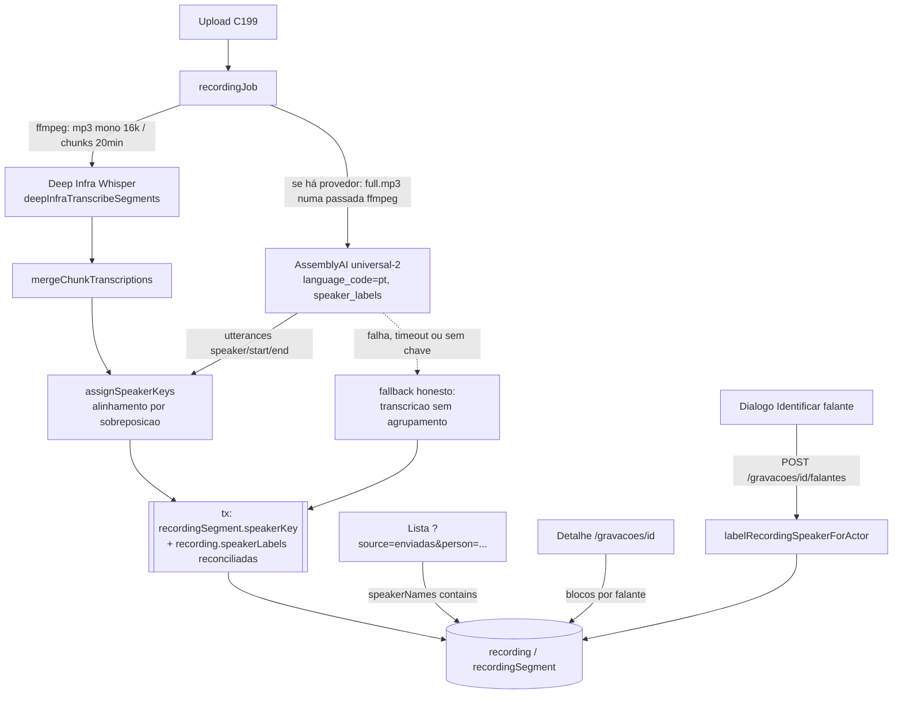

# Impl: C200 — Separar falas por pessoa nas gravações enviadas

Status: aprovado
Atualizado em: 2026-09-19
Issue: #1167
Intenção: docs/plans/acervo-separacao-por-pessoa.md
Appetite restante: herdado (~2–3 dias eng; um outcome verificável — a assessoria identifica quem fala numa gravação enviada e filtra o acervo pelas falas de uma pessoa)

## Leitura da intenção

- **Outcome:** gravações novas do acervo (fonte "Gravações enviadas", C199) passam a ter a transcrição **dividida por agrupamento acústico** ("Falante 1", "Falante 2", …); a assessoria ouve e usa "Identificar falante" para nomear um agrupamento, valendo para todas as falas dele naquela gravação; a lista ganha a faceta **"Pessoa"** que recorta as gravações onde aquele rótulo aparece. A busca geral continua cobrindo a transcrição inteira.
- **O que NÃO negociar:** agrupamento é acústico e a identificação é **humana** (nada de voiceprint, match voz↔pessoa, inferência ou sugestão automática); rótulo é texto por gravação, **sem segundo cadastro de pessoa** (`Contact` intocado); rótulo não preenchido permanece "Falante N"; sem `Consent` novo (mídia interna de staff); sem score de confiança de "quem falou" na UI; gate fail-closed do acervo (`communicator` + `coordinator`/`candidate`; `advisor`/`leader` negados); nada de backfill automático das gravações antigas; sem UI nova de reprocessar/diarizar fora do design aprovado.
- **O que reavaliar** (hipóteses da intenção):
  - "O import substitui os segmentos em bloco — um rótulo só sobrevive se o reprocessamento carregar/re-aplicar" (intenção): confirmado; a reconciliação é decisão desta impl (D6). Nota de realidade: hoje o lifecycle **não tem** caminho `ready → processing` (retry só `failed`, e falha não grava segmentos), então a reconciliação é um contrato do job testado no int, pronto para a ação futura de reprocessar/diarizar (§D8).
  - "A fonte enviadas já tem o padrão de chips/omnibox" (achado do explorador): **não tem** — hoje é só `CampaignSearchInput`. A faceta nova reusa o **`CampaignHeaderFilterPopover`** (multi-seleção) com adaptação local, sem importar o omnibox da Câmara.
  - "Reusar o pipeline de transcrição por chunks para diarizar": não serve — chaves por chunk não se ligam entre chunks (ver D2).
  - "Provedor de diarização" (questão em aberto da intenção): resolvido em D1/D2 (provedor externo, áudio inteiro numa passada) e registrado como **GATE humano de custo/chave**.

## Abordagem recomendada

**Opções consideradas:** A | B | C em cada decisão abaixo.
**Recomendação:** manter o Whisper/Deep Infra como dono da transcrição e adicionar uma **etapa opcional de diarização** sobre o áudio inteiro (AssemblyAI, `universal-2`, `speaker_labels`), **alinhando os turnos aos segmentos existentes** por sobreposição de tempo; chave do agrupamento no `recordingSegment`, rótulos na `recording` com a faceta denormalizada em `speakerNames` (`hasMany text` + `contains`, precedente `Speech.keywords`); reconciliação conservadora de rótulos no job + aviso; sem provedor/chave, a transcrição sai **sem agrupamento** (nunca fingir separação).

### Decisões de engenharia

**D1 — Provedor de diarização (pesquisa web, números oficiais).**
`Opções: A) AssemblyAI | B) Deepgram | C) Gladia | D) Speechmatics | E) diarização local no homeserver | F) LLM de áudio | G) Deep Infra (atual)`

`Recomendação: A — AssemblyAI é o único com preço/hora mais baixo entre os verificados, aceita arquivos de até 10 h (cobre plenária inteira numa passada), tem pt com WER ≤10% declarado, diarização explícita no modelo universal-2 e fluxo assíncrono com polling (submit → poll), que é exatamente a forma do job C199 (heartbeat por atualização do updatedAt).`

| Provedor                     | Diarização                                                                           | Preço oficial (pré-gravado)                                                                            | pt-BR                                                                       | Limite por arquivo                                        | Forma do fluxo                                                                                    |
| ---------------------------- | ------------------------------------------------------------------------------------ | ------------------------------------------------------------------------------------------------------ | --------------------------------------------------------------------------- | --------------------------------------------------------- | ------------------------------------------------------------------------------------------------- |
| **AssemblyAI**               | `speaker_labels: true` (`universal-2`, `universal-3-5-pro`)                          | **US$0,15/h** (`universal-2`) + aditivo diarização standard **+US$0,02/h = US$0,17/h** ≈ US$0,0028/min | `pt` com "high accuracy (≤10% WER)"; `universal-3-5-pro` cita dialeto pt-BR | **10 h** por arquivo; 5 GB via URL/2,2 GB no `/v2/upload` | `POST /v2/upload` → `POST /v2/transcript` → poll; `utterances[]` com `speaker`/`start`/`end` (ms) |
| Deepgram                     | `diarize_model=latest`                                                               | Nova-3 pré-gravado **US$0,0043/min = US$0,258/h** (diarização incluída no pré-gravado)                 | `pt-BR` na lista do nova-3                                                  | não verificado nesta sessão                               | `POST /v1/listen` único e síncrono (ou callback)                                                  |
| Gladia                       | incluída (pyannoteAI Precision-2)                                                    | async **US$0,61/h**                                                                                    | 100+ idiomas                                                                | **135 min** / 1 000 MB por request                        | upload → `/v2/pre-recorded` → poll                                                                |
| Speechmatics                 | incluída                                                                             | Melia 1 batch **a partir de US$0,129/h** (em _production preview_ oficial)                             | 55+ idiomas                                                                 | batch, limites no portal                                  | submit → poll                                                                                     |
| Deep Infra (atual)           | **não diariza** — catálogo ASR verificado ao vivo (6 modelos, nenhum com diarização) | US$0,00045/min no Whisper large-v3                                                                     | pt                                                                          | chunks de 20 min (C199)                                   | já é o ASR do job                                                                                 |
| Local (pyannote/sherpa-onnx) | sim (montagem própria)                                                               | sem API; custo de ops/CPU/modelos                                                                      | depende do modelo                                                           | —                                                         | processo/serviço Python no homeserver                                                             |
| LLM de áudio (Gemini/OpenAI) | **não é diarização acústica**                                                        | por token                                                                                              | sim                                                                         | —                                                         | áudio inteiro ao LLM                                                                              |

- **A (recomendada):** `utilities/ai/assemblyAiDiarize.ts` como dono do provedor (forma de `deepInfraTranscribe.ts`), `ASSEMBLYAI_API_KEY` nova. A diarização roda só com chave; a política de delete do transcript remoto (`DELETE /v2/transcript/{id}`) é best-effort pós-leitura (higiene), e **jamais** se liga `speech_understanding.speaker_identification` (nome automático — proibido pelo guardrail).
- **Rejeitadas:**
  - **B** porque custa ~50% mais por hora (US$0,258 vs US$0,17) e é chamada síncrona de horas — sem o polling nativo que dá heartbeat barato ao job; qualidade comparável e pt-BR ok, então fica como **alternativa de segunda escolha no gate**.
  - **C** porque o async aceita no máximo **135 min/1 000 MB** por request (docs oficiais): uma plenária de horas exigiria fatiar e a numeração global entre fatias volta a ser um palpite (o problema que D2 elimina); além de ~3,6× o custo.
  - **D** porque o modelo de menor preço (Melia 1) está em _production preview_ oficial e o tier de maior acurácia (Enhanced) não publica um rate card único e estável nas fontes oficiais consultadas; sem vantagem decisiva sobre A.
  - **E** porque o homeserver não tem GPU e montar pyannote/sherpa-onnx adiciona runtime Python, download de pesos e um domínio de falha de ops sem seam de teste; revisitar só com custo/volume material ou mudança de política de dados.
  - **F** porque LLM de áudio atribui falante probabilisticamente (alucina atribuição e nome), não entrega turnos com timestamp confiável e colidiria com a regra OPS123 (provider `openai/*` reservado a design no Teqo).
  - **G** porque capacidades verificadas: nenhum dos 6 modelos ASR do catálogo Deep Infra diariza; uma chave nova no mesmo provedor não resolve.

**D2 — Escopo da diarização: áudio inteiro vs por chunk de 20 min.**
`Opções: A) uma passada no áudio inteiro | B) por chunk de 20 min com numeração global por ordem de primeira aparição | C) por chunk com re-associação por embedding entre chunks`

`Recomendação: A — o agrupamento é uma propriedade do áudio inteiro; diarizar por chunk gera chaves que não se ligam entre chunks e repetir "Falante 1" em cada chunk refere-se a pessoas diferentes (enganoso, contra o guardrail). O áudio extraído (mono 16 kHz, 32 kbps ≈ 14 MB/h) fica muito abaixo do limite de tamanho do provedor e dentro das 10 h de duração; acima de 10 h o job pula a diarização (fallback honesto).`

- **Rejeitadas:** **B** porque "Falante N" por chunk com numeração global por ordem de aparição **não** garante a mesma pessoa (sem biometria não há re-associação) e mente para a assessoria; **C** porque re-associação por embedding é voiceprint — proibida pelo produto e pela intenção.

**D3 — Papel do provedor: diarizar e alinhar vs substituir o ASR.**
`Opções: A) provedor só fornece turnos; alinhamento aos segmentos do Whisper | B) provedor passa a ser o ASR da gravação (utterances viram segmentos) | C) provedor só quando há chave; Whisper quando não há`

`Recomendação: A — o Whisper continua dono do texto, do searchText e dos timestamps por segmento (C199 pinado); o provedor entra apenas como camada de agrupamento. Falha do provedor não afeta a transcrição, e o alinhamento vira uma função pura testável sem rede.`

- **Rejeitadas:** **B** porque troca o dono do texto, muda o custo do caminho feliz (~10× por minuto), reescreve a busca e faria a falha do provedor derrubar a transcrição inteira; **C** porque duas qualidades de transcrição no mesmo acervo sem o usuário saber, e dois donos do texto quebrando pinos C199.

**D4 — Modelo de dados dos rótulos.**
`Opções: A) estado na recording (array `speakerLabels`) + `speakerNames` denormalizado (hasMany text) + chave no segmento | B) rótulo copiado em cada segmento | C) collection nova de rótulos | D) campo JSON`

`Recomendação: A — exatamente o que a tarefa fixou: recordingSegment.speakerKey (chave do agrupamento) + estado de rótulos na recording; a faceta "Pessoa" usa speakerNames (text hasMany → text[] no Postgres; precedente Activity.tags/Speech.keywords) com contains (ILIKE), funcionando no Payload 3.82.`

- A: `speakerLabels: { speakerKey, label }[]` (readOnly no admin; uma linha por agrupamento identificado) e hook `deriveSpeakerNames` preenchendo `speakerNames` (dedupe case-insensitive, ordem de aparição) — espelho de `RecordingSegment.deriveSearchText`. `speakerLabelsDropped: boolean` guarda o aviso de reconciliação (D6). Segmentos guardam só a chave.
- **Rejeitadas:** **B** porque renomear um agrupamento tocaria N segmentos e a faceta viraria um join caro; **C** é collection nova para um estado 1:N simples (custo de access/index/migration sem ganho) e foge da direção da tarefa; **D** não tem validação/índice nem precedente de query de faceta.

**D5 — Semântica da faceta "Pessoa".**
`Opções: A) `{ speakerNames: { contains: valor } }`OR entre valores selecionados | B)`{ speakerNames: { in: valores } }` exato | C) normalizar rótulo em slug na gravação`

`Recomendação: A — o precedente da casa (speechListFilters.ts:70, Speech.keywords contains) é case-insensitive e tolera variação ("Solla" casa "Dep. Jorge Solla"); a URL guarda o texto literal, a curadoria varia o rótulo e o recorte não fragmenta.`

- **Rejeitadas:** **B** porque a variante livre ("Solla" vs "Dep. Jorge Solla") fragmentaria a faceta (anti-goal de curadoria acidental); **C** porque cria uma segunda representação do rótulo e um merge implícito que a intenção cortou.

**D6 — Preservação de rótulos ao reprocessar.**
`Opções: A) reconciliação por sobreposição de tempo, conservadora 1:1, com flag + aviso | B) casar por igualdade de speakerKey | C) aceitar a perda silenciosa | D) bloquear o reprocessamento quando há rótulo`

`Recomendação: A — sem biometria não há re-associação entre execuções; carregar um rótulo só quando um agrupamento novo casa 1:1 por tempo com um antigo é o contrato honesto. Quem não casa fica sem nome e o job liga speakerLabelsDropped, que rende o aviso no detalhe.`

- A: o job lê labels + segmentos antigos **antes** de apagar, computa `reconcileSpeakerLabels` (puro: sobreposição acumulada por par, 1:1, ordenado por primeira aparição) dentro da mesma transação e grava `speakerLabels` reconciliadas + `speakerLabelsDropped`. O aviso vive **dentro** do banner âmbar da Cena 4 (uma linha condicional — ver §UI).
- **Rejeitadas:** **B** porque a chave é por execução e a mesma chave pode referir outra pessoa (o aceite manda re-vincular com aviso, não fingir); **C** viola o aceite; **D** porque o reprocessamento de hoje só existe para `failed` (que não tem rótulo) e, na ação futura, bloquear sem alternativa é pior que reconciliar e avisar.

**D7 — Fallback sem provedor/chave/timeout.**
`Opções: A) transcrição sem agrupamento (estado C199, sem "Falante") | B) falhar a gravação | C) criar um "Falante 1" único`

`Recomendação: A — o acervo continua útil e a ausência de blocos não afirma nada; é exatamente o detalhe C199 já aprovado, sem markup novo.`

- **Rejeitadas:** **B** porque faz a transcrição (que não depende do provedor) depender de um custo humano ainda não aprovado; **C** porque sugere um falante único onde há vários — fingir separação, proibido.

**D8 — Reprocessar/diarizar gravações antigas.**
`Opções: A) ação explícita por gravação agora | B) backfill automático | C) sem ação agora; follow-up com gatilho | D) UI de reprocessar junto com este item`

`Recomendação: C — a tarefa veta UI nova de reprocessar fora do design e a intenção veta backfill. A reconciliação (D6) fica pronta no job para quando a ação existir.`

- **Gatilho do follow-up:** chave do provedor ativa em produção **e** (pedido operacional de diarizar o acervo antigo **ou** passarem ~30 gravações novas sem diarização). Aí o designer estende o artefato **antes** do markup (trigger a). **Débito absorvido pelo D8 (triagem do /simplify):** quando a ação de reprocessar existir, a semântica de limpar `speakerLabelsDropped` no rótulo precisa considerar rótulos ainda perdidos (hoje inalcançável: não há `ready → processing`).
- **Débito absorvido pelo C202:** a action de rótulo gateia no action-level com `canReadCommunicationCatalog` (a collection já exige `canUploadRecording`); a troca pelo predicado de escrita do dono foi adicionada ao plano `docs/plans/gates-gravacoes-predicados.md` (#1186).
- **Rejeitadas:** **B** porque o custo e o risco de mexer em rótulos não justificam varrer tudo; **A/D** porque contrariam a restrição de superfície do item.

## Componentes / mudanças

- **`src/lib/recordingDiarization.ts`** (novo, puro/client-safe): `DiarizedTurn`, `assignSpeakerKeys` (sobreposição máxima; empate pelo ponto médio; sem sobreposição → turno mais próximo; numeração global `speaker-1…` por primeira aparição), `reconcileSpeakerLabels` (D6), `speakerNamesFromLabels`, `recordingSpeakerDefaultLabel(n)` → `Falante ${n}`, `RECORDING_DIARIZATION_MAX_SECONDS = 10h` (limite do provedor citado em comentário). Mesmo padrão de dono dos puros de `lib/recordingTranscription.ts`.
- **`src/lib/recordingTranscription.ts`** (editar): `buildRecordingFullAudioFfmpegArgs` (mp3 mono 16k/32k sem segmentação) ao lado do args de chunks; merge/searchText intocados.
- **`src/lib/recording.ts`** (editar): `RECORDING_SPEAKER_LABEL_MAX_LENGTH = 120`, mensagens pt-BR do diálogo/action, nada de status novo.
- **`src/utilities/ai/assemblyAiDiarize.ts`** (novo, `server-only`): dono do provedor (molde `deepInfraTranscribe.ts:98-137`) — upload → transcript (`language_code: 'pt'`, `speaker_labels: true`, sem identificação automática) → poll com deadline de 60 min e intervalo de 5 s; normalização ms→s; nunca lança (`{ ok, turns }` / `{ ok:false, error, status }`); `DELETE` best-effort do transcript; chave ausente → 503. Exporta `assemblyAiDiarize` e `configuredSpeakerDiarizer()` (null sem chave).
- **`src/utilities/recordings/recordingJob.ts`** (editar): `runRecordingJob(payload, id, transcribe = deepInfraTranscribeSegments, diarize = configuredSpeakerDiarizer())`; extrai `full.mp3` só quando `diarize` existe e a duração ≤ 10 h, chama o provedor (heartbeat `step:'transcribing'`), alinha com `assignSpeakerKeys`, e na transação já existente (`recordingJob.ts:191-227`) lê o estado antigo, apaga/recria segmentos com `speakerKey` e grava `speakerLabels`/`speakerLabelsDropped`. Falha/timeout do provedor **não** marca `failed`.
- **`src/collections/Recording.ts`** (editar): `speakerLabels` (array `{ speakerKey, label }`, readOnly), `speakerNames` (`text` `hasMany`, readOnly), `speakerLabelsDropped` (`checkbox`, readOnly) + hook `deriveSpeakerNames` (fallback `originalDoc` como `deriveSearchText`).
- **`src/collections/RecordingSegment.ts`** (editar): `speakerKey` (`text`, opcional, readOnly).
- **`src/utilities/recordings/recordingListUrl.ts`** (editar): param `person` (repetível) no `RecordingListState`, parse com `allParamValues` + trim + cap 120 + dedupe, serialize com `append`, `toggleRecordingPerson`/`removeRecordingPerson` puros (page reset) — o "adapter" da faceta mora aqui em vez de um módulo espelho de `speechOmnibox.ts` (depth check).
- **`src/utilities/recordings/recordingListFilters.ts`** (editar): `buildRecordingListWhere` AND-e `searchText like` + `{ or: persons.map(p => ({ speakerNames: { contains: p } })) }`.
- **`src/utilities/recordings/recordingViewModels.ts`** (editar): `RecordingSpeakerGroupViewModel` (`key`, `index`, `defaultLabel`, `label`, `isIdentified`, `segments`), `RecordingDetailViewModel.speakerGroups` + `speakerLabelsDropped`; `RecordingListItemViewModel.matchedPersons`; agrupamento por primeira aparição; caminho sem chave renderiza a lista plana C199.
- **`src/utilities/recordings/recordingPageData.ts`** (editar): selects (`speakerNames`, `speakerLabels`, `speakerLabelsDropped`, `speakerKey`), `loadRecordingFilterOptions` (select de `speakerNames` com `pagination:false`, dedupe e sort pt-BR — molde `speechPageData.ts:85-121`), `matchedPersons` por linha (puro `contains` case-insensitive espelhando o where).
- **`src/app/(campaign)/campanha/actions/recording.ts`** (editar): `labelRecordingSpeakerForActor({ recordingId, speakerKey, label })` — gate pelo **predicado de escrita do dono** (C202, §Dependências), valida que a chave existe em algum segmento da gravação, faz read-modify-write do array `speakerLabels` e limpa `speakerLabelsDropped` (o ato humano reconhece/revisa); 1 collection → sem transação.
- **`src/lib/schemas/recording.ts`** (editar): `recordingSpeakerLabelRequestSchema` (id, `speakerKey` `^speaker-\d{1,3}$`, label 1..120 trim) + mensagens seguras.
- **Rotas** (`.../acervo/gravacoes/[id]/falantes/route.ts`, novo): `POST` via `campaignJsonMutationRoute` (sem allowlist de conventions — rota wrapper, não crua), molde de `[id]/retry/route.ts`; `types.ts` ganha `RecordingSpeakerLabelResponse`; `lib/campaignPaths.ts` ganha `campaignRecordingSpeakersHref`.
- **UI** (`src/components/campaign/recording/`): `RecordingSpeakerTranscript.tsx` (novo, client; blocos + banner âmbar + botões), `RecordingSpeakerDialog.tsx` (novo, client; molde `SpeechCutDeleteDialog` + `postCampaignJson`), `RecordingPersonFilter.tsx` (novo, client; `CampaignHeaderFilterPopover` + `useCampaignListFilterNavigation`), edições em `RecordingDetailPlayer.tsx` (renderiza grupos quando existem; senão o `<ol>` atual), `RecordingResultCard.tsx` (chip de pessoa) e `acervo/page.tsx` (hidden inputs de `person` no form de busca, linha da faceta, vazio com filtro).
- **Manifest e2e** (`scripts/lib/e2e-affected-manifest.mjs`): **sem mudanças esperadas** — `src/utilities/ai` (linhas 261-265) já mapeia `campaignSpeechAcervo`, e `src/utilities/recordings`/`src/components/campaign/recording`/`src/lib/recording` (322-336) já cobrem os arquivos novos; confirmar no gate.
- **Migration:** `add_recording_speakers` (abaixo).
- **Access / Consent:** sem `Consent` novo; `utilities/access/recordings.ts` intocado neste item (C202 é o dono da ampliação de gate); a action de rótulo é a única superfície nova e usa o predicado de escrita do dono.
- **UI:** Impeccable **C** — port do artefato + shells (`CampaignHeaderFilterPopover`, `CampaignListPendingBoundary`, `CampaignListEmptyState`, `CampaignListFooter`, `Dialog`, `Alert`, `Spinner`); shape→craft→critique→polish no ciclo.

### Dados → forma (se aplicável)

- **N/A por decisão da intenção** (`acervo-separacao-por-pessoa.md:59`): filtro por pessoa é recorte de conteúdo, não métrica/agregado; nenhuma confiança numérica é exposta (o produto proíbe score de "quem falou"). Nada a apresentar; nenhuma forma nova.

## UI e port do design (fonte de verdade: `acervo-separacao-por-pessoa-ui-design.html`)

**Coberto pelo artefato — port classe-a-classe:**

1. **Cena 1 (detalhe desktop, agrupado):** grid `grid-cols-[minmax(0,1.05fr)_minmax(430px,.95fr)]`, mídia à esquerda (player + `Baixar` + banner informativo **literal** "Os falantes são agrupados automaticamente pelo áudio. A identificação de cada pessoa é feita pela equipe.") e coluna direita com heading uppercase "Transcrição por falante", hint "Clique para posicionar" e `article.speaker-block` por grupo: head (`size-7` avatar, `Falante N`/rótulo, sub "Agrupamento sem identificação"/"Identificação feita pela equipe", botão outline "Identificar falante"/"Editar identificação") e linhas `seg` (grid `3.25rem 1fr`, `data-start-seconds`, ativo com `bg-muted`, hora em `text-primary` quando ativo, texto com `SpeechHighlightParts`).
2. **Cena 2 (diálogo):** `Dialog` com título "Identificar falante", descrição `Dê um nome ao agrupamento “Falante N”.` (sempre o rótulo default), caixa informativa "Ouça um trecho e informe quem é a pessoa. O acervo não sugere nem identifica pessoas automaticamente.", label "Nome do falante", placeholder "Digite o nome do falante", helper "O nome será aplicado a todas as falas deste agrupamento nesta gravação.", botões "Cancelar"/"Salvar identificação"; erro inline (molde retry/delete), `router.refresh()` no sucesso.
3. **Cena 3 (lista com faceta):** mantém `RecordingsSearchForm` (`CampaignSearchInput`, C199) **com hidden inputs dos `person` ativos** (submeter a busca não pode perder o filtro) e adiciona a linha de chips (botão outline "Pessoa: {rótulo}" com X) via `CampaignHeaderFilterPopover` multi-seleção; card com o chip `{rótulo}` + "aparece nesta gravação" sob o excerpt.
4. **Cena 4 (aviso de imprecisão):** banner âmbar com título "A separação por falante pode estar imprecisa" e corpo "O agrupamento é automático e aproximado. Ruído e falas sobrepostas podem colocar trechos no agrupamento errado. A equipe continua responsável por identificar cada falante." — **sempre visível no detalhe agrupado** (sem score de qualidade, D1/anti-goal; o artefato não define gatilho). A linha condicional de reconciliação (D6) entra **dentro desse mesmo banner** quando `speakerLabelsDropped`: "Esta gravação foi reprocessada e algumas identificações não puderam ser mantidas. Confira os falantes." — uma frase, sem componente/superfície nova.
5. **Cena 5 (mobile 390 px):** mesmo detalhe em coluna única, head compacto do bloco (avatar + nome + botão "Identificar"/ícone de edição com `aria-label` "Editar identificação"), banner informativo curto **literal** "Agrupamento automático e aproximado. A identificação é feita pela equipe." e hint "Toque para posicionar".

**Decisões de port fora do literal (baratas, revisáveis):**

- **Subtítulo da página na Cena 3** ("Gravações enviadas"): mantém o subtítulo aprovado do C199 ("Busque nas falas da Câmara ou nas gravações da equipe.") + alternador; a Cena 3 é shorthand do estado da fonte e mudar o chrome regride o pin do C199 sem ganho de produto.
- **Vazio com filtro de pessoa**: reusa `CampaignListEmptyState` com a copy da casa ("Tente outro termo, remova filtros ou limpe a busca.") — estado não desenhado, shell aprovada.
- **Fallback sem agrupamento**: renderiza o detalhe C199 **como está** (sem copy nova de "não diarizado"). A tarefa manda disparar o designer se precisarmos de superfície nova — **não precisamos**; se surgir demanda de explicar a ausência, é trigger a (designer antes do markup), registrado como follow-up (§D8).
- Dialog sobre grupo já identificado reusa a copy da Cena 2 com o rótulo default; o trigger é que muda ("Editar identificação").
- `role="tablist"` inexistente aqui; o alternador C199 fica intocado.

## Migration

- Nome: `pnpm migrate:create add_recording_speakers` → gera coluna `recording_segment.speaker_key` (`text`), tabela `recording_speaker_labels` (`id`, `_order`, `_parent_id` FK `recording` cascade, `speaker_key`, `label`), coluna `recording.speaker_names` (`text[]`) e `recording.speaker_labels_dropped` (`boolean`). **Revisar o SQL**; sem índices novos (a faceta é `contains` sobre `text[]` em tabela pequena e o `Speech.keywords` não tem índice dedicado). Referência de forma: `20260715_163458_initial` (arrays) e `20260918_201009_add_reel`.
- **HARD-STOP de aprovação humana explícita, mesmo em sessão `--auto`, e local-only:** criar/aplicar a migração apenas no banco local do worktree (`pnpm migrate`), **nunca** tocar banco remoto/prod e **nunca** editar migração antiga. Parar, apresentar o SQL gerado e aguardar aprovação antes de seguir para o job/UI.

## Invariantes

- Local API em contexto de usuário sempre com `overrideAccess: false` + `user` (lista, detalhe, action de rótulo); bypass admin só no pipeline que é dono do row, com comentário (forma `recordingJob.ts:54-56`).
- Escrita multi-collection em transação com `req: { transactionID }` (`withPayloadTransaction`): substituição de segmentos + estado de rótulos + `searchText`/status na mesma transação; a action de rótulo é 1 collection.
- Sem `Consent` novo; sem `Contact`; rótulo é texto; nenhuma URL pública; `/arquivo` e matriz de papéis intocados.
- Gate fail-closed do acervo; a escrita nova usa o predicado de escrita do dono (C202) — nunca `canReadCommunicationCatalog` gateando escrita; `advisor`/`leader` negados (matriz no int/e2e).
- Sem biometria/voiceprint/unificação entre gravações; sem score/confiança na UI; sem inferência de identidade.
- "Edit the owner, don't twin": puros no `lib` dono da pipeline, provedor no `utilities/ai` dono, where/estado no `recordings/`, sem módulo top-level novo em `src/utilities/`.
- Identificadores em inglês; copy/labels pt-BR; valores de URL em pt-BR só os existentes (`source=enviadas`, `falantes`).
- `pnpm generate:types` após o schema; `pnpm gate:fast` durante; `pnpm push` como entrega; **este plano e `docs/changelog/2026-09-19-c200.md` entram no commit da entrega**.

## Fases verificáveis

1. **Puros + schema + migration (HARD-STOP)** (~1 dia).
   - `lib/recordingDiarization.ts`, `lib/recordingTranscription.ts` (+full), `recordings/recordingListUrl|Filters|ViewModels|PageData`, `lib/recording.ts`, collections + hook; `pnpm generate:types`.
   - Unit: alinhamento (sobreposição, empate, sem sobreposição→mais próximo, vazio), numeração global por primeira aparição, reconciliação (1:1 carrega; split/merge/orfão dropa + flag), `speakerNames` derivado, guard de 10 h, ffmpeg args do full, parse/serialize `person` (multi/dedupe/cap), where `contains`+q AND, `matchedPersons`.
   - Int: matriz de papéis e persistência das três colunas novas; **validação da query da faceta `contains` em `text[]` no Payload 3.82** (precedente `Speech.keywords` e `Activity.tags`).
   - **Migration `add_recording_speakers` — HARD-STOP humano, local-only.**
2. **Provedor + job + ação** (~1 dia).
   - `assemblyAiDiarize` (seam injetável na assinatura do job), job com reconciliação na transação, action/rota/schema/paths.
   - Int: job com diarizador fake (feliz multi-chunk → `speakerKey` por segmento + labels preservadas; falha do provedor → `ready` sem agrupamento; reconciliação com fixtures antigas; chave inexistente → fallback), `labelRecordingSpeakerForActor` (papéis; chave desconhecida; label vazio/longo; limpa `speakerLabelsDropped`), sem chamada real de rede.
3. **UI** (~1 dia).
   - Cenas 1–5 + hidden inputs + faceta + cards; ação de rótulo no diálogo.
   - Unit: view models dos grupos (ordem, `Falante N`, rótulo aplicado, flag), cena/copy constants; e2e cobre o markup.
4. **Gates + GATE humano** (~0.5 dia).
   - Estender `tests/e2e/campaignSpeechAcervo.e2e.spec.ts` (describe C199): fixture `ready` com segmentos com `speakerKey` + `speakerLabels`; detalhe renderiza blocos/"Falante N"/rótulo/aviso; lista `?person=` recorta e o card mostra o chip; fallback sem `speakerKey` mantém `data-start-seconds` do C199; advisor negado na rota nova.
   - `pnpm gate:fast`; `pnpm test:e2e:affected`; manifest/conventions (confirmar sem mudança); **smoke manual do provedor com 1 gravação real** (chave aprovada); changelog; push.

Quota: ~3–3,5 dias eng, dentro do appetite herdado; se apertar, o corte é o polish do port (a estrutura das cenas 1/2/3 fica antes do acabamento).

## Rabbit holes / Não escopo (engenharia)

- Voiceprint/embedding para re-associar falantes entre execuções/gravações; unificação automática de "mesma pessoa".
- Cadastro/diretório de pessoas ou vozes; qualquer uso de `Contact`.
- Edição/correção de transcrição, alinhamento por palavra, refino de sobreposição.
- Backfill de diarização do acervo antigo e UI de "Diarizar" (follow-up com gatilho, §D8).
- Multi-provedor/adapter genérico de diarização (uma interface, um provedor — sem volatilidade que justifique mais).
- Webhook/callback do provedor (o poll do job basta; callback criaria superfície pública nova).
- Score/confiança de falante na UI (proibido); detecção automática de "qualidade ruim".
- Fila/worker, tempo real, streaming, cortes por falante, busca semântica (C192) e merge de fontes.

## Riscos e mitigação

- **Custo/chave do provedor não aprovados (GATE).** Sem chave, tudo degrada para a transcrição sem agrupamento (D7); a feature nova só liga após a aprovação — nenhum teste depende de rede.
- **`speaker_labels` não suportado para `pt` na conta real.** Os docs oficiais da AssemblyAI listam `pt` com alta acurácia no `universal-2` e diarização nos modelos `universal-2`/`universal-3-5-pro`, mas a matriz feature×idioma não é pública: **smoke manual na fase 4** antes do rollout; falha honesta = fallback.
- **Qualidade do agrupamento em plenária ruidosa/sobreposta.** Banner da Cena 4 sempre visível + identificação humana + nenhum claim automático; a copy do provedor recomenda ≥30 s de fala por pessoa (citada nos docs).
- **Diarização > 10 h ou timeout de poll.** Guard de duração + deadline de 60 min com heartbeat; resultado = fallback sem agrupamento, nunca `failed`.
- **Alinhamento errado na fronteira de turnos.** Atribuição por sobreposição máxima com desempate pelo ponto médio; unidade cobre; aviso de imprecisão cobre o resto.
- **Reconciliação conservadora demais (rótulo perdido).** Só perde quando não há mapeamento 1:1; `speakerLabelsDropped` dispara o aviso; teste int garante carregar no caso trivial (mesmos tempos).
- **Corrida no read-modify-write de `speakerLabels`.** Aceita para ferramenta interna de equipe única (uma gravação editada por vez na prática); se doer, collection dedicada de rótulos é o follow-up.
- **Faceta cara conforme o catálogo cresce.** Select de `speakerNames` + dedupe é O(n) com n pequeno; gatilho: acervo > ~2 000 gravações ou opções > ~200 (pré-computar opções/`distinct`).
- **Regressão do C199.** O caminho sem `speakerKey` mantém o markup exato do `<ol>` atual; os testes C199 (unit/int/e2e) continuam a rede.
- **Vazamento de dados ao provedor externo.** Áudio de eventos públicos da equipe, sem PII de terceiros; delete best-effort do transcript remoto; política de retenção validada no gate.

## GATE humano — provedor, custo e chave (assumido; validar antes do rollout)

- **Assumido:** provedor **AssemblyAI** (`universal-2` + `speaker_labels`), custo **US$0,17/h** de áudio (US$0,0028/min) — fonte oficial: pricing AssemblyAI (Universal-2 US$0,15/h; diarização async standard +US$0,02/h) e docs de Speaker Diarization/limites (10 h, 5 GB; upload 2,2 GB).
- **Custo projetado:** 10 h/mês ≈ US$1,70; 50 h/mês ≈ US$8,50; 200 h/mês ≈ US$34,00.
- **Pendente de aprovação humana (mesmo com `--auto`):** criar conta/chave na AssemblyAI, definir `ASSEMBLYAI_API_KEY` no env de produção (e staging se desejado), aceitar o envio do áudio a terceiro e o orçamento acima; rodar o smoke real. **Nada disso bloqueia a implementação** (seam injetável + testes sem rede); bloqueia só o rollout.
- **Alternativa registrada no gate:** Deepgram (US$0,0043/min = US$0,258/h, diarização incluída, pt-BR) — se a aprovação preferir chamada síncrona única; a troca exige só um novo dono em `utilities/ai/` (a interface do seam não muda).

## Aceite de engenharia

- [ ] Aceite de produto da intenção coberto: transcrição dividida por "Falante N" nas gravações novas com provedor; "Identificar falante" vale para todo o agrupamento; faceta "Pessoa" recorta a fonte enviadas; busca geral intocada; rótulo vazio permanece "Falante N"; nunca sugere/infere identidade; reprocessar não perde rótulo sem re-vinculação avisada; antigas não são reprocessadas automaticamente.
- [ ] Invariantes AGENTS/engineering-standards: `overrideAccess:false` + `user`; transação multi-collection; sem `Consent`/`Contact`; `advisor`/`leader` fail-closed; sem biometria/score; sem módulo top-level novo em `utilities/`; migração nova sem editar antigas; plano + changelog no commit; `pnpm push`.
- [ ] Testes de domínio onde access/write paths mudam: puros da diarização/reconciliação/URL/where/view models no unit; job com seam injetado + action de rótulo com matriz de papéis + query da faceta no int; markup do detalhe/liste no e2e existente.

## Self-score de decision-quality

**4,5/5.** As decisões caras têm alternativas honestas e rejeições ancoradas: provedor com número oficial de quatro candidatos + limitações reais (135 min da Gladia, preview da Melia, 10 h/5 GB da AssemblyAI), escopo da diarização (áudio inteiro vs chunk — o modo chunk mente e foi rejeitado), papel do provedor (não substitui o ASR dono), modelo dos rótulos com precedente de query validado (`hasMany` + `contains` no Payload 3.82), semântica da faceta, reconciliação conservadora com aviso e fallback honesto. Cabe no appetite herdado (fases somam ~3–3,5 dias, tracer nos puros+schema cedo) e reusa shells/donos existentes (`CampaignHeaderFilterPopover`, `withPayloadTransaction`, `campaignJsonMutationRoute`, moldes de `deepInfraTranscribe`, `SpeechCutDeleteDialog`, `speechListFilters`). Perde 0,5 porque duas coisas ficam fora do código e viram parada dura/validação: a **migração** (HARD-STOP explícito, local-only) e o **custo/chave do provedor** (assumido; gate humano com smoke real), além de duas escolhas de port que dependem de ratificação no gate (banner da Cena 4 sempre visível sem score; subtítulo do C199 mantido na Cena 3).
