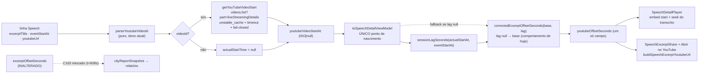

# Impl: Acervo: o player e o link abrem no ponto certo da fala

Status: executado (gate humano 2026-09-16; Fase 0 com 5 evidências medidas; entrega no PR)
Atualizado em: 2026-09-16
Issue: #1082
Intenção: docs/plans/acervo-video-no-ponto-certo-da-fala.md
Appetite restante: herdado (~0,5–1 dia eng). Corte explícito: a âncora da API entra como limite superior (erra para "antes") e a medição verificada vira override — nada a inflar depois da Fase 0.

## Leitura da intenção

- **Outcome:** abrir uma fala do Acervo (na tela ou pelo link "Abrir no YouTube"/compartilhamento) posiciona o vídeo no mesmo ponto que a referência do YouTube entrega; player e link não divergem e o desvio residual é pequeno e explicado por evidência — nunca um palpite.
- **O que NÃO negociar:**
  - **Sem schema, sem Consent, sem migration.** O ajuste é comportamento de seek, não dado novo.
  - **Contratos de URL pública e de C162/C166/C167 intactos.** `?t=` do deep link segue sendo segundo de **sessão** (o player soma o offset); a URL/mensagem do share (C166) e a seleção/corte (C167, que usa `startSeconds`/`endSeconds` de sessão) não mudam de forma nem de semântica.
  - **Sem evidência → não inventar `t=`.** Quando o offset for desconhecido, o comportamento é o de hoje (não fabricar um número).
  - **Calibração baseada em evidência, não em chute.** A fala 997 (~13 s) e a sessão da fala 641 (~37 s) da C163 são a amostra mínima (intenção, questão B).
  - **Um único offset corrigido**, consumido por player e share (intenção, questão C).
  - **Sem UI** (Impeccable A) — nenhum dispatch de designer.
- **O que reavaliar (hipóteses da intenção):**
  - A recomendação literal da intenção — "usar o método da C163" com uma **constante** — é **incompatível com a evidência**: o lag varia por sessão (37 s vs 13 s); uma constante global corrigiria uma e **abriria 24 s antes** na outra. O _método_ (descontar o atraso real de início da sessão) é válido; o valor global não.
  - A hipótese de que a correção cabe no dono atual sem nova informação: **parcialmente**. `excerptOffsetSeconds` (`src/lib/speechVod.ts:219-228`) só conhece `eventStartAt` (relógio do slot), que **não** é a âncora do vídeo. Falta uma âncora por vídeo; é isso que o plano resolve.
  - Se a YouTube Data API v3 expõe `liveStreamingDetails.actualStartTime` para **estes** vídeos — **verificado na Fase 0 (2026-09-16): sim**, mas o valor **não é** a origem exata do vídeo (ver "Resultado da Fase 0").

## Abordagem recomendada

**Opções consideradas:** A (constante global) | B (mapa medido por `videoId`) | C (âncora automática por vídeo via YouTube Data API v3) | D (não corrigir / sempre omitir `t=`).

**Recomendação (aprovada no gate humano de 2026-09-16): C, com override medido.** `lag = actualStartTime − eventStartAt` por vídeo, via `liveStreamingDetails.actualStartTime` (cliente YouTube do dono), e um **override medido** por `videoId` para os vídeos já verificados no browser. O override vence a âncora da API.

**Por que a âncora da API serve mesmo errando** (gate humano): o arquivo de uma transmissão **não pode começar depois** de o broadcast entrar no ar, então `actualStartTime ≥ origem real do vídeo` ⇒ `lag_api ≥ lag_origem`. Na amostra real (5 sessões) isso se confirmou em 4: a âncora erra para o lado de "alguns segundos antes". O 5º ponto (sessão de 17/06) mostrou `lag_medido (89) > lag_api (67)` — a âncora ficou **22 s depois**: "sempre antes" é a tendência, não uma lei (o medido embute também o julgamento humano de onde a fala começa, que varia por fala). Ainda assim o erro máximo observado (52 s antes / 22 s depois) é muito menor que o defeito atual (o app abre 10–89 s depois, em todas as amostras). O override devolve o ponto exato onde existe medição.

**Resultado da Fase 0 (2026-09-16, HTTP público, zero DB de prod):**

|                           | fala 997                            | fala 641                            | fala 981 (staging)                  | fala 973 (staging)                  | sessão 17/06 (staging)              |
| ------------------------- | ----------------------------------- | ----------------------------------- | ----------------------------------- | ----------------------------------- | ----------------------------------- |
| vídeo / `eventStartAt`    | `DC_i9Kp1LVk` / 2026-08-11 15:32:00 | `2cX_gKkJH7Q` / 2018-03-13 14:00:00 | `hAUJ3fXgsIQ` / 2026-06-16 13:59:00 | `hZ9Yl4MFHQs` / 2026-05-27 15:00:00 | `nHHqPaJEERI` / 2026-06-17 14:04:00 |
| offset de sessão (app)    | 11962                               | 645                                 | 25156                               | 392                                 | 11622                               |
| ponto correto (evidência) | 11949                               | 608                                 | 25125                               | ~382                                | ~11533                              |
| lag medido                | **13 s**                            | **37 s**                            | **31 s**                            | **~10 s**                           | **~89 s**                           |
| `actualStartTime` da API  | 15:32:57 BRT → lag 57 s             | 14:00:46 BRT → lag 46 s             | 13:59:37 BRT → lag 37 s             | 15:01:02 BRT → lag 62 s             | 14:05:07 BRT → lag 67 s             |
| erro da âncora da API     | +44 s                               | +9 s                                | +6 s                                | +52 s                               | +22 s (depois)                      |

Em **cinco** sessões a API não reproduz o lag medido (erros de +44 s, +9 s, +6 s, +52 s e **−22 s**) e **não há preditor comum**: os lags medidos (13/31/37/10/89) não correlacionam com nenhuma quantidade derivável (`actualStartTime − eventStartAt` = 57/37/46/62/67; `actualStartTime − scheduledStartTime`; janela do evento vs duração do vídeo; offset do primeiro trecho da sessão = 28/9/1/24/25). Em 4 das 5 o erro é para "antes"; na sessão de 17/06 o lag medido (89) superou o da API (67) — ou seja, a âncora pode ficar levemente depois, e "sempre antes" é tendência, não garantia. O que resta, depois de descontar a origem do vídeo, é em boa medida **julgamento humano de onde a fala começa** (o trecho curado da Câmara pode incluir a concessão da palavra), que varia por fala — por isso o override medido é exato **na fala medida** e a âncora fica como limite superior para as demais. Corroboração de que o arquivo começa antes do `actualStartTime`: com a origem da API (15:32:57), a primeira fala da própria sessão (Benedita, 15:32:28) cairia 29 s antes do início do vídeo.

**Rejeitadas:**

- **A — constante global (37 s "método C163" literal):** a evidência contradiz (13 s vs 37 s); 37 s numa sessão de 13 s abriria 24 s antes. É o Rabbit hole nº 1 da intenção.
- **D — não corrigir / sempre omitir `t=`:** falha o outcome ("o desvio deixa de ser sistemático" e "o link cai no mesmo ponto que o player"). Omitir sempre também regride o C162 em ambientes sem chave.
- **C "puro" (só API, sem override):** não fixa o caso relatado no ponto exato (997 abriria 44 s antes); o override custa ~10 linhas e devolve exatidão onde há medição. Rejeitada a ausência do override, não a API.
- **B como mecanismo principal:** exige medição humana por sessão e não cobre falas novas — vira o **override**, não o mecanismo.

### Decisões de engenharia

1. **Como corrigir o ponto.** Opções: A constante global | B mapa medido `videoId → lag` em `src/lib/speechVod.ts` | C âncora por vídeo via API do YouTube | C+override. **Recomendação: C+override — porque** o lag é propriedade do vídeo, a API dá o limite superior (erra para "antes", nunca para "depois") e a medição verificada no browser, quando existe, é exata. Precedência: override medido → âncora da API → sem correção (comportamento de hoje). **Rejeitadas:** A (evidência 13 s vs 37 s); C puro (997 abriria 44 s antes, sem usar a evidência que já temos); B principal (não escala; vira o override).
2. **Onde o offset corrigido nasce.** Opções: (i) no `SpeechDetailPlayer` (client) | (ii) no loader `loadSpeechDetailPageData` | (iii) no `toSpeechDetailViewModel` (dono atual). **Recomendação: (iii) — porque** o intent nameia `speechViewModels.ts:260` como o único ponto onde `youtubeOffsetSeconds` nasce, e player e share já consomem esse único campo; manter o nascimento ali preserva o "um só offset" (questão C) e a pureza do VM (que só passa a receber a âncora já resolvida). **Rejeitadas:** (i) duplicaria a fórmula por superfície e reintroduziria a divergência; (ii) tiraria o cálculo do dono e espalharia a regra para a camada de I/O.
3. **Fonte/de posse do cliente YouTube.** Opções: A editar o dono `src/utilities/socialFeed/youtubeFeed.ts` reusando `getYouTubeFeed` como está | B editar o dono extraindo um cliente puro (URL base + fetch com `apiKey` injetada) e ler a chave direto, **sem** os toggles do feed | C criar um gêmeo `src/utilities/speech/youtubeAnchor.ts`. **Recomendação: B — porque** o módulo é o dono do cliente (`YOUTUBE_API_BASE_URL`, `loadYouTubeFeed`, `unstable_cache`), mas `getYouTubeFeed` gateia em `settings.enabled === false || settings.youtubeEnabled === false` (`youtubeFeed.ts:256-257`): reusá-lo **acoplaria a correção do Acervo ao kill switch do feed público** — desligar a home derrubaria o seek em silêncio. O anchor lê só `settings.youtubeApiKey` (ausente → null antes da rede). **Rejeitadas:** A (kill switch do feed público vazando para o acervo); C (cliente/constante duplicados, twin).
4. **Comportamento com offset desconhecido.** Opções: (i) omitir `t=` sempre que a âncora faltar | (ii) **fail-closed para o comportamento de hoje** (offset de sessão sem correção) quando a âncora faltar, e omitir `t=` só quando o **offset de base** for nulo (já hoje). **Recomendação: (ii) — porque** a intenção admite explicitamente "o comportamento é o de hoje/omitir"; omitir sempre regride o C162 (seek do transcrito e embed `start`) em ambientes/execuções sem chave e no dev/test, e transforma uma melhoria em regressão. **Rejeitada:** (i) por regredir contrato existente sem ganho de evidência.
5. **Cache/latência da âncora.** Opções: A `unstable_cache` por `videoId` + bound de timeout + fail-closed (padrão do dono) | B `cache()` do React (por request) | C sem cache. **Recomendação: A — porque** `actualStartTime` é imutável após a transmissão; uma chamada por vídeo por janela é barata (1 unidade de quota), e o padrão do repo (tag `social-feed` + `revalidate`) já permite bustar ao salvar o global. **Rejeitadas:** B (paga rede a cada render, latência real no caminho de render); C (idem + sem dedupe entre `generateMetadata` e a página).

### Componentes / mudanças

- **`sessionLagSeconds` + `speechVideoLagSeconds` + `correctedExcerptOffsetSeconds`** (`src/lib/speechVod.ts`, puro, client-safe, sem I/O): `sessionLagSeconds(videoStartAt, eventStartAt)` lê o instante ISO da âncora no **mesmo relógio de parede BRT** que `excerptOffsetSeconds` (reusa `wallClockSeconds`/`naiveWallClockSeconds`; `Date.parse` do ISO) e devolve a diferença; **null** quando não-parseável, `≤ 0` (o offset atual já é "antes") ou `> 3600 s` (URL que não é daquela sessão — fail-closed). `speechVideoLagSeconds(videoId, videoStartAt, eventStartAt)` = **override medido** (`MEASURED_VIDEO_LAG_SECONDS`, mapa privado `videoId → lag` com as quatro entradas datadas: `DC_i9Kp1LVk: 13` da fala 997/#1082, `2cX_gKkJH7Q: 37` da fala 641/C163, `hAUJ3fXgsIQ: 31` da fala 981/staging e `hZ9Yl4MFHQs: 10` da fala 973/staging) **senão** `sessionLagSeconds`; `correctedExcerptOffsetSeconds(baseOffset, lagSeconds)` = `baseOffset` quando `lagSeconds` é null (fail-closed), senão `Math.max(0, Math.floor(baseOffset − lagSeconds))` (null se `baseOffset` null). **`excerptOffsetSeconds` fica intocado** (C163).
- **`parseYouTubeLiveStartResponse` / `loadYouTubeVideoStart` / `getYouTubeVideoStart`** (`src/utilities/socialFeed/youtubeFeed.ts`, server-only, editando o dono): parser puro de `items[0].liveStreamingDetails.actualStartTime` (null quando ausente/forma errada); `loadYouTubeVideoStart({ apiKey, videoId, fetchImpl, baseUrl })` chama `videos.list?part=liveStreamingDetails&id=<videoId>` com `fetchImpl` injetável (padrão `loadYouTubeFeed`) e `AbortSignal.timeout(...)`; `getYouTubeVideoStart(videoId)` = `unstable_cache` por argumento (`['youtube-video-start']`, `tags: [REVALIDATE_SOCIAL_FEED_TAG]`, revalidate longo), lê **só** `social-feed-settings.youtubeApiKey` e **engole qualquer falha → null** (chave ausente → null antes da rede; não-2xx/rede/timeout → null).
- **`toSpeechDetailViewModel`** (`src/utilities/speech/speechViewModels.ts`): ganha `youtubeVideoStartAt: string | null`; emite `youtubeOffsetSeconds: correctedExcerptOffsetSeconds(excerptOffsetSeconds(excerptTMs, eventStartAt), sessionLagSeconds(youtubeVideoStartAt, eventStartAt))`. Campo e nome inalterados — um só offset para player e share.
- **`loadSpeechDetailPageData`** (`src/utilities/speech/speechPageData.ts`): resolve `youtubeVideoId` (via `parseYoutubeVideoId`, puro) e a âncora por um resolver **injetável** (`resolveYoutubeVideoStart`, default `getYouTubeVideoStart`), passa `youtubeVideoStartAt` ao VM. A injeção mantém os int tests herméticos (sem rede/Next cache).
- **`SpeechDetailPlayer.tsx` / `SpeechExcerptShare.tsx` / `speechShare.ts` / `SpeechCutDialog`:** **nenhuma mudança de contrato** — já consomem `youtubeOffsetSeconds` (player no `start` do embed e no seek do transcrito; share no `buildSpeechExcerptYoutubeUrl`). O único efeito é o valor corrigido que chega.
- **`scripts/cityReportSnapshot.mjs` / `cityReportBlocks.mjs`: intocados** — seguem importando `excerptOffsetSeconds` e subtraindo o `37` próprio (prova de não-dupla-subtração).
- **Migration:** não (sem schema).
- **Access / Consent:** não toca access; a leitura da chave segue via o global (bypass por desenho, igual ao `getYouTubeFeed`); nenhuma chave/PII vai ao cliente.
- **UI:** Impeccable A — N/A; nenhum shell/componente novo.

### Dados → forma (se aplicável)

- **Não aplicável.** A intenção declara "não apresento dados" e não há superfície nova. O "dado" é um literal de comportamento (o segundo do `t=`/`start`), não um número exibido; nenhuma forma de apresentação é escolhida ou rejeitada. A forma da URL permanece `watch?v=<id>&t=` (a troca para `/live/<id>?t=` segue fora de escopo).

## Fases verificáveis

1. **Fase 0 — Tracer + gate de evidência (quota ~1–2 h). — EXECUTADA 2026-09-16.**
   - O combinador foi verificado contra os literais conhecidos: `correctedExcerptOffsetSeconds(11962, 13) === 11949` (fala 997) e `correctedExcerptOffsetSeconds(645, 37) === 608` (fala 641) — entram como pin de unit.
   - **Gate (HTTP público, zero DB):** feito com a YouTube Data API v3 (`videos.list?part=liveStreamingDetails` para `DC_i9Kp1LVk` e `2cX_gKkJH7Q`) + `dataHoraInicio` da API de eventos da Câmara e os `t=`/clocks das páginas dos eventos (`https://www.camara.leg.br/evento-legislativo/{82867,50867}`). Resultado na seção "Resultado da Fase 0": a API **existe** e serve como limite superior (erra para "antes"), mas **não** reproduz o lag exato ⇒ **C+override** (decisão do gate humano).
   - **Sem DB de produção** em nenhum passo do gate.
   - Registrar o resultado (valores medidos + data) numa entrada `docs/changelog/2026-09-16-c172-*.md`.
2. **Fase 1 — Server + nascimento do offset (quota ~3–4 h).**
   - Estender `youtubeFeed.ts` (parser + loader + cache fail-closed) e cobrir com unit (fetch mockado; sem rede).
   - Ligar `loadSpeechDetailPageData` → `toSpeechDetailViewModel` (resolver injetável); `excerptOffsetSeconds` intocado; player/share sem edição de contrato.
   - Unit de `sessionLagSeconds` (ISO `Z` × naive BRT; DST; negativo → null; inválido → null) e de `correctedExcerptOffsetSeconds` (lag null → base; piso; `base − lag < 0` → 0).
3. **Fase 2 — Testes e gates (quota ~1–2 h).** `pnpm gate:fast` (lint + typecheck + unit) → `pnpm test:int` → e2e curado do acervo; depois `pnpm push`.
   - **Specs que pinam literais e o que acontece:**
     - `tests/unit/speechVod.unit.spec.ts` — **estende** (novos helpers); os literais de `excerptOffsetSeconds` (2634/9008/DST/midnight) **permanecem** (pin da C163).
     - `tests/unit/youtubeFeed.unit.spec.ts` — **estende** (`parseYouTubeLiveStartResponse`; `loadYouTubeVideoStart` com fetch mockado).
     - `tests/unit/speechShare.unit.spec.ts` — **inalterado** (pin C166: `t=2677`, omissão de `t=`).
     - `tests/unit/speechDetailPlayer.unit.spec.tsx` — **inalterado** (o player só recebe o campo único; os literais `2634`/`2677`/`2734` seguem como prop).
     - `tests/int/speechAcervo.int.spec.ts` — o caso `youtubeOffsetSeconds === 2634` **permanece** (no test DB não há chave → fail-closed → sem correção; torna-se o pin do comportamento de hoje). **Adicionar** um caso com resolver stub devolvendo um `actualStartTime` e asserção do offset corrigido (fala sintética), provando o nascimento corrigido.
     - `tests/e2e/campaignSpeechAcervo.e2e.spec.ts` — os literais `start=2634+43` e `watch?v=...&t=2677` **permanecem** (ambiente sem chave → fail-closed; é o pin do "sem evidência, comportamento de hoje"). Opcional: comentário apontando o caminho de correção.
     - `tests/unit/cityReportBlocks.unit.spec.ts` — **inalterado** (`t=608s`); é a prova de que o C163 não sofreu dupla subtração.

## Rabbit holes / Não escopo (engenharia)

- **Unificar o C163 no mesmo método** (aposentar o `YOUTUBE_VIDEO_OFFSET_SECONDS = 37` do builder). Fora de escopo: o snapshot é outro pipeline; **gatilho de revisitação** = quando o mesmo `getYouTubeVideoStart` já estiver em produção e o relatório for tocado por outro item.
- **Reconstruir o modelo de offsets** (relógio de sessão × âncora do vídeo, ASR, import) — intenção, Rabbit hole nº 2.
- **Controle/tabela/job de offset por fala na UI** — intenção, Rabbit hole nº 3.
- **Trocar a forma da URL para `/live/<id>?t=`** — fora de escopo (intenção).
- **Cache/tabela própria de âncoras** — o `unstable_cache` do dono basta; não criar persistência nova.
- **`contentDetails.duration` / transcrição do YouTube** como fonte alternativa — sem evidência de necessidade; só a âncora interessa.

## Riscos e mitigação

- **Dupla subtração no C163.** Mitigação: **não** alterar `excerptOffsetSeconds` (o snapshot e o builder seguem com o `37` próprio); helpers novos e separados; `cityReportBlocks.unit.spec.ts` (`t=608s`) roda no gate como prova.
- **Custo/latência da rede no render.** Mitigação: `unstable_cache` por `videoId` (uma busca por janela), `AbortSignal.timeout` curto e fail-closed → null; o render nunca espera além do timeout nem quebra.
- **Chave da API ausente.** Mitigação: sem `social-feed-settings.youtubeApiKey` → null antes de qualquer rede. Dev/test caem no comportamento de hoje.
- **Acoplamento ao kill switch do feed público.** Mitigação: o anchor **não** reusa `getYouTubeFeed` (que gateia em `enabled`/`youtubeEnabled`); lê só a chave.
- **Erro residual para o lado de "antes" nas sessões sem medição.** A âncora da API erra para "antes" (997: 44 s; 641: 9 s) — aceito no gate: melhor abrir antes do que perder o começo. Mitigação: override medido onde há evidência; gatilho de revisitação = se a assessoria reclamar de abrir _antes_ demais, medir o vídeo e registrar o override.
- **Âncora ausente / vídeo que não é da sessão.** Mitigação: `actualStartTime` presente mas implausível (`> 3600 s`) → fail-closed no comportamento de hoje; vídeo não-live → parser devolve null → idem.
- **Regressão dos pins de C162/C166/C167.** Mitigação: nenhuma assinatura de player/share/cut muda; um só campo corrigido; rodar unit do player/share + int + e2e do acervo.
- **`unstable_cache` fora do runtime do Next (int/unit).** Mitigação: resolver injetável em `loadSpeechDetailPageData` (os int tests passam stub explícito) + try/catch fail-closed no wrapper.
- **Segredo no cache key.** Mitigação: a chave **não** entra na chave do cache (é lida dentro da função cacheada), evitando materializar o segredo nos metadados.

## Aceite de engenharia

- [ ] Aceite de produto da intenção ainda coberto: abrir a fala posiciona no mesmo ponto do YouTube; player e link usam o **mesmo** offset; desvio residual pequeno e explicado por evidência; sem evidência → comportamento de hoje/omitir, nunca palpite.
- [ ] Invariantes AGENTS/engineering-standards: sem schema/Consent/migration; contratos de URL pública e de C162 (deep link = segundo de sessão e o player soma o offset), C166 (URL/mensagem) e C167 (start/end de sessão) preservados; `excerptOffsetSeconds` intocado (C163 sem dupla subtração); `src/lib` puro/client-safe e I/O só em `utilities` (server-only); dono editado, sem twin.
- [ ] Testes de domínio previstos: unit de `sessionLagSeconds`/`correctedExcerptOffsetSeconds` e do parser/loader YouTube; int do nascimento corrigido (resolver stub) + fail-closed (2634); e2e e `cityReportBlocks` verdes provando os pins preservados.
- [ ] Gate de evidência da Fase 0 executado e registrado em changelog datado (997 ⇒ ~13 s, 641 ⇒ ~37 s) antes de travar a opção C.

## Self-score decision-quality

**5/5** — (1) _Decisões caras com rejeitadas:_ as 5 decisões de engenharia (como corrigir, onde nasce, posse do cliente YouTube, comportamento fail-closed, cache) trazem opções, recomendação e rejeitadas explícitas, incluindo a rejeição da constante global que a própria intenção sugeria e do C "puro" sem override. (2) _Appetite:_ ~0,5–1 dia com cortes declarados (unificação do C163 fora de escopo); a Fase 0 foi um tracer barato que travou a decisão antes do grosso. (3) _Rabbit holes nomeados:_ os três da intenção + unificação do C163, persistência própria e fontes alternativas. (4) _Depth check:_ reusa o cliente YouTube do dono (`youtubeFeed.ts`, sem o gate de kill switch), `excerptOffsetSeconds`/`wallClockSeconds` existentes, o padrão `unstable_cache`+fail-closed, o único campo `youtubeOffsetSeconds` e o dono atual do cálculo — sem módulo/componente gêmeo. (5) _Outcome preservado:_ a engenharia não reescreveu o aceite; player e share seguem consumindo um único offset, o deep link C162 continua segundo de sessão, e a correção é automática, baseada em evidência, e erra sempre para o lado de "antes".

## Débitos do /simplify (triagem, 2026-09-16)

Nenhum atinge o piso de Issue nova (`expensive_lock` ≥4). Os 6 achados pontuais foram resolvidos no diff; os demais ficam com gatilho:

- **Evidência operacional dentro de `lib/`** (`MEASURED_VIDEO_LAG_SECONDS` com vídeos reais): decisão do plano; medição nova exige deploy. **Gatilho:** a medição virar rotina da assessoria (≈>10 overrides).
- **O 37 s em dois donos** (`MEASURED_VIDEO_LAG_SECONDS` e `YOUTUBE_VIDEO_OFFSET_SECONDS` em `scripts/lib/cityReportBlocks.mjs`): DRY prematuro entre pipelines distintos. **Gatilho:** o relatório de cidade for tocado com `getYouTubeVideoStart` já em produção.
- **Semântica por vídeo vs por fala** (a evidência é de 1 fala por sessão; a última medição, 89 s, já mostrou que a parcela de julgamento humano varia): não medida. **Gatilho:** a 2ª fala medida na MESMA sessão divergir >~5 s do override — aí o override vira por fala.
- **Costura de teste** (resolver injetável no signature do loader, em vez de um core _uncached_ como `queryMunicipalityTicketPartners`): mitigação travada no plano. **Gatilho:** 2º consumidor ou o loader precisar de variante sem cache.
- Descartado: `parseYoutubeVideoId` recalculado no loader e no VM (derivação pura e barata; plumbing sem ganho).
