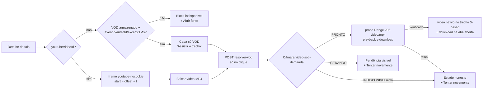

# Impl: Acervo de falas: player resolve o trecho sob demanda e YouTube vira default quando existe

Status: executado
Atualizado em: 2026-09-14
Issue: #999
Intenção: docs/plans/acervo-vod-sob-demanda.md
Appetite restante: herdado (~1,5–2 dias eng; sem corte proposto — a fatia cabe porque não há schema, persistência nem IFrame API)

## Leitura da intenção

- **Outcome:** com o CDN da Câmara vazio, abrir uma fala ainda toca (YouTube quando existir; VOD do trecho exato resolvido no clique quando só houver VOD) e "Baixar" nunca entrega arquivo inexistente — o MP4 é resolvido e verificado na Câmara no clique.
- **O que NÃO negociar:** render/RSC não chama a Câmara (resolução só no clique); `excerptTMs` verbatim (nunca vizinho); link do banco é cache (pode ser ignorado; nunca requisito); sem S3/espelho/transcode; sem segundo player/editor; sem migration/collection/`Consent` novos; crédito "Fonte: Câmara dos Deputados · CC BY 4.0" mantido; gate `canReadSpeechCatalog` vale para a resolução; URLs públicas do acervo intocadas; "Baixar" direto do card da lista sai; `PRONTO` com hash morto vira estado honesto, nunca arquivo morto.
- **O que reavaliar (hipóteses da intenção):**
  - Os helpers de `scripts/lib/camara*.mjs` não são importáveis de `src/` (`.mjs`, `node:crypto`, pilot em node puro) → decisão 1 extrai as regras puras para `src/lib/speechVod.ts`.
  - `youtubeUrl` é `event.urlRegistro` do open data (formato variável) → parser defensivo novo (`parseYoutubeVideoId`), não um `slice` de querystring.
  - A intenção **recomenda** IFrame API para o seek na transcrição, mas admite a degradação C (recarregar o iframe com `start=`) se não couber no appetite. Este plano **escolhe a degradação C** (decisão 4) e registra o gatilho de revisitação — divergência de engenharia permitida pela própria intenção, a destacar no gate.
  - O draft usa "Não foi possível carregar o vídeo deste trecho" (falha) e a intenção usa "vídeo indisponível neste momento" (quadrante nenhum). O plano preserva as duas: quadrante sem oferta = indisponível sem "Tentar novamente"; falha/GERANDO após oferta = cena 4 com "Tentar novamente".

## Abordagem recomendada

**Opções consideradas (arquitetura):** A) helpers puros em `src/lib/speechVod.ts` (dono único) + resolver server-only na vertical + rota JSON; B) duplicar helpers em `src/` e deixar `scripts/` intocado; C) `src/` importar `scripts/lib/camaraSpeeches.mjs` em runtime.
**Recomendação:** A — o app fica com o dono das regras de contrato (URL de trecho, parse do estado, offset BRT), os scripts re-exportam via tsx (precedente `camara:import`) e a resolução interativa nasce server-only com política própria de latência.
**Rejeitadas:** B porque é o twin que a engineering-standards proíbe (drift no contrato `trecho`/`estado`); C porque inverte a fronteira (runtime de produção dependendo de dev tooling), arrasta `node:crypto` para o bundle e não é o dono natural das regras.

### Decisões de engenharia

**1. Onde vive a resolução VOD (extração dos helpers).**
Opções: A) extrair as regras puras de VOD (`CAMARA_USER_AGENT`, `buildVodUrl`, `parseVodStatus`, `parseDurationToSeconds`) para `src/lib/speechVod.ts`; `scripts/lib/camaraSpeeches.mjs` passa a importar/re-exportar de lá (define só o que é de script) e `camara:pilot` ganha o mesmo loader tsx do `camara:import`; B) duplicar em `src/lib/speechVod.ts` e congelar os scripts; C) `src/utilities/speech/` importar `scripts/lib/camaraSpeeches.mjs` por caminho relativo.
Recomendação: **A** — dono único, sem tocar no contrato dos scripts; o pilot é o único ponto de atrito e migra para `cross-env NODE_OPTIONS="--no-deprecation --import=tsx/esm" node scripts/pilot-camara-speeches.mjs` (o `camara:import` já roda assim; nenhum módulo do pilot importa `server-only`, então não precisa do seed-loader).
Rejeitadas: B porque duplica o contrato mais sensível do item (qualquer mudança de `estado`/`trecho` passaria a ter dois donos); C porque o Docker copia `scripts/`, mas produção passaria a depender de tooling de dev, o alias `@/*` não cobre `scripts/` e `node:crypto` entraria no bundle do servidor.
Nota: a política HTTP **não** é unificada — `probeLink`/`getJson` dos scripts têm contrato de relatório em lote (retry 3×/2s, nunca lança); o resolver do app tem contrato interativo (bounded, mapeia falha para estado honesto). Fork de política deliberado, com gatilho de revisitação: se um terceiro call-site interativo surgir, extrair `probeLink` para um módulo compartilhado.

**2. Rota de resolução.**
Opções: A) `POST` JSON em `src/app/(campaign)/campanha/(app)/comunicacao/acervo/resolver-vod/route.ts` via `campaignJsonMutationRoute`, corpo `{ speechId }` (segmento estático convive com `acervo/[id]`; o wrapper não entrega params de rota, então o id vai no corpo, como `municipios/political-trend`); B) server action + `useActionState` no player; C) rota sob `campanha/api/**`.
Recomendação: **A** — a convenção do repo (teste `codebaseConventions` recusa `POST` fora do wrapper) e a proteção estrutural de mesma origem já existem; o `(app)/comunicacao` está no manifesto de e2e; a rota é fine-grained (`dynamic = 'force-dynamic'`), autentica por cookie de campanha e responde JSON com estados discriminados.
Rejeitadas: B porque o ladder de actions devolve `CampaignFormErrorState` (shape de formulário) para um resultado rico (URLs verificadas), e a fronteira de CSRF do wrapper é o mecanismo canônico para mutação JSON sob `/campanha`; C porque fica fora do prefixo do manifesto e exigiria entrada de allowlist no guard de convenções.

**3. Player default com ambos (4 quadrantes sem segundo player).**
Opções: A) um único `SpeechDetailPlayer` client com máquina de estados e **uma** superfície por vez (`youtube` quando `youtubeVideoId`; `prompt`/`native` só quando não há YouTube; `unavailable` quando não há nenhum caminho); B) dois componentes irmãos (YouTube + VOD) com um orquestrador; C) manter `<video>` e iframe soltos no page/actions server.
Recomendação: **A** — YouTube é default quando existe (decisão de produto sinalizada na intenção), o MP4 do "ambos" não troca a superfície (só o `Baixar` resolve), e o "só VOD" mostra capa → resolvendo → `<video>` nativo (0-based, como hoje). Baixar/Abrir fonte passam para dentro do player porque o pending e a URL verificada são acoplados ao estado dele (`sourceUrl` entra por prop); a página segue RSC.
Rejeitadas: B porque multiplica arquivos e reintroduz o orquestrador que o player único elimina; C porque pending/seleção de URL são interativos (client boundary).

**4. Seek na transcrição com YouTube.**
Opções: A) IFrame API (`enablejsapi`, `postMessage`/`seekTo`); B) recarregar o iframe com `start = offset + segment.startSeconds` (degradação C da intenção); C) link `?t=` abrindo o YouTube; D) desabilitar o clique.
Recomendação: **B** — determinística, sem script de terceiro, o contrato vive no `src` do iframe (asserção de e2e por HTTP), e o clique continua posicionando no orador certo; o reload interrompe a reprodução, degradação explicitamente aceitável pela intenção.
Rejeitadas: A porque o plumbing de script/mensagens não cabe com folga no appetite e não tem como ser provado no e2e browserless atual; C porque perde o posicionamento na página (regressão do C154); D porque a intenção marca como regressão.
Com offset (`youtubeOffsetSeconds`) nulo (dados ausentes), a transcrição no YouTube não vira affordance de clique (sem "clique para posicionar") — melhor inerte que pular para outro orador. Gatilho de revisitação: se a assessoria relatar o "pisca/volta ao início" do reload, promover para A em item próprio (o view model já carrega o offset; nenhum dado muda).

**5. Persistência do link resolvido.**
Opções: A) não persistir (estado só no client); B) persistir best-effort quando o ator tem `canUpdateSpeech` (coordinator/candidate), engolindo falha; C) persistir com `overrideAccess: true`.
Recomendação: **A** — o link é cache declaradamente não confiável; a resolução por clique é o fluxo desenhado; nenhuma escrita nova, nenhum teste de write path, nenhum risco de ouroboros (link morto regravado).
Rejeitadas: B porque amplia superfície de escrita e cria semântica "cache às vezes" sem ganho de produto medido; C porque amplia a escrita (proibido pela intenção).
Gatilho de revisitação: latência p50 medida da Câmara tornar o clique repetidamente penoso → item próprio com `canUpdateSpeech` e invalidação explícita.

**6. "Baixar" do card da lista.**
Opções: A) remover `downloadUrl` do `SpeechListItemViewModel`/`SpeechResultCard` (e do `speechListSelect`), preservando `sourceUrl`; B) manter o card baixando o link cru; C) trocar o botão do card por link para o detalhe.
Recomendação: **A** — a intenção manda sair (link efêmero direto); `sourceUrl` continua no card; o detalhe já é o dono do "Ver fala/Assistir no trecho"; menos select na lista.
Rejeitadas: B porque entrega arquivo possivelmente morto; C porque o card já tem "Assistir no trecho" como CTA primário.

**7. Como o estado `GERANDO` é tratado.**
Opções: A) uma chamada `getJson` limitada (2 tentativas, timeout ~15s, backoff curto) que devolve `gerando` e a UI mostra pendência + "Tentar novamente" sem poll; B) poll curto no servidor (ex.: 3×5s) antes de responder; C) poll automático no client.
Recomendação: **A** — o clique tem orçamento de latência; a regeneração observada vai de segundos a minutos, e o convite a tentar de novo é o desenho da intenção ("limite + convite, sem travar a página").
Rejeitadas: B porque segura a request por 15s mesmo quando a Câmara está presa (o `resolveVod` de 200s dos scripts é inadequado aqui); C porque adiciona timers/rate e um retry escondido que a intenção não pede.

**8. Verificação do MP4 (probe) e entrega do download.**
Opções: A) `PRONTO` → probe em paralelo de `linkParaReproducao` e `linkParaDownload` (GET `Range: bytes=0-1023`, fallback HEAD em 405/501, ~10s, nunca lança; verificado = HTTP ok e content-type presente ≠ `text/html`); `<video>` só com playback verificado; "Baixar" só entrega download verificado; B) confiar no `PRONTO` sem probe; C) verificar só no download.
Recomendação: **A** — "Baixar só entrega arquivo verificado" e o player nativo não aponta para hash morto (o `PRONTO` velho medido devolve 403/hash morto). Se playback falha mas download passa, não há `<video>` (estado honesto com retry) mas o download verificado continua ofertado. Na entrega, o clique em "Baixar" abre uma aba em branco **sincronamente** (evita popup blocker) e a aponta para `downloadUrl` só depois de verificado; falha → fecha a aba e mostra o estado honesto. No quadrante ambos o YouTube continua tocando: a falha vira aviso inline ao lado das ações, **não** troca a superfície.
Rejeitadas: B porque viola o aceite (arquivo morto entregue); C porque deixaria o player nativo servir hash morto (draft cena 5 diz "verificado antes de tocar").
Rejeitadas na entrega: `window.open(downloadUrl)` depois do await (popup blocker) e `location.assign` (perde a página da campanha/perde o retry).

**9. Cache/estado no client.**
Opções: A) resultado da resolução só em `useState` do player; reload volta ao default (YouTube no "ambos", capa no "só VOD"); B) `sessionStorage` com o link resolvido; C) revalidar/gravar no servidor.
Recomendação: **A** — sem link morto cacheado, sem estado compartilhado entre abas/sessões; "Tentar novamente" limpa o erro e re-POSTa.
Rejeitadas: B porque ressuscita link efêmero (o problema que o item resolve) e duplica a fonte da verdade; C porque colide com a decisão 5 (sem escrita) e com o render sem Câmara.

### Componentes / mudanças

- **`src/lib/speechVod.ts`** (novo, puro, client-safe, sem imports): `CAMARA_USER_AGENT`, `buildVodUrl`, `parseVodStatus`, `parseDurationToSeconds` (movidos, dono novo), `parseYoutubeVideoId` (watch/`youtu.be`/embed/live/shorts; id `[A-Za-z0-9_-]{6,20}`; domínios YouTube), `excerptOffsetSeconds(excerptTMs, eventStartAt)` (epoch → hora BRT via `Intl` `America/Sao_Paulo` com `hour12:false`, menos o naive parseado como frame UTC; null se não parseável ou negativo; piso inteiro).
- **`scripts/lib/camaraSpeeches.mjs`**: remove as definições movidas e as re-exporta de `../../src/lib/speechVod.ts`; `scripts/lib/camaraFetch.mjs` segue importando de `camaraSpeeches.mjs` (sem mudança).
- **`package.json`**: `camara:pilot` ganha `cross-env NODE_OPTIONS="--no-deprecation --import=tsx/esm"` (espelha `camara:import`).
- **`src/lib/schemas/speechVod.ts`** (novo): `speechVodRequestSchema = { speechId: positiveRelationshipId }` + constantes de mensagem (`SPEECH_VOD_INELIGIBLE_MESSAGE`, `SPEECH_VOD_FORBIDDEN_MESSAGE`, `SPEECH_VOD_NOT_FOUND_MESSAGE`, `SPEECH_VOD_GENERIC_ERROR_MESSAGE`) — exigidas pelo guard de convenções (sem literais em `safeMessages`/`throw new Error` sob `(campaign)`).
- **`src/utilities/speech/speechVodResolver.ts`** (novo, `server-only`): `resolveSpeechVod({ eventId, audioId, excerptTms })` — `buildVodUrl` + uma chamada `getJson`-like bounded (2×, timeout 15s, UA da Câmara) + probe A em paralelo; devolve `{ state: 'pronto', playbackUrl, downloadUrl }` (URLs nulas quando o probe falha), `{ state: 'gerando' }`, `{ state: 'indisponivel' }`; lança só em falha de transporte/parse (o route colapsa no genérico).
- **`src/app/(campaign)/campanha/actions/speech.ts`** (novo, ladder): `resolveSpeechVodForActor({ speechId })` — `getCampaignActionContext`, fast-fail `canReadSpeechCatalog(actor.role)`, `payload.find` da fala com `overrideAccess: false` e `select: { eventId, audioId, excerptTMs, vodPlaybackUrl, vodDownloadUrl }`; sem os campos/`vod` armazenado lança `SPEECH_VOD_INELIGIBLE_MESSAGE`; chama o resolver.
- **`src/app/(campaign)/campanha/(app)/comunicacao/acervo/resolver-vod/route.ts`** (novo) + **`types.ts`**: `export const dynamic = 'force-dynamic'`; `POST = campaignJsonMutationRoute({ bodySchema, safeMessages, genericMessage }, handler)`; resposta `{ status: 'success', state, playbackUrl?, downloadUrl? }`.
- **`src/utilities/speech/speechViewModels.ts`**: lista perde `downloadUrl`; detalhe perde `vodDownloadUrl` e ganha `youtubeVideoId`, `youtubeOffsetSeconds`, `vodResolvable` (vod armazenado **e** `eventId`/`audioId`/`excerptTMs`), calculados com os helpers puros.
- **`src/utilities/speech/speechPageData.ts`**: `speechListSelect` perde `vodDownloadUrl`; `speechDetailSelect` ganha `vodDownloadUrl`, `eventId`, `audioId`, `excerptTMs`, `eventStartAt` (nenhum campo novo no banco — todos já existem).
- **`src/components/campaign/speech/SpeechDetailPlayer.tsx`**: reescrito (client) com props `{ speechId, youtubeVideoId, youtubeOffsetSeconds, vodResolvable, segments, initialSeconds, sourceUrl }` e estados `idle | resolving | generating | ready | unavailable`; ações dentro do player.
- **`src/app/(campaign)/campanha/(app)/comunicacao/acervo/[id]/page.tsx`**: passa as props novas e remove o bloco `<a>` de MP4 (o "Abrir fonte" passa ao player); asides/transcrição oficial intocados.
- **`src/components/campaign/speech/SpeechResultCard.tsx`**: remove o `ActionLink` de download (e o import `DownloadIcon` morto).
- **Migration:** nenhuma — sem schema change, sem `payload-types` novo, `push: false` intocado.
- **Access / Consent:** nenhum `Consent`; leitura da fala com `overrideAccess: false` + gate `canReadSpeechCatalog` na action; nenhuma escrita; sem S3.
- **UI:** Impeccable B — reusar `Button`/`Badge`, `aria-busy` + live region polite no pending (campanha-action-feedback), copy do draft; shape→craft→critique→polish no detalhe.

### Dados → forma

**Não — não se aplica (feedback de ação).** Nenhum KPI/gráfico novo: "resolvendo/gerando/indisponível" é o estado da ação no player (draft cenas 3–4), não dado de acervo; a única forma nova é a superfície do player, já coberta pela direção de UI acima.

## Fases verificáveis

1. **Fase 1 — Tracer puro + extração (dono único).** `src/lib/speechVod.ts` + re-exports em `scripts/lib/camaraSpeeches.mjs` + loader tsx do pilot.
   - Testes: `tests/unit/speechVod.unit.spec.ts` (node) — `buildVodUrl`/`parseVodStatus`/`parseDurationToSeconds` preservados, `excerptOffsetSeconds` com o literal da intenção (`1786473834650` + 15:00 → 2634), o fixture do import (`1675801808560` + `2023-02-07T15:00` → 9008), caso DST antigo, negativo/não-parseável → null; `parseYoutubeVideoId` (watch/`youtu.be`/embed/lixo). `tests/unit/camaraSpeeches.unit.spec.ts` segue verde **pela re-exportação** (prova que a extração preservou o contrato).
   - Verificação: `pnpm test:unit`, `pnpm typecheck`, `node --import=tsx/esm scripts/pilot-camara-speeches.mjs --help`.
2. **Fase 2 — Server (view fields + resolver + rota).** Selects/view model, resolver server-only, schema/mensagens, action e rota.
   - Testes: `tests/unit/speechVodResolver.unit.spec.ts` (fetch mockado: PRONTO+206 → URLs verificadas; PRONTO+403 → sem URL; GERANDO; INDISPONIVEL; timeout lança); `tests/int/speechAcervo.int.spec.ts` estendido (detalhe expõe `youtubeVideoId`, `youtubeOffsetSeconds` calculado, `vodResolvable` true/false; lista sem `downloadUrl`).
   - Verificação: `pnpm test:unit`, `pnpm test:int`, `pnpm typecheck`, `pnpm build` (convivência `acervo/resolver-vod` × `acervo/[id]`).
3. **Fase 3 — Player.** Máquina de estados, iframe com `start=` e capa só VOD, `<video>` nativo pós-PRONTO, aviso inline de falha no quadrante ambos.
   - Testes: `tests/unit/speechDetailPlayer.unit.spec.tsx` (jsdom + testing-library, fetch mockado) — só VOD: capa → clique → pending/`aria-busy` → `<video src>` no trecho; falha → bloco honesto + "Tentar novamente" re-POSTa; ambos: iframe com `start=offset+t`, Baixar pendente/desabilitado e depois entrega, transcrição atualiza o `src`; sem YouTube sem VOD → bloco sem retry.
   - Verificação: `pnpm test:unit`.
4. **Fase 4 — Card/lista.** Remoção do download do card/view model e do select da lista.
   - Testes: unit/componente do card + int da lista.
   - Verificação: `pnpm test:unit`, `pnpm test:int`, `pnpm exec knip` (import órfão do `DownloadIcon` morto).
5. **Fase 5 — E2E renegociado + gates.** `tests/e2e/campaignSpeechAcervo.e2e.spec.ts`:
   - fixtures novas com `youtubeUrl` + `eventStartAt`/`eventId`/`audioId`/`excerptTMs` (ambos e só VOD) e sem vídeo;
   - ambos: `youtube-nocookie.com/embed/<id>` com `start=<offset>` e "Baixar vídeo (MP4)" e `data-start-seconds`, sem `<video>` no load;
   - só VOD: capa "Assistir o trecho", sem iframe/`<video>` no load, "Baixar vídeo (MP4)" presente (e não contém o link `vod.camara.leg.br` na lista do card);
   - sem vídeo: "Vídeo indisponível neste momento" + "Abrir fonte", sem "Tentar novamente"; falha pós-clique coberta no unit da fase 3;
   - rota: POST sem sessão → 401; advisor → mensagem de acesso (400); origem estranha → 403; fala inelegível → 400 (sem rede).
   - Verificação: `pnpm gate:fast`, `pnpm test:e2e:affected`, `pnpm push`; changelog `docs/changelog/2026-09-14-c162-vod-sob-demanda.md`.

## Gatilhos de revisitação (pós-simplify, 2026-09-14)

- **Popup blocker no download:** se a assessoria relatar "Baixar vídeo (MP4)" sem nada abrir (Safari/iOS), trocar o fallback pós-await por um aviso com link verificado na página. *(defer; score 3)*
- **`parseYoutubeVideoId` com id de 6–10 chars:** mantido `{6,20}` (contrato desta fatia); se um `urlRegistro` real curto gerar iframe quebrado, alinhar a `{11}`. *(defer; score 2)*
- **Política HTTP duplicada:** deliberada na decisão 1 — 3º call-site interativo extrai o `probeLink` compartilhado. *(defer; score 2)*

## Rabbit holes / Não escopo (engenharia)

- IFrame API do YouTube (seek sem reload) — degradação C aceita; gatilho na decisão 4.
- Persistir/aquecer o link resolvido, re-verificação em background/cron, "gerar novamente" manual, regenerar os 924 em lote.
- Espelhar/transcodificar MP4 (S3/Garage), download em lote, editor/corte.
- Poll de `GERANDO` (servidor ou client) e qualquer chamada à Câmara no render/RSC.
- Segundo player, redesign da lista/detalhe além da saída do "Baixar" do card, "Abrir no YouTube" no lugar do MP4.
- Migration/collection/`Consent` novos; unificar a política de `probeLink` dos scripts com a do app (fork deliberado, decisão 1).

## Riscos e mitigação

- **`youtubeUrl` fora do formato esperado** (`urlRegistro` varia) → `parseYoutubeVideoId` defensivo com unit tests; null cai no caminho só VOD/indisponível (nunca iframe quebrado).
- **Latência/anti-bot da Câmara** (400 "Acesso via bot", timeouts) → UA compartilhado, 2 tentativas com timeout curto, estado honesto com "Tentar novamente"; nenhuma página depende da Câmara para renderizar.
- **Migração do pilot para tsx** (script dormente) → smoke `--help` + unit tests da re-exportação; rollback é uma linha de `package.json`.
- **E2E browserless não clica** → interação (resolvendo → `<video>`, falha, retry, seek) provada no unit jsdom; e2e prova contrato HTTP, gates e o HTML inicial.
- **Colisão de rota** `acervo/resolver-vod` × `acervo/[id]` → ids são numéricos e `pnpm build` valida; e2e cobre o POST.
- **Manifesto de e2e**: `(app)/comunicacao`, `src/components/campaign/speech`, `src/utilities/speech` e `src/lib/speech*` já mapeiam para `campaignSpeechAcervo`; `src/lib/schemas/speechVod.ts` cai no prefixo `src/lib/speech`.
- **Knip `exports:error`**: re-exports dos scripts cobertos pelas entradas `scripts/*.mjs`; símbolos novos usados por action/route/player; rodar `pnpm exec knip` na fase 4.

## Aceite de engenharia

- [x] Aceite de produto da intenção ainda coberto (quadrantes, `excerptTMs` verbatim, Baixar verificado, estado honesto, crédito CC BY, gate do acervo).
- [x] Invariantes AGENTS/engineering-standards (dono único, sem twin, sem migration/collection/Consent, sem escrita nova, `overrideAccess: false`, client boundary, zero warnings, dead code).
- [x] Testes de domínio previstos (unit/resolver/player/int/e2e) onde o access/write path e os contratos de URL mudam.

## Self-score (decision-quality, gate ≥4)

5/5 — (1) todas as decisões caras (extração, rota, player único, persistência, verificação) têm opções + rejeitadas explícitas; (2) cabe no appetite herdado porque corta IFrame API, persistência e poll; (3) rabbit holes nomeados com corte; (4) depth check: reusa `campaignJsonMutationRoute`, ladder de actions, `getCampaignActionContext`, `speechPageData`/`speechViewModels` e o padrão de feedback de ação — nada de shell/abstração paralela; (5) o outcome da intenção permanece intacto, com a degradação 4-C explicitamente permitida e sinalizada ao gate humano.
