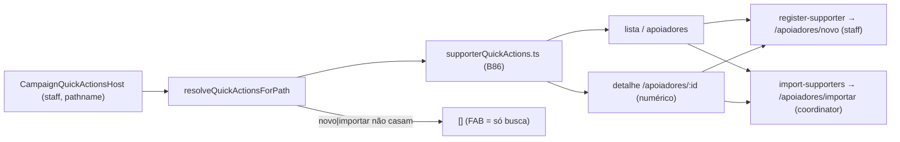

# Impl: Ações rápidas — Apoiadores (staff)

Status: aprovado (gate humano 2026-08-03)
Atualizado em: 2026-08-03
Issue: #22
Intenção: docs/plans/acoes-rapidas-apoiadores.md
Appetite restante: ~0,25–0,5 dia eng (herdado); sem migration

## Leitura da intenção

- **Outcome:** staff em `/campanha/apoiadores` (lista e detalhe) cadastra / importa sem voltar ao Início — via o chrome de ações rápidas (FAB/overlay) já montado para staff em toda rota fora do Início e `/acoes/*`.
- **O que NÃO negociar:** staff-only nesta rota (leader → B89 Contatos, não esta rota); sem novo Consent (launchers apontam para os flows C2 existentes, que fail-closed); sem A1–A5 como primários (recomendação da intenção: **A — não incluir**); busca já vive no overlay (B91 ✓).
- **O que reavaliar:** a intenção assume "atalho import se houver URL estável" — a rota `/campanha/apoiadores/importar` existe e é estável (wizard 3 passos; apontar a ela = passo 1 = upload, sem bypass de preview — revisão obrigatória da intenção satisfeita). O gating do import no código é **coordinator-only** (`isCampaignCoordinator` na página e redirect no `importar/page.tsx`), mais restrito que `isUnrestrictedCampaignRole` — o catálogo do drawer deve espelhar esse gate.

## Abordagem recomendada

**Opções consideradas:** A | B | C
**Recomendação:** **A** — módulo novo `supporterQuickActions.ts` espelhando `campaignAdvisorQuickActions.ts` (B87), com superfície lista+detalhe, catálogo de 2 launchers, import gated a coordinator; registro no registry central; testes unit espelhando B87/B85.
**Rejeitadas:**
- **B — superfície inclui `/apoiadores/novo` e `/apoiadores/importar` com o mesmo catálogo:** redundante (a página já é o próprio formulário/wizard); precedente B85 exclui `nova` do detalhe e deixa a página de form com FAB só-busca. Rejeitada.
- **C — "Importar CSV" para todo staff (`isUnrestrictedCampaignRole`):** espelha a intenção mas NÃO o gate de servidor — `importar/page.tsx` redireciona não-coordinator para `/apoiadores`; o launcher levaria advisor/candidate a um redirect. O drawer deve espelhar o gate da página (coordinator-only), como o botão "Importar CSV" da lista faz.
- **D — catálogo com A1–A5 do Início (prefill de município):** rejeitado pela própria intenção (questão em aberto → recomendação A) e não há município garantido no contexto da ficha de apoiador.

### Componentes / mudanças

- **`CAMPAIGN_SUPPORTERS_HOME`** (`src/lib/campaignPaths.ts`): constante `/campanha/apoiadores`, padrão dos irmãos (`CAMPAIGN_DEMANDS_HOME`, `CAMPAIGN_ADVISORS_HOME`).
- **`supporterQuickActions.ts`** (`src/lib/`): `isSupportersListPath` (match exato), `parseSupporterDetailId` (regex `^/campanha/apoiadores/(\d+)(?:\/|$)`, como `parseAdvisorDetailId`), `isSupportersPath`, `resolveSupporterListQuickActions` / `resolveSupporterDetailQuickActions` / `resolveSupporterQuickActionsForPath`. Gate: `isStaffCampaignRole` (coordinator/advisor/candidate — igual a `canAccessSupporterArea`); `import-supporters` adicional só `role === 'coordinator'` (espelha `isCampaignCoordinator`).
- **`campaignQuickActionRegistry.ts`**: entrada nova delegando para `resolveSupporterQuickActionsForPath`, agrupada com as verticais (após advisor, antes de territórios). Sem colisão de path com outros matchers.
- **Actions:** `register-supporter` (label "Cadastrar apoiador", `UserPlus`, href `/campanha/apoiadores/novo` — id igual ao da intenção/i18n) e `import-supporters` (label "Importar CSV", `FileUp`, href `/campanha/apoiadores/importar`). `CampaignQuickAction` client-safe; overlay já renderiza via `CampaignHomeActionStrip variant="grid"`.
- **Migration:** sem migration; sem collection; sem Consent; sem server action nova.
- **Access / Consent:** role predicates client-safe (`isStaffCampaignRole` / `role === 'coordinator'`); nenhuma escrita; launchers para flows existentes fail-closed.
- **UI:** Impeccable **B** (a intenção pede "Craft + Revisão na implementação") — a superfície é o chrome existente (FAB/overlay B100+), sem shape novo; nada a renderizar além do que o registro devolve. Mount já cobre staff em `/apoiadores/**` (`shouldMountQuickActionsFab`); leader já fica de fora (mount só em Contatos).

### Dados → forma (se aplicável)

- N/A — sem dados novos; launchers de navegação (hrefs), mesma forma dos catálogos B80–B90.

## Fases verificáveis

1. **Tracer / schema+server** — constante de path + módulo `supporterQuickActions.ts` + entrada no registry; testes unit novos (`supporterQuickActions.unit.spec.ts`) + atualização do pin "unregistered paths" e teste de delegação no `campaignQuickAction.unit.spec.ts`.
2. **UI** — nenhuma mudança de componente; verificação via unit (catálogo por role/path) + smoke manual do FAB em `/campanha/apoiadores` se o dev server estiver disponível.
3. **Gates** — `pnpm gate:fast` na iteração; entrega com `pnpm push`; PR Ready `--base main` + `Closes #22` + auto-merge.

## Rabbit holes / Não escopo (engenharia)

- **Context sync / prefill de município na ficha de apoiador** (`CampaignQuickActionContextSync`): o apoiador tem `municipality` opcional, mas a intenção não pede A1–A5 — fora de escopo; gatilho se a ficha ganhar wizards.
- **Tocar os botões da página `/apoiadores`** ("Novo" / "Importar CSV"): o botão da lista já cobre desktop; o drawer cobre mobile — não duplicar nem refatorar (o catálogo é independente).
- **B79 drawer antigo / `CampaignQuickActionsDrawer`**: arquitetura atual é FAB+overlay (B100+); nenhum resquício a alterar.
- **`needs:consent` na Issue:** herdado da vertical C2 (bloqueio de produção para dados reais); B86 só navega para flows existentes fail-closed — não coleta nada, não depende de chave nova.

## Riscos e mitigação

- **Gate de import divergir entre drawer e página** (advisor/candidate vendo "Importar CSV"): mitigado — gate `role === 'coordinator'` espelha `isCampaignCoordinator`, pinado em teste.
- **Ficha de apoiador com id não-numérico futuro** (slug): regex numérica só casa ids atuais; se virar slug, o parser evolui com a rota (mesmo caminho do assessor).
- **Colisão de path no registry:** `/campanha/apoiadores/*` não é reivindicado por nenhum matcher existente; teste de delegação pinado.

## Aceite de engenharia

- [ ] Aceite de produto da intenção ainda coberto (staff cadastra/importa do drawer; leader fora; sem A1–A5; busca já no overlay)
- [ ] Invariantes AGENTS/engineering-standards (client-safe, sem escrita, sem migration/Consent)
- [ ] Testes de domínio previstos (unit: paths, catálogo por role — coordinator 2 ações, advisor/candidate 1, leader `[]`; registry: delegação + unregistered paths atualizado)
