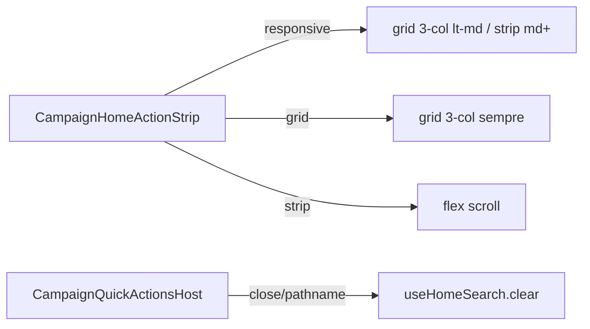

# Impl: Ações rápidas — grade 3×2 (Início + FAB) e polimento do overlay

Status: aprovado
Atualizado em: 2026-08-02
Issue: #280
Intenção: docs/plans/acoes-rapidas-grade-3x2-fab-overlay.md
Appetite restante: ~0,5d (layout + overlay polish)

## Leitura da intenção

- **Outcome:** Início mobile e overlay FAB usam grade 3×2; overlay sem strip scroll; drawer encaixa no conteúdo; busca com respiro no topo quando focada; query limpa ao fechar/navegar.
- **O que NÃO negociar:** catálogo/lockdown; Início md+ strip; sem migration; sem snap/peek.
- **O que reavaliar:** variante `strip` no overlay → nova variante `grid` (grade em todas as larguras do overlay); bleed `-mx-4` obsoleto com grade.

## Abordagem recomendada

**Opções consideradas:** A) reutilizar `responsive` no overlay (quebra desktop — vira strip) | B) variante `grid` dedicada | C) prop `columns={3}`  
**Recomendação:** **B** — `grid` para overlay; `responsive` passa de 2→3 colunas no mobile.  
**Rejeitadas:** A (aceite exige grade no dialog desktop); C (over-parameterize).

### Componentes / mudanças

- **`CampaignHomeActionStrip`:** `variant` ganha `'grid'`; `responsive` usa `grid-cols-3`; `grid` = `grid grid-cols-3 gap-3` sem overflow/pan.
- **`CampaignHomeActionButton`:** sem mudança (já `w-full` em responsive/grid).
- **`CampaignQuickActionsOverlay`:** `variant="grid"`; remove bleed wrapper; drawer sem `flex-1` stretch — altura auto com `max-h` só como teto; `pt-4` na busca quando `uiFocused`.
- **`CampaignQuickActionsHost`:** `clear()` em `onOpenChange(false)` e no `useEffect` de `pathname`.
- **Tests:** strip spec 2→3 cols; overlay strip→grid; bleed test removido/atualizado; clear on close/pathname.
- **Migration:** sem migration.

### Dados → forma

N/A — chrome de launcher.

## Fases verificáveis

1. **Strip variants** — `grid-cols-3` + variante `grid`.
2. **Overlay polish** — grid, altura conteúdo, respiro busca, clear query.
3. **Gates** — `pnpm gate:fast`; `pnpm push`.

## Rabbit holes / Não escopo (engenharia)

- Refatorar `Drawer.tsx` globalmente.
- Extrair tile genérico.
- Mudar tamanho dos círculos de ação.

## Riscos e mitigação

- **3 colunas em 390px:** gap-3 + w-full já usados em B122; labels line-clamp-2.
- **Clear no Início:** provider separado no home — clear no host só afeta overlay provider.
- **Dialog desktop altura:** manter `max-h` como teto para resultados longos.

## Aceite de engenharia

- [x] Aceite de produto da intenção ainda coberto
- [x] Invariantes AGENTS/engineering-standards
- [x] Testes unit previstos (strip, overlay, clear)

Self-score decision-quality: 5/5
