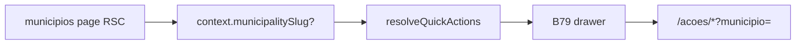

# Ações rápidas — Municípios (lista + detalhe)

Status: rascunho
Atualizado em: 2026-07-30
Item do roadmap: [docs/roadmap.md](../roadmap.md) (Trilha B, item **B80** — consumer do B79)
Impeccable: B — encaixe no drawer B79; catálogo + prefills; sem rota nova
Appetite: ~0,5–0,75 dia eng; registry + hrefs contextualizados; sem migration
Responsável: —

## Design (Impeccable)

Âncoras: `PRODUCT.md` / `DESIGN.md` · catálogo B45 · wizards B59+ · tema `campaign`.

Na implementação: craft compacto → critique → polish. **Antes do craft:** revisar o catálogo abaixo contra o estado atual dos wizards/rotas (seção Revisão).

Brief compacto:

- **Persona:** staff na lista ou no detalhe de município, no celular, quer agir sem voltar ao Início.
- **Job principal:** no detalhe, lançar A1–A5 **já com o município** (pula B60); na lista, mesmas ações do Início (escolhe município no wizard).
- **Estratégia de cor:** Restrained (herda B79).
- **Edit where you see:** não — launchers para wizards/listas já existentes.
- **Anti-goals:** duplicar formulários do detalhe no drawer; esconder edição inline da lista.

## Dados → decisão → apresentação

Dados: N/A — launchers; números ficam nos wizards/detalhe.

## Contexto

Exemplo canônico do pedido 2026-07-30: no detalhe `/campanha/municipios/[slug]`, as ações do Início partem com `?municipio=<slug>` via `wizardActionHref`. Lista `/campanha/municipios` usa os mesmos ids sem prefill (paridade B45).

## Objetivos

- Registrar no registry do **B79** as superfícies `municipios` (lista) e `municipios/[slug]` (detalhe).
- **Detalhe:** ações `update-votes`, `register-signal`, `change-trend`, `update-leadership`, `register-demand` com `wizardActionHref(slug, municipio)`; atalho `uncovered-municipalities` opcional (baixa prioridade no detalhe — pode omitir).
- **Lista:** espelhar catálogo staff do Início (B45), hrefs sem município.
- Assessor: mesmas regras de escopo (wizard/access já filtram).
- Sem migration / Consent / action nova.

## Revisão na implementação _(obrigatória)_

No Passo 4–7 de `implement-roadmap-item`, o agente **pode e deve** propor alteração de ids/rótulos/prefills se wizards novos, rotas renomeadas ou evidência de campo contradisserem esta tabela. Registrar a proposta em “Questões em aberto” do PR/plano as-built; não expandir appetite sem validar com produto se mudar o verbo principal.

## Decisões travadas

- **Detalhe = Início + `?municipio=` e skip da etapa B60.** **Rejeitado:** abrir `/editar`; Sheet local de votos no drawer.
- **Lista = paridade Início (sem prefill).** **Rejeitado:** forçar “último município visitado” sem pedido.
- **i18n:** ids estáveis do B45; labels curtos da strip (B58).

## Questões em aberto

- **Incluir “Ver esquecidos” no detalhe?** **Opções:** A) não | B) sim. **Recomendação:** **A** — fora de contexto no detalhe.

## Abordagem proposta

Componentes:

- Provider/registry entries em `src/lib/` (ou ao lado do chassis) lendo `params.slug` no detalhe.
- Reuso `toHomeActionButtonProps` / `wizardActionHref`.
- **Migration:** nenhuma.

## Dependências

- Dura: **B79**. Soft: B45 ✓, B60 ✓, B61/B63/B64/B70 conforme disponíveis (href aponta; wizard incompleto = página ponte).

## Não escopo

- Chassis UI → **B79**. Outras verticais → **B81–B90**. Territórios → **B81**.

## Rabbit holes

- **Deep-link para tab específica do detalhe além do wizard.** **Mitigação:** só wizards + atalhos de lista neste item.

## Adiado com gatilho

- **Ação “Definir nível” (E14) no drawer do detalhe.** Revisitar quando o CG pedir N0–N4 no ritual mobile (hoje submit explícito + nota).

## Referências

- [chassis-bottom-drawer-acoes-rapidas.md](chassis-bottom-drawer-acoes-rapidas.md) · `campaignActionRoutes.ts` · `campaignHomeActions.ts` · `municipios/[slug]/page.tsx`
