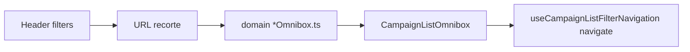

# Impl: B128 — Adotar barra omnibox nas demais listas `/campanha`

Status: aprovado
Atualizado em: 2026-08-02
Issue: #265
Intenção: docs/plans/adotar-barra-filtros-omnibox-listas.md
Appetite restante: todas as listas do mapa B127 (exceto Municípios, já piloto)

## Leitura da intenção

- **Outcome:** Staff usa a mesma barra omnibox (chips + sugestões) em territórios, lideranças, dobradinhas, apoiadores, atividades, demandas, organizações e assessores; abas de atividades ficam fora; semântica/URL congelados.
- **O que NÃO negociar:** contrato URL B18; leader lockdown; não inventar `q` em atividades/demandas; deep-links `activity` em demandas; header filters sincronizados via URL.
- **O que reavaliar:** um adapter gigante cross-domínio — rejeitado; extrair só `filterOmniboxSuggestionSeeds` + `searchOnlyListOmnibox` em `lib/` (2º+ consumidor).

## Abordagem recomendada

**Opções:** A) adapter por domínio (espelha B127) · B) DSL única · C) copiar JSX sem adapter  
**Recomendação:** A — testável, sem twin; B128 é N listas com mapas distintos.  
**Rejeitadas:** B (over-engineering); C (intestável).

### Componentes

- **`lib/campaignListOmnibox.ts`:** `createOmniboxSuggestionSeed`, `filterOmniboxSuggestionSeeds` (cap 8/grupo + chip Busca).
- **`lib/searchOnlyListOmnibox.ts`:** degeneração organizações/assessores.
- **`utilities/<domínio>/*Omnibox.ts`:** território, liderança, dobradinha, apoiador, atividade, demanda.
- **`*Filters.tsx`:** substituem pilha antiga; atividades mantém `ActivityTabSwitch` acima.
- **`DemandFilters` / `OrganizationFilters` / `AdvisorFilters`:** extraídos das pages RSC.
- **Tests:** unit por adapter; `campaignListFilterNavigation` deixa de pinar territórios/dobradinhas (omnibox não debounce).

### Migration / access

Sem migration. Access inalterado.

## Fases

1. Shared helpers + adapters puros + unit tests
2. UI shells (8 listas) — remover `CampaignSearchInput`, collapsible, mobile selects, `CampaignFilterChips` nas rotas tocadas
3. `pnpm gate:fast` → `pnpm push`

## Rabbit holes

- Generalizar saved views (fora de escopo B18)
- Refatorar `municipalityOmnibox` para shared helpers no mesmo PR só se custo baixo

## Aceite de engenharia

- [ ] Aceite de produto da intenção
- [ ] Invariantes URL / lockdown
- [ ] Unit tests nos adapters novos

**Decision-quality:** 5/5
