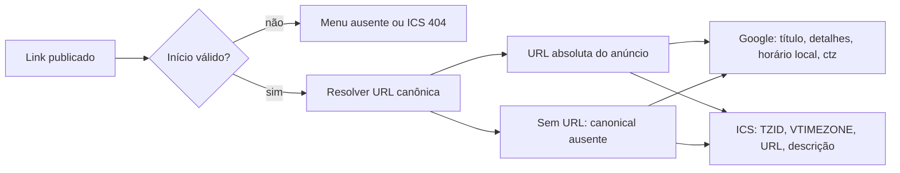

# Impl: S41 — Agenda do link de anúncio: evento leva o próprio link, assinatura "Jorge Solla 1313" e fuso da Bahia

Status: aprovado — autoaprovado pela invocação `--auto`
Atualizado em: 2026-09-25
Issue: #1335
Intenção: `docs/plans/agenda-do-link-de-anuncio-com-link-e-assinatura.md`
Priority: P2
Impeccable: A — sem UI nova; somente o conteúdo gerado para Google Agenda e `.ics`
Design UI: N/A — a página, o menu e o cadastro não mudam visualmente
Appetite restante: herdado (~0,5 dia eng); sem migration, sem schema e sem novos owners de produto
Responsável: —

## Leitura da intenção

- **Outcome:** os dois caminhos de agenda carregam a URL canônica do anúncio, acrescentam a assinatura ` - Jorge Solla 1313` uma única vez e apresentam o horário no fuso `America/Bahia`, sem alterar a página ou o cadastro.
- **O que não negociar:** a descrição configurada vem antes de `Página do evento: <url>`; o `.ics` também tem `URL` de `VEVENT`; a ausência de URL canônica remove apenas o link; duração padrão de 2h, ausência de início, 404 de despublicado e fail-closed permanecem; sem Consent, PII, RSVP, convite, agenda pública ou API do Google.
- **O que reavaliar:** a intenção escreve o domínio público de produção como literal, enquanto o código usa a cadeia global-first de SEO; os dois caminhos atualmente serializam UTC e não há precedente local para `TZID`/`VTIMEZONE`; a composição de título e descrição precisa ficar em um único owner.

## Abordagem recomendada

**Opções macro:** A) manter os dois caminhos em UTC e acrescentar apenas texto | B) serializar o mesmo instante no fuso Bahia, com `ctz` no Google e `TZID`/`VTIMEZONE` no ICS | C) criar um segundo modelo de evento para a agenda pública.

**Recomendação:** B, com as transformações de conteúdo centralizadas em `calendarEvent` e a URL canônica resolvida no servidor. É a menor mudança que satisfaz o aceite sem criar uma agenda paralela.

### Decisões de engenharia

#### D1 — Domínio canônico fixo versus metadata configurável

**Opções:** A) hardcode de `https://jorgesolla1313.com.br` em cada builder/rota | B) usar a cadeia canônica existente: `getCachedGlobal('metadata')` → `resolveSiteMetadata` → `absoluteSitePath(siteUrl, shareLinkPath(slug))` | C) usar `window.location.origin` ou o host da requisição.

**Recomendação:** B — em produção, o valor global deve resolver `https://jorgesolla1313.com.br`, preservando o contrato S19/S29. `NEXT_PUBLIC_SITE_URL` continua sendo o fallback de worktree, staging e ambiente sem global; a origem é configuração do site, não um novo campo por link. A política fica em `resolveShareLinkCanonicalUrl`, no reader server-only, e a página e a rota do `.ics` consomem o mesmo resultado.

O reader devolve `undefined` quando não há `siteUrl`; nenhum builder recebe `shareLinkPath(slug)` como se fosse uma URL. Também não usar `resolveDeploymentOrigin`, que é a origem de assets e pode ser diferente do domínio canônico.

**Alternativas rejeitadas:** A duplica a política em vários arquivos e quebraria staging/testes ao apontar para produção. C transforma a origem atual de navegação em canonical, podendo gerar URLs diferentes entre visitors, página e download.

#### D2 — Representação do fuso nos consumidores

**Opções:** A) manter `DTSTART`/`dates` em UTC e apenas adicionar uma dica de timezone | B) converter o instante para horário civil de `America/Bahia`, usar horário local sem `Z` no Google com `ctz=America/Bahia`, e usar `TZID=America/Bahia` mais um `VTIMEZONE` fixo no ICS | C) escrever offsets numéricos `-0300` em todo lugar.

**Recomendação:** B — `startsAt` e `endsAt` continuam instantes UTC; só a representação externa muda. O Google recebe `20261003T190000` e `ctz=America/Bahia`; o ICS recebe `DTSTART;TZID=America/Bahia:20261003T190000` e `DTEND;TZID=America/Bahia:20261003T210000`, com `VTIMEZONE` contendo um bloco `STANDARD` fixo em `-0300`, sem `DAYLIGHT`. `DTSTAMP` continua em UTC, pois representa o instante de gravação, não o horário do evento.

A conversão usa o owner de horário Bahia já existente em `campaignTime.ts`, sem nova dependência. O feed público da campanha e `googleCalendarEventMapping.ts` mantêm seus próprios contratos UTC/offset; não serão compartilhados nem alterados.

**Alternativas rejeitadas:** A preserva o instante, mas não informa ao leitor qual fuso deve ser exibido. C não é a forma padrão para `DTSTART`/`DTEND` de um VEVENT e não oferece a definição IANA que alguns clientes esperam.

#### D3 — Dono do título, descrição e URL do evento

**Opções:** A) cada caller monta título e descrição antes de chamar o builder | B) `calendarEvent.ts` recebe título/descrição crus e uma `url` opcional, aplicando as transformações uma vez | C) criar um serviço paralelo de conteúdo de calendário.

**Recomendação:** B — `CalendarEventInput` ganha `url?: string | null`, mas não conhece origem, environment ou slug. O builder:

- acrescenta ` - Jorge Solla 1313` ao final apenas quando esse sufixo exato ainda não está no fim;
- compõe a descrição como descrição configurada, linha em branco, `Página do evento: <url>` quando houver URL;
- mantém a descrição original, sem linha extra, quando a URL não for resolvida;
- deixa o título e a descrição da página intocados.

Assim, o menu e a rota passam o mesmo dado bruto e recebem a mesma saída. O nome `Jorge Solla 1313` é copy do produto; os identificadores permanecem em inglês.

**Alternativas rejeitadas:** A permite divergência entre Google e ICS e duplica a regra anti-sufixo. C cria um segundo owner para um domínio que já tem um builder puro.

#### D4 — Campo de URL do VEVENT

**Opções:** A) URL somente na descrição | B) URL na descrição e em `URL:<url>` dentro do `VEVENT` | C) colocar a URL no campo de local do Google ou forçar um campo de URL equivalente.

**Recomendação:** B — o `.ics` usa a propriedade padrão `URL`; o Google recebe a URL apenas na descrição, porque o template não tem um campo de URL de evento equivalente. A URL do `VEVENT` e a linha `Página do evento` devem ser o mesmo valor absoluto. Sem canonical resolvido, as duas posições devem ser omitidas.

**Alternativas rejeitadas:** A deixa de cobrir o requisito explícito do ICS. C mistura papel de local e destination, altera a semântica do evento e não resolve o Google.

#### D5 — Testes

**Opções:** A) unit para a serialização, int para a resolução server-side e e2e para a página/rota | B) somente e2e | C) somente unit.

**Recomendação:** A — a serialização é pura e deve ser rápida; o reader server-only e o contrato de publicado/404 ficam no int; o menu real e o download precisam do fluxo e2e. Não criar teste de browser para o Google Calendar externo, apenas inspecionar o `href` gerado.

**Alternativas rejeitadas:** B deixa a composição de URL e timezone sem feedback rápido. C não prova a integração entre metadata, página client e rota `.ics`.

## Componentes / mudanças

- **`resolveShareLinkCanonicalUrl`** (`src/utilities/shareLinkReads.ts`): helper server-only que reutiliza `getCachedGlobal('metadata')`, `resolveSiteMetadata`, `absoluteSitePath` e `shareLinkPath`; devolve a URL canônica ou `undefined`. Não altera o reader de publicados nem o filtro `published: true`.
- **`src/app/(frontend)/[type]/page.tsx`**: usar o helper na resolução do canonical de metadata e no ramo de anúncio; passar a URL para o view. Manter `resolveShareLinkMetadata`, `noindex`, redirect de link direto, poll de live e branch de destino sem alteração.
- **`src/lib/shareLinkAnnouncement.ts`**: adicionar `canonicalUrl: string | null` ao view e ao builder do view. A função continua pura e client-safe; não importa metadata, environment ou `window`.
- **`src/components/shareLink/ShareLinkAnnouncement.tsx`**: encaminhar `view.canonicalUrl` para `ShareLinkAgendaMenu`. Não alterar markup, rótulos, layout, heading ou CTA.
- **`src/components/shareLink/ShareLinkAgendaMenu.tsx`**: receber a URL canônica como prop e passá-la ao `buildGoogleCalendarEventUrl`. O menu continua condicionado a `startsAt`; uma URL ausente não pode esconder o menu. O href do download continua `shareLinkIcsPath(slug)`, que é um path de navegação e não a URL descrita no VEVENT.
- **`src/lib/calendarEvent.ts`**:
  - estender `CalendarEventInput` com `url` opcional;
  - centralizar sufixo, composição da descrição e validação de URL absoluta;
  - formatar os instantes como horário civil de `America/Bahia` para os campos de evento;
  - emitir `ctz=America/Bahia` no Google, sem `Z` em `dates`;
  - emitir `VTIMEZONE`, `TZID` e campos locais no ICS;
  - manter `METHOD`, `PRODID`, `UID`, `DTSTAMP`, `LOCATION`, `resolveCalendarEventWindow`, o fallback de 2h e o retorno `null` sem início válido;
  - continuar usando `escapeICalText` e `foldICalLine` em todas as linhas lógicas do ICS.
- **`src/lib/campaignTime.ts`**: adicionar um export puro para data/hora local IANA com segundos, reaproveitando `getZonedParts`; não alterar `formatIsoAsBahiaDateTimeInput`, `formatBahiaEventDateLabel` nem os contratos usados pelo admin.
- **`src/lib/shareLink.ts`, `src/lib/ical.ts` e `src/utilities/seo.ts`**: reutilizar `shareLinkPath`, os primitivos iCal e o resolver de SEO; não criar helpers gêmeos.
- **`src/utilities/calendarFeed.ts` e `src/lib/googleCalendarEventMapping.ts`**: nenhum toque. O feed de campanha continua em UTC e o mapeamento da API Google continua com seu offset próprio.
- **Migration:** nenhuma. Não alterar `ShareLink`, Payload types, hooks, access ou banco; não executar `migrate:create`, `migrate` ou `generate:types`.
- **Access / Consent:** nenhuma mudança. Não há escrita, PII, pessoa ou nova chave de consentimento; o reader público continua fail-closed para rascunho.
- **UI:** Impeccable A. Nenhum componente, shell, token, CSS, designer ou screenshot novo; a mudança é limitada ao href gerado e ao corpo do `.ics`.
- **Changelog:** uma entrada curta em `docs/changelog/2026-09-25-s41.md`, sem editar o agregado.

## Dados → forma

- **data-presentation:** não aplicável. Não há métrica, gráfico, série, ranking ou painel; o dado alterado é o payload de um evento de calendário, não uma visualização de dados.

## Fases verificáveis

1. **Tracer de domínio puro (~40% do appetite)**
   - Atualizar `calendarEvent.ts` e o export de data/hora Bahia.
   - Fechar a matriz de título já assinado, título simples, descrição vazia, URL presente/ausente, URL relativa/inválida, escape, newline, URL longa, início ausente, fim inválido e duração de 2h.
   - O exemplo de boundary deve confirmar que `2026-10-03T22:00:00.000Z` vira `19:00` da Bahia no Google e no ICS, enquanto `DTSTAMP` permanece UTC.
   - Rodar:
     - `pnpm test:unit -- tests/unit/calendarEvent.unit.spec.ts tests/unit/ical.unit.spec.ts tests/unit/shareLinkAnnouncement.unit.spec.ts`
   - Critério: os dois builders produzem o mesmo título/descrição/fuso e o ICS continua com CRLF, escape e folding válidos.

2. **Wiring server/client (~35%)**
   - Adicionar o reader de canonical e alimentar `canonicalUrl` no view, menu e rota.
   - Preservar a página sem canonical, o menu com início válido, a ausência de menu sem início, o 404 de despublicado/desconhecido e o comportamento de link direto/live.
   - Cobrir no int a precedência `metadata.URL` sobre `NEXT_PUBLIC_SITE_URL`, o caminho `/<slug>` e o retorno ausente sem URL.
   - Rodar:
     - `pnpm test:int -- tests/int/shareLink.int.spec.ts`
     - `pnpm test:unit -- tests/unit/calendarEvent.unit.spec.ts tests/unit/ical.unit.spec.ts tests/unit/shareLinkAnnouncement.unit.spec.ts`
   - Critério: a rota e a página usam a mesma origem canônica; nenhum link gerado usa destino, path relativo ou `window.origin`.

3. **Integração e fechamento (~25%)**
   - Atualizar `tests/e2e/frontendShareLink.e2e.spec.ts` para abrir o menu no browser e verificar o `href` do Google sem abrir o serviço externo.
   - No mesmo spec, baixar o `.ics` e verificar, após unfold, `SUMMARY`, `DESCRIPTION`, `URL`, `VTIMEZONE`, `TZID`, `DTSTART` e `DTEND` locais; confirmar que o `<h1>` continua sem o sufixo e que os textos visíveis não mudaram.
   - Manter os casos sem data, slug desconhecido, despublicado e live redirect intactos.
   - Rodar:
     - `pnpm test:e2e --no-deps -- tests/e2e/frontendShareLink.e2e.spec.ts`
     - `pnpm test:e2e:affected`
     - `pnpm gate:fast`
     - `pnpm push`
   - `pnpm push` fecha a entrega e executa o gate de CI; não usar `git push` diretamente.

## Rabbit holes / Não escopo (engenharia)

- **Novo campo de URL no `ShareLink`:** cortar. A URL vem do slug e do canonical já existente.
- **Hardcode de `NEXT_PUBLIC_EVENT_URL` ou de novo env:** cortar. A origem segue o contrato de metadata/SEO.
- **Usar `window.location.origin`, host da requisição ou `resolveDeploymentOrigin`:** cortar. Nenhum deles representa o canonical público.
- **Colocar a URL em `LOCATION` do Google:** cortar. O local continua sendo o local configurado.
- **Adicionar `URL` ao Google template:** cortar. Google recebe a URL na descrição; `.ics` recebe a propriedade própria.
- **Criar um segundo calendário, feed público ou registry de eventos:** cortar. A agenda pública é PUB3 e o motor/sync de campanha tem owner separado.
- **Alterar `src/utilities/calendarFeed.ts` ou `src/lib/googleCalendarEventMapping.ts`:** cortar. O `VTIMEZONE` novo pertence apenas ao evento do link de anúncio.
- **Adicionar recorrência, convidados, múltiplas sessões, dia inteiro, mapa/endereço, RSVP, lembrete, notificação, analytics, UTM ou encurtador:** fora da intenção.
- **Mudar o heading, os rótulos, a posição do menu ou o cadastro:** fora do escopo. A assinatura aparece somente no evento exportado.
- **Truncar título ou descrição para respeitar limite de um calendário consumidor:** fora. O cadastro tem seus limites; o evento deve preservar o texto e o link.
- **Criar parser de ICS, biblioteca de timezone ou importador de calendário:** YAGNI; esta entrega só serializa um VEVENT.

## Riscos e mitigação

- **Origem canônica divergir entre página e `.ics`:** centralizar a política em `resolveShareLinkCanonicalUrl`, usar `shareLinkPath` e comparar no e2e a URL da descrição com `URL:` do ICS.
- **Fallback para URL relativa quando o metadata está ausente:** o reader devolve `undefined`; builders mantêm título, descrição e horário, mas não inventam origem. O caso é coberto por unit e int.
- **Misturar horário local com `Z`:** Google e ICS recebem valores locais sem `Z`; `DTSTAMP` é o único campo de evento que continua com `Z`. Os testes verificam a consulta e o corpo após unfold.
- **Cliente não reconhecer `TZID`:** o `.ics` inclui `VTIMEZONE` completo, `TZID` e offsets fixos de `-0300`; não confiar apenas em um `X-WR-TIMEZONE` não padronizado.
- **Sufixo duplicado:** a transformação é idempotente para um título que já termina no literal; não procura a assinatura no meio do título nem reescreve o texto configurado.
- **Linha de descrição com espaço ou quebra inesperado:** compor a descrição antes de escapar, usar uma linha em branco entre as partes e testar descrição vazia, multilinha e URL ausente.
- **URL ou descrição longa quebrar o ICS:** continuar passando todas as linhas por `foldICalLine`; o teste de `ical.unit.spec.ts` confirma limite de 75 octets e unfold sem alteração.
- **Mudança involuntária no feed de campanha:** não editar seus owners; rodar os testes de `calendarFeed` como regressão, sem esperar mudança no formato atual.
- **Regressão de página, redirect ou kill switch:** o e2e existente de `frontendShareLink` continua verificando noindex, redirect pós-live, 404 e republicação.
- **Metadata ausente no build:** `resolveSiteMetadata` e `absoluteSitePath` mantêm a degradação existente; a ausência de URL é um estado válido do evento, não motivo para 404.
- **Export novo não usado:** `resolveShareLinkCanonicalUrl` terá consumidores na página e na rota; o formatter Bahia terá consumidores no builder e teste. `knip` e `check:cycles` entram no gate.

## Aceite de engenharia

- [ ] Google Agenda e `.ics` usam a URL canônica do anúncio, nunca o destino, o `.ics` ou uma origem relativa.
- [ ] O título exportado termina uma única vez com ` - Jorge Solla 1313`, sem alterar o título da página.
- [ ] A descrição configurada vem antes de uma linha em branco e de `Página do evento: <url>`.
- [ ] O `.ics` contém `URL` de `VEVENT`; o Google não recebe um campo de URL paralelo.
- [ ] Google usa horário local da Bahia com `ctz=America/Bahia`; o ICS usa `TZID` e `VTIMEZONE` fixo `America/Bahia`/UTC-3, sem DST.
- [ ] `DTSTAMP` e o restante do contrato iCal continuam válidos; escape, CRLF e folding são preservados.
- [ ] Sem canonical resolvido, o evento continua válido com título e fuso, mas sem linha de link e sem `URL` no ICS.
- [ ] Duração padrão de 2h, início obrigatório para o menu e 404 para link despublicado/desconhecido continuam iguais.
- [ ] Página, menu visível, cadastro e dados do `ShareLink` não ganham campo, seção, rótulo ou fluxo novo.
- [ ] `calendarFeed.ts` e `googleCalendarEventMapping.ts` permanecem intocados.
- [ ] Unit, int e e2e afetados cobrem a matriz acima; `pnpm gate:fast` e `pnpm push` ficam verdes.
- [ ] Não há migration, alteração de schema, `Consent` novo, escrita multi-collection ou acesso a DB de produção.

## Self-score (decision-quality)

1. **Decisões caras com rejeitadas:** 5/5 — canonical, fuso, `VTIMEZONE`, URL do VEVENT, owner das transformações e camadas de teste têm opções explícitas.
2. **Cabe no appetite:** 5/5 — helpers puros, duas frontiers server/client e atualização de specs; sem schema, admin ou UI nova.
3. **Rabbit holes nomeados:** 5/5 — domínio paralelo, feed público, sync da campanha, parser, recurrence, RSVP e integração externa estão fora.
4. **Depth check:** 5/5 — reusa `shareLinkPath`, o reader server-only, o resolver de SEO, `campaignTime`, `ical` e os consumers existentes; não cria uma agenda gêmea.
5. **Intenção preservada:** 5/5 — todos os bullets do aceite têm arquivo, formato de saída e verificação correspondentes.

**Média: 5,0/5 — gate de decisão aprovado para execução `--auto`.**
