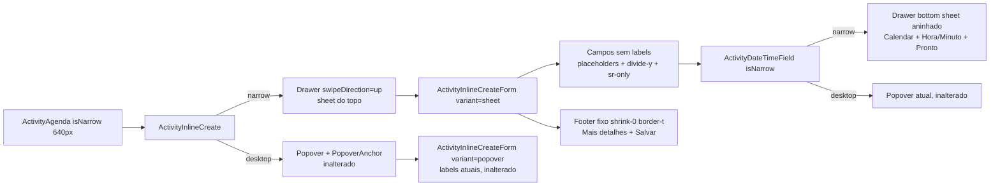

# Impl: Agenda mobile — formulário de criação usável no celular (sheet do topo, rolável, salvar alcançável, seletor de data/hora em bottom sheet, form sem labels)

Status: aprovado
Atualizado em: 2026-08-09
Issue: #504
Intenção: docs/plans/agenda-mobile-form-criacao-usavel.md
Appetite restante: herdado (~0,5–1 dia eng)

## Leitura da intenção

- **Outcome:** no celular, o sheet de criação rápida da agenda vira um formulário preenchível de ponta a ponta: sheet abre **do topo** preenchendo a altura útil; conteúdo **rola** até o fim ("Responsáveis" e "Salvar" alcançáveis em viewport pequeno e com teclado aberto); **"Salvar" fixo no rodapé** do sheet; form **sem labels visíveis** (placeholders dão contexto; obrigatórios marcados com asterisco; a11y mantida via labels ocultos); seletor de **data/hora abre como bottom sheet** no mobile (calendário + hora/minuto inteiros na tela); desktop inalterado.
- **O que NÃO negociar:** mesmo conteúdo do C91 (anti-goal "sheet vira página"); criar não navega; salvar insere o evento no calendário (refetch da janela); leader lockdown intacto; desktop mantém o fluxo atual (popover com labels) — o clip do popover desktop (≤720px) é **B181** (#490, OPEN), fora deste item; `/nova` e `/editar` intocados; chrome do calendário mobile é **C101**; "Todo o dia" é **C104**, tags **C105**.
- **O que reavaliar:** a hipótese da intenção cita "ajuste no `Drawer.tsx` se não couber no uso". Verificação: a primitiva **já suporta top sheet** — `swipeDirection="up"` é prop nativa (`Drawer.tsx:36`) com CSS completo (`data-[swipe-direction=up]:top-0`, closed-transform, origin, bleed; `Drawer.tsx:134,141`) e o stack/peek de nested drawers (`--nested-drawers`, `--stack-*`) já existe. **Nenhuma mudança na primitiva compartilhada** — tudo se resolve no uso (scoped à criação inline).

## Abordagem recomendada

**Opções consideradas:** A (recomendada) | B | C
**Recomendação:** **A** — uma variante de layout no componente existente (`variant: 'popover' | 'sheet'`) e o seletor de data/hora escolhendo contêiner (Popover vs Drawer) pela mesma prop `isNarrow` que o calendário já computa. Zero mudança na primitiva `Drawer` (já tem top sheet + nested) e zero mudança no desktop.

### Decisões de engenharia

**D1 — Sheet do topo.**

- Opções: A) `swipeDirection="up"` na primitiva existente | B) posicionamento custom (CSS no `DrawerContent`) | C) `Dialog` full-screen.
- Recomendação: A — a primitiva `Drawer` implementa o top drawer completo (`Drawer.tsx:141`: `top-0`, `origin-top`, `--closed-transform` para cima, bleed inferior); passamos `swipeDirection="up"` só no uso narrow da criação inline, **backward-compatible** (default continua `down`).
- Rejeitadas: B porque duplica CSS de animação/bleed/stack que a primitiva já tem; C porque perde o gesto de swipe (aceite "mantém o gesto de fechar").
- Altura: `DrawerContent` recebe `className="h-[calc(100dvh-1rem)]"` — o cn merge faz `h-[…]` vencer `h-(--drawer-content-height)` (tailwind-merge trata como mesmo grupo); max-h padrão do eixo-y (`calc(100dvh-6rem)`) é sobrescrito pelo mesmo mecanismo. Smoke visual valida.

**D2 — Scroll do conteúdo + rodapé fixo.**

- Opções: A) `ActivityInlineCreateForm` ganha `variant: 'popover' | 'sheet'`; no `'sheet'` o `<form>` vira `flex min-h-0 flex-1 flex-col`, os campos vivem num scroll container (`min-h-0 flex-1 overflow-y-auto overscroll-contain`) e o footer sai para o fim do form como `shrink-0 border-t` (fixo por construção do flex) | B) render prop / estado no contêiner `ActivityInlineCreate` | C) footer no `DrawerFooter` com estado subido.
- Recomendação: A — o footer precisa de `moreDetailsHref`, `saving` e `handleSubmit`, que vivem no estado do form; mover esse estado para o contêiner incha `ActivityInlineCreate`. O layout sheet é puramente estrutural do form (flex-col + scroll + footer), sem render prop nem fragmentos vazados.
- Rejeitadas: B porque espalha o estado do form pelo contêiner (acoplamento sem ganho); C porque `useFormStatus` não enxerga o form irmão e `form=`/controle externo duplica o mecanismo de submit.
- No `'popover'` o markup atual fica byte a byte: `flex flex-col gap-4`, labels visíveis, footer inline no fim.

**D3 — Escopo do "form sem labels".**

- Opções: A) só no mobile (variant `'sheet'`) | B) mobile **e** desktop (popover também sem labels).
- Recomendação: A — o anti-goal da intenção é explícito: "não muda o desktop além do que o mesmo mecanismo de 'caber na viewport' resolver (B181)"; o aceite abre com "No celular, tocar num slot…". O desktop mantém labels e o gap atual.
- Rejeitadas: B porque viola o anti-goal e estica o diff para o popover sem benefício de produto (a intenção é mobile).

**D4 — Placeholders + obrigatórios + a11y (variant sheet).**

- Opções: A) `FieldLabel` vira `sr-only` (mantém `htmlFor`/`aria-labelledby`, testes e leitores de tela intactos); placeholders "Adicionar título _", "Município _", "Local (opcional)", "Adicionar responsáveis"; asterisco visual nos obrigatórios | B) micro-labels flutuantes (label sobe ao digitar).
- Recomendação: A — é a recomendação de produto da intenção (placeholders puros); `sr-only` no `FieldLabel` mantém o contrato a11y e os `getByLabelText('Título *')` dos testes existentes.
- Rejeitadas: B porque é a opção rejeitada no plano de intenção ("o form é curto e os obrigatórios continuam marcados").
- Detalhes por campo (variant sheet):
  - Título: placeholder `Adicionar título *`; label sr-only `Título *`.
  - Início/Término: trigger mostra o valor (prefill do slot, nunca vazio); label sr-only `Início *` / `Término`; asterisco visual discreto no trigger do Início (`ActivityDateTimeField` ganha `required?: boolean` que renderiza `*` accent ao lado do valor no narrow).
  - Município: `StrictCombobox` ganha prop opcional `placeholder?: string` (repassada ao `ComboboxInput` — backward-compatible; hoje sem placeholder) → `Município *`; label sr-only.
  - Local: placeholder `Local (opcional)` (substitui "Bairro, endereço ou referência" **só no variant sheet**); label sr-only `Local (opcional)`.
  - Responsáveis: `ResponsibleMultiSelect` ganha `labelClassName?: string` (aplicado ao `FieldLabel` interno — backward-compatible) e `emptyText?: string` para o trigger vazio (`Adicionar responsáveis`); trigger vazio hoje mostra "Nenhum" → no sheet mostra o texto vazio; label sr-only.
  - Empilhamento: no sheet, os `Field` perdem `gap-4` e ganham `divide-y divide-border` (uma linha divisória entre campos, sem respiro/card — estilo lista iOS do canvas); inputs mantêm `min-h-11` mas sem borda/rounded (overrides `border-0 bg-transparent rounded-none px-0` via className — o `Input` aceita cn merge).

**D5 — Seletor de data/hora como bottom sheet no mobile.**

- Opções: A) `ActivityDateTimeField` ganha `isNarrow: boolean`; extrai o conteúdo do popover (`Calendar` + selects Hora/Minuto) para um fragmento compartilhado e, no narrow, renderiza dentro de um `Drawer` bottom sheet (nested sobre o sheet de criação) com header "Início — <data>" + "Pronto" (fecha) | B) manter popover e ajustar colisão | C) componente novo paralelo.
- Recomendação: A — decisão já travada no gate da intenção ("bottom sheet… mais simples de garantir visualização total"); a primitiva suporta drawer aninhado (`--nested-drawers`, peek/stack). A prop `isNarrow` vem da mesma fonte do calendário (640px), mantendo desktop=popover / mobile=sheet alinhados com a escolha do contêiner da criação.
- Rejeitadas: B porque é exatamente o bug reportado (popover estoura a tela; hora/minuto espremidos); C porque duplica o conteúdo.
- "Pronto" fecha o drawer; alterações de dia/hora/minuto aplicam imediatamente (mesmo contrato do popover atual). Drawer do seletor: `modal` default (overlay próprio), swipe down para fechar.

**D6 — Header e fechamento do sheet narrow.**

- Opções: A) manter `DrawerHeader` atual ("Nova atividade" + data do slot) + `showSwipeHandle` (primitiva posiciona o handle para direção up) + swipe up/backdrop para fechar | B) remover o swipe handle do top sheet (decisão do smoke) | C) adicionar botão "fechar" (X) no header.
- Recomendação: **B (decidido no smoke visual)** — a primitiva posiciona o handle no **rodapé** de um top sheet (`order-last`), o que contradiz o gesto de fechar (swipe up empurra o sheet para cima; handle no fundo sugere swipe down). Remover `showSwipeHandle` no drawer de criação narrow; fechamento por swipe up + tap no backdrop. O handle continua nos bottom sheets (seletor de data/hora), onde o posicionamento é correto.
- Rejeitadas: A porque o handle mal posicionado é affordance contraditória; C como v1 porque adiciona controles sem necessidade (o canvas é esquemático).

### Componentes / mudanças

- **`src/components/campaign/activity/ActivityInlineCreate.tsx`**: `ActivityInlineCreateForm` ganha `variant: 'popover' | 'sheet'` e repassa `isNarrow` ao `ActivityDateTimeField`; narrow renderiza `Drawer swipeDirection="up"` (sem swipe handle — decidido no smoke, D6) + `DrawerContent className="h-[calc(100dvh-1rem)]"` com `DrawerHeader` fixo, `<form variant="sheet">` (scroll interno + footer fixo) sem o wrapper `px-4 pb-6` (o scroll container assume o padding). Desktop visualmente inalterado.
- **`src/components/campaign/activity/ActivityDateTimeField.tsx`**: prop `isNarrow` + `required?`; conteúdo do picker (Calendar + selects) extraído para fragmento local; narrow → `Drawer` bottom sheet com header ("Início/Término — <data>" + "Pronto") e corpo com o conteúdo compartilhado; desktop → `Popover` atual. Focus visible mantido no narrow (`focus-visible:ring-2`), `aria-haspopup="dialog"`/`aria-expanded` no trigger narrow, `onClick` só no narrow (no desktop o Radix toggla).
- **`src/components/campaign/shared/StrictCombobox.tsx`**: prop opcional `placeholder` e `className` repassados ao `ComboboxInput` (backward-compatible).
- **`src/components/campaign/shared/ResponsibleMultiSelect.tsx`**: props opcionais `labelClassName` (no `FieldLabel`), `emptyText` (texto do trigger vazio, no lugar de "Nenhum") e `triggerClassName` (backward-compatible).
- **`src/components/ui/`**: sem mudanças (`Drawer` já cobre `swipeDirection="up"` + nested; `Input`/`FieldLabel` aceitam className).
- **Migration:** sem migration (sem schema).
- **Access / Consent:** nenhum toque (mesma action `createActivityInline`, mesmo access).
- **UI:** Impeccable B — encaixe na superfície existente (mesma convenção do C97). shape → craft (sem labels, divide-y, rodapé fixo, seletor em sheet) → critique → polish. Validação visual no dev browser (viewport ~390×844 e 640×480, teclado aberto).

### Dados → forma

N/A — affordance de escrita; a intenção declara `Dados: N/A`.

## Fases verificáveis

1. **Tracer (quota pequena)** — `variant` no form + `swipeDirection="up"` + scroll/footer fixo: smoke no dev narrow: sheet desce do topo, conteúdo rola até "Responsáveis", "Salvar" fixo, teclado aberto não esconde o rodapé.
2. **Form sem labels (variant sheet)** — placeholders, `sr-only` labels, asteriscos, `divide-y`, overrides de input; props `placeholder`/`labelClassName` em `StrictCombobox`/`ResponsibleMultiSelect`; smoke visual contra o canvas.
3. **Seletor de data/hora narrow** — extração do conteúdo, `Drawer` bottom sheet aninhado com "Pronto"; desktop continua popover (smoke dos dois).
4. **Testes** — unit atualizados + novos (abaixo); e2e mobile novo + desktop intacto.
5. **Gates** — `pnpm gate:fast` na iteração; `pnpm test:int`; e2e afetado (`pnpm test:e2e` agenda); `pnpm format:check`, `pnpm exec knip`, `pnpm check:cycles`; `pnpm build` (DB local); scan Aikido dos arquivos tocados; registro no CHANGELOG-AGENTS; `pnpm push` → PR `--base main` `Closes #504` → auto-merge → `gh pr checks --watch --required`.

### Testes

- **Unit** (`tests/unit/activityInlineCreate.unit.spec.tsx`):
  - Narrow: `getByLabelText('Título *')` continua resolvendo (label sr-only); placeholder do título é `Adicionar título *`; "Salvar" presente no rodapé do sheet; campos separados por divisórias (asserção por classe/estrutura se viável).
  - Narrow: abrir Início abre **drawer** (role dialog do seletor com "Pronto"), não popover; "Pronto" fecha.
  - Desktop: testes existentes inalterados (labels visíveis).
- **E2E** (`tests/e2e/campaignActivity.e2e.spec.ts`):
  - Novo teste mobile (`test.use({ viewport: { width: 390, height: 844 } })`, precedente `campaignBottomNav.e2e.spec.ts`): abrir slot → sheet do topo → preencher título + município → "Salvar" visível sem scroll → salvar → evento aparece na agenda.
  - Testes desktop existentes intactos (labels continuam no popover).
- **Unit helpers**: nenhum helper novo puro (nada em `campaignTime`/`activityUi` muda).

## Rabbit holes / Não escopo (engenharia)

- **Mudar a primitiva `Drawer`** para "suportar" top sheet — já suporta; mexer nela é risco de blast radius (CalendarFeedDialog, bottom nav, listas).
- **`/nova` e `/editar`** (`ActivityForm.tsx`/`ActivityTaskFields.tsx`): labels/placeholders/seletor ficam como estão.
- **B181** (clip do popover desktop ≤720px): fora — Issue #490 OPEN.
- **C101/C104/C105**: chrome do calendário mobile / all-day / tags — fora.
- **Labels flutuantes / steppers de hora / range no calendário**: cortes de produto já travados na intenção.
- **`generate:importmap`**: não se aplica (componentes de app, não de admin).
- **Micro-interação do handle no top sheet**: se o handle ficar mal posicionado, follow-up (não estica o v1).

## Riscos e mitigação

- **Nested drawer com direções diferentes (criação `up` + seletor `down`):** o stack/peek da primitiva usa vars compartilhadas (`--nested-drawers`, `--stack-*`) independentes da direção; validar no dev browser antes do e2e. Se quebrar visualmente, fallback: seletor também `swipeDirection="up"` (mesma direção) — mudança contida no uso, sem tocar a primitiva.
- **Override `h-[calc(100dvh-1rem)]` vs `h-(--drawer-content-height)`:** tailwind-merge trata como mesmo grupo (height) — verificar no smoke; alternativa: `style={{ '--drawer-content-height': 'calc(100dvh-1rem)' }}` sem mudar a primitiva.
- **`getByLabelText` com label `sr-only`:** `FieldLabel` mantém `htmlFor` — `getByLabelText` resolve por associação; coberto nos unit.
- **Combobox/ResponsibleMultiSelect com props novas:** default preserva o comportamento atual (placeholder ausente → sem placeholder; `labelClassName` vazio → classes atuais).
- **e2e mobile do FullCalendar (lazy render do grid):** copiar o padrão do teste desktop (`Carregando compromissos…` até sumir + bounding box do slot).

## Follow-ups registrados (fora da fatia mínima)

- **Clip do popover desktop ≤720px** → B181 (#490), já na fila.
- **Uniformizar `ActivityDateTimeField` no form completo/tarefas** (registrado no impl do C97).

## Aceite de engenharia

- [ ] Aceite de produto da intenção coberto: sheet do topo no mobile, conteúdo rola até o fim, "Salvar" fixo, sem labels visíveis (placeholders + asteriscos + a11y sr-only), seletor de data/hora em bottom sheet no mobile, desktop inalterado, criar não navega, leader lockdown intacto
- [ ] Invariantes AGENTS/engineering-standards (sem schema/access/Consent; identificadores em inglês; copy pt-BR; `Drawer` primitiva compartilhada intocada)
- [ ] Testes de domínio previstos (unit narrow/desktop + e2e mobile novo; e2e desktop intacto)
- [ ] `model-local: deepseek-v4-flash-high` já declarado no plano de intenção (mapping canônico de `model: composer-2.5`)

Self-score decision-quality: 5/5 — decisões caras com rejeitadas (D1–D6), abordagem no appetite, rabbit holes nomeados, depth check (reusa primitiva + componentes, sem twins), intenção satisfeita.
