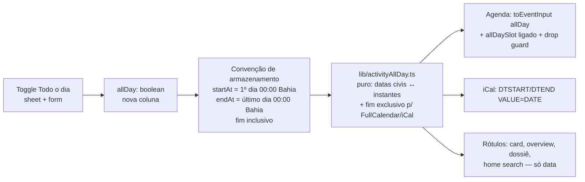

# Impl: Agenda — compromisso "Todo o dia" na criação rápida (só datas, multi-dia)

Status: aprovado
Atualizado em: 2026-08-09
Issue: #505
Intenção: docs/plans/agenda-toggle-todo-o-dia.md
Appetite restante: herdado (~0,5 dia eng)

## Leitura da intenção

- **Outcome:** o sheet de criação rápida ganha um toggle "Todo o dia" entre o título e a data de início; ligado, Início e Término viram só datas (término pode ser outro dia = vários dias inteiros); o compromisso aparece no calendário como faixa de dia inteiro ocupando todos os dias; "Mais detalhes" e o formulário completo preservam a escolha (e editar não quebra o evento); criar com horário continua exatamente como hoje.
- **O que NÃO negociar:** nada de semântica de timezone (granularidade de dia); horário nunca aparece com o toggle ligado; liderança não acessa a agenda (inalterado); criação com horário intacta; o toggle nasce desligado (questão A assumida — validar); término multi-dia = faixa contínua (questão C decidida no gate).
- **O que reavaliar:** a intenção deixa a representação (flag vs horários de borda) para o impl plan; e a questão B (toggle no form completo) tem recomendação "B — mesmo controle no form" — adoto B, porque um evento todo-dia editado no form sem o toggle mostraria "00:00" (regressão de leitura) e salvar com horário quebraria a faixa.

## Abordagem recomendada

**Opções consideradas:** A (recomendada) | B | C
**Recomendação:** **A** — campo `allDay: boolean` (default `false`) + convenção de instantes: com o toggle ligado, `startAt` = primeiro dia 00:00 America/Bahia e `endAt` = último dia 00:00 America/Bahia, com **fim inclusivo** (a data do instante `endAt` É o último dia; dia único ⇒ `startAt === endAt`). As conversões exclusivo↔inclusivo (FullCalendar/iCal usam fim exclusivo) ficam concentradas num módulo puro `lib/activityAllDay.ts` — o resto do sistema lê a intenção do usuário direto dos campos.
**Rejeitadas:** B porque armazenar fim **exclusivo** (modelo nativo do FullCalendar) espalha o off-by-one por todas as superfícies que exibem Término (overview, form de edição, cards) — qualquer consumidor que esquecer de subtrair 1 dia mostra o dia errado silenciosamente; A concentra as conversões nas 2 fronteiras de calendário (agenda + iCal), ambas testadas. C (flag implícita — "allDay se hora == 00:00") porque é estado frágil, rejeita reuniões reais à meia-noite e o admin não consegue distinguir.

### Decisões de engenharia

**D1 — Representação de armazenamento.**

- Opções: A) `allDay` boolean + instantes com fim inclusivo (startAt = 1º dia 00:00, endAt = último dia 00:00 Bahia) | B) `allDay` boolean + fim exclusivo (endAt = dia seguinte 00:00) | C) flag implícita por convenção de horário | D) campos data separados (`allDayStart`/`allDayEnd`).
- Recomendação: A — ver "Rejeitadas" da abordagem; America/Bahia não tem DST (fixo −03), então "00:00 da Bahia" é determinístico; a validação allDay vira `endAt >= startAt` (igual permitido), só na branch allDay.
- Rejeitadas: B (off-by-one espalhado); C (frágil, opaco); D (gêmeo de startAt/endAt, sync obrigatória no hook — twin anti-pattern).

**D2 — Onde moram as conversões.**

- Opções: A) módulo novo puro `src/lib/activityAllDay.ts` (client-safe) | B) empilhar em `lib/campaignTime.ts` | C) conversões inline nos componentes.
- Recomendação: A — semântica all-day é de domínio da atividade, não tempo civil genérico; `lib/` é client-safe por mapa do repo, e o módulo é usado por client (agenda, sheet) e server (schema, formData, iCal) — o mesmo padrão de `lib/campaignRoles.ts`. Helpers: `allDayStartInstant(civilDate)`, `allDayEndInstant(civilDate)`, `allDayExclusiveEndDate(iso)` (data + 1 dia), `allDayEndInstantFromExclusive(dataExclusiva)` (data − 1 dia), `formatAllDayRangeLabel(startIso, endIso)` ("10/08/2026" | "10/08/2026 a 12/08/2026"), `allDayCivilDateOf(iso)`, `allDayRangeValid(startIso, endIso)`.
- Rejeitadas: B porque mistura domínio em utilitário genérico; C porque a conversão exclusivo↔inclusivo vazaria para N call sites (precisamente o bug que D1-A evita).

**D3 — Contrato do reschedule.**

- Opções: A) o client converte (FullCalendar exclusivo → convenção de storage) e envia `{ id, allDay, startAt, endAt }` com instantes prontos | B) o schema aceita strings só-data e converte no server.
- Recomendação: A — o `persistSchedule` da agenda é o ÚNICO produtor do formato exclusivo do FullCalendar; a conversão usa o módulo puro testado; o schema ganha só `allDay: z.boolean()` e a regra `start <= end` para allDay (endAt obrigatório para allDay). Rejeitada: B porque duplica a fronteira de conversão no schema sem ganho — e o server não sabe o `allDay` atual do evento sem um fetch extra.

**D4 — Guard de drop no all-day lane.**

- Opções: A) rejeitar (revert + toast) qualquer drop que altere `event.allDay` (lanes all-day ⇄ grade de horário) | B) permitir e persistir a conversão (update de `allDay` + horários).
- Recomendação: A — habilitar o `allDaySlot` (necessário para a faixa no topo da visão semana/dia) cria a lane; o FullCalendar flips `allDay` em drops entre lane e grade. Persistir a conversão é feature nova (C103-adjacent, fora do aceite) e muda o reschedule para escrever `allDay`; rejeitar com mensagem clara mantém o modelo estável. Trigger para B: pedido real de "arrastar para dia inteiro".
- Guard: `'oldEvent' in info && info.event.allDay !== info.oldEvent.allDay` → `info.revert()` + toast. `EventResizeDoneInfo` não tem `oldEvent` e resize não troca allDay.

**D5 — Controle date-only.**

- Opções: A) prop `timeVisible?: boolean` no `ActivityDateTimeField` (default true) — popover renderiza só o Calendar, trigger formata só a data | B) `<Input type="date">` no sheet | C) componente novo `ActivityDateField`.
- Recomendação: A no sheet (mesmo controle C97 que a mesa já conhece; C97 declarou "a data-only já é meio caminho"); **B no form completo** (o form já usa inputs nativos `datetime-local`; `<Input type="date">` preserva o padrão do form e é ótimo no mobile — C103).
- Rejeitadas: A no form (mistura padrões no mesmo form); C (twin do componente existente).

**D6 — Estado do form completo (toggle).**

- Opções: A) `startAt`/`endAt` controlados via `useState` (inicializados de activity/prefill) | B) uncontrolled + `key` para remontar o input ao trocar modo.
- Recomendação: A — trocar o modo preserva a data digitada (deriva o date part do estado atual); B perde o valor digitado ao remontar (o toggle vem antes dos campos no fluxo natural: primeiro alterna, depois preenche — mas se preencheu antes, perde). Custo ~10 linhas.

**D7 — Prefill "Mais detalhes".**

- Opções: A) `allDay=1` + `startAt`/`endAt` como datas civis (`2026-08-10`) nos params | B) instantes ISO + `allDay=1`.
- Recomendação: A — data civil é o vocabulário do modo; `parseActivityCreatePrefill` ramifica em `allDay=1` (regex `YYYY-MM-DD` → instantes via lib); o `ActivityCreatePrefill` ganha `allDay?: boolean` e o form nasce com o toggle ligado. Rejeitada: B porque obriga o parse a reconstruir a data a partir do fuso.

**D8 — Surfaces de exibição (auditoria).** Todo lugar que formata `startAt`/`endAt` com hora precisa da branch allDay (só data / range):

- `formatActivityWhenLabel` (card + home search) → branch allDay;
- `ActivityOverviewTab` Início/Término → branch allDay;
- `MunicipalityDossier` (linha 89) → branch allDay;
- `searchHomeActivities` select ganha `allDay`/`endAt` e repassa;
- página da organização já imprime `dateStyle: 'short'` (só data) — sem mudança;
- `calendarFeed.ts` → `DTSTART;VALUE=DATE` / `DTEND;VALUE=DATE` com fim exclusivo.

### Componentes / mudanças

- **Migration:** `add_activity_all_day` — coluna `all_day boolean NOT NULL DEFAULT false` (Payload checkbox + `hasDefaultValue`? sem default explícito o schema exige o campo; default `false` no config, migration com `default: false`). Nunca editar migração já commitada; seguir o skill `payload-migrations`.
- **`src/lib/activityAllDay.ts`** (novo, puro): conversões de D2.
- **`src/lib/schemas/activity.ts`**: `activityFieldsSchema` ganha `allDay: z.boolean().optional()`; `validateSchedule` ramifica (allDay: Início obrigatório — mensagem "Informe a data de início do compromisso."; término opcional, `end >= start` — "A data de término deve ser igual ou posterior à de início."; timed inalterado); `activityRescheduleSchema` ganha `allDay: z.boolean()` (endAt obrigatório e `start <= end` quando allDay).
- **`src/collections/Activity.ts`**: campo `allDay` (label "Todo o dia", default false); hook `validateActivitySchedule` com a mesma branch; `activityStaffFieldSnapshot` inclui `allDay` (liderança não pode flipar).
- **`src/utilities/activityFormData.ts`**: `parseDateTimeFormField` ramifica no checkbox `allDay` — datas civis → instantes via lib/activityAllDay.
- **`src/components/campaign/activity/ActivityDateTimeField.tsx`**: prop `timeVisible` (default true) — trigger com `formatBahiaCivilDateLabel` (novo helper puro em `campaignTime.ts`, string arithmetic 24h-safe) e popover sem o bloco de selects.
- **`src/components/campaign/activity/ActivityInlineCreate.tsx`**: toggle "Todo o dia" (Checkbox + Field horizontal, precedente "Deputado presente") entre título e Início/Término; validação ramificada; submit com `allDay` + instantes da lib; "Mais detalhes" com `allDay=1` + datas civis; DrawerDescription com data quando on.
- **`src/components/campaign/activity/ActivityForm.tsx`**: toggle no topo do card "Data e horário"; start/end controlados (D6); `<Input type="date">` quando on (defaults de `formatIsoAsBahiaDateInput` = date part).
- **`src/components/campaign/activity/ActivityAgenda.tsx`**: `toEventInput` branch allDay (start date-only, end exclusivo, `allDay: true`); `allDaySlot` ligado (remover `allDaySlot={false}`); `persistSchedule` converte `startStr`/`endStr` exclusivos → storage e envia `allDay`; guard D4 no `handleScheduleChange`.
- **`src/utilities/activityUi.ts`**: `ActivityCreatePrefill.allDay`; `parseActivityCreatePrefill` ramifica; `buildActivityCreateHref` emite `allDay=1` + datas.
- **`src/utilities/activityViewModels.ts`**: `allDay` em `ActivityAgendaEvent`, `ActivityListViewModel`, `ActivityFormViewModel`, `ActivityDetailViewModel` + selects (`activityAgendaSelect`, `activityListSelect`, `activityFormSelect`, `activityDetailContextSelect`); `formatActivityWhenLabel`/`formatActivityHomeSearchSecondary` com branch.
- **`src/utilities/calendarFeed.ts`**: allDay → `DTSTART;VALUE=DATE:<início>` / `DTEND;VALUE=DATE:<fim exclusivo>`.
- **`src/components/campaign/municipality/MunicipalityDossier.tsx`** + **`src/utilities/homeSearch/searchHomeActivities.ts`**: branch allDay nos rótulos.
- **Access / Consent:** nenhum toque (staff-only, já gateado por `canCreateActivity`/`canReadActivity`).

### Dados → forma

N/A — a intenção declara `Dados: N/A`; a "forma" aqui é a convenção de storage (D1), decidida acima com rejeitadas.

## Fases verificáveis

1. **Schema + server** — migration `add_activity_all_day` + `pnpm migrate` local + `generate:types`; `lib/activityAllDay.ts` + unit tests; schema (`activity.ts`) + hooks da collection; `activityFormData.ts`; VMs + selects; iCal; tests unit/int de domínio.
2. **UI** — `ActivityDateTimeField.timeVisible`; sheet (toggle + validação + href); agenda (`toEventInput`, `allDaySlot`, `persistSchedule`, guard); form completo; surfaces de rótulo; tests de componente/unit.
3. **Gates** — `pnpm gate:fast` na iteração; `pnpm push` no fechamento (PR `--base main` + `Closes #505`).

## Rabbit holes / Não escopo (engenharia)

- Drop/conversão arrastando entre lane all-day e grade de horário → **guard D4 rejeita**; virar feature se pedido real.
- Clique na lane all-day abre o sheet com toggle ligado → defer (gate humano; a intenção fixa toggle nasce desligado).
- Semântica "Próximos" para todo-dia (evento começou hoje à 00:00 sai do filtro às 00:01) → comportamento pré-existente de eventos timed, fora do escopo.
- Identidade visual nova (cor/ícone) para todo-dia → anti-goal da intenção.
- Recorrência / fuso → anti-goals da intenção.

## Riscos e mitigação

- **Off-by-one no fim do intervalo** (FullCalendar/iCal exigem fim exclusivo): conversões só em `lib/activityAllDay.ts` com unit tests por extensão (dia único, multi-dia, virada de mês/ano) — e o guard D4 impede o estado inconsistente por drag.
- **Dados legados**: eventos existentes têm `all_day = false` (default) → zero ambiguidade; timed com horário 00:00 raro continua timed (flag é o estado, não a hora).
- **DST**: America/Bahia é fixa −03 (sem DST desde 2019) → meia-noite baiana é determinística; nada a tratar.
- **Fim igual início (dia único)**: validação allDay aceita `endAt === startAt`; as queries de overlap da agenda são por instante e funcionam com igualdade (evento do dia aparece na janela do dia).

## Aceite de engenharia

- [ ] Aceite de produto da intenção coberto (toggle no sheet; só datas multi-dia; faixa no calendário; preservação na edição; horário intacto)
- [ ] Invariantes AGENTS/engineering-standards (transações inalteradas — create/update já transacional; `overrideAccess: false` mantido; copy pt-BR / identificadores en)
- [ ] Testes de domínio: unit para `lib/activityAllDay`, schemas (create/update/reschedule allDay), prefill/href, componente inline (toggle+submit+validação), VMs, iCal; int para create/reschedule allDay round-trip e hook da collection
