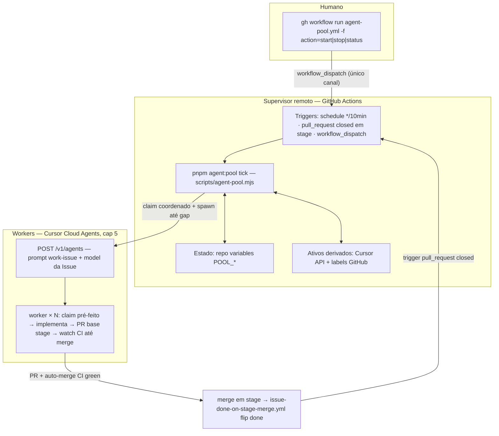

# Orquestrador de pool de agentes Cursor Cloud (Teqo)

## 1. Resumo executivo

Um **supervisor remoto stateless** mantém até **5 Cursor Cloud Agents** em paralelo, cada um
executando `work-issue` sobre uma GitHub Issue `ready` e elegível para autonomia. O supervisor
é um **workflow do GitHub Actions** (`.github/workflows/agent-pool.yml`) que roda
`node scripts/agent-pool.mjs tick` a cada 10 minutos, a cada merge em `stage`, e sob
`workflow_dispatch` — nenhum processo local, nenhum daemon, laptop fechado não importa.

A cada tick, um script Node determinístico (testável, sem deps npm): lê o estado do pool
(repo variables), deriva os workers ativos (API Cursor + labels das Issues), reconcilia falhas,
calcula `gap = maxSlots - ativos`, **claima ele mesmo** as próximas Issues elegíveis (flip
`ready→in-progress` com lock otimista — alocador único, sem race) e spawna workers via
`POST https://api.cursor.com/v1/agents` com o `model:` do frontmatter da Issue (fallback
`composer-2.5`). Para quando o humano mandar (`action=stop`) ou quando a fila drenar.
`agent:promote` nunca é chamado — promote `stage→main` continua humano.

Decisão central: o supervisor é **GitHub Actions**, não um Cursor Automation — o tick é lógica
determinística com testes unitários, e cada tick de Automation queimaria um slot de agente (de 8
do plano Pro) + tokens a cada 10 min. Automation fica documentado como plano B.

## 2. Arquitetura (supervisor remoto obrigatório)

### Três camadas



### Modelo de reconciliação: **stateless tick** (escolhido)

Cada tick é um job curto (< 2 min) e idempotente que executa, nesta ordem:

1. **Lê config** — repo variables: `POOL_ENABLED`, `POOL_MAX_SLOTS` (default 5), `POOL_PAUSED`,
   `POOL_STARTED_AT`, `POOL_STARTED_BY`.
2. **Sai cedo** se `POOL_ENABLED != true` ("pool desligado") ou `POOL_PAUSED == true`
   ("pausado — audit solitário").
3. **Deriva workers do pool** — Issues `in-progress` cujo comentário de claim carrega o marcador
   do pool (`pool-worker`) cruzadas com os runs da API Cursor (`GET /v1/agents/{id}/runs/{runId}`):
   - run terminal **e** Issue `done` (CI flipou no merge) → slot livre; `POST /archive` no agente.
   - run terminal **e** Issue `in-progress` com PR aberto → auto-merge em voo; slot **ocupado**,
     re-avalia no próximo tick (grace 60 min → humano).
   - run terminal **e** Issue `in-progress` sem PR, ou run `ERROR`/`CANCELLED`/`EXPIRED` →
     **falha terminal documentada**: comentário na Issue, flip `in-progress→blocked`
     (sai da fila, humano triage), archive do agente, circuit breaker (≥2 falhas na mesma Issue
     → nunca re-enfileira; conta via comentários do pool).
   - run não-terminal → slot ocupado.
4. **Gargalo de migrations** — mesma query do job `migration-lock`
   (`gh pr list --state open --json files`): se ≥1 PR aberto toca `src/migrations/` ou
   `payload-types.ts`, Issues `needs:migration` / `serializes:[migrations]` saem da fila **deste
   tick** (re-avaliadas no próximo).
5. **Fila elegível** — `isAutonomousClaimable` (seção 3) ordenada por prio → mais antiga
   (paridade com `agent:claim`).
6. **Spawn** — `gap = maxSlots - ativos`; claima e spawna até `gap` workers (seção 4 e 5).
7. **Auto-stop** — fila elegível vazia **e** zero ativos → `POOL_ENABLED=false` + sumário
   "pool drenado". Fila vazia com ativos → não spawna, continua tickando até drenar.
8. **Sumário** — escreve GHA job summary (markdown: slots, fila, spawns, falhas) — é a superfície
   remota de status no browser.

Ticks são **serializados** por `concurrency: group: agent-pool, cancel-in-progress: false` —
invariante de alocador único. O código executado pelo tick é sempre o da **default branch**
(schedule e `pull_request` rodam sobre `main`); `workflow_dispatch` permite escolher branch
para teste.

Justificativa vs. "supervisor session" (um Cloud Agent 24/7 com loop interno): rejeitado —
timeout de sessão não documentado, queima 1 slot dos 8 permanentemente, LLM fazendo trabalho de
cron, e não há nada no loop que um tick de 30 s não faça.

### Onde persiste estado

| Dado                                                      | Onde                                                                         | Por quê                                                                                                                                                                                                                                                                 |
| --------------------------------------------------------- | ---------------------------------------------------------------------------- | ----------------------------------------------------------------------------------------------------------------------------------------------------------------------------------------------------------------------------------------------------------------------- |
| `enabled`, `maxSlots`, `paused`, `startedAt`, `startedBy` | **Repo variables** (`gh variable get/set POOL_*`)                            | Escalares de config; API própria; legíveis por humano no browser (Settings → Variables)                                                                                                                                                                                 |
| `activeRuns: [{runId, issueNumber, claimedAt}]`           | **Derivado, não persistido**                                                 | Estado persistido dessincroniza da realidade (crash entre spawn e write). As duas fontes de verdade — status do run na Cursor API e labels/comentários no GitHub — bastam; o comentário de claim na Issue (com a URL do agente `bc-…`) é o vínculo durável worker↔Issue |
| `lastTickAt`, histórico de ticks, último erro             | **GHA runs + job summary** (`gh run list --workflow agent-pool.yml`)         | O próprio run é o registro; não duplica                                                                                                                                                                                                                                 |
| Reserva worker→Issue                                      | **Comentário de claim na Issue** (marcador `pool-worker bc-<id> <agentUrl>`) | Visível a humanos, auditável, self-healing                                                                                                                                                                                                                              |

O step "set/get variables" usa `gh variable` com `GITHUB_TOKEN` e `permissions: actions: write`
(REST de Actions variables). Localmente, `pnpm agent:pool -- status` usa o `gh` auth do usuário.

### Canal canônico: **`workflow_dispatch`** (um só)

```bash
# start (qualquer máquina/phone com gh auth; também via browser Actions → Run workflow)
gh workflow run agent-pool.yml -f action=start            # maxSlots default 5
gh workflow run agent-pool.yml -f action=start -f maxSlots=3

# stop (para de spawnar; ativos drenam naturalmente até o merge)
gh workflow run agent-pool.yml -f action=stop

# pausa para engineering-audit (e retomada)
gh workflow run agent-pool.yml -f action=pause
gh workflow run agent-pool.yml -f action=resume

# status / tick manual
gh workflow run agent-pool.yml -f action=status
gh workflow run agent-pool.yml -f action=tick
```

`pnpm agent:pool -- start|stop|status` local é apenas um wrapper que dispara o
`workflow_dispatch` ou lê estado — o canal continua único. Comentário `/pool start` em Issue e
trigger de Automation foram avaliados e rejeitados (seção 12): dispatch já cobre CLI, browser e
celular sem superfície nova.

## 3. Contrato de elegibilidade — `isAutonomousClaimable(issue)`

Função pura em `scripts/lib/agent-pool-eligibility.mjs`, testada por tabela. Entrada: Issue
(labels, body/frontmatter, state), `doneIds`, `migrationBusy` (bool do tick), `now`. Saída:
`{ ok: true } | { ok: false, reason }`.

| Condição                                                             | Decisão                                  | Motivo                                                                            |
| -------------------------------------------------------------------- | ---------------------------------------- | --------------------------------------------------------------------------------- |
| `state !== 'OPEN'` ou sem label `ready`                              | exclui (`not-ready`)                     | contrato básico do claim                                                          |
| label `in-progress` / `blocked` / `done` / `in-prod`                 | exclui (`state-label`)                   | estado é exclusivo                                                                |
| label `requirements-changed`                                         | exclui (`needs-human`)                   | escopo mudou; gate humano pendente                                                |
| label `needs:consent`                                                | exclui (`needs-human`)                   | gate legal/produto — nunca autônomo                                               |
| `depends:` com dep não satisfeita (não `done`/`in-prod`/fechada)     | exclui (`blocked-by-deps`)               | mesma regra de `agent-claim.mjs` (dep sem Issue = roadmap entregue, satisfeita)   |
| `needs:migration` ou `serializes:[migrations]` **e** `migrationBusy` | exclui **neste tick** (`migration-busy`) | respeita o `migration-lock` (≤1 PR de schema); transitório, volta no próximo tick |
| sem link `docs/plans/` no body                                       | **warn, não bloqueia** (v1)              | preferir Issues com plano; loga no sumário                                        |
| `POOL_PAUSED` (audit solitário)                                      | pausa **global** no passo 2 do tick      | engineering-audit é modo solitário (AGENT-OPS)                                    |
| `model:` ausente/inválido                                            | **não exclui**                           | fallback `composer-2.5` (seção 5)                                                 |

Issues que exigem gate de `plan-issue` (wireframes, confirmação de produto) já chegam `blocked`
ou sem `ready` — o predicado as exclui por construção, e isso é pinado em teste.

**Label nova `autonomy:confirmed`: rejeitada.** As regras sobre labels existentes cobrem o
contrato; uma label a mais é um passo manual a mais no `plan-issue` sem ganho de segurança
(as exclusões já são fail-closed).

A fila do pool é uma **extensão** da fila do `agent-claim` (mesma ordenação, predicados mais
estritos). O builder da fila é extraído para `scripts/lib/agent-github.mjs`
(`buildClaimQueue(openReady, byId)`) e compartilhado — `agent-claim.mjs` continua com
comportamento idêntico (humano pode claimar `needs:consent` conscientemente; o pool, não).

## 4. Estratégia anti-race de claim — **claim coordenado pelo supervisor**

O supervisor é o **único alocador** e o tick é serializado (concurrency group). Para cada Issue
escolhida, na mesma transação lógica do tick:

1. **Re-lê a Issue** (`gh issue view N --json labels,state`) — lock otimista idêntico ao de
   `agent-claim.mjs` (recusa se `ready` sumiu ou `in-progress` apareceu — ex.: humano claimou).
2. **Flip `ready→in-progress` + comentário de claim do pool** (`Claimed by pool-worker —
worker será anunciado aqui`).
3. **Spawn** `POST /v1/agents` com `agentId` determinístico `bc-<uuid5(issueNumber, date)>`
   (idempotência: re-POST do mesmo `agentId` retorna `409 agent_id_conflict` em vez de duplicar
   — retry de tick crashado é seguro). Falha no spawn → rollback do flip (`in-progress→ready`)
   - comentário.
4. **Edita o comentário de claim** com a URL do agente (vínculo durável usado pela derivação).

O prompt do worker diz: _"a Issue #N já está claimada para você (claim feito pelo
pool-supervisor); **não rode `pnpm agent:claim`** — comece no passo 1b da skill work-issue."_
O fluxo manual (`pnpm agent:claim` sem pool) fica intocado.

**Safety net no reconcile:** se dois agentes vivos mapearem para a mesma Issue (só possível via
erro humano no dashboard), o tick cancela o run mais novo (`POST …/runs/{runId}/cancel`) e loga.

**Por que não as alternativas:** _jitter escalonado_ reduz colisão mas não a elimina (dois
workers bootam juntos, leem a fila ao mesmo tempo) e adiciona latência; _pré-atribuição sem
flip no supervisor_ deixa a Issue `ready` visível para o próximo tick durante os ~2–5 min de
boot do worker — janela de dupla atribuição que exigiria um segundo mecanismo (comentário de
reserva com TTL). O flip síncrono no tick fecha a janela por construção, reusa o lock otimista
já testado e mantém `agent:status` verdadeiro desde o instante do spawn.

Parâmetros (só relevantes ao backoff de retry de tick): `spawnRetryBackoff = próximo tick`
(10 min) — sem retry intra-tick, falha de spawn vira warn no sumário.

## 5. Seleção de modelo

- Fonte: frontmatter `model:` da Issue (escrito por `agent:register --model`, tabela de slugs
  em `.cursor/skills/model-selection/SKILL.md`).
- Spawn: `model: { id: <slug> }` no body do `POST /v1/agents`. A API valida contra
  `GET /v1/models` (ids + aliases + params, ex.: `composer-2` com param `fast=true`).
- **Namespace:** os slugs do repo (Task tool) e os da Cloud API são tabelas irmãs, não idênticas.
  O spike (Fase 0) despeja `GET /v1/models` e codifica o mapeamento explícito em
  `scripts/lib/agent-pool-models.mjs`: `Map<repoSlug, cloudModelId>` com entradas conhecidas
  (`composer-2.5` → id composer 2.5 da API,
  `cursor-grok-4.5-{low,medium,high}` → `grok-4.5` + `effort`,
  `kimi-k3-low` → `kimi-k3` + `reasoning=low`; **sem** variantes `-fast`).
- **Fallback:** `model:` ausente, desconhecido ou rejeitado pela API → **`composer-2.5`**
  (pool "Cursor Models", custo incluído — regra 1 da model-selection). Warn no sumário do tick.
- Validação: o tick consulta `GET /v1/models` uma vez por tick (cache em memória do processo)
  e nunca spawna com slug fora da lista — erro de validação não pode derrubar o tick.

## 6. API de controle

`pnpm agent:pool -- < comando >` → `scripts/agent-pool.mjs` (Node 24; `gh` CLI + `fetch` nativo,
mas com a dependência transitiva habitual de `scripts/lib/cli.mjs` → `dotenv` — o workflow instala
deps como os workflows irmãos; corrigido em 2026-07-31 após o ERR_MODULE_NOT_FOUND da primeira
ativação):

| Comando                 | Faz                                                                                                    |
| ----------------------- | ------------------------------------------------------------------------------------------------------ |
| `start [--max-slots N]` | Wrapper: `gh workflow run agent-pool.yml -f action=start [-f maxSlots=N]`                              |
| `stop`                  | Idem `action=stop` (para de spawnar; ativos drenam)                                                    |
| `pause` / `resume`      | Idem — modo audit solitário                                                                            |
| `status`                | Lê variables + Cursor API + Issues; imprime slots, Issues em voo, PRs, fila elegível, último tick/erro |
| `tick`                  | Executa a reconciliação (usado pelo workflow; local exige `--dry-run`)                                 |
| `tick --dry-run`        | Reconcilia **sem** claim/spawn/flip — imprime o plano do tick (default local)                          |

Flags de ambiente: `CURSOR_API_KEY` (obrigatória para spawn/archive/cancel; `status` degrada
para "Cursor API indisponível" sem ela), `GH_TOKEN`/`gh auth` para GitHub. Logs: stdout
estruturado por passo (`[agent:pool] …`), pt-BR nas mensagens; em GHA, o sumário markdown vai
para `GITHUB_STEP_SUMMARY`.

Secrets/permissões: `CURSOR_API_KEY` em repo secrets (só este workflow usa; nunca impressa;
rotação documentada no runbook). `GITHUB_TOKEN` com `issues: write` (flip/comentários),
`pull-requests: read` (migration cap), `contents: read`, `actions: write` (variables).

## 7. Mudanças no repo (lista de arquivos previstos)

| Arquivo                                        | Ação                                                                  | Fase                                    |
| ---------------------------------------------- | --------------------------------------------------------------------- | --------------------------------------- |
| `scripts/lib/agent-pool-eligibility.mjs`       | novo — `isAutonomousClaimable` + fila do pool                         | 1                                       |
| `scripts/lib/agent-pool-state.mjs`             | novo — variables get/set + derivação de ativos                        | 1                                       |
| `scripts/agent-pool.mjs`                       | novo — CLI da seção 6                                                 | 1 (status/tick dry) → 2/3 (spawn/ciclo) |
| `scripts/lib/agent-github.mjs`                 | extrai `buildClaimQueue()` (mesma lógica, hoje inline em agent-claim) | 1                                       |
| `scripts/agent-claim.mjs`                      | consome `buildClaimQueue()` — **comportamento idêntico**              | 1                                       |
| `scripts/lib/agent-pool-cursor.mjs`            | novo — client fino da API v1 (models/agents/runs/cancel/archive)      | 2                                       |
| `scripts/lib/agent-pool-prompt.mjs`            | novo — template do prompt do worker                                   | 2                                       |
| `scripts/lib/agent-pool-models.mjs`            | novo — mapeamento slug repo → `model.id` Cloud + fallback             | 2                                       |
| `.github/workflows/agent-pool.yml`             | novo — dispatch (fase 2) + schedule + `pull_request` closed (fase 3)  | 2→3                                     |
| `package.json`                                 | script `agent:pool`                                                   | 1                                       |
| `tests/unit/agentPoolEligibility.unit.spec.ts` | novo — tabela do predicado + ordenação + migration cap                | 1                                       |
| `tests/unit/agentPoolState.unit.spec.ts`       | novo — derivação de ativos, failure path, circuit breaker, gap        | 1→3                                     |
| `tests/unit/agentPoolModels.unit.spec.ts`      | novo — mapping/fallback/validação                                     | 2                                       |
| `tests/unit/agentPoolPrompt.unit.spec.ts`      | novo — contrato do prompt (issue N, sem claim, PR base stage)         | 2                                       |
| `docs/plans/agent-pool-orchestrator.md`        | este plano + resultados do spike                                      | 0                                       |
| `.cursor/skills/agent-pool/SKILL.md`           | novo — runbook humano (start/stop/status/triage)                      | 4                                       |
| `docs/AGENT-OPS.md`                            | linha na tabela de comandos + seção curta de secrets                  | 4                                       |
| `docs/CHANGELOG-AGENTS.md`                     | uma entrada curta                                                     | 4                                       |

Nada em `src/` — sem migrations, sem gates de app (`tsc`/lint cobrem scripts; `knip`/`cycles`
não são afetados por `scripts/`, verificar no gate). `pnpm gate:fast` antes de cada push, como
sempre.

## 8. Fluxo operacional (runbook)

**Pré-requisitos (uma vez):**

1. `CURSOR_API_KEY` gerada em cursor.com/dashboard/api → repo secret
   (Settings → Secrets → Actions).
2. Fila com Issues `ready` (ver `pnpm agent:status`); nenhum audit em curso.
3. Workflow mergeado em `main` — **schedule e trigger de PR só rodam da default branch**
   (antes do promote, tudo funciona via `workflow_dispatch` na branch do PR B/C).

**Start remoto:** `gh workflow run agent-pool.yml -f action=start` (ou browser). Em ≤1 tick
(≤10 min; dispatch dispara na hora) os primeiros `min(maxSlots, fila)` workers aparecem em
cursor.com/agents com nome `pool-i<N>-…`.

**Monitorar:** `pnpm agent:pool status` local, ou Actions → último run → job summary, ou
cursor.com/agents. Workers abrem PR `--base stage` com `Closes #N`; auto-merge no CI green;
`issue-done-on-stage-merge.yml` flipa `done`; o tick seguinte repõe o slot.

**Stop/drain:** `action=stop` — próximo tick já não spawna; ativos seguem até o merge e o pool
marca `POOL_ENABLED=false` ao drenar. Matar worker travado: cursor.com/agents → archive (o tick
seguinte reconcilia a Issue como falha documentada) — ou `action=pause` antes para não repor.

**Agente travado / Issue envenenada:** falha terminal → Issue vai a `blocked` com comentário do
pool; humano lê o run, decide re-`ready` manual (circuit breaker impede 3ª tentativa automática)
ou deixar bloqueada.

**Audit solitário:** `action=pause` no início, `action=resume` no fim (a skill
`engineering-audit` ganha essa linha na Fase 4).

## 9. Testes

**Unit (vitest, `tests/unit/`, DATABASE_URL inválida como sempre):**

- `isAutonomousClaimable`: tabela completa label × decisão da seção 3, incl. `needs:consent` e
  `requirements-changed` **nunca** claimáveis com qualquer combinação de outras labels
  (fail-closed), dep sem Issue = satisfeita, `migration-busy` liga/desliga.
- Ordenação da fila: paridade com a ordem do `agent-claim --dry-run` (mesmo input → mesma ordem).
- Derivação de ativos (fixtures de Issues + runs): occupied / freed-by-done / waiting-auto-merge /
  failure-path / circuit breaker (2ª falha → blocked permanente).
- Cálculo de `gap` e cap hard (nunca spawna além de `maxSlots` mesmo com fila longa).
- Model mapping: slug válido → id Cloud (+ effort/reasoning); `-fast` **proibido** (strip + warn);
  ausente/inválido → `composer-2.5`; slug fora do `GET /v1/models` → fallback + warn.
- Prompt: contém `#N`, instrução de não-claim, `gh pr create --base stage`, `Closes #N`.
- State: parse/serialize de variables; defaults.

**Smoke manual remoto (critérios de aceite):**

1. 2 Issues `kind:chore` triviais (sem `model:`) + `action=start maxSlots=2` → 2 agents em
   ≤15 min (boot real medido no spike; se ≤2 min não for físico — setup install — o número real
   é documentado aqui e vira o critério).
2. Zero duplicata: cada worker claimou Issue diferente (comentários + labels).
3. Issues `blocked`/`requirements-changed`/`needs:consent` plantadas na fila: intactas.
4. Modelo: 1 Issue com `model: cursor-grok-4.5-high` → run criado com esse modelo (verificar no
   dashboard/API); sem `model:` → composer.
5. Fila drenada → `POOL_ENABLED=false` sozinho.
6. `action=stop` → próximo tick sem spawns (≤10 min + margem).
7. `status` mostra slots/Issues/PRs/erros.
8. **Laptop desligado:** start pelo celular/browser → pool operando ≥30 min (trivialmente
   satisfeito: schedule é GitHub-hosted; o limite real é o cap de 8 agentes do plano Pro).
9. Nenhuma dependência de sessão Desktop (verificável por construção: tudo é GHA + REST).

## 10. Fases de implementação (appetite)

- **Fase 0 — spike (30–45 min, antes de qualquer PR):** `GET /v1/me` + `GET /v1/models` (dump
  commitado neste plano); spawn de 1 agente de teste no repo com `model.id` explícito e prompt
  trivial; confirmar: boot via `.cursor/environment.json`, `gh` autenticado no worker, tempo real
  de boot, formato exato do `agentId` cliente (`bc-…`) e o `409` no re-POST. Resultado: seção de
  evidências atualizada + tabela de mapeamento de modelos.
- **Fase 1 — fundação read-only (appetite ~2–3h de sessão):** PR A — eligibility, state,
  `buildClaimQueue` extraído, CLI `status`/`tick --dry-run`, testes. Nada spawna.
- **Fase 2 — spawn remoto (~3–4h):** PR B — cursor client, prompt, models, claim coordenado,
  workflow com `workflow_dispatch` apenas. Smoke: 1 worker real numa Issue `kind:chore`.
- **Fase 3 — ciclo de vida (~3–4h):** PR C — schedule + trigger `pull_request` closed,
  reposição, failure path + archive + circuit breaker, migration cap, pause/resume, auto-stop,
  job summary rico.
- **Fase 4 — docs/ops (~1–2h):** PR D — skill `agent-pool`, AGENT-OPS, CHANGELOG, linha de pause
  na skill engineering-audit, smoke remoto completo (seção 9) executado e registrado.

Cada PR vai `--base stage` com CI green (fluxo normal de PR, mas **sem** `agent:register`/Issue
de spec — ops infra). **Schedule só ativa após o promote humano a `main`.**

## 11. Fora de escopo

- `pnpm agent:promote` (promote `stage→main` é humano — o pool nunca chama).
- Qualquer `DATABASE_URL` de stage/prod no supervisor ou nos workers (Cloud usa
  `.cursor/cloud-setup.sh` + seed mínimo; o workflow não recebe secrets de banco).
- Editar Issues `in-progress` de outros agentes/humanos (o pool só toca as que ele claimou).
- Substituir ou alterar o fluxo `plan-issue` → `work-issue` para Issues normais.
- Supervisor local (`/loop`, `while` em shell, daemon em VPS) como default — rejeitado.
- Cancelamento automático de workers no `stop` (v1: stop = parar de spawnar; kill é manual).
- Webhooks da API v0 da Cursor (v1 tem "webhooks coming soon"; o trigger `pull_request` closed
  do GHA já cobre o evento que interessa).
- Multi-repo, self-hosted pools, fleet autoscaling.

## 12. Decisões travadas + opções rejeitadas

**D1 — Superfície do supervisor.**
Opções: GHA `schedule`+`workflow_dispatch` stateless / Cursor Automation cron / Cloud Agent
supervisor 24/7 / daemon em VPS.
**Recomendação: GHA stateless tick.** O tick é lógica determinística com testes unitários (a
task exige `isAutonomousClaimable` testável); custa zero slots de agente e zero tokens (Pro = 8
concorrentes — 5 workers + supervisor Automation deixariam 2 para humanos e queimariam LLM a
cada 10 min, ~144 ticks/dia); triggers nativos cobrem cron e merge; `workflow_dispatch` é remoto
por definição. Mantém o norte "só GitHub + Cursor" (Actions é GitHub) e a família de scripts
`agent:*`/`refresh-stage` (precedente direto de ops via dispatch).
Rejeitadas: Automation cron (plano B documentado — o mesmo `pnpm agent:pool tick` pode ser
embrulhado numa Automation depois, pois o script é agnóstico de superfície); supervisor 24/7
(timeout não documentado, slot permanente, LLM fazendo cron); VPS (fora do norte).

**D2 — Persistência de estado.**
Opções: repo variables + derivação / Issue dedicada "pool control" / arquivo em branch
`agent/pool-state`.
**Recomendação: repo variables para config + derivação para ativos.** Escalares em variables
(API simples, visível no browser); `activeRuns` derivado das duas fontes de verdade (Cursor API

- labels/comentários GitHub) — estado persistido de runs dessincroniza no primeiro crash.
  Rejeitadas: Issue de controle (parsing por tick, ruído de comentários); branch de estado
  (commit de bot por tick, histórico poluído).

**D3 — Canal de start/stop.**
**Recomendação: `workflow_dispatch` único** (CLI `gh`, browser, celular; wrapper `pnpm
agent:pool`). Rejeitadas: comentário `/pool` em Issue (segundo canal para policiar, parsing de
comentário); trigger de Automation (não é um canal de comando humano).

**D4 — Anti-race.**
**Recomendação: claim coordenado pelo supervisor** (flip síncrono no tick serializado +
`agentId` idempotente + lock otimista reusado). Rejeitadas: jitter escalonado (não elimina a
janela); pré-atribuição sem flip (janela de boot de 2–5 min com a Issue ainda `ready`);
advisory lock novo (complexidade onde o alocador único basta).

**D5 — Modelo.**
**Recomendação: mapeamento explícito `scripts/lib/agent-pool-models.mjs` validado contra
`GET /v1/models` no tick; fallback `composer-2.5`.** Rejeitada: passar o slug do repo cru sem
validação (namespaces diferem; falha de spawn por slug inválido derrubaria o ciclo).

**D6 — Label `autonomy:confirmed`.** Rejeitada — regras sobre labels existentes já são
fail-closed; label extra é passo manual sem ganho.

**D7 — PR do worker.** `autoCreatePR: false` no spawn — o worker segue a skill (`gh pr create
--base stage` + `Closes #N` + `gh pr merge --auto --merge` + watch). O auto-PR da API abriria
contra a base errada e sem o corpo do contrato. `startingRef: 'stage'` no spawn (diff mínimo
contra a base do PR).

**D8 — Slot ocupado até o merge.** Conforme a spec: ativo = do claim ao merge em `stage` (ou
falha documentada). Efeito: o throughput do pool inclui a espera do CI (~dezenas de min por PR);
com auto-merge isso é hands-off e correto por construção. Derivação: Issue `in-progress` com
marcador do pool = ocupado.

## 13. Rabbit holes

- **Spawn sem API oficial:** a API v1 existe e é pública (beta) — risco baixo, mas shapes podem
  mudar; o client fica isolado em `agent-pool-cursor.mjs` e o spike pinna o contrato. Plano B se
  a API regredir: Automation por worker (uma Automation por slot com prompt fixo) — documentado,
  não implementado.
- **Custo 5× Cloud:** agents são cobrados a preço de API por modelo; default `composer-2.5`
  (pool incluído) e `maxSlots` configurável são as rédeas; spend limit no dashboard Cursor é
  pré-requisito operacional; `GET /v1/agents/{id}/usage` no `status` fica como follow-up.
- **Flake de CI com 5 PRs simultâneos:** `migration-lock` já serializa schema; e2e/unit por diff
  limitam carga; risco real é fila de runners GHA — visível no job summary, fora do controle do
  pool (documentado, não mitigado em v1).
- **Migration-lock starvation:** humano abre PR de schema fora do pool → pool respeita o cap e
  para de spawnar migrations; o inverso (pool segurando o único slot de migration enquanto o
  worker demora) é resolvido pelo drain natural + triage humano da Issue `blocked`.
- **Timeout GHA 6h vs cron:** irrelevante no modelo stateless (tick < 2 min). Schedules do
  GitHub atrasam sob carga (minutos) — aceitável num tick de 10 min; o trigger
  `pull_request closed` compensa o replenish pós-merge.
- **`agentId` idempotente:** formato exato (`bc-` + o quê?) e comportamento do `409` são
  confirmados no spike; se não funcionar, o reconcile anti-duplicata (cancel do run mais novo)
  cobre a janela.
- **Boot real do worker:** `environment.json install` (pnpm install + Postgres + migrate + seed)
  leva minutos; environment builds/snapshots do Cursor aceleram boots subsequentes. O critério
  "5 agents em ≤2 min" é medido no spike e re-ancorado com o número real.
- **Phantom agents no cap de concorrência:** bug conhecido (agentes terminados contando no
  limite; corrigido em 2026-06-17) — o tick arquiva todo agente terminal, e o runbook inclui
  "archive em cursor.com/agents" como remediação.
- **Pool × sessões humanas no mesmo GitHub:** humano claima a Issue que o tick acabou de
  escolher → lock otimista do passo 4.1 recusa e o tick segue para a próxima da fila.

## 14. Evidências de plataforma (investigação)

1. **Spawn remoto com modelo existe — Cloud Agents API v1 (public beta).**
   `POST https://api.cursor.com/v1/agents` com `{ prompt: { text }, model: { id, params },
repos: [{ url, startingRef }], name, agentId, autoCreatePR, envVars }`; auth Basic/Bearer com
   API key de cursor.com/dashboard/api. Resposta traz `agent` + `run` iniciais.
   `agentId` cliente → `409 agent_id_conflict` em re-POST (idempotência).
   Fonte: <https://cursor.com/docs/cloud-agent/api/endpoints>.
2. **Fim de worker sem polling local:** `GET /v1/agents/{id}` → `latestRunId` →
   `GET /v1/agents/{id}/runs/{runId}` → `status` ∈ `CREATING|RUNNING|FINISHED|ERROR|CANCELLED|
EXPIRED`, com `git.branches[].prUrl`. SSE stream existe mas não é necessária (tick amostra).
   Webhooks v1: "coming soon" — o trigger `pull_request` closed do GHA cobre o evento de merge.
3. **Validação de modelos:** `GET /v1/models` retorna ids, aliases e `params` aceitos
   (ex.: `composer-2` + `fast`). O mapeamento repo→API é codificado na Fase 0/2.
4. **Limites de concorrência:** plano Pro = **8 agentes simultâneos** (staff Cursor, forum
   2026-04-16); múltiplos agentes no mesmo repo são permitidos; bug de agentes fantasma no
   contador corrigido em 2026-06-17 — remediação: arquivar em cursor.com/agents (o tick já
   arquiva terminais). Cap 5 deixa 3 slots para humanos.
   Fonte: <https://forum.cursor.com/t/clarification-on-cloud-agent-limits-simultaneous-agents-vs-environments-repos/157584>.
5. **Branches por worker:** o agente Cloud trabalha em branch própria gerada a partir de
   `startingRef` (`workOnCurrentBranch: false`, default) — exatamente o modelo `agent/<id>-<slug>`
   da work-issue; colisões de branch entre workers não existem por construção.
6. **Cursor Automations** (cursor.com/automations, skill `/automate`): triggers cron/GitHub/
   Slack/webhook/Linear; cada trigger = um run de cloud agent com instruções + MCPs + modelo;
   cron "pode atrasar, nunca adianta". Avaliado como supervisor e rejeitado para v1 (D1); fica
   como plano B de superfície.
   Fonte: <https://cursor.com/docs/cloud-agent/automations>.
7. **Ambiente do worker:** repo-file managed (`.cursor/environment.json` presente → install
   `pnpm install + cloud-setup.sh`: Postgres nativo + migrate + seed mínimo, sem secrets de
   stage/prod). Confirmado pelo MCP `cursor-cloud-environment-info` deste próprio run.
8. **MCP `cursor-cloud`** (diagnóstico): `list-cloud-agents` com filtros de status/fonte,
   `batch-fetch-details` (transcript/logs/diff), `get-events` — útil no `status` e em triage,
   mas **não spawna** agentes: o spawn é sempre via REST v1.

## 14.1 Adendo do spike (2026-07-30, implementação)

Verificado neste run (Cloud Agent `bc-9cd1a18c-…`, repo fsolla/teqo):

- **Environment repo-file confirmado em produção:** o `environment-info` deste run reporta
  `source: Repository` + `environmentJsonPath: .cursor/environment.json` — workers spawnados
  pela API neste repo bootam com `pnpm install` + `cloud-setup.sh` (Postgres nativo + migrate +
  seed mínimo), sem secrets de stage/prod. Item 7 acima confirmado empiricamente.
- **Formato de id:** runs usam `bc-<uuid>` (este run: `bc-9cd1a18c-3f2b-4661-b18b-401db63c1182`),
  compatível com o `agentId` cliente do claim coordenado.
- **Tokens gh limitados degradam, não quebram:** o token deste run não lê repo variables nem
  issues (`403 Resource not accessible by integration`) — `status`/dry-run degradam com avisos
  por seção e o tick live permanece estrito (fail-closed). Em GHA o `GITHUB_TOKEN` com
  `actions: write` é o caminho suportado.
- **Pendente (primeiro run com `CURSOR_API_KEY`):** a chave foi adicionada ao dashboard de
  secrets após o início deste run — secrets só injetam em runs NOVOS. No primeiro run que a
  receber: `pnpm agent:pool -- doctor` (valida `/v1/me` + despeja `/v1/models` para revisar o
  mapeamento de slugs) e o smoke trivial de spawn + re-POST `agentId` → `409` (runbook na skill
  `agent-pool`). Até lá, `agent-pool-models.mjs` resolve contra a tabela viva em tempo de tick
  com fallback `composer-2.5` — nenhuma decisão depende de dados não verificados.
