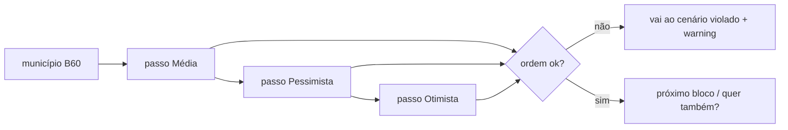

# Etapa de ajuste de votos no wizard (cenários + atalhos)

Status: rascunho
Atualizado em: 2026-07-29
Item do roadmap: [docs/roadmap.md](../roadmap.md) (Trilha B, item B61 — UX-1 wizards)
Impeccable: C — UI nova de passo numérico com coerência entre cenários
Appetite: ~1–1,25 dia eng; 3 sub-passos de cenário + atalhos + navegação de violação; grava via action existente no wiring A1 (neste item: UI + validação client espelhando servidor)
Responsável: —

## Design (Impeccable)

Âncoras: `PRODUCT.md` (Feel the action; Clarity under pressure) / `DESIGN.md` · `VoteEstimateScenarioInputs` / `MunicipalityListExpectedVotesControl` · tema `campaign`.

Na implementação: shape → craft → critique → polish.

Brief compacto:

- **Persona:** CG no celular ajustando Cairu −100 / Salinas 300→150; quer atalho, não teclado minucioso.
- **Job principal:** editar **um cenário por vez** (média → pessimista → otimista), com atalhos e confirmação explícita para o próximo.
- **Estratégia de cor:** Restrained; warning de coerência usa tom de alerta do tema (não Signal Red decorativo).
- **Edit where you see:** não neste passo — é fluxo com **submit explícito** por cenário (“Ajustar estimativa pessimista →”), exceção já prevista em `campanha-edit-where-you-see` para confirmação.
- **Anti-goals:** três inputs na mesma tela com um “Salvar”; input enorme estilo hero-metric SaaS; auto-save silencioso sem CTA.

## Dados → decisão → apresentação

- **Vou apresentar dados?** Sim — valor atual de `expectedVotes[cenário]` e o valor em edição.
- **Decisões:** staff escolhe o novo número da projeção da mesa por cenário; decide se corrige coerência ou volta ao cenário que quebrou.
- **Forma:** **número + contexto** (rótulo do cenário + valor atual). **Rejeitado:** chart; três gauges; % estadual.
- **Profile:** 1 inteiro por passo; ordem `pessimistic ≤ central ≤ optimistic` (`getVoteEstimateOrderViolation`).
- **Anti-goals de dado:** não misturar `declaredVotes` de liderança; liderança nunca vê esta etapa.

## Contexto

Ação A1 do Início ([fluxos-acao-primeiro-inicio.md](fluxos-acao-primeiro-inicio.md)): após escolher município (**B60**), ajustar estimativas. Pedido (2026-07-29):

- Input **já preenchido** com o valor atual; editável.
- Atalhos: **2×**, **+50**, **−50**, **+100**, **−100** (aplicam sobre o valor corrente do input).
- Input **grande, não enorme**.
- Ordem fixa: **média → pessimista → otimista** (`central` → `pessimistic` → `optimistic`).
- Se um cenário **quebrar a lógica** com um já definido, navegar **para o cenário que ficou inconsistente**, mostrar **warning** (por quê) e atalho para **voltar ao cenário que a pessoa acabou de editar**.
- CTA por passo: ex. **“Ajustar estimativa pessimista →”** (não auto-avanço mudo).

Invariante de servidor já existe: `getVoteEstimateOrderViolation` + hook em `Municipality` / `VOTE_ESTIMATE_ORDER_ERROR_MESSAGE` (`src/lib/voteEstimate.ts`).

## Objetivos

- Etapa(s) `WizardExpectedVotesStep` (ou uma rota com `?scenario=`) no **B59**.
- Estado local dos três números; ao confirmar um cenário, validar contra os já confirmados; se violar, `setScenario(violation)` + banner + link “Voltar para [cenário editado]”.
- Atalhos mutam o draft (floor 0, ceiling `MAX_VOTE_COUNT`); `2×` = dobrar o valor atual do input (se vazio/0, definir comportamento: ficar 0 ou no-op — **recomendação:** no-op se &lt;1).
- CTA confirma o cenário e avança (ou conclui o bloco de votos e devolve ao orquestrador A1).
- Reusar labels `voteEstimateScenarioLabels` (Média / Pessimista / Otimista).
- Escrita persistente: **reusar** action/endpoint de `expectedVotes` já usados pela lista (`MunicipalityListExpectedVotesControl` / POST expected-votes) — neste item pode entregar UI + schema de passo; o commit final do A1 pode batchar os três no wiring. **Mínimo:** não inventar segunda semântica de ordem.
- Staff-only; sem migration / Consent.
- Unit: coerência (casos que forçam jump + atalho de retorno); atalhos aritméticos.

## Decisões travadas

- **Ordem de edição: média → pessimista → otimista** (pedido). **Rejeitado:** três campos numa tela; ordem pessimista-primeiro (é a ordem do invariante de armazenamento, não do ritual de mesa).
- **Confirm explícito por cenário** (CTA nomeado). **Rejeitado:** auto-save estilo B27 (pedido pede botão; e coerência cross-cenário pede commit consciente).
- **Violação → navegar ao cenário quebrado + warning + atalho de retorno.** **Rejeitado:** só toast bloqueando; forçar edição inline sem mudar de passo.
- **Atalhos sobre o valor do input**, não sobre o valor persistido antigo após dirty. **Rejeitado:** resetar ao “atual” a cada atalho.
- **i18n:** `central`/`pessimistic`/`optimistic` nos ids; copy “Ajustar estimativa … →”.

## Questões em aberto

- **Gravar no servidor a cada CTA de cenário ou só no commit final do A1?** **Opções:** A por cenário | B batch no fim. **Recomendação:** B no wiring A1 (um write); este item valida localmente e devolve os três valores — evita half-write se o CG abandonar no pessimista. _(assumido — validar na implementação do A1)_

## Abordagem proposta

Componentes:

- **`WizardExpectedVotesStep`**: input grande (`text-2xl`/`text-3xl` — medir no craft; não `text-6xl`), fila de atalhos (`Button` outline), CTA, banner de coerência.
- **Helper puro** `applyVoteShortcut(value, 'double' | '+50' | …)` + reuso `getVoteEstimateOrderViolation`.
- **Migration:** Sem migration (campos já existem).

## Dependências

- Dura: **B59**. Soft: **B60** (município já escolhido). Reuso: A10 ✓ / `voteEstimate.ts` / controle da lista.

## Não escopo

- Wiring completo A1 (sinal/tendência/resumo) → fatia posterior UX-1.
- Edição de `votePledge.estimatedVotes` → fora (esta etapa = `municipality.expectedVotes` da mesa).
- Leader → lockdown.

## Rabbit holes

- **Mini-spreadsheet dos 3 cenários com sync bidirecional.** **Mitigação:** um cenário visível por vez.
- **Recalcular meta E8 / cobertura ao vivo no passo.** **Mitigação:** número cru; cobertura fica no resumo A1 ou no Quadro.

## Adiado com gatilho

- **Preview de cobertura E8 no rodapé do passo.** Revisitar se o CG pedir “isso fecha a meta?” durante o ajuste (sessão).

## Referências

- [fluxos-acao-primeiro-inicio.md](fluxos-acao-primeiro-inicio.md) · [cenarios-estimativa-votos.md](cenarios-estimativa-votos.md) · `src/lib/voteEstimate.ts` · `MunicipalityListExpectedVotesControl.tsx` · `VoteEstimateScenarioInputs.tsx` · collection `Municipality` hook de ordem
- AGENTS.md — assimetria leader; `overrideAccess: false`
- `PRODUCT.md` / `DESIGN.md` · `.cursor/rules/campanha-edit-where-you-see.mdc` (exceção submit explícito)
