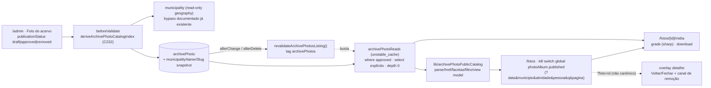

# Impl: C233 — Álbum público de fotos com busca por data, local, atividade e pessoa pública

Status: aprovado (modo `--auto`) — hard-stops aprovados explicitamente pelo humano na sessão (2026-09-26); timing eleitoral decidido: **abrir agora**
Atualizado em: 2026-09-26
Issue: #1368
Intenção: docs/plans/album-fotos-publico-busca.md
Design UI (gate): docs/plans/album-fotos-publico-busca-ui-design.html
Appetite restante: herdado (~1–2 dias eng) — **uma porta pública nova (`/fotos`) sobre o catálogo do C232**, sem segunda curadoria. Corte explícito para caber: capítulos/álbuns por evento viram heading derivado do filtro + ordenação; sem página própria por foto; miniatura on-the-fly (sem pipeline de variantes armazenadas); sem workflow de atendimento (staff marca `removed`); busca por selfie é C234.

> Aprovado pelo próprio agente via `--auto` (modo autônomo do `work-issue`); a pausa do GATE virou apresentação-no-chat. Os hard-stops exigiram aprovação humana explícita e foram aprovados na sessão (`--auto` aprova o plano, não o schema nem o contrato público): schema/migration ✅, contrato `/fotos` ✅, bypasses intencionais ✅, miniatura on-the-fly ✅. **Timing eleitoral: o humano decidiu "implementar e abrir agora" (2026-09-26)** — sobrepõe a recomendação de pós-eleição do plano de intenção; o album nasce aberto (`photoAlbum.published` default `true`), com kill switch e pull-down imediatos.

## Leitura da intenção

- **Outcome:** o cidadão chega à foto certa por data, município, atividade, pessoa pública ou termo — e só vê o que a curadoria aprovou; toda foto mostra contexto real (data, local, atividade, quem aparece), tem vazio honesto e um canal visível de remoção cujo efeito é imediato e fail-closed.
- **O que NÃO negociar:**
  - Só aprovadas aparecem; não aprovada não é acessível nem por URL direta (a mídia responde 404 igual).
  - Pessoa pública só pelo catálogo curado (`publicFigureCatalog`), por nome canônico — nunca `Contact`, nunca rosto/biometria.
  - Remoção a pedido: foto removida some do público **e do índice** sem deploy; sem registro humano não republica.
  - Sem contador/ranking/analytics de vaidade; sem like/comentário/share com PII; imagens same-origin pelo proxy privado (bucket fechado).
  - URL pública é contrato congelado; tag nova entra na allowlist fechada.
- **O que reavaliar (hipóteses da "Direção no codebase"):**
  - "Só a leitura cacheada da lista inteira" — vale no v1 porque o conjunto **aprovado** é curadoria manual (começa vazio), com gatilho de revisita registrado (D2).
  - "O read público resolve o município" — confirmado, mas **não** lendo a collection `municipality` (campaign-only): o hook existente denormaliza nome/slug na própria linha (D2).
  - "A rota `/fotos` existe ao deployar" — risco eleitoral assumido por decisão do gate (D9): o v1 nasce **aberto** com kill switch global e pull-down por foto.
  - "O design aprovado pode ser seguido como está" — não: o CTA "Encontre você nas fotos" é a busca por selfie (C234) e há heading/controles sem comportamento definido; o `designer` estende o artefato antes do markup (D8).

## Abordagem recomendada

**Opções consideradas (abordagem geral):** A) rota nova `/fotos` sobre o catálogo C232, com estado de publicação, read público cacheado por tag, contrato puro próprio, mídia same-origin e gate de timing por global; B) reusar `/conteudos` com uma faceta "foto"; C) construir álbuns/coleções curadas + página por foto.
**Recomendação:** **A** — é o contrato da intenção (URL `/fotos`, acervo ≠ peça editorial), reusa o dono de cada mecanismo (C232 para campos/vocabulário, `contentPieceReads` para o padrão de cache, `privateMediaResponse` para o I/O, `documents.ts`+allowlist para a tag) e cabe no appetite sem collection nova.
**Rejeitadas:** **B** porque mistura dois produtos e faria a Central carregar 6,5k fotos como "peças"; **C** porque exige segunda curadoria, página por foto e explosão de sitemap — os cortes literais da intenção.

### Componentes / mudanças

- **`src/lib/archivePhotoCatalog.ts`** (editar): vocabulário de publicação `ARCHIVE_PHOTO_PUBLICATION_STATUSES = ['draft','approved','removed']` + labels + `isArchivePhotoPublicationStatus` + predicado `archivePhotoIsPublic(record)` (espelho de `contentPieceIsPublic`); permanece a fonte de cenas/pessoas/datas. `publicationStatus` **não** entra em `ARCHIVE_PHOTO_CURATED_FIELDS` (`:61-86`) — é decisão editorial, não campo que o job disputa.
- **`src/lib/archivePhotoPublicCatalog.ts`** (novo, puro): `ARCHIVE_PHOTO_ALBUM_PATH='/fotos'`, `ARCHIVE_PHOTO_ALBUM_PAGE_SIZE=24`, `ARCHIVE_PHOTO_THUMB_WIDTH`, params/facetas/href canônico/parse fail-closed, `archivePhotoPublicPeople`, facetas derivadas, filtro AND+termo, heading derivado, labels de data (UTC) e view model (`mediaPath`, `thumbnailPath`, `downloadPath`).
- **`src/collections/ArchivePhoto.ts`** (editar): campo `publicationStatus` (select, `defaultValue:'draft'`, `required`, `index`), `municipalityName`/`municipalitySlug` (text, `readOnly`, slug `index`); `deriveArchivePhotoCatalogIndex` (`:150-211`) estende o `select` da leitura de município (`:183`) para `{ name: true, slug: true }` e grava os snapshots; `defaultColumns` (`:224`) ganha o status; hooks novos de revalidação (`afterChange`/`afterDelete`, espelho `ContentPiece.ts:92-106,271-272`).
- **`src/globals/PhotoAlbum.ts`** (novo): global `photoAlbum` (grupo `Configurações`), `read: () => true`, `update: payloadAdminOnly`, `published` (checkbox, default `true` por decisão do gate de 2026-09-26 — a rota nasce aberta; é o kill switch da superfície), `removalChannelUrl` (text, valida `https?://`/`mailto:`), hook `beforeValidate` fail-closed (publicar sem canal válido recusa) e `afterChange` → revalidar a tag do global. Registrar em `src/payload.config.ts` (`globals`, `:161`).
- **`src/utilities/archivePhotos/archivePhotoReads.ts`** (novo, `server-only`): `select` explícito (`id`, `alt`, `catalog`, `municipalityName`, `municipalitySlug`, `takenOn`, `searchText`, `filename`, `mimeType`), `where publicationStatus=approved`, `sort ['-takenOn','-id']`, `depth 0`, `unstable_cache` na tag da collection; `getApprovedArchivePhotoItems/ById` e `hasPublishedArchivePhotos` (descoberta).
- **`src/utilities/privateMedia/privateMediaResponse.ts`** (editar): novo `buildPrivateMediaImageResponse` — mesma abertura S3/disco de `:107-160`, mas quando há `width` faz o resize **em streaming** (`sharp(stream).resize(...)`) sem temp-file; sem `width`, delega ao `buildPrivateMediaResponse` (`:175-212`) que **já suporta** `download`/`dispositionFilename` (nenhuma mudança nele).
- **Routes:** `src/app/(frontend)/fotos/page.tsx` (sem `loading.tsx` de propósito: o boundary de Suspense flusha o shell antes da página e o `notFound()` do kill switch viraria `200` com a UI de not-found; o gate é checado no `generateMetadata` e na página), `src/app/(frontend)/fotos/[id]/midia/route.ts` (`force-dynamic`; `?tamanho=grade`, `?download=1`; `X-Robots-Tag: noindex`).
- **UI:** `src/components/fotos/` — `ArchivePhotoPageHeader`, `ArchivePhotoHero`, `ArchivePhotoFilters`, `ArchivePhotoCard/Grid`, `ArchivePhotoLightbox` (client mínimo), `ArchivePhotoStates`, `ArchivePhotoRemovalBand`; `src/components/CampaignFooter.tsx` ganha `showFotos` + `current='fotos'` (padrão dos flags existentes, `:27-95`).
- **Revalidação:** `src/utilities/documents.ts` ganha `revalidateArchivePhotosListing()` (usa o `revalidateTagSafely` de `:27-34`); `src/utilities/revalidateRequest.ts` ganha a tag `archivePhotos` na allowlist (`:16-26`) e `AGENTS-public.md` documenta a tag.
- **Migration:** `pnpm migrate:create add_archive_photo_publication` — aditiva: coluna `publication_status` (`default 'draft'`), colunas `municipality_name`/`municipality_slug`, tabela do global `photo_album`, **backfill** dos snapshots de município por `UPDATE ... FROM municipality` (SQL revisado à mão; nenhuma migration existente tocada). `pnpm generate:types`.
- **Testes/manifest:** ver D10.
- **Access / Consent:** nenhum `Consent` novo; nenhuma pessoa nova; `update` da collection e do global seguem `payloadAdminOnly`; read anônimo e `overrideAccess` da mídia reusam os precedentes documentados (hard-stop 4).

### Dados → forma (se aplicável)

N/A — a intenção declara: nenhum número, contador ou ranking na superfície; a lista é acervo com metadado editorial, não apresentação de dado (prompt 3 de data-presentation não se aplica).

## Decisões de engenharia

### D1 — Estado de publicação (schema + migration + backfill) (caro)

**Opções:** A) checkbox `published`; B) select `publicationStatus: draft | approved | removed` (default `draft`, indexado); C) reusar `curatedFields`/`catalog.source` como marcador.
**Recomendação:** **B** — o aceite exige "remoção não republica": `removed` é estado sticky que o pipeline nunca escreve e que só a staff reverte; A não distingue "nunca curada" de "removida a pedido" e um clique re-publicaria. Backfill: a migration cria a coluna com default `draft` — **nenhuma** das fotos já catalogadas nasce pública; a assessoria aprova deliberadamente. A edição ocorre na mesma ficha do `/admin` (grupo Comunicação; `access.update = payloadAdminOnly`, `ArchivePhoto.ts:227-232`); abrir a curadoria para a sessão `communicator` é item separado (gatilho registrado).
**Rejeitadas:** **A** porque não preserva a remoção; **C** porque `curatedFields` arbitra job×curadoria de campos de catálogo e `source` é o resultado da pré-catalogação — categoria errada.

### D2 — Read público cacheado e resolução do município (caro)

**Opções:** A) módulo de domínio `src/utilities/archivePhotos/archivePhotoReads.ts` + snapshot `municipalityName/Slug` na linha (gravado pelo hook, backfill na migration); B) módulo top-level registrado no pin; C) ler a relação no caminho público (depth 1 ou query extra com bypass).
**Recomendação:** **A** — o hook **já** lê o município a cada save com o bypass documentado de geografia (`ArchivePhoto.ts:177-190`); denormalizar ali mantém o read público 100% dentro da própria linha (`depth 0`, `select` explícito, sem Flickr/geo/EXIF), sem novo bypass e filtrando `publicationStatus === 'approved'` **e** `archivePhotoIsPublic` no mapper (fail-closed em duas camadas). A subpasta `archivePhotos/` evita o pin top-level (`codebaseConventions.unit.spec.ts:421-573`); `flickr/` continua o dono da ingestão (fonte), não do álbum. Cache: `unstable_cache(['archive-photos'], { tags:[getCollectionListingTag('archivePhoto')] })`, espelhando `contentPieceReads.ts:26-65`; lista inteira das aprovadas filtrada em memória — **gatilho de revisita** quando as aprovadas passarem de ~1k (consultas por página + snapshot de facetas).
**Rejeitadas:** **B** (pin novo para uma leitura de domínio); **C** (o read de `municipality` é campaign-only — `municipalities.ts:192` — e um bypass extra no caminho público vaza superfície por dado que é imutável e o hook já tem em mãos).

### D3 — Contrato de URL, facetas e paginação (caro)

**Opções:** A) `data` (dia exato `YYYY-MM-DD`), `municipio` (slug do `municipalityCatalog`), `atividade` (valor de `ARCHIVE_PHOTO_SCENES`), `pessoa` (slug do nome canônico), `q`, `pagina` (1-based, canônico dropa 1) e `foto` (id numérico, **não** canônico) — puros em `src/lib/archivePhotoPublicCatalog.ts`; B) `mes`/`ano` + `tema`; C) multi-value por facet.
**Recomendação:** **A** — single-value no vocabulário existente, no padrão `contentPieceCatalog.ts:105-156`; o dia casa com `takenOn` (meio-dia UTC; parse reusa `archivePhotoTakenOn`, `archivePhotoCatalog.ts:256-271`) e é a pergunta real ("a foto da agenda"); as opções do controle de Data derivam **só** dos dias com foto aprovada (vocabulário fechado, não um calendário completo) e o controle (select × menu) é confirmado pelo `designer` em D8; `ARCHIVE_PHOTO_ALBUM_PAGE_SIZE = 24` mantém a grade leve (designer confirma 2/3 colunas); `buildArchivePhotoAlbumHref` serializa na ordem fixa `data,municipio,atividade,pessoa,q,pagina` e só inclui `foto` a pedido; a metadata canônica é `/fotos` sem filtros e `robots:noindex` quando zero aprovadas (espelho `page.tsx:45-81`); facetas derivam **só** dos itens aprovados (filtro que não casa não renderiza); `pessoa` casa `slugify(resolvePublicFigureName(nome) ?? nome)` (`publicFigureCatalog.ts:77-85`); `municipio` casa `municipalitySlug`; `atividade` só com cenas presentes, ordenadas pelo vocabulário.
**Rejeitadas:** **B** (mês/ano não é a pergunta e "capítulo" é heading derivado, não entidade; `tema` não existe neste acervo); **C** (quebra o contrato single-value do repo e faz a URL explodir com 8 pessoas).

### D4 — Porta pública de mídia, miniatura e download (caro)

**Opções:** A) `/fotos/[id]/midia` com `buildPrivateMediaResponse` para a imagem cheia e `?tamanho=grade` com resize on-the-fly (sharp, uma imagem, sem storage), `?download=1` para "Baixar foto"; B) `imageSizes` no upload + regeneração/backfill das aprovadas; C) servir o original em tudo.
**Recomendação:** **A** — o repo nunca usou `imageSizes` e as 6,5k fotos existentes não têm variantes; sharp já é dependência e o domínio já faz exatamente esse resize (`flickr/archivePhotoCatalog.ts:177-186`). O resize é **em streaming** (`sharp(stream)` sobre o objeto aberto do S3/disco, sem temp-file; sharp é o mesmo dono que o C232 já usa), dentro do `privateMediaResponse` (I/O num dono só), com os headers privados intocados (`no-store`, `privateMedia.ts:41`) e `X-Robots-Tag: noindex` nas duas variantes (evita 6,5k imagens indexáveis). O gate é o read cacheado (`getApprovedArchivePhotoById`) → 404 idêntico para draft/removida/inexistente; a rota re-lê a linha com o `overrideAccess` documentado do precedente (`conteudos/[slug]/midia/route.ts:40-51`) para o filename fresco; disposição `inline` para exibir e `attachment` no download (o `buildPrivateMediaResponse` já aceita `download` + `dispositionFilename`), nome legível por helper puro (`jorge-solla-1313-foto-<id>.<ext>`). O `no-store` é deliberado: pull-down imediato (right to erasure) não convive com cache público de derivada.
**Rejeitadas:** **B** (pipeline/backfill novo para um acervo majoritariamente não-público e sem precedente de `imageSizes`); **C** (contraria o aceite "miniaturas" — original de vários MB por card).
**Risco assumido:** CPU do resize por request (24/página, sem cache) — medir no e2e local; gatilho de revisita: p95 da página acima do aceitável ou aprovadas >~1k ⇒ variante armazenada (decisão explícita, hard-stop 5).

### D5 — Tag de revalidação, hook e allowlist (caro)

**Opções:** A) tag `archivePhotos` **derivada** (`getCollectionListingTag('archivePhoto')`) + allowlist + `revalidateArchivePhotosListing()` + `afterChange`/`afterDelete` na collection (espelho `ContentPiece.ts:92-106`); B) tag literal `archive-photos`; C) sem hook (TTL/deploy).
**Recomendação:** **A** — uma edição de curadoria (inclusive `approved→removed`) busta a lista e o `byId` do overlay: a foto some do índice e a mídia dela passa a 404 **sem deploy**; o helper seguro já engole o `revalidateTag` fora de request (`documents.ts:27-34`), então o ingest CLI não quebra; `documents.ts` continua sem importar `@payload-config`.
**Rejeitadas:** **B** (duas fontes para o mesmo nome); **C** (contraria o aceite de pull-down imediato).

### D6 — Detalhe da foto em contexto (caro)

**Opções:** A) overlay server-rendered na própria `/fotos` via `?foto=<id>` (não canônico), id fora das aprovadas → sem overlay (fail-closed), "Voltar ao álbum"/"Fechar" apontando para o href filtrado sem `foto`, com um shell client mínimo para foco inicial e Esc; B) rota interceptada `/fotos/[id]`; C) página própria `/fotos/[id]` noindex.
**Recomendação:** **A** — preserva o corte "foto avulsa não ganha página própria" (`/fotos/<id>` segue 404) e o voltar/fechar é navegação real que funciona sem JS; o overlay reusa o mesmo item do read cacheado, sem segunda query, e mostra o contexto curado (Data, Local, Atividade, Quem aparece) + Baixar + canal de remoção.
**Rejeitadas:** **B** (maquinário de rota interceptada sem ganho e cria um path por foto); **C** (contraria o corte de sitemap/6,5k páginas).

### D7 — Canal de remoção (caro)

**Opções:** A) global `photoAlbum` com `removalChannelUrl` (http(s)/mailto validado) e links diretos/pré-preenchidos (`mailto:` com assunto + link da foto), sem formulário; staff marca `removed` na ficha; publicar exige canal válido; B) link para `/contato`; C) form/collection de pedidos com `Consent`.
**Recomendação:** **A** — zero captura de dado e zero `Consent` novo; o destino é dado editável no `/admin` (nunca inventado no código — o gate fornece e o hard-stop 4 registra); "atendimento registrado" = `publicationStatus: removed` na ficha, sem workflow; a banda de rodapé (cena 05) e o detalhe consomem o mesmo campo.
**Rejeitadas:** **B** (rota inexistente no site — inventaria uma página de contato); **C** (collection/Consent/PII novos, fora do appetite e do invariante).

### D8 — UI e extensão do design (caro — trigger (b) do designer)

**Opções:** A) port classe-a-classe com o `designer` estendendo o artefato **antes** do markup; B) implementar o artefato literal; C) redesenhar.
**Recomendação:** **A** — superfícies e estados: header page-local no molde `ContentPiecePageHeader`; hero; busca GET sem JS + chips `Data`/`Município`/`Atividade`/`Pessoa pública` com `
` e chip ativo × (padrão `ContentPieceFilters.tsx:95-196`); grade 2/3 colunas com `` (sem `next/image`: proxy `no-store` fora da allowlist — `next.config.mjs:9-30`; precedente `ContentPieceMedia.tsx:184-193`); card com título (`catalog.caption ?? alt`), meta `data · município · atividade` e linha "Quem aparece"; paginação anterior/próxima preservando facetas; overlay (D6); vazios honestos no molde `ContentPieceStates.tsx:19-72`; banda de remoção (cena 05) + `CampaignFooter`; a11y: `alt` curado, teclado, foco visível, contraste, mobile-first. O `designer` precisa entregar **antes do markup**: (i) remoção/substituição do CTA "Encontre você nas fotos" (depende do C234 — **não pode ser seguido como está**); (ii) comportamento do heading "Agenda em destaque" (helper derivado do filtro ativo); (iii) padrão mobile das facetas (bottom sheet × linha de `
`); (iv) foco/fechar do overlay; (v) confirmação do "Baixar foto" no v1; (vi) controle de Data (drop-down dos dias existentes × outro padrão — o artefato só mostra "Qualquer data"); (vii) controle de paginação (o artefato não desenha um).
**Rejeitadas:** **B** (o artefato contém um CTA impossível nesta fatia — seguir literal é defeito); **C** (design aprovado existe; redesign é desperdício).

### D9 — Timing eleitoral (decidido pelo humano — abrir agora)

**Opções:** A) rota fechada por padrão (`photoAlbum.published=false` ⇒ `/fotos` 404 + noindex) com flip pós-eleição; B) env `ARCHIVE_PHOTO_ALBUM_PUBLIC`; C) deferir o item; D) **abrir agora** — `published` default `true`, rota viva no merge, com kill switch global e remoção por foto.
**Decisão do gate (2026-09-26):** **D** — o humano decidiu explicitamente implementar e abrir agora, sobrepondo a recomendação (assumida) de pós-eleição do plano de intenção. Consequências registradas: a proteção contra conteúdo segue sendo a curadoria (nenhuma foto nasce aprovada) + o estado `removed` por foto + o kill switch do global (flip sem deploy) + `noindex` enquanto não houver aprovadas; o canal de remoção é pré-requisito para fotos irem ao público (guard do global).
**Rejeitadas:** **A** (preferida do plano de intenção, preterida pelo gate); **B** (flip exigiria deploy/restart, invisível para o produto e sem trilha); **C** (a intenção pede o item e o gate decidiu não adiar).

### D10 — Verificação por camada (barato, mas explícito)

**Opções:** A) unit do contrato puro + unit dos pins existentes + int do read/rota/hook/global + e2e novo `frontendFotos` no manifest, no projeto Playwright e no curado; B) só int; C) e2e de browser para tudo.
**Recomendação:** **A** — unit `tests/unit/archivePhotoPublicCatalog.unit.spec.ts` (parse fail-closed de cada param, href canônico preservando facetas e dropando `foto`/`pagina=1`, facetas só de aprovadas, filtro AND + termo + dia, view model/heading/labels de data, slice de página); estende `tests/unit/archivePhotoCatalog.unit.spec.ts` (vocabulário/predicado de publicação); int `tests/int/archivePhotoPublicRead.int.spec.ts` (aprovada aparece; draft/removida não; escrita de sistema não muda `removed`; município resolvido pelo snapshot; `getApprovedArchivePhotoById`; hook busta; guard do global; importa `GET` da rota de mídia — precedente `contentEvents.int.spec.ts:40` e `contentPiece.int.spec.ts:48-49` — para 200/404 e download); e2e `tests/e2e/frontendFotos.e2e.spec.ts` (serial, REST admin com `adminHeaders`; seeda foto por multipart + flipa o global; filtra por facetas/termo, abre overlay, mídia 200/404, `removed` some; restaura o global no `afterAll` e limpa as linhas). Pins: entrada nova em `scripts/lib/e2e-affected-manifest.mjs` (prefixos da rota/componentes/contrato/utilities/collection/global/documents), `frontendFotos` em `E2E_CURATED_SPECS` (`:24-54`, obrigatório: a migration torna o PR high-risk) e no pin `tests/unit/e2eAffectedManifest.unit.spec.ts:51-103`; projeto `frontendFotos` em `playwright.config.ts:170-210` (testMatch próprio + `dependencies: isProdMode ? [] : ['frontend']`); `src/components/CampaignFooter.tsx` no manifest ganha `frontendFotos`. `codebaseConventions.unit.spec.ts:421-573` intocado (subpasta de domínio).
**Rejeitadas:** **B** (o contrato HTTP público e o kill switch pedem prova real); **C** (browser para lógica pura é caro e frágil).

## Fases verificáveis

1. **Tracer / schema+server — quota ~45%:** vocabulário/predicado + campos da collection + snapshot de município no hook + global + migration com backfill + `pnpm generate:types`; contrato puro; read cacheado; tag/helper/allowlist e hooks; unit + int verdes antes de seguir.
2. **UI (dispatch do designer primeiro) — quota ~35%:** extensão do artefato (D8), componentes `src/components/fotos/*`, página + metadata + `loading`, rota de mídia (grade/download), overlay, `CampaignFooter`.
3. **Gates — quota ~20%:** `pnpm gate:fast`; `pnpm test:int`; e2e local `pnpm test:e2e --no-deps --project=frontendFotos`; manifest/curado/pin/projeto; `pnpm push`; no fechamento, changelog `docs/changelog/2026-09-26-c233.md` e `AGENTS-public.md` (tag nova na allowlist + contrato do álbum).

## Rabbit holes / Não escopo (engenharia)

- **Página própria por foto** (`/fotos/[id]` page, sitemap de 6,5k) — corte literal; o `/fotos/<id>` continua 404.
- **Álbuns/coleções por evento com segunda curadoria** — heading derivado do filtro + ordenação; sem entidade nova.
- **Selfie/reconhecimento facial (C234), busca por rosto ou nome inferido** — fora; o CTA do design é removido/substituído.
- **Like/comentário/share com PII, contador de views, "mais vistas"** — vedados pela intenção.
- **`Contact`/collection de pessoas, upload público, edição de imagem** — proibidos.
- **`Consent` novo ou reuse de opt-in para remoção** — proibido; o canal é link, sem captura.
- **`imageSizes`/variantes armazenadas e scripts de regeneração** — v1 é on-the-fly; gatilho: CPU/tempo da grade.
- **Abrir a curadoria para `communicator` (access)** — fora; a ficha segue no `/admin` com `payloadAdminOnly`.
- **Ler `municipality` publicamente / `depth 1` no read** — rejeitado em D2.
- **`ALTER TYPE` de `curatedFields`** — morto; `publicationStatus` não é campo de catalogação.
- **Busca semântica/tema no álbum** — não existe vocabulário; `q` é literal sobre `searchText`.
- **Prefetch agressivo/client router cache nas páginas filtradas** — manter `prefetch` padrão do Link; sem infinite scroll.

## Riscos e mitigação

- **Original pesado vazando para a grade:** miniatura on-the-fly em streaming (sharp) + página de 24 + `loading="lazy"`; e2e/int conferem a variante; gatilho para variante armazenada se CPU incomodar.
- **Custo da leitura da lista inteira a cada bust:** só aprovadas entram no `where`; o bust acompanha edições de curadoria (baixa frequência); gatilho >~1k aprovadas.
- **Backfill dos snapshots de município incorreto:** SQL revisado à mão + int com município seedado e foto catalogada antes da migration; a migration é aditiva e nunca substitui as existentes.
- **Remoção que "volta":** pipeline nunca escreve `publicationStatus`; `removed` só sai por edição humana; int cobre escrita de sistema com `context` preservando o estado.
- **Canal de remoção vazio em produção:** guard do global recusa publicar sem canal válido; links só existem com o canal preenchido; e2e cobre o guard.
- **Superfície pública nova em período eleitoral:** risco assumido explicitamente pelo humano (2026-09-26, D9 — abrir agora); mitigado por curadoria (nada nasce aprovado), `removed` fail-closed, kill switch global e `noindex` enquanto vazio.
- **`revalidateTag` fora de request (CLI/e2e):** helper seguro existente; int cobre o write sem request.
- **S3 parcial/derrubada de boot:** guard existente de `mediaStorage` intocado; a nova rota usa o mesmo `resolvePrivateMediaStaticDir` de dev/test.
- **e2e com estado global compartilhado:** spec serial + `beforeAll`/`afterAll` restaurando `photoAlbum`; a suíte roda `fullyParallel` com 2 workers — mitigar não afirmando o link novo em specs alheios e revisar ao adicionar o projeto.
- **PR high-risk (migration):** curado com `frontendFotos` + pin do curado atualizado no mesmo PR; `pnpm test:e2e --no-deps --project=frontendFotos` local.

## Hard-stops (aprovação humana explícita — valem mesmo em `--auto`)

1. **Schema/migration:** `publicationStatus` + snapshots de município + global `photoAlbum` + backfill SQL — `pnpm migrate:create add_archive_photo_publication` e `pnpm migrate` só no banco local do worktree (`teqo_wt233`/`teqo_wt233_test`); aditiva, sem tocar migration existente; revisar o SQL; `pnpm generate:types`. **✅ Aprovada na sessão `--auto` (2026-09-26).**
2. **Contrato público/URL:** `/fotos` + params `data|municipio|atividade|pessoa|q|pagina|foto`, rota `/fotos/[id]/midia` (variantes grade/download), canonical `/fotos`, noindex quando vazio, e a tag `archivePhotos` entrando na allowlist fechada de `revalidateRequest.ts` (com atualização de `AGENTS-public.md`). **✅ Aprovado na sessão `--auto` (2026-09-26).**
3. **Timing eleitoral (produto): ✅ decidido pelo humano (2026-09-26) — abrir agora.** `photoAlbum.published` nasce `true`; a rota abre no merge/deploy. Nenhuma foto existente é aprovada pela migration; o canal de remoção é pré-requisito para aprovar fotos.
4. **Bypasses intencionais:** (a) leitura anônima da lista aprovada via Local API (padrão documentado de `contentPieceReads.ts:13-24`); (b) `overrideAccess: true` na rota de mídia só para o filename fresco (precedente `conteudos/[slug]/midia/route.ts:40-51`); (c) o bypass de geografia do hook C232 (`ArchivePhoto.ts:177-190`) é **estendido, não criado**. O destino do canal de remoção é dado de produto fornecido pelo gate — **nunca inventar endereço/URL no código**. **✅ Aprovados na sessão `--auto` (2026-09-26).**
5. **Miniatura on-the-fly:** decisão de performance deliberada do v1 (sharp em streaming por request, sem storage); se o gate de produto preferir variante armazenada, a troca é decisão explícita (afeta D4) antes do push. **✅ Aprovada na sessão `--auto` (2026-09-26).**

## Adiado com gatilho (triagem do /simplify, 2026-09-26)

Nenhum achado virou Issue nova (zero `expensive_lock` ≥4). Os baratos ficaram registrados aqui:

- **Forma do nome de download (4ª cópia)** — `archivePhotoDownloadFilename` repete `contentPieceDownloadFilename`/jingle/webSpeech; já absorvido pelo defer do S27 (`escala-dry-pos-s27.md`). Gatilho: próximo toque em `src/lib/contentPieceCatalog.ts:571` ou `src/lib/jingle.ts` (unificar com a 4ª cópia).
- **`FACET_SLUG_PATTERN` residual** em `contentPieceCatalog.ts:99` e `shareLink.ts:27` (a C233 usa `SLUG_PATTERN` de `lib/slug.ts`). Gatilho: tocar qualquer um dos dois donos.
- **Chassi do bottom sheet** duplicado com `ContentPieceShareSheet` (portal + tema + Esc + backdrop). Gatilho: 3º overlay/sheet com o mesmo chassi.
- **`waitForSettledPage` duplicado** nos e2e (dono existente: `tests/e2e/fixtures/campaignE2EFixtures.ts` `waitForStreamSettled`; cópias pré-C233 em `frontendConteudos`/`campaignPeople`/`campaignConcepts`). Gatilho: próximo toque nos specs e2e.
- **`ArchivePhotoPublicSource` espelha o `select` à mão** + cast no read. Gatilho: `select` mudar sem o type acompanhar (derivar de `Pick<ArchivePhoto, …>`).
- **Sem trap de foco/`inert`** nos overlays (só foco inicial + Esc, como o `ContentPieceShareSheet`). Gatilho: requisito de a11y de modal pleno ou 3º overlay.
- **Acúmulo manual de chunks** no resize (`privateMediaResponse.ts`) em vez de `pipeline` + `toBuffer()`. Gatilho: próxima mexida no helper (avaliar com e2e da rota).
- **`RAISE NOTICE` do backfill** pode não aparecer no log do deploy. Gatilho: se o count não aparecer no 1º deploy real, trocar por log do migrator.
- **Resize on-the-fly sem cache** — decisão aprovada (hard-stop 5); revisita já condicionada a p95/>~1k aprovadas.

## Aceite de engenharia

- [ ] Aceite de produto coberto: busca por data/município/atividade/pessoa + termo; só aprovadas (nem por URL direta); contexto real; vazio honesto; canal de remoção visível com efeito imediato e `removed` não republicável pelo pipeline; cache por tag com pull-down imediato; a11y; grade leve mobile; same-origin/privado.
- [ ] Invariantes AGENTS/engineering-standards: sem cadastro paralelo/PII/`Consent`; `overrideAccess` só nos precedentes documentados; migração aditiva com SQL revisado; identificadores em inglês e copy pt-BR; nada de `next/image` em rota `no-store`.
- [ ] Testes de domínio previstos (unit/int) onde o read/gate/write mudam; manifest + curado + pin + projeto Playwright atualizados; e2e novo existe no disco.
- [ ] `pnpm gate:fast` verde; int do caminho verde; e2e `frontendFotos` verde local; `pnpm push` via GitHub; changelog + doc do contrato no fechamento.

## Self-score

**Self-score decision-quality: 4/5.** (1) todas as decisões caras (estado de publicação, read/denormalização, contrato de URL, mídia/miniatura, tag/hook, detalhe, remoção, timing, verificação) têm Opções + Recomendação + Rejeitadas; (2) cabe no appetite herdado: sem collection nova, uma migration aditiva com backfill, reusa o hook do C232, o padrão de read do S27, `privateMediaResponse`, o vocabulário de cenas/pessoas e o padrão de estados do catálogo; (3) rabbit holes nomeados (página por foto, álbuns, selfie, PII, `imageSizes`, access da curadoria, leitura pública de município, busca semântica); (4) depth check: donos existentes editados (collection/hook, documentos/tag, allowlist, footer, config do Playwright) e módulos novos só onde não há dono (contrato público, read do álbum, global, componentes `fotos/`); (5) outcome preservado — fail-closed, curadoria manda, sem PII, sem reescrever o aceite. O que impede o 5: a **miniatura on-the-fly** é aposta de performance não medida (CPU por request, sem storage) e o **timing eleitoral + o destino do canal de remoção** são decisões de produto (o timing foi decidido pelo humano em 2026-09-26; o destino do canal é dado do global, nunca inventado no código).
