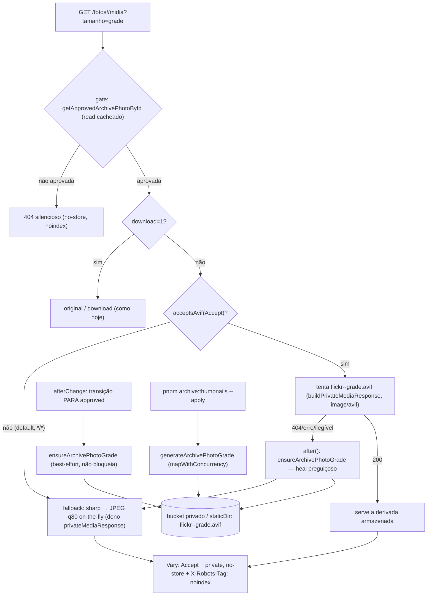

# Impl: C248 — Miniaturas AVIF pré-geradas do álbum público (previews rápidos nos cards)

Status: aprovado
Atualizado em: 2026-10-02
Issue: #1424
Intenção: docs/plans/album-miniaturas-avif.md
Appetite restante: herdado (~1–2 dias eng + máquina do backfill; cortes: sem UI, sem migration, sem variante do lightbox, sem CDN/cache novo, sem tocar no original)

## Leitura da intenção

- **Outcome:** a grade pública (`?tamanho=grade`) deixa de pagar sharp por request quando existe a derivada AVIF 720px q60 armazenada; qualquer ausência/falha cai no fallback on-the-fly atual, nunca em imagem quebrada; navegador sem AVIF recebe JPEG; pull-down imediato preservado; fotos novas cobertas pelo fluxo de aprovação + heal; backfill one-shot idempotente com recibo e guarda `*_CONFIRM`.
- **O que NÃO negociar:** URL congelada `/fotos/<id>/midia?tamanho=grade`; `private, no-store`; bucket privado Garage sem CDN; pull-down imediato (o gate continua sendo o read cacheado `getApprovedArchivePhotoById`); fallback sempre que a derivada faltar; AVIF q60 na régua do repo; filename determinístico por foto; nenhum original alterado; nenhuma URL/UI nova.
- **O que reavaliar (achados confirmados no código):**
  - (a) A rota já lê a linha fresca (`findByID`, `route.ts:46-54`) para filename/mime — é esse filename que deriva a chave da derivada; nenhuma query nova.
  - (b) O resize on-the-fly vive no dono `buildPrivateMediaImageResponse` (`privateMediaResponse.ts:230-296`), que já abre o objeto pelo caminho S3/disco (`openPrivateObject`) — a derivação reusa esse dono, não cria segundo pipeline de I/O.
  - (c) Não existe negociação de imagem (`Accept`/`Vary`) em lugar nenhum do repo; o default seguro é JPEG e o Playwright (`Accept: */*`) mantém o e2e atual verde.
  - (d) A régua AVIF q60 mora em `scripts/lib/imageResize.mjs:39` (`.mjs`, não importável de `src/`): as constantes vão para `lib/` com unit pin e comentário do dono.
  - (e) `afterChange` fire-and-forget pode morrer no `process.exit` das CLIs (ex.: `archive:publish` aprova em lote num processo efêmero) — o heal preguiçoso na rota é a garantia; o hook é warm-up.
  - (f) C246 re-ingere o original na MESMA chave (mesma foto, `repairArchivePhotoObject`) e a C245 só escreve metadados — a chave determinística da derivada sobrevive; objeto ausente/corrupto é skip honesto e o heal regenera quando recuperado.

## Abordagem recomendada

**Opções consideradas:** A) derivada como objeto-irmão determinístico no mesmo store privado, descoberta no caminho da rota, com extensão do dono `privateMediaResponse` | B) `imageSizes`/variante do Payload na collection `archivePhoto` (com backfill de regeneração) | C) segundo pipeline de mídia (fila/CDN/collection própria).
**Recomendação:** A — o bucket/disco privado já é o único store do original, o filename do original já é determinístico e imutável (C246 sobrescreve a mesma key), e o dono do I/O privado (`privateMediaResponse`) já concentra abrir/escrever/encodar; a derivada vira um irmão de chave (`flickr-<id>.jpg` → `flickr-<id>-grade.avif`), sem schema nem segunda fonte de verdade. Um HEAD a mais no caminho da derivada substitui o decode do original no caminho atual (hoje: HEAD+GET+sharp; com derivada: HEAD+GET).
**Rejeitadas:** B porque `imageSizes` só gera no upload, exigiria regeneração/backfill acoplado ao Payload e criaria estado de linha para um objeto derivado (migration desnecessária); C porque não existe fila/worker no stack self-hosted e CDN/cache novo é anti-goal explícito.

### Componentes / mudanças

- **`archivePhotoThumbnail`** (`src/lib/archivePhotoThumbnail.ts`, novo — puro, client-safe): `ARCHIVE_PHOTO_GRADE_EXTENSION`/`ARCHIVE_PHOTO_GRADE_MIME_TYPE` (`image/avif`)/`ARCHIVE_PHOTO_GRADE_QUALITY` (60, régua `scripts/lib/imageResize.mjs:39`) e `archivePhotoGradeFilename(originalFilename)` — irmão determinístico (`flickr-<id>.jpg` → `flickr-<id>-grade.avif`); largura reusa `ARCHIVE_PHOTO_THUMB_WIDTH` (720, `archivePhotoPublicCatalog.ts:43`). Compartilhado por rota, utility de geração, hook e script.
- **`acceptsAvif`** (`src/lib/privateMedia.ts`, edição): negociação pura do header — token exato `image/avif` (case-insensitive, `q` ausente ou > 0); `*/*`, `image/*` e header ausente ⇒ falso (default JPEG). Unit-pinada no spec existente.
- **`privateMediaObjectExists` / `writePrivateObject` / `encodePrivateMediaImage`** (`src/utilities/privateMedia/privateMediaResponse.ts`, edição): extensões do dono do I/O privado. `privateMediaObjectExists` = HEAD S3 / `stat` local, nunca lança; `writePrivateObject` = `PutObjectCommand` (ContentType) no S3 ou temp+rename no `staticDir` local (mesmo guard de path do `resolveLocalPath`); `encodePrivateMediaImage({ media, staticDir, width, format, quality })` extrai o stream→sharp (`failOn:'error'`, `rotate`, resize `withoutEnlargement`) que hoje é inline no fallback, e `buildPrivateMediaImageResponse` passa a chamá-lo com `jpeg q80` (comportamento idêntico, unit/e2e pinam).
- **`archivePhotoThumbnails`** (`src/utilities/archivePhotos/archivePhotoThumbnails.ts`, novo — `server-only`): `generateArchivePhotoGrade(payload, { filename })` baixa o original com `downloadPrivateMediaToFile`, encoda AVIF 720 q60 (`encodePrivateImageFile`) e grava com `writePrivateObject`; classifica `generated | skipped (missing-origin | corrupt-origin | no-filename) | failed`; nunca lança. `ensureArchivePhotoGrade(payload, { filename })` adiciona probe (`privateMediaObjectExists`), in-flight Map, limite de concorrência 2 e memo de falha 5 min — molde `contentPieceFrameJob` (`contentPieceFrameJob.ts:74-105,249-283`). Sem advisory lock/transação: não escreve DB e a chave é idempotente (last-write-wins do mesmo conteúdo).
- **Rota** (`src/app/(frontend)/fotos/[id]/midia/route.ts`, edição): mantém id/gate/`findByID`/download; em `tamanho=grade` sem `download` e `acceptsAvif(request.headers.get('accept'))`, tenta a derivada (`buildPrivateMediaResponse` com `{ filename: gradeName, mimeType: image/avif }`, `rangeHeader: null`) e, em 404/erro, cai no fallback atual e agenda `after(() => ensureArchivePhotoGrade(...))`; `Vary: Accept` na resposta da grade (derivada e fallback).
- **Hook** (`src/collections/ArchivePhoto.ts`, edição): `warmArchivePhotoGradeAfterChange` no `afterChange` — só na transição PARA `approved` (`previousDoc?.publicationStatus !== 'approved'`) com `filename` → `void ensureArchivePhotoGrade(...).catch(() => undefined)`; cataloguing/face-index/C246-repair não disparam (status não muda); falha jamais impede a aprovação.
- **Backfill** (`scripts/backfill-archive-thumbnails.mjs` + `scripts/lib/archiveThumbnailPlan.mjs`, novos; script `"archive:thumbnails"` no `package.json`): plan default read-only, `--apply` (gera faltantes), `--verify` (cobertura); `--only/--limit/--concurrency/--out/--help`; reusa `generateArchivePhotoGrade`, `privateMediaObjectExists`, `mapWithConcurrency` e `writeRepoFile`; recibo JSON em `data/archive/reports/` (gitignored) com processadas/puladas/falhas.
- **Pins** (`scripts/lib/test-affected-core.mjs`, edição): `scripts/lib/archiveThumbnailPlan.mjs` em `SCRIPTS_SPEC_PINNED` (o unit spec importa; `ciSkipInvariants.unit.spec.ts` exige a igualdade exata). O manifest e2e já cobre os prefixos tocados (`src/lib/archivePhoto`, `src/utilities/archivePhotos`, `src/utilities/privateMedia`, `src/collections/ArchivePhoto.ts`, `src/app/(frontend)/fotos`) → `frontendFotos`/`frontendFotosSelfie`; sem entrada nova.
- **Testes** (edição/novos): unit `tests/unit/archivePhotoThumbnail.unit.spec.ts` (naming/constantes) + extensão de `tests/unit/privateMedia.unit.spec.ts` (`acceptsAvif`) + `tests/unit/archiveThumbnailPlan.unit.spec.ts`; int extensão de `tests/int/archivePhotoPublicRead.int.spec.ts` (matriz da rota) + `tests/int/archivePhotoThumbnails.int.spec.ts` (geração/ensure/heal); e2e `tests/e2e/frontendFotos.e2e.spec.ts` (só `Vary`; JPEG mantido).
- **Runbook** (`docs/ops/teqo-1313-deploy.md`, edição): seção C248 (canário, staging→produção, `--verify`); changelog `docs/changelog/2026-10-02-c248.md` no fechamento.
- **Migration:** nenhuma — a derivada é objeto no store privado, sem campo/índice/collection; a chave deriva do `filename` que a rota já lê (stop-condition: surgir necessidade de linha/marcador ⇒ parar e sinalizar).
- **Access / Consent:** nenhuma mudança — a rota segue com o gate público cacheado e o `overrideAccess` documentado (releitura de filename); a geração é escrita de objeto por ator confiável já autorizado (mesmas credenciais S3 do ingest, sem permissão nova); sem `Consent`/`Contact`.
- **UI:** Impeccable A — nenhuma tela/fluxo; zero dispatch de designer; o card segue com o mesmo `` (`ArchivePhotoCard.tsx:29`), que negocia `Accept` sozinho.

### Dados → forma

- Sem dados de produto novos (a grade e o overlay não mudam). Único artefato: o recibo operacional do lote em `data/archive/reports/archive-thumbnails-<stamp>.json` — `{ runAt, mode: plan|apply|verify, target, eligible, generated, skipped[], failed[], results[], durationMs }` consumido por operador.
- Rejeitadas: painel/admin (não pedido), CSV (ninguém consome), segunda fonte de contagem (o `--verify` recomputa do HEAD, que é a verdade).

## Decisões de engenharia

**D1 — Chave/nome da derivada e descoberta (caro)**

- Opções: A) objeto-irmão no mesmo store privado, chave derivada do `media.filename` (`flickr-<flickrId>-grade.avif`), descoberta por tentativa de GET/HEAD no caminho da rota, miss ⇒ fallback; B) linha no DB (segunda linha em `archivePhoto` ou collection nova) com filename determinístico, descoberta por query; C) prefixo/pasta separada (`grade/...`).
- Recomendação: A — o original já tem nome determinístico e imutável (`archivePhotoStorageFilename`, `archivePhoto.ts:91-104`), o C246 sobrescreve a MESMA key, e a rota já tem o filename fresco em mãos; não há migration, não há estado a dessincronizar e o HEAD extra substitui (não soma ao) o HEAD que o caminho atual já faz no original. Miss = 404 do objeto → fallback on-the-fly + heal (D3); derivada ilegível (erro de leitura/checksum) também cai no fallback.
- Rejeitadas: B — migration/linha órfã, derivadas apareceriam nas listas/select da collection e o probe viraria query por um objeto que o bucket já sabe responder; C — hierarquia nova sem ganho (o espaço de chaves já é flat e o `resolveLocalPath` local teria que criar subdir), com risco de colisão de prefixo em varreduras futuras.

**D2 — Contrato de negociação de formato (caro)**

- Opções: A) negociar por `Accept: image/avif` explícito (token exato, `q > 0`), `Vary: Accept`, default JPEG quando o header falta ou não pede AVIF; B) servir AVIF sempre que existir (exige `<picture>` na UI para o fallback); C) parâmetro de URL (`?formato=avif`).
- Recomendação: A — cumpre "nenhum preview quebrado" sem UI, e `private, no-store` torna o `Vary` cinto de segurança (nenhum cache compartilhado guarda a resposta, mas intermediários heurísticos não podem misturar). Requerer o token explícito é o default fail-safe: Playwright/API clients (`*/*`) continuam no JPEG e o e2e existente não muda; browsers modernos mandam `image/avif` e ganham a derivada.
- Rejeitadas: B — browser sem decodificador AVIF mostraria imagem quebrada e a correção seria `<picture>`/UI, fora do escopo; C — cria contrato/param novo em URL congelada.

**D3 — Seam da geração automática (caro)**

- Opções: A) `afterChange` aguardando a geração (bloqueia a aprovação); B) híbrido: `afterChange` fire-and-forget na transição PARA `approved` + heal preguiçoso na rota no miss (`after()`) + backfill one-shot; C) só heal preguiçoso na rota (sem hook e sem backfill); D) fila/job novo.
- Recomendação: B — o hook cobre a aprovação interativa (foto nova já nasce com derivada, sem custo no request de preview); o heal preguiçoso é a garantia para os casos em que o fire-and-forget morre (CLI de publicação em lote faz `process.exit`, restart de deploy) e para fotos recuperadas pela C246; o backfill aquece as ~6.492 aprovadas existentes. Falha de geração nunca lança e nunca impede a aprovação (o fallback atende).
- Rejeitadas: A — acopla a latência da aprovação ao encode AVIF (1–3s/foto; lote inviável) e transformaria bug de encode em erro de publicação; C — não cumpre o aceite "cobertas automaticamente pelo fluxo de entrada/aprovação" e deixa as 6.492 reféns do primeiro visitante, sem recibo de backfill; D — não existe worker/queue no stack e criar um seria pipeline genérico (anti-goal).

**D4 — Lote/backfill, guardas e recibo (caro)**

- Opções: A) CLI `pnpm archive:thumbnails` com plan-lib puro, modos plan/`--apply`/`--verify`, `ARCHIVE_THUMBNAILS_CONFIRM`, recibo JSON e a MESMA função de geração do servidor; B) endpoint/admin action para disparar o lote; C) script inline sem lib pura/testes.
- Recomendação: A — segue o padrão C245/C246 (`assertWriteConfirm` + `assertEnvironmentDatabaseTarget` + `mirroredMediaRequired`, recibo em `data/archive/reports/`, skip honesto); elegível = `publicationStatus === 'approved'` com `filename` (produto Q3); idempotente por HEAD (já existe = "pulada"; ausente/corrupto na origem = "pulada" com motivo; falha de rede/upload = "falha" e a próxima execução retenta); concorrência default 2 (o teto real do encode por processo, o mesmo slot do web) com `--only/--limit` de canário; `mapWithConcurrency` e o parser `--only` compartilhados movidos para `scripts/lib/cli.mjs` no 2º consumidor (débito S3 do C246 quitado neste PR).
- Rejeitadas: B — superfície de operação de máquina sem recibo/guarda, e a rota pública não deve disparar lote; C — quebra o padrão de plan-lib testável e o pin do CI.
- **Serialização C245/C246:** o backfill roda serializado com `archive:catalog`/`archive:integrity` (nota no runbook); original ausente/corrupto = skip com motivo, regenerado quando o C246 recuperar (heal ou novo `--apply`); nenhum lock novo — a chave é idempotente e o pior caso é trabalho redundante.

**D5 — Testes e o que muda no e2e existente (barato, mas explícito)**

- Opções: A) unit do contrato puro + int da rota/geração (storage local) + e2e existente mantendo JPEG e ganhando só o `Vary`; B) só int; C) e2e novo do AVIF gerado ponta-a-ponta.
- Recomendação: A — o naming e a negociação são contrato puro (unit); a matriz da rota (derivada presente + `Accept` avif → 200 `image/avif`/`Vary`/`no-store`; derivada ausente → 200 `image/jpeg`; sem `Accept` → JPEG; draft/removida → 404) e a geração no `staticDir` local (gera, segunda chamada pula, origem corrompida = skip sem derivada) são determinísticas em int; o e2e `frontendFotos` já pinava `content-type: image/jpeg` (`frontendFotos.e2e.spec.ts:359`) porque o APIRequestContext manda `*/*` — a expectativa fica e só se acrescenta `vary: Accept` (determinístico).
- Rejeitadas: B — deixa chave/negociação sem pin de contrato; C — o hook é fire-and-forget e o heal é assíncrono: e2e do AVIF gerado viraria poll/flake; a cobertura fiel é int (função direta) + e2e do fallback.

## Fases verificáveis

1. **Tracer/servidor — quota ~45%:** `lib/archivePhotoThumbnail` + `acceptsAvif` + extensões do dono `privateMediaResponse` + `archivePhotoThumbnails` + rota + hook. Testes: unit do naming/negociação; int da rota (matriz acima, mockando `next/server` `after` como `contentPiece.int.spec.ts:21-26`) e da geração local. Prova local (tracer bullet): aprovar UMA foto seedada → derivada nasce no `staticDir`; `Accept: image/avif` → 200 avif; sem header → 200 jpeg; remover a derivada → fallback e regeneração agendada.
2. **UI (n/a) — quota 0%:** sem tela/fluxo novo, sem dispatch de designer (Impeccable A); o card não muda.
3. **Lote + runbook — quota ~30%:** `scripts/lib/archiveThumbnailPlan.mjs` + `scripts/backfill-archive-thumbnails.mjs` + `"archive:thumbnails"` + pin `SCRIPTS_SPEC_PINNED` + unit do plan-lib + seção no `teqo-1313-deploy.md`. Prova local: `pnpm archive:thumbnails` (plan, read-only) lista elegíveis; `--apply --limit 5` gera e o recibo conta; reexecutar converge ("puladas"); `--verify` fecha.
4. **Gates — quota ~25%:** `pnpm gate:fast`; `pnpm test:int`; e2e local `pnpm test:e2e --no-deps --project=frontendFotos`; `pnpm push`; changelog C248 no fechamento. **Ops (fora do merge):** no homeserver, canário `--limit` em staging → lote em produção pelo serviço maintenance (env do stack) → `--verify`; anexar recibo à Issue #1424.

## Rabbit holes / Não escopo (engenharia)

- Variante média do lightbox, matriz de tamanhos/formatos (WebP/JPEG armazenados), tuning de qualidade/effort — só 720px AVIF q60 da grade.
- `imageSizes` do Payload, regeneração de variantes, collection/tabela de derivadas, migration, marcador no DB ou no admin.
- CDN/cache público, `s-maxage`/`immutable`, service worker, `next/image`, `<picture>` ou qualquer mudança de UI.
- Tocar no original, no `download=1` (segue original/nome legível), no range do original ou no gate/pull-down.
- Reaper/GC de objetos órfãos, invalidação proativa pós-C246, backfill concorrente ilimitado, fila/job genérico de mídia.
- Nova env de runtime (a chave da derivada é derivada; nada novo para o build) e importmap (sem componente admin).

## Riscos e mitigação

- **CPU de AVIF no processo web (heal por visita):** limite de concorrência 2 + memo de falha 5 min + `after()` (nunca na latência da resposta) + backfill como aquecimento antes de anunciar; medir p95 da grade localmente.
- **Fire-and-forget perdido (CLI/restart):** heal preguiçoso na rota cobre na primeira visualização; backfill cobre em lote; recibo mostra o que ficou pendente.
- **Derivada parcial no disco local (dev/test):** `writePrivateObject` grava temp + rename atômico no mesmo diretório.
- **Derivada corrompida/desatualizada:** qualquer erro de leitura cai no fallback; C246 sobrescreve o original da MESMA foto (conteúdo visual equivalente a 720px) e a regeneração só acontece se a chave sumir — o pior caso é JPEG on-the-fly, nunca imagem quebrada.
- **Browser sem AVIF / cache misto:** `acceptsAvif` exige token explícito (`*/*` ⇒ JPEG), `Vary: Accept` + `private, no-store` mantidos; e2e pin.
- **Backfill vs C245/C246:** rodar serializado (runbook); ausente/corrupto = skip com motivo; reexecução converge; `removed`/`draft` ficam fora da fila.
- **Credenciais S3 sem PutObject:** a geração usa o mesmo cliente/bucket que o ingest já escreve (Payload upload) — sem permissão nova; falha de permissão vira `failed` no recibo, sem afetar a rota (fallback).
- **Lote de ~6.5k lento:** concorrência 2, canário `--only/--limit`, recibo com duração/bytes; execução noturna no homeserver (sem egress externo).
- **CI:** a edição em `src/collections/ArchivePhoto.ts` e `package.json` é high-risk ⇒ e2e curado (`frontendFotos` já mapeado); `scripts/lib/archiveThumbnailPlan.mjs` entra no pin exato exigido por `ciSkipInvariants`.

## Débitos diferidos (gatilhos)

- **Corrida probe→in-flight no `ensureArchivePhotoGrade`** (débito do simplify): o probe HEAD precede o check de in-flight (molde C226), então um joiner cujo HEAD falhou pode re-encodar uma derivada recém-gerada. **Gatilho:** geração duplicada observada (log/contador) ou no lote de 6.5k.
- **Sem e2e do AVIF gerado ponta-a-ponta** (D5): cobertura int direto + e2e do fallback. **Gatilho:** regressão AVIF em produção ou runner estável para poll sem flake.
- **`privateMediaObjectExists` engole erro como "false"**: no `--verify`, bucket inacessível lê como "faltando" (falha fechada, sem verde falso); distinguir `unreachable` no recibo é polish. **Gatilho:** diagnóstico confuso em run real do `--verify`.
- **`--concurrency` do CLI capado em 2** (slot global do processo web): limitante documentado do throughput do lote. **Gatilho:** primeiro run real do lote lento demais → rever o slot por contexto (web vs CLI).

## Aceite de engenharia

- [ ] Aceite de produto coberto: derivada servida direto quando existe e o cliente aceita AVIF; fallback JPEG em ausência/erro/header sem AVIF; pull-down imediato pelo mesmo gate cacheado; fotos novas cobertas (hook + heal) e acervo existente pelo backfill; idempotência com recibo; nenhum original/URL/UI alterados.
- [ ] Invariantes: `lib` puro → `utilities` server-only → `app`; sem migration; `overrideAccess` só nos precedentes documentados (releitura de filename; script ator confiável); guardas `*_CONFIRM` + `TEQO_ENV` exato + S3 completo fail-closed; identifiers em inglês / copy pt-BR; nenhuma escrita no DB de produção pelo agente.
- [ ] Testes de domínio previstos (unit/int) onde o read/write path muda: naming/negociação puros; rota (avif presente/ausente/sem accept/404) e geração/heal em int com storage local; e2e `frontendFotos` mantém JPEG e ganha `Vary`.
- [ ] `pnpm gate:fast` verde; int verde; e2e `frontendFotos` local verde; pin/manifest conferidos; `pnpm push`; runbook + changelog no PR.

## Self-score decision-quality

**5/5** — (1) as decisões caras foram fechadas com opções/recomendação/rejeitadas: D1 chave/descoberta, D2 contrato Accept/Vary, D3 seam da geração, D4 shape/guardas do lote, D5 testes/e2e; (2) depth check — reusa `privateMediaResponse` (I/O + resize), `imageResize` (régua q60 via pin), guardas de `cli.mjs` e o molde `contentPieceFrameJob`/`recover-media`/`archiveIntegrityPlan`, sem abstraction nova com 1 call site e sem twin de pipeline; (3) a hipótese da intenção foi corrigida contra o código (filename fresco já disponível, `after()` indisponível no CLI ⇒ heal é a garantia, régua q60 mora em `.mjs`); (4) rabbit holes cortados (matriz de formatos, CDN, `imageSizes`, UI, GC de órfãos); (5) riscos com mitigação verificável (concorrência/memo, temp+rename, skip honesto, e2e mantido) e aceite com checkboxes.
