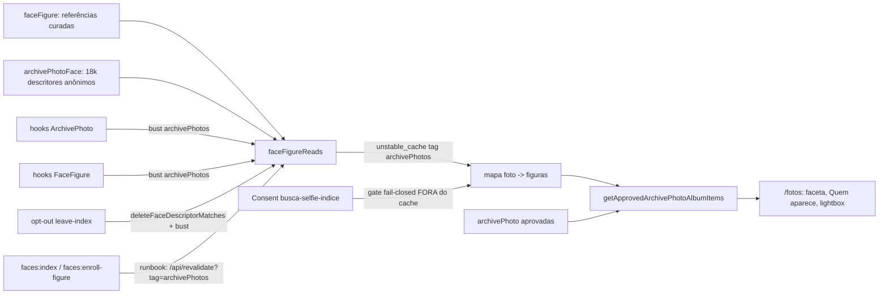

# Impl: C244 — Filtro "Pessoa pública" por reconhecimento facial no álbum

Status: aprovado (modo autônomo) — hard-stops registrados: migração de schema, contrato público, Consent/LGPD
Atualizado em: 2026-10-01
Issue: #1416
Intenção: docs/plans/album-pessoa-facial.md
Appetite restante: herdado (~2–3 dias eng + curadoria dos descritores + aval jurídico registrado). A derivação em leitura elimina o reprocessamento dos 18k rostos, então o appetite cabe com folga; nenhum corte de aceite.

## Leitura da intenção

- **Outcome:** a faceta `pessoa` do álbum `/fotos?pessoa=<slug>` passa a listar as fotos em que a figura pública realmente **aparece** (pelo índice facial do C240), não as fotos em que o nome foi escrito na ficha; "Quem aparece" no card/overlay mostra só figuras curadas reconhecidas; nenhuma superfície nomeia terceiros nem mostra score; sem Consent do aviso ou sem curadoria, a faceta fica vazia (fail-closed).
- **O que NÃO negociar:** identificação biométrica apenas do catálogo curado de figuras públicas, com aval jurídico registrado; nunca terceiros; opt-out ("Minha presença") e remoção de foto continuam; despublicar foto tira-a da faceta imediatamente; `?pessoa` continua sendo a chave da URL; Consent fail-closed por chave estável (`busca-selfie-indice`); `catalog.people` (texto) não governa mais o filtro.
- **O que reavaliar:** a "Direção no codebase" da intenção propõe estender `faces:index` para gravar o vínculo e criar um marker novo de revisão das figuras, com reprocessamento dos 18k rostos — a abordagem recomendada (A) substitui isso por **derivação em tempo de leitura** sobre o índice existente, sem tocar no lote e sem marker. Também caem: o "vínculo foto↔figura no lote" e qualquer uso de `publicFigureCatalog`/`resolvePublicFigureName` como origem da faceta.

## Abordagem recomendada

**Opções consideradas:** A (vínculo derivado em leitura + collection curada `faceFigure`) | B (vínculo materializado nas linhas do índice com marker de revisão e passe de rematch) | C (matching por request / uma query por figura / pgvector) | D (manter o texto como fonte e só anotar rostos).
**Recomendação:** A — porque reusa o índice e o cache do C240 como fonte única (o vínculo não pode divergir do índice), mantém as linhas `archivePhotoFace` anônimas, dispensa schema de vínculo/marker/reprocessamento, e o custo só aparece na revalidação da tag (não por request): no cenário-teto do catálogo (~58 figuras × ≤8 referências × ~18k descritores ≈ 8M distâncias de 128 floats ≈ 10⁹ operações, ordem de ~1–2 s por revalidação; com 1–3 referências por figura, bem menos). O resultado é cacheado em `unstable_cache` sem TTL, então o custo é pago uma vez por bust, nunca por visita; o `loadFaceDescriptorIndex` com TTL de 60 s absorve a releitura do índice.
**Rejeitadas:** B — acrescenta schema novo, marker de revisão das figuras, caminho de reprocessamento de 18k rostos e um segundo fluxo de purge/opt-out; C — a página é dinâmica (`searchParams`), o custo por request seria inútil; pgvector já foi rejeitado no C229 (Postgres vanilla); D — contradiz a decisão do dono (2026-10-01) registrada na intenção.

### Componentes / mudanças

- **`FaceFigure` (`src/collections/FaceFigure.ts`, novo)** — slug `faceFigure`, labels "Figura pública"/"Figuras públicas", `admin.group: 'Comunicação'`, `useAsTitle: 'name'`, `admin.description` declarando o aval jurídico e que cada referência é curada/auditável e nunca inclui terceiros. Access `payloadAdminOnly` nas 4 operações (precedentes: `src/collections/ArchivePhotoFace.ts:31-36`, `src/collections/Consent.ts:99-104`). Campos: `name` (text, required, unique), `slug` (text, required, unique, index; hook beforeValidate que aplica `slugify` — padrão `src/collections/Tag.ts:63-72` — e deriva de `name` quando vazio; é o valor de `?pessoa=<slug>`, origem pública), `fullName` (text opcional, proveniência), `active` (checkbox, default `true`, index), `references` array "Descritores de referência" (`maxRows: 8`) com `vector` (json, hidden, readOnly), `model` (text, readOnly), `source` (text "Origem", required), `addedAt` (date, readOnly). Hooks `afterChange`/`afterDelete` → `revalidateArchivePhotosListing()` (`src/utilities/documents.ts:57`), porque o mapa de matches é cacheado sob a tag `archivePhotos`. Registro em `src/payload.config.ts` (junto de `ArchivePhotoFace`, linha 143).
- **`src/lib/faceFigureCatalog.ts` (novo, puro/client-safe)** — tipos `FaceFigure`/`FaceFigureReference`/`FaceFigureMatch`/`PhotoFigureMatch`; filtra por `active === true` e por referência com `model === FACE_SEARCH_MODEL` (`src/lib/faceSearch.ts:24`) e `readFaceVector` válido (`faceSearch.ts:54`); `findFaceFigureMatches({ figures, descriptors, maxDistance = FACE_SEARCH_MAX_DISTANCE })` (`faceSearch.ts:31`) casa cada referência com `findFaceDescriptorPhotoIds` (`faceSearch.ts:96`) e devolve por figura `{ slug, name, photoIds }` — dedupe por foto, sem score/percentual/distância por shape, figuras ordenadas por slug, `photoIds` na ordem do índice; `groupFaceFigureMatchesByPhoto(matches)` (pivô puro) devolve `[{ photoId, figures: [{ slug, name }] }]` ordenado por `photoId` e figuras por slug. Sem I/O e sem `server-only` (unit-testável, como `archivePhotoPublicCatalog.ts`).
- **`src/utilities/faceIndex/faceFigureReads.ts` (novo, `server-only`)** — carrega figuras ativas (`payload.find` em `faceFigure`, `where active=true`, `select name/slug/references`, `overrideAccess: true` com a mesma justificativa de leitura anônima de `faceDescriptorReads.ts:14-25`) e reusa `loadFaceDescriptorIndex(payload)` (`faceDescriptorReads.ts:88`, cache in-process TTL 60 s já existente); aplica o matcher puro e o pivô. O núcleo vai em `unstable_cache(fn, ['archive-photo-figures'], { tags: [getCollectionListingTag('archivePhoto')] })` (`documents.ts:41`) e devolve estrutura serializável (`PhotoFigureMatch[]` — nunca `Map`). Exporta `loadApprovedPhotoFigureMap(payload)`: o **gate do Consent fica FORA do cache** — `getConsentByKey(payload, FACE_INDEX_CONSENT_KEY)` (`src/utilities/campaignConsent.ts:72`; chave `FACE_INDEX_CONSENT_KEY` em `src/lib/campaignConsentKeys.ts:44`) ausente → `[]` (sem nomes), e o provisionamento vale imediatamente; o núcleo computa mesmo sem Consent. Falha do núcleo (ex.: teto defensivo do índice) → `[]` (fail-closed; a faceta some, o álbum continua).
- **`src/utilities/archivePhotos/archivePhotoReads.ts`** — mantém `archivePhotoPublicSelect`, `findApprovedArchivePhotos`, `getCachedApprovedArchivePhotos` (`:39-55`), `getApprovedArchivePhotoItems` (`:58`), `getApprovedArchivePhotoById` (`:68`) e `hasPublishedArchivePhotos` (`:74`) **intactos e sem matching/Consent** — são o caminho quente do endpoint `POST /api/fotos/selfie` (`src/app/(frontend)/api/fotos/selfie/route.ts:106`) e da rota de mídia `/fotos/[id]/midia` (via `getApprovedArchivePhotoById` em `src/app/(frontend)/fotos/[id]/midia/route.ts:40`). Nova função `getApprovedArchivePhotoAlbumItems()`, usada **só** por `/fotos/page.tsx`: busca os docs crus no cache existente, faz o merge do mapa `photoId → [{ slug, name }]` no source antes de `toArchivePhotoPublicItem`. `generateMetadata` continua com `hasPublishedArchivePhotos`.
- **`src/lib/archivePhotoPublicCatalog.ts`** — remove o import de `resolvePublicFigureName` (`:22`) e a função `archivePhotoPublicPeople` (`:186-197`). `ArchivePhotoPublicItem.people` passa de `string[]` para `{ slug, name }[]` (tipo `ArchivePhotoPublicPerson` exportado); `ArchivePhotoPublicSource` ganha `figures?: readonly ArchivePhotoPublicPerson[] | null` (novo campo de merge, opcional). `toArchivePhotoPublicItem` (`:264`) deriva `people` de `record.figures` (dedupe por slug, ordem estável), **nunca mais de `catalog.people`** — que permanece no source apenas como conteúdo da ficha/`searchText`, com comentário explícito de que não governa o filtro. `archivePhotoAlbumFacets` (`:337`), `filterArchivePhotoAlbumItems` (`:415`) e `archivePhotoAlbumHeading` (`:441`) usam `item.people` diretamente; a chave `?pessoa=<slug>` não muda, e para os nomes do roster o slug continua `slugify(name)` (mesmos valores de URL de hoje).
- **Migration:** `pnpm migrate:create add_face_figure` (collection nova + tabela do array de referências), depois do rebase em `main`; `src/migrations/index.ts` entra no mesmo commit; `pnpm generate:types` atualiza `payload-types.ts` (commitado). Migration aditiva; nunca editar migrations antigas.
- **Access / Consent:** sem helper novo — `payloadAdminOnly` reusado (`src/utilities/campaignAccess.ts:18`); nenhuma chave de Consent nova; o gate público é `FACE_INDEX_CONSENT_KEY` (`busca-selfie-indice`), fail-closed, resolvido fora do cache.
- **Bust de cache:** `deleteFaceDescriptorMatches` (`faceDescriptorReads.ts:119`) passa a chamar `revalidateArchivePhotosListing()` logo após `invalidateFaceDescriptorIndex()` (o mapa curado é `unstable_cache` **sem TTL** — sem o bust ele ficaria stale indefinidamente); os int specs que tocam esse caminho já mockam `next/cache` (`tests/int/faceSearchApi.int.spec.ts:8-12`, `tests/int/faceDescriptorIndex.int.spec.ts:8-10`). O lote `faces:index` e o enrollment rodam fora do Next → bust no runbook via `POST /api/revalidate?tag=archivePhotos` (allowlist em `AGENTS-public.md:58`; precedente `scripts/publish-archive-photos.mjs:201`). Os hooks de `ArchivePhoto` (`src/collections/ArchivePhoto.ts:276-282`) e de `FaceFigure` cobrem edição de curadoria/ciclo de vida.
- **Consent (hard-stop registrado):** em `scripts/lib/faceConsentTexts.mjs` (parágrafos `:44-49`), o aviso hoje diz "sem qualquer identificação de quem aparece" e "nunca é usado para identificar, nomear ou listar terceiros" — com o C244 isso fica incorreto. Proposta: **substituir o parágrafo 2** (`:46`) e **inserir um parágrafo novo** depois dele:
  - Parágrafo 2 novo: "O índice serve para localizar fotos: encontrar as fotos da própria pessoa que faz a busca e alimentar o filtro "Pessoa pública" do álbum. Esse filtro identifica exclusivamente as figuras públicas do catálogo curado e aprovado do mandato (com aval jurídico registrado); qualquer rosto fora desse catálogo continua anônimo no índice, sem nome e sem vínculo com cadastro, e nunca é usado para identificar, nomear ou listar terceiros, nem cruza os dados biométricos com contatos, lideranças ou apoiadores."
  - Parágrafo novo: "O catálogo de figuras é curado e auditável: cada figura tem descritores de referência de retratos oficiais/arquivo do mandato, revisados por curadoria humana, e pode ser desativada a qualquer momento. A retirada continua valendo para qualquer pessoa: usa-se "Minha presença" para sair do índice, o canal do álbum para pedir a remoção de uma foto e o mesmo canal para retirar uma figura do catálogo."
  - A chave **não muda**; `pnpm seed:face-consents` recria/atualiza a linha por chave (`scripts/seed-face-consents.mjs:63-90`). O runbook tem o re-seed como **pré-condição antes de qualquer enrollment** (senão o aviso em produção fica desatualizado com a faceta no ar).
- **CLI de enrollment:** `scripts/enroll-face-figure.mjs` + parser/plano puro `scripts/lib/faceFigurePlan.mjs` + script `faces:enroll-figure` no `package.json` (padrão do `faces:index`, `package.json:42-44`: `cross-env NODE_OPTIONS="--no-deprecation --import=tsx/esm --import=./scripts/seed-loader.mjs" node ...`). Args: `--figure <slug>`, `--name "Nome"`, `--full-name`, `--image <path>` (repetível), `--replace`, `--apply`, `--out <dir>`, `--help`. Plan/dry-run default, sem engine e sem escrita; `--apply` exige `FACE_FIGURE_CONFIRM=1` (`assertWriteConfirm`, `scripts/lib/cli.mjs:312`) + `assertEnvironmentDatabaseTarget()` (`cli.mjs:238`), **sem exigir S3** (as imagens de referência são locais). Usa `createNodeFaceEngine` (`scripts/lib/faceEngine.mjs:26`) e `prepareFaceImage` de `faceDescriptorIndex.ts` (hoje privada em `:54` — **exportar**), e exige **exatamente 1 rosto por imagem** (0 ou >1 → recusa fail-closed registrada no recibo; o operador recorta). Cria a figura se não existir (nesse caso `--name` é obrigatório); `--replace` limpa as referências existentes; `--out` default `data/face` (gitignored, `.gitignore:93`); recibo JSON em `data/face/reports/` sem vetor/bytes; imprime a instrução de bust.
- **Seed do catálogo inicial:** `scripts/seed-face-figures.mjs` + `scripts/lib/faceFigureCatalogSeed.mjs` + script `seed:face-figures`. Idempotente por slug (cria sem referências; nunca atualiza linha existente), guard de escrita como `seed:face-consents` (`--apply` exige `FACE_FIGURE_SEED_CONFIRM=1` fora do dev local + `assertEnvironmentDatabaseTarget()`; default plan). Conteúdo: as 6 nomeadas da intenção — Jorge Solla; Lula (fullName "Luiz Inácio Lula da Silva"); Jerônimo (fullName "Jerônimo Rodrigues"); Geraldinho (fullName "Geraldo Júnior"); Wagner (fullName "Jaques Wagner"); Júlio Pinheiro — + os 53 do roster `src/lib/stateDeputyCatalog.ts`, com **dedupe por slug** (Júlio Pinheiro já está no roster; total 58 slugs únicos). Nome exibido = label público; o slug é `slugify(name)`.
- **UI:** Impeccable B herdada do C233; nenhum shell novo. A faceta `pessoa` continua a mesma UI (menus somem quando sem opções — comportamento atual). Única mudança de copy: em `ArchivePhotoNoResults` (`src/components/fotos/ArchivePhotoStates.tsx:32`), quando o filtro `pessoa` está ativo (derivável de `activeFilters`), o parágrafo passa a ser: "O filtro Pessoa pública mostra apenas figuras do catálogo curado do mandato, reconhecidas com aval jurídico — nunca terceiros. Tente outra pessoa ou volte a ver todas as fotos aprovadas do álbum." (sem o filtro, o texto atual permanece). É wiring de copy sobre o markup aprovado — **não é designer trigger**; nenhum elemento estrutural novo.
- **e2e manifest:** `src/utilities/faceIndex` (entrada C242, `scripts/lib/e2e-affected-manifest.mjs:246-255`) passa a `specs: ['frontendFotos', 'frontendFotosSelfie']` (o índice agora alimenta os dois specs); nova entrada `src/lib/faceFigureCatalog.ts` + `src/collections/FaceFigure.ts` → `['frontendFotos']`. `src/lib/archivePhotoPublicCatalog.ts` **já** casa o prefixo `src/lib/archivePhoto` da entrada C233 (`:227-239`) — sem entrada nova.
- **Docs:** `AGENTS-public.md` (contrato da faceta: fonte facial, gate por Consent, catálogo curado, sem terceiros); runbook `docs/ops/teqo-1313-deploy.md` §C244; changelog `docs/changelog/2026-10-02-c244.md`; nota "Implementação: docs/plans/album-pessoa-facial-impl.md" em `docs/plans/album-pessoa-facial.md`.

### Dados → forma (se aplicável)

N/A — nenhum número/score em nenhum estado; o resultado é a lista de fotos do C233. A mudança é de origem de dado e copy do estado vazio.

## Fases verificáveis

1. **Tracer / schema + contrato puro** (quota ~0,5 dia) — `FaceFigure.ts`, migration `add_face_figure` + `index.ts`, `generate:types`, `src/lib/faceFigureCatalog.ts` e `tests/unit/faceFigureCatalog.unit.spec.ts` (threshold/modelo/ativo/dedupe/ordenação/sem score/pivô). Verificação: `pnpm migrate` local e `pnpm gate:fast` verdes.
2. **Leitura pública e faceta** (quota ~1 dia) — `faceFigureReads.ts`, `getApprovedArchivePhotoAlbumItems` + wiring da página `/fotos`, mudança de tipo/derivação em `archivePhotoPublicCatalog.ts`, copy condicional em `ArchivePhotoNoResults`, atualização de `tests/unit/archivePhotoPublicCatalog.unit.spec.ts` (texto não cria faceta) e novo int spec de leitura (Consent fail-closed, figura inativa, purge, opt-out/bust). Verificação: `pnpm test:int` nos specs novos + `pnpm test:unit` verdes; conferência manual em dev com figura semeada.
3. **Curadoria (Consent + seeds + enrollment)** (quota ~1 dia) — parágrafos novos no aviso, `seed-face-figures` + manifest/pin, `faces:enroll-figure` + `faceFigurePlan.mjs` + unit do parser, export de `prepareFaceImage`, scripts no `package.json`. Verificação: dry-runs (`seed:face-consents`, `seed:face-figures`, `faces:enroll-figure`) imprimem o esperado; um enrollment local real (imagem de teste) grava referência e a faceta acende.
4. **e2e** (quota ~0,5 dia) — atualizar `tests/e2e/frontendFotos.e2e.spec.ts`: semear `faceFigure` + linhas `archivePhotoFace` que casam para o `?pessoa=rui-costa`, provar que nome só-texto NÃO cria faceta/card/overlay, atualizar asserções de `Jorge Solla` do card/overlay; manifest atualizado. Verificação: `pnpm test:e2e:affected` (ou os dois specs de fotos) verde.
5. **Docs + entrega** (quota ~0,5 dia) — runbook §C244, `AGENTS-public.md`, changelog, nota na intenção; `pnpm gate:fast`; push via `pnpm push`. O deploy de produção segue o runbook e é **hard-stop humano** (re-seed → seed → enrollment por figura → bust → conferência).

## Rabbit holes / Não escopo (engenharia)

- Materializar o vínculo (opção B), marker de revisão das figuras em `faces.checkedKey` e qualquer reprocessamento dos 18k rostos.
- pgvector/ANN/índice dedicado ou matching por request/por figura (opção C).
- Qualquer score, percentual, distância, ranking ou ordenação por confiança — nem em recibo de UI, nem em API.
- Tela nova de curadoria (upload/queue) no admin além do array da collection; bulk enrollment pela web.
- Guardar imagens de referência ou vetores no repo/S3 público; recibos com vetor/bytes.
- Usar `catalog.people`/`resolvePublicFigureName` como fallback ou fonte do filtro (decisão do dono); nomear qualquer pessoa fora do catálogo; API pública de reconhecimento; vídeo.
- Mexer em `searchText`/ficha (`catalog.people` continua conteúdo da Central) e no caminho quente do endpoint selfie/rota de mídia.
- Re-seed automático do Consent dentro do enrollment (o provisionamento é passo explícito do runbook).

## Riscos e mitigação

- **Falso positivo a 0.45 nomeando a figura errada:** sem score na UI; revisão por exceção no runbook (conferir o recibo e a faceta; desativar a figura ou remover a referência no admin, que busta a tag); referências curadas 1–8 por figura.
- **Aviso do Consent desatualizado em produção:** re-seed do `busca-selfie-indice` é pré-condição registrada ANTES de qualquer enrollment; passo 1 do runbook e conferência do texto na página `/fotos/encontre`.
- **Cache stale após CLI (lote/enrollment fora do Next):** bust obrigatório de `archivePhotos` no runbook; hooks de `ArchivePhoto`/`FaceFigure` cobrem o runtime; opt-out busta na função de delete.
- **Opt-out sem efeito na faceta:** o mapa é `unstable_cache` sem TTL — o `revalidateArchivePhotosListing()` em `deleteFaceDescriptorMatches` é o que garante efeito imediato; int test pina o `revalidateTag` chamado.
- **URL pública `?pessoa`:** a chave não muda e o slug segue `slugify(name)`; o seed usa o label público do roster (mesmos slugs de hoje). Teste unit pin do catálogo de seed (58 únicos, sem colisão).
- **Índice/DB indisponível:** `loadApprovedPhotoFigureMap` falha fechado (`[]`) — a faceta some, o álbum e a rota quente seguem funcionando; Consent ausente idem.
- **Privacidade das referências:** imagens de referência vivem fora do repo (gitignored, homeserver, montadas read-only no maintenance); recibos sem vetor/bytes; acesso admin-only; nada muda no gate do C240.
- **Contrato do catálogo público quebra em teste/central:** `people` vira `{slug,name}[]`; card/lightbox usam `peopleLabel`, selfie usa `FaceSearchPhotoView` (sem `people`) — os 3 consumidores foram verificados; unit/int cobrem.
- **e2e frágil por seed REST:** criar figuras/linhas no `beforeAll` (antes da primeira visita que cacheia o mapa) e limpar em `afterAll` (figuras criadas + fotos, cujo FK cascateia as linhas de rosto).

## Aceite de engenharia

- [ ] Aceite de produto da intenção ainda coberto: faceta por rosto, "Quem aparece" só curado, sem terceiros, sem score, texto vazio honesto, kill switch/despublicação/opt-out imediatos.
- [ ] Invariantes AGENTS/engineering-standards: identificadores em inglês e copy pt-BR; `src/lib/` puro/client-safe e `src/utilities/` com `server-only`; Consent fail-closed por chave estável; acesso admin-only com `payloadAdminOnly`; Local API com `overrideAccess` justificado nos reads anônimos; hot path do endpoint selfie/mídia intocado; sem collection de pessoa paralela (FaceFigure é catálogo de figuras, não cadastro; sem `Contact`).
- [ ] Testes de domínio previstos: unit do matcher/pivô e do parser/plano; unit do catálogo público (texto não governa); int do read do álbum (Consent fail-closed, figura inativa, purge, opt-out/bust) e do access lockdown (`faceFigure` no `it.each` de PII/legal, `tests/int/collectionAccessLockdown.int.spec.ts:197`); e2e do `frontendFotos` com a faceta facial e o caso negativo do texto.
- [ ] Migration aditiva `add_face_figure` + `index.ts` + `payload-types.ts` commitados; `pnpm migrate` local limpo.
- [ ] Sem mudança no `seed:minimal` (FaceFigure não é boot data e nenhuma chave de Consent nova entra no manifest).
- [ ] Docs: `AGENTS-public.md`, runbook §C244, changelog `2026-10-01-c244.md`, nota na intenção.

## Execução (checklist)

- [ ] Rebase em `main` antes de `pnpm migrate:create add_face_figure`; rodar `pnpm migrate` e `pnpm generate:types`; commitar migration (`ts`+`json`+`index.ts`) e `payload-types.ts`.
- [ ] Criar `FaceFigure.ts`, registrar no `payload.config.ts` e escrever o matcher/pivô puro com unit.
- [ ] Exportar `prepareFaceImage` de `faceDescriptorIndex.ts` e adicionar o bust do opt-out em `deleteFaceDescriptorMatches`.
- [ ] Criar `faceFigureReads.ts` + `getApprovedArchivePhotoAlbumItems` + wiring da página + tipo `people` + copy do estado vazio.
- [ ] Reescrever os testes unit afetados e criar os int specs; adicionar `faceFigure` ao lockdown de access.
- [ ] Atualizar o aviso em `faceConsentTexts.mjs` e o pin do unit de textos; criar `seed-face-figures` + manifest e `faces:enroll-figure` + parser; scripts no `package.json`.
- [ ] Atualizar `frontendFotos.e2e.spec.ts` e `scripts/lib/e2e-affected-manifest.mjs`.
- [ ] Atualizar `AGENTS-public.md`, runbook §C244 (ordem: re-seed do aviso → `seed:face-figures` → `faces:enroll-figure` por figura com canário → bust de `archivePhotos` → conferência → revisão de falsos positivos → rollback por desativação), changelog e nota na intenção.
- [ ] `pnpm gate:fast`; e2e afetado local; `pnpm push`; PR com a linha de hard-stops (migração de schema, contrato público, Consent/LGPD) e o deploy de produção executado pelo runbook com aprovação humana.

## Verificação de fatos (correções do briefing)

1. **Consent NÃO é versionado pelo Payload.** `src/collections/Consent.ts` não tem `versions` (só Petition/Post/VotePledge têm); `seed:face-consents` atualiza a linha existente in place (`scripts/seed-face-consents.mjs:63-90`), e a versão canônica do texto é o git (`faceConsentTexts.mjs`). O re-seed, portanto, sobrescreve o texto atual — comportamento suficiente e registrado no runbook.
2. **`src/lib/archivePhotoPublicCatalog.ts` já tem entry no manifest:** o prefixo `src/lib/archivePhoto` da entrada C233 (`e2e-affected-manifest.mjs:227-239`) casa o arquivo e mapeia `['frontendFotos','frontendFotosSelfie']`; só `src/lib/faceFigureCatalog.ts` e `src/collections/FaceFigure.ts` precisam de entry nova, e a entrada de `src/utilities/faceIndex` precisa ganhar `frontendFotos`.
3. **6 nomeadas + 53 do roster têm interseção** (Júlio Pinheiro está no roster como "Julio Pinheiro"): o seed deduplica por slug e cria **58** figuras únicas, não 59; o teste unit pin isso.
4. **O e2e depende do texto em 3 pontos, não só no `?pessoa=rui-costa`:** `tests/e2e/frontendFotos.e2e.spec.ts:219` (card mostra "Jorge Solla"), `:258-261` (filtro por `rui-costa`) e `:288` (overlay mostra "Jorge Solla") — os três passam a usar figura/rosto, e o texto vira o caso negativo (nome no `catalog.people` sem linha de rosto não cria faceta nem linha "Quem aparece").
5. **`prepareFaceImage` é privada** em `src/utilities/faceIndex/faceDescriptorIndex.ts:54` — confirmado que precisa ser exportada para o CLI.
6. **Caminho quente confirmado:** `getApprovedArchivePhotoItems` alimenta o endpoint selfie (`api/fotos/selfie/route.ts:106`) e, via `getApprovedArchivePhotoById` (`archivePhotoReads.ts:68`), a rota de mídia (`fotos/[id]/midia/route.ts:40`); `hasPublishedArchivePhotos` tem 6 call sites (home, cards, conteúdos, jingles, `[type]`, footer). Por isso a função com figuras é nova e exclusiva da página.
7. **`faces.checkedKey` continua sendo só o modelo**; com a abordagem A não há marker novo nem reprocessamento dos 18k rostos — a hipótese da intenção ("o índice atual precisa ser reprocessado ao introduzir figuras") fica superada.
8. **`unstable_cache` sem `revalidate` não expira sozinho**, então o bust no opt-out/CLI é obrigatório (não apenas "além do cache in-process"), como já previsto no briefing.
9. **`seed:minimal` não muda:** `scripts/lib/seed-minimal-manifest.mjs:13-19` lista só as 4 chaves fail-closed clássicas; nem as chaves do C242 entram, e `faceFigure` não é boot data.

## Débitos triados (capture-review-debts)

Achados do /simplify: 12 já resolvidos no próprio diff (bust do runbook, ordem
do `down()` da migration, ordem do seed e2e, dedupe do enrollment, regex de slug,
tipagem de `toApprovedItems`, `maxRows` 1–3, fallback do `die`, `references: []`,
`readOnly` redundante, "53" mágico, retorno não usado) e 5 descartados (YAGNI/
acoplamento/desenho). **Defer com gatilho:** o `catch` fail-closed de
`loadApprovedPhotoFigureMap` engole qualquer erro — se houver um incidente de
álbum vazio em produção, adicionar log rate-limited/observabilidade. Nenhum
débito `expensive_lock` — sem Issues novas.

## Self-score (decision-quality)

5/5.

1. Decisões caras têm rejeitadas: collection nova, contrato público do slug, origem do vínculo, cache/Consent e bust estão decididos com A/B/C/D e rejeitadas registradas.
2. Cabe no appetite: derivação em leitura reusa índice/cache do C240 e dispensa reprocessamento; o custo é ~1 collection + 1 migration + leitura + 2 CLIs.
3. Rabbit holes nomeados: materialização, marker, pgvector, score, tela de curadoria, referências no repo.
4. Depth check: reusa `faceEuclideanDistance`/`findFaceDescriptorPhotoIds`/`loadFaceDescriptorIndex`/`unstable_cache`/`getConsentByKey`/`revalidateArchivePhotosListing`/`payloadAdminOnly`/padrões de CLI e seed; nenhum pass-through novo.
5. Outcome de produto preservado: a intenção não foi reescrita; muda só a engenharia da origem do dado, com o aceite e os guardrails intactos.
