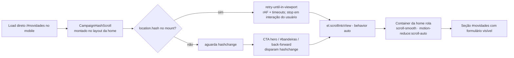

# Impl: Âncora #novidades quebra no mobile — deep link não leva ao formulário

Status: rascunho
Atualizado em: 2026-08-23
Issue: #780
Intenção: docs/plans/ancora-novidades-mobile.md
Appetite restante: herdado — fix contido em 1 componente cliente novo + 1 spec; sem corte

## Leitura da intenção

- **Outcome:** abrir `jorgesolla1313.com.br/#novidades` no celular leva o visitante à seção do formulário de captura; o CTA "Receba novidades" do hero rola até a seção no mobile; desktop sem regressão; respeita `prefers-reduced-motion`. Cada visita que não chega ao formulário é audiência perdida na janela eleitoral (tráfego orgânico/pago/WhatsApp apontará para essa URL).
- **O que NÃO negociar:** contrato de URL pública `#novidades`; layout/visual da home (anti-goal); modelo de scroll das rotas `(frontend)` (container interno com `overflow-hidden` no body — fora de escopo removê-lo); fluxo do formulário S9 (consent fail-closed, transação, copy); invariantes AGENTS (identificadores em inglês, copy pt-BR, sem abstração <3 call sites, direção lib → utilities → components → app).
- **O que reavaliar:** (a) a hipótese de que o click no CTA é interceptado pelo Next e "não aterrissa" — o e2e atual prova que no desktop o `<a href="#novidades">` puro JÁ funciona (CampaignHero.tsx:104), então o click nativo + `hashchange` é o caminho, não uma interceptação a combater; (b) a hipótese de que o problema é só o load direto — no mobile o colapso é o `h-dvh` (URL bar) + imagens `loading="eager"` do hero deslocando o layout após o scroll inicial do browser; (c) Opção A (rolar à seção) vs B (rolar ao formulário) — mantida A (a seção é o contrato publicado; o formulário fica na mesma tela).

## Abordagem recomendada

**Opções consideradas:** A | B | C | D | E
**Recomendação:** A — um componente cliente `CampaignHashScroll` (renderiza `null`) montado dentro do container de scroll do layout da home; no mount com hash inicial faz retry-until-in-viewport (o layout móvel assenta depois: colapso do `h-dvh` + imagens `eager` do hero); um listener de `hashchange` cobre o CTA do hero, `#bandeiras` e back/forward sem tocar em `CampaignHero` (que continua `<a href="#novidades">` puro, server component). O scroll usa `el.scrollIntoView()` sem `behavior` — `behavior: auto` herda o `scroll-behavior` do container, então `scroll-smooth` rege no normal e `motion-reduce:scroll-auto` já respeita reduced-motion (0 JS extra de a11y). É o mesmo mecanismo que já funciona no desktop (scroll nativo do fragmento) e o mesmo padrão de `scrollIntoView` de CampaignStorySection:16 com o defer de rAF de CampaignAISidebarShell:96 — sem mecanismo paralelo: o componente é o dono único da preocupação.
**Rejeitadas:**

- **B (onClick + scrollIntoView no CTA do hero, padrão CampaignStorySection):** cobre o clique mas NÃO cobre o deep link de load direto (aceite 1 falha) — exigiria um segundo mecanismo para o mount; e `CampaignHero` é server component, o onClick forçaria torná-lo cliente. O `hashchange` cobre o clique com zero mudança no hero.
- **C (mudar o modelo de scroll global — tirar `overflow-hidden` do body, scroll no document):** fora de escopo declarado da intenção; afeta TODAS as rotas `(frontend)`; o container interno é o modelo histórico escolhido para o comportamento mobile (dvh/URL bar) — reverter é arriscado na janela eleitoral.
- **D (solução só CSS — `scroll-padding`/`scroll-behavior` no html/body):** o window/document não rola (body `overflow-hidden`, layout.tsx:82); CSS de âncora nativa não aterrissa no container aninhado nem resolve o deslocamento pós-load das imagens.
- **E (Next `<Link>`/`router.push` com hash):** mudaria o CTA para cliente; `router.push` com hash no App Router tem histórico de não rolar containers aninhados (o Next atua no document); troca um mecanismo que parcialmente funciona por outro com o mesmo risco.

### Componentes / mudanças

- **NOVO `CampaignHashScroll`** (`src/components/CampaignHashScroll.tsx`): `'use client'`, renderiza `null`. Responsabilidades: (1) deep link no mount — resolve o alvo por `getElementById(hash)` e agenda tentativas (rAF + timeouts progressivos, parando quando o alvo entra no viewport ou na primeira interação de scroll/wheel/touch do usuário — one-time listeners); (2) `hashchange` → resolve e rola o alvo (cobre CTA do hero, `#bandeiras` do footer/form, back/forward). Sempre `el.scrollIntoView()` sem `behavior` (herda `scroll-smooth`/`motion-reduce:scroll-auto` do container). `scroll-mt-4` existente da seção (CampaignNewsletterSection.tsx:17) já serve de offset — `scrollIntoView` respeita `scroll-margin`. Depth check: não existe módulo de scroll-por-hash no repo (achado 5) — o componente é o dono; lógica não vai para lib/hook (1 call site).
- **`src/app/(frontend)/(home)/layout.tsx`**: monta `<CampaignHashScroll />` como filho do div de scroll (linha 17–23); nenhuma mudança no modelo de scroll nem nas classes.
- **`src/components/CampaignHero.tsx`**: sem mudança — CTA continua `<a href="#novidades">` puro (server component); o `hashchange` disparado pelo clique nativo aciona o scroll.
- **`tests/e2e/campaignNewsletter.e2e.spec.ts`**: novo describe mobile + testes de load direto e reduced-motion (detalhe em "Fases").
- **Migration:** sem migration (nenhuma mudança de schema).
- **Access / Consent:** sem mudança — fluxo S9 intacto (o formulário nem é tocado).
- **UI:** sem mudança visual (anti-goal da intenção); `scroll-mt-4` existente faz o papel de offset.

### Dados → forma (se aplicável)

Sem dados novos; a única "forma" é o **alvo do scroll** (pergunta 3 de data-presentation aplicada à âncora): **Opção A (seção `#novidades`)** — é o contrato de URL publicado e mantido no aceite; o heading dá contexto de onde o visitante chegou e o formulário começa na mesma tela (a seção tem heading + form, ~um viewport de 844px). **Rejeitada B (formulário interno):** id interno de formulário não é contrato público; rolar direto ao form perderia o contexto do heading; e o aceite diz "a seção do formulário". `block: 'start'` (default) com o `scroll-mt-4` existente, não `center` (o `center` de CampaignStorySection serve ao vídeo, não a uma seção de captura).

## Fases verificáveis

1. **Tracer (deep link no mount)** — criar `CampaignHashScroll` com o caminho do hash inicial (retry-until-in-viewport mínimo: rAF + 2–3 timeouts), montar no `(home)/layout.tsx`. Verificação manual em dev mobile (devtools iPhone, `/#novidades`) + desktop. Gate: `pnpm lint` + `pnpm typecheck`.
2. **Interação + robustez** — listener `hashchange` (CTA mobile/desktop, `#bandeiras`, back/forward) e stop em interação do usuário. Verificação manual: clique no CTA mobile; voltar no histórico. Gate: `pnpm lint` + `pnpm typecheck`.
3. **E2E + gates** — no `campaignNewsletter.e2e.spec.ts`: describe mobile com `test.use({ viewport: { width: 390, height: 844 } })` (padrão campaignHomeActions:149) com (a) load direto `/?e2e=<suffix>#novidades` → `expect(section).toBeInViewport()`; (b) CTA hero → URL `/#novidades` → seção no viewport; (c) mesmo teste (a) com `page.emulateMedia({ reducedMotion: 'reduce' })`; e no describe desktop atual, (d) load direto `/#novidades` (regressão de cobertura hoje inexistente). Manter o teste existente do CTA desktop intacto. Rodar `pnpm test:e2e campaignNewsletter --project=campaign` e a suíte desktop; fechar com `pnpm gate:fast`; push via `pnpm push`.

## Rabbit holes / Não escopo (engenharia)

- Não criar utility/lib/hook genérico de hash-scroll (1 call site — Depth check).
- Não tocar em `#bandeiras`/`#formulario`/`#detalhes`: o `hashchange` genérico os cobre de graça na home, mas sem teste dedicado — fora do pedido.
- Não simular collapse de URL bar no e2e (comportamento real de browser, indeterminístico) — o viewport mobile pinna o contrato; o colapso é mitigado pelo retry, não testado.
- Não mudar `CampaignHero`, `CampaignNewsletterForm`/`CampaignNewsletterSection`, footer nem outras rotas `(frontend)`.
- Não mexer no modelo de scroll global (`overflow-hidden` do body).

## Riscos e mitigação

- **Next interceptar o clique em âncora pura e não disparar `hashchange`** (comportamento version-dependent do App Router): o e2e do CTA mobile+desktop pinna o contrato; se falhar, estender o MESMO componente com um listener de click em `a[href^="#"]` (sem mecanismo paralelo — continua um dono).
- **Retry loop brigar com o scroll do usuário** (visitante começa a rolar durante o deep link): stop em scroll/wheel/touchstart (one-time) + teto de tentativas — o retry nunca luta com o usuário.
- **Flakiness de timing no e2e**: `toBeInViewport` auto-retenta e o retry do componente torna o aterrissar determinístico (não depende de um único timeout).
- **Imagens `eager` do hero terminarem de carregar depois do scroll inicial**: coberto pelo retry-until-in-viewport (re-tenta após os shifts de layout, incluindo o do `h-dvh`).
- **Regressão desktop do CTA**: o teste existente permanece na suíte; o novo teste de load direto desktop cobre o caminho que hoje não tem nenhuma cobertura.

## Aceite de engenharia

- [ ] Aceite de produto da intenção ainda coberto: deep link `/#novidades` no mobile leva à seção do formulário; CTA do hero no mobile rola até a seção; desktop sem regressão; `prefers-reduced-motion` respeitado (via `motion-reduce:scroll-auto` herdado + e2e com `emulateMedia`)
- [ ] Invariantes AGENTS/engineering-standards: identificadores em inglês; copy pt-BR intocada; sem abstração <3 call sites (1 componente, 1 mount); direção lib → utilities → components → app (componente em `src/components`, montado no app)
- [ ] Testes de domínio previstos: e2e mobile (load direto + CTA + reduced-motion) e desktop (load direto novo + CTA existente); sem unit/int novos — nenhum access/write path muda

---

### Self-score decision-quality: 5/5

1. **Decisões caras têm rejeitadas?** Sim — abordagem (A–E com motivo por rejeitada), alvo de scroll (A vs B) e o não-tocar em `CampaignHero`/modelo global estão documentados com porquês.
2. **Abordagem cabe no appetite?** Sim — 1 componente novo (renderiza null, ~40 linhas), 1 linha no layout, 1 spec: dentro do appetite herdado da S12, sem corte.
3. **Rabbit holes nomeados?** Sim — lib/hook genérico, âncoras fora do pedido, simulação de URL bar, modelo de scroll global, formulário S9.
4. **Depth check?** Sim — reusa o padrão `scrollIntoView` (CampaignStorySection:16), o defer rAF (CampaignAISidebarShell:96), o `scroll-mt-4` existente e o padrão de viewport mobile dos e2e (campaignHomeActions:149); não cria utility nova para 1 call site.
5. **Intenção preservada?** Sim — o aceite de produto (deep link mobile → seção, CTA → seção, desktop ok, reduced-motion) permanece intacto; a engenharia só entrega o scroll no container dono, sem reescrever layout, formulário ou modelo de scroll.

---

## Débitos deferidos (triage do /simplify, 2026-08-23)

- **Duplicação de asserções de âncora entre specs** (teste mobile CTA vs `frontend.e2e.spec.ts`): defer — absorver como variação de viewport quando o `frontend.e2e.spec.ts` ou um teste de âncora for mexido.
- **`[type]`/`artigos` herdam o modelo de scroll que causou o S12**: defer — gatilho: adicionar âncora in-page nesses layouts (nota de 1 linha já no JSDoc do `CampaignHashScroll`).
- **Retry fixo 5×150ms é premissa não observada**: defer — gatilho: hero ganhar imagens não-eager / regressão de CLS observada no deep link.
- **Teste reduced-motion com asserção fraca**: defer — mesclar com o item da duplicação de spec se um dia registrar.
- **Pin e2e do `#bandeiras`/back-forward**: descartado — decisão travada no impl plan (fora do escopo do fix contido).
