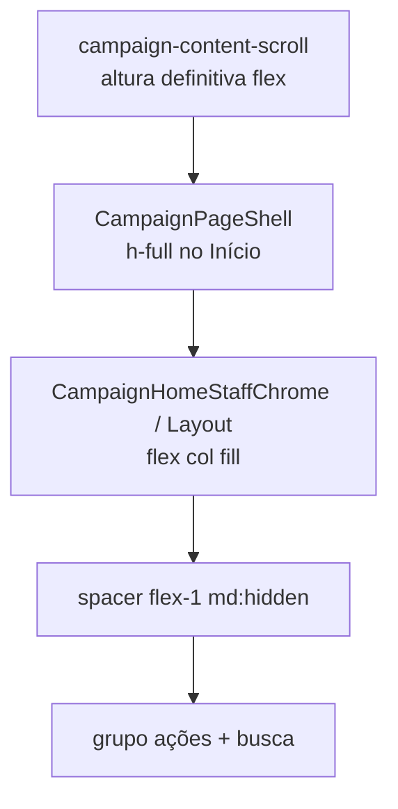

# Ancorar busca + ações do Início no limite inferior (mobile)

Status: rascunho
Atualizado em: 2026-07-29
Item do roadmap: [docs/roadmap.md](../roadmap.md) (Trilha B — **B65**; follow-up do chassis UX-1 / B46)
Impeccable: B — encaixe de layout em `CampaignHomeLayout` / shell do Início sob tema `campaign`
Appetite: ~0,25–0,5 dia eng; CSS/altura do chrome do Início; sem migration
Responsável: —

## Design (Impeccable)

Âncoras: `PRODUCT.md` (Clarity under pressure; Feel the action; alvos de toque no campo) / `DESIGN.md` · primitivo **B46** + busca **B47** · tema `data-theme='campaign'`.

Na implementação (`implement-roadmap-item`): craft compacto → critique → polish.

Brief compacto:

- **Persona / contexto:** CG/assessor no celular — polegar na metade inferior; o conjunto busca + strip de ações precisa estar no limite inferior do viewport útil (acima da bottom nav), não flutuando no meio/topo porque a coluna não preenche a altura.
- **Job principal:** alcançar ações e busca sem alongar o polegar; em `md+` manter o layout atual (busca → ações no topo).
- **Estratégia de cor:** Restrained — sem mudança visual além de posição.
- **Edit where you see:** não — chrome de launcher.
- **Anti-goals:** `fixed`/`sticky` que tapa a bottom nav ou o Sheet da sidebar; misturar viewport (`md`) com pointer; reabrir ordem ações↔busca do B46/B47; redesenhar `CampaignPageShell` global.

## Dados → decisão → apresentação

Dados: N/A — posicionamento de chrome; sem KPI/série.

## Contexto

**B46 ✓** entregou `CampaignHomeLayout` com spacer `flex-1` (`md:hidden`) + `order-*` (mobile: ações → busca; `md+`: busca → ações) e `CampaignPageShell` com `min-h-full`. **B47 ✓** pluga a busca no mesmo layout e esconde spacer/strip no modo focado.

**Pedido de produto (2026-07-29):** o conjunto barra de busca + lista de ações deve ficar alinhado ao **limite inferior** no mobile; tablet/desktop permanece como está.

**Por que B46 não teve sucesso:** o spacer `flex-1` só empurra o dock se o flex container tiver **altura definida maior que o conteúdo**. A cadeia atual é:

1. `data-slot="campaign-content-scroll"` — `min-h-0 flex-1 overflow-y-auto` + `pb-24` (reserva da bottom nav) em [`layout.tsx`](<../../src/app/(campaign)/campanha/(app)/layout.tsx>).
2. `CampaignPageShell` — `min-h-full` (percentual).
3. `CampaignHomeLayout` — `min-h-full` + spacer.

Em scrollport com altura definida pelo flex do `SidebarInset`, filhos com só `min-h-full` / `%` frequentemente **não** herdam a altura do viewport visível (altura do containing block ainda “depende do conteúdo” para resolução de `%`). Resultado: spacer colapsa → ações + busca ficam no topo do fluxo, não no limite inferior. O as-built de B46 resolveu a **ordem**, não a **âncora**.

## Objetivos

- No viewport **&lt; `md`**, com Início **não** focado (query B47 inativa): o **grupo** strip de ações + barra de busca fica colado ao limite inferior do conteúdo útil (acima da bottom nav / `pb-24` do scroll), sem gap morto entre o grupo e esse limite.
- Em **`md+`**: comportamento visual inalterado (busca acima das ações, no topo do conteúdo).
- Modo focado **B47/B66** intacto: spacer/strip ocultos; input sobe; resultados abaixo. **B66** (quando landar) dispara a limpeza no **focus** e anima a retração — este item só ancora o dock no idle.
- Leader (só strip, sem busca) também ancora a strip no inferior no mobile.
- Sem migration / collection / Consent / server action / mudança de URL.
- Pin em unit (cadeia de classes / presença do dock) + checklist visual mobile (viewport ~390) no e2e existente ou asserção de layout leve se couber sem flake.

## Decisões travadas

- **Corrigir a cadeia de altura no chrome do Início — não inventar overlay `fixed`.** Opções rejeitadas: A) `position: fixed; bottom: …` para o dock (compete com `CampaignBottomNav`, Sheet, teclado virtual, safe-area — B46 já rejeitou); B) `sticky bottom` sem preencher a coluna (ainda deixa o bloco no topo do fluxo quando o conteúdo é curto). **Escolhido:** fazer o shell do Início **preencher o scrollport** (`h-full` / flex fill na cadeia local) e ancorar o grupo com spacer `flex-1` **ou** `mt-auto` no wrapper do dock — o que o craft medir como estável. Escopo = Início (`page.tsx` + `CampaignHomeLayout` / `CampaignHomeStaffChrome`), não o scroll global de todas as rotas.
- **Breakpoint continua viewport `md`, não pointer** (herda B46). **Rejeitado:** `pointer-coarse` → bottom.
- **Ordem relativa B46/B47 intacta** (mobile: ações → busca; `md+`: busca → ações). Este item só ancora o **conjunto**. **Rejeitado:** inverter ordem neste slice sem pedido novo.
- **Âncora acima da bottom nav** — respeitar `pb-24` + `env(safe-area-inset-bottom)` já no nav; não cobrir a barra. **Rejeitado:** reduzir `pb-24` “para colar mais” sem medir o `min-h-12` + label da bottom nav.
- **i18n:** ids/slots em inglês (`home-dock`, `home-thumb-spacer`, …); copy intacta.

## Questões em aberto

- **`h-full` na cadeia vs `min-h-[calc(100dvh-…)]` no layout do Início?** **Opções:** A) `h-full`/`min-h-0`/`flex-1` do scrollport → shell → chrome → layout (puro flex) | B) `min-h` com `calc(100dvh − header − bottom-nav)` no layout | C) `dvh` só no spacer. **Recomendação:** **A** — a altura do scroll já é definitiva via `h-svh` + flex no `SidebarInset`; propaga sem hardcodar header/nav. B/C quebram com teclado virtual / mudança de chrome. Se A falhar num browser alvo, cair para B só no Início com constantes nomeadas ao lado do `pb-24`. _(assumido — validar no craft)_

## Abordagem proposta

Componentes:

- **`CampaignHomeLayout`** (`src/components/campaign/dashboard/CampaignHomeLayout.tsx`): garantir fill no mobile (`h-full` / `min-h-0` + flex); manter spacer; opcional wrapper `data-slot="home-dock"` em volta de actions+search com `mt-auto` **só se** o spacer sozinho continuar frágil após a cadeia de altura — depth check: um mecanismo, não dois.
- **`CampaignHomeStaffChrome`** / **`page.tsx`**: propagar `h-full`/`min-h-full` no shell do Início (`CampaignPageShell className`) para o fill chegar no layout; não alterar `gap-8` do shell nas outras rotas.
- **`campaign-content-scroll`:** só tocar se inevitável (ex. `flex flex-col` + filho Início `flex-1`) — e **somente** com guard que não quebre listas longas (ou limitar a classe ao Início via wrapper na page, preferível).
- **Testes:** estender `tests/unit/campaignHomeLayout.unit.spec.ts` (cadeia / dock / focused esconde spacer); smoke visual ou asserção de geometria no e2e do Início se estável.
- **Migration:** Sem migration, sem collection, sem server action.

## Dependências

- Dura de código: **B46 ✓** + **B47 ✓** (layout e slots existem). Nenhuma seta dura de item aberto.
- Soft: **B58** (polimento visual da strip — independente da âncora); **B56** (resumo no topo — quando landar, o fill deve empurrar o dock, não o resumo, para baixo: spacer entre resumo e dock); **B48 ✓** (hits no modo focado — âncora só no modo idle).

## Não escopo

- Polimento de rótulos/heading/scrollbar da strip → **B58**.
- Resultados / grid da busca → **B48–B54**.
- Wizards → **B59+**.
- Redesign da bottom nav ou do `pb-24` global.
- Inversão da ordem ações↔busca.

## Rabbit holes

- **`100dvh` / teclado virtual iOS.** Se alguém “só completar” com calc de viewport: o dock sobe por cima do teclado ou deixa buraco. **Mitigação:** preferir altura do scrollport flex; não amarrar ao `dvh` na v1.
- **Tornar `campaign-content-scroll` `display:flex` em todas as rotas.** Listas longas + `flex-1` em filhos errados quebram scroll. **Mitigação:** fill só no subtree do Início.
- **Reabrir B46 como reopen no roadmap.** **Mitigação:** item novo **B65** com diagnóstico; B46 permanece ✓ (ordem/slots).

## Adiado com gatilho

- **Ajuste fino do `pb-24` vs altura real da bottom nav.** Revisitar se, após o dock ancorar, ainda sobrar gap &gt;~8 px ou colisão com a nav em device real (medir `CampaignBottomNav` + safe-area).
- **Dock quando B56 colocar resumo no topo.** Revisitar no craft do B56: spacer entre briefing e dock (não entre header e briefing).

## Referências

- `docs/roadmap.md` (B46 ✓, B47 ✓, B65)
- [posicao-botoes-acao-inicio-thumb-zone.md](posicao-botoes-acao-inicio-thumb-zone.md) — as-built que não ancorou
- [busca-global-inicio-input.md](busca-global-inicio-input.md) — modo focado / slots
- `src/components/campaign/dashboard/CampaignHomeLayout.tsx`
- `src/components/campaign/dashboard/CampaignHomeStaffChrome.tsx`
- `src/app/(campaign)/campanha/(app)/page.tsx`
- `src/app/(campaign)/campanha/(app)/layout.tsx` (`campaign-content-scroll`, `pb-24`, `CampaignBottomNav`)
- `src/components/campaign/shell/CampaignPageShell.tsx`
- `tests/unit/campaignHomeLayout.unit.spec.ts`
- `PRODUCT.md` / `DESIGN.md` — Field Desk / Clarity under pressure
- AGENTS.md — naming; Feel the action
