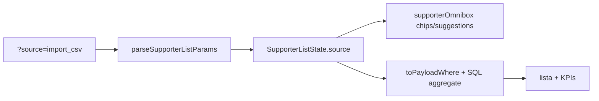

# Impl: Apoiadores — filtro por fonte na omnibox

Status: aprovado
Atualizado em: 2026-08-02
Issue: #309
Intenção: docs/plans/apoiadores-omnibox-fonte.md
Appetite restante: herdado (~0,5 dia)

## Leitura da intenção

- **Outcome:** Staff filtra `/campanha/apoiadores` por **fonte de cadastro** (enum existente) via omnibox — chip, sugestões com rótulos pt-BR, KPIs refletem o recorte.
- **O que NÃO negociar:** exclusivo (um valor por vez, como intenção/cidade/município); sem filtro por lote/importador; leader lockdown inalterado; Consent/LGPD inalterado.
- **O que reavaliar:** hipótese cita `supporterPageData` — filtro é puramente URL + where-builder; page data não precisa mudar além de já consumir `SupporterListState`.

## Abordagem recomendada

**Opções consideradas:**
- A) Estender `SupporterListState` + omnibox adapter (padrão B128)
- B) Filtro só na UI sem URL (rejeitado — quebra compartilhamento/deep-link)
- C) Multi-select OR de fontes (rejeitado — produto assume exclusivo)

**Recomendação:** A — mesma máquina de intenção de voto: param `source`, type guard, chip, seeds estáticos de `supporterSourceLabels`, toggle exclusivo.

**Rejeitadas:** B (sem URL), C (OR multi-fonte).

### Componentes / mudanças

- **`isSupporterSource`** (`src/lib/schemas/supporter.ts`): guard do enum, espelho de `isSupporterVoteIntention`.
- **`supporterUi.ts`**: `source` em state, parse/serialize, param allowlist.
- **`supporterListFilters.ts` + `supporterListSqlFilters.ts`**: `source` no where Payload e SQL dos KPIs.
- **`supporterOmnibox.ts`**: grupo Fonte, chip, apply/remove/clear.
- **`SupporterFilters.tsx`**: placeholder menciona fonte.
- **Migration:** sem migration (campo já existe).
- **Access / Consent:** inalterado — filtro só restringe linhas já legíveis.
- **UI:** Impeccable B — encaixe na omnibox existente; sem novo componente.

### Dados → forma

- Filtro sobre lista já carregada; KPIs via aggregate existente — só adicionar condição `source`.

## Fases verificáveis

1. **Schema/server** — guard, parse, where, SQL + testes unit/int
2. **UI** — omnibox seeds/chips + placeholder
3. **Gates** — `pnpm gate:fast`; push via `pnpm push`

## Rabbit holes / Não escopo (engenharia)

- Filtro por lote CSV / `createdBy`
- Coluna visível de fonte na tabela (fora do item)
- Multi-select OR

## Riscos e mitigação

- **Leader lockdown:** filtro não altera access — where continua sob `canReadSupporter`.
- **KPIs desalinhados:** `toAggregateSqlConditions` ganha `source` no mesmo commit que `toPayloadWhere`.

## Aceite de engenharia

- [x] Aceite de produto da intenção ainda coberto
- [x] Invariantes AGENTS/engineering-standards
- [x] Testes de domínio previstos (unit/int) onde access/write paths mudam

## Débitos deferidos (capture-review-debts)

- Nenhum previsto — mudança localizada no adapter B128.
