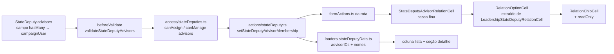

# Impl: B156 — Assessores por dobradinha

Status: rascunho
Atualizado em: 2026-08-04
Issue: #360
Intenção: docs/plans/assessores-dobradinhas.md
Appetite restante: herdado (~0,75 dia eng) — sem corte

## Leitura da intenção

- **Outcome:** a coordenação registra no sistema quais assessores respondem por cada dobradinha — campo `advisors` em `StateDeputy`, coluna "Assessores" na lista `/campanha/dobradinhas` e seção no detalhe, com chips linkados para `/campanha/assessores/[id]` e edição inline (busca + toggle).
- **O que NÃO negociar:**
  - Escrita: somente `unrestricted` (coordinator + candidate); staff lê. Mesmo padrão de `Municipality.advisors`.
  - Validação: assessores designados devem ser staff elegível (`eligibleCampaignStaffWhere`), fail-closed como `validateMunicipalityAdvisors`.
  - Campo no `StateDeputy`, não em tabela de join nem em superfície paralela; não alterar `Municipality.advisors` nem a página de assessores.
- **O que reavaliar:** a hipótese de "generalizar `MunicipalityPortfolioCell`" (opção A da intenção) está **errada para este caso**: `MunicipalityPortfolioCell` é especialização de municípios (chips de território/ZE, `municipalityIndex`, batch de 435) — nada disso se aplica a uma relação simples `StateDeputy.advisors`. O padrão certo já existe e é outro: `LeadershipStateDeputyRelationCell`, que é uma casca fina sobre a máquina compartilhada `RelationChipCell` com `items + options + membershipAction`. Este é o **segundo uso** desse formato de célula — o momento canônico de extrair o genérico (engineering-standards: "edit the owner… extract in the same delivery").

## Abordagem recomendada

**Opções consideradas:**

- **A — Generalizar `MunicipalityPortfolioCell`** (recomendação da intenção): custo alto, ganho nulo. O componente é carregado de lógica de municípios (chips de território/ZE, índice de portfolio, batch com floor) que não existe na relação assessor×dobradinha. Generalizar "qualquer `{ id, label, href }`" significa esvaziar exatamente a parte que o torna útil.
- **B — Copiar `LeadershipStateDeputyRelationCell` num `StateDeputyAdvisorRelationCell` autônomo** (mitigação do rabbit hole da intenção): funciona, mas é um twin — o conhecimento de "célula de catálogo com busca" ficaria duplicado, e o engineering-standards manda extrair no segundo uso.
- **C — Extrair `RelationOptionCell` genérico de `LeadershipStateDeputyRelationCell` + `StateDeputyAdvisorRelationCell` como segunda casca fina** (recomendada): o genérico recebe `items`, `options`, `buildFormData`, `copy`, `commitAction`, `readOnly`; a casca de liderança mantém a API pública atual (`direction`, `fixedId`, `membershipAction`, …) — os 3 call sites de lideranças e o unit spec existente **não mudam** — e a casca de assessores é nova e pequena (~60 linhas de copy + `buildFormData`).

**Rejeitadas:** A porque o componente não é a fonte certa de conhecimento (especialização de municípios, não de catálogo); B porque duplica a máquina de busca/chips que a extração resolve com menos código total.

### Componentes / mudanças

- **`StateDeputy`** (`src/collections/StateDeputy.ts`): campo `advisors` (`relationship` hasMany → `campaignUser`, `index`, `filterOptions: eligibleCampaignStaffWhere`, access `create: canAssignStateDeputyAdvisors` / `update: canManageStateDeputyAdvisors`) + hook `beforeValidate` `validateStateDeputyAdvisors` (espelho de `validateMunicipalityAdvisors`: cada id deve satisfazer `eligibleCampaignStaffWhere`, senão `APIError` 400).
- **`access/stateDeputies.ts`**: `canAssignStateDeputyAdvisors` (unrestricted) e `canManageStateDeputyAdvisors` (admin-only, como o par de municípios — a escrita real passa pela action com `overrideAccess: true` após `reloadUnrestrictedActor`). Re-export em `campaignAccess.ts`.
- **`lib/schemas/stateDeputy.ts`**: `MAX_ADVISORS_PER_STATE_DEPUTY` (10, espelhando `MAX_ADVISORS_PER_MUNICIPALITY`), `STATE_DEPUTY_ADVISORS_CAP_MESSAGE`, `STATE_DEPUTY_ADVISORS_UNRESTRICTED_MESSAGE` ("Somente a coordenação geral ou o candidato gerencia assessores de dobradinhas."), `stateDeputyAdvisorMembershipSchema` (`{ stateDeputyId, advisorId, assigned }`) e `STATE_DEPUTY_ADVISOR_SAFE_MESSAGES`.
- **`lib/stateDeputyAdvisorMembership.ts`** (novo, mesmo molde de `lib/municipalityAdvisorMembership.ts`): `nextStateDeputyAdvisorIdsAfterMembership` sobre `nextIdsAfterMembership` com o cap acima.
- **`actions/stateDeputy.ts`**: `setStateDeputyAdvisorMembershipRecord` — `withPayloadTransaction`, `reloadUnrestrictedActor`, lock aditivo por `state-deputy-advisors:<id>`, delta com `nextStateDeputyAdvisorIdsAfterMembership`, no-op sem escrita, read/write com `overrideAccess: true` (campo é admin-only na config; a role já foi verificada — espelho exato de `setAdvisorMunicipalitiesBatchRecord`). `setStateDeputyAdvisorMembership` revalida `/campanha/dobradinhas/[slug]` (a lista não: a célula está nela e já mostra o toggle — precedente B31/B37).
- **`dobradinhas/formActions.ts`**: `setStateDeputyAdvisorMembershipFormAction` (casca `runCampaignFormAction` com `safeMessages`).
- **`campaignRelationOptions.ts`**: `loadCampaignUserSummaries(payload, user, ids)` (`{ id, name }`, honrando `canReadCampaignUsers`+eligible) e `loadEligibleAdvisorOptions(payload, user)` (`RelationOption[]`, `sort: 'name'`, `where: eligibleCampaignStaffWhere`).
- **`stateDeputyData.ts`**: `StateDeputyRowViewModel.advisorIDs` + `StateDeputyDetailViewModel.advisors: { id, name }[]`; selects ganham `advisors`; nomes resolvidos via `loadCampaignUserSummaries`.
- **UI (Impeccable C — superfície existente):**
  - `RelationChipCell.tsx`: prop `readOnly?: boolean` — renderiza só os chips (linkados), sem trigger de drawer, sem hover-remover, sem combobox; aria-label por extenso.
  - `RelationOptionCell.tsx` (novo, `shared/`): o genérico extraído — `ownerId`, `ownerName`, `items`, `options`, `buildFormData(changedId, assigned)`, `commitAction`, `copy`, `drawerTitle`, `triggerLabel`, `updateErrorMessage`, `readOnly`, `measureOverflow`.
  - `LeadershipStateDeputyRelationCell.tsx`: vira casca fina sobre `RelationOptionCell` mantendo a API pública atual (call sites de lideranças e unit spec intactos).
  - `StateDeputyAdvisorRelationCell.tsx` (novo, `components/campaign/stateDeputy/`): casca fina com copy pt ("Buscar assessor…", "Assessores da dobradinha"), chips com href `/campanha/assessores/[id]`, `buildFormData` `{ stateDeputyId, advisorId, assigned }`, `readOnly`.
  - `dobradinhas/page.tsx`: coluna `advisors` após "Lideranças" (leitura: geografia → pessoas → gestão); cabeçalho com `CampaignTableHead` + description "Edite aqui: passe o mouse em um chip para remover, ou busque para adicionar."; `canEditAdvisors = isCampaignUnrestricted(user)`; options carregadas só quando a coluna está visível E `canEditAdvisors` (mesmo guard de `isLeadershipVisible`).
  - `dobradinhas/[slug]/page.tsx`: seção "Assessores responsáveis" (ícone `UserCog` + `<Badge>` com contagem) como terceiro card no grid 2-col, com a mesma célula.
- **Migration:** `pnpm migrate:create add_state_deputy_advisors` (tabela de relação `stateDeputy_rels` path `advisors`) → `pnpm generate:types`.

### Dados → forma

- Forma: chips linkados + drawer de busca (mesma superfície das colunas "Municípios"/"Lideranças" da própria página) — o job "quem cobre qual dobradinha" é comparativo entre linhas e a célula já prova o padrão com advisors em municípios.
- Rejeitadas: avatar stack do estilo `MunicipalityAdvisorAvatarStack` (perde o link e a edição onde se vê); popover `MunicipalityListAdvisorsControl` (endpoint e create-inline são municipais; coordinator-only, mas aqui o candidato também edita — e a página já usa o padrão drawer de `RelationChipCell`).

## Fases verificáveis

1. **Schema + server** — coleção (campo + hook + access), schemas, action + formAction, loaders/options, migration + tipos, int spec `campaignStateDeputyAdvisorMembership.int.spec.ts` (coordinator/candidate atribuem e removem; advisor e leader negados; idempotente; cap de 10; ineligible role rejeitada pelo hook). Verificação: `pnpm gate:fast` + int spec isolado.
2. **UI** — `readOnly` no `RelationChipCell`, extração `RelationOptionCell`, cascas, coluna na lista, seção no detalhe, unit spec da célula de assessores. Verificação: `pnpm test:unit` + int dos loaders.
3. **Gates** — `pnpm gate:fast` na iteração; fechamento com `pnpm push` (gate:push → gate:ci); `tsc`, `lint`, `format:check`, `knip`, `check:cycles`, `pnpm test`, `pnpm build`.

## Rabbit holes / Não escopo (engenharia)

- Não generalizar além das duas cascas: `RelationOptionCell` nasce do formato `items + options` — não absorver `MunicipalityPortfolioCell` (chips de território/ZE ficam onde estão).
- Não adicionar filtro/ordenação por assessor, nem hits de assessor na busca global (B52) — ambos adiados com gatilho na intenção.
- Não tocar `Municipality.advisors`, `loadAdvisorSummaries`/`getEligibleAdvisorOptions` de municípios nem a página `/campanha/assessores`.
- Sem Consent novo (staff interno gerenciando staff).

## Riscos e mitigação

- **Extrair `RelationOptionCell` regride as colunas de lideranças** → API pública da casca preservada; unit spec existente (`leadershipStateDeputyRelationCell.unit.spec.ts`) + int specs B31/B36 continuam cobrindo; rodar `pnpm test` completo antes do push.
- **`overrideAccess: true` na escrita** → role verificada por `reloadUnrestrictedActor` antes de qualquer read/write (mesmo contrato de `setAdvisorMunicipalitiesBatchRecord`); hook `beforeValidate` continua rodando mesmo com bypass e valida a elegibilidade dos ids.
- **Cap de 10 assessores é decisão de produto que a intenção não fixou** → default segue o precedente de municípios; fácil reverter (constante + mensagem + teste). Levantado no gate humano.
- **Coluna nova na lista de dobradinhas carrega catálogo de staff por página** → options só quando coluna visível E `canEdit`; catálogo é pequeno (staff de campanha, ~dezenas).

## Aceite de engenharia

- [ ] Aceite de produto da intenção coberto: campo, coluna, seção, validação e access conforme travado
- [ ] Invariantes AGENTS/engineering-standards: Local API `user` + `overrideAccess: false` onde o padrão manda (bypass só com comentário, após `reloadUnrestrictedActor`); escrita em transação com lock aditivo; zero warnings; sem twin (extração no mesmo delivery)
- [ ] Testes previstos: int do membership (roles, no-op, cap, ineligible) + unit da célula nova; existentes verdes
- [ ] Migration commitada (`.ts` + `.json` + `index.ts`) e `generate:types` rodado

Self-score decision-quality: 5/5 — (1) decisões caras (cell, access, cap) com rejeitadas; (2) cabe no appetite (mecânica sobre padrões existentes); (3) rabbit holes nomeados; (4) reusa `RelationChipCell`, `withPayloadTransaction`, `reloadUnrestrictedActor`, `nextIdsAfterMembership`, shells de lista; (5) outcome de produto intacto.
