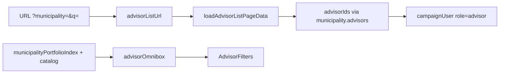

# Impl: Assessores — filtrar por município da carteira na omnibox

Status: aprovado
Atualizado em: 2026-08-02
Issue: #310
Intenção: docs/plans/assessores-omnibox-municipio-carteira.md
Appetite restante: ~0,5 dia eng

## Leitura da intenção

- **Outcome:** Coordenador/Candidato filtra assessores pela carteira (município administrado) via omnibox, com busca por nome/e-mail preservada e chips removíveis.
- **O que NÃO negociar:** rota continua `unrestricted`; sem filtro “sem carteira”; sem saved filters; sem mudança de RBAC.
- **O que reavaliar:** sair de `searchOnlyListOmnibox` — confirmado; relação assessor↔município é inversa (`municipality.advisors`), não campo em `campaignUser`.

## Abordagem recomendada

**Opções consideradas:**
- A) Estender `searchOnlyListOmnibox` com hooks — rejeitada (não escala; leadership/supporter já têm adapter próprio).
- B) Adapter `advisorOmnibox` + `advisorListFilters` espelhando lideranças (só dimensão município + busca) — **recomendada**.
- C) Facet server-side de municípios com assessor — rejeitada nesta fatia (busca tipada no índice de 435 já atende; página já carrega `loadMunicipalityPortfolioIndex`).

**Recomendação:** B — reusa contrato URL multi-`municipality`, toggles OR, grupo omnibox “Município (carteira)”, filtro server via união de `municipality.advisors`.

### Componentes / mudanças

- **`advisorListUrl.ts`:** `municipalities?: number[]`; parse/serialize `municipality` repetível.
- **`advisorListFilters.ts` (novo):** toggle/clear município; `clearAdvisorListFilters`.
- **`advisorOmnibox.ts` (novo):** chips, seeds, apply/remove — grupo “Município (carteira)”.
- **`advisorData.ts`:** resolver IDs de assessor a partir dos municípios selecionados (OR); short-circuit lista vazia.
- **`AdvisorFilters.tsx`:** props `municipalityFilterOptions`; placeholder/label atualizados.
- **`assessores/page.tsx`:** montar opções do índice + catalog; `hasQuery` inclui municípios.
- **Testes:** parser/href unit; omnibox toggle unit; int `loadAdvisorListPageData` com filtro município.

### Dados → forma

- Opções omnibox: `loadMunicipalityPortfolioIndex` + nome do `municipalityCatalog` (já na página) — busca tipada, sem facet extra.

## Fases verificáveis

1. **URL + server** — parse, href, filtro Payload, testes unit/int.
2. **UI** — `AdvisorFilters` + omnibox adapter.
3. **Gates** — `pnpm gate:fast`; push via `pnpm push`.

## Rabbit holes / Não escopo (engenharia)

- Filtro “sem carteira” / cobertura estadual.
- Saved filters / coluna head filter.
- Facet dinâmico restrito a municípios com assessor (defer: gatilho se omnibox ficar ruidosa).

## Riscos e mitigação

- **Performance:** uma query extra `municipality` só quando há filtro; índice omnibox client-side já cacheado.
- **OR vs AND:** toggles multi-valor + `id in union(advisors)` — alinhado a lideranças.

## Aceite de engenharia

- [x] Aceite de produto da intenção ainda coberto
- [x] Invariantes AGENTS/engineering-standards
- [x] Testes de domínio previstos (unit/int) onde access/write paths mudam
