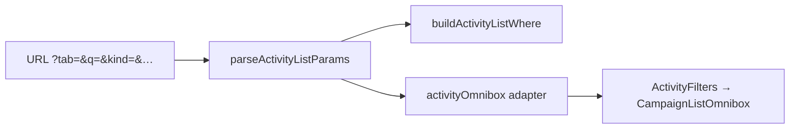

# Impl: Atividades — presets (Próximos/…) e busca na omnibox; remover abas (B138)

Status: aprovado
Atualizado em: 2026-08-02
Issue: #306
Intenção: docs/plans/atividades-omnibox-presets-busca.md
Appetite restante: herdado (~0,5–1 dia eng)

## Leitura da intenção

- **Outcome:** Uma barra omnibox na lista de atividades — presets de janela (Próximos/Todos/Realizados/Rascunhos) e busca por texto como chips/sugestões; seletor de abas acima some; default Próximos intacto.
- **O que NÃO negociar:** semântica de Próximos (planejado/confirmado + startAt ≥ agora); leader lockdown inalterado; deep-links `?tab=` preservados; tipo/município/status (em Todos) na omnibox.
- **O que reavaliar:** hipótese de mover preset para dentro da omnibox — confirmada; não precisa de mudança no chassis `CampaignListOmnibox`.

## Abordagem recomendada

**Opções consideradas:**
- A) Tab como chip de apresentação (não-URL, como scenario em municípios)
- B) Tab permanece em `?tab=` com chip/sugestões na omnibox
- C) Tab vira filtro de status composto (rejeitado pelo produto)

**Recomendação:** B — mantém deep-links, reusa `activityUi` existente; só muda superfície.
**Rejeitadas:** A (quebra bookmarks `?tab=realizados`); C (perde modo diário nomeado).

### Componentes / mudanças

- **`activityUi.ts`**: adicionar `q` ao estado/URL; `buildActivityListWhere` com OR `title` + `responsible.name`.
- **`activityOmnibox.ts`**: seeds grupo `Janela` (`tab:*`); chip de janela quando `tab !== proximos`; chip `Busca:`; apply/remove/clear para `q` e `tab`.
- **`ActivityFilters.tsx`**: remover `ActivityTabSwitch`; wire `onCommitQuery`; placeholder atualizado.
- **Migration:** sem migration.
- **Access / Consent:** inalterado (staff-only lista).
- **UI:** Impeccable B — espelhar `SupporterFilters` (uma barra, chips, pending boundary existente).

### Dados → forma

- Chip de janela mostra `activityTabLabels[tab]` (ex. "Realizados"), não status cru.
- Busca: título + nome do responsável (já no card; precedente `contact.name` em leadership).

## Fases verificáveis

1. **Server/URL** — `activityUi` + testes unitários (`q`, where OR).
2. **Omnibox adapter + UI** — `activityOmnibox`, `ActivityFilters`; testes B128 estendidos.
3. **Gates** — `pnpm gate:fast`; push via `pnpm push`.

## Rabbit holes / Não escopo (engenharia)

- Saved filters B18; intervalo de datas genérico; mudanças em outras listas.
- Novo arquivo `activityOmnibox.unit.spec.ts` — estender `listOmniboxB128` + `activityUi` (evitar twin de test file).

## Riscos e mitigação

- **Tab + status em Todos:** ao mudar tab, limpar `status` se sair de `todos` (mesmo comportamento do antigo `buildTabHref`).
- **`q` + tab:** filtros AND — busca restringe dentro da janela ativa.

## Débitos deferidos (simplify B138)

- **DRY municipality/setExclusiveField helpers** (score 3, `defer_trigger`): extrair quando 3º domínio omnibox precisar do mesmo padrão — já ledgerado em B128; não bloqueia B138.
- **Int test `responsible.name` contains** (score 3, `defer_trigger`): where JSON coberto em unit; int espelhando supporter quando houver fixture de activity com responsável.
