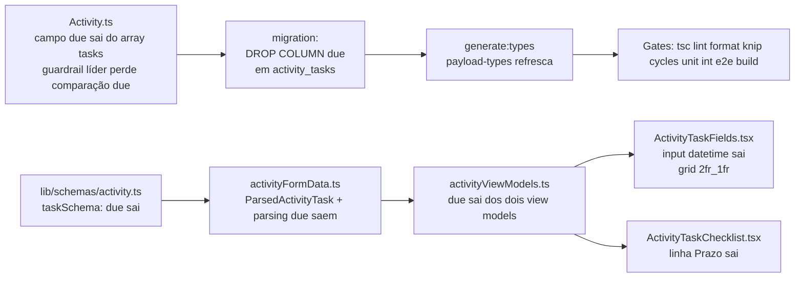

# Impl: C124 — Atividades: tarefa só com texto, responsável e concluída (sem data/hora)

Status: aprovado
Atualizado em: 2026-08-11
Issue: #668
Intenção: docs/plans/atividades-tarefas-sem-prazo.md
Appetite restante: herdado (~0,5–1 dia eng; mudança é remoção pura, sem migração de dados)

## Leitura da intenção

- **Outcome:** tarefa de atividade passa a ter exatamente três controles — título (texto), responsável (pessoa) e "concluída" (checkbox); o prazo (data/hora) sai do schema, da UI e do guardrail de liderança; `doneAt` permanece.
- **O que NÃO negociar:** guardrail de liderança fail-closed (só marca concluída, comparação perde `due`); dados existentes com prazo são **descartados** (drop da coluna, decidido no gate); anti-goal: prazo não migra para outro campo.
- **O que reavaliar:** a hipótese de direção da intenção estava completa — confirmei por grep que `due` de tarefa só existe em 6 arquivos (collections, zod, formData, viewModels, 2 componentes) + payload-types gerado + migration antiga (frozen). Nenhum consumidor fora da vertical de atividades (notificações, Google sync, activityUi, quick actions: nenhum lê `task.due`).

## Abordagem recomendada

**Opções consideradas:** A) remoção completa (campo + coluna + UI) · B) manter coluna morta (`due` nullable, nunca escrita) · C) manter campo no schema, só esconder da UI
**Recomendação:** A — a intenção e o gate decidiram "descartar e remover"; remover na origem elimina a coluna fantasma, o peso no guardrail e a tentação de re-exibir. Zero risco de perda: nenhum consumidor lê o valor (verificado por grep em `src/` e `tests/`), e dado de campanha interno sem valor operacional.
**Rejeitadas:** B (anti-goal "limpeza real, sem coluna fantasma" — matéria do gate) · C (mantém API e guardrail poluídos com campo morto; anti-goal: campo sai do modelo, não só da UI).

### Componentes / mudanças

- **`Activity`** (`src/collections/Activity.ts`): remove o field `due` do array `tasks` (linhas 575–583); remove `(taskRecord.due ?? null) !== (previousTask.due ?? null)` do guardrail de liderança em `deriveActivityFields` (linha 361) — mesmo item, senão a comparação lê propriedade inexistente e o fail-closed perde a cobertura. `doneAt`/`taskTotal`/`taskDoneCount` intocados.
- **`src/lib/schemas/activity.ts`**: `taskSchema` perde `due: z.string().datetime().optional().nullable()` (linha 74). Types `ActivityCreateInput`/`ActivityUpdateInput` derivam de zod — atualizam sozinhos.
- **`src/utilities/activityFormData.ts`**: `ParsedActivityTask` perde `due?: string`; `parseTasksFormData` perde o parsing/validação de prazo (linhas 81–85) e a propagação `...(due ? { due } : {})` (linha 91). O resto do parse fica intacto.
- **`src/utilities/activityViewModels.ts`**: `ActivityFormTaskViewModel` e `ActivityTaskViewModel` perdem `due` (linhas 244, 346) e os mapeamentos (linhas 294, 395). `doneAt` permanece no checklist VM.
- **`ActivityTaskFields.tsx`**: `ActivityTaskFieldValue` e `initialTasks` perdem `due`; `serializeTasks` deixa de emitir `due`; estado inicial e `addTask` perdem o default; o input `datetime-local` do prazo sai; grid `sm:grid-cols-[2fr_1fr_1fr]` → `sm:grid-cols-[2fr_1fr]`; import `formatIsoAsBahiaDateTimeInput` sai.
- **`ActivityTaskChecklist.tsx`**: a entrada `Prazo: …` do subtítulo sai (linha 63); import `formatBahiaDateTimeLabel` sai (o helper continua usado em outras superfícies — ActivityCard/agenda — knip valida).
- **Migration:** `pnpm migrate:create drop_activity_task_due` — gera `ALTER TABLE "activity_tasks" DROP COLUMN IF EXISTS "due";` (+ down). A coluna é nullable e sem índice próprio, então o drop é barato. Aplica em prod via build (Vercel) — revisar o SQL gerado antes.
- **Access / Consent:** nenhuma mudança — mesmo access, mesma coleção, sem Consent.
- **UI:** Impeccable B — encaixe nas superfícies existentes; remoção pura, sem shape novo.

### Dados → forma (se aplicável)

- Não se aplica — sem dado novo para apresentar; o contador `taskDoneCount` segue exatamente como está.

## Fases verificáveis

1. **Schema + server** — `Activity.ts` (campo + guardrail), `taskSchema` zod, `parseTasksFormData`. Verificar: `tsc --noEmit` + int spec `campaignActivity.int.spec.ts` (cobre o guardrail de liderança com `tasks` sem `due`).
2. **UI + view models** — `activityViewModels.ts`, `ActivityTaskFields.tsx`, `ActivityTaskChecklist.tsx`. Verificar: `tsc`, `lint`, unit specs de UI (activity\*) e `knip` (orfandade de helpers).
3. **Migration + tipos** — `pnpm migrate:create drop_activity_task_due`, revisar SQL, `pnpm migrate` local (teqo_wt<slot>), `pnpm generate:types`. Verificar: `migrate:status` nas duas DBs (dev + test).
4. **Gates** — `tsc --noEmit`, `lint` (0 warnings), `format:check`, `knip`, `check:cycles`, `pnpm test`, `pnpm test:e2e` (specs de atividade: `campaignActivity`, `campaignAgenda*`), `pnpm build` contra DB local.

## Rabbit holes / Não escopo (engenharia)

- **Migração de conteúdo (preservar `due` em outra coluna):** corte — nada consome; drop limpo.
- **Prazo em demandas/atividades em geral:** fora de escopo (não criar equivalente).
- **Tocar `doneAt`/`taskDoneCount`:** fora de escopo.
- **C123 (overlay da agenda):** roda depois, nasce já com o modelo simplificado — nada a preparar aqui além do modelo limpo.

## Riscos e mitigação

- **Guardrail de liderança quebrado ao mudar o shape:** mitigado — a comparação de `due` é removida no mesmo commit do field; o int spec `denies leaders from updating activities` e o de toggle de tarefa da liderança continuam exercitando o caminho fail-closed.
- **Migração destrutiva em prod (via build):** coluna nullable, dados já sem consumidor (grep `src/`+`tests/`); SQL revisado no passo 3 antes de qualquer deploy.
- **`payload-types.ts` desatualizado no meio do caminho:** `due` some do tipo gerado no passo 3 (`generate:types`) — até lá `tsc` pega qualquer uso remanescente.
- **Serialização client × parse server fora de sincronia:** `serializeTasks` para de emitir `due` e o parse para de ler — mudança simétrica num único commit; nenhum cliente antigo persiste (formas stateless).

## Aceite de engenharia

- [ ] Aceite de produto da intenção ainda coberto: 3 controles por tarefa; checklist sem "Prazo: …"; schema sem prazo; dados descartados; guardrail de liderança intacto; `doneAt` permanece
- [ ] Invariantes AGENTS/engineering-standards: sem toque em access/Consent; transações intactas; copy pt-BR; identificadores em inglês
- [ ] Testes de domínio previstos: int spec existente do guardrail continua verde (sem novo teste — remoção pura, superfície coberta)
