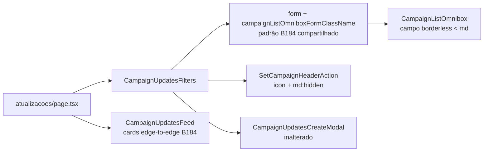

# Impl: C106 — Atualizações mobile: feed sem moldura (omnibox sticky sem label, criar no header, cards edge-to-edge)

Status: em execução
Atualizado em: 2026-08-09
Issue: #517
Intenção: docs/plans/atualizacoes-mobile-sem-moldura.md
Appetite restante: herdado (~0,5–1 dia eng; um encaixe em página existente)

## Leitura da intenção

- **Outcome:** no mobile, o feed `/campanha/atualizacoes` perde o chrome: label do filtro some, filtro fica sem moldura e sempre visível (sticky sob a top bar, separado do feed por uma linha), "Nova atualização" vira icon no header (mesmo modal), cards sem borda/arredondamento edge-to-edge separados por uma linha. Desktop e demais listas inalterados.
- **O que NÃO negociar:** chips continuam dentro da omnibox (mesmo comportamento); modal de criação inalterado (mesmo conteúdo/fluxo, só muda o trigger); desktop do feed inalterado; demais listas `/campanha` inalteradas (B184 é pedido próprio); sem redesenho de shell.
- **O que reavaliar:** a hipótese "prop/variant ou estilo local no chassis" da intenção. **Em `main` o mecanismo irmão já existe** (C101 agenda, `ActivityAgenda.css`): CSS de página com classe própria no wrapper do filtro + `:has()` zerando o padding-top do scroll container + sticky/edge-to-edge em media query — sem prop no chassis. Seguimos esse mecanismo real; o chassis ganha só um hook estável.

## Abordagem recomendada

**Opções consideradas:** A) CSS escopado de página + hook `data-slot` no chassis (padrão C101); B) prop `variant="frameless"` no `CampaignListOmnibox`; C) chassis sem moldura global.
**Recomendação (revisada na execução):** **C** — o irmão B184/C107 chegou a `main` **antes** do merge deste item e estabeleceu o mecanismo canônico: `campaignListOmniboxFormClassName` (form sticky/edge-to-edge/borderless < md, `md:` restaura desktop) + campo do chassis borderless < md + `campaignMobileHeaderIconClassName` + "Limpar" como X circular no input — usado por municípios, atividades, demandas, assessores, agenda. Seguir o padrão compartilhado (edit the owner, don't twin): o filtro de atualizações usa a classe do form do C107 (já em `main` via conflito), o icon do header usa os tokens compartilhados; **C106 entrega só o que o irmão não cobriu**: cards edge-to-edge com linha (padrão B184 de cards) + copy do empty state + e2e.
**Rejeitadas:** A — viraria um twin do padrão que o B184 acabou de estabelecer (CSS de página + data-slot não existem mais no chassis); B — duplica decisão de visual por lista.

### Componentes / mudanças

- **`CampaignUpdatesFilters`** (`src/components/campaign/municipality/CampaignUpdatesFilters.tsx`): **zero mudanças locais** — a versão do C107 (já em `main`) aplica `campaignListOmniboxFormClassName` no form e registra o icon no header via `SetCampaignHeaderAction id="campaign-updates-new"` com `campaignMobileHeaderIconClassName`; o modal C89 fica onde está.
- **`CampaignUpdatesFeed`** (`src/components/campaign/municipality/CampaignUpdatesFeed.tsx`):
  - ul: `-mx-4 my-0 flex list-none flex-col [&>li]:mt-0 md:mx-0 md:gap-4` (edge-to-edge mobile; `my-0 list-none [&>li]:mt-0` neutralizam o leak do `@layer base` editorial `ul { my-6 ml-6 list-disc [&>li]:mt-2 }` — o feed é a única lista campaign em `<ul>`);
  - li: `rounded-none border-b border-border last:border-b-0 p-4 md:rounded-xl md:border md:last:border-b` (padrão exato dos cards do B184 em `MunicipalityListMobileCards`);
  - empty state: copy única "Ajuste o filtro ou registre um novo fato de campo." (descreve a ação, funciona nas duas resoluções).
- **Migration:** nenhuma. **Access/Consent:** nenhum. **UI:** Impeccable B — shape→craft direto, critique no gate; reusa slot de header action (C94/C95), chassis B127, padrão de cards B184, `CampaignListResults`.

### Decisões de engenharia

1. **Mecanismo mobile sem moldura:** A) CSS de página + hook `data-slot` (padrão C101) | B) prop no chassis | C) **padrão compartilhado B184/C107 já em `main`** (form class + chassis borderless + tokens de header). **→ C (revisado)** — o irmão chegou primeiro; adotar o owner em vez de criar twin.
2. **Trigger de criar no mobile:** A) `SetCampaignHeaderAction` + `md:hidden` (CSS-only) | B) gate JS `useIsMobile()` | C) FAB/quick action (padrão agenda). **→ A** — reusa o slot C94/C95; gate de resolução é CSS puro (sem flash de hidratação); o pedido é explicitamente "icon no header", não FAB.
3. **Copy do empty state:** A) copy única sem referência a botão | B) copy mobile-aware. **→ A** — recomendação da própria intenção; descreve a ação em vez do trigger.
4. **"Limpar" no mobile:** o padrão B184 do chassis já trocou o texto por X circular dentro do campo (mecanismo compartilhado — fora do escopo deste item, herdado do padrão).
5. **Shell gap / sticky:** resolvido pelo próprio `campaignListOmniboxFormClassName` (`sticky top-0 z-20 -mx-4 border-b bg-background px-4 py-2` + `md:static ...`), sem mudança no shell.

### Dados → forma

N/A — item de acabamento visual; nenhum dado/KPI/mapa muda.

## Fases verificáveis

1. **Tracer** — `data-slot` no chassis + `CampaignUpdatesFeed.css` + wrapper do strip; validar sticky/frameless/edge-to-edge no viewport mobile no dev server.
2. **UI completa** — header icon + trailing desktop-only + classes dos cards + copy do empty state.
3. **E2E + gates** — `campaignUpdatesMobile.e2e.spec.ts` (padrão `campaignAgendaMobile.e2e.spec.ts`, fixture `CampaignE2EFixture`): mobile = label oculta, botão texto oculto, icon no header abre o bottom sheet, cards sem borda, filtro visível após scroll; desktop = regressão (label e botão presentes, sem icon no header). `pnpm gate:fast`; push via `pnpm push`; PR `--base main` + `Closes #517` + auto-merge + `gh pr checks --watch --required`.

## Rabbit holes / Não escopo (engenharia)

- "Já que é sem moldura, melhora as outras listas" (B184 é o irmão; demais = pedido próprio).
- Remover/trocar o "Limpar" (isso é o B184, com X circular — não pedido aqui).
- Redesenhar chips/sugestões do omnibox; mudar conteúdo/fluxo do modal.
- `MunicipalityUpdateFeed` (feed do detalhe do município) — superfície diferente.
- Prop/variant novo no chassis; tocar no mecanismo C101 da agenda.

## Riscos e mitigação

- **Geometria do sticky** (pinar 1rem abaixo da top bar): receita C101 (`:has` + padding-top zero) já validada em prod — conferir visualmente no viewport mobile.
- **Regressão em outras listas:** CSS escopado por classe nova + media query; chassis só ganha `data-slot`; coberto por e2e desktop da própria superfície e gates.
- **`isPending`/transição da lista** interage com o sticky: sem mudança de comportamento (o wrapper não altera o fluxo); o e2e cobre rolagem com filtro visível.
- **Icon duplicado no desktop:** `md:hidden` no header action + `hidden md:inline-flex` no botão — exatamente um visível por resolução.

## Achados da execução (registrados)

- **O irmão B184/C107 chegou a `main` antes do merge deste item** e tornou o mecanismo canônico: `campaignListOmniboxFormClassName` + campo borderless < md no chassis + `campaignMobileHeaderIconClassName` + X circular de limpar. A hipótese original (CSS de página no padrão C101) viraria um twin — a execução adotou o padrão compartilhado (edit the owner). O conflito de rebase em `CampaignUpdatesFilters.tsx` foi resolvido mantendo a versão do irmão.
- **Leak da base `ul` editorial no campaign:** `@layer base` do styles.css aplica `my-6 ml-6 list-disc [&>li]:mt-2` a todo `ul` — o feed de atualizações é a única lista campaign em `<ul>`, então o leak só aparecia aqui (margem esquerda de 24px + 8px por li). O feed agora neutraliza na própria lista (`my-0 list-none [&>li]:mt-0`); o `[data-theme='campaign'] p { margin-top: 0 }` já era o precedente desse patch pontual. Efeito colateral no desktop: feed alinhado ao filtro (o indent de 24px era artefato do leak, não desenho).
- **Artefato transitório de streaming (`#S:0` hidden):** páginas dinâmicas (searchParams awaitado) podem exibir temporariamente uma cópia hidden da página durante o stream; some sozinho (~1–5s). Não é regressão (existe só no build de produção, pré-existente no padrão de streaming). Os e2e esperam o stream assentar antes de assertar (`settleStream`).

## Aceite de engenharia

- [ ] Aceite de produto da intenção coberto (7 bullets: label oculta; filtro sem moldura/sticky/linha separadora; chips dentro da omnibox; criar vira icon no header com o mesmo modal; cards edge-to-edge com linha; desktop inalterado; empty state coerente)
- [ ] Invariantes AGENTS/engineering-standards (nenhuma escrita/access/PII; copy pt-BR; identificadores em inglês)
- [ ] Testes: e2e mobile + desktop da superfície; gates completos (`pnpm gate:fast`)

Self-score decision-quality: 4,5/5 (decisões caras com rejeitadas ✓ · cabe no appetite ✓ · rabbit holes nomeados ✓ · depth check: reusa C101/slot C94-C95/chassis B127 ✓ · intenção preservada ✓)
