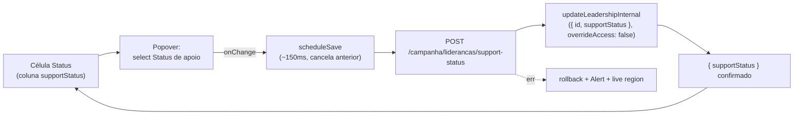

# Auto-save do Status de apoio na lista de lideranças

Status: rascunho
Atualizado em: 2026-07-25
Item do roadmap: [docs/roadmap.md](../roadmap.md) (Trilha B, item B32)
Impeccable: B — encaixe em `LeadershipsPage` / `CampaignTable` de `/campanha/liderancas` (coluna "Status"); sem rota nova de UI
Appetite: ~0,4–0,5 dia eng; 1 componente novo + 1 route handler JSON espelhando `expected-votes/`; extração do guard CSRF compartilhado; sem migration
Responsável: —

## Design (Impeccable)

Âncoras: `PRODUCT.md` (princípio 3 **Edit where you see**, princípio 4 **Auto-save, no Save button**, princípio 8 **Feel the action**) / `DESIGN.md` (register `product` — Field Desk) · tema `data-theme='campaign'` · regras `.cursor/rules/campanha-edit-where-you-see.mdc` e `.cursor/rules/campanha-action-feedback.mdc` · precedente vivo: [`MunicipalityListExpectedVotesControl.tsx`](../../src/components/campaign/municipality/MunicipalityListExpectedVotesControl.tsx) (máquina de auto-save com rollback) e o [`MunicipalityListTrendControl.tsx`](../../src/components/campaign/municipality/MunicipalityListTrendControl.tsx) atual (Popover + select — o que este item **não** deve repetir é o botão "Salvar" dele, hoje ainda sem o passe do B24).

Na implementação (`implement-roadmap-item`): craft compacto → critique → polish (sem shape — é um único select sobre um campo que já existe, na mesma família visual dos outros popovers de lista).

Brief compacto:

- **Persona / contexto:** Alex (Coordenador Geral / Assessor) varrendo `/campanha/liderancas` durante o onboarding, marcando quem já engajou ou quem ainda precisa ser abordado, uma linha após a outra.
- **Job principal:** trocar o Status de apoio sem sair da lista, sem clicar em um botão "Editar" da tela inteira antes, e sem confirmar a gravação — o clique na célula **é** a edição.
- **Estratégia de cor:** Restrained (inalterada) — a única cor da superfície continua sendo a `SupportStatusBadge`.
- **Edit where you see:** sim — a affordance já está no contexto (a célula já mostra o Badge); falta só tornar essa mesma célula editável, sem gate de "modo de edição" na tela.
- **Anti-goals:** botão "Salvar" no popover; **modo de edição** da tela inteira (padrão `AdvisorsTable`/B19 — pedido explícito do produto para **não** repetir aqui); spreadsheet/data-grid mode; editar qualquer outro campo da liderança nesta célula (Setor, Observações, Municípios continuam em `/liderancas/[id]`).

## Dados → decisão → apresentação

Dados: N/A — o item é affordance de **escrita** sobre um campo que já existe e já é lido na lista (`leadership.supportStatus`, hoje um `Badge` estático). Nenhuma métrica, contagem, série ou ranking novo; a leitura da coluna "Status" (badge, e o futuro filtro/sort do B29) não muda.

## Contexto

Em `/campanha/liderancas` ([`page.tsx`](<../../src/app/(campaign)/campanha/(app)/liderancas/page.tsx>), linhas 49–54), a coluna "Status" é **somente leitura**: `row.supportStatus ? <SupportStatusBadge status={row.supportStatus} /> : '—'`. O campo em si já é editável em outro lugar — `LeadershipInternalForm` ([`LeadershipInternalForm.tsx`](../../src/components/campaign/leadership/LeadershipInternalForm.tsx), linhas 108–123) tem um `NativeSelect` de `supportStatus` dentro do formulário multi-campo de `/campanha/liderancas/[id]` (municípios, organizações, dobradinhas, setor, status, observações, consentimento — tudo com um único botão "Salvar", correto para um formulário longo). Editar apenas o status hoje exige abrir a ficha inteira.

O campo já está pronto para escrita pontual: `leadershipInternalUpdateSchema` ([`schemas/leadership.ts`](../../src/lib/schemas/leadership.ts), linha 79) trata `supportStatus` como **opcional** — enviar só `{ id, supportStatus }` não toca municípios/organizações/dobradinhas/notas. `updateLeadershipInternalRecord` ([`actions/leadership.ts`](<../../src/app/(campaign)/campanha/actions/leadership.ts>), linhas 163–197) já faz o `findByID` de escopo (o registro precisa estar no alcance do ator) e o `payload.update` com `user`/`overrideAccess: false`; o access de campo (`canManageCampaignStaffField` em `Leadership.ts`, linha 143) já restringe quem pode escrever o status.

Dois precedentes vizinhos mostram os dois caminhos possíveis e por que um serve melhor aqui:

1. **`/campanha/municipios`** (B9 → B24 em rascunho): cada célula editável é um Popover sempre montado, sem "modo de edição" — `MunicipalityListExpectedVotesControl` já grava por debounce + endpoint JSON dedicado, sem `revalidatePath`, com rollback e live region; `MunicipalityListTrendControl` ainda usa `<form>` + botão "Salvar" (o alvo do B24, ainda não implementado).
2. **`/campanha/assessores`** (B19): `AdvisorsTable` só revela células editáveis depois que o coordenador clica em "Editar" (um botão que alterna `editing` para a tabela inteira) — é o padrão que o pedido de produto (2026-07-25) nomeia explicitamente para **não** repetir aqui ("não precisa estar com o modo de edição ativado").

Pedido de produto (2026-07-25): editar o Status de apoio clicando na própria célula, com auto-save e sem o gate de "modo de edição". Isso é exatamente o gatilho que o **B29** ([ordenacao-filtros-lista-liderancas.md](ordenacao-filtros-lista-liderancas.md), seção "Adiado com gatilho") já havia registrado: _"Edição rápida de `supportStatus` na célula (Popover + auto-save, padrão B9/B24). Revisitar quando: a mesa reportar que abre a ficha só para mudar o status, ou ≥1 pedido em sessão/R6."_ — o pedido chegou.

## Objetivos

- Clicar na célula "Status" de `/campanha/liderancas` abre um controle de edição (Popover + select) **sempre disponível**, sem depender de nenhum toggle de "modo de edição" da tela.
- Trocar o valor grava sozinho — sem botão "Salvar", sem confirmação.
- Feedback honesto na própria célula (princípio 8): pendente (`aria-busy` + spinner), erro com mensagem + rollback para o último valor confirmado, live region `sr-only`.
- Guardrails: **sem migration**, sem collection, sem Consent; access inalterado (mesma `updateLeadershipInternal`, `overrideAccess: false`, `canManageCampaignStaffField`); `leader` continua sem acesso à rota (`isCampaignStaff` já bloqueia); `/liderancas/[id]` continua com submit explícito (formulário multi-campo).

## Decisões travadas

- **Popover + `NativeSelect` sempre montado na célula, sem gate de "modo de edição".** Mirroring `MunicipalityListExpectedVotesControl` (máquina de estado com rollback/live region), não `AdvisorsTable` (toggle "Editar" da tabela inteira). Fonte: pedido de produto 2026-07-25, que nomeia explicitamente o anti-goal ("não precisa estar com o modo de edição ativado"). **Rejeitado:** reproduzir o toggle "Editar" do B19/`AdvisorsTable` (é literalmente o padrão que o pedido pede para não usar); select inline sem Popover, no estilo `AdvisorDebouncedTextCell` (perde a chrome de spinner/erro/live region já padronizada nos popovers de lista; e cores de Badge dentro de um `<select>` nativo pedem CSS frágil sem ganho real, já que o job é só um clique a mais para abrir o Popover); reusar `LeadershipInternalForm` inteiro num Popover (expõe Municípios/Organizações/Dobradinhas/Notas fora de contexto e mantém o botão "Salvar" — anti-goal do princípio 4).
- **Gravação por endpoint JSON dedicado (`POST /campanha/liderancas/support-status`), espelhando `expected-votes/route.ts` — não por `<form action>`/`revalidatePath`.** O form action de `/liderancas/[id]` hoje faz `revalidatePath('/campanha/liderancas/[id]', 'page')`; estendê-lo para a lista exigiria revalidar as 25 linhas da página a cada clique, e — quando o **B29** trouxer filtro por Status — a linha poderia desaparecer sob o filtro ativo no meio da edição (mesmo raciocínio do B24 para Tendência). **Rejeitado:** estender `updateLeadershipInternalFormAction` com `revalidatePath('/campanha/liderancas', 'page')` (custo + linha some sob filtro futuro); chamar a action imperativamente + `router.refresh()`, como `AdvisorDebouncedTextCell` (funciona lá porque a lista de assessores é curta; a de lideranças cresce com a base nominal real da C2).
- **Extrair `isSameOriginRequest` para um helper compartilhado agora.** Hoje vive privado em `expected-votes/route.ts`; este item cria o **segundo** endpoint JSON da campanha, e o próprio plano do B24 já havia registrado essa extração como devida "com o segundo endpoint" (política de segurança nomeada mesmo com 2 call sites — exceção explícita ao "3+ call sites" do `engineering-standards`). Se o B24 for implementado primeiro, este item só reusa o helper já extraído. **Rejeitado:** duplicar a função no novo route (diverge no 3º endpoint, que é só questão de tempo nesta família).
- **Sem revalidação/refresh após gravar.** O Badge exibido é local (otimista no controle, confirmado pela resposta do endpoint); qualquer sort/filtro futuro por Status (B29) só reconcilia na próxima navegação — mesma escolha já adotada para votos estimados e (em rascunho) para Tendência. **Rejeitado:** `revalidatePath`/`router.refresh()` por gravação (custo por clique e risco de reordenar a página sob o coordenador no meio da varredura).
- **Mensagens de erro compartilhadas entre o form action existente e o novo route.** `updateLeadershipInternalFormAction` hoje define `safeMessages` inline; este item extrai para `src/app/(campaign)/campanha/(app)/liderancas/leadershipStaffEditMessages.ts` (mesmo padrão de `municipalityStaffEditMessages.ts`), consumido pelos dois. **Rejeitado:** duplicar o array de mensagens no route novo.
- **i18n e naming** (AGENTS.md): identificadores em inglês — rota `support-status`, `LeadershipListSupportStatusResponse`, `LeadershipListSupportStatusControl`; strings visíveis em pt-BR ("Status de apoio", "Salvando…", "Não foi possível salvar o status.").

## Questões em aberto

- **Cadência do auto-save no `onChange` do select?** **Opções:** A) grava imediatamente, sem debounce; B) ~150 ms para coalescer trocas rápidas (mesma cadência que o B24 propõe para a troca de `status` da Tendência); C) 600 ms (cadência de texto livre). **Recomendação:** B — um select de 4 opções não precisa da folga de texto livre, mas uma coalescência mínima evita disparar duas gravações se o usuário navegar as opções por teclado rapidamente.
- **O Popover fecha sozinho depois de salvar?** **Opções:** A) permanece aberto até clique fora/Escape (padrão Radix); B) fecha automaticamente ~600 ms após confirmar. **Recomendação:** A — não há um segundo campo a preencher depois da troca (diferente do B24, que tem justificativa em texto livre), então o comportamento padrão do Popover já é suficiente e evita acoplar `open` ao resultado da gravação (o mesmo bug que o B24 evita).
- **Card mobile precisa de um controle separado?** **Opções:** A) não — `/campanha/liderancas` não tem variante de cards (só tabela, ao contrário de `/campanha/municipios`); a mesma célula funciona com toque (`min-h-11`); B) criar um card mobile agora. **Recomendação:** A — confirmado no código atual (`page.tsx` usa só `CampaignTable`), então não há uma segunda superfície a espelhar.

## Abordagem proposta

Componentes:

- **`src/components/campaign/leadership/LeadershipListSupportStatusControl.tsx`** (novo, client): Popover cujo trigger é o `SupportStatusBadge` atual; conteúdo = `NativeSelect` com as 4 opções de `leadershipSupportStatuses`. Espelha a máquina de `MunicipalityListExpectedVotesControl` (`draft`/`displayStatus`/`committedRef`/`saveGenerationRef`/`abortRef`/`saveTimeoutRef`), simplificada para um único valor enum (sem os múltiplos cenários de votos): `onChange` chama `scheduleSave` (debounce ~150 ms), erro faz rollback para `committedRef.current` + `Alert` + `sr-only aria-live`, sem `Button`/submit.
- **`src/app/(campaign)/campanha/(app)/liderancas/support-status/route.ts` + `types.ts`** (novos): `POST` com o guard de mesma origem compartilhado, `zod` (`leadershipId: positiveRelationshipId`, `supportStatus: z.enum(leadershipSupportStatuses)`), chamando `updateLeadershipInternal({ id: leadershipId, supportStatus })` e devolvendo `{ status: 'success', message, savedSupportStatus }`; erros via `mapCampaignFormActionError` + `leadershipStaffEditMessages`, `401` em sessão expirada — cópia fiel do contrato de `expected-votes/route.ts` e `types.ts`.
- **`src/utilities/sameOriginRequest.ts`** (novo): `isSameOriginRequest` extraído de `expected-votes/route.ts`; os dois routes passam a importar daqui.
- **`src/app/(campaign)/campanha/(app)/liderancas/leadershipStaffEditMessages.ts`** (novo): `leadershipStaffEditMessages` (o array `safeMessages` hoje inline em `formActions.ts`), consumido pelo form action existente e pelo route novo.
- **`liderancas/page.tsx`**: a célula da coluna `supportStatus` passa de `row.supportStatus ? <SupportStatusBadge .../> : '—'` para `<LeadershipListSupportStatusControl leadershipID={row.id} status={row.supportStatus} />` (o controle já trata o caso "Não registrada" internamente, já que `supportStatus` é `required` com `defaultValue: 'a_abordar'` no schema — na prática nunca chega nulo pela lista, mas o componente aceita `null` para não quebrar a leitura existente).
- **Depth check:** nenhum `useAutosave`/`EditableCell` genérico — dois controles com máquinas parecidas (este + o futuro B24) continuam nomeados; extração só no 3º call site (ver _Adiado com gatilho_).
- **Migration:** nenhuma — `leadership.supportStatus` já existe em `src/collections/Leadership.ts`.
- **Testes:** unit do parse/erro do novo route handler (molde do que já existiria para `expected-votes`); e2e leve em `tests/e2e/` — abrir a célula, trocar o status, esperar o estado "salvo" **sem** clicar em botão e reabrir a lista para confirmar persistência (sem `revalidatePath`, então a confirmação é via reload da página).

## Dependências

- **Nenhuma dura.** Reusa `updateLeadershipInternal` ([`actions/leadership.ts`](<../../src/app/(campaign)/campanha/actions/leadership.ts>)), `leadershipInternalUpdateSchema`/`leadershipSupportStatuses` ([`schemas/leadership.ts`](../../src/lib/schemas/leadership.ts)), `SupportStatusBadge` ([`SupportStatusBadge.tsx`](../../src/components/campaign/leadership/SupportStatusBadge.tsx)) e o padrão de endpoint de `expected-votes/`.
- **Suave:** **B24** ([autosave-tendencia-lista-municipios.md](autosave-tendencia-lista-municipios.md)) — mesma família de decisão (Popover sem "Salvar", endpoint JSON dedicado, extração do guard CSRF); a ordem de chegada só define quem extrai o helper primeiro. **B29** ([ordenacao-filtros-lista-liderancas.md](ordenacao-filtros-lista-liderancas.md)) — registrou este item em "Adiado com gatilho" e o gatilho disparou; se o B29 chegar depois, sua ordenação/filtro por Status passa a reconciliar sobre o valor gravado aqui na próxima navegação, sem trabalho extra. **B31** ([dobradinhas-lista-liderancas.md](dobradinhas-lista-liderancas.md)) — mesma tabela e mesmo anti-goal nomeado ("não é o modo Editar" de tabela inteira); célula vizinha, sem acoplamento de dado. **B19 ✓** — é o padrão explicitamente **rejeitado** (não uma dependência de reuso).

## Não escopo

- **Modo de edição da tela inteira (toggle "Editar", padrão `AdvisorsTable`/B19).** Anti-goal nomeado no pedido de produto — este item nunca depende dele.
- **Editar Setor, Observações, Municípios, Organizações ou Dobradinhas na lista.** Continuam em `/campanha/liderancas/[id]` (`LeadershipInternalForm`), formulário multi-campo com submit explícito.
- **Ordenar/filtrar por Status na lista** → **B29** ([ordenacao-filtros-lista-liderancas.md](ordenacao-filtros-lista-liderancas.md)).
- **Justificativa/nota ao trocar o status.** O campo `supportStatus` não tem nota associada (diferente de `politicalTrend.note` do B24); não inventar uma aqui.
- **Bulk edit de status em várias lideranças de uma vez.** Sem pedido, sem evidência.

## Rabbit holes

- **"Já que são dois popovers parecidos (este + B24), extrai o hook genérico de auto-save."** Nasceria um `useCampaignAutosave`/`EditableCell` que precisa acomodar select, número por cenário e (no B24) texto livre — vira design system paralelo. **Mitigação:** dois controles nomeados; extração só no 3º call site, como já registrado no plano do B24.
- **"Aproveita e já faz a lista atualizar/ordenar sozinha."** Puxa revalidação e reordenação viva. **Mitigação:** decisão travada de não revalidar.
- **"Já que dá pra editar status na célula, edita setor/observações também."** Explode o appetite e reabre o formulário multi-campo dentro de um popover de lista. **Mitigação:** Não escopo explícito.

## Adiado com gatilho

- **Hook/shell compartilhado de auto-save em popover de lista.** Revisitar quando: 3º controle com a mesma máquina (candidatos: este, o B24 de Tendência, e qualquer popover futuro de campo único).
- **Filtro por Status reconciliando em tempo real.** Revisitar quando: o B29 existir e houver reclamação real de linha "presa" sob filtro de status.

## Referências

- `docs/roadmap.md` (Trilha B, B32; grafo; Janela 1; cortes seguros)
- `src/app/(campaign)/campanha/(app)/liderancas/page.tsx` — célula alvo (coluna `supportStatus`, linhas 49–54)
- `src/components/campaign/leadership/SupportStatusBadge.tsx` — presentation do Badge atual
- `src/components/campaign/leadership/LeadershipInternalForm.tsx` — formulário multi-campo que permanece com submit explícito
- `src/app/(campaign)/campanha/actions/leadership.ts` — `updateLeadershipInternal`/`updateLeadershipInternalRecord`
- `src/app/(campaign)/campanha/(app)/liderancas/[id]/formActions.ts` — form action existente (fonte do array `safeMessages` a extrair)
- `src/lib/schemas/leadership.ts` — `leadershipSupportStatuses`, `leadershipInternalUpdateSchema`
- `src/collections/Leadership.ts` — campo `supportStatus` + access `canManageCampaignStaffField`
- `src/components/campaign/municipality/MunicipalityListExpectedVotesControl.tsx` — precedente completo de auto-save + rollback + live region
- `src/app/(campaign)/campanha/(app)/municipios/expected-votes/route.ts` e `types.ts` — contrato do endpoint a espelhar (inclui `isSameOriginRequest` a extrair)
- `src/components/campaign/advisor/AdvisorsTable.tsx` — o padrão de "modo de edição" explicitamente rejeitado
- `docs/plans/ordenacao-filtros-lista-liderancas.md` — B29 (origem do "Adiado com gatilho" que este item fecha)
- `docs/plans/autosave-tendencia-lista-municipios.md` — B24 (mesma família de decisão, em rascunho)
- `docs/plans/dobradinhas-lista-liderancas.md` — B31 (mesma tabela; mesmo anti-goal do "modo de edição")
- AGENTS.md — Campaign auth, naming pt-BR/inglês, `overrideAccess: false`
- `PRODUCT.md` / `DESIGN.md` — princípios 3, 4 e 8; Field Desk · regras `campanha-edit-where-you-see.mdc`, `campanha-action-feedback.mdc`
