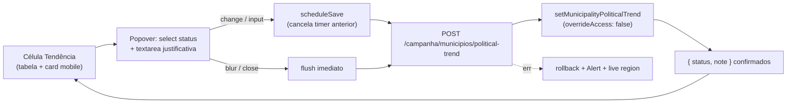

# Auto-save e justificativa no popover de Tendência da lista de municípios

Status: entregue (2026-07-26)
Atualizado em: 2026-07-26
Item do roadmap: [docs/roadmap.md](../roadmap.md) (Trilha B, item B24)

**Revisão 2026-07-26 (auditoria pré-implementação):** `isSameOriginRequest` e o shell JSON (`parseCampaignJsonRequestBody` / `campaignJsonMutationErrorResponse`) já vivem em `src/utilities/` (extraídos pelo **B27 ✓**); o popover de Assessores sem "Salvar" já foi **B27 ✓** (sai de "Não escopo" como fill-in aberto); **B23 ✓** já pluga tooltip + `openOnTouch={false}`/`disabled={open}` — este item só troca a nota read-only do Popover pelo `Textarea`. Questões em aberto fechadas: (1) reconciliar sort/filtro só na próxima navegação; (2) sem contador de caracteres; (3) Assessores fora (já B27).

**Entrega 2026-07-26:** `POST /campanha/municipios/political-trend` + `MunicipalityListTrendControl` reescrito (select ~150 ms / nota 600 ms, flush blur/fechamento, rollback + live region, sem "Salvar", sem `revalidatePath`); lista/page desacoplados de `trendFormAction` (`/editar` mantém o form action); e2e B24 + prewarm da rota; gate tsc/lint/format/knip/check:cycles/unit/int/build verde; Aikido 0 findings.
Impeccable: B — encaixe em `MunicipalityListTrendControl` (tabela desktop + card mobile de `/campanha/municipios`); sem rota nova de UI
Appetite: ~0,5 dia eng; 1 componente reescrito + 1 route handler JSON espelhando o de votos estimados; sem migration
Responsável: —

## Design (Impeccable)

Âncoras: `PRODUCT.md` (princípio 3 **Edit where you see**, princípio 4 **Auto-save, no Save button**, princípio 8 **Feel the action**) / `DESIGN.md` (register `product` — Field Desk) · tema `data-theme='campaign'` · regras `.agents/rules/campanha-edit-where-you-see.mdc` e `.agents/rules/campanha-action-feedback.mdc` · precedente vivo: [`MunicipalityListExpectedVotesControl.tsx`](../../src/components/campaign/municipality/MunicipalityListExpectedVotesControl.tsx).

Na implementação (`implement-roadmap-item`): craft compacto → critique → polish (sem shape — o popover já existe e o padrão de auto-save já está no produto ao lado, na mesma linha da tabela).

Brief compacto:

- **Persona / contexto:** Alex (Coordenador Geral / Assessor) varrendo a lista de 435 municípios durante o onboarding e as convenções; anota conjuntura de vários municípios em sequência, no desktop e no celular.
- **Job principal:** marcar a tendência **e dizer por quê** sem sair da lista e sem procurar um botão — a célula ao lado (votos estimados) já grava sozinha, esta finge que precisa de confirmação.
- **Estratégia de cor:** Restrained (inalterada) — a única cor da superfície continua sendo a `Badge` de tendência.
- **Edit where you see:** sim — a affordance já está no contexto; o que falta é o princípio 4 (o "Salvar" é justamente o anti-goal nomeado) e o campo de justificativa, hoje só editável em `/campanha/municipios/[slug]/editar`.
- **Anti-goals:** botão "Salvar" no popover; textarea gravando a cada tecla; spreadsheet/data-grid mode; segundo sistema de célula editável genérica; popover que fecha sozinho no meio da digitação.

## Dados → decisão → apresentação

- **Vou apresentar dados?** Não. `Dados: N/A` — o item é affordance de **escrita** sobre campos que já existem (`municipality.politicalTrend.status` / `.note`); nenhuma métrica, série, ranking ou mapa novo. A leitura da tendência na lista (Badge + filtro/sort do B15/B16) permanece exatamente como está.
- **Efeito colateral de leitura a vigiar:** o **B23** ([tooltip-celulas-listas.md](tooltip-celulas-listas.md)) já vai **exibir** essa justificativa (hover na célula; em touch, como leitura dentro do próprio Popover). Este item cuida só da **escrita** — se o B23 vier primeiro, aquela leitura read-only no Popover é substituída pelo textarea daqui (e o tooltip continua valendo); se este vier primeiro, o B23 só pluga o `cellTooltip`. Nenhum dos dois bloqueia o outro.

## Contexto

Em `/campanha/municipios`, a coluna "Tendência" é editável desde o **B9** ([edicao-rapida-lista-pracas.md](edicao-rapida-lista-pracas.md)): [`MunicipalityListTrendControl`](../../src/components/campaign/municipality/MunicipalityListTrendControl.tsx) abre um `Popover` com um `NativeSelect` de status e um **botão "Salvar"**, submetendo via `useActionState` → [`setMunicipalityPoliticalTrendFormAction`](<../../src/app/(campaign)/campanha/(app)/municipios/municipalityStaffFormActions.ts>) → `setMunicipalityPoliticalTrend` + `revalidateMunicipalityListPaths`. A justificativa (`politicalTrend.note`) viaja no popover como **hidden input** (só para não ser apagada) e só é editável no formulário longo `MunicipalityStrategyForm` (`/campanha/municipios/[slug]/editar`).

Duas coisas envelheceram desde o B9:

1. `PRODUCT.md` ganhou o princípio 4 ("Auto-save, no Save button", anti-goal literal: _"Save buttons on Popovers and quick-edit cells 'just in case'"_), e a célula vizinha da **mesma linha** já cumpre esse padrão: `MunicipalityListExpectedVotesControl` grava com debounce de 600 ms via `POST /campanha/municipios/expected-votes`, sem botão, com spinner + live region + rollback em erro. Duas células adjacentes com contratos de gravação diferentes é exatamente o tipo de incoerência que a lista não pode ter sob pressão de campo.
2. O próprio B9 registrou **"Nota de tendência no popover — gatilho: feedback de uso"** em _Adiado com gatilho_. O gatilho disparou: pedido de produto em **2026-07-25** (mesma sessão que originou B22/B23).

## Objetivos

- O popover de Tendência **não tem botão "Salvar"**: a troca de status grava sozinha e a justificativa grava com debounce (timer anterior cancelado a cada digitação).
- A justificativa (`politicalTrend.note`, máx. 2000 caracteres) é editável no popover, com o valor atual pré-carregado — deixa de ser hidden input.
- Feedback honesto na própria célula (princípio 8): pendente (`aria-busy` + spinner), erro com mensagem + rollback para o último valor confirmado, live region `sr-only`.
- Ao fechar o popover, qualquer rascunho pendente é gravado (flush) antes de a UI descartar o estado — nada se perde por fechar rápido.
- Access inalterado: mesma action `setMunicipalityPoliticalTrend` (`overrideAccess: false`, `canManageCampaignStaffField`); `leader` continua sem a coluna.
- Guardrails: **sem migration**, sem collection, sem Consent; `/editar` continua com submit explícito (form multi-campo).

## Decisões travadas

- **Gravação por endpoint JSON dedicado (`POST /campanha/municipios/political-trend`), espelhando o de votos estimados** — não por `<form action>` com server action. O form action atual chama `revalidateMunicipalityListPaths`, ou seja, cada auto-save recomputaria a lista inteira de 435 municípios no meio da digitação; e `useActionState` no `<form>` traz junto o par toast + `setOpen(false)`, que sob auto-save fecharia o popover a cada debounce. **Rejeitado:** (a) manter o form action e só trocar o submit por debounce — mantém a revalidação por gravação e o fechamento automático; (b) chamar o server action imperativamente + `router.refresh()`, como faz [`AdvisorDebouncedTextCell`](../../src/components/campaign/advisor/AdvisorDebouncedTextCell.tsx) — funciona lá porque a lista de assessores é curta, aqui pagaria RSC de 435 linhas por gravação e as server actions serializam em fila.
- **Sem revalidação/refresh imediato após gravar.** O valor exibido é local (otimista no controle, confirmado pela resposta do endpoint); ordenação por `trend`, filtro `?trend=` e contagens de facet só reconciliam na próxima navegação — mesma escolha já em produção no controle de votos estimados (que afeta `sort=expectedVotes`/`deficit` do mesmo jeito). Motivo: puxar a linha para fora da viewport enquanto o coordenador ainda está escrevendo a justificativa é pior que um facet momentaneamente defasado. **Rejeitado:** `revalidatePath` por gravação (custo + linha somindo sob filtro ativo); revalidação em cada fechamento de popover (mesma remoção de linha, só adiada em segundos).
- **Duas cadências de debounce, um só timer por controle.** Troca de `status` (select) grava quase imediata (~150 ms, só para coalescer trocas seguidas de teclado); a justificativa usa o mesmo `AUTOSAVE_MS = 600` do controle de votos. O timer pendente é **sempre** cancelado antes de reagendar (pedido explícito do produto) e sofre flush no `blur` da textarea e no fechamento do popover; respostas fora de ordem são descartadas por `AbortController` + contador de geração, como no precedente. **Rejeitado:** gravar a cada keystroke (anti-goal nomeado no princípio 4); gravar só no fechamento (perde o texto se a aba morre e não dá feedback durante a escrita).
- **Justificativa continua opcional e sem histórico.** Grava `status` e `note` juntos no mesmo payload (o hook `derivePoliticalTrendAudit` em `src/collections/Municipality.ts` já compara o snapshot `status\0note` e só re-carimba `recordedBy`/`recordedAt` quando algo muda de fato). **Rejeitado:** versionar a nota (o registro versionado do **C12** é de `votePledge`, e conjuntura não é decisão ex-ante); exigir justificativa ao mudar o status (fricção em varredura de 435 linhas).
- **i18n e naming** (AGENTS.md): identificadores em inglês — rota `political-trend`, `MunicipalityListPoliticalTrendResponse`, `MunicipalityListTrendControl` (nome mantido); strings visíveis em pt-BR ("Tendência", "Justificativa", "Salvando…", "Não foi possível salvar a tendência.").

## Questões em aberto

_Fechadas na auditoria 2026-07-26:_

- **Reconciliar sort/filtro depois de editar?** → **A** (só na próxima navegação). Opção C fica em _Adiado com gatilho_.
- **Contador de caracteres na justificativa?** → **A** (nenhum; `maxLength={2000}`).
- **Popover de Assessores no mesmo passe?** → **A** — entregue como **B27 ✓** (não neste item).

## Abordagem proposta

Componentes:

- **`MunicipalityListTrendControl`** (`src/components/campaign/municipality/MunicipalityListTrendControl.tsx`): deixa de receber `formAction`/`municipalitySlug` e passa a espelhar a máquina de estado do controle de votos — `draft` / `displayStatus` / `committedRef` / `saveGenerationRef` / `abortRef` / `saveTimeoutRef`, `onOpenChange` com flush, `Alert` de erro, `
`. Some o `<form>`, o `Button` "Salvar" e o hidden `trendNote`; entra `Textarea` (`src/components/ui/textarea`) rotulada "Justificativa" com `maxLength={2000}`.
- **`src/app/(campaign)/campanha/(app)/municipios/political-trend/route.ts` + `types.ts`** (novos): `POST` com guarda de mesma origem, `zod` (`municipalityId`, `status` nullable enum, `note` nullable ≤2000) reusando `politicalTrendStatuses` / `trimmedNullableText` de `src/lib/schemas/municipality.ts`, chamando `setMunicipalityPoliticalTrend` e devolvendo `{ status: 'success', savedTrend: { status, note } }`; erros por `mapCampaignFormActionError` + `municipalityStaffEditSafeMessages`, `401` em sessão expirada — cópia fiel do contrato de `expected-votes/route.ts`.
- **Guarda CSRF + shell JSON compartilhados:** reusar `isSameOriginRequest` (`src/utilities/sameOriginRequest.ts`) e `parseCampaignJsonRequestBody` / `campaignJsonMutationErrorResponse` (`src/utilities/campaignJsonMutationRoute.ts`) — já extraídos pelo B27. Não criar framework de rotas JSON de campanha.
- **`MunicipalityList`** (`src/components/campaign/municipality/MunicipalityList.tsx`): remove as props `trendFormAction`/`municipalitySlug` dos dois pontos de uso (coluna `trend` e card mobile).
- **`municipios/page.tsx` + `municipalityStaffFormActions.ts`**: para de passar `setMunicipalityPoliticalTrendFormAction` para a lista. O form action **permanece** — `/[slug]/editar` continua usando (`MunicipalityStrategyForm`); só a lista deixa de consumi-lo. Rodar `pnpm exec knip` para confirmar que nada ficou órfão.
- **Depth check:** nenhum `useAutosave` genérico nem `EditableCell` — dois controles com máquinas parecidas ainda são dois controles nomeados (ver _Adiado com gatilho_).
- **Migration:** nenhuma — `politicalTrend.status` e `.note` já existem em `src/collections/Municipality.ts`.
- **Testes:** unit do parse/erro do novo route handler (mesma linha do que existe para schemas de município); e2e leve em `tests/e2e/campaignMunicipalities.e2e.spec.ts` — abrir a célula, trocar status, digitar justificativa, esperar o estado "salvo" **sem** clicar em botão e reabrir para conferir persistência.

## Dependências

- **Nenhuma dura.** Reusa `setMunicipalityPoliticalTrend` (`src/app/(campaign)/campanha/actions/municipality.ts`), `municipalityPoliticalTrendSchema`, `politicalTrendLabels`/`politicalTrendBadgeVariant` (`src/utilities/municipalityLabels.ts`) e o padrão de endpoint de `expected-votes/`.
- **Suave:** **B23 ✓** ([tooltip-celulas-listas.md](tooltip-celulas-listas.md)) — tooltip + convivência Popover já na célula; este item só troca a leitura read-only no Popover pelo `Textarea`. **B27 ✓** — irmão Assessores + helpers JSON compartilhados. **B9 ✓** (origem da célula e do adiado que este item fecha), **B16 ✓** (filtro `?trend=` no header, cuja defasagem é discutida acima), **E4R ✓** (semeou notas de tendência em massa a partir da planilha — são elas que a mesa vai querer corrigir na varredura).

## Não escopo

- **Popover de Assessores sem botão "Salvar"** → **B27 ✓** (entregue 2026-07-26).
- **Mostrar a justificativa no hover da célula** → **B23 ✓**.
- **Auto-save no formulário longo `/editar`** → continua submit explícito por decisão de produto (form multi-campo).
- **Histórico/versionamento da tendência** → **C12 ✓** cobre registro ex-ante de decisões (`allocationDecision`), não conjuntura.
- **Revalidação/facets em tempo real da lista** → adiado (opção C); se virar trabalho, cai no mesmo lugar do débito de revalidação do controle de votos.

## Rabbit holes

- **"Já que são dois, extrai o hook genérico de auto-save."** Se alguém generalizar de passagem: nasce um `useCampaignAutosave` + `EditableCell` que precisa acomodar select, número por cenário, textarea, otimismo e rollback — vira design system paralelo (anti-goal do princípio 3). **Mitigação neste item:** dois controles nomeados; extração só no 3º call site (ver abaixo).
- **"Aproveita e faz a lista atualizar sozinha."** Puxa revalidação, facets, reordenação e a linha somindo sob filtro ativo. **Mitigação:** decisão travada de não revalidar; opção C registrada como upgrade barato se houver reclamação real.
- **"A justificativa merece rich text / anexos."** É textarea de 2000 caracteres num popover de lista. **Mitigação:** `Textarea` simples; qualquer coisa além disso é `/editar` ou `municipalityUpdate` (sinal tipado do C12).
- **Popover que fecha ao gravar.** Herança do `useActionState` atual; sob auto-save é bug. **Mitigação:** `setOpen` deixa de ser efeito do resultado da gravação.

## Adiado com gatilho

- **Hook/shell compartilhado de auto-save em popover de lista.** Revisitar quando: **3º** controle com a mesma máquina **debounce+draft** (ExpectedVotes + este = 2; Advisors/B27 é delta distinto — não conta). Candidatos: prioridade, `budgetNotes`.
- **Reconciliação de sort/filtro pós-edição (opção C).** Revisitar quando: alguém relatar em uso real linha "presa" no filtro de tendência errado.
- **Contador de caracteres da justificativa.** Revisitar quando: houver nota real perto de 2000 caracteres.

## Referências

- `docs/roadmap.md` (Trilha B, B24; grafo; Janela 1–2; cortes seguros)
- `src/components/campaign/municipality/MunicipalityListTrendControl.tsx` — superfície alvo
- `src/components/campaign/municipality/MunicipalityListExpectedVotesControl.tsx` — precedente completo de auto-save + rollback + live region
- `src/app/(campaign)/campanha/(app)/municipios/expected-votes/route.ts` e `types.ts` — contrato do endpoint a espelhar
- `src/app/(campaign)/campanha/(app)/municipios/municipalityStaffFormActions.ts` — form action que permanece para `/editar`
- `src/app/(campaign)/campanha/actions/municipality.ts` — `setMunicipalityPoliticalTrend`
- `src/collections/Municipality.ts` — grupo `politicalTrend` + hook `derivePoliticalTrendAudit`
- `src/lib/schemas/municipality.ts` — `politicalTrendStatuses`, `municipalityPoliticalTrendSchema`
- `docs/plans/edicao-rapida-lista-pracas.md` — B9 (origem da célula e do adiado "nota no popover")
- AGENTS.md — Campaign auth, naming pt-BR/inglês, `overrideAccess: false`
- `PRODUCT.md` / `DESIGN.md` — princípios 3, 4 e 8; Field Desk · regras `campanha-edit-where-you-see.mdc`, `campanha-action-feedback.mdc`
