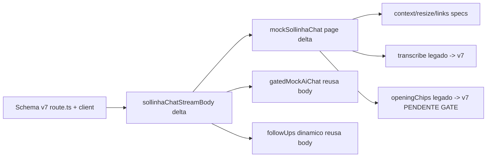

# Impl: B194 — E2E do chat: extrair helper compartilhado do mock SSE (formato v7) e migrar spec legado

Status: rascunho
Atualizado em: 2026-08-24
Issue: #556
Intenção: docs/plans/b194-e2e-chat-mock-sse-helper.md
Appetite restante: herdado

## Leitura da intenção

- **Outcome:** Corpo SSE do mock de `/campanha/api/ai-chat` (formato wire v7) centralizado num helper compartilhado em `tests/e2e/fixtures/campaignE2EFixtures.ts`, eliminando a duplicação de 3 specs v7 e migrando o spec legado `campaignAiTranscribe` para o formato v7 canônico.
- **O que NÃO negociar:** Formato v7 canônico (chunks `data: {"type":"..."}` separados por `\n\n`, array exato `[start, text-start, text-delta(delta), text-end, finish]`, id `"t1"`, finishReason `"stop"`); helper parametrizado por `delta`; não alterar comportamento observado nem timing dos specs.
- **O que reavaliar:** Se o segundo spec legado (`campaignAiChatOpeningChips`) e o spec dinâmico (`campaignAiChatFollowUps`) entram no escopo — ver GAP DE ESCOPO abaixo.

## Abordagem recomendada

**Opções consideradas:** A (copiar streamBody em cada spec, status quo) | B (helper só do body SSE, mocks locais chamam) | C (helper completo body+rota)
**Recomendação:** B+C combinados — `sollinhaChatStreamBody(delta)` para o corpo, `mockSollinhaChat(page, delta)` para a rota fixa, e reuso do body dentro dos mocks dinâmicos/gated.
**Rejeitadas:** A (duplicação é o débito em questão).

### Componentes / mudanças

- **`sollinhaChatStreamBody`** (tests/e2e/fixtures/campaignE2EFixtures.ts): nova função que recebe `delta: string` e retorna a string SSE v7 completa — array de chunks `data: {...}` separados por `\n\n` com `[start, text-start, text-delta(delta), text-end, finish]`, id `"t1"`, finishReason `"stop"`. Compartilhada por todos os specs.
- **`mockSollinhaChat`** (tests/e2e/fixtures/campaignE2EFixtures.ts): `async (page: Page, delta: string): Promise<void>` que registra rota fixa em `/campanha/api/ai-chat` respondendo com `sollinhaChatStreamBody(delta)` (content-type `text/event-stream`).
- **`campaignSollinhaContext.e2e.spec.ts`:** `mockAiChat(page, reply=DEFAULT_REPLY)` passa a chamar `mockSollinhaChat(page, reply)`; `gatedMockAiChat` reusa `sollinhaChatStreamBody(DEFAULT_REPLY)` no lugar do `streamBody` local (remover `streamBody` local). GATE do `gatedMockAiChat` mantido.
- **`campaignAiChatResize.e2e.spec.ts`:** remover `mockAiChat`/`streamBody` local; usar `mockSollinhaChat(page, 'Resposta mockada da Sollinha.')`.
- **`campaignAiChatLinks.e2e.spec.ts`:** remover `mockAiChat`/`streamBody` local; usar `mockSollinhaChat(page, ASSISTANT_LINKS)`.
- **`campaignAiChatFollowUps.e2e.spec.ts`:** manter a lógica dinâmica (`lastUserText` → FIRST/SECOND/THIRD_RESPONSE) mas reusar `sollinhaChatStreamBody(response)` dentro do handler existente, eliminando o corpo duplicado.
- **`campaignAiTranscribe.e2e.spec.ts`:** remover o mock legado (`data: {"type":"text","text":...}`) e usar `mockSollinhaChat(page, 'Resposta mockada da Sollinha.')`. Spec não asserta resposta do assistente, então a migração é estritamente melhor sem mudar comportamento.
- **Migration:** sem migration (apenas testes)
- **Access / Consent:** N/A (testes e2e)
- **UI:** N/A

### Dados → forma

- N/A

## Fases verificáveis

1. **Extração do helper** — adicionar `sollinhaChatStreamBody` + `mockSollinhaChat` em `campaignE2EFixtures.ts`
2. **Refactor dos specs v7** — context/resize/links/followUps usam o helper
3. **Migração do legado** — `campaignAiTranscribe` (e `openingChips` se aprovado no GATE) para v7
4. **Gates** — `pnpm gate:fast`; push via `pnpm push`

## Rabbit holes / Não escopo (engenharia)

- Comportamento do chat em si (B187/B188 já cobrem).
- Rodar e2e em dev mode.
- Alterar o schema v7 da rota real ou do cliente.
- Criar novos asserts sobre a resposta do assistente nos specs legados (mantém-se apenas bolha de usuário/chips).

## Riscos e mitigação

- **Race de timing no `gatedMockAiChat`:** o GATE (primeira req responde, demais travam até release) deve ser preservado — reusa apenas o `sollinhaChatStreamBody`, não a lógica de espera. Mitigação: testar o spec de context após o refactor.
- **followUps dinâmico quebra:** reuso do body dentro do handler deve manter a seleção por `lastUserText`. Mitigação: rodar o spec followUps isolado.
- **Legado não asserta resposta:** migrar para v7 não muda o observável, mas confirma que o mock é aceito pelo `useChat` v7 (falha silenciosa do formato antigo some). Mitigação: specs continuam verdes.

## Decisões de engenharia (caro de reverter)

- Opções: A (manter duplicação) | B (helper só do body) | C (helper body+rota, reuso nos dinâmicos/gated); Recomendação: C; Rejeitadas: A (débito origem), B incompleto.

## Aceite de engenharia

- [ ] Aceite de produto da intenção ainda coberto
- [ ] Invariantes AGENTS/engineering-standards
- [ ] Testes de domínio previstos (unit/int) onde access/write paths mudam

## GAP DE ESCOPO A RESOLVER NO GATE (humano)

- O issue cita 1 spec legado (`campaignAiTranscribe`). Na verdade há 2 (também `campaignAiChatOpeningChips`) e 4 v7 (não 3: inclui `campaignAiChatFollowUps`, que é dinâmico).
- Recomendação: migrar `openingChips` também e refatorar `followUps` para reusar o corpo. Custo trivial, deixa consistente.
- Decisão: PENDENTE — humano confirma no GATE se abrange `openingChips` + `followUps` ou só o literal do issue.
