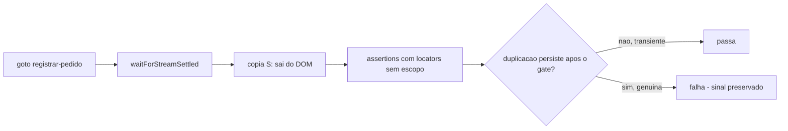

# Impl: B195-F1 — wizard Registrar pedido duplica o form no HTML sob carga (Next form-actions SSR)

Status: aprovado (gate humano 2026-08-24)
Atualizado em: 2026-08-24
Issue: #659
Intenção: body da Issue #659 (kind defect; P2)
Appetite restante: herdado — fix mínimo no spec e2e + documentação da causa-raiz; zero product code; ataque à raiz no Next vai para débito com gatilho

## Leitura da intenção

- **Outcome:** `campaignRegisterDemand` ('creates a demand from the final step') verde de forma estável — inclusive suíte completa/prod-build sob carga (CI do PR) — sem mascarar regressão real (um form **genuinamente** duplicado em prod DEVE continuar falhando), sem mudança de product code, e com a causa-raiz documentada ligada ao artefato conhecido de streaming.
- **O que NÃO negociar:** deteção de duplicação genuína permanece no spec (locators sem escopo continuam expostos a strict mode); nenhum "conserto" no product code para satisfazer o teste; aceites de produto do wizard intactos (A5 staff gate L84–86, B43 redirect de leader, dispatch manual C140 do `WizardStepFormChrome`).
- **O que reavaliar:** a intenção levantou "possível cache/data-cache race nas form-actions do Next sob concorrência" como direção de investigação. A evidência do explorador reclassifica isso: a duplicação é a **mesma classe do artefato já catalogado** (OPS83/C106, Issue #517) — páginas dinâmicas (esta awaita `searchParams`, `acoes/[slug]/page.tsx:50`) streamam uma cópia hidden `div[id^="S:*"]` do shell que some sozinha (~1–5s), **só em build de produção**. Os componentes renderizam UMA vez; o gap de ~15KB com props idênticas ('Wanderley' nos dois) e action pré-hydration placeholder na 1ª cópia vs `$ACTION_REF_1` na 2ª é o snapshot de template do stream, não estado duplicado da aplicação. Consequência: não há investigação nova de servidor a fazer agora — há um spec e2e a menos do gate canônico (`waitForStreamSettled`, extraído hoje em `docs/changelog/2026-08-24-e2e-debt-s-gate.md`; `campaignRegisterDemand` ficou fora dos 21 migrados).

## Abordagem recomendada



**Opções consideradas:** A | B | C
**Recomendação: A** — aplicar o gate canônico `waitForStreamSettled(page)` no test 'creates a demand…' logo após o `page.goto` do passo final do wizard (`tests/e2e/campaignRegisterDemand.e2e.spec.ts:26`), e reescrever o comentário do `.first()` (L38–39) com a causa real. Porque: (a) o helper já existe, está validado por 21 call sites desde OPS83 e é o idioma exato do artefato (depth check: reusar o owner, não inventar); (b) o gate espera o commit do stream e **falha por timeout** se a cópia nunca sumir — converte "transiente presente na hora da assert" em espera, mas mantém o sinal de duplicação persistente; (c) é o menor diff possível dentro do appetite de um defect P2 de teste.

**Rejeitadas:**

- **B — espalhar `.first()`/escopos pelos demais locators** (kind L37, body L41/L45, click L46, topBar L29–32): mascararia a própria regressão que o aceite manda preservar — um form duplicado genuíno em prod passaria pelo spec. Os locators sem escopo são a **rede de deteção**, não o bug.
- **C — atacar a raiz no Next agora** (upgrade 15.4.11→latest, mexer em `loading.tsx`, forçar estático na rota autenticada, experimentar PPR): custo alto, risco largo em rota autenticada de campanha, e o sintoma é transiente que auto-resolve em ~1–5s — sem evidência de dor em produção (nenhum relato de usuário; o browser hidrata e funciona). Vira débito com gatilho (Decisão 3).

### Decisões de engenharia

**Decisão 1 — escopo do gate: só o test 1 do describe.**

```text
Opções: A | B
Recomendação: A — gate apenas no test 'creates a demand…' (após o goto L26,
  antes do bloco de assertions L28+).
Alternativas rejeitadas:
  B — gate nos 3 tests do describe — porque a evidência não pede: o repro
    determinístico (6/7 runs suíte cheia prod local; CI do B195/D11) é do test 1;
    'goes back…' (L57) e 'keeps the final step away from leaders' (L74) nunca
    flakaram nesta classe (o 2º sequer renderiza o wizard — leader leva redirect
    B43 com goto abortado). Adicionar gate especulativo é latência e diff sem
    repro. Gatilho de revisitação: se qualquer um dos dois flakar em CI com
    strict-mode violation pós-merge, o fix é o mesmo one-liner.
```

Nota sobre `toHaveCount(0)` (L42/L43/L89): count **não** viola strict mode — ficam intocados por natureza. O goto tardio para `/campanha/demandas` (L53) também fica sem gate pela mesma regra de evidência (nunca flakou; assert de link único com título derivado).

**Decisão 2 — o `.first()` existente (L40) permanece, com comentário corrigido.**

```text
Opções: A | B
Recomendação: A — manter `.first()` no locator da atividade e REESCREVER o
  comentário: a causa real é a cópia S: do shell INTEIRO (CampaignWizardShell +
  form, ~15KB, OPS83/C106 Issue #517), não "combobox duplicada".
Alternativas rejeitadas:
  B — remover o `.first()` agora que o gate cobre o transiente — porque não compra
    poder de deteção algum (qualquer duplicação que o L40 pegaria o L37 — kind,
    sem escopo — pega primeiro) e adiciona risco: se existir variante de duplicação
    não coberta pelo gate, o spec volta a flakar exatamente no ponto de hoje.
    Precedente cd469857 mantém o mesmo `.first()` em campaignActivity.e2e.spec.ts:112-114.
```

A rede anti-mascaramento fica explícita no comentário novo: kind (L37), body (L41), fill (L45) e submit (L46) seguem **sem** escopo — duplicação genuína falha neles mesmo com o `.first()` no L40.

**Decisão 3 — raiz no Next vira débito com gatilho, registrado na entrega.**

```text
Opções: A | B
Recomendação: A — abrir issue de débito (referenciando #659, #517 e este plano)
  descrevendo a suspeita de raiz (streaming RSC/form-actions em página dinâmica
  sob concorrência, next 15.4.11) com gatilhos objetivos.
Alternativas rejeitadas:
  B — investigar/upgrade dentro deste PR — estoura o appetite de um defect de
    teste e mexe em dependência crítica sem dor medida em prod.
Gatilhos do débito: (1) relato de usuário/monitor vendo DOM duplo do wizard em
  produção; (2) flakes de strict-mode persistirem em specs já gated pós-merge;
  (3) upgrade de minor do Next tocado por outro motivo — validar então se a
  cópia S: desaparece.
```

### Componentes / mudanças

- **`tests/e2e/campaignRegisterDemand.e2e.spec.ts`**: (1) adicionar `waitForStreamSettled` ao import do fixture (L7); (2) inserir `await waitForStreamSettled(page)` imediatamente após o `page.goto` do test 1 (L26), antes das assertions do topBar; (3) reescrever o comentário de L38–39 citando o artefato S:/OPS83/#517 e nomeando os locators que permanecem sem escopo como rede de deteção. Trecho ilustrativo:

  ```ts
  await page.goto(`/campanha/acoes/registrar-pedido?municipio=${municipality.slug}`)
  // Prod-build streams a transient hidden `div[id^="S:*"]` copy of the whole
  // wizard shell + form (OPS83/C106 artifact, #517) — wait it out before any
  // strict-mode assertion. Kind/body/fill/submit below stay UNscoped on
  // purpose: a genuinely duplicated form in prod must still fail here.
  await waitForStreamSettled(page)
  ```

  Nenhum outro locator muda. Comentários em inglês (padrão do arquivo).

- **`tests/e2e/fixtures/campaignE2EFixtures.ts`**: intocado — o helper já documenta o mecanismo; nada a acrescentar (diff mínimo pós-extração de hoje).
- **Issue de débito** (nova): raiz Next/streaming, gatilhos da Decisão 3.
- **Migration:** sem migration. **Access / Consent:** n/a. **UI:** n/a — zero product code.

## Fases verificáveis

1. **Spec** — editar `campaignRegisterDemand.e2e.spec.ts` (import + gate + comentário). Diff esperado: ~8 linhas em 1 arquivo.
2. **Smoke local em prod-mode** — `E2E_PROD=1 pnpm test:e2e --no-deps -- tests/e2e/campaignRegisterDemand.e2e.spec.ts` com `--repeat-each=3`. Passa isolado por natureza — serve só de sanidade de que o gate não quebrou o caminho feliz; a reprodução real (suíte cheia sob carga, prod-build) é coberta pelo CI do PR (curated/full via ci-scope).
3. **Débito** — abrir a issue da Decisão 3 com links para #659/#517 e o diag DOM (~15KB, action placeholder vs `$ACTION_REF_1`).
4. **Gates** — `pnpm gate:fast` (lint/typecheck/unit — pega import unused etc.). Pirâmide (OPS90): mudança e2e-only não exige unit/int novos; o diff classifica `selected` no CI.
5. **Changelog (OPS44/OPS85)** — escrever `docs/changelog/2026-08-24-b195-f1-wizard-s-gate.md` (uma entrada curta). **Não** rodar `pnpm changelog:build` nem commitar o agregado (gitignored, gerado sob demanda desde OPS85).
6. **Entrega** — commit inclui este `*-impl.md`; `pnpm push -u origin HEAD`; PR no GitHub (`scripts/github-pr.mjs`) base `main` com `Closes #659`; auto-merge nativo arma sozinho.

## Rabbit holes / Não escopo (engenharia)

- **Não** atacar a raiz no Next neste PR (upgrade, `loading.tsx`, forçar estático, PPR) — Decisão 3; débito com gatilho.
- **Não** reverter o dispatch manual C140 do `WizardStepFormChrome` (React 19 reseta campos não-controlados após form action assentada — o `<form>` sem `action attr` é correção real de produto).
- **Não** remover o `(app)/loading.tsx` (Suspense boundary do shell) nem forçar a rota a estático — quebraria o gate staff/B43 dinâmico.
- **Não** espalhar `.first()`/escopos pelos locators restantes — é a rede de deteção (aceite da intenção).
- **Não** migrar/tocar nos outros 5 specs nem no helper `waitForStreamSettled` (consolidação E2E-DEBT-S-GATE acabou de entregar; este é um consumidor novo, não refactor).
- **Não** criar unit/int para o comportamento — `waitForFunction` só existe em browser; o nível certo é o próprio e2e.
- **Não** "consertar" product code (render/hidratação do wizard) — componentes renderizam uma vez; a duplicação é artefato de SSR/streaming.

## Riscos e mitigação

- **Hipótese de equivalência entre o diag e o artefato S:** a duplicação observada (~15KB, duas árvores idênticas) é atribuída por forte evidência indireta à cópia `S:` (mesma página dinâmica, mesmo modo prod-only, mesma janela transitória), mas não há repro isolado. Mitigação: se o strict-mode violation voltar em CI **depois** do gate, o sinal é limpo (duplicação que sobrevive a 15s de poll = persistente) — escala direto para o débito da Decisão 3 com evidência fresca; nada foi mascarado.
- **Validação local fraca** (isolado passa por construção). Mitigação: smoke 3× + confiança no CI do PR que roda e2e curated/full em prod-build sob carga; monitorar o check-run do PR antes do merge.
- **Budget do gate (15s) insuficiente sob carga extrema** → falso negativo. Mitigação: 15s é o budget validado OPS83 para a classe; override por site via `{ timeout }` disponível no helper se medido.
- **Comentário novo envelhece** (artefato renomeado/mecanismo muda num upgrade futuro). Mitigação: comentário referencia #517/#659 e o helper, que é o ponto único de verdade do mecanismo.

## Aceite de engenharia

- [x] Aceite de produto da intenção ainda coberto — spec estável sob o gate canônico; locators sem escopo preservam a falha em caso de duplicação genuína; zero product code; causa-raiz documentada (comentário + changelog + débito ligado a #517/OPS83)
- [x] Invariantes AGENTS/engineering-standards — sem schema/access/LGPD/URL; reuso do helper owner (sem twin, depth check); identifiers/comentários no padrão do repo
- [x] Testes de domínio previstos (unit/int) onde access/write paths mudam — n/a: nenhum access/write path muda; validação = e2e afetado + `pnpm gate:fast` (pirâmide OPS90)

---

Self-score decision-quality: **5/5** — (1) decisões caras com rejeitadas (escopo do gate, destino do `.first()`, raiz Next); (2) cabe no appetite (1 arquivo de teste, ~8 linhas + issue de débito); (3) rabbit holes nomeados com gatilhos; (4) depth check reusa `waitForStreamSettled` (owner da classe de gate) sem criar paralelo; (5) intenção satisfeita sem reescrever o outcome — estabilidade com deteção de regressão intacta.
