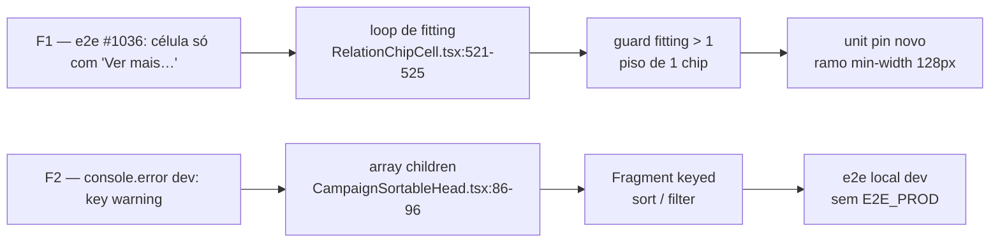

# Impl: UX pós-B32/B34 — chip oculto pelo clamp e key warning do head (débito da entrega #1036)

Status: aprovado
Atualizado em: 2026-09-15
Issue: #1042
Intenção: docs/plans/ux-pos-b32-b34-lista-liderancas-impl.md
Appetite restante: ~0,5 dia eng (herdado — duas fases curtas, sem corte)

## Leitura da intenção

- **Outcome:** a célula de relação nunca esconde **todos** os chips atrás de "Ver mais…" quando há chip (`chips.length > 0` ⇒ piso de 1 visível); e o e2e de `/campanha/liderancas` volta a rodar em **dev local sem `E2E_PROD=1`** (console guard ativo) sem o warning React de key.
- **O que NÃO negociar:** sem schema/migration/Payload config/access/Consent/server action; guard de `console.error` (`tests/e2e/fixtures/e2eTest.ts:70-134`) intocado; nenhuma lista consumidora muda além do comportamento compartilhado; copy pt-BR, identificadores em inglês.
- **O que reavaliar:** a intenção afirma que o colapso a 0 ocorre "com dois chips" — **não é reprodutível**: com 2 chips, `fitting === chips.length` e o loop (`RelationChipCell.tsx:521`) nunca roda. A geometria real é: chips largos preenchendo as linhas (3 chips um por linha, ou 4+ em linhas cheias) numa coluna estreita **com o ramo de `min-width` do input ativo** (128px, `min-w-32`) — aí todo chip de cauda falha o encaixe e `fitting` desce 3→2→1→0, deixando `visibleChips` vazio (`:742-745`) só com o toggle (`:787-815`).

## Abordagem recomendada

**Opções consideradas:** F1: A (piso 1 no loop) | B (extrair o packing para helper puro em `src/lib/*`) | C (toggle virar chip "+N" via `overflowToggleLabel`). F2: A (keys no owner compartilhado) | B (key em cada caller) | C (silenciar o guard).
**Recomendação:** F1-A + F2-A — em F1, `while (fitting > 0 …)` → `while (fitting > 1 …)` no owner da medição, com comentário citando a evidência (Issue #1042); o piso é garantido sem `Math.max(1, fitting)`, que seria código morto (o `fitting` inicial já é ≥1, pois `chipRects[0].top <= lastVisibleTop + 1`). Em F2, chavear os slots no próprio `CampaignSortableHead` corrige LSH e `StateDeputySortableHead` de uma vez e não muda o DOM (Fragment não cria nó).
**Rejeitadas:** F1-B — 1 call site, pass-through raso (DRY <3); o spec unitário já stuba o contrato de DOM e pina a regressão direto, sem módulo novo sem 2º consumidor. F1-C — `overflowToggleLabel` é escolha de display por consumidor e não impede 0 chips (e o clamp/contrato de 3 linhas está pinado). F2-B — twinning: o próximo caller RSC reintroduz o warning. F2-C — proibido pela intenção.

### Componentes / mudanças

- **`RelationChipCell`** (`src/components/campaign/shared/RelationChipCell.tsx:521`): guard do loop → `fitting > 1` + comentário. A linha é `flex-wrap` (`:1102`) e pós-medição `clamping` é `false` (`:751`), então toggle+input caem na linha seguinte quando não cabem ao lado do chip — pior caso 2 linhas, nunca 0 chips. Sem clamp novo.
- **`CampaignSortableHead`** (`src/components/campaign/shared/CampaignSortableHead.tsx:86-96`): `<Fragment key="sort">{labeledSort}</Fragment>` / `<Fragment key="filter">{filter}</Fragment>` (import de valor `Fragment` de `react`, hoje só há import de tipos). Classes `align`/`filter` e o ramo sem `filter` (filho único) intocados; LSH (`LeadershipSortableHead.tsx:51-55`) e `StateDeputySortableHead.tsx:50-58` não são editados.
- **Teste** (`tests/unit/relationChipCellCollapse.unit.spec.tsx`): caso novo com geometria mutável por teste (ver Fase 1). **Migration:** sem migration. **Access / Consent:** N/A (sem escrita/leitura de PII). **UI:** Impeccable B — nenhuma tela nova; sem shape→craft.

## Fases verificáveis

1. **F1 — piso de 1 + pin unitário (~0,3 dia):** editar o loop; no spec, tornar os stubs de geometria mutáveis por teste (`chipsPerLine`/`rowRight`/`inputWidth` lidos pelo stub das linhas 117-128; reset no `afterEach`) e adicionar o caso: 4 chips um-por-linha, `rowRight` estreito, INPUT com rect width > 0 e `vi.spyOn(window, 'getComputedStyle').mockReturnValue({ minWidth: '128px' } as CSSStyleDeclaration)` (restaurar com `vi.restoreAllMocks()`). Com o loop antigo `fitting` chega a 0; com o fix: `chipCount === 1`, chip visível, "Ver mais…" presente e expandir (4) / recolher (1) funciona. Manter os 4 pins existentes verdes (12/16, 8, 12). Rodar `pnpm test:unit tests/unit/relationChipCellCollapse.unit.spec.ts`.
2. **F2 — keys no owner + e2e dev (~0,2 dia):** aplicar os Fragments; rodar **em dev local, sem `E2E_PROD=1`** (guard ativo; qualquer `console.error` falha): `pnpm test:e2e --no-deps -- tests/e2e/campaignLeaderships.e2e.spec.ts` (porta do `.env.test.local` do worktree; receita documentada em `playwright.config.ts:141-153`). Prova: os 2 testes do spec verdes e nenhum outro `console.error` no relatório agregado do guard.
3. **Gates:** `pnpm gate:fast` a cada iteração; `pnpm push` (o skill fecha o PR); entrada única em `docs/changelog/2026-09-15-b32-b34-f1.md`; não commitar agregados nem artefatos de build.

## Rabbit holes / Não escopo (engenharia)

- Não redesenhar o clamp nem alterar o contrato de 3 linhas pinado pelos 4 unit testes; não tocar as 4 listas consumidoras além do compartilhado.
- Não remover/refatorar `expandCollapsedChips()` (`campaignLeaderships.e2e.spec.ts:99-115`) — e2e é discricionário (OPS72) e o débito é a UI.
- Não extrair helper `src/lib/*`, não chavear nos callers, não refatorar outros heads, não silenciar/afrouxar o guard.
- Sem schema, migration, Payload config, access, Consent ou server action.
- **Defer + gatilho — `src/components/campaign/shared/*` fora do manifesto e2e:** um diff de `RelationChipCell`/`CampaignSortableHead` roda só `selected` + smoke `campaignHomeActions` (nunca zero) e a granularidade por domínio é deliberada (`E2E_MANIFEST_DOMAIN_EXEMPT`); mapear acordaria 5+ famílias por diff. Gatilho: 2ª regressão de um arquivo de `campaign/shared/` que escape do PR para o `verify` → mapear esse arquivo às specs consumidoras (precedente `shared/CampaignListOmnibox`).
- **Defer + gatilho — corrida de DDL do `ensureAllocatorSchema` sob workers paralelos (local):** `CREATE TABLE/SEQUENCE IF NOT EXISTS` ainda pode perder para o `23505` embrulhado (o catch em `tests/helpers/campaignMunicipalityAllocator.ts:58` só olha `error.code`); workaround `--workers=1` já documentado. Gatilho: 1ª ocorrência no CI/`verify` ou 2ª local com o workaround → endurecer o catch (`error.cause?.code === '23505'`).
- **Pré-existente (não é deste diff, rastreado na #882):** `campaignPeople.e2e.spec.ts:206` (C131, `Todas as zonas`) falha em dev local também na árvore limpa (mudanças em stash) — owner é a #882.

## Riscos e mitigação

- **Piso de 1 deixa toggle+input na 2ª linha** quando não cabem ao lado do chip: trade-off aceito (linha `flex-wrap`, sem clamp pós-medição; pior caso 2 linhas); os pins 12/16 e 12/12 provam que a geometria larga não regride.
- **Warning F2 de outra origem:** o guard agrega todos os failures; se o e2e apontar outro `console.error`, corrigir o owner — nunca o guard.
- **E2E dev local é caro (cold compile):** usar `--no-deps` e a porta do `.env.test.local`; compilação lenta/falha de ambiente não é regressão do fix.

## Aceite de engenharia

- [ ] Aceite de produto da intenção coberto: `chips.length > 0` ⇒ ≥1 chip no DOM; e2e local dev verde sem `E2E_PROD=1`.
- [ ] Invariantes AGENTS/engineering-standards: sem schema/migration/config/access/Consent/action; guard intocado; ids em inglês e copy pt-BR.
- [ ] Testes de domínio previstos: unit pin do ramo `min-width` (loop antigo → 0) + 4 pins antigos verdes; e2e dev B32/B34 verde; `pnpm gate:fast` verde.

## Decision quality

Score 4/5 — (1) decisões caras (extrair módulo vs. não; key no owner vs. caller) com rejeitadas explícitas; (2) cabe no appetite ~0,5 dia; (3) rabbit holes nomeados; (4) depth check: reusa os owners existentes (medição e head), sem pass-through novo; (5) intenção satisfeita — outcome intocado, só o mecanismo real da F1 foi corrigido na leitura. Não é 5 porque o piso de 1 é pinado por stub de DOM (não pelo layout real); a prova fina fica no e2e quando o conteúdo colapsa.
