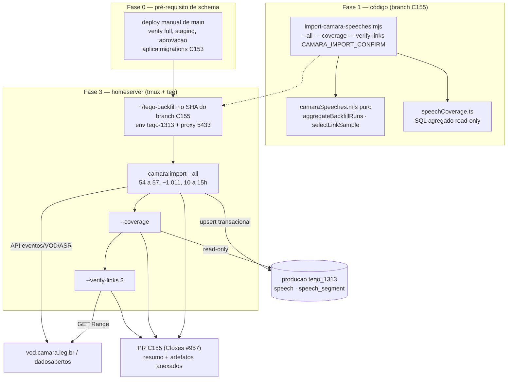

# Impl: Backfill 2011–2026 + import de produção do acervo de falas

Status: em execução
Atualizado em: 2026-09-13
Issue: #957
Intenção: docs/plans/backfill-acervo-falas.md
Appetite restante: herdado (~1–2 dias + tempo de máquina)

## Leitura da intenção

**Outcome.** As 54ª–57ª legislaturas processadas pelo pipeline do C153, gravadas no banco de produção (`teqo_1313`), com relatório honesto de cobertura por legislatura: total, com trecho, com vídeo, com segmentos, sem trecho, fallback e falhas — e links do VOD validados numa amostra. Idempotência comprovada (reexecução não recria, não re-transcreve). O valor é o histórico: "o Solla sempre defendeu isso" só existe com 2011–2023 no catálogo.

**O que NÃO negociar.**

- Guardrail de escrita: só `speech`/`speechSegment` (+ rels de município); nenhum objeto de mídia no S3; crédito CC BY 4.0 mantido no runbook/changelog.
- Idempotência por `sourceKey` (C153) — reexecutar é seguro e é o mecanismo de resume.
- Relatório sem maquiar falha como sucesso: `withoutExcerpt`/`failed` aparecem por legislatura, não somem no total.
- Plenário apenas; nada de UI; nenhuma migration/schema novo (se surgir necessidade, justificar no PR).
- Produção é dado real: o caminho é o runbook, com guard explícito antes de qualquer escrita.

**O que reavaliar.**

- _"Publicar antes ou depois do C154"_: o C154 **não está em main** (changelog até 2026-09-13 só tem C153). A importação não depende do C154 (dados não quebram nada), mas a validação visual do acervo é do C154; se ele não estiver no deploy de main da Fase 3, isso fica registrado como pendência, não como bloqueio (o aceite deste item é dado + cobertura).
- _"54ª incluída"_: sim — 1 discurso, custo ~zero, e é exatamente o caso "fonte antiga sem trecho" que o relatório precisa mostrar (trechos por orador só existem de 2015 em diante, C152).
- _"Fallback YouTube para sessões sem trecho"_: o C153 já grava `youtubeUrl` do evento; "fallback" aqui é **contabilizar** esses casos na cobertura (`fallbackYoutube`), não transcrever outra fonte — isso continua fora de escopo.
- _Orçamento do D8_: os ~777 são "novos além da prova local da 57ª"; em produção o banco parte vazio, então as ~1.011 passam pelo pipeline (a 57ª re-transcreve). O relatório mede e o custo declarado é teto, não promessa.

## Abordagem recomendada

Evoluir o dono do pipeline (`scripts/import-camara-speeches.mjs` + `scripts/lib/*`) com três modos novos — `--all`, `--coverage`, `--verify-links` —, reusar os módulos existentes e operar no homeserver contra o banco de produção **depois** do deploy que aplica a migration do C153 e **antes** do merge do PR, com a prova viva anexada (precedente OPS79).

**Reuso (depth check):** `withPayloadTransaction`/`upsertSpeechBundle` (`src/utilities/speech/speechImport.ts`) para a escrita; `camaraSpeeches.mjs` (puro) e `camaraFetch.mjs` (HTTP/VOD/ASR) para o pipeline; `assertLocalDatabase` + `isTruthyEnv`/`dieWithLabel`/`ensureCachedDownload` de `scripts/lib/cli.mjs`; `recover-media.mjs` como molde de guard (`MEDIA_RECOVER_CONFIRM`), eco de alvo e artefato; `ops79:migrate` como molde de confirmação (`OPS79_MIGRATE_CONFIRM`) e de operação pré-merge; `docs/ops/teqo-1313-deploy.md` §OPS79/§OPS84 como molde de seção de runbook; `drizzleResultRows` + SQL agregado (precedente `supporter/supporterListOverviewAggregate.ts`) para a coverage.

| Opções                                                                                                      | Recomendação                                                                                                               | Rejeitadas                                                                                                                                                                                                                                |
| ----------------------------------------------------------------------------------------------------------- | -------------------------------------------------------------------------------------------------------------------------- | ----------------------------------------------------------------------------------------------------------------------------------------------------------------------------------------------------------------------------------------- |
| **A)** Evoluir o dono: `--all`/`--coverage`/`--verify-links` no import do C153 + utility de coverage + docs | **A** — um CLI, um artefato, caches em memória, agregação pura testável; knip e convenções de script continuam com um dono | **B)** script novo de orquestração + script novo de coverage (segundo CLI/knip/drift, dois lugares para o mesmo bug); **C)** operar só com loop shell no runbook (sem relatório por legislatura como artefato, operador vira o agregador) |

### Decisões de engenharia

#### D1 — Modo `--all` no dono do pipeline (barato; a decisão que importa é não criar twin)

- **Opções:** A) `--all` no `import-camara-speeches.mjs`, loop 54→57 num processo, relatório combinado com `legislatures[]` | B) script novo `backfill-camara-speeches.mjs` chamando o import por legislatura | C) loop shell no runbook concatenando relatórios à mão.
- **Recomendação:** A — o dono do pipeline é o import; um processo preserva os caches `eventsByDate`/`eventPages` entre legislaturas, emite **um** JSON com totais combinados e bucket por legislatura, e mantém `--legislature` como retry direcionado. `--all` é mutuamente exclusivo com `--date` e com `--legislature` explícito; `--limit`/`--skip-transcribe`/`--reclassify` valem por legislatura. Checkpoint do JSON a cada legislatura (perda limitada a uma legislatura se a rede cair); falha dura em uma legislatura registra `aborted` e segue para a próxima, com exit 1 no fim.
- **Rejeitadas:** B — segundo CLI para o mesmo pipeline = drift de flags, mais um entry em `knip.json` (`exports:error`) e duas cópias das mesmas regras; C — sem artefato por legislatura (aceite pede), sem totais combinados e sem caches.

#### D2 — Relatório = métricas do run + cobertura do DB (caro: contrato do artefato; nomes de campo são fill-in)

- **Opções:** A) ao final do `--all`, anexar `coverage` lida do banco por legislatura + modo read-only `--coverage` (sem rede, sem escrita no banco) | B) só o relatório do run | C) script separado `camara-coverage.mjs`.
- **Recomendação:** A — run report conta o que a execução **fez**; coverage conta o que o banco **tem**. Reexecução resumida/parcial torna o run report não representativo do estado, e o aceite pede o retrato do acervo ("quantos têm vídeo, quantos caíram no fallback, o que ficou de fora e por quê"). `getSpeechCoverage(payload)` em `src/utilities/speech/speechCoverage.ts` com **uma** query agregada (`speech LEFT JOIN speech_segment`, `COUNT(*) FILTER`) via `drizzleResultRows`; o `--coverage` reusa a mesma função e é a verificação pós-run em produção.
- **Rejeitadas:** B — não distingue "pulou porque já tinha" de "não tem", não responde fallback; C — twin do script (mesmo problema do D1-B) e o modo read-only ficaria fora do dono.

#### D3 — Guard de escrita em produção (caro de reverter: semântica fail-closed)

- **Opções:** A) `CAMARA_IMPORT_CONFIRM=1` exigido em todo modo que escreve quando `NODE_ENV === 'production'` **ou** host do DB não-local **ou** `ALLOW_REMOTE_DB` setado; `--coverage`/`--verify-links` isentos (read-only); `--skip-transcribe` **não** isenta (escreve metadados) | B) flag CLI nova (`--yes`/`--force`) | C) confiar só no `assertLocalDatabase` + `ALLOW_REMOTE_DB` | D) exigir a flag sempre, inclusive local.
- **Recomendação:** A — precedente literal de `MEDIA_RECOVER_CONFIRM` (`scripts/recover-media.mjs:68,79-85`) e `OPS79_MIGRATE_CONFIRM` (`scripts/migrate-signature-orphan.mjs:46,54-60`). O guard roda **antes** de `getPayload` (nenhuma conexão, nenhuma escrita), ecoa o alvo (host do DB, modo, range) como o recover-media, e o predicado puro `requiresWriteConfirm({ nodeEnv, databaseUrl, allowRemoteDb })` mora em `scripts/lib/cli.mjs` (junto de `LOCAL_HOSTS`, onde a convenção manda) e é unit-testado. O `assertLocalDatabase` permanece como cinto para host remoto explícito, com o hint atualizado para apontar o runbook §C155.
- **Rejeitadas:** B — flag por invocação não sobrevive a wrapper/alias e não descreve o alvo; o repo já tem o vocabulário de env flag; C — o furo nomeado: `LOCAL_HOSTS` inclui `postgres` (host do env file do homeserver) e o runbook usa o proxy socat em `127.0.0.1:5433` — um run acidental em produção **passa silencioso**; D — quebra o DX local (C153 usa `pnpm camara:import` sem cerimônia) sem ganho: o risco é o alvo remoto, não o comando.

#### D4 — Onde e quando o backfill roda (caro: escreve dado real; a ordem é irreversível sem rollback)

- **Opções:** A) homeserver, checkout separado `~/teqo-backfill` no SHA do branch C155, **depois** de um deploy manual de main (aplica a migration do C153) e **antes** do merge do PR, com relatório/prova no PR (precedente OPS79) | B) rodar local (`teqo_wt155`) e copiar tabelas para produção | C) rodar só local e adiar produção | D) rodar do `~/teqo-deploy`.
- **Recomendação:** A — produção está sem as tabelas `speech*` (migration para no batch `20260912_224719_add_activity_public_event`) e sem a revisão C153; o deploy de main é pré-requisito de schema; o checkout separado não contamina o workspace do runner (que segue `main` e é gerenciado pelo deploy); operação antes do merge é o precedente OPS79 — o código do operador não precisa estar publicado para escrever dados. Sequência do runbook: deploy → `git fetch`/checkout do SHA → `pnpm install` → env → tmux.
- **Rejeitadas:** B — ids de `municipality`/rels divergem entre `teqo_wt155` e `teqo_1313` (o upsert resolve slug→id **por banco**), cópia cross-DB artesanal de 3 tabelas sem transação e ASR pago duas vezes; C — falha o aceite "dados disponíveis em produção"; D — o workspace do runner é do deploy; misturar branch de feature contamina o próximo dispatch.

#### D5 — Validação de links do VOD (barato; tamanho/forma da amostra é fill-in com gatilho)

- **Opções:** A) read-only `--verify-links <n>`: n discursos por legislatura (amostragem determinística por índice, estável por `speechAt`+id), playback e download, GET com `Range: bytes=0-1023` e fallback HEAD em 405/501, timeout curto; não-200 = **warning** no artefato; 0 links verificados = exit 1 | B) curl manual no runbook | C) não validar | D) validar os 1.011×2 links.
- **Recomendação:** A — reproduzível, vira artefato e cabe no aceite com `n=3` (12 discursos, ~24 probes). Warning em vez de falha dura porque fonte antiga legitimamente não tem trecho e 404 isolado não invalida o acervo; o fail-closed em "0 verificados" evita verde vazio com rede caída. Implementa `probeVodLink(url)` em `camaraFetch.mjs` e `selectLinkSample(rows, n)` puro em `camaraSpeeches.mjs`.
- **Rejeitadas:** B — não reproduzível e não agrega ao relatório; C — aceite pede explicitamente; D — 2.022 requests sem ganho sobre amostra por legislatura.

#### D6 — Artefato do relatório (barato; forma de guarda é fill-in)

- **Opções:** A) JSONs em `data/camara/reports` (gitignored, `.gitignore:77`) + resumo no changelog + seção nova no runbook + anexo do JSON à Issue #957; **nada commitado** | B) commitar o JSON (ou recorte) no repo | C) só changelog | D) relatório em serviço externo.
- **Recomendação:** A — `data/camara` é gitignored por contrato; o run completo tem `speeches[]` de ~1.011 entradas (grande e regenerável); o runbook é dono do como-fazer, o changelog do o-que-aconteceu. O resumo de coverage (pequeno) vai no corpo do PR; o JSON completo fica no homeserver (`/srv/hdd/teqo-backfill/camara/reports`) e anexado à Issue (upload web). Arquivos: `import-all-<runAt>.json`, `coverage-<runAt>.json`, `verify-links-<runAt>.json`.
- **Rejeitadas:** B — ruído de repo, `format`/knip e conflito garantido a cada reexecução; C — perde detalhe por legislatura/falhas; D — dependência externa sem necessidade.

#### D7 — Testes proporcionais (barato; o corte é fill-in)

- **Opções:** A) unit dos puros (`aggregateBackfillRuns`, `selectLinkSample`, `requiresWriteConfirm`/`isLocalDatabaseUrl`) + int de `speechCoverage` com fixtures | B) e2e/CLI com rede | C) nenhum teste novo (o script não tinha) | D) extrair e testar `parseArgs` inteiro.
- **Recomendação:** A — a aritmética do relatório e a amostragem são puras e falham em silêncio sem teste; o guard é segurança e vira predicado puro em `scripts/lib/cli.mjs`, unit-testado ao lado de `cliEnvFlags.unit.spec.ts`; a coverage é SQL agregado, provado por int com fixtures cobrindo legislaturas diferentes, com/sem trecho, com/sem segmento e fallback YouTube (`tests/int/speechCoverage.int.spec.ts`, padrão do `speechImport.int.spec.ts`). Somar aos 31 unit do módulo Câmara.
- **Rejeitadas:** B — flaky, custo real de ASR e sem retorno sobre o unit; C — agregação pode somar errado sem ninguém ver; D — extrair a CLI inteira para testar parsing trivial é desproporcional (fill-in futuro se `parseArgs` crescer).

#### D8 — Forma da execução longa (barato; wall clock é física)

- **Opções:** A) um processo `--all` sequencial, desatendido em tmux/nohup com `tee`, checkpoint por legislatura, reexecução idempotente como resume | B) paralelizar discursos | C) uma sessão por legislatura | D) chunk por `--date`/ano.
- **Recomendação:** A — ~1.011 × ~46s ≈ 13h de parede (10–15h com overhead), sem rate-limit storm contra a Câmara/Deep Infra; caches em memória e um artefato. Reexecutar `--all` (ou `--legislature N`) pula ASR/LLM do que já está no banco (`segmentCount > 0` e `classifiedBy === 'llm'`). Orçamento declarado: ASR ≈ US$0,45–0,60 (Whisper large-v3 a US$0,00045/min; C152 mediu US$0,0006–0,0021/discurso) + LLM ≈ US$0,07, medidos no relatório. A 57ª re-transcreve em produção (banco vazio; segmentos locais não são transferidos — D4-B).
- **Rejeitadas:** B — concorrência sem necessidade, retry storms e relatório de falhas confuso; C — perde caches e agregação combinada, operador vira orquestrador; D — fragmenta o relatório sem mudar custo.

### Componentes / mudanças

| Arquivo                                         | Mudança                                                                                                                                                                                                                                                                                                                                                                                       |
| ----------------------------------------------- | --------------------------------------------------------------------------------------------------------------------------------------------------------------------------------------------------------------------------------------------------------------------------------------------------------------------------------------------------------------------------------------------- |
| `scripts/import-camara-speeches.mjs` (dono)     | Flags `--all` (mutex com `--date`/`--legislature` explícito) e modos `--coverage`/`--verify-links <n>`; loop 54→57 com checkpoint JSON por legislatura; `coverage` anexada ao relatório final; guard `CAMARA_IMPORT_CONFIRM` (D3) antes de `getPayload`; eco do alvo; falha por legislatura não aborta o run inteiro; `HELP` atualizado; hint do `assertLocalDatabase` aponta o runbook §C155 |
| `scripts/lib/camaraSpeeches.mjs` (puro)         | `aggregateBackfillRuns(runs)` (somas de `totals`/`asr`/`llm`/`elapsedMs`, por legislatura e combinado) e `selectLinkSample(rows, n)` (amostragem determinística)                                                                                                                                                                                                                              |
| `scripts/lib/camaraFetch.mjs` (HTTP)            | `probeVodLink(url)` — GET `Range: bytes=0-1023`, fallback HEAD, status/content-type/bytes, erro de rede = warning                                                                                                                                                                                                                                                                             |
| `scripts/lib/cli.mjs` (CLI)                     | `isLocalDatabaseUrl(url)` e `requiresWriteConfirm({ nodeEnv, databaseUrl, allowRemoteDb })` puros; `assert-local-database.mjs` passa a consumir `isLocalDatabaseUrl` (refactor mínimo, semântica intacta)                                                                                                                                                                                     |
| `src/utilities/speech/speechCoverage.ts` (novo) | `getSpeechCoverage(payload)` — query agregada por legislatura: `total`, `withExcerpt` (`audio_id`), `withVideo` (`vod_playback_url`), `withSegments` (`speech_segment` > 0), `withoutExcerpt`, `withoutSegments`, `fallbackYoutube` (`audio_id` nulo e `youtube_url` presente) + totais                                                                                                       |
| `tests/unit/camaraSpeeches.unit.spec.ts`        | + unit de `aggregateBackfillRuns`/`selectLinkSample`                                                                                                                                                                                                                                                                                                                                          |
| `tests/unit/cliEnvFlags.unit.spec.ts`           | + unit de `requiresWriteConfirm`/`isLocalDatabaseUrl`                                                                                                                                                                                                                                                                                                                                         |
| `tests/int/speechCoverage.int.spec.ts` (novo)   | fixtures de `speech`/`speechSegment` cobrindo os buckets; cleanup no `afterAll`                                                                                                                                                                                                                                                                                                               |
| `docs/ops/teqo-1313-deploy.md`                  | Seção `## C155 — backfill do acervo de falas em produção`: pré-requisito (deploy com migration C153), comandos, resultado e rollback                                                                                                                                                                                                                                                          |
| `docs/changelog/2026-09-13-c155.md` (novo)      | Entrada curta com os números medidos (preenchida na Fase 4)                                                                                                                                                                                                                                                                                                                                   |

Sem migration, sem schema, sem access, sem UI, sem `package.json` (o `pnpm camara:import` já existe). Nenhuma escrita fora de `speech`/`speechSegment`/`speech_rels`.

### Dados → forma (relatório)

**Coverage (por legislatura + totais):**

| Campo             | Definição                                | Responde                                |
| ----------------- | ---------------------------------------- | --------------------------------------- |
| `total`           | discursos da legislatura no banco        | tamanho do acervo                       |
| `withExcerpt`     | `audio_id` não nulo                      | trecho identificado na página do evento |
| `withVideo`       | `vod_playback_url` não nulo              | tem vídeo (VOD)                         |
| `withSegments`    | ≥1 `speechSegment`                       | tem transcrição minutada                |
| `withoutExcerpt`  | `audio_id` nulo                          | o que ficou de fora                     |
| `withoutSegments` | 0 segmentos                              | pendência de transcrição                |
| `fallbackYoutube` | `audio_id` nulo e `youtube_url` presente | "quantos caíram no fallback"            |

**`--all` (JSON):** `{ runAt, mode: 'all', options, legislatures: [{ legislature, range, totals, asr, llm, elapsedMs, aborted, speeches[], failures[] }], totals/asr/llm/elapsedMs combinados, coverage }`. O modo `--legislature`/`--date` mantém o shape do C153 e ganha `coverage` no fim (compatível com o artefato existente).

**Impressão (stdout):** bloco por legislatura (`listados · processados (criados/atualizados) · com trecho/sem trecho · com segmentos · ASR min e US$ · LLM tokens e US$ · tempo · falhas`), linha combinada, tabela de coverage e falhas listadas com `speechAt`/`stage`/mensagem.

**`--verify-links` (JSON):** `{ runAt, sample: { perLegislature, total }, checked: [{ legislature, speechId, kind: 'playback'|'download', url, status, ok, note }], ok, warnings, elapsedMs }`. Não-200 entra em `warnings`; `checked.length === 0` → exit 1.

**Destino:** resumo de coverage + verify-links no corpo do PR e no changelog; JSON completo do run anexado à Issue #957; nada em git; runbook registra os números e o rollback.

## Fases verificáveis

**Fase 0 — Pré-flight (0,5h, zero escrita).**
Confirmar no homeserver: revision do container `teqo-1313`; `payload_migrations` com `20260913_001112_add_speech_catalog` e `20260913_001200_add_speech_segment_trgm_index`; tabelas `speech`/`speech_segment`/`speech_rels` existindo e vazias. Checar C154 em main (registrar se ausente). Garantir `DEEPINFRA_API_KEY` (em `~/stack/.env` ou adicionar a `~/stack/teqo-1313.env`, chmod 600) — o modo de escrita sem `--skip-transcribe` passa a falhar cedo sem a chave. Definir `--out /srv/hdd/teqo-backfill/camara` (394GB; não encher `/`).
_Prova:_ saída dos dois checks de migration/tabela + chave presente (sem eco).

**Fase 1 — Código (0,5–1 dia).**
Implementar D1–D3, D5, D7. Smoke local em `teqo_wt155`: `pnpm camara:import --all --limit 2` (7 discursos, ASR real, ~6–8 min) → relatório com 4 buckets + coverage; reexecutar o mesmo comando → **0 criados, 0 ASR** (idempotência viva); `--coverage` sem rede; `--verify-links 1`.
_Quota:_ sem migration; ~120 linhas somadas entre script/lib/utility; `pnpm gate:fast` verde; unit novos verdes; int de coverage verde.

**Fase 2 — Docs (0,5h).**
Seção do runbook (pré-requisito, comandos, rollback) + changelog stub (números reais entram na Fase 4).
_Quota:_ ≤ ~80 linhas de runbook; `pnpm format`/lint verdes.

**Fase 3 — Ops no homeserver (≈1h preparo + 10–15h máquina + ≈1h validação).**
3.0 Deploy manual de main (`workflow_dispatch`: verify full → staging → aprovação → produção) — aplica a migration do C153.
3.1 `~/teqo-backfill`: clone/fetch de `github.com/fsolla/teqo.git`, checkout do SHA do branch C155, `pnpm install`.
3.2 Env: `set -a; source ~/stack/teqo-1313.env; set +a`; `export DATABASE_URL="${DATABASE_URL/@postgres:5432/@127.0.0.1:5433}"` (proxy `teqo-1313-build-proxy`); `export CAMARA_IMPORT_CONFIRM=1`; tmux + `tee ~/c155-backfill-<data>.log`.
3.3 Smoke de produção com idempotência viva: `--all --limit 1` (4 discursos) e repetir → segunda passada **0 criados, 0 ASR**; coverage = 4.
3.4 `--all` completo (checkpoint por legislatura; se abortar, retomar com `--all` ou `--legislature N`).
3.5 `--coverage` e `--verify-links 3` (12 discursos, ~24 probes).
3.6 Coletar artefatos e o log.
_Prova:_ coverage total = 1.011 (54ª=1, 55ª=362, 56ª=414, 57ª=234); warnings de links documentados; log do tmux arquivado.

**Fase 4 — Fechamento (≈1h).**
Atualizar changelog com números medidos; runbook com resultado + rollback; anexar JSONs à Issue #957; resumo no corpo do PR. Gates: `pnpm gate:fast`, `pnpm knip`, cycles, `pnpm typecheck`, `test:unit`, `test:int`; e2e esperado `none` (script/docs fora dos prefixos de risco — `ci-scope` decide; se cair em `unmapped-risk`, adicionar mapping). Push + PR `Closes #957` + auto-merge.
_Quota:_ 1 PR; prova: check `checks` verde.

## Ajustes descobertos na execução

- **Fase 3.0 cumprida por outro deploy.** A C154 (`3e062749`) mergeou em `main` e o deploy manual de 2026-09-13 publicou `424ee311` em produção — o schema do C153 (`speech`/`speech_segment` + migrations `20260913_001112`/`001200`) e o `searchText` da C154 já estão no `teqo_1313`. Nenhum deploy novo é pré-requisito do backfill; o workspace `~/teqo-deploy` também já está no SHA novo.
- **Rede da workstation para a Câmara instável** (hangs/HTTP 500 na API em 2026-09-13 à tarde; o homeserver responde 200 em ~2s). O smoke local da Fase 1 vira o smoke de produção da Fase 3.3 (mesmo código, rede confiável); unit/int locais continuam sendo o gate de lógica.
- **Paginação do import ganhou backoff** (`fetchJsonWithBackoff`, 5 tentativas com espera exponencial até 30s) porque a API devolveu 500 na página 4 da 55ª durante o smoke — o comportamento de abortar só a legislatura e seguir continua, agora com mais paciência.
- **Cache/mídia do run de produção** em `--out /srv/hdd/backups/teqo-camara` (`/srv/hdd` é root-owned; `backups/` é do usuário — 392 GB livres).
- **Smoke de produção (2026-09-13, `teqo_1313`):** `--all --limit 1` processou 54ª/56ª/57ª (2 ASR, ~US$0,003) e abortou só a 55ª (HTTP 500 persistente na página 4 da listagem da API — não é o import). Reexecução do mesmo comando: **0 criados, 0 ASR, 0 LLM** (idempotência viva em produção); coverage do banco bateu com o relatório. O guard `CAMARA_IMPORT_CONFIRM=1` foi exercitado (sem a flag, o run morre antes de conectar).
- **Run completo em tmux no homeserver** (`c155-run.log` + JSONs em `/srv/hdd/backups/teqo-camara/reports/`), ~13h estimadas; 55ª será retomada com `--legislature 55` (a API precisa recuperar a página 4).

## Rabbit holes / Não escopo (engenharia)

- Comissões/audiências e segunda fonte de transcrição (YouTube próprio) — **não**; `youtubeUrl` do evento já é metadado, não vira pipeline.
- Espelhar mídia no S3, gerar clipes, corrigir sessão sem trecho à mão — **não**.
- Scheduler/recorrência — **não**; execução manual documentada.
- Paralelizar o pipeline ou otimizar wall clock — **não** (D8-A).
- Copiar ASR/segmentos do worktree local para produção ou reconciliar ids entre DBs — **não** (D4-B).
- Migration/schema novo, access novo, UI — **não**; se algo exigir, justificar no PR antes de fazer.
- Commitar JSON de relatório — **não** (D6).
- Extrair `parseArgs` para teste — **não** agora (D7-D).

## Riscos e mitigação

| Risco                                                                     | Mitigação                                                                                                                                   |
| ------------------------------------------------------------------------- | ------------------------------------------------------------------------------------------------------------------------------------------- |
| Migration C153 não aplicada em produção (fato: batch 52) → escrita falha  | Fase 3.0 deploy de main **antes** de qualquer run; Fase 0 confere migration + tabelas                                                       |
| `DEEPINFRA_API_KEY` ausente no homeserver (fato)                          | Adicionar ao env file na Fase 0; o modo de escrita sem `--skip-transcribe` falha cedo e claro                                               |
| Guard furado pelo proxy `127.0.0.1`/host `postgres`                       | D3: confirm por `NODE_ENV=production` + host + `ALLOW_REMOTE_DB`; eco do alvo; smoke de produção com re-run antes do run completo           |
| Queda de rede/SSH durante 10–15h                                          | tmux + `tee`; checkpoint por legislatura; resume idempotente (`--all` ou `--legislature N`); falha de uma legislatura não derruba as demais |
| Disco `/` enche com MP4/HTML cacheados                                    | `--out /srv/hdd/teqo-backfill/camara` (394GB livres); cache de eventos no mesmo destino                                                     |
| Sessões antigas sem trecho/HTML fora do padrão (54ª inteira, 55ª parcial) | Não é falha: vira `withoutExcerpt`/`withoutSegments`/`fallbackYoutube` no coverage e pendência documentada; nenhuma correção manual         |
| Custo acima do orçamento                                                  | Relatório mede ASR/LLM por legislatura; teto declarado ~US$0,7; `--skip-transcribe` disponível para re-runs de metadados                    |
| Memória do processo (caches `eventsByDate`/`eventPages`) em 8c/15GB       | Monitorar no run; fallback: rodar por `--legislature` (o checkpoint já é natural)                                                           |
| Escrita concorrente com o app em produção                                 | Escrita confinada a `speech`/`speechSegment`/rels, transacional, sem locks de outras tabelas; janela de baixa atividade                     |
| Reexecução acidental pós-run (tempo/custo)                                | Idempotência + coverage + guard; re-run é seguro, mas exige a flag e custa wall clock                                                       |
| C154 não está em main                                                     | Dados ficam prontos; validação visual registrada como pendência do C154, não bloqueio deste item                                            |
| Colisão de `sourceKey` (vista na 57ª)                                     | Já resolvida no C153 por hash de conteúdo; o relatório marca `suffixedKey`                                                                  |

## Aceite de engenharia (checklist)

- [ ] `--all` processa 54→57 num processo, com `legislatures[]` + totais combinados + `coverage`; mutex com `--date`/`--legislature` explícito; checkpoint por legislatura.
- [ ] Idempotência comprovada: reexecução de `--all --limit 1` em produção e do smoke local resultam em 0 criados e 0 chamadas ASR.
- [ ] `--coverage` é read-only no banco e sem rede; imprime por legislatura (total, com trecho, com vídeo, com segmentos, sem trecho, sem segmentos, fallback YouTube) + totais.
- [ ] `CAMARA_IMPORT_CONFIRM=1` exigido para escrita com `NODE_ENV=production`, host remoto ou `ALLOW_REMOTE_DB`; fail-closed antes de `getPayload`; `--coverage`/`--verify-links` isentos; `--skip-transcribe` não isento; alvo ecoado.
- [ ] `--verify-links <n>` amostra n por legislatura, GET Range com fallback HEAD, warnings não fatais, 0 verificados = exit 1.
- [ ] Nenhuma escrita fora de `speech`/`speechSegment`/`speech_rels`; nenhum objeto no S3; CC BY 4.0 no runbook/changelog.
- [ ] Unit novos (agregação, amostragem, guard) e int de `speechCoverage` com fixtures, verdes.
- [ ] `pnpm gate:fast` + knip + cycles + typecheck + unit + int verdes; e2e conforme `ci-scope` (esperado `none`; `unmapped-risk` tratado).
- [ ] Produção com 1.011 discursos (54ª=1, 55ª=362, 56ª=414, 57ª=234) e migration C153 aplicada; coverage pós-run bate com o relatório do run.
- [ ] `--verify-links 3` na amostra sem falha dura; warnings e sessões sem trecho documentados como pendência.
- [ ] Relatórios anexados à Issue #957; resumo no corpo do PR; `docs/changelog/2026-09-13-c155.md` e seção C155 no runbook com resultado e rollback (`DELETE` em `speech_segment`/`speech_rels`/`speech`, ou re-run idempotente).
- [ ] Nenhuma migration nova; nenhum arquivo de `data/camara/` commitado; `Closes #957` no PR com auto-merge armado.

## Self-score decision-quality

| Item                                                                                                              | Nota | Justificativa                                                                                                                                             |
| ----------------------------------------------------------------------------------------------------------------- | ---- | --------------------------------------------------------------------------------------------------------------------------------------------------------- |
| Decisões caras (guard de escrita, sequência da operação, contrato do relatório/coverage) decididas explicitamente | 5    | D3/D4/D2 têm opções, recomendação e rejeitadas; o barato (nomes de campo, n da amostra) ficou como fill-in com gatilho                                    |
| Reuso dos donos existentes (depth check)                                                                          | 5    | `import-camara-speeches.mjs`, `camaraSpeeches`/`camaraFetch`, `cli.mjs`, `speechImport`, `recover-media`/OPS79 como molde, `drizzleResultRows` — sem twin |
| Formato Opções/Recomendação/Rejeitadas em todas as decisões                                                       | 5    | D1–D8 no formato obrigatório, com rejeitadas justificadas (não decorativas)                                                                               |
| Fases verificáveis com quota e prova por fase                                                                     | 4    | Cada fase tem quota e prova; a estimativa de wall clock (10–15h) é probabilística e a fase 3 depende do deploy manual                                     |
| Riscos com mitigação e rollback idempotente                                                                       | 4    | 12 riscos mapeados com mitigação; rollback por DELETE/re-run documentado, mas depende de operador humano no homeserver                                    |

Média: **4,6** (≥4).
